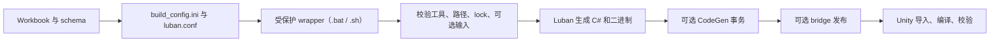

# Luban DataTable 代码生成

[English](./README.md) | 简体中文

本目录是 `CycloneGames.DataTable` 基于 Luban 的代码生成管线。给定一组 Excel workbook 和一份 schema 定义，它产出 Unity client、server 和 combined 三类 target 的 C# 表访问器和二进制数据。

所有生成文件都是构建产物。`Datas/` 下的 workbook 和 `luban.conf` 是权威输入——改输入，跑管线，输出就是确定的。

## 目录

- [概述](#概述)
- [管线](#管线)
- [快速上手](#快速上手)
- [配置说明](#配置说明)
- [命令参考](#命令参考)
- [输出安全](#输出安全)
- [CI 用法](#ci-用法)
- [故障排查](#故障排查)

## 概述

管线有三个输出 target — `client`（输出到 Unity C# + StreamingAssets）、`server`（独立 C# + 数据）和 `all`（两组合并）。各自有独立的输出根目录。两个受保护的 wrapper 脚本（Windows 用 `.bat`，macOS/Linux 用 `.sh`）在 Luban 启动前校验路径、获取文件系统 writer lock、拒绝不安全配置。两个 wrapper 都不会打包进 Unity Player。

基础管线跑通后，两个可选功能可以解锁：

- **C# 常量生成**（`CycloneGames.DataTable.CodeGen`）——读取选定的表列，生成强命名 C# 常量，让 Gameplay 代码引用 `GameplayTags.Ability_Fireball` 而不是字符串 `"Ability.Fireball"`。
- **自定义模板和 bridge 文件**——在生成的代码旁发布有界模板输出，带所有权追踪防止误覆盖。

### 目录布局

```text
DataTable/Luban/
  build_config.ini                        # 路径和构建设置
  luban.conf                              # 内容分组、schema 来源、输出 target
  DataTableBuildSafety.ps1                # PowerShell 安全辅助
  gen_code_bin_to_project_lazyload.bat    # Windows 入口
  gen_code_bin_to_project_lazyload.sh     # macOS/Linux 入口
  Datas/                                  # Schema 和业务 workbook
    __tables__.xlsx
    __beans__.xlsx
    __enums__.xlsx
  Defines/                                # 可选 define workbook
  Generated/                              # Server 和 combined 输出
    Server/Code/    Server/Data/
    All/Code/       All/Data/
```

默认 client 输出路径：

| 产物 | 路径 |
| --- | --- |
| 生成 C# | `UnityStarter/Assets/UnityStarter/Scripts/Generated/DataTable/` |
| 二进制数据 | `UnityStarter/Assets/StreamingAssets/DataTable/` |

Server 和 combined 输出留在 `DataTable/Luban/Generated/` 下。wrapper 只接受这些已批准根目录或它们的子目录——改 `build_config.ini` 里的路径不会扩大已批准集合。

## 管线



wrapper 在首个失败阶段就停。成功退出只表示每个启用阶段执行完毕——不替代 Unity 编译或运行时数据校验。

## 快速上手

所有命令从 `<repo-root>` 执行。

### 前置条件

- Luban 放在 `Tools/DataTable/Luban/Luban.dll`（Windows 也可用同目录的 `Luban.exe`）。
- 兼容的 `dotnet` 运行时。启用 CodeGen 还需 .NET 8 SDK。
- Schema workbook 在 `DataTable/Luban/Datas/` 下：`__tables__.xlsx`、`__beans__.xlsx`、`__enums__.xlsx`。
- `__tables__.xlsx` 里引用的所有业务 workbook。

### 1. 校验不生成

Windows：
```bat
DataTable\Luban\gen_code_bin_to_project_lazyload.bat --no-pause --validate-only
```

macOS/Linux：
```bash
bash DataTable/Luban/gen_code_bin_to_project_lazyload.sh --validate-only
```

检查 target、需要的工具和 workbook、输出根目录、writer lock 和可选配置——不生成或发布任何东西。

### 2. 生成 client 代码和数据

Windows：
```bat
DataTable\Luban\gen_code_bin_to_project_lazyload.bat --no-pause
```

macOS/Linux：
```bash
bash DataTable/Luban/gen_code_bin_to_project_lazyload.sh
```

默认：`client` target，`cs-bin` code，`bin` data。

### 3. 在 Unity 中验证

1. 打开 Unity，等导入和编译完成。
2. 确认生成 C# 在配置的代码根目录下。
3. 确认数据文件在配置的数据根目录下。
4. 运行 DataTable 和业务集成 EditMode 测试。
5. 通过业务 composition root 加载代表性数据。

生成的文件不是手工编辑的。改 workbook、schema、模板或配置后重新跑。

## 配置说明

### luban.conf — target 和分组

```json
{
  "groups": [
    { "names": ["c"], "default": true },
    { "names": ["s"], "default": false }
  ],
  "schemaFiles": [
    { "fileName": "Defines", "type": "" },
    { "fileName": "Datas/__tables__.xlsx", "type": "table" },
    { "fileName": "Datas/__beans__.xlsx", "type": "bean" },
    { "fileName": "Datas/__enums__.xlsx", "type": "enum" }
  ],
  "dataDir": "Datas",
  "targets": [
    { "name": "client", "manager": "Tables", "groups": ["c"], "topModule": "UnityStarter.GameConfig" },
    { "name": "server", "manager": "Tables", "groups": ["s"], "topModule": "UnityStarter.GameConfig" },
    { "name": "all",    "manager": "Tables", "groups": ["c","s"], "topModule": "UnityStarter.GameConfig" }
  ]
}
```

| 字段 | 作用 |
| --- | --- |
| `groups` | 内容可见性分组——workbook 行标有分组标签 |
| `schemaFiles` | Define、table、bean 和 enum schema 来源 |
| `dataDir` | 业务 workbook 所在目录 |
| `targets[].name` | `client`、`server` 或 `all`——对应 wrapper `-t` 值 |
| `targets[].manager` | 生成的 table-set 管理器类名 |
| `targets[].groups` | 本 target 包含的分组 |
| `targets[].topModule` | 生成代码的根命名空间 |

改 `manager`、`topModule`、表名或分组会改变生成的 API。同一提交中重新生成所有受影响 target 并更新所有调用方。

### build_config.ini — 路径和设置

路径相对于 `DataTable/Luban/`。

```ini
[paths]
luban_dll=../../Tools/DataTable/Luban/Luban.dll
client_code_out=../../UnityStarter/Assets/UnityStarter/Scripts/Generated/DataTable/
client_data_out=../../UnityStarter/Assets/StreamingAssets/DataTable/
server_code_out=../../DataTable/Luban/Generated/Server/Code/
server_data_out=../../DataTable/Luban/Generated/Server/Data/
all_code_out=../../DataTable/Luban/Generated/All/Code/
all_data_out=../../DataTable/Luban/Generated/All/Data/

[templates]
custom_template_dir=
bridge_files=

[build]
target=client
code_target=cs-bin
data_target=bin
clean_output=false
clean_orphan_meta=false
line_ending=crlf

[codegen]
codegen_project=../../UnityStarter/Assets/ThirdParty/CycloneGames/CycloneGames.DataTable/Tools~/CodeGen/CycloneGames.DataTable.CodeGen.csproj
string_constant_tables=
string_constant_value_column=name
string_constant_comment_column=comment
string_constant_enabled_column=enabled
string_constant_scope_column=scope
string_constant_generated_comment_language=en
```

| Key | 作用 |
| --- | --- |
| `luban_dll` | Luban 所在路径 |
| `client_*_out` / `server_*_out` / `all_*_out` | 各 target 的代码和数据根目录 |
| `target` | 默认：`client`、`server` 或 `all` |
| `code_target` / `data_target` | Luban 生成器模式 |
| `clean_output` | 告诉 Luban 生成前清理（`true`/`false`/`1`/`0`） |
| `clean_orphan_meta` | 生成后清理孤立的 Unity `.meta` 文件 |
| `line_ending` | 生成文本文件的行尾：`crlf` 或 `lf` |
| `custom_template_dir` | `DataTable/Luban/` 下的模板目录 |
| `bridge_files` | 模板目录下的逗号分隔文件列表 |
| `codegen_project` | 可选 CodeGen 的 .NET 项目 |
| `string_constant_*` | 常量生成的表选择和列映射 |

### Target 输出

| Target | 分组 | 输出位置 |
| --- | --- | --- |
| `client` | `c` | Unity 生成代码和 StreamingAssets |
| `server` | `s` | `DataTable/Luban/Generated/Server/` |
| `all` | `c` 和 `s` | `DataTable/Luban/Generated/All/` |

保持输出分离。Server 应通过自己的文件服务编译生成 C# 和加载数据——不应因为 client 输出在 `Assets/` 下就依赖 Unity asset API。

## 命令参考

所有命令从 `<repo-root>` 执行。

### 选项

| 选项 | 含义 |
| --- | --- |
| `-t client\|server\|all` | 覆盖配置的 target |
| `-c <code-target>` | 覆盖 Luban code generator |
| `-d <data-target>` | 覆盖 Luban data generator |
| `--validate-only` | 仅安全检查——不生成、不清理 |
| `-h`、`--help` | 打印帮助 |

```bash
bash DataTable/Luban/gen_code_bin_to_project_lazyload.sh -t server -c cs-bin -d bin
```

Windows `.bat` 额外支持 `--pause` / `--no-pause`。设 `CI=1` 或 `CYCLONE_DATATABLE_NO_PAUSE=1` 跳过交互式暂停；`CYCLONE_DATATABLE_PAUSE=1` 强制。未知选项或缺失值以非零码退出。

## 输出安全

### 清理默认锁定

正常运行保持破坏性清理关闭：
```ini
clean_output=false
clean_orphan_meta=false
```

在已审查、已备份的运行中授权破坏性清理：
```text
CYCLONE_DATATABLE_ALLOW_DESTRUCTIVE_CLEAN=1
```

这是门槛，不是保险。设之前先备份输入、确认输出根目录。

### 文件系统 writer lock

两个 wrapper 在生成前获取 `DataTable/Luban/.cyclonegames-datatable-writer.lock/owner.txt`。锁冲突时 fail-closed——wrapper 不会猜旧锁是否安全。默认的 Unity Editor runner 走受保护 wrapper，参与同一个锁。直接调 `Luban.dll` 或 CodeGen 不走锁——别在相同输出根目录上并发。

### 自定义模板和 bridge 文件

`custom_template_dir` 必须是 `DataTable/Luban/` 的物理子目录——拒绝符号链接、junction 和外部路径。

`bridge_files` 是该目录下的逗号分隔相对路径。每个文件：
- 使用可移植正斜杠路径。
- 按 basename 复制到代码输出根目录。
- 内容相同时不覆盖。
- 单文件限 16 MiB，总量 256 文件、64 MiB。

### 字符串常量生成

指定 Luban 表和列：
```ini
string_constant_tables=GameplayTags.TbGameplayTagDefinition
```

wrapper 在 Luban 成功后运行 CodeGen，条件是 `string_constant_tables` 非空（或前次运行的 manifest 存在用于调和）。详见 [CodeGen README](../../UnityStarter/Assets/ThirdParty/CycloneGames/CycloneGames.DataTable/Tools~/CodeGen/README.md)。

### Runtime 加载

生成数据通过你的 composition root 到达 Gameplay 代码：
1. 选一个平台合适的字节加载器。
2. 在大分配前执行 `DataTableLoadLimits`。
3. 校验 `DataTableManifest` 版本、大小和 SHA-256。
4. 通过 integration factory 构建 Luban table set。
5. 校验必需表、行约束和跨表引用。
6. 创建类型化 `DataTableCatalog` 并原子化发布。

Runtime 概念：[CycloneGames.DataTable README](../../UnityStarter/Assets/ThirdParty/CycloneGames/CycloneGames.DataTable/README.md)。标签集成：[GameplayTags.DataTable README](../../UnityStarter/Assets/ThirdParty/CycloneGames/CycloneGames.GameplayTags.DataTable/README.md)。

## CI 用法

可复现的 CI 任务：

1. 干净 checkout。
2. 安装固定版本的 .NET 和 Luban。
3. 确认 `Datas/`、`Defines/`、`luban.conf`、`build_config.ini` 存在。
4. `--validate-only`。
5. 关闭破坏性设置生成。
6. 编译生成 C#。
7. 跑 DataTable 和集成测试。
8. Diff 生成输出与策略——意外差异视为失败。
9. 归档日志和输出哈希。

Windows CI：
```bat
set CI=1
DataTable\Luban\gen_code_bin_to_project_lazyload.bat --no-pause --validate-only
if errorlevel 1 exit /b %errorlevel%
DataTable\Luban\gen_code_bin_to_project_lazyload.bat --no-pause
```

macOS/Linux CI：
```bash
bash DataTable/Luban/gen_code_bin_to_project_lazyload.sh --validate-only
bash DataTable/Luban/gen_code_bin_to_project_lazyload.sh
```

## 故障排查

| 现象 | 处理 |
| --- | --- |
| `Luban.dll` 找不到 | 装到配置路径；确认 `dotnet` 可用 |
| Schema workbook 缺失 | 在 `Datas/` 下添加 `__tables__.xlsx`、`__beans__.xlsx`、`__enums__.xlsx` |
| Target 被拒绝 | 用 `client`、`server` 或 `all`；配置两组输出根目录 |
| 输出根目录被拒绝 | 用已批准根目录；保持代码/数据分离；移除符号链接 |
| 清理被拒绝 | 保持默认，或为已备份运行设置环境门槛 |
| Writer lock 存在 | 确认所有 writer 已停；检查 `owner.txt`；移除锁目录 |
| Bridge 发布失败 | 检查模板内含关系、命名、容量限制、碰撞 |
| CodeGen 不跑 | 设 `string_constant_tables` 或确认 manifest 存在 |
| Unity 编译失败 | 检查命名空间、后端引用、重复输出、schema 同步 |
| Runtime 加载失败 | 检查 manifest 版本、数据哈希、加载限制、表列表 |