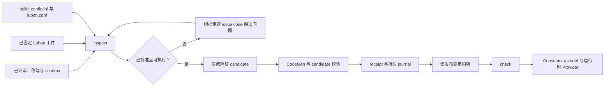

# Luban DataTable 构建与运维指南

[English](./README.md) | 简体中文

本目录是 Luban DataTable 代码与二进制数据的仓库可见配置、生成和发布入口。本指南是首次配置、数据制作、profile、Unity Inspector 操作、命令行操作、输出程序集归属、CI、事务与恢复的用户级规范文档。运行时表 API 与 Provider 组合详见 [CycloneGames.DataTable 包指南](../../UnityStarter/Assets/ThirdParty/CycloneGames/CycloneGames.DataTable/README.SCH.md)。

仓库内置配置采用失败关闭策略：`build_config.ini` 包含 `REPLACE_WITH_APPROVED_...` 身份占位值，权威工作簿集合与已批准 Luban 工件也可能尚未放入仓库。因此在完成下述配置前，`inspect` 会报告 `status: "blocked"`，Unity Inspector 会显示 **SETUP REQUIRED**。这是预期状态；不要通过编造哈希、删除事务证据或直接写入已发布输出根目录来绕过问题。

## 1. 系统模型


```mermaid
flowchart LR
    A["已评审工作簿与 schema"] --> B["inspect"]
    C["已固定 Luban 工件"] --> B
    D["build_config.ini 与 luban.conf"] --> B
    B --> E{"已批准且可执行？"}
    E -- "否" --> F["根据稳定 issue code 解决问题"]
    F --> B
    E -- "是" --> G["生成隔离 candidate"]
    G --> H["CodeGen 与 candidate 校验"]
    H --> I["receipt 与持久 journal"]
    I --> J["仅发布变更内容"]
    J --> K["check"]
    K --> L["Consumer asmdef 与运行时 Provider"]
```

系统包含四个所有权边界：

1. `DataTable/Luban/` 负责源配置、工作簿、身份审批与事务协调。
2. `CycloneGames.DataTable/Tools~/CodeGen` 负责纯 .NET 的解析、生成协调、receipt、发布与恢复，不使用 Unity API。
3. 配置的代码与数据根目录共同拥有一个已发布 generation；receipt 是两个根目录的精确文件与哈希清单。
4. 项目的组合程序集负责生成代码的编译，以及运行时数据获取与解码。生成流程不会替项目选择 Resources、Addressables、YooAsset、网络服务或文件系统 Provider。

Luban 只会收到事务 candidate 路径，不会收到 live output 路径。发布前会关闭、枚举、限制并哈希所有 candidate 文件。内容未变化的文件不会被重写，因此会保留时间戳与 Unity `.meta` 身份。

## 2. 前置条件与目录布局

从 `<repo-root>` 运行仓库命令。工具使用以下文件限定的 SDK：

```text
UnityStarter/Assets/ThirdParty/CycloneGames/CycloneGames.DataTable/Tools~/CodeGen/global.json
```

当前文件固定 .NET SDK `10.0.302`，并禁用 roll-forward。项目目标为 `net8.0` 与 C# 12。启动脚本会先进入 CodeGen 目录再执行 `dotnet run`，因此只在该工具范围内应用 SDK 固定，不会改变仓库其他工具。

准备以下逻辑目录结构：

```text
<repo-root>/
  DataTable/Luban/
    build_config.ini
    luban.conf
    Datas/
      __tables__.xlsx
      __beans__.xlsx
      __enums__.xlsx
      <由 __tables__.xlsx 引用的业务工作簿>
    Defines/
      <luban.conf 使用的 schema 片段>
    config/
      <项目使用的其他配置>
  Tools/DataTable/Luban/
    Luban.dll
    Luban.exe                 # 可选 Windows 原生工件
  UnityStarter/Assets/
    <项目拥有的生成代码程序集根目录>/
    <与 Provider 匹配的生成数据根目录>/
```

三个 `Datas/__*.xlsx` schema 工作簿是必需输入。`Datas/`、`Defines/` 与 `config/` 都属于 fingerprint 输入；这些目录是否存在也会影响身份。权威工作簿名、路径与大小写必须可在 Windows、macOS 和 Linux 间移植。符号链接、reparse point、路径穿越、大小写冲突、带 UTF-8 BOM 的文本、独立 CR、无法分类的 fingerprint 文件类型，以及超出文件/字节预算都会失败关闭。

权威 source fingerprint 包含：

- `build_config.ini`，仅将其中的 `source_fingerprint` 值规范化为 `<self>`；
- `luban.conf`；
- `Datas/`、`Defines/` 与 `config/` 下的完整物理目录树；
- CodeGen 项目目录树，但排除其直接子目录 `bin/` 与 `obj/`；
- 配置后启用的 custom-template 目录树。

生成根目录、receipt、writer lock、transaction、cache 与选中的 Luban 二进制文件不属于 source fingerprint 条目。选中的二进制文件使用独立 SHA-256 身份。

## 3. `luban.conf`：group、target 与 profile

`luban.conf` 定义 Luban schema 输入与 Luban target。仓库当前配置声明：

| Luban target | Group | Manager | Top module | 对应 profile |
| --- | --- | --- | --- | --- |
| `client` | `c` | `Tables` | `UnityStarter.GameConfig` | `[profile.client]` |
| `server` | `s` | `Tables` | `UnityStarter.GameConfig` | `[profile.server]` |
| `all` | `c`、`s` | `Tables` | `UnityStarter.GameConfig` | `[profile.all]` |

管线按下列方式调用 Luban：

```text
-t <profile-name> -c <code_target> -d <data_target>
```

因此，`build_config.ini` 中每个 `[profile.<name>]` 都必须在 `luban.conf` 中存在同名 target。profile 名既是部署一致性域，也是 Luban target 名，不是 group 名。`c` 与 `s` 是由各 target 选择的工作簿导出 group。`code_target=cs-bin` 与 `data_target=bin` 是 Luban 输出生成器名，不是 `targets` 数组中的条目。

新增 target 时：

1. 在 `groups` 中新增或复用已评审 group。
2. 新增名称唯一的 `targets` 条目，并设置 group、manager 与 top module。
3. 在 `build_config.ini` 中新增且只新增一个同名 `[profile.<name>]`。
4. 为其设置互不重叠的代码与数据输出根目录。
5. 运行 `inspect`，评审新的 source fingerprint，批准后再对该 profile 执行 generate 与 check。

`schemaFiles` 当前解析 `Defines`、`Datas/__tables__.xlsx`、`Datas/__beans__.xlsx` 与 `Datas/__enums__.xlsx`。业务工作簿由 table schema 声明。`luban.conf` 与工作簿都参与 schema 和 source 身份，应该在同一个已评审变更中维护。

## 4. `build_config.ini`

`build_config.ini` 使用无 BOM 的 UTF-8 与 LF，是生成流程唯一的配置事实源。未知 section、未知 key、重复 section、重复 key、缺失值、不支持字符与非法路径都会报错。路径相对于 `DataTable/Luban/build_config.ini` 解析。

### `[luban]`

| Key | 是否必需 | 契约 |
| --- | --- | --- |
| `luban_dll` | 是 | 非 Windows 平台通过 `dotnet` 使用的仓库内 DLL，也是 Windows fallback。 |
| `windows_executable` | 否 | Windows 原生可执行文件。置空可让 Windows 也使用 DLL 身份。非空时仅在 Windows 且文件物理存在时选中。 |
| `executable_version` | 是 | 已评审的来源/版本标签，不得为占位值；工具不会从二进制自动推导该标签。 |
| `executable_sha256` | 是 | `luban_dll` 的精确 SHA-256。 |
| `windows_executable_sha256` | 条件必需 | 所选 Windows 可执行文件的精确 SHA-256；`windows_executable` 为空时可为空。 |
| `source_fingerprint` | 是 | 从 `inspect` 获取并经过评审的当前 source fingerprint。 |
| `process_timeout_seconds` | 是 | Luban 超时范围 `[1, 86400]`，仓库配置为 `600`。 |

Windows 选择逻辑与文件是否存在相关。若配置了 `windows_executable` 但文件不存在，Windows 会 fallback 到 `luban_dll`；若文件存在，则必须提供 Windows hash，DLL hash 不再是该次运行选中的身份。若同一个 receipt/profile 需要在多个操作系统上检查，请将 `windows_executable` 置空，让所有发布者和检查者使用同一 DLL。若必须使用不同平台工件，应设置不同 profile 与互不重叠的输出根目录，使每个 receipt 只有一个稳定 Luban 身份。

### `[templates]`

| Key | 契约 |
| --- | --- |
| `custom_template_dir` | 可选的物理目录，必须严格位于 `DataTable/Luban/` 下，并计入 source fingerprint。 |
| `bridge_files` | 可选的逗号/分号分隔 portable 相对路径，最多 256 项，路径相对于 custom-template 目录；非空时必须设置 `custom_template_dir`。 |

Bridge 文件会被复制到 code candidate，并进行哈希校验和 receipt 登记。除非确实需要已评审的静态源代码配套文件，否则保持空列表。Unity 程序集定义与其他项目所有权文件应位于已发布 `code_output` 之外；不要通过 `bridge_files` 发布 `.asmdef`。

### `[codegen]`

| Key | 默认值/契约 |
| --- | --- |
| `codegen_project` | 必需，指向 `CycloneGames.DataTable.CodeGen.csproj`。 |
| `string_constant_tables` | 空值禁用常量生成；否则为逗号/分号分隔的精确 Luban `full_name`，最多 1,024 项。 |
| `string_constant_value_column` | `name`，值来源与常量名输入。 |
| `string_constant_comment_column` | `comment`，空值禁用 XML 文档。 |
| `string_constant_enabled_column` | `enabled`，空值禁用行过滤。 |
| `string_constant_scope_column` | Parser 默认值为空，仓库配置为 `scope`。配置值为空时禁用 scope 拆分；配置 scope 列后，空单元格使用该表默认常量类。 |
| `string_constant_generated_comment_language` | `en`；`zh`、`zh-CN`、`sch` 或 `cn` 选择简体中文生成文件头。 |

### `[profile.<name>]`

| Key | 契约 |
| --- | --- |
| `code_output` | Live 生成代码根目录，必须严格位于 `UnityStarter/Assets/` 或 `DataTable/Luban/Generated/` 下。 |
| `data_output` | 同一许可边界下的 live 生成数据根目录。 |
| `code_target` | 传给 `-c` 的 Luban 代码生成器，当前为 `cs-bin`。 |
| `data_target` | 传给 `-d` 的 Luban 数据生成器，当前为 `bin`。 |
| `line_ending` | 生成文本的精确 EOL，只能为 `lf` 或 `crlf`。 |

代码与数据根目录不能互相包含。任一根目录都不能与其他 profile 的根目录重叠。因此每个 profile 独占自己的输出根目录。仓库提供的 profile 为：

| Profile | 代码输出 | 数据输出 | EOL |
| --- | --- | --- | --- |
| `client` | Unity 项目的生成源代码目录 | `Assets/StreamingAssets/DataTable/` | `crlf` |
| `server` | `DataTable/Luban/Generated/Server/Code/` | `DataTable/Luban/Generated/Server/Data/` | `lf` |
| `all` | `DataTable/Luban/Generated/All/Code/` | `DataTable/Luban/Generated/All/Data/` | `lf` |

实际使用时以当前 checkout 的配置路径为准。若生成文本纳入版本控制，应针对生成源代码根目录添加合适的项目级 `.gitattributes` 规则，避免 Git checkout 设置改写 profile 的精确 EOL。本目录 `.gitattributes` 已将 `.ini`、`.md` 与 `.sh` 固定为 LF，将 `.bat` 固定为 CRLF。

## 5. 首次配置：从 blocked 到 ready

严格按顺序完成以下步骤。身份审批是评审动作，不应由命令自动修改配置。

1. 安装 `Tools~/CodeGen/global.json` 指定的精确 SDK。
2. 恢复并评审三个必需 schema 工作簿、所有引用的业务工作簿，以及使用的 `Defines/`、`config/` 输入。
3. 恢复已批准的 `Luban.dll`。可以将 `windows_executable` 置空以使用单一跨平台 DLL 身份，也可以恢复并独立批准 `Luban.exe`。
4. 确认 `luban.conf` target 与 `[profile.<name>]` 使用完全相同的名称。
5. 设置 `executable_version`、`executable_sha256`，以及被选中时的 `windows_executable_sha256`。独立计算工件 hash：

   ```powershell
   (Get-FileHash -LiteralPath Tools/DataTable/Luban/Luban.dll -Algorithm SHA256).Hash
   (Get-FileHash -LiteralPath Tools/DataTable/Luban/Luban.exe -Algorithm SHA256).Hash
   ```

   ```bash
   sha256sum Tools/DataTable/Luban/Luban.dll
   sha256sum Tools/DataTable/Luban/Luban.exe
   ```

6. 暂时保留 `source_fingerprint` 占位值并运行只读 inspection。评审列出的全部源输入与 issue 后，将 JSON 中的 `toolchain.actualSourceFingerprint` 复制到 `source_fingerprint`：

   ```bat
   DataTable\Luban\gen_code_bin_to_project_lazyload.bat inspect --profile client --format json
   ```

   ```bash
   bash DataTable/Luban/gen_code_bin_to_project_lazyload.sh inspect --profile client --format json
   ```

7. 再次运行相同 inspection。只有当 `toolchain.lubanIdentityStatus` 为 `approved`、`toolchain.sourceFingerprintStatus` 为 `current`、阻塞 issue 全部解决且 `canGenerate` 为 `true` 时才能继续。
8. 如果需要使用 Unity Inspector，按下一节说明确保存在且只存在一个已保存 settings asset；当前 checkout 已包含默认 asset。仅使用 CLI/CI 时不需要该 asset。
9. 首次发布前确保两个 live output root 不存在或为空。不要在其中放置手写文件或 `.asmdef`。
10. 依次执行 `generate --profile client` 与 `check --profile client`，然后编译生成程序集并验证目标 Player。

任何 fingerprint 输入发生变化都会改变 `toolchain.actualSourceFingerprint`。评审 diff，只更新已批准的 fingerprint，再次 inspect 后再生成。哈希不匹配是需要查明的证据，不是应该压制的值。

## 6. Unity Inspector 工作流

当前 checkout 已有 settings asset 时直接使用它。项目尚无 settings asset 时，才使用以下任一入口创建且只创建一个：

- `Assets > Create > CycloneGames > DataTable > Luban Pipeline Settings`；或
- `Tools > CycloneGames > DataTable > Create Default Settings`。

默认命令仅在不存在 settings asset 且目标路径空闲时创建 `Assets/Editor/DataTable/DataTableLubanSettings.asset`。存在多个 settings asset、asset 未保存、配置路径无效或 profile 不可用时，所有操作都会被阻塞。该 asset 只保存：

- `build_config.ini` 路径；
- 默认 profile；
- 成功后是否刷新 `AssetDatabase`；
- 有界 captured-output 限制。

它不会复制或覆盖 profile 输出根目录、生成器 target、hash、timeout 或 fingerprint。**Resolved Configuration**、已解析输出路径、身份与 readiness 值都是只读投影。

Inspector 是按状态引导的工作流：

- **Pipeline Readiness**：已保存 asset、配置解析、所选 profile、工件身份、source fingerprint、输出 receipt 与 transaction 状态。
- **Project Setup**：选择配置与 profile，设置刷新偏好和捕获限制，显式保存、ping、browse 与 reveal。
- **Selected Profile**：精确 target、EOL 与已解析根目录。
- **Validation Issues**：稳定 issue code、严重级别、说明与相关路径。
- **Advanced Toolchain**：所选 host/工件、配置与实际身份、timeout 与 transaction 证据。
- **Pipeline Actions**：只启用最新 snapshot 授权的操作；每次执行前都会重新 inspect。
- **Last Operation**：时长、退出码、截断状态、失败原因、stdout/stderr 与可复制诊断包。

状态刷新不会更改权威输入、live root、receipt 或恢复证据。由于它调用 `dotnet run`，可能重建可删除的 `bin/` 与 `obj/` cache。Generate/recovery 会在外部操作期间暂停 AssetDatabase 自动刷新，并仅在操作成功且已保存设置允许时刷新。生命周期诊断分类为 `CycloneGames.DataTable.Editor.Luban`。

## 7. CLI 契约与日常流程

启动脚本负责定位 CodeGen 项目，并自动追加 `--config <repo-root>/DataTable/Luban/build_config.ini`。调用启动脚本时不要再传 `--config`，严格 parser 会拒绝重复参数。以下所有 `generate` 与 `check` 示例均显式选择 profile。

Windows：

```bat
DataTable\Luban\gen_code_bin_to_project_lazyload.bat inspect --profile client --format json
DataTable\Luban\gen_code_bin_to_project_lazyload.bat generate --profile client
DataTable\Luban\gen_code_bin_to_project_lazyload.bat check --profile client
DataTable\Luban\gen_code_bin_to_project_lazyload.bat recover --run-id <32-hex-run-id>
```

macOS/Linux：

```bash
bash DataTable/Luban/gen_code_bin_to_project_lazyload.sh inspect --profile client --format json
bash DataTable/Luban/gen_code_bin_to_project_lazyload.sh generate --profile client
bash DataTable/Luban/gen_code_bin_to_project_lazyload.sh check --profile client
bash DataTable/Luban/gen_code_bin_to_project_lazyload.sh recover --run-id <32-hex-run-id>
```

底层严格 grammar 为：

```text
pipeline inspect --config <file> --profile <name> --format json
pipeline generate --config <file> --profile <name>
pipeline check --config <file> --profile <name>
pipeline recover --config <file> --run-id <32-hex-run-id>
```

`inspect` 必须提供 `--profile` 与准确的 `--format json`，且不接受 `--run-id`。`recover` 必须提供 `--run-id`，且不接受 `--profile`。未知参数、重复参数与缺失值都会失败。

| 退出码 | 含义 |
| ---: | --- |
| `0` | Generate/check/recover 成功，或 inspect 输出了有效 snapshot；有效 inspect 仍可能报告 blocked、busy 或 recovery-required。 |
| `1` | 配置、输入、工件、I/O、输出或普通事务失败。 |
| `2` | 在安全点观察到 cancellation。 |
| `3` | 无法确定精确 rollback；必须保留全部证据并执行已授权恢复流程。 |

### `inspect`

`inspect` 输出一个有界 JSON 文档，包含 `schema: "CycloneGames.DataTable.PipelineInspection"` 与 `schemaVersion: 1`。参数或配置解析发生致命错误时返回 `1`，不会提供可用 snapshot。只要 snapshot 有效就返回 `0`，不受操作状态影响；自动化必须根据目标操作检查 `canGenerate`、`canCheck` 或 `canRecover`。

文档包含 `issues`、已发现 `profiles`、`selectedProfile`、`toolchain`、`output` 与 `transaction`。Inspection 优先解析 transaction。writer 或保留 transaction 存在时，会延迟深度 hash/output 检查，并用 `TOOLCHAIN_DEEP_VALIDATION_DEFERRED` 与 `OUTPUT_VALIDATION_DEFERRED` 标识；`output.state` 保持 `unavailable`，避免与可变状态竞态。

### `generate`

`generate` 获取单 writer lock，校验已批准身份和之前 live receipt，生成完整 candidate，执行可选常量生成/bridge staging，写入 candidate receipt 与 journal，并仅发布变化内容。已有 live root 必须为空，或完全由有效 receipt 拥有。无归属或手工修改的输出会失败关闭。

### `check`

`check` 获取相同的短期 writer exclusion，但不会运行 Luban，也不会重写 receipt。它会验证当前 tool/source/schema 身份、receipt schema 与 generation 身份、精确代码/数据文件集合、每个 receipt 文件的长度/SHA-256、aggregate hash，以及不存在意外的非 `.meta` 文件。首次成功发布前没有 receipt，因此 `canCheck` 为 false。

### `recover`

只使用 inspection 或失败 writer 报告的精确 run ID。Recovery 会先验证 lock 所有权、进程终止、transaction 唯一性、journal grammar、配置 SHA-256、规范化输出根、candidate hash 与 backup hash，再接触 live 数据。精确记录的 writer 或 Luban 子进程身份仍存活时会拒绝运行。相同 PID 但进程启动身份不同不会被误判为原进程。

Recovery 后先执行 `inspect`。若恢复到之前有 receipt 的 generation 且 `canCheck` 为 true，执行 `check --profile <name>`；若恢复到首次发布前的空状态，则根据 snapshot 解决问题后重新执行 `generate --profile <name>`。

## 8. 生成输出、asmdef 与运行时组合

生成与运行时加载是两个独立决策。profile 决定落盘字节；运行时 Provider 决定字节如何进入内存；decoder 将有界字节转换为生成表对象。

### 生成代码程序集所有权

不要把手写 `.asmdef` 放进 `code_output`：该根目录由 receipt 独占，未登记文件会阻塞发布/check。不要通过 `bridge_files` staging `.asmdef`。应让 `code_output` 成为项目拥有的程序集目录的子目录：

```text
UnityStarter/Assets/UnityStarter/Scripts/Generated/
  UnityStarter.GameConfig.Generated.asmdef       # 项目拥有
  DataTable/                                     # client code_output；管线拥有
```

最小生成程序集通常引用 `Luban.Runtime`：

```json
{
  "name": "UnityStarter.GameConfig.Generated",
  "references": ["Luban.Runtime"],
  "autoReferenced": false
}
```

产品 composition asmdef 再显式引用生成程序集，以及它实际调用的 DataTable 程序集，例如：

```json
{
  "name": "UnityStarter.DataTable.Composition",
  "references": [
    "UnityStarter.GameConfig.Generated",
    "CycloneGames.DataTable.Core",
    "CycloneGames.DataTable.Unity.Runtime.Integrations.Luban",
    "Luban.Runtime"
  ],
  "autoReferenced": false
}
```

只有满足对应 asmdef 条件时，Luban integration assembly 才会启用。应检查包指南与当前 integration asmdef，不要添加全局 scripting symbol。

### 数据发布矩阵

| 运行时获取方式 | `data_output` 放置位置 | 运行时规则 |
| --- | --- | --- |
| `Resources` | 可导入的 `Assets/**/Resources/<folder>/` | 以不含扩展名的 location 加载 Unity `TextAsset`；大型 catalog 避免同步批量加载。 |
| Addressables | 纳入 Addressables settings 的可导入 `Assets/` 目录 | 单独发布 address/label，再经所选 asset Provider 加载字节。 |
| YooAsset asset mode | 可导入且由 collector 收集的 `Assets/` 路径 | 由 YooAsset collector/package 负责部署，并使用普通 asset-byte loader。 |
| YooAsset raw-file mode | 配置为 raw content 的 collector 路径 | 使用 raw-file loader；不要将其解释为 Unity `TextAsset`。 |
| `StreamingAssets` | `Assets/StreamingAssets/<folder>/` | 提供项目拥有的异步平台 adapter；Android/WebGL 不能按普通同步文件路径处理。 |
| Server、CDN、archive 或自定义存储 | 非 Unity 生成根或 staging 根 | 实现有界 `IDataTableBytesProvider`；远程内容必须先认证/校验，再发布到 catalog。 |

不要让两个 profile 指向相同根目录。不要让内容构建流程原地修改 receipt 拥有的源根目录。应按照一套明确的 owner policy，将通过 check 的 generation 复制或导入下游内容管线。运行时 Provider/decoder 示例与精确可选 asmdef 条件详见包指南。

### EOL 与平台身份

`line_ending` 控制全部生成文本，包括常量文件。每个 profile 只使用一种 EOL，并通过版本控制规则保持它。Generation receipt 绑定所选 Luban hash、tool hash、source fingerprint、schema hash、output hash 与 profile。即使输出字节恰好相同，在选择了不同 Luban 工件的平台运行 `check` 仍会因身份校验失败。应统一所选 DLL，或按 profile/root 隔离平台发布者。

## 9. 可选强命名字符串常量

仅对确实需要生成 C# 常量的表设置 `string_constant_tables`。CodeGen 读取 `xl/workbook.xml` 引用的第一个 worksheet。header 行第一个单元格必须精确为 `##var`；数据从 header 后第四行开始。列名区分大小写。

对于 `__tables__.xlsx`，CodeGen 只投影 `full_name` 与 `input`，并保留配置的声明。对于业务工作簿，只投影配置的 value、comment、enabled 与 scope 列。行规则如下：

| 条件 | 结果 |
| --- | --- |
| Value 不存在、为空或仅空白 | 跳过该行。 |
| Enabled 不存在或为空 | 包含该行。 |
| Enabled 为 `0`、`false` 或 `no`，忽略大小写 | 跳过该行。 |
| Comment column 配置为空 | 不生成 XML 文档。 |
| Scope 不存在或为空 | 使用该表默认常量类。 |

Reader 采用 forward-only 设计，使用可复用 row projection 与有界 shared-string spool/cache；visitor 不得保留借用的 row storage。row/cell index 必须为递增正数，引用必须与所属行一致。重复/乱序单元格、重复投影列、非法 shared-string index、畸形 XML、非法标识符、class/path 冲突与重复常量都会在发布前失败。

生成常量使用保守 ASCII C# 标识符、转义后的值、规范化为单行的 header/comment、无 BOM UTF-8，以及 profile EOL。`.cyclonegames-datatable-codegen-manifest.json` 只拥有规范化的生成 `.cs` 相对路径。只会删除登记过的 stale 文件；缺失登记项会被修剪，不会接管无关文件与 Unity `.meta`。

关键输入上限包括：配置文件 1 MiB、1,024 个常量表、单工作簿 64 MiB、4,096 个 ZIP entry、总未压缩 ZIP 内容 128 MiB、100,000 个 worksheet row、每行 4,096 列、总计 2,097,152 个 worksheet cell、500,000 个 shared string、每个 cell 65,536 字符、单个常量源文件 16 Mi 字符、全部常量源文件 64 Mi 字符。DTD、外部 XML 解析、外部 worksheet relationship、路径穿越、rooted archive path 与过高压缩比都会被拒绝。

## 10. Transaction、receipt、cancellation 与 recovery

一次 generation 会创建：

```text
DataTable/Luban/.cyclonegames-datatable-writer.lock/
  owner.txt
  cancel.request             # 仅在请求 cancellation 后存在
  active-luban.*             # 相应阶段的 pending/staged/published 子进程身份

DataTable/Luban/.cyclonegames-datatable-transactions/<run-id>/
  candidate/code/
  candidate/data/
  backup/
  journal.json
```

已发布 receipt 位于：

```text
<code-output>/.cyclonegames-datatable-generation-receipt.json
```

Live mutation 前，journal 会持久绑定 run/profile、精确 `build_config.ini` SHA-256、规范化输出根、candidate 文件身份、操作清单与已校验 preimage。发布仅写入变化文件。替换或 stale 文件的 preimage 会先移入 backup。可恢复失败会逆序 rollback，并校验精确之前状态。

Journal state 的处理规则：

- `Committed`：校验已发布 generation，然后移除保留的 transaction state。
- `Prepared`、`Publishing` 或 `RecoveryRequired`：恢复并校验精确的发布前状态，然后移除保留状态。
- 证据非法、歧义、遭外部更改或不可验证：保留 lock/transaction，并继续阻塞以供审计。

发布前 cancellation 是协作式的。Ctrl+C 或 Inspector 请求会在验证/Luban 执行阶段被观察，并在安全点返回 `2`。一旦开始发布，cancellation 会推迟到 commit 或已验证 rollback 之后。如果 Editor 在有界优雅等待后必须终止进程，任何保留证据都会视为 recovery-required。

绝不要为了让 Generate 可点击而手工删除 lock、journal、candidate 或 backup。先停止记录的进程与所有后代，inspect 精确 run ID，只在 `canRecover` 为 true 时执行 recover。

Receipt 不包含 Unity `.meta`。未变化生成文件会保留已有 metadata。删除 stale 生成文件时，其相邻 `.meta` 也会参与事务删除。Candidate 中出现 `.meta` 或 live root 中存在 orphan metadata 都会失败关闭。

## 11. 持久化与版本控制策略

| 工件 | Owner | 版本控制策略 | 安全清理/恢复 |
| --- | --- | --- | --- |
| `build_config.ini`、`luban.conf`、工作簿、`Defines/`、`config/` | 数据作者/工具 owner | 提交已评审权威输入。 | 从版本控制恢复；有意变更后重新批准 fingerprint。 |
| 已批准 Luban 工件 | 工具链 owner | 提交到仓库，或按有文档且不可变的策略可复现安装。 | 恢复精确批准的 SHA-256。 |
| `DataTableLubanSettings.asset` | Unity 项目 | 提交且只提交一个已保存权威 asset。 | 仅在项目决定新的 owner asset 时显式重建。 |
| 生成代码/数据与 receipt | 管线 | 一起提交或全部不提交；不得只跟踪部分集合。 | 不存在 recovery 证据时，可从批准输入重新生成。 |
| 常量 owned-output manifest | CodeGen | 与生成常量一起保存，不要手工编辑。 | 由 generation 重建。 |
| Writer lock 与普通 transaction | 活跃 writer | 不提交。 | 成功或已验证 rollback 后由匹配 owner 移除。 |
| Recovery-required transaction | Recovery 流程 | 不提交，但在解决前必须本地保留。 | 仅 `recover` 可在验证后恢复/清理。 |
| CodeGen `bin/`、`obj/` | .NET SDK | 不提交。 | 无工具进程运行时可删除，之后自动重建。 |
| Shared-string spool | OS temp 中的 CodeGen 进程 | 不提交。 | owner dispose 时删除；遗留 OS temp 按机器清理策略处理。 |

管线不会把状态保存到 `EditorPrefs`、`PlayerPrefs` 或 `SessionState`。

## 12. CI 设计

CI 必须在 inspection 前安装精确 SDK 与已批准 Luban 工件。不得在发布输出的同一个 job 中自动计算并接受 hash；批准值必须来自已评审源代码变更。

生成权威 job 示例：

```bash
set -euo pipefail

inspection="$(bash DataTable/Luban/gen_code_bin_to_project_lazyload.sh inspect --profile client --format json)"
printf '%s\n' "$inspection" | jq -e '
  .schema == "CycloneGames.DataTable.PipelineInspection" and
  .schemaVersion == 1 and
  .canGenerate == true'

bash DataTable/Luban/gen_code_bin_to_project_lazyload.sh generate --profile client
bash DataTable/Luban/gen_code_bin_to_project_lazyload.sh check --profile client
code_output='UnityStarter/Assets/UnityStarter/Scripts/Generated/DataTable'
data_output='UnityStarter/Assets/StreamingAssets/DataTable'
git diff --exit-code -- "$code_output" "$data_output"
test -z "$(git status --porcelain=v1 -- "$code_output" "$data_output")"
```

对已经发布 receipt 的仅验证 job，应检查 `.canCheck == true` 并执行 `check --profile client`，不要运行 Luban。有效 inspect 进程退出本身不是 readiness gate。

Generate/check 后：

1. 编译生成代码 consumer asmdef；
2. 运行 DataTable EditMode/integration test；
3. 构建或至少验证目标 Player/backend；
4. 使用实际 Provider 执行代表性运行时加载；
5. 归档 inspection JSON 与有界命令日志；
6. 若纳入版本控制的生成根目录存在 diff，则 job 失败。

每个 profile/output 集合只能运行一个 writer。不得并发生成同一根目录。共享 profile 使用单一规范平台/工件身份，并确保版本控制 EOL 处理保留 `line_ending`。

## 13. 故障排查

| 现象/issue | 原因 | 解决方式 |
| --- | --- | --- |
| `SCHEMA_WORKBOOK_MISSING` | 缺少必需 `Datas/__*.xlsx`。 | 恢复并评审三个 schema 工作簿，再次 inspect。 |
| `LUBAN_EXECUTABLE_MISSING` | 所选 Windows executable 或 fallback DLL 不存在。 | 恢复批准工件，或将 `windows_executable` 置空并提供批准 DLL。 |
| `LUBAN_IDENTITY_PLACEHOLDER` | 版本标签/hash 未批准。 | 校验工件来源与 SHA-256，更新对应身份字段，再次 inspect。 |
| `LUBAN_HASH_MISMATCH` | 所选文件与批准 hash 不同。 | 隔离意外文件；恢复批准工件，或显式评审预期工件。 |
| `SOURCE_FINGERPRINT_PLACEHOLDER` | 尚未批准源集合。 | 完成所有输入/配置变更，评审 `actualSourceFingerprint` 后固定。 |
| `SOURCE_FINGERPRINT_MISMATCH` | Fingerprint 文件或目录存在性发生变化。 | 评审完整输入 diff，只在变更有意时批准新 fingerprint。 |
| `OUTPUT_NOT_GENERATED` | 不存在有效 receipt。 | `canGenerate` 为 true 时执行 `generate --profile <name>`。 |
| Output drift/意外文件 | Live 内容与 receipt 不精确一致。 | 停止 writer，查明修改者，恢复 receipted 状态，或为新发布使用已评审空根目录。 |
| `SETTINGS_UNSAVED` 或重复 settings | Inspector 配置歧义或未持久化。 | 只保留一个 settings asset，并在操作前保存。 |
| `status: busy` | 精确记录的 writer 身份仍存活。 | 观察或取消该 writer，不要启动另一个。 |
| `status: recoveryRequired` 且 `canRecover: true` | 已停止 writer 留下完整验证的 transaction。 | 用报告的 32 位十六进制 run ID 执行 `recover`，然后 inspect。 |
| Recovery state 但 `canRecover: false` | 所有权、存活状态、journal、配置、根目录或 hash 证明不完整。 | 保留证据并审计报告的 issue/path，不要删除。 |
| `TOOLCHAIN_DEEP_VALIDATION_DEFERRED` | Transaction state 非 idle。 | 先解决 active/recovery transaction；idle 后会恢复深度校验。 |
| 生成代码未编译 | 缺少项目拥有的 parent asmdef、引用错误或 Luban integration 未启用。 | 将 asmdef 放在 `code_output` 外，引用 `Luban.Runtime`，再检查当前 integration asmdef 条件。 |
| Desktop 正常但 Android/WebGL 失败 | 将 `StreamingAssets` 当作普通同步文件路径。 | 使用平台感知的异步获取 adapter 或内容 Provider。 |
| 跨平台 `check` 身份失败 | Windows 与非 Windows 选择了不同 Luban 工件。 | 将 `windows_executable` 置空并统一 DLL，或按 profile 隔离输出。 |

报告失败时应包含 profile、inspection JSON、稳定 issue code/path、退出码、有界 stdout/stderr、所选工件 hash、source fingerprint 状态、run ID 与 journal state。不要在工作簿、配置或日志中写入 secret 或私有远程凭据。

## 14. 性能与安全特性

- 文件集合比较复杂度为 O(file count)，验证/fingerprint 复杂度为 O(total bytes)。
- 发布只写 O(changed bytes)；candidate 磁盘空间必须容纳完整新 generation，以及变化/stale 文件的 preimage。
- 文件数量与 aggregate byte 均有显式限制，并使用防溢出运算。
- Workbook XML 使用 forward-only 读取；shared string 使用有界临时 spool 与小型 cache，不构建完整 XML object tree。
- Editor 对 stdout/stderr 共享一个有界字符预算，并使用有界 main-thread diagnostics queue。
- Output path、archive path、source path、symlink/reparse point、XML entity、压缩比、进程时长与进程身份都在 trust boundary 校验。
- 精确峰值内存、生成耗时、导入耗时与 Player 行为取决于 workload/platform；必须使用生产规模工作簿和目标硬件测量。

## 15. 验证清单

从 `<repo-root>` 执行工具验证：

```bash
cd UnityStarter/Assets/ThirdParty/CycloneGames/CycloneGames.DataTable/Tools~/CodeGen
dotnet build CycloneGames.DataTable.CodeGen.csproj --configuration Release
dotnet format CycloneGames.DataTable.CodeGen.csproj --verify-no-changes --no-restore
dotnet run --project CycloneGames.DataTable.CodeGen.csproj --configuration Release --no-build -- --self-test
cd -
bash -n DataTable/Luban/gen_code_bin_to_project_lazyload.sh
```

对每个发布 profile 执行运行验证：

1. `inspect --profile <name> --format json` 返回 schema version 1，并授权预期操作。
2. `generate --profile <name>` 返回 `0` 并报告 committed generation。
3. `check --profile <name>` 返回 `0` 且不修改输出。
4. 第二次无变化 generation 保留生成文件时间戳与 Unity `.meta` 身份。
5. 生成源代码在项目拥有的 asmdef 下通过目标 Unity scripting backend 编译。
6. 所选运行时 Provider 从构建 Player 的实际部署位置加载 payload，而不是依赖仅 Editor 成立的文件系统假设。
7. 聚焦 DataTable Editor/integration test 通过。
8. 目标 Player/IL2CPP build 或项目批准的最小平台验证通过。

Self-test 覆盖严格 CLI/config 解析、XLSX 限制与畸形输入、确定性 EOL/UTF-8、常量所有权、schema-v1 inspection、仅变更发布、receipt、rollback、配置/输出根 recovery 绑定、进程身份与保留的致命发布恢复。它不能替代生产工作簿 profiling 或目标平台 Player 验证。
