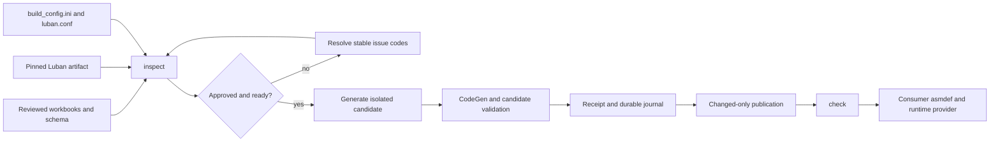

# Luban DataTable Build and Operations Guide

English | [简体中文](./README.SCH.md)

This directory is the repository-visible composition root for authoring and publishing Luban-generated DataTable code and binary payloads. This guide is the user-level source of truth for first setup, authoring, profiles, Unity Inspector operation, command-line operation, output assembly ownership, CI, transactions, and recovery. Runtime table APIs and provider composition are documented in the [CycloneGames.DataTable package guide](../../UnityStarter/Assets/ThirdParty/CycloneGames/CycloneGames.DataTable/README.md).

The checked-in fixture is fail-closed: `build_config.ini` contains `REPLACE_WITH_APPROVED_...` identity values, and the authoritative workbook set and approved Luban artifact may be absent. `inspect` therefore reports `status: "blocked"` and the Unity Inspector reports **SETUP REQUIRED** until the setup sequence below is completed. This is expected; do not bypass an issue by inventing a hash, deleting transaction evidence, or writing directly into a published output root.

## 1. System model



There are four ownership boundaries:

1. `DataTable/Luban/` owns source configuration, workbooks, identity approval, and transaction coordination.
2. `CycloneGames.DataTable/Tools~/CodeGen` owns the pure .NET parser, generator orchestration, receipts, publication, and recovery. It does not use Unity APIs.
3. The configured code and data roots own one published generation. A receipt is the exact file/hash inventory for both roots.
4. A project composition assembly owns generated-code compilation and runtime acquisition/decoding. Generation does not choose Resources, Addressables, YooAsset, a network service, or a file-system provider.

Luban receives only transaction candidate paths, never live output paths. All candidate files are closed, enumerated, bounded, and hashed before publication. Unchanged files are not rewritten, preserving timestamps and Unity `.meta` identities.

## 2. Prerequisites and directory layout

Run repository commands from `<repo-root>`. The scoped tool requires exactly the SDK declared by:

```text
UnityStarter/Assets/ThirdParty/CycloneGames/CycloneGames.DataTable/Tools~/CodeGen/global.json
```

The current file pins .NET SDK `10.0.302` with roll-forward disabled. The project targets `net8.0` and C# 12. The launchers change into the CodeGen directory before `dotnet run`, so this scoped SDK selection applies without changing other repository tools.

Prepare this logical layout:

```text
<repo-root>/
  DataTable/Luban/
    build_config.ini
    luban.conf
    Datas/
      __tables__.xlsx
      __beans__.xlsx
      __enums__.xlsx
      <business workbooks referenced by __tables__.xlsx>
    Defines/
      <schema fragments used by luban.conf>
    config/
      <additional project configuration, if used>
  Tools/DataTable/Luban/
    Luban.dll
    Luban.exe                 # optional Windows-native artifact
  UnityStarter/Assets/
    <project-owned generated-code assembly root>/
    <provider-appropriate generated-data root>/
```

The three `Datas/__*.xlsx` schema workbooks are required. `Datas/`, `Defines/`, and `config/` are fingerprint inputs; even the presence or absence of one of these directories is identity-bearing. Keep authoritative workbook names, paths, and casing portable across Windows, macOS, and Linux. Symbolic links, reparse points, path traversal, case collisions, UTF-8 BOM text, standalone carriage returns, unknown fingerprint file types, and exceeded file/byte budgets fail closed.

The authoritative source fingerprint includes:

- `build_config.ini`, with only the `source_fingerprint` value normalized to `<self>`;
- `luban.conf`;
- the complete physical trees under `Datas/`, `Defines/`, and `config/`;
- the CodeGen project tree, excluding its direct `bin/` and `obj/` directories;
- the custom-template tree when configured.

Generated roots, receipts, writer locks, transactions, caches, and the selected Luban binary are not themselves source-fingerprint entries. The selected binary has its own SHA-256 identity.

## 3. `luban.conf`: groups, targets, and profiles

`luban.conf` defines Luban schema inputs and Luban targets. The checked-in configuration declares:

| Luban target | Groups | Manager | Top module | Intended profile |
| --- | --- | --- | --- | --- |
| `client` | `c` | `Tables` | `UnityStarter.GameConfig` | `[profile.client]` |
| `server` | `s` | `Tables` | `UnityStarter.GameConfig` | `[profile.server]` |
| `all` | `c`, `s` | `Tables` | `UnityStarter.GameConfig` | `[profile.all]` |

The pipeline invokes Luban as:

```text
-t <profile-name> -c <code_target> -d <data_target>
```

Consequently, every `[profile.<name>]` in `build_config.ini` must have a same-named target in `luban.conf`. A profile name is a deployment consistency domain and a Luban target name; it is not a group name. `c` and `s` are workbook export groups selected by each target. `code_target=cs-bin` and `data_target=bin` are Luban output generator names; they are not entries in the `targets` array.

When adding a target:

1. Add or reuse reviewed groups in `groups`.
2. Add a uniquely named `targets` entry with its groups, manager, and top module.
3. Add exactly one same-named `[profile.<name>]` in `build_config.ini`.
4. Give it non-overlapping code/data output roots.
5. Run `inspect`, review the new source fingerprint, approve it, then generate and check that profile.

`schemaFiles` currently resolves `Defines`, `Datas/__tables__.xlsx`, `Datas/__beans__.xlsx`, and `Datas/__enums__.xlsx`. Business workbooks are declared by the table schema. Keep `luban.conf` and the workbooks in one reviewed change because both contribute to schema and source identities.

## 4. `build_config.ini`

`build_config.ini` is UTF-8 without BOM and uses LF. It is the only generation truth. Unknown sections, unknown keys, duplicate sections, duplicate keys, missing values, unsupported characters, and invalid paths are errors. Paths are resolved relative to `DataTable/Luban/build_config.ini`.

### `[luban]`

| Key | Required | Contract |
| --- | --- | --- |
| `luban_dll` | yes | Repository-contained DLL used through `dotnet` on non-Windows and as the Windows fallback. |
| `windows_executable` | no | Windows-native executable. Leave empty to use the DLL identity on Windows too. When non-empty, it is selected only on Windows and only when the file physically exists. |
| `executable_version` | yes | Reviewed provenance/version label. It must not be a placeholder; the tool does not infer this label from the binary. |
| `executable_sha256` | yes | Exact SHA-256 of `luban_dll`. |
| `windows_executable_sha256` | conditional | Exact SHA-256 of the selected Windows executable. It may be empty when `windows_executable` is empty. |
| `source_fingerprint` | yes | Reviewed current source fingerprint produced by `inspect`. |
| `process_timeout_seconds` | yes | Luban timeout in `[1, 86400]`; the fixture uses `600`. |

Windows selection is existence-sensitive. If `windows_executable` is configured but absent, Windows falls back to `luban_dll`; if it exists, the Windows hash is required and the DLL hash is not the selected runtime identity. For one receipt and one profile to be checked on multiple operating systems, use the same DLL on every publisher/checker by leaving `windows_executable` empty. If distinct platform artifacts are required, use separate profiles and non-overlapping output roots so each receipt has one stable Luban identity.

### `[templates]`

| Key | Contract |
| --- | --- |
| `custom_template_dir` | Optional physical directory strictly below `DataTable/Luban/`; included in the source fingerprint. |
| `bridge_files` | Optional comma/semicolon-separated portable relative paths below the custom-template directory; maximum 256 entries. A non-empty list requires `custom_template_dir`. |

Bridge files are copied, hash-verified, and receipted as candidate code content. Keep this list empty unless reviewed static source companions are genuinely required. Keep Unity assembly definitions and other project ownership files outside the published `code_output`; do not publish an `.asmdef` through `bridge_files`.

### `[codegen]`

| Key | Default/contract |
| --- | --- |
| `codegen_project` | Required path to `CycloneGames.DataTable.CodeGen.csproj`. |
| `string_constant_tables` | Empty disables constant generation; otherwise comma/semicolon-separated exact Luban `full_name` values, maximum 1,024. |
| `string_constant_value_column` | `name`; source value and constant-name input. |
| `string_constant_comment_column` | `comment`; empty disables XML documentation. |
| `string_constant_enabled_column` | `enabled`; empty disables row filtering. |
| `string_constant_scope_column` | Empty by parser default; the fixture sets `scope`. An empty setting disables scope splitting; empty cells use the table's default constants class when a scope column is configured. |
| `string_constant_generated_comment_language` | `en`; `zh`, `zh-CN`, `sch`, or `cn` selects a Simplified Chinese generated header. |

### `[profile.<name>]`

| Key | Contract |
| --- | --- |
| `code_output` | Live generated-code root. Must be a strict child of `UnityStarter/Assets/` or `DataTable/Luban/Generated/`. |
| `data_output` | Live generated-data root under the same approved boundary. |
| `code_target` | Luban code generator passed to `-c`, currently `cs-bin`. |
| `data_target` | Luban data generator passed to `-d`, currently `bin`. |
| `line_ending` | Exact generated text EOL: `lf` or `crlf`. |

Code and data roots may not contain one another. No root may overlap a root in any other profile. A profile therefore owns its output roots exclusively. The provided profiles are:

| Profile | Code output | Data output | EOL |
| --- | --- | --- | --- |
| `client` | Unity project generated source | `Assets/StreamingAssets/DataTable/` | `crlf` |
| `server` | `DataTable/Luban/Generated/Server/Code/` | `DataTable/Luban/Generated/Server/Data/` | `lf` |
| `all` | `DataTable/Luban/Generated/All/Code/` | `DataTable/Luban/Generated/All/Data/` | `lf` |

Use the actual checked-in paths as the authority. If generated text is tracked, add an appropriate project-level `.gitattributes` rule for the generated source root so Git checkout settings do not rewrite a profile's exact EOL. The local `.gitattributes` already fixes `.ini`, `.md`, and `.sh` to LF and `.bat` to CRLF.

## 5. First setup: blocked to ready

Complete these steps in order. Identity approval is a review action, not a command that should edit the configuration automatically.

1. Install the exact SDK from `Tools~/CodeGen/global.json`.
2. Restore and review the three required schema workbooks, all referenced business workbooks, and any `Defines/` or `config/` inputs.
3. Restore the approved `Luban.dll`. Either leave `windows_executable` empty for one cross-platform DLL identity, or restore and independently approve `Luban.exe`.
4. Verify `luban.conf` targets and `[profile.<name>]` sections use the exact same names.
5. Set `executable_version`, `executable_sha256`, and, when selected, `windows_executable_sha256`. Compute artifact hashes independently:

   ```powershell
   (Get-FileHash -LiteralPath Tools/DataTable/Luban/Luban.dll -Algorithm SHA256).Hash
   (Get-FileHash -LiteralPath Tools/DataTable/Luban/Luban.exe -Algorithm SHA256).Hash
   ```

   ```bash
   sha256sum Tools/DataTable/Luban/Luban.dll
   sha256sum Tools/DataTable/Luban/Luban.exe
   ```

6. Run the read-only inspection with `source_fingerprint` still set to its placeholder. After reviewing every listed source input and issue, copy `toolchain.actualSourceFingerprint` from the JSON into `source_fingerprint`:

   ```bat
   DataTable\Luban\gen_code_bin_to_project_lazyload.bat inspect --profile client --format json
   ```

   ```bash
   bash DataTable/Luban/gen_code_bin_to_project_lazyload.sh inspect --profile client --format json
   ```

7. Run the same inspection again. Continue only when `toolchain.lubanIdentityStatus` is `approved`, `toolchain.sourceFingerprintStatus` is `current`, blocking issues are resolved, and `canGenerate` is `true`.
8. If the Unity Inspector will be used, keep exactly one saved settings asset as described below. The current checkout already contains the default asset. CLI/CI-only operation does not require this asset.
9. Ensure both live output roots are absent/empty for their first publication. Do not place hand-written files or an `.asmdef` inside them.
10. Run `generate --profile client`, then `check --profile client`, compile the generated assembly, and validate the target Player.

Changing any fingerprinted input changes `toolchain.actualSourceFingerprint`. Review the diff, update only the approved fingerprint, inspect again, then generate. A hash mismatch is evidence to resolve, not a value to suppress.

## 6. Unity Inspector workflow

Use the checked-in settings asset when it exists. If a project has no settings asset, create exactly one with either:

- `Assets > Create > CycloneGames > DataTable > Luban Pipeline Settings`; or
- `Tools > CycloneGames > DataTable > Create Default Settings`.

The default command creates `Assets/Editor/DataTable/DataTableLubanSettings.asset` only when no settings asset exists and that path is free. Multiple settings assets, an unsaved settings asset, an invalid configuration path, or an unavailable profile block actions. The asset stores only:

- the path to `build_config.ini`;
- the default profile;
- whether to refresh `AssetDatabase` after a successful operation;
- the bounded captured-output limit.

It does not copy or override profile roots, generator targets, hashes, timeouts, or fingerprints. **Resolved Configuration**, resolved output paths, identities, and readiness values are read-only projections.

The Inspector is organized as a guided state machine:

- **Pipeline Readiness**: saved asset, parsed configuration, selected profile, artifact identity, source fingerprint, output receipt, and transaction state.
- **Project Setup**: configuration selection, profile selection, refresh preference, capture limit, explicit save, ping, browse, and reveal actions.
- **Selected Profile**: exact targets, EOL, and resolved roots.
- **Validation Issues**: stable issue code, severity, explanation, and relevant path.
- **Advanced Toolchain**: selected host/artifact, configured and actual identities, timeout, and transaction evidence.
- **Pipeline Actions**: only operations authorized by the latest snapshot. Every action performs a fresh inspection before starting.
- **Last Operation**: duration, exit code, truncation state, failure reason, stdout/stderr, and a copyable diagnostic bundle.

Status refresh does not alter authoritative inputs, live roots, receipts, or recovery evidence. Because it invokes `dotnet run`, it may rebuild disposable `bin/` and `obj/` caches. Generate/recovery suspends AssetDatabase auto-refresh around the external operation and refreshes only after success when the saved setting allows it. Lifecycle diagnostics use category `CycloneGames.DataTable.Editor.Luban`.

## 7. CLI contract and daily workflow

The launchers locate the CodeGen project and append `--config <repo-root>/DataTable/Luban/build_config.ini`. Do not pass `--config` to a launcher; the strict parser rejects the duplicate. All `generate` and `check` examples explicitly select a profile.

Windows:

```bat
DataTable\Luban\gen_code_bin_to_project_lazyload.bat inspect --profile client --format json
DataTable\Luban\gen_code_bin_to_project_lazyload.bat generate --profile client
DataTable\Luban\gen_code_bin_to_project_lazyload.bat check --profile client
DataTable\Luban\gen_code_bin_to_project_lazyload.bat recover --run-id <32-hex-run-id>
```

macOS/Linux:

```bash
bash DataTable/Luban/gen_code_bin_to_project_lazyload.sh inspect --profile client --format json
bash DataTable/Luban/gen_code_bin_to_project_lazyload.sh generate --profile client
bash DataTable/Luban/gen_code_bin_to_project_lazyload.sh check --profile client
bash DataTable/Luban/gen_code_bin_to_project_lazyload.sh recover --run-id <32-hex-run-id>
```

The underlying strict grammar is:

```text
pipeline inspect --config <file> --profile <name> --format json
pipeline generate --config <file> --profile <name>
pipeline check --config <file> --profile <name>
pipeline recover --config <file> --run-id <32-hex-run-id>
```

`inspect` requires `--profile` and exactly `--format json`; it does not accept `--run-id`. `recover` requires `--run-id` and does not accept `--profile`. Unknown arguments, duplicate arguments, and missing values fail.

| Exit code | Meaning |
| ---: | --- |
| `0` | Generate/check/recover succeeded, or inspect emitted a valid snapshot. A valid inspect can still report blocked, busy, or recovery-required state. |
| `1` | Configuration, input, artifact, I/O, output, or ordinary transaction failure. |
| `2` | Cancellation was observed at a safe point. |
| `3` | Exact rollback could not be established; preserve all evidence and run the authorized recovery flow. |

### `inspect`

`inspect` emits one bounded JSON document with `schema: "CycloneGames.DataTable.PipelineInspection"` and `schemaVersion: 1`. Fatal argument/configuration parsing failures return `1` without a usable snapshot. A valid snapshot returns `0` regardless of its operational status; automation must test `canGenerate`, `canCheck`, or `canRecover` for the requested operation.

The document includes `issues`, discovered `profiles`, `selectedProfile`, `toolchain`, `output`, and `transaction`. Inspection is transaction-first. While a writer or retained transaction exists, deep hashing/output checks are deferred and identified by `TOOLCHAIN_DEEP_VALIDATION_DEFERRED` and `OUTPUT_VALIDATION_DEFERRED`; `output.state` remains `unavailable` rather than racing mutable state.

### `generate`

`generate` acquires the one-writer lock, validates approved identities and the prior live receipt, generates a complete candidate, runs optional constant generation/bridge staging, writes the candidate receipt and journal, and publishes only changed content. An existing live root must be empty or exactly owned by a valid receipt. Unowned or manually edited output fails closed.

### `check`

`check` acquires the same short-lived writer exclusion but does not run Luban or rewrite a receipt. It verifies current tool/source/schema identities, receipt schema and generation identity, exact code/data file sets, every receipted length/SHA-256, aggregate hashes, and the absence of unexpected non-`.meta` files. Before the first successful publication there is no receipt, so `canCheck` is false.

### `recover`

Use only the exact run ID reported by inspection or the failed writer. Recovery validates lock ownership, process termination, transaction uniqueness, journal grammar, configuration SHA-256, canonical output roots, candidate hashes, and backup hashes before touching live data. It refuses to run while the exact recorded writer or Luban child identity is alive. A reused PID with a different process start identity is not considered the recorded process.

After recovery, run `inspect` first. If recovery restored a prior receipted generation and `canCheck` is true, run `check --profile <name>`. If it restored the initially empty state, resolve the snapshot and run a fresh `generate --profile <name>`.

## 8. Generated outputs, asmdefs, and runtime combinations

Generation and runtime loading are separate decisions. A profile determines bytes on disk; a runtime provider determines how those bytes enter memory; a decoder turns bounded bytes into generated table objects.

### Generated-code assembly ownership

Never place a hand-written `.asmdef` inside `code_output`: the root is receipt-owned, and an unreceipted file blocks publication/check. Do not stage an `.asmdef` through `bridge_files`. Instead, make `code_output` a child of a project-owned assembly directory:

```text
UnityStarter/Assets/UnityStarter/Scripts/Generated/
  UnityStarter.GameConfig.Generated.asmdef       # project-owned
  DataTable/                                     # client code_output; pipeline-owned
```

A minimal generated assembly normally references `Luban.Runtime`:

```json
{
  "name": "UnityStarter.GameConfig.Generated",
  "references": ["Luban.Runtime"],
  "autoReferenced": false
}
```

The product composition asmdef then explicitly references the generated assembly and only the DataTable assemblies it calls, for example:

```json
{
  "name": "UnityStarter.DataTable.Composition",
  "references": [
    "UnityStarter.GameConfig.Generated",
    "CycloneGames.DataTable.Core",
    "CycloneGames.DataTable.Unity.Runtime.Integrations.Luban",
    "Luban.Runtime"
  ],
  "autoReferenced": false
}
```

The Luban integration assembly is enabled only when its asmdef conditions are satisfied. Check the package guide and the current integration asmdef rather than adding a global scripting symbol.

### Data publication matrix

| Runtime acquisition | Place `data_output` in | Runtime rule |
| --- | --- | --- |
| `Resources` | An importable `Assets/**/Resources/<folder>/` directory | Load Unity `TextAsset` locations without file extensions; avoid synchronous bulk loading for large catalogs. |
| Addressables | An importable `Assets/` directory included by Addressables settings | Publish addresses/labels separately, then load bytes through the selected asset provider. |
| YooAsset asset mode | An importable `Assets/` collector path | Let the YooAsset collector/package own deployment and use the normal asset-byte loader. |
| YooAsset raw-file mode | A collector path configured as raw content | Use the raw-file loader; do not reinterpret it as a Unity `TextAsset`. |
| `StreamingAssets` | `Assets/StreamingAssets/<folder>/` | Supply a product-owned asynchronous platform adapter. Android/WebGL cannot be treated as ordinary synchronous file paths. |
| Server, CDN, archive, or custom storage | A non-Unity generated root or staging root | Implement a bounded `IDataTableBytesProvider`; authenticate/validate remote content before publication to a catalog. |

Do not point two profiles at the same roots. Do not have a content build process modify the receipt-owned source root in place. Copy or import the checked generation into the downstream content pipeline according to one documented owner policy. Runtime provider/decoder examples and exact optional asmdef conditions are in the package guide.

### EOL and platform identity

`line_ending` controls all generated text, including constant files. Use one EOL per profile and enforce it in source control. The generation receipt binds the selected Luban hash, tool hash, source fingerprint, schema hash, output hashes, and profile. Running `check` on a platform that selects a different Luban artifact fails identity validation even if output bytes happen to match. Standardize the selected DLL or isolate platform publishers by profile/root.

## 9. Optional strongly named string constants

Set `string_constant_tables` only for tables that need generated C# constants. CodeGen reads the first worksheet referenced by `xl/workbook.xml`. The first cell of the header row must be exactly `##var`; data begins four rows after that header. Column names are case-sensitive.

For `__tables__.xlsx`, CodeGen projects only `full_name` and `input` and retains configured declarations. For a business workbook, it projects only the configured value, comment, enabled, and scope columns. Row rules are:

| Condition | Result |
| --- | --- |
| Value absent/empty/whitespace | Skip row. |
| Enabled absent/empty | Include row. |
| Enabled is `0`, `false`, or `no`, case-insensitive | Skip row. |
| Comment-column setting empty | Emit no XML documentation. |
| Scope absent/empty | Use the table's default constants class. |

The reader is forward-only. It uses a reusable row projection and a bounded shared-string spool/cache; visitors cannot retain borrowed row storage. Rows/cells must have increasing positive indices, references must match their row, and duplicate/out-of-order cells, duplicate projected columns, invalid shared-string indices, malformed XML, invalid identifiers, class/path collisions, and duplicate constants fail before publication.

Generated constants use conservative ASCII C# identifiers, escaped values, single-line normalized headers/comments, UTF-8 without BOM, and the profile EOL. `.cyclonegames-datatable-codegen-manifest.json` owns only normalized generated `.cs` paths. Stale deletion is limited to registered files. Missing registrations are pruned; unrelated files and Unity `.meta` files are never adopted.

Important bounded inputs include: 1 MiB configuration, 1,024 configured constant tables, 64 MiB per workbook, 4,096 ZIP entries, 128 MiB total uncompressed ZIP content, 100,000 worksheet rows, 4,096 columns per row, 2,097,152 total worksheet cells, 500,000 shared strings, 65,536 characters per cell, 16 Mi characters per generated constant file, and 64 Mi characters across generated constant source. DTD processing, external XML resolution, external worksheet relationships, path traversal, rooted archive paths, and excessive compression ratios are rejected.

## 10. Transactions, receipts, cancellation, and recovery

One generation creates:

```text
DataTable/Luban/.cyclonegames-datatable-writer.lock/
  owner.txt
  cancel.request             # only when cancellation is requested
  active-luban.*             # pending/staged/published child identity as applicable

DataTable/Luban/.cyclonegames-datatable-transactions/<run-id>/
  candidate/code/
  candidate/data/
  backup/
  journal.json
```

The published receipt is:

```text
<code-output>/.cyclonegames-datatable-generation-receipt.json
```

Before live mutation, the journal durably binds the run/profile, exact `build_config.ini` SHA-256, canonical output roots, candidate file identities, operations, and verified preimages. Publication writes only changed files. Replaced/stale preimages move to backup first. A recoverable failure applies reverse-order rollback and verifies the exact prior state.

Journal states behave as follows:

- `Committed`: verify the published generation, then remove retained transaction state.
- `Prepared`, `Publishing`, or `RecoveryRequired`: restore and verify the exact pre-publication state, then remove retained state.
- invalid, ambiguous, externally changed, or unverifiable evidence: keep the lock/transaction and remain blocked for audit.

Cancellation is cooperative before publication. Ctrl+C or an Inspector request is observed during validation/Luban execution and returns `2` at a safe point. Once publication begins, cancellation is deferred until commit or verified rollback. If the Editor must terminate the process after its bounded graceful wait, any retained evidence is treated as recovery-required.

Never manually delete the lock, journal, candidate, or backup to make Generate clickable. Stop the recorded process and descendants, inspect the exact run ID, and recover only when `canRecover` is true.

Receipts exclude Unity `.meta` files. Unchanged generated files keep their existing metadata. Deleting a stale generated file transactionally removes its adjacent `.meta` when present. Candidate `.meta` files and orphan live metadata fail closed.

## 11. Persistence and source-control policy

| Artifact | Owner | Version-control policy | Safe cleanup/recovery |
| --- | --- | --- | --- |
| `build_config.ini`, `luban.conf`, workbooks, `Defines/`, `config/` | Data authors/tool owners | Commit reviewed authoritative inputs. | Restore from version control; reapprove fingerprint after an intentional change. |
| Approved Luban artifact | Toolchain owner | Commit it or install it reproducibly under a documented immutable policy. | Restore the exact approved SHA-256. |
| `DataTableLubanSettings.asset` | Unity project | Commit exactly one saved authoritative asset. | Recreate explicitly only when the project chooses a new owner asset. |
| Generated code/data plus receipt | Pipeline | Commit all together or keep all generated; never track a partial set. | Regenerate only from approved inputs when no recovery evidence exists. |
| Constant owned-output manifest | CodeGen | Keep with generated constants; do not edit. | Rebuilt by generation. |
| Writer lock and normal transaction | Active writer | Never commit. | Removed by matching owner after success/verified rollback. |
| Recovery-required transaction | Recovery flow | Never commit, but preserve locally until resolved. | Only `recover` may restore/clean after validation. |
| CodeGen `bin/`, `obj/` | .NET SDK | Never commit. | Delete when no tool process is active; they rebuild. |
| Shared-string spool | CodeGen process in OS temp | Never commit. | Owner deletes it on disposal; abandoned OS temp follows machine cleanup policy. |

No pipeline state is stored in `EditorPrefs`, `PlayerPrefs`, or `SessionState`.

## 12. CI design

CI must install the exact SDK and approved Luban artifact before inspection. Do not calculate and accept hashes automatically in the same job that publishes output; approval must come from a reviewed source change.

For a generation authority job:

```bash
set -euo pipefail

inspection="$(bash DataTable/Luban/gen_code_bin_to_project_lazyload.sh inspect --profile client --format json)"
printf '%s\n' "$inspection" | jq -e '
  .schema == "CycloneGames.DataTable.PipelineInspection" and
  .schemaVersion == 1 and
  .canGenerate == true'

bash DataTable/Luban/gen_code_bin_to_project_lazyload.sh generate --profile client
bash DataTable/Luban/gen_code_bin_to_project_lazyload.sh check --profile client
code_output='UnityStarter/Assets/UnityStarter/Scripts/Generated/DataTable'
data_output='UnityStarter/Assets/StreamingAssets/DataTable'
git diff --exit-code -- "$code_output" "$data_output"
test -z "$(git status --porcelain=v1 -- "$code_output" "$data_output")"
```

For a verification-only job with a published receipt, gate on `.canCheck == true` and run `check --profile client`; do not run Luban. A valid inspect process exit alone is not a readiness gate.

After generation/check:

1. compile the generated consumer asmdef;
2. run DataTable EditMode/integration tests;
3. build or minimally validate the target Player/backend;
4. run a representative runtime load with the actual provider;
5. archive inspection JSON and bounded command logs;
6. fail if tracked generated roots differ.

Run one writer per profile/output set. Do not generate the same roots concurrently. Use one canonical platform/artifact identity for a shared profile, and ensure source-control EOL handling preserves `line_ending`.

## 13. Troubleshooting

| Symptom/issue | Cause | Resolution |
| --- | --- | --- |
| `SCHEMA_WORKBOOK_MISSING` | A required `Datas/__*.xlsx` file is absent. | Restore and review all three schema workbooks, then inspect again. |
| `LUBAN_EXECUTABLE_MISSING` | Selected Windows executable or fallback DLL is absent. | Restore the approved artifact or leave `windows_executable` empty and provide the approved DLL. |
| `LUBAN_IDENTITY_PLACEHOLDER` | Version label/hash is not approved. | Verify artifact provenance and SHA-256, update the relevant identity fields, then inspect. |
| `LUBAN_HASH_MISMATCH` | Selected file differs from its approved hash. | Quarantine the unexpected file; restore or explicitly review the intended artifact. |
| `SOURCE_FINGERPRINT_PLACEHOLDER` | No source set has been approved. | Finish all input/config changes, review `actualSourceFingerprint`, then pin it. |
| `SOURCE_FINGERPRINT_MISMATCH` | A fingerprinted file or directory presence changed. | Review the complete input diff; approve the new fingerprint only when intentional. |
| `OUTPUT_NOT_GENERATED` | No valid receipt exists. | When `canGenerate` is true, run `generate --profile <name>`. |
| output drift/unexpected file | Live content does not exactly match the receipt. | Stop writers, determine who changed the root, restore the receipted state or use a reviewed empty root for a new publication. |
| `SETTINGS_UNSAVED` or duplicate settings | Inspector authoring is ambiguous/non-durable. | Keep one saved settings asset and save it before an operation. |
| `status: busy` | Exact recorded writer identity is alive. | Observe/cancel that writer; do not start another. |
| `status: recoveryRequired`, `canRecover: true` | Dead writer left a fully validated retained transaction. | Use the reported 32-hex run ID with `recover`; then inspect. |
| recovery state but `canRecover: false` | Ownership, liveness, journal, config, root, or hash proof is incomplete. | Preserve evidence and audit the reported issue/path. Do not delete it. |
| `TOOLCHAIN_DEEP_VALIDATION_DEFERRED` | Transaction state is non-idle. | Resolve the active/recovery transaction first; deep validation will resume when idle. |
| generated code not compiled | No project-owned parent asmdef, wrong references, or inactive Luban integration. | Place the asmdef outside `code_output`, reference `Luban.Runtime`, then check current integration asmdef conditions. |
| works on desktop, fails on Android/WebGL | `StreamingAssets` treated as a normal synchronous file path. | Use a platform-aware asynchronous acquisition adapter or a content provider. |
| cross-platform `check` identity failure | Windows and non-Windows selected different Luban artifacts. | Standardize on the DLL by leaving `windows_executable` empty, or isolate outputs by profile. |

When reporting a failure, include profile, inspection JSON, stable issue codes/paths, exit code, bounded stdout/stderr, selected artifact hash, source fingerprint status, run ID, and journal state. Do not include secrets or private remote credentials in workbooks, config, or logs.

## 14. Performance and safety characteristics

- File-set comparison is O(file count); verification/fingerprinting is O(total bytes).
- Publication writes O(changed bytes), while candidate disk space must hold the complete new generation plus changed/stale preimages.
- File counts and aggregate bytes use explicit limits and overflow-safe arithmetic.
- Workbook XML is read forward-only; shared strings use a bounded temporary spool and small cache rather than a full XML object tree.
- The Editor shares one bounded character budget across stdout and stderr and uses a bounded main-thread diagnostics queue.
- Output paths, archive paths, source paths, symlinks/reparse points, XML entities, compression ratios, process duration, and process identity are validated at trust boundaries.
- Exact peak memory, generation time, import time, and Player behavior remain workload/platform properties; measure them with production-size workbooks and target hardware.

## 15. Verification checklist

Tool validation from `<repo-root>`:

```bash
cd UnityStarter/Assets/ThirdParty/CycloneGames/CycloneGames.DataTable/Tools~/CodeGen
dotnet build CycloneGames.DataTable.CodeGen.csproj --configuration Release
dotnet format CycloneGames.DataTable.CodeGen.csproj --verify-no-changes --no-restore
dotnet run --project CycloneGames.DataTable.CodeGen.csproj --configuration Release --no-build -- --self-test
cd -
bash -n DataTable/Luban/gen_code_bin_to_project_lazyload.sh
```

Operational validation for every publishing profile:

1. `inspect --profile <name> --format json` returns schema version 1 and authorizes the intended action.
2. `generate --profile <name>` returns `0` and reports a committed generation.
3. `check --profile <name>` returns `0` without modifying output.
4. A second unchanged generation preserves generated-file timestamps and Unity `.meta` identities.
5. Generated source compiles under the project-owned asmdef with the target Unity scripting backend.
6. The selected runtime provider loads the built Player's deployed payloads, not Editor-only filesystem assumptions.
7. Focused DataTable Editor/integration tests pass.
8. A target Player/IL2CPP build or the project's approved minimum platform validation passes.

The self-test covers strict CLI/config parsing, XLSX bounds and malformed input, deterministic EOL/UTF-8, constant ownership, schema-v1 inspection, changed-only publication, receipts, rollback, configuration/output-root recovery binding, process identity, and retained fatal-publication recovery. It does not replace production workbook profiling or platform Player validation.
