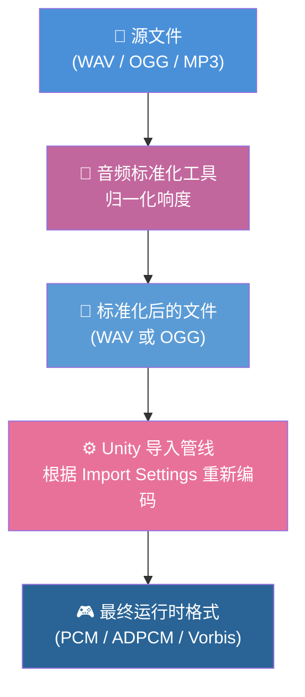
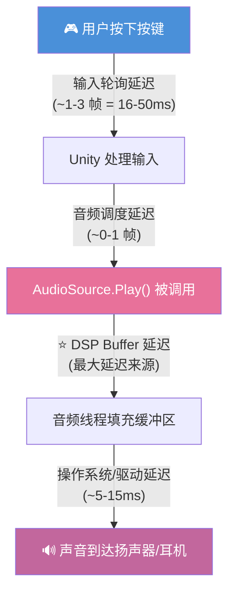
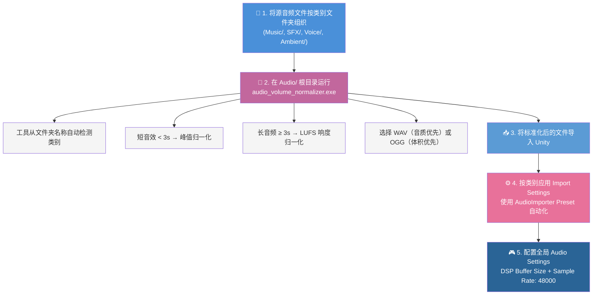

# Unity 游戏开发音频最佳实践

音频资源准备、Unity 导入设置和不同游戏类型优化策略的综合指南。

> **适用范围**：本指南针对 **Unity 内置音频系统**（AudioSource / AudioClip）的开发流程。如果你的项目使用了 **Wwise**、**FMOD** 或 **CRIWARE (ADX2)** 等音频中间件，本文讨论的导入管线、压缩设置、加载类型和延迟特性**不直接适用** — 这些工具会用自己的资源管理、编解码器和流式加载系统替代 Unity 的音频引擎。[音频标准化工具](#音频标准化工具工作流)用于源文件响度归一化，无论使用哪种音频系统都仍然适用，因为它作用于进入任何引擎管线之前的源文件。

> **测量说明**：本文中的内存与延迟范围仅用于方案估算，不是平台保证或已经验证的项目预算。Codec 实现、Unity 版本、音频设备、DSP buffer、硬件、并发 I/O 与构建目标都会改变结果。发布决策必须在目标 Player、Unity Profiler 和代表性真机上验证。

<p align="left"><br> <a href="AudioBestPractices.md">English</a> | 简体中文</p>

## 关联 CycloneGames.Audio 主文档

- [插件主文档（English）](../../UnityStarter/Assets/ThirdParty/CycloneGames/CycloneGames.Audio/README.md)
- [插件主文档（简体中文）](../../UnityStarter/Assets/ThirdParty/CycloneGames/CycloneGames.Audio/README.SCH.md)

## CycloneGames.Audio 的运行时驻留

Unity 导入设置描述内嵌 `AudioClip` 的存储与解码方式，但不会定义外部解析所得音频的所有权。`CycloneGames.Audio` 将两类职责明确分离：

- `AudioClipReference` 只保存位置元数据，本身不会让音频字节驻留内存。
- 加载 `AudioBank` 只注册事件和参数元数据，不会隐式保留 Bank 中的全部外部音频。
- 自定义 resolver 返回由调用方持有的 `IAudioClipHandle`。为保持 ABI 兼容，obsolete 的 `Register...` 方法仍返回 `void`；应使用对应的 `Register...Scoped` 方法，持有其返回的 `IDisposable` lease，并只在 resolver 不再可用时释放。
- 若播放阶段要求 Bank 音频可预测地驻留，应通过 `IAudioBankClipLeaseProvider` 取得 `IAudioBankClipLease`，在需要驻留的完整生命周期内保留，并在 Unity 主线程释放。
- `PreloadBankClipsAsync` 则保存 manager-owned bank lease，直到 `ReleasePreloadedBankClips`、bank unload 或 manager cleanup。
- `AudioManager.ExternalClipMemoryBudgetBytes == 0` 时（默认值），外部音频会在最后一个 handle 释放后退出驻留。正数预算会启用有界闲置缓存；必须在各目标设备上验证预算与 `ExternalClipIdleTTL`。
- 内置外部加载器的默认安全上限为：请求超时 30 秒、编码下载 64 MiB、解码 PCM 估算 256 MiB。这些数值是安全上限，不是推荐资源尺寸；产品应按实际平台配置更严格的限制。
- Bank lease 默认采用单 lease 512 MiB decoded estimate 和 active lease 总计 1 GiB estimate。这些值是 conservative post-decode estimate，不是 peak-allocation guarantee；独立取得的 lease 共享 clip 时也可能重复计数。

全部 `CycloneGames.Audio` Runtime API、resolver continuation、handle retain/release 和 Bank lease dispose 都具有 Unity 主线程亲和性。后台线程可在 adapter 后执行文件或网络工作，但 Unity 对象创建和 Audio API 操作必须切回主线程。

不可变的创作 `AudioClipReference` 会拒绝修改：`SetLocation` 与 `SetAssetLocation` 抛出 `InvalidOperationException`，`TrySetLocation` 返回 `false`。需要让控制权跨越单次播放帧时，应保存 `AudioHandle`；播放停止或 pooled `ActiveEvent` 可能已经回收后，绝不能继续持有裸 `ActiveEvent`。

暂停原因彼此独立：manual、`Global`、`ApplicationPause`、`FocusLoss` 与 `LifecycleHold` 可以重叠。`ResumeAll` 只清除 `Global`；`AudioFocusMode.AutoPauseOnly` 产生的 hold 应通过 `AudioManager.ResumeLifecyclePausedEvents()` 或可选的 `IAudioLifecyclePauseControl` service capability 显式释放。Scheduled source 使用 Unity DSP scheduling，而 scheduled snapshot transition 会在 DSP 开始时间到达后的首个 `Update` 应用，因此按帧对齐。State-mix effect 是一次性写入；卸载其 bank 只阻止后续评估，不会回滚此前写入的 parameter、mixer 或 snapshot state。

## 目录

1. [CycloneGames.Audio 的运行时驻留](#cyclonegamesaudio-的运行时驻留)
2. [音频管线概览](#音频管线概览)
3. [源文件格式：WAV vs OGG](#源文件格式wav-vs-ogg)
4. [PCM 基础与音频计算](#pcm-基础与音频计算)
5. [Unity AudioClip 导入设置](#unity-audioclip-导入设置)
6. [按音频类别的推荐设置](#按音频类别的推荐设置)
7. [按游戏类型的推荐设置](#按游戏类型的推荐设置)
8. [音频延迟深入分析](#音频延迟深入分析)
9. [蓝牙音频延迟](#蓝牙音频延迟)
10. [文件夹结构规范](#文件夹结构规范)
11. [音频标准化工具工作流](#音频标准化工具工作流)

---

## 音频管线概览

理解完整管线至关重要。Unity 通常会重新编码导入的源音频，因此运行时存储与解码行为主要由最终 `AudioImporter` 设置决定，而不是由源文件扩展名决定。



**核心要点**：Unity 会在导入阶段生成运行时表示。源音质会影响编码结果，源文件大小会影响仓库与导入成本；运行时存储和解码则主要由最终 AudioClip Import Settings 决定。

---

## 源文件格式：WAV vs OGG

| 方面             | WAV (PCM 16-bit)         | OGG (Vorbis VBR)                     |
| ---------------- | ------------------------ | ------------------------------------ |
| **运行时内存**   | 完全一样                 | 完全一样                             |
| **运行时 CPU**   | 完全一样                 | 完全一样                             |
| **音质**         | 无损 → Unity 编码一次    | 有损 → Unity 可能再次编码 = 双重损失 |
| **项目磁盘占用** | ~10 倍大                 | ~10 倍小                             |
| **Git 仓库影响** | 较大（建议使用 Git LFS） | 较小                                 |
| **构建时间**     | 稍长（文件更大）         | 稍短                                 |

### 推荐

- **WAV**（默认）：最佳音质。当音质重要且使用 Git LFS 管理磁盘时选择。
- **OGG**：当仓库体积是优先考虑且可接受轻微音质损失时选择。

---

## PCM 基础与音频计算

PCM（脉冲编码调制）是音频的原始数字表示。理解其参数对于计算内存占用、精确调度音频以及处理节奏/时间问题至关重要。

### 核心参数

| 参数            | 说明                                        | 典型值                                                             |
| --------------- | ------------------------------------------- | ------------------------------------------------------------------ |
| **采样率** (Hz) | 每秒捕获的音频采样数。越高 = 越多高频细节。 | 44100 Hz（CD 品质）、48000 Hz（游戏/影视标准）                     |
| **位深** (位)   | 每个采样的精度。越高 = 越多动态范围。       | 16-bit（CD，大多数游戏）、24-bit（专业）、32-bit float（内部处理） |
| **声道**        | 独立音频流的数量。                          | 1（单声道）、2（立体声）                                           |
| **时长** (秒)   | 音频片段的长度。                            | 因片而异                                                           |
| **总采样数**    | 片段中的总采样帧数。`= 采样率 × 时长`       | 例如 48000 × 4.0 = 192000                                          |

**每个采样的字节数**：

| 位深         | 每采样字节数 | 说明                   |
| ------------ | ------------ | ---------------------- |
| 8-bit        | 1            | 低质量，很少使用       |
| 16-bit       | 2            | 游戏标准（CD 品质）    |
| 24-bit       | 3            | 专业音频制作           |
| 32-bit float | 4            | 内部处理，Unity 混音器 |

### 内存计算

当音频片段**完全解压到内存**（Decompress On Load + PCM 格式）时，其 RAM 占用为：

$$
\text{内存 (字节)} = \text{采样率} \times \text{声道数} \times \frac{\text{位深}}{8} \times \text{时长 (秒)}
$$

或等价于：

$$
\text{内存 (字节)} = \text{总采样数} \times \text{声道数} \times \frac{\text{位深}}{8}
$$

**示例**：一段 4 分钟的立体声音频，44100 Hz，16-bit：

$$
44100 \times 2 \times 2 \times 240 = 42{,}336{,}000 \text{ 字节} \approx 40.4 \text{ MB}
$$

**快速参考表**（16-bit PCM，立体声）：

| 时长   | 44100 Hz | 48000 Hz |
| ------ | -------- | -------- |
| 1 秒   | ~172 KB  | ~188 KB  |
| 10 秒  | ~1.7 MB  | ~1.8 MB  |
| 1 分钟 | ~10.1 MB | ~11.0 MB |
| 5 分钟 | ~50.4 MB | ~54.9 MB |

> **重要**：这是**解压后的 PCM 大小**，即 `Decompress On Load` 时占用的 RAM。使用 `Compressed In Memory`（Vorbis）时，实际 RAM 占用约为此值的 1/10。使用 `Streaming` 时，仅一个小缓冲区（几 KB）留在 RAM 中。在 Unity 中使用 `Profiler.GetRuntimeMemorySizeLong(clip)` 可获取任何加载类型的精确运行时内存。

### DSP 时间与调度

Unity 的音频运行在**硬件驱动的 DSP 时钟**（`AudioSettings.dspTime`）上，与帧率无关。此时钟每次 DSP 回调时前进一个固定增量：

$$
\text{DSP 增量 (秒)} = \frac{\text{DSP 缓冲区大小 (采样数)}}{\text{系统采样率 (Hz)}}
$$

| DSP 缓冲区大小      | @ 48000 Hz | @ 44100 Hz |
| ------------------- | ---------- | ---------- |
| 256（Best Latency） | 5.333 ms   | 5.805 ms   |
| 512（Good Latency） | 10.667 ms  | 11.610 ms  |
| 1024（Default）     | 21.333 ms  | 23.220 ms  |

**精确采样位置**：对于任何音频片段，你可以计算 DSP 时间中的精确播放位置：

$$
\text{播放位置 (秒)} = \frac{\text{当前采样}}{\text{采样率}}
$$

$$
\text{时间 } t \text{ 处的采样} = \lfloor t \times \text{采样率} \rfloor
$$

这就是 `AudioSource.timeSamples` 提供的内容 — 播放头的精确整数采样偏移。

### BPM 与节拍计算

#### 能从 PCM 元数据计算 BPM 吗？

**不能。** PCM 参数（采样率、位深、声道、时长）描述的是*容器*，而不是*音乐内容*。BPM（每分钟节拍数）是音乐信号的属性 — 检测它需要**音频信号分析**（起壋检测、自相关、谱通量、基于 FFT 的节拍追踪）。这是一个 DSP 问题，而不是元数据问题。

#### 如果已知 BPM

当 BPM 已知（来自音乐数据库、元数据标签或手动输入）时，可以计算精确的时间：

$$
\text{每拍秒数} = \frac{60}{\text{BPM}}
$$

$$
\text{每拍采样数} = \frac{\text{采样率} \times 60}{\text{BPM}}
$$

$$
\text{总拍数} = \frac{\text{时长 (秒)} \times \text{BPM}}{60}
$$

**示例**：一段 128 BPM 的音频，采样率 48000 Hz：

| 计算               | 公式                          | 结果                       |
| ------------------ | ----------------------------- | -------------------------- |
| 每拍秒数           | 60 / 128                      | 0.46875 秒                 |
| 每拍采样数         | 48000 × 60 / 128              | 22500 采样                 |
| 第 N 拍的 DSP 时间 | startDspTime + N × (60 / 128) | startDspTime + N × 0.46875 |

**使用 DSP 时间调度节拍**：

```csharp
// 已知 BPM 和开始时间
double bpm = 128.0;
double secPerBeat = 60.0 / bpm;
double startDsp = AudioSettings.dspTime + 1.0; // 1秒后开始
bgmSource.PlayScheduled(startDsp);

// 在 Update 中：计算当前在第几拍
double elapsed = AudioSettings.dspTime - startDsp;
if (elapsed < 0) return; // 还未开始
double currentBeat = elapsed / secPerBeat;
int beatIndex = (int)currentBeat;
double beatFraction = currentBeat - beatIndex; // 0.0-1.0 拍内位置
```

> **说明**：`AudioSettings.dspTime` 是**采样级精确的**，不会随帧率漂移。这就是为什么它是节奏同步的正确时间源，而不是 `Time.time`。

#### 从时长和拍数估算平均 BPM

如果你有已知的总拍数（例如来自谱面文件或手动计数）：

$$
\text{平均 BPM} = \frac{\text{总拍数} \times 60}{\text{时长 (秒)}}
$$

这给出的是**平均** BPM。许多歌曲有变速（速度变化、自由节拍），所以这是一个近似值。

---

## Unity AudioClip 导入设置

### 压缩格式 (Compression Format)

| 格式       | 压缩比         | 解码 CPU | 音质       | 适用场景                            |
| ---------- | -------------- | -------- | ---------- | ----------------------------------- |
| **PCM**    | 1:1（无压缩）  | 零       | 完美       | 短关键音效、节奏游戏打击音          |
| **ADPCM**  | ~3.5:1         | 极低     | 良好       | 频繁播放的短音效（脚步声、UI 点击） |
| **Vorbis** | ~10:1+（可调） | 中等     | 良好至优秀 | 音乐、对话、环境音、长音频          |

### 加载类型 (Load Type)

| 加载类型                 | 内存占用               | 首次播放延迟       | CPU 影响        | 适用场景                 |
| ------------------------ | ---------------------- | ------------------ | --------------- | ------------------------ |
| **Decompress On Load**   | 高（完整 PCM 在内存）  | **最低** ✓         | 仅加载时        | 短音效、延迟敏感的音频   |
| **Compressed In Memory** | 低（压缩态存在内存）   | 中等（解码器启动） | 每次播放解码    | 音乐、对话、中等长度音频 |
| **Streaming**            | **最低**（极小缓冲区） | **最高** ✗         | 持续 I/O + 解码 | 超长音频、环境音循环     |

### Streaming 的风险与注意事项

虽然 **Streaming** 提供了最低的内存占用，但它引入了若干必须仔细评估的风险：

#### 磁盘 I/O 波动

Streaming 音频在运行时实时从磁盘读取数据。这意味着播放质量直接受磁盘 I/O 性能影响：

- **I/O 尖峰**：当其他系统（资源加载、场景切换、纹理流式加载、存档读写等）争用磁盘带宽时，音频流缓冲区可能饥饿，导致**可听到的卡顿、爆音或音频间断**。
- **HDD vs SSD**：在传统 HDD（主机和旧 PC 上仍然常见）上，机械寻道延迟使 I/O 尖峰更加频繁。SSD 可以缓解但不能在高负载下完全消除。
- **移动存储**：移动设备的存储 I/O 性能差异极大。后台进程（系统更新、应用下载）可能导致不可预测的 I/O 停滞。

#### 缓冲区欠载 (Buffer Underrun)

Streaming 使用一个小型环形缓冲区。如果磁盘 I/O 无法及时填充缓冲区：

- 音频播放会**中断**（静音或杂音），直到缓冲区追上进度。
- Unity **没有**提供内置的缓冲区欠载回调或事件 — 你无法在运行时轻松检测或恢复。
- 多个同时使用 Streaming 的 AudioSource 会成倍增加 I/O 压力，显著提高欠载概率。

#### 启动延迟

Streaming 具有最高的首次播放延迟（约 20-100ms+），因为：

1. 需要打开文件句柄
2. 初始磁盘读取填充流式缓冲区
3. 解码器初始化并开始处理

这使得 Streaming **不适合**任何需要立即在触发时播放的音频（音效、打击音、UI 反馈）。

#### 什么时候使用 Streaming 是安全的

只有当以下**所有条件**同时满足时，Streaming 才是合适的：

- 音频**较长**（> 10 秒，通常是背景音乐或环境音循环）
- 可以接受 **100ms+** 的启动延迟
- 音频是**非关键的**（短暂卡顿不会破坏玩家体验）
- 其他系统的磁盘 I/O 压力**较低或可控**（没有同时进行大量资源加载）
- 同时使用 Streaming 的 AudioSource 数量**有限**（理想情况下 ≤ 2-3 个）

> **经验法则**：如果内存负担得起，优先选择 **Compressed In Memory** 而非 Streaming。它消除了所有 I/O 相关风险，同时通过 Vorbis 压缩仍然提供良好的内存效率。

### 采样率设置

| 设置                        | 说明                                       |
| --------------------------- | ------------------------------------------ |
| **Preserve Sample Rate**    | 保留原始采样率。大多数情况下推荐。         |
| **Override** 至 44100/48000 | 当源文件采样率不必要地高（96kHz+）时使用。 |

> **提示**：音频标准化工具会自动将采样率限制在 48kHz — 更高的采样率在游戏中没有可听区别，只会浪费内存。

---

## 按音频类别的推荐设置

### 音乐 / BGM

| 设置               | 值                            | 原因                   |
| ------------------ | ----------------------------- | ---------------------- |
| Compression Format | **Vorbis**（Quality 70-100%） | 长音频，压缩必不可少   |
| Load Type          | **Compressed In Memory**      | 内存与播放可靠性的平衡 |
| Preload Audio Data | ✓ 是                          | 避免音乐开始时卡顿     |
| 标准化目标         | -14.0 LUFS                    | 游戏音乐标准值         |

> 节奏游戏中的 BGM **不要**使用 Streaming — 磁盘 I/O 抖动会导致时间线不同步。详见 [Streaming 的风险与注意事项](#streaming-的风险与注意事项)。

### 语音 / 对话

| 设置               | 值                        | 原因                           |
| ------------------ | ------------------------- | ------------------------------ |
| Compression Format | **Vorbis**（Quality 70%） | 良好压缩，语音容忍度高         |
| Load Type          | **Compressed In Memory**  | 中等内存，快速播放             |
| Preload Audio Data | 视情况                    | ✓ 关键对话、✗ 大型语音库       |
| 标准化目标         | -16.0 LUFS                | 比音乐稍安静，在混音中位置合理 |

### 音效 / SFX

| 设置               | 值                                   | 原因                 |
| ------------------ | ------------------------------------ | -------------------- |
| Compression Format | **ADPCM** 或 **PCM**                 | 低解码开销，即时播放 |
| Load Type          | **Decompress On Load**               | 播放零延迟           |
| Preload Audio Data | ✓ 是                                 | 必须随时准备就绪     |
| 标准化目标         | -14.0 LUFS（长）/ 峰值 -1.0 dB（短） | 短音效使用峰值归一化 |

> **频繁播放的音效**：使用 ADPCM + Decompress On Load。对延迟极致要求（节奏游戏）则使用 PCM。

### 环境音 / Ambient

| 设置               | 值                                        | 原因                          |
| ------------------ | ----------------------------------------- | ----------------------------- |
| Compression Format | **Vorbis**（Quality 50-70%）              | 通常较长循环，压缩省内存      |
| Load Type          | **Streaming** 或 **Compressed In Memory** | 低内存占用                    |
| Preload Audio Data | ✗ 否                                      | 可容忍轻微启动延迟            |
| 标准化目标         | -20.0 LUFS                                | 安静背景，不应与 SFX/音乐竞争 |

> **注意**：如果为环境音选择了 Streaming，请确保磁盘 I/O 负载可控。在资源加载繁重的场景中（如开放世界区块流式加载），建议使用 **Compressed In Memory** 以避免音频卡顿。详见 [Streaming 的风险与注意事项](#streaming-的风险与注意事项)。

---

## 按游戏类型的推荐设置

### 节奏 / 音乐游戏

延迟是最高优先级。即使 10ms 的额外延迟也会破坏游戏体验。

**全局音频设置**：

```
Project Settings → Audio:
  DSP Buffer Size:    Best Latency（256 samples ≈ 5.3ms @ 48kHz）
  Sample Rate:        48000（与源文件匹配，避免重采样）
```

**打击/反馈音效**：

```
Compression Format: PCM
Load Type:          Decompress On Load
```

**背景音乐**：

```
Compression Format: Vorbis（Quality 100%）
Load Type:          Compressed In Memory（不要用 Streaming！）
Preload Audio Data: ✓ 是
```

> **为什么节奏游戏 BGM 不能用 Streaming？** 磁盘 I/O 波动会导致不可预测的缓冲区欠载，引起音频时间线上的微卡顿。由于节奏游戏依赖采样级精度的音画同步，即使一次缓冲区欠载也可能导致整个谱面与音乐失去同步。详见 [Streaming 的风险与注意事项](#streaming-的风险与注意事项)。

**关键代码实践**：

- 使用 `AudioSettings.dspTime`（而非 `Time.time`）做节奏同步判定
- 使用 `AudioSource.PlayScheduled(dspTime)` 实现采样级精确播放调度
- 商业级节奏游戏考虑使用 **FMOD** / **Wwise** / **CRIWARE** 音频中间件

### 动作 / FPS 游戏

延迟与内存的平衡。枪声和打击音效必须感觉即时。

**全局音频设置**：

```
DSP Buffer Size:    Good Latency（512 samples）
```

**武器/打击音效**：

```
Compression Format: ADPCM
Load Type:          Decompress On Load
```

**环境音**：

```
Compression Format: Vorbis（Quality 50%）
Load Type:          Streaming
```

> **注意**：对于开放世界或关卡流式加载的游戏，在区块加载期间磁盘 I/O 压力较大时，考虑将环境音切换为 **Compressed In Memory**，以防止场景过渡时出现音频爆音。

### RPG / 冒险游戏

内存效率比超低延迟更重要。通常有大量语音库。

**全局音频设置**：

```
DSP Buffer Size:    Default（1024 samples）
```

**对话/语音**：

```
Compression Format: Vorbis（Quality 60-70%）
Load Type:          Compressed In Memory
Preload:            ✗ 否（按需加载以节省内存）
```

**音乐**：

```
Compression Format: Vorbis（Quality 80%）
Load Type:          Streaming（RPG 可以接受，延迟不关键）
```

> **注意**：即使在 RPG 中，如果音乐用于戏剧性的时间触发（如 Boss 阶段转换与音乐同步），也应避免 Streaming，改用 Compressed In Memory 以防止 I/O 导致的失同步。

### 移动端游戏

内存是主要约束。尽量减少解压后的音频占用 RAM。

**通用规则**：所有音频优先使用 Vorbis + Compressed In Memory。

**短音效**：

```
Compression Format: ADPCM（比 PCM 小，CPU 低）
Load Type:          Decompress On Load
```

**其他所有音频**：

```
Compression Format: Vorbis（Quality 50-60%）
Load Type:          Compressed In Memory
```

> **为什么移动端应避免 Streaming？** 移动存储 I/O 差异极大 — 后台系统进程、热降频和 NAND 磨损都可能导致 I/O 停滞，引起音频中断。Compressed In Memory 是更安全的默认选择。

---

## 音频延迟深入分析

从输入到听到声音的总延迟：



### DSP Buffer 大小影响

| 设置             | 缓冲区（采样） | 延迟 @ 48kHz | 延迟 @ 44.1kHz |
| ---------------- | -------------- | ------------ | -------------- |
| Best Latency     | 256            | **5.3ms**    | **5.8ms**      |
| Good Latency     | 512            | 10.7ms       | 11.6ms         |
| Default          | 1024           | 21.3ms       | 23.2ms         |
| Best Performance | 4096           | **85.3ms**   | **92.9ms**     |

### 加载类型延迟影响

| 加载类型             | 首次播放延迟   | 原因                         |
| -------------------- | -------------- | ---------------------------- |
| Decompress On Load   | **~0ms**       | 已解码 PCM 在内存中          |
| Compressed In Memory | **~1-5ms**     | 解码器初始化开销             |
| Streaming            | **~20-100ms+** | 磁盘 I/O + 缓冲区填充 + 解码 |

### 压缩格式解码延迟

| 格式   | 每次播放开销                        |
| ------ | ----------------------------------- |
| PCM    | **0ms**（原始采样，无需解码）       |
| ADPCM  | **< 0.1ms**（简单数学运算）         |
| Vorbis | **~1-3ms**（解码器启动 + 初始解码） |

### 蓝牙音频延迟

蓝牙耳机会引入一层**额外的**延迟，这层延迟**在 Unity 控制范围之外**，会叠加在上述所有延迟之上：

| 蓝牙编解码器         | 典型延迟      | 说明                       |
| -------------------- | ------------- | -------------------------- |
| **SBC**（默认）      | **150-300ms** | 通用编解码器，延迟最差     |
| **AAC**              | **120-200ms** | Apple 生态默认             |
| **aptX**             | **60-80ms**   | 高通，Android 常见         |
| **aptX Low Latency** | **~40ms**     | 需要发射端和接收端同时支持 |
| **aptX Adaptive**    | **50-80ms**   | 较新的高通芯片，自适应码率 |
| **LC3 / LE Audio**   | **20-30ms**   | 蓝牙 5.2+，最佳情况        |

> **核心要点**：即使是最好的蓝牙编解码器也会在整个音频链路上额外增加 ~20-40ms。使用 SBC（最常见的回退编解码器）时，从输入到听到声音的总延迟可能超过 **250ms** — 对于节奏游戏或任何延迟敏感的玩法来说完全不可接受。

**建议**：

- **节奏 / 音乐游戏**：当检测到蓝牙音频输出时显示警告或提示。许多商业节奏游戏会完全禁用蓝牙音频或显示校准画面。提供**音频偏移校准**功能，让玩家手动补偿。
- **延迟敏感的游戏（FPS、动作）**：考虑在设置中提供音频延迟测试/校准选项。
- **检测方式**：在 Android 上，通过原生插件使用 `AudioManager.isBluetoothA2dpOn()`。在 iOS 上，检查 `AVAudioSession.currentRoute` 是否为蓝牙输出。Unity 没有提供内置的跨平台 API 来检测此信息。
- **通用建议**：在游戏的音频设置提示中，始终建议延迟敏感场景下使用有线耳机或设备扬声器。

---

## 文件夹结构规范

音频标准化工具根据文件夹名称自动检测音频类别。推荐使用以下结构：

```
Assets/
└── Audio/
    ├── Music/          (或 BGM/)
    │   ├── battle_theme.wav
    │   ├── menu_music.wav
    │   └── exploration.wav
    ├── SFX/            (或 SE/ 或 Sound/)
    │   ├── gunshot.wav
    │   ├── footstep_grass.wav
    │   ├── ui_click.wav
    │   └── explosion.wav
    ├── Voice/          (或 Dialog/ 或 VO/)
    │   ├── npc_greeting_01.wav
    │   ├── narrator_intro.wav
    │   └── player_hurt.wav
    └── Ambient/        (或 Env/)
        ├── forest_loop.wav
        ├── rain.wav
        └── wind.wav
```

这个结构有双重作用：

1. **音频标准化工具** 自动对每个类别应用正确的响度目标
2. **Unity 项目组织** — 方便通过 AudioImporter Preset 对不同文件夹应用不同导入设置

> **提示**：在 Unity 中，你可以创建 **AudioImporter Preset** 并分配到文件夹，这样 `SFX/` 下的所有音频会自动获得 ADPCM + Decompress On Load 设置。

---

## 音频标准化工具工作流

### 完整工作流


