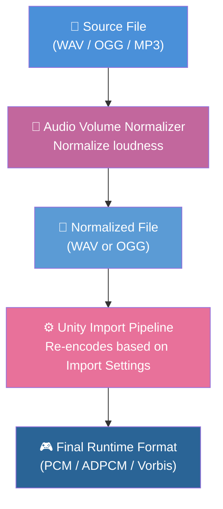
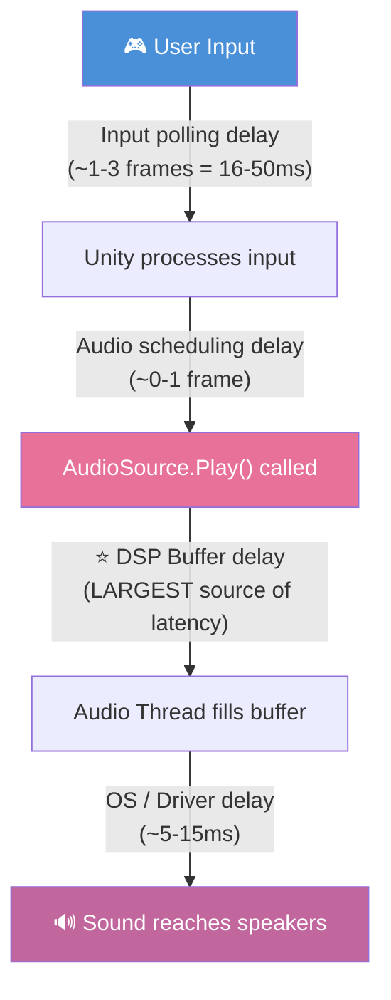
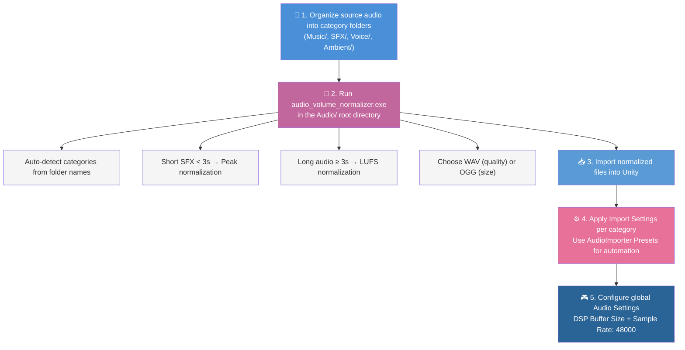

# Audio Best Practices for Unity Game Development

A comprehensive guide to audio asset preparation, Unity import settings, and optimization strategies for different game genres.

> **Scope**: This guide covers the **Unity built-in audio system** (AudioSource / AudioClip) workflow. If your project uses audio middleware such as **Wwise**, **FMOD**, or **CRIWARE (ADX2)**, the import pipeline, compression settings, load types, and latency characteristics discussed here **do not directly apply** — those tools replace Unity's audio engine with their own asset management, codec, and streaming systems. The [Audio Volume Normalizer tool](#workflow-with-audio-volume-normalizer) for source file loudness normalization is still useful regardless of which audio system you use, as it operates on source files before they enter any engine pipeline.

<p align="left"><br> English | <a href="AudioBestPractices.SCH.md">简体中文</a></p>

## Related CycloneGames.Audio Docs

- [Main plugin docs (English)](../../UnityStarter/Assets/ThirdParty/CycloneGames/CycloneGames.Audio/README.md)
- [Main plugin docs (简体中文)](../../UnityStarter/Assets/ThirdParty/CycloneGames/CycloneGames.Audio/README.SCH.md)

## Table of Contents

- [Audio Best Practices for Unity Game Development](#audio-best-practices-for-unity-game-development)
  - [Table of Contents](#table-of-contents)
  - [Audio Pipeline Overview](#audio-pipeline-overview)
  - [Source File Format: WAV vs OGG](#source-file-format-wav-vs-ogg)
    - [Recommendation](#recommendation)
  - [PCM Fundamentals and Audio Calculations](#pcm-fundamentals-and-audio-calculations)
    - [Core Parameters](#core-parameters)
    - [Memory Calculation](#memory-calculation)
    - [DSP Time and Scheduling](#dsp-time-and-scheduling)
    - [BPM and Beat Calculations](#bpm-and-beat-calculations)
      - [Can You Calculate BPM from PCM Metadata?](#can-you-calculate-bpm-from-pcm-metadata)
      - [If You Already Know the BPM](#if-you-already-know-the-bpm)
      - [Estimating Average BPM from Duration and Beat Count](#estimating-average-bpm-from-duration-and-beat-count)
  - [Unity AudioClip Import Settings](#unity-audioclip-import-settings)
    - [Compression Format](#compression-format)
    - [Load Type](#load-type)
    - [Streaming Risks and Considerations](#streaming-risks-and-considerations)
      - [Disk I/O Fluctuation](#disk-io-fluctuation)
      - [Buffer Underrun](#buffer-underrun)
      - [Startup Latency](#startup-latency)
      - [When Streaming Is Safe](#when-streaming-is-safe)
    - [Sample Rate Setting](#sample-rate-setting)
  - [Recommended Settings by Audio Category](#recommended-settings-by-audio-category)
    - [Music / BGM](#music--bgm)
    - [Voice / Dialog](#voice--dialog)
    - [SFX / Sound Effects](#sfx--sound-effects)
    - [Ambient / Environment](#ambient--environment)
  - [Recommended Settings by Game Genre](#recommended-settings-by-game-genre)
    - [Rhythm / Music Games](#rhythm--music-games)
    - [Action / FPS Games](#action--fps-games)
    - [RPG / Adventure Games](#rpg--adventure-games)
    - [Mobile Games](#mobile-games)
  - [Audio Latency Deep Dive](#audio-latency-deep-dive)
    - [DSP Buffer Size Impact](#dsp-buffer-size-impact)
    - [Load Type Latency Impact](#load-type-latency-impact)
    - [Compression Format Decode Latency](#compression-format-decode-latency)
    - [Bluetooth Audio Latency](#bluetooth-audio-latency)
  - [Folder Structure Convention](#folder-structure-convention)
  - [Workflow with Audio Volume Normalizer](#workflow-with-audio-volume-normalizer)
    - [Complete Workflow](#complete-workflow)

---

## Audio Pipeline Overview

Understanding the full pipeline is critical — **the source file format has NO impact on runtime performance**.



**Key insight**: Unity discards your source format on import. Whether you feed it WAV or OGG, the final in-game audio is determined **solely** by the AudioClip Import Settings.

---

## Source File Format: WAV vs OGG

| Aspect                | WAV (PCM 16-bit)                       | OGG (Vorbis VBR)                          |
| --------------------- | -------------------------------------- | ----------------------------------------- |
| **Runtime Memory**    | Identical                              | Identical                                 |
| **Runtime CPU**       | Identical                              | Identical                                 |
| **Audio Quality**     | Lossless → Unity encodes once          | Lossy → Unity may re-encode = double loss |
| **Project Disk Size** | ~10x larger                            | ~10x smaller                              |
| **Git Repo Impact**   | Large (use Git LFS)                    | Small                                     |
| **Build Time**        | Slightly longer (bigger files to read) | Slightly shorter                          |

### Recommendation

- **WAV** (default): Best quality. Use when quality matters and you manage disk with Git LFS.
- **OGG**: Use when repository size is a priority and slight quality loss is acceptable.

---

## PCM Fundamentals and Audio Calculations

PCM (Pulse Code Modulation) is the raw digital representation of audio. Understanding its parameters is essential for calculating memory usage, scheduling audio precisely, and working with rhythm/timing.

### Core Parameters

| Parameter              | Description                                                                       | Typical Values                                                                     |
| ---------------------- | --------------------------------------------------------------------------------- | ---------------------------------------------------------------------------------- |
| **Sample Rate** (Hz)   | Number of audio samples captured per second. Higher = more high-frequency detail. | 44100 Hz (CD quality), 48000 Hz (game/film standard)                               |
| **Bit Depth** (bits)   | Precision of each sample. Higher = more dynamic range.                            | 16-bit (CD, most games), 24-bit (professional), 32-bit float (internal processing) |
| **Channels**           | Number of independent audio streams.                                              | 1 (Mono), 2 (Stereo)                                                               |
| **Duration** (seconds) | Length of the audio clip.                                                         | Varies                                                                             |
| **Total Samples**      | Total sample frames in the clip. `= Sample Rate × Duration`                       | e.g. 48000 × 4.0 = 192000                                                          |

**Bytes per sample**:

| Bit Depth    | Bytes per Sample | Notes                            |
| ------------ | ---------------- | -------------------------------- |
| 8-bit        | 1                | Low quality, rarely used         |
| 16-bit       | 2                | Standard for games (CD quality)  |
| 24-bit       | 3                | Professional audio production    |
| 32-bit float | 4                | Internal processing, Unity mixer |

### Memory Calculation

When a clip is **fully decompressed in memory** (Decompress On Load with PCM format), its RAM usage is:

$$
\text{Memory (bytes)} = \text{Sample Rate} \times \text{Channels} \times \frac{\text{Bit Depth}}{8} \times \text{Duration (seconds)}
$$

Or equivalently:

$$
\text{Memory (bytes)} = \text{Total Samples} \times \text{Channels} \times \frac{\text{Bit Depth}}{8}
$$

**Example**: A 4-minute stereo track at 44100 Hz, 16-bit:

$$
44100 \times 2 \times 2 \times 240 = 42{,}336{,}000 \text{ bytes} \approx 40.4 \text{ MB}
$$

**Quick reference table** (16-bit PCM, stereo):

| Duration   | 44100 Hz | 48000 Hz |
| ---------- | -------- | -------- |
| 1 second   | ~172 KB  | ~188 KB  |
| 10 seconds | ~1.7 MB  | ~1.8 MB  |
| 1 minute   | ~10.1 MB | ~11.0 MB |
| 5 minutes  | ~50.4 MB | ~54.9 MB |

> **Important**: This is the **decompressed PCM size**, which is what occupies RAM when using `Decompress On Load`. With `Compressed In Memory` (Vorbis), the actual RAM usage is ~1/10 of this. With `Streaming`, only a small buffer (~few KB) stays in RAM. Use `Profiler.GetRuntimeMemorySizeLong(clip)` in Unity to get the exact runtime memory for any load type.

### DSP Time and Scheduling

Unity's audio runs on a **hardware-driven DSP clock** (`AudioSettings.dspTime`), independent of frame rate. This clock advances by a fixed increment each DSP callback:

$$
\text{DSP Increment (seconds)} = \frac{\text{DSP Buffer Size (samples)}}{\text{System Sample Rate (Hz)}}
$$

| DSP Buffer Size    | @ 48000 Hz | @ 44100 Hz |
| ------------------ | ---------- | ---------- |
| 256 (Best Latency) | 5.333 ms   | 5.805 ms   |
| 512 (Good Latency) | 10.667 ms  | 11.610 ms  |
| 1024 (Default)     | 21.333 ms  | 23.220 ms  |

**Precise sample position**: For any audio clip, you can calculate the exact playback position in DSP time:

$$
\text{Playback Position (seconds)} = \frac{\text{Current Sample}}{\text{Sample Rate}}
$$

$$
\text{Sample at Time } t = \lfloor t \times \text{Sample Rate} \rfloor
$$

This is what `AudioSource.timeSamples` gives you — the exact integer sample offset of the playback head.

### BPM and Beat Calculations

#### Can You Calculate BPM from PCM Metadata?

**No.** The PCM parameters (sample rate, bit depth, channels, duration) describe the _container_, not the _musical content_. BPM (beats per minute) is a property of the musical signal — detecting it requires **audio signal analysis** (onset detection, autocorrelation, spectral flux, FFT-based beat tracking). This is a DSP problem, not a metadata problem.

#### If You Already Know the BPM

When the BPM is known (from a music database, metadata tag, or manual input), you can calculate precise timing:

$$
\text{Seconds per Beat} = \frac{60}{\text{BPM}}
$$

$$
\text{Samples per Beat} = \frac{\text{Sample Rate} \times 60}{\text{BPM}}
$$

$$
\text{Total Beats} = \frac{\text{Duration (seconds)} \times \text{BPM}}{60}
$$

**Example**: A track at 128 BPM, 48000 Hz sample rate:

| Calculation        | Formula                       | Result                     |
| ------------------ | ----------------------------- | -------------------------- |
| Seconds per beat   | 60 / 128                      | 0.46875 s                  |
| Samples per beat   | 48000 × 60 / 128              | 22500 samples              |
| DSP time of beat N | startDspTime + N × (60 / 128) | startDspTime + N × 0.46875 |

**Scheduling beats with DSP time**:

```csharp
// Known BPM and start time
double bpm = 128.0;
double secPerBeat = 60.0 / bpm;
double startDsp = AudioSettings.dspTime + 1.0; // start 1s from now
bgmSource.PlayScheduled(startDsp);

// In Update: calculate which beat we're on
double elapsed = AudioSettings.dspTime - startDsp;
if (elapsed < 0) return; // not started yet
double currentBeat = elapsed / secPerBeat;
int beatIndex = (int)currentBeat;
double beatFraction = currentBeat - beatIndex; // 0.0-1.0 within the beat
```

> **Note**: `AudioSettings.dspTime` is **sample-accurate** and does not drift with frame rate. This is why it is the correct time source for rhythm synchronization, not `Time.time`.

#### Estimating Average BPM from Duration and Beat Count

If you have a known total beat count (e.g., from a chart file or manual count):

$$
\text{Average BPM} = \frac{\text{Total Beats} \times 60}{\text{Duration (seconds)}}
$$

This gives the **average** BPM. Many songs have variable BPM (tempo changes, rubato), so this is an approximation.

---

## Unity AudioClip Import Settings

### Compression Format

| Format     | Compression Ratio   | Decode CPU | Quality    | Best For                                   |
| ---------- | ------------------- | ---------- | ---------- | ------------------------------------------ |
| **PCM**    | 1:1 (none)          | Zero       | Perfect    | Short critical SFX, rhythm game hit sounds |
| **ADPCM**  | ~3.5:1              | Very low   | Good       | Frequent short SFX (footsteps, UI clicks)  |
| **Vorbis** | ~10:1+ (adjustable) | Moderate   | Good-Great | Music, dialog, ambient, long audio         |

### Load Type

| Load Type                | Memory Usage             | First-Play Latency       | CPU Impact              | Best For                             |
| ------------------------ | ------------------------ | ------------------------ | ----------------------- | ------------------------------------ |
| **Decompress On Load**   | High (full PCM in RAM)   | **Lowest** ✓             | Load-time only          | Short SFX, anything latency-critical |
| **Compressed In Memory** | Low (compressed in RAM)  | Medium (decoder startup) | Per-play decode         | Music, dialog, mid-length audio      |
| **Streaming**            | **Lowest** (tiny buffer) | **Highest** ✗            | Continuous I/O + decode | Very long audio, ambient loops       |

### Streaming Risks and Considerations

While **Streaming** offers the lowest memory footprint, it introduces several risks that must be carefully evaluated:

#### Disk I/O Fluctuation

Streaming audio reads data from disk in real time. This means playback quality is directly affected by disk I/O performance:

- **I/O Spikes**: When other systems (asset loading, scene transitions, texture streaming, save/load operations) compete for disk bandwidth, audio streaming buffers may starve, causing **audible stuttering, pops, or gaps**.
- **HDD vs SSD**: On traditional HDDs (still common on consoles and older PCs), mechanical seek latency makes I/O spikes far more frequent. SSDs mitigate this but do not eliminate it entirely under heavy load.
- **Mobile Storage**: Mobile devices have highly variable storage I/O performance. Background processes (OS updates, app downloads) can cause unpredictable I/O stalls.

#### Buffer Underrun

Streaming uses a small circular buffer. If disk I/O cannot fill the buffer fast enough:

- Audio playback **drops out** (silence or glitching) until the buffer catches up.
- Unity does **not** provide a built-in callback or event for buffer underrun — you cannot easily detect or recover from it at runtime.
- Multiple simultaneous streaming AudioSources multiply the I/O pressure, significantly increasing underrun probability.

#### Startup Latency

Streaming has the highest first-play latency (~20-100ms+) because:

1. The file handle must be opened
2. An initial disk read fills the streaming buffer
3. The decoder initializes and begins processing

This makes Streaming **unsuitable** for any audio that must play immediately on trigger (SFX, hit sounds, UI feedback).

#### When Streaming Is Safe

Streaming is appropriate **only** when all of these conditions are met:

- The audio is **long** (> 10 seconds, typically background music or ambient loops)
- A startup delay of **100ms+** is acceptable
- The audio is **non-critical** (a brief stutter won't ruin the player experience)
- Disk I/O pressure from other systems is **low or controlled** (no simultaneous heavy asset loading)
- The number of concurrent streaming AudioSources is **limited** (ideally ≤ 2-3)

> **Rule of thumb**: If you can afford the memory, prefer **Compressed In Memory** over Streaming. It eliminates all I/O-related risks while still providing good memory efficiency via Vorbis compression.

### Sample Rate Setting

| Setting                     | Description                                                        |
| --------------------------- | ------------------------------------------------------------------ |
| **Preserve Sample Rate**    | Keeps the original sample rate. Recommended for most cases.        |
| **Override** to 44100/48000 | Use if source files have unnecessarily high sample rates (96kHz+). |

> **Tip**: The Audio Volume Normalizer tool automatically caps sample rate at 48kHz — higher rates provide no audible benefit in games and waste memory.

---

## Recommended Settings by Audio Category

### Music / BGM

| Setting            | Value                        | Rationale                                  |
| ------------------ | ---------------------------- | ------------------------------------------ |
| Compression Format | **Vorbis** (Quality 70-100%) | Long audio, compression is essential       |
| Load Type          | **Compressed In Memory**     | Balance of memory and playback reliability |
| Preload Audio Data | ✓ Yes                        | Avoid hitches when music starts            |
| Normalizer Target  | -14.0 LUFS                   | Standard for game music                    |

> Do NOT use Streaming for BGM in rhythm games — disk I/O jitter causes timeline desync. See [Streaming Risks](#streaming-risks-and-considerations).

### Voice / Dialog

| Setting            | Value                    | Rationale                                       |
| ------------------ | ------------------------ | ----------------------------------------------- |
| Compression Format | **Vorbis** (Quality 70%) | Good compression, speech tolerates it well      |
| Load Type          | **Compressed In Memory** | Moderate memory, fast playback                  |
| Preload Audio Data | Depends                  | ✓ for critical dialog, ✗ for large VO libraries |
| Normalizer Target  | -16.0 LUFS               | Slightly quieter than music, sits well in mix   |

### SFX / Sound Effects

| Setting            | Value                                    | Rationale                         |
| ------------------ | ---------------------------------------- | --------------------------------- |
| Compression Format | **ADPCM** or **PCM**                     | Low decode cost, instant playback |
| Load Type          | **Decompress On Load**                   | Zero latency on play              |
| Preload Audio Data | ✓ Yes                                    | Must be ready instantly           |
| Normalizer Target  | -14.0 LUFS (long) / Peak -1.0 dB (short) | Short SFX use peak normalization  |

> **For frequently played SFX**: Use ADPCM + Decompress On Load. PCM if latency is absolutely critical (rhythm games).

### Ambient / Environment

| Setting            | Value                                     | Rationale                                           |
| ------------------ | ----------------------------------------- | --------------------------------------------------- |
| Compression Format | **Vorbis** (Quality 50-70%)               | Usually long loops, compression saves memory        |
| Load Type          | **Streaming** or **Compressed In Memory** | Low memory usage                                    |
| Preload Audio Data | ✗ No                                      | Can tolerate slight startup delay                   |
| Normalizer Target  | -20.0 LUFS                                | Quiet background, should not compete with SFX/Music |

> **Caution**: If choosing Streaming for ambient loops, ensure disk I/O load is controlled. In scenes with heavy asset loading (e.g., open world chunk streaming), prefer **Compressed In Memory** to avoid audio stuttering. See [Streaming Risks](#streaming-risks-and-considerations).

---

## Recommended Settings by Game Genre

### Rhythm / Music Games

Latency is the top priority. Even 10ms of extra delay can ruin gameplay.

**Global Audio Settings**:

```
Project Settings → Audio:
  DSP Buffer Size:    Best Latency (256 samples ≈ 5.3ms @ 48kHz)
  Sample Rate:        48000 (match source files, avoid resampling)
```

**Hit/Feedback Sounds**:

```
Compression Format: PCM
Load Type:          Decompress On Load
```

**Background Music**:

```
Compression Format: Vorbis (Quality 100%)
Load Type:          Compressed In Memory  (NOT Streaming!)
Preload Audio Data: ✓ Yes
```

> **Why NOT Streaming for rhythm BGM?** Disk I/O fluctuations cause unpredictable buffer underruns, leading to micro-stutters in the audio timeline. Since rhythm games rely on sample-accurate audio-visual synchronization, even a single buffer underrun can cause the entire note chart to desync from the music. See [Streaming Risks](#streaming-risks-and-considerations) for details.

**Critical Code Practices**:

- Use `AudioSettings.dspTime` (NOT `Time.time`) for rhythm synchronization
- Use `AudioSource.PlayScheduled(dspTime)` for sample-accurate playback scheduling
- Consider **FMOD** / **Wwise** / **CRIWARE** for commercial-grade rhythm games

### Action / FPS Games

Balance between latency and memory. Gunshots and impact sounds must feel instant.

**Global Audio Settings**:

```
DSP Buffer Size:    Good Latency (512 samples)
```

**Weapon / Impact SFX**:

```
Compression Format: ADPCM
Load Type:          Decompress On Load
```

**Ambient / Environment**:

```
Compression Format: Vorbis (Quality 50%)
Load Type:          Streaming
```

> **Note**: For open-world or level-streaming games where disk I/O pressure is high during chunk loading, consider switching ambient audio to **Compressed In Memory** to prevent audio pops during scene transitions.

### RPG / Adventure Games

Memory efficiency matters more than ultra-low latency. Large VO libraries are common.

**Global Audio Settings**:

```
DSP Buffer Size:    Default (1024 samples)
```

**Dialog / VO**:

```
Compression Format: Vorbis (Quality 60-70%)
Load Type:          Compressed In Memory
Preload:            ✗ No (load on demand to save memory)
```

**Music**:

```
Compression Format: Vorbis (Quality 80%)
Load Type:          Streaming  (OK for RPG, latency not critical)
```

> **Caution**: Even in RPGs, if your music is used for dramatic timing cues (e.g., boss phase transitions synced to music), avoid Streaming and use Compressed In Memory instead to prevent I/O-induced desync.

### Mobile Games

Memory is the primary constraint. Minimize decompressed audio in RAM.

**General Rule**: Prefer Vorbis + Compressed In Memory for everything.

**Short SFX**:

```
Compression Format: ADPCM (smaller than PCM, low CPU)
Load Type:          Decompress On Load
```

**Everything Else**:

```
Compression Format: Vorbis (Quality 50-60%)
Load Type:          Compressed In Memory
```

> **Why avoid Streaming on mobile?** Mobile storage I/O is highly variable — background OS processes, thermal throttling, and NAND wear can all cause I/O stalls that lead to audio dropout. Compressed In Memory is the safer default.

---

## Audio Latency Deep Dive

Total audio latency from input to ear:



### DSP Buffer Size Impact

| Setting          | Buffer (samples) | Latency @ 48kHz | Latency @ 44.1kHz |
| ---------------- | ---------------- | --------------- | ----------------- |
| Best Latency     | 256              | **5.3ms**       | **5.8ms**         |
| Good Latency     | 512              | 10.7ms          | 11.6ms            |
| Default          | 1024             | 21.3ms          | 23.2ms            |
| Best Performance | 4096             | **85.3ms**      | **92.9ms**        |

### Load Type Latency Impact

| Load Type            | First Play Delay | Reason                          |
| -------------------- | ---------------- | ------------------------------- |
| Decompress On Load   | **~0ms**         | Already decoded PCM in memory   |
| Compressed In Memory | **~1-5ms**       | Decoder initialization overhead |
| Streaming            | **~20-100ms+**   | Disk I/O + buffer fill + decode |

### Compression Format Decode Latency

| Format | Per-Play Overhead                             |
| ------ | --------------------------------------------- |
| PCM    | **0ms** (raw samples, no decoding)            |
| ADPCM  | **< 0.1ms** (trivial math)                    |
| Vorbis | **~1-3ms** (decoder startup + initial decode) |

### Bluetooth Audio Latency

Bluetooth headphones introduce an **additional** layer of latency that is **outside Unity's control** and stacks on top of all the delays above:

| Bluetooth Codec      | Typical Latency | Notes                                          |
| -------------------- | --------------- | ---------------------------------------------- |
| **SBC** (default)    | **150-300ms**   | Universal, worst latency                       |
| **AAC**              | **120-200ms**   | Apple ecosystem default                        |
| **aptX**             | **60-80ms**     | Qualcomm, Android common                       |
| **aptX Low Latency** | **~40ms**       | Requires both transmitter and receiver support |
| **aptX Adaptive**    | **50-80ms**     | Newer Qualcomm, adaptive bitrate               |
| **LC3 / LE Audio**   | **20-30ms**     | Bluetooth 5.2+, best case                      |

> **Key point**: Even the best Bluetooth codec adds ~20-40ms on top of the entire audio chain. With SBC (the most common fallback), total input-to-ear latency can exceed **250ms** — completely unacceptable for rhythm games or any latency-sensitive gameplay.

**Recommendations**:

- **Rhythm / Music games**: Display a warning or prompt when Bluetooth audio output is detected. Many commercial rhythm games disable Bluetooth audio entirely or show a calibration screen. Offer an **audio offset calibration** feature so players can manually compensate.
- **Latency-sensitive games (FPS, action)**: Consider providing an audio latency test/calibration option in settings.
- **Detection**: On Android, use `AudioManager.isBluetoothA2dpOn()` via a native plugin. On iOS, check `AVAudioSession.currentRoute` for Bluetooth output. Unity does not provide a built-in cross-platform API for this.
- **General advice**: Always recommend wired headphones or the device speaker in your game's audio settings tooltip for latency-critical scenarios.

---

## Folder Structure Convention

The Audio Volume Normalizer tool auto-detects categories from folder names. Use this recommended structure:

```
Assets/
└── Audio/
    ├── Music/          (or BGM/)
    │   ├── battle_theme.wav
    │   ├── menu_music.wav
    │   └── exploration.wav
    ├── SFX/            (or SE/ or Sound/)
    │   ├── gunshot.wav
    │   ├── footstep_grass.wav
    │   ├── ui_click.wav
    │   └── explosion.wav
    ├── Voice/          (or Dialog/ or VO/)
    │   ├── npc_greeting_01.wav
    │   ├── narrator_intro.wav
    │   └── player_hurt.wav
    └── Ambient/        (or Env/)
        ├── forest_loop.wav
        ├── rain.wav
        └── wind.wav
```

This structure serves dual purposes:

1. **Audio Volume Normalizer** auto-applies correct loudness targets per category
2. **Unity project organization** — easy to apply different Import Settings per folder via AudioImporter presets

> **Tip**: In Unity, you can create **AudioImporter Presets** and assign them to folders, so all audio in `SFX/` automatically gets ADPCM + Decompress On Load settings.

---

## Workflow with Audio Volume Normalizer

### Complete Workflow


