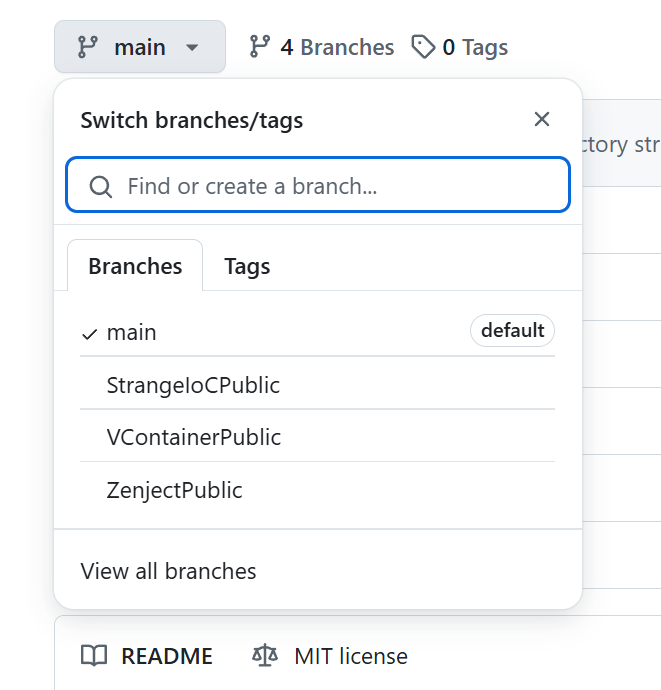

# Unity 项目启动模板

这是一个轻量级、模块化的 Unity 项目模板，旨在为您的新项目提供一个坚实的基础。它集成了借鉴**虚幻引擎**理念的 **Gameplay Framework**、**Gameplay Tags** 和 **Gameplay Ability System**，以及**高性能、低 GC** 的资源、对象池和音频管理系统。此外，项目还包含实用的 Debug 工具，并支持多种 **DI/IoC 框架**。所有模块均以解耦清晰的 Unity Package 形式开发，且已针对 **Android, iOS, WebGL** 等多平台进行了优化。

<p align="left"><br> <a href="README.md">English</a> | 简体中文</p>

[](https://deepwiki.com/MaiKuraki/UnityStarter)

## 概述
一个轻量级的 Unity 启动模板，旨在作为新项目的基础框架。本仓库整合了以下内容：

- **流行的开源 Unity Package 包**
- **DI/IoC 框架支持**，预配置适配器：(列出的这些 DI/IoC 框架均为作者在商业项目中验证使用过的)
  - [VContainer](https://github.com/hadashiA/VContainer)
  - [StrangeIoC](https://github.com/strangeioc/strangeioc)
  - [Extenject(Zenject)](https://github.com/Mathijs-Bakker/Extenject) (该项目作者宣布不积极维护)
> 由于 [**Zenject**](https://github.com/Mathijs-Bakker/Extenject) 作者宣布[停止对项目的更新](https://github.com/Mathijs-Bakker/Extenject/issues/73)，这里我更推荐尝试 [**VContainer**](https://github.com/hadashiA/VContainer)，如果你希望对项目更高度的自定义，则更推荐 [**StrangeIoC**](https://github.com/strangeioc/strangeioc)。如果你希望使用 [**Zenject**](https://github.com/Mathijs-Bakker/Extenject)，那么 [**MessagePipe**](https://github.com/Cysharp/MessagePipe) 也是一个可以搭配的消息框架。

## DI 框架选择指南 
通过切换 Git 分支可查看各 DI 框架的实现范例。<br/>
注意：**GameplayFramework** 与 **Factory** 拥有针对 DI 编写的示例<br/>


## 使用项目

你可以通过两种主要方式使用此仓库：一是作为新项目的完整模板，二是从中选取独立模块导入到你的现有项目中。

### 作为完整的项目模板
如果你希望将此仓库作为新项目的起点，请按照以下步骤进行重命名：

1.  **找到重命名工具**：在 `Tools/` 目录下找到 `rename_project` 的 Go 语言脚本或 `.exe` 可执行文件。
2.  **移动重命名工具**：将该`rename_project`脚本或可执行文件复制到 `UnityStarter/` 目录下。
3.  **运行工具**：执行该脚本。它会自动更新项目相关的组件，如命名空间（namespaces）和程序集定义（assembly definitions）。
4.  **手动重命名**：最后，手动将根目录 `UnityStarter/` 重命名为你自己的项目名称。

### 使用项目中的特定模块
如果你只需要项目中的部分模块，有两种方式可供选择：

- **简单方式**：直接在 `Assets/ThirdParty/CycloneGames/` 目录中删除你不需要的模块包。
- **推荐方式（用于实际项目）**：在正式项目中，最好将所需的包从 `Assets/ThirdParty/CycloneGames/` 移至项目 `Assets` 文件夹之外的任意位置，然后通过 Unity Package Manager 的 **"Add package from disk..."** 功能将其作为本地包（Package）引入。这种方法有助于保持项目结构的清晰和高度模块化。

## 核心框架模块

### 🎮 游戏玩法系统
- **[GameplayFramework](UnityStarter/Assets/ThirdParty/CycloneGames/CycloneGames.GameplayFramework)** - 虚幻引擎风格的游戏框架，包含 Actor、Pawn、Controller、GameMode 概念。支持 DI 的可扩展游戏项目架构。
- **[GameplayAbilities](UnityStarter/Assets/ThirdParty/CycloneGames/CycloneGames.GameplayAbilities)** - 强大的数据驱动技能系统，灵感来自虚幻引擎的 GAS。支持复杂技能、属性、状态效果，基于 ScriptableObject 设计。
- **[GameplayTags](UnityStarter/Assets/ThirdParty/CycloneGames/CycloneGames.GameplayTags)** - 基于标签的识别系统，用于技能、效果和游戏状态，灵感来自虚幻引擎的 GameplayTags。支持运行时动态标签注册和自动生成。
- **[RPGFoundation](UnityStarter/Assets/ThirdParty/CycloneGames/CycloneGames.RPGFoundation)** - 包含 RPG 类游戏的基础拓展。

### 🏗️ 核心基础设施  
- **[Factory](UnityStarter/Assets/ThirdParty/CycloneGames/CycloneGames.Factory)** - 高性能、低 GC 的工厂和对象池工具。线程安全的自动扩缩容池，O(1) 操作复杂度。
- **[Logger](UnityStarter/Assets/ThirdParty/CycloneGames/CycloneGames.Logger)** - 零/低 GC 日志系统，支持可插拔处理策略。支持线程化工作模式、文件轮转和跨平台兼容（包括 WebGL）。
- **[AssetManagement](UnityStarter/Assets/ThirdParty/CycloneGames/CycloneGames.AssetManagement)** - DI 优先的资源管理抽象层，集成 [YooAsset](https://github.com/tuyoogame/YooAsset)。支持下载、缓存、版本管理，兼容 Addressables/[Navigathena](https://github.com/mackysoft/Navigathena)。
- **[Audio](UnityStarter/Assets/ThirdParty/CycloneGames/CycloneGames.Audio)** - 一个高性能、低 GC、类似 Wwise 操作体验的，使用了 Unity 原生 Audio 功能的高级功能拓展。

### 🎯 输入与界面
- **[InputSystem](UnityStarter/Assets/ThirdParty/CycloneGames/CycloneGames.InputSystem)** - 响应式输入封装，支持上下文栈、本地多人、键盘双人、自动检测新设备接入、基于 YAML 的游戏运行时修改键位配置。使用 R3 Observable 构建。
- **[UIFramework](UnityStarter/Assets/ThirdParty/CycloneGames/CycloneGames.UIFramework)** - 层级式 UI 管理系统，支持基于层的组织、转场动画和资源集成。

### 🛠️ 工具与服务
- **[Utility](UnityStarter/Assets/ThirdParty/CycloneGames/CycloneGames.Utility)** - 通用工具集，包含 FPS 计数器、安全区域适配、文件操作、性能工具和 Unity 启动画面控制。
- **[Services](UnityStarter/Assets/ThirdParty/CycloneGames/CycloneGames.Services)** - 游戏服务抽象层，用于摄像机管理、图形设置和设备配置，支持基于 YAML 的设置。
- **[Cheat](UnityStarter/Assets/ThirdParty/CycloneGames/CycloneGames.Cheat)** - 类型安全的调试命令管道，集成 [VitalRouter](https://github.com/hadashiA/VitalRouter)。支持异步操作和线程安全执行。
- **[FontAssets](UnityStarter/Assets/ThirdParty/CycloneGames/CycloneGames.FontAssets)** - 多语言字体集合和字符集，支持拉丁文、中文（简体/繁体）、日文和韩文本地化。

### 🌐 网络
- **[Networking](UnityStarter/Assets/ThirdParty/CycloneGames/CycloneGames.Networking)** - 网络抽象层，提供 [Mirror](https://github.com/MirrorNetworking/Mirror) 适配器。为传输、序列化和技能系统集成提供接口。

## 项目结构说明
项目主要源码位于 `UnityStarter/Assets/ThirdParty/` 目录下。采用 **Unity Package** 形式开发，分离 asmdef 设计，可轻易的选择移除不需要的包。

```
.
├── Docs/                               # 项目文档
├── Tools/                              # 实用工具集 (含项目重命名、清理工具等)
└── UnityStarter/                       # Unity 主工程
    ├── Assets/
    │   ├── Editor/
    │   │   ├── BuildScript.cs          # 用于 CI/CD 的构建工具
    │   │   └── ...
    │   ├── ThirdParty/
    │   │   ├── CycloneGames/           # 核心开发套件
    │   │   │   ├── Cheat/              # 调试命令管道系统
    │   │   │   ├── Factory/            # 高性能对象池
    │   │   │   ├── GameplayAbilities/  # 数据驱动技能系统（类似 UnrealEngine GAS）
    │   │   │   ├── GameplayFramework/  # UE 风格游戏架构（类似 UnrealEngine GameplayFramework）
    │   │   │   ├── GameplayTags/       # 基于标签的识别系统（类似 UnrealEngine GameplayTags）
    │   │   │   ├── InputSystem/        # 响应式输入管理，支持上下文栈
    │   │   │   ├── Logger/             # 零 GC 多线程日志
    │   │   │   ├── AssetManagement/    # 资源加载和版本管理
    │   │   │   ├── Services/           # 通用游戏服务抽象
    │   │   │   ├── UIFramework/        # 层级式 UI 管理
    │   │   │   ├── Networking/         # 网络抽象层
    │   │   │   ├── FontAssets/         # 多语言字体集合
    │   │   │   ├── Audio/              # 增强型音频管理系统
    │   │   │   ├── RPGFoundation/      # RPG 基础组件 (例如, Movement)
    │   │   │   └── Utility/            # 性能工具和实用程序
    │   │   └── ...
    │   └── ...
    ├── Packages/                       # 包清单与配置
    └── ProjectSettings/                # Unity 项目设置
```

## 技术特性与依赖关系

### 核心技术栈
- **Unity 2022.3+** - 所有模块的必需 Unity 版本
- **UniTask** - Unity 异步/等待操作支持
- **R3** - Unity 响应式扩展（InputSystem 中使用）
- **LitMotion** - 一个高性能的补间动画库
- **VYaml** - 配置文件的 YAML 序列化
- **VitalRouter** - 消息路由系统（Cheat 系统中使用）
- **YooAsset** - 资源管理和热更新支持
- **Mirror** - 网络框架适配器

### 架构特点
- **依赖注入就绪**: 所有模块支持 VContainer、StrangeIoC 和 Zenject
- **程序集定义隔离**: 每个模块都有自己的 asmdef，确保清晰分离
- **ScriptableObject 配置**: 技能、效果和设置的数据驱动设计
- **线程安全设计**: Logger 和 Factory 模块专为多线程操作设计
- **零/低 GC**: 性能优化，最小垃圾回收
- **跨平台**: 支持桌面、移动和 WebGL 部署

## 基于此项目的其他开源项目

- [x] [Rhythm Pulse](https://github.com/MaiKuraki/RhythmPulse) 一款集合所有常见音乐游戏玩法的开源项目，目前还在开发中。
- [x] [Unity Gameplay Ability System Sample](https://github.com/MaiKuraki/UnityGameplayAbilitySystemSample) 为 Unity 设计的类虚幻引擎 GAS 系统的示例项目。