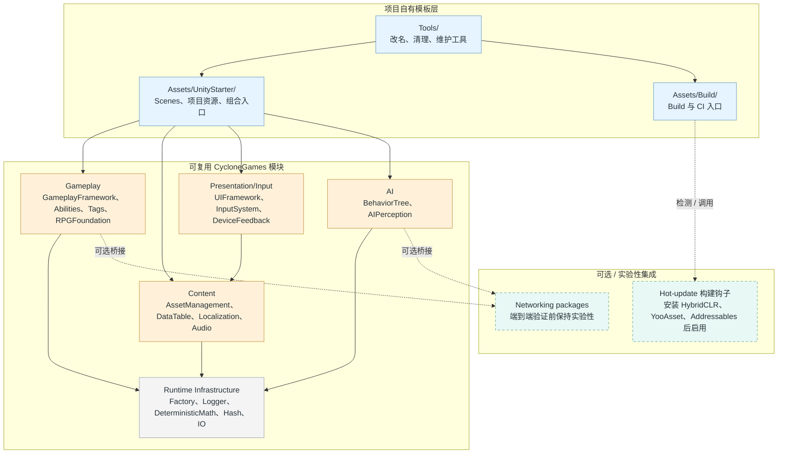

%20│%20UIFramework%20│%20HotUpdate%20Ready%20(HybridCLR)%20│%20CI/CD%20Ready&descAlign=50&descAlignY=58&descSize=16&fontAlignY=30&fontSize=72>)

一套面向生产、模块化的 Unity **基础工程**与可复用框架底座，借鉴**虚幻引擎**架构。其中 `GameplayFramework` 采用类似 Unreal 的 `Actor`、`Pawn`、`Controller`、`GameMode` 组织方式，**Gameplay Abilities** 与 **GameplayTags** 则提供 GAS 风格的能力与标签基础，用于建立清晰的玩法契约。

UnityStarter 并不是面向新人和小型项目的开箱即用框架。它的设计目标是成为中大型 Unity 项目中稳定、可维护、可长期演进的底层工程基础：明确的所有权边界、性能优先的运行时系统、引擎无关核心，以及由项目自身维护的构建与工具基础设施。

<p align="left"><br> <a href="README.md">English</a> | 简体中文</p>

> [!NOTE]
> 如果你觉得这个项目对你有帮助，请点一个 Star ⭐，谢谢！


[](https://deepwiki.com/MaiKuraki/UnityStarter)

## 目录

- [目录](#目录)
- [为什么设计 UnityStarter](#为什么设计-unitystarter)
- [项目内容概览](#项目内容概览)
- [架构原则](#架构原则)
  - [项目所有权模型](#项目所有权模型)
- [仓库结构](#仓库结构)
- [模块地图](#模块地图)
  - [Gameplay](#gameplay)
  - [AI](#ai)
  - [Data、Assets And Content](#dataassets-and-content)
  - [Runtime Infrastructure](#runtime-infrastructure)
  - [Build、Tools And Quality](#buildtools-and-quality)
- [Networking 状态](#networking-状态)
- [Build、CI/CD 与项目工具](#buildcicd-与项目工具)
  - [Build 是项目自有基础设施](#build-是项目自有基础设施)
  - [派生项目工具](#派生项目工具)
- [快速开始](#快速开始)
  - [环境要求](#环境要求)
  - [首次运行](#首次运行)
  - [单独使用模块](#单独使用模块)
- [技术栈](#技术栈)
- [文档入口](#文档入口)
- [验证状态](#验证状态)
- [相关项目](#相关项目)

## 为什么设计 UnityStarter

UnityStarter 面向希望从第一天就具备生产级工程结构的 Unity 开发者和团队：可预测的资源所有权、清晰拆分的 gameplay architecture、data-driven content、明确的 module boundaries、build automation、analyzers，以及项目维护工具。

这个仓库可以用两种方式使用：

- **作为项目模板**：在 Unity 中打开 `UnityStarter/`，用内置工具改名，让项目自有的 `Assets/Build/` 层随着你的游戏继续演进。
- **以 Package（UPM）形式**：把`CycloneGames` 目录下的包，移动到项目外，然后用 PackageManager 引入项目。

它真正提供的是围绕所有权、可测试性、可选集成、构建配置、Editor tooling 和文档形成的可复用工程基础。

## 项目内容概览

UnityStarter 由可复用的 `CycloneGames` 框架层、Unity 项目模板、项目自有 Build/CI 模块、独立维护工具、中英文文档，以及面向验证和工程规范的 analyzer 支持共同组成。

如果需要查看具体模块，请直接阅读[模块地图](#模块地图)。它是 gameplay、content、UI/input、AI、runtime infrastructure、build tooling 与 experimental networking packages 的主要入口。

| 项目 | 详细信息 |
| --- | --- |
| Unity 项目根目录 | `UnityStarter/` |
| Unity 版本来源 | `UnityStarter/ProjectSettings/ProjectVersion.txt` |
| CycloneGames 模块目录 | `UnityStarter/Assets/ThirdParty/CycloneGames/` |
| Assembly definitions | Package 与项目 assembly boundary 由 `UnityStarter/Assets/` 下的 `.asmdef` 文件声明。 |
| Analyzer 规则 | 20+ 条已实现的 `CycloneGames.Analyzers` 规则 |
| 独立工具 | `Tools/Executable/Windows/` 下的 Go 工具 Windows 可执行文件 |

## 架构原则

- **关键逻辑优先纯 C#**：当逻辑需要在 CLI、EditMode、headless simulation 或未来 adapter 中测试时，核心契约避免泄露 `UnityEngine` 类型。
- **Unity 负责集成与表现**：`MonoBehaviour`、`ScriptableObject`、Editor tools、scene bindings 和 assets 负责桥接 runtime systems，而不是承载复杂领域规则。
- **可选集成物理隔离**：DI containers、tween engines、scene navigation、serializers、transports 和 hot-update backends 都放在独立 integration assemblies 后面。
- **性能是设计约束**：热路径以 zero-GC 或 low-GC 为目标，强调可预测所有权、可复用 buffers 和明确 lifecycle cleanup。
- **Build 是项目自有层**：`Assets/Build/` 应随派生项目一起演进，根据产品需求调整。
- **文档是 API 的一部分**：长期维护模块应同步维护 `README.md` 和 `README.SCH.md`。

### 项目所有权模型

这张图用于说明仓库所有权与模块职责，不表示运行时依赖顺序。它的重点是：哪些部分会随派生项目持续维护，哪些部分属于可复用框架模块，哪些部分是可选或实验性集成。


```mermaid
flowchart TD
  subgraph ProjectOwned["项目自有模板层"]
    StarterAssets["Assets/UnityStarter/\nScenes、项目资源、组合入口"]
    BuildLayer["Assets/Build/\nBuild 与 CI 入口"]
    ProjectTools["Tools/\n改名、清理、维护工具"]
  end

  subgraph FrameworkModules["可复用 CycloneGames 模块"]
    Gameplay["Gameplay\nGameplayFramework、Abilities、Tags、RPGFoundation"]
    Content["Content\nAssetManagement、DataTable、Localization、Audio"]
    Presentation["Presentation/Input\nUIFramework、InputSystem、DeviceFeedback"]
    AI["AI\nBehaviorTree、AIPerception"]
    Infrastructure["Runtime Infrastructure\nFactory、Logger、DeterministicMath、Hash、IO"]
  end

  subgraph OptionalIntegrations["可选 / 实验性集成"]
    Networking["Networking packages\n端到端验证前保持实验性"]
    HotUpdate["Hot-update 构建钩子\n安装 HybridCLR、YooAsset、Addressables 后启用"]
  end

  ProjectTools --> StarterAssets
  ProjectTools --> BuildLayer
  StarterAssets --> Gameplay
  StarterAssets --> Content
  StarterAssets --> Presentation
  StarterAssets --> AI
  Gameplay --> Infrastructure
  Content --> Infrastructure
  Presentation --> Content
  AI --> Infrastructure
  BuildLayer -. 检测 / 调用 .-> HotUpdate
  Gameplay -. 可选桥接 .-> Networking
  AI -. 可选桥接 .-> Networking

  class StarterAssets,BuildLayer,ProjectTools projectNode
  class Gameplay,Content,Presentation,AI frameworkNode
  class Infrastructure infraNode
  class Networking,HotUpdate optionalNode

  classDef projectNode fill:#E6F4FF,stroke:#6B9BC3,color:#263238,stroke-width:1px
  classDef frameworkNode fill:#FFF1D9,stroke:#C99745,color:#263238,stroke-width:1px
  classDef infraNode fill:#F4F4F5,stroke:#9CA3AF,color:#263238,stroke-width:1px
  classDef optionalNode fill:#E8F8F5,stroke:#67A69A,color:#263238,stroke-width:1px,stroke-dasharray: 5 4
```

## 仓库结构

```text
<repo-root>/
  README.md / README.SCH.md              # 根目录中英文总览
  Docs/                                  # 跨模块指南
  Tools/                                 # 独立维护工具
  UnityStarter/                          # Unity 项目根目录
    Analyzers/CycloneGames.Analyzers/    # Roslyn analyzer 项目
    Assets/Build/                        # 项目自有 Build/CI 模块
    Assets/ThirdParty/CycloneGames/      # 可复用 CycloneGames 框架模块
    Assets/UnityStarter/                 # 模板项目 scenes 与 game-side assets
    Packages/                            # Unity package manifest 与 lock file
    ProjectSettings/                     # Unity settings，包含版本来源
```

## 模块地图

这里作为模块导航地图使用。快速评估时，建议先看 `GameplayFramework`、`AssetManagement`、`GameplayAbilities`、`GameplayTags`、`DataTable` 和 `Build`。

### Gameplay

| 模块 | 职责 | 文档 |
| --- | --- | --- |
| **GameplayFramework** | Actor/Pawn/Controller/GameMode 结构、gameplay lifecycle、camera flow 与 scene-flow foundation。 | [README.SCH](UnityStarter/Assets/ThirdParty/CycloneGames/CycloneGames.GameplayFramework/README.SCH.md) |
| **GameplayAbilities** | GAS 风格 data-driven ability、attribute、effect、cost、cooldown 与 cue system，具有显式 authority/replica role 与权威 `AuthorityOnly` execution boundary。可选 Networking integration 提供 authority activation protocol building block，不是 transport endpoint。 | [README.SCH](UnityStarter/Assets/ThirdParty/CycloneGames/CycloneGames.GameplayAbilities/README.SCH.md) |
| **Choreography** | 引擎无关的 action presentation scheduling，用于 animation、audio、VFX、gameplay-event markers 与 preload coordination。 | [README.SCH](UnityStarter/Assets/ThirdParty/CycloneGames/CycloneGames.Choreography/README.SCH.md) |
| **GameplayTags** | 层级 tags、generated constants、query helpers、editor tooling 与 integration points。 | [README.SCH](UnityStarter/Assets/ThirdParty/CycloneGames/CycloneGames.GameplayTags/README.SCH.md) |
| **RPGFoundation** | RPG movement 与 interaction foundations，可与其他 gameplay packages 集成。 | [README.SCH](UnityStarter/Assets/ThirdParty/CycloneGames/CycloneGames.RPGFoundation/README.SCH.md) |
| **UIFramework** | Window management、UI flow、presentation patterns，以及委托给 `AssetManagement` W-TinyLFU cache 的 asset-backed UI loading；`UIFramework` 自身不维护独立的 `CacheRetention` 策略层。 | [README.SCH](UnityStarter/Assets/ThirdParty/CycloneGames/CycloneGames.UIFramework/README.SCH.md) |
| **Foundation2D** | 面向派生项目的 2D foundation package 与 samples。 | [目录](UnityStarter/Assets/ThirdParty/CycloneGames/CycloneGames.Foundation2D/) |

### AI

| 模块 | 职责 | 文档 |
| --- | --- | --- |
| **BehaviorTree** | Behavior tree runtime、editor support、tests 与 data-oriented runtime pieces。 | [README.SCH](UnityStarter/Assets/ThirdParty/CycloneGames/CycloneGames.BehaviorTree/README.SCH.md) |
| **AIPerception** | Jobs/Burst-oriented perception、sensor queries、spatial structures 与 low-GC runtime flow。 | [README.SCH](UnityStarter/Assets/ThirdParty/CycloneGames/CycloneGames.AIPerception/README.SCH.md) |

### Data、Assets And Content

| 模块 | 职责 | 文档 |
| --- | --- | --- |
| **AssetManagement** | Interface-first asset loading abstraction，包含 W-TinyLFU-inspired caching、`CacheRetention` policies/scheduler、provider abstraction、diagnostics 和 async loading flows。 | [README.SCH](UnityStarter/Assets/ThirdParty/CycloneGames/CycloneGames.AssetManagement/README.SCH.md) |
| **DataTable** | 面向策划配置的数据管线，支持可选 Luban、MessagePack 与 asset-management bridges。 | [README.SCH](UnityStarter/Assets/ThirdParty/CycloneGames/CycloneGames.DataTable/README.SCH.md) |
| **GameplayTags.DataTable** | GameplayTags authoring 与 loading 的 DataTable integration。 | [README.SCH](UnityStarter/Assets/ThirdParty/CycloneGames/CycloneGames.GameplayTags.DataTable/README.SCH.md) |
| **Choreography.AssetManagement** | `CycloneGames.AssetManagement` 的可选 Choreography resource provider bridge。 | [README.SCH](UnityStarter/Assets/ThirdParty/CycloneGames/CycloneGames.Choreography.AssetManagement/README.SCH.md) |
| **Choreography.CycloneAudio** | `CycloneGames.Audio` 的可选 Choreography audio provider bridge。 | [README.SCH](UnityStarter/Assets/ThirdParty/CycloneGames/CycloneGames.Choreography.CycloneAudio/README.SCH.md) |
| **Localization** | String tables、locale fallback、asset variants 与 hot-reload-oriented loading。 | [README.SCH](UnityStarter/Assets/ThirdParty/CycloneGames/CycloneGames.Localization/README.SCH.md) |
| **Audio** | Audio management layer，包含 async loading、runtime ownership 与 platform-aware policies。 | [README.SCH](UnityStarter/Assets/ThirdParty/CycloneGames/CycloneGames.Audio/README.SCH.md) |
| **FontAssets** | CJK、Latin、symbols 与 number font assets。 | [目录](UnityStarter/Assets/ThirdParty/CycloneGames/CycloneGames.FontAssets/) |

### Runtime Infrastructure

| 模块 | 职责 | 文档 |
| --- | --- | --- |
| **Factory** | Factory 与 object pooling module，支持 DI-friendly usage 和 ECS/DOD variants。 | [README.SCH](UnityStarter/Assets/ThirdParty/CycloneGames/CycloneGames.Factory/README.SCH.md) |
| **Logger** | Thread-safe logging，包含 levels、filtering、background processing 与 Unity integration。 | [README.SCH](UnityStarter/Assets/ThirdParty/CycloneGames/CycloneGames.Logger/README.SCH.md) |
| **DeterministicMath** | Fixed-point deterministic math，用于 replay、simulation 与 lockstep-friendly systems。 | [README.SCH](UnityStarter/Assets/ThirdParty/CycloneGames/CycloneGames.DeterministicMath/README.SCH.md) |
| **Hash** | Deterministic hashing primitives，用于 manifests、protocol checks、IDs 与 consistency。 | [README.SCH](UnityStarter/Assets/ThirdParty/CycloneGames/CycloneGames.Hash/README.SCH.md) |
| **IO** | 面向 Unity-aware foundation modules 的 managed file and path utilities。 | [README.SCH](UnityStarter/Assets/ThirdParty/CycloneGames/CycloneGames.IO/README.SCH.md) |
| **Persistence** | 无 Unity 依赖、有界、版本化的单记录 orchestration，提供严格 Record V1 完整性检查，以及与 serializer/storage 无关的 contract。 | [README.SCH](UnityStarter/Assets/ThirdParty/CycloneGames/CycloneGames.Persistence/README.SCH.md) |
| **Persistence.SystemIO** | 可选 System.IO storage 与 Unity `persistentDataPath` composition，提供有界读取和原子 commit 行为。 | [README.SCH](UnityStarter/Assets/ThirdParty/CycloneGames/CycloneGames.Persistence.SystemIO/README.SCH.md) |
| **Persistence.VYaml** | 可选 generated-resolver VYaml codec，用于可读 UTF-8 persistence payload。 | [README.SCH](UnityStarter/Assets/ThirdParty/CycloneGames/CycloneGames.Persistence.VYaml/README.SCH.md) |
| **Persistence.MessagePack** | 可选、受 asmdef gate 控制的 MessagePack codec source；只有安装锁定 binary、analyzer 与 Unity bridge 后才会参与编译。 | [README.SCH](UnityStarter/Assets/ThirdParty/CycloneGames/CycloneGames.Persistence.MessagePack/README.SCH.md) |
| **InputSystem** | 提供经过验证的 YAML 输入 authoring、带优先级的 mapping context、每玩家设备所有权、本地多人、binding profile、Editor tooling 与 opt-in integration。 | [README.SCH](UnityStarter/Assets/ThirdParty/CycloneGames/CycloneGames.InputSystem/README.SCH.md) |
| **InputSystem.AssetManagement** | InputSystem、AssetManagement 与 VContainer 之间的可选物理 package-loading bridge。 | [README.SCH](UnityStarter/Assets/ThirdParty/CycloneGames/CycloneGames.InputSystem.AssetManagement/README.SCH.md) |
| **DeviceFeedback** | Haptics、vibration、rumble 与 device-light feedback abstractions。 | [README.SCH](UnityStarter/Assets/ThirdParty/CycloneGames/CycloneGames.DeviceFeedback/README.SCH.md) |
| **Settings** | 无 Unity 依赖、带 clone 的 settings state，提供默认值、validation、forward migration、隔离 snapshot 与强类型 commit 后通知。 | [README.SCH](UnityStarter/Assets/ThirdParty/CycloneGames/CycloneGames.Settings/README.SCH.md) |
| **Settings.Persistence** | 可选 integration，在不耦合两个 Core 的前提下组合 Settings state/migration 与一条 Persistence Store。 | [README.SCH](UnityStarter/Assets/ThirdParty/CycloneGames/CycloneGames.Settings.Persistence/README.SCH.md) |
| **Utility** | Common Unity utility components and helpers。 | [目录](UnityStarter/Assets/ThirdParty/CycloneGames/CycloneGames.Utility/) |
| **Cheat** | Build-gated internal cheat command system，集成 VitalRouter。 | [README.SCH](UnityStarter/Assets/ThirdParty/CycloneGames/CycloneGames.Cheat/README.SCH.md) |

### Build、Tools And Quality

| 区域 | 职责 | 文档 |
| --- | --- | --- |
| **Build** | 项目自有 player build pipeline、version info、可选 hot-update hooks 与 CI-facing methods。 | [README.SCH](UnityStarter/Assets/Build/README.SCH.md) |
| **Tools** | 用于项目改名、package trimming、cleanup、file trees 与 asset processing 的 Go tools。 | [README.SCH](Tools/README.SCH.md) |
| **Analyzers** | 面向 Unity performance、safety、async 与 conventions 的 Roslyn analyzer rules。 | [README.SCH](UnityStarter/Analyzers/CycloneGames.Analyzers/README.SCH.md) |

## Networking 状态

Networking layer 是 experimental foundation。生产接入必须使用选定的 transport、serializer、authority model、reconnect flow、目标平台和 gameplay replication policy 完成端到端验证。

| 模块 | 职责 | 状态 |
| --- | --- | --- |
| **Networking** | Transport-neutral contracts、message catalogs、protocol manifests、sessions、replication、security、serializers、adapters 与 diagnostics。 | 实验性。[README.SCH](UnityStarter/Assets/ThirdParty/CycloneGames/CycloneGames.Networking/README.SCH.md) |
| **GameplayFramework.Networking** | Session bridge、actor migration serialization、authority roles 与 observer resolution。 | 实验性。[README.SCH](UnityStarter/Assets/ThirdParty/CycloneGames/CycloneGames.GameplayFramework.Networking/README.SCH.md) |
| **AIPerception.Networking** | Perception event、snapshot、memory、authority 与 host-migration contracts。 | 实验性。[README.SCH](UnityStarter/Assets/ThirdParty/CycloneGames/CycloneGames.AIPerception.Networking/README.SCH.md) |
| **BehaviorTree.Networking** | Behavior tree replication profiles、authority helpers、snapshots 与 blackboard deltas。 | 实验性。[README.SCH](UnityStarter/Assets/ThirdParty/CycloneGames/CycloneGames.BehaviorTree.Networking/README.SCH.md) |
| **RPGFoundation.Movement.Networking** | Movement input、snapshot、correction、teleport、authority transfer、validation、history 与 reconciliation contracts。 | 实验性。[README.SCH](UnityStarter/Assets/ThirdParty/CycloneGames/CycloneGames.RPGFoundation.Movement.Networking/README.SCH.md) |
| **RPGFoundation.Interaction.Networking** | Interaction DTOs、vector conversion、authority validation bridge 与 message catalog registration。 | 实验性。[README.SCH](UnityStarter/Assets/ThirdParty/CycloneGames/CycloneGames.RPGFoundation.Interaction.Networking/README.SCH.md) |
| **RPGFoundation.Projectile.Networking** | Projectile protocol metadata、DTOs、validation helpers、prediction reconciliation、snapshot history 与 authority bridge contracts。 | 实验性。[README.SCH](UnityStarter/Assets/ThirdParty/CycloneGames/CycloneGames.RPGFoundation.Projectile.Networking/README.SCH.md) |

## Build、CI/CD 与项目工具

### Build 是项目自有基础设施

`UnityStarter/Assets/Build/` 是项目自有基础设施。产品项目可以在其中调整 scenes、version prefixes、output layout、hot-update assembly lists、platform signing 和 release rules。

当开发者从 UnityStarter 派生新游戏并运行 `rename_project` 后，Build layer 会保留在新项目中，并应继续由该项目维护。

Build 模块包含：

- `BuildData` ScriptableObject 配置。
- 通过 `Build.VersionControl.Editor` 获取 Git-based version information。
- Editor menu items 与 command-line player build entry points。
- HybridCLR、Obfuz、YooAsset、Addressables 和 Buildalon 的可选反射检测 integrations。
- 面向内部构建的 Cheat define control。
- 例如 `Build.Pipeline.Editor.BuildScript.PerformBuild_CI` 的 CI-facing methods。

最小命令形态：

```bash
Unity -batchmode -quit -projectPath UnityStarter \
  -executeMethod Build.Pipeline.Editor.BuildScript.PerformBuild_CI \
  -buildTarget StandaloneWindows64 \
  -output Build/Windows/UnityStarter.exe \
  -clean
```

[Build README](UnityStarter/Assets/Build/README.SCH.md) 包含更详细的配置说明、hot-update workflows 和 CI examples。

### 派生项目工具

`Tools/` 目录包含独立 Go 工具：

| 工具 | 用途 |
| --- | --- |
| `rename_project` | 安全、可重复地重命名从 UnityStarter 派生的项目。 |
| `remove_unity_packages` | 从 `manifest.json` 移除不需要的 packages。 |
| `unity_project_full_clean` | 清理 Unity caches、generated projects 和 build artifacts。 |
| `audio_volume_normalizer` | 按类别目标标准化 audio loudness。 |
| `texture_channel_packer` | 为 mask maps 等工作流打包 texture channels。 |
| `unity_video_webm_converter` | 将视频转换为 Unity-friendly VP8 WebM。 |
| `generate_file_tree` | 生成用于文档的 Markdown directory trees。 |

详见 [Tools README](Tools/README.SCH.md)。

## 快速开始

### 环境要求

- `UnityStarter/ProjectSettings/ProjectVersion.txt` 中记录的 Unity 版本。
- Git / Perforce / SVN 等，用于 Build 模块生成自动版本信息。

### 首次运行

```bash
git clone https://github.com/MaiKuraki/UnityStarter.git
```

1. 在 Unity Hub 中打开 `UnityStarter/`。
2. 打开 `UnityStarter/Assets/UnityStarter/Scenes/Scene_Launch.unity`。
3. 阅读 [GameplayFramework](UnityStarter/Assets/ThirdParty/CycloneGames/CycloneGames.GameplayFramework/README.SCH.md)，理解高层架构。
4. 修改 build settings 或 CI methods 前，先阅读 [Build](UnityStarter/Assets/Build/README.SCH.md)。
5. 如果你要从该模板创建新项目，运行 `Tools/Executable/Windows/rename_project.exe`，并阅读 [Tools README](Tools/README.SCH.md)。

### 单独使用模块

从 `UnityStarter/Assets/ThirdParty/CycloneGames/` 复制模块目录到你的项目，然后检查该模块的 `package.json`、`.asmdef`、README、dependencies 和可选 `Integrations/` 文件夹。有些模块相对自包含，另一些模块依赖共享 CycloneGames packages 或 Unity packages。

## 技术栈

具体版本应以 `UnityStarter/Packages/manifest.json`、`UnityStarter/Packages/packages-lock.json` 和 `UnityStarter/Packages/nuget-packages/InstalledPackages/` 为准。

| 领域 | 示例 |
| --- | --- |
| Async and reactive | `com.cysharp.unitask`、`com.cysharp.r3`、NuGet `R3` |
| Routing and data | `jp.hadashikick.vitalrouter.unity`、`jp.hadashikick.vyaml`、NuGet `VitalRouter`、NuGet `VYaml` |
| Unity performance stack | Burst、Collections、Mathematics、Profiling Core、Memory Profiler、Profile Analyzer |
| Unity gameplay stack | Input System、Cinemachine、URP、TextMeshPro、UGUI、Splines |
| UI and debug helpers | SoftMask、UIEffect、CompositeCanvasRenderer、UnityDebugSheet、InGameDebugConsole、uPalette |
| Build and analysis | Scriptable Build Pipeline、NuGetForUnity、CycloneGames analyzers 使用的 Roslyn packages |
| Optional integrations | VContainer、PrimeTween、Navigathena、Luban、MessagePack、HybridCLR、YooAsset、Addressables、Obfuz、Mirror、Mirage |

## 文档入口

| 位置 | 用途 |
| --- | --- |
| `UnityStarter/Assets/ThirdParty/CycloneGames/*/README.SCH.md` | 长期维护 packages 的模块级文档。 |
| [`UnityStarter/Assets/Build/README.SCH.md`](UnityStarter/Assets/Build/README.SCH.md) | Build pipeline、hot update、optional packages 与 CI。 |
| [`UnityStarter/Analyzers/CycloneGames.Analyzers/README.SCH.md`](UnityStarter/Analyzers/CycloneGames.Analyzers/README.SCH.md) | Analyzer rules、build instructions 与 activation guidance。 |
| [`Tools/README.SCH.md`](Tools/README.SCH.md) | 独立项目维护工具。 |
| [`Docs/AudioBestPractices/AudioBestPractices.SCH.md`](Docs/AudioBestPractices/AudioBestPractices.SCH.md) | Audio import 与 runtime audio guidance。 |
| [`Docs/Networking/GameJamLanMultiplayerGuide.SCH.md`](Docs/Networking/GameJamLanMultiplayerGuide.SCH.md) | LAN multiplayer planning guide。 |
| [`Docs/Networking/NetworkSecurityGuide.SCH.md`](Docs/Networking/NetworkSecurityGuide.SCH.md) | Networking 安全边界、生产组合、所有权、平台要求与验证。 |
| [DeepWiki](https://deepwiki.com/MaiKuraki/UnityStarter) | 生成式 codebase overview。 |

## 验证状态

仓库中包含 tests 和 analyzer rules，但最可靠的验证路径仍然需要通过 Unity：

- 在 Unity 中打开项目，确认 Console 没有编译错误。
- 对修改过的模块运行相关 EditMode tests。
- 使用 `dotnet build UnityStarter/Analyzers/CycloneGames.Analyzers/CycloneGames.Analyzers.csproj -c Release` 构建 analyzer project。
- 修改 BuildData 或 CI settings 前，使用 `Build > Print Debug Info`。
- Networking 在完成目标环境中的真实多人验证前，应视为 experimental。

## 相关项目

- **[Rhythm Pulse](https://github.com/MaiKuraki/RhythmPulse)** - Rhythm game mechanics collection
- **[Unity GAS Sample](https://github.com/MaiKuraki/UnityGameplayAbilitySystemSample)** - GAS demonstration project

---

**许可证**: [MIT](LICENSE)
