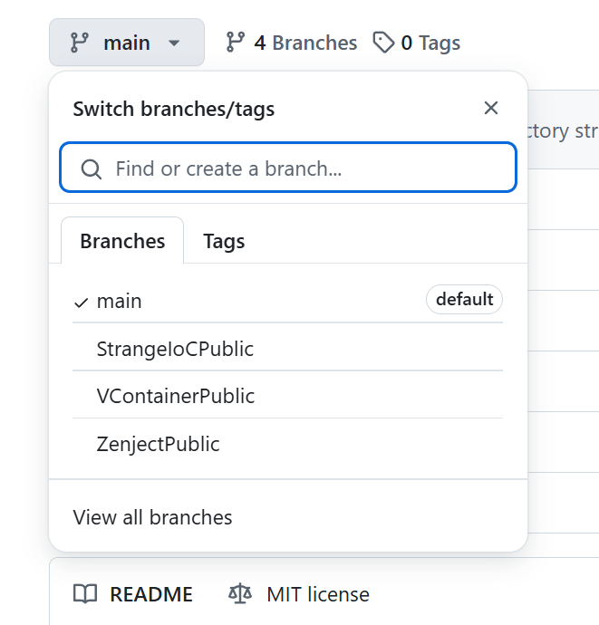

# Unity 项目启动模板

一个生产就绪、模块化的 Unity 项目模板，为游戏开发提供坚实的基础。借鉴**虚幻引擎**架构模式，本模板集成了经过验证的游戏系统、高性能基础设施和现代开发工作流。

<p align="left"><br> <a href="README.md">English</a> | 简体中文</p>

> [!NOTE]
>
> 如果你觉得这个项目对你有帮助，请点一个 Star ⭐，谢谢！


[](https://deepwiki.com/MaiKuraki/UnityStarter)

## 目录

1. [概述](#概述)
2. [核心特性](#核心特性)
3. [架构设计](#架构设计)
4. [模块目录](#模块目录)
5. [快速上手](#快速上手)
6. [技术栈](#技术栈)
7. [相关项目](#相关项目)

## 概述

本模板专为希望从专业、经过验证的基础开始，而不是从零构建一切的开发者设计。它提供：

- **模块化架构**: 所有系统都是解耦的 Unity Package，具有独立的 Assembly Definition
- **虚幻引擎模式**: 经过验证的架构概念（Gameplay Framework、GAS、Gameplay Tags）
- **性能优先**: 关键路径的零/低 GC 系统
- **生产就绪**: 在商业项目中经过测试，CI/CD 就绪，跨平台优化
- **开发者友好**: 全面的文档、清晰的示例、灵活的 DI/IoC 支持

### 本模板提供的内容

- ✅ 完整的游戏框架（Actor/Pawn/Controller/GameMode 模式）
- ✅ 数据驱动的能力系统（GAS 风格）
- ✅ 高性能基础设施（日志、对象池、音频）
- ✅ 热更新解决方案（代码 + 资源）
- ✅ 代码混淆集成（Obfuz）用于代码保护
- ✅ 带 CI/CD 集成的构建管线
- ✅ 现代输入系统（支持上下文栈）
- ✅ 层级式 UI 管理框架（支持 MVP 架构）
- ✅ 跨平台设备反馈（触觉振动、手柄震动、灯光控制）
- ✅ AI 行为树（可视化编辑器，支持 10,000+ 智能体扩展）
- ✅ AI 感知系统（Jobs/Burst 优化）

> **📖 文档**: 每个模块都有详细文档。请参阅 [模块目录](#模块目录) 部分以获取详细指南链接。

## 核心特性

### 模块化设计

每个系统都是自包含的 Unity Package。仅导入您需要的，移除您不需要的。每个模块包含：

- 独立的 Assembly Definition (asmdef)
- 完整的 package.json 配置
- 全面的文档
- 示例实现

### 虚幻引擎风格架构

实现虚幻引擎的经过验证的模式：

- **Gameplay Framework**: Actor/Pawn/Controller 分离，用于可扩展的游戏架构
- **Gameplay Ability System**: 数据驱动的能力、属性和效果
- **Gameplay Tags**: 分层标签系统，用于解耦的游戏逻辑

### 性能优先

关键系统针对 GC 进行了优化：

- **Logger**: 零 GC 多线程日志，支持文件轮转
- **Factory**: 高性能对象池，O(1) 操作复杂度
- **Audio**: 低 GC 音频管理，类似 Wwise 的 API

### 热更新就绪

无需应用商店重新提交即可更新游戏的完整解决方案：

- **HybridCLR**: 通过 DLL 编译实现 C# 代码热更新
- **资源管理**: YooAsset 或 Addressables 用于资源热更新
- **代码保护**: 集成 Obfuz 混淆用于热更新程序集
- **统一管线**: 简化的构建工作流，支持快速迭代

### DI/IoC 支持

为流行的依赖注入框架提供预配置适配器：

> [!NOTE]
>
> 以下 DI / IoC 框架均为作者在中国大陆的**大型商业游戏中验证使用过**，稳定性可以保证。

- [VContainer](https://github.com/hadashiA/VContainer)（推荐）
- [StrangeIoC](https://github.com/strangeioc/strangeioc)
- [Extenject (Zenject)](https://github.com/Mathijs-Bakker/Extenject)（不再积极维护）

> **注意**: 切换 Git 分支可查看各 DI 框架的实现示例。**GameplayFramework** 和 **Factory** 模块包含 DI 示例。



### CI/CD 集成

用于自动化管线的命令行构建接口：

- 从 Git 自动版本控制
- 多平台构建（Windows、Mac、Android、WebGL）
- 带可选代码混淆的热更新构建工作流
- 与 Jenkins、TeamCity、GitHub Actions 集成

## 架构设计

### 项目结构

```
.
├── Docs/                          # 项目文档
├── Tools/                         # 实用工具脚本（重命名、清理等）
└── UnityStarter/                  # Unity 项目根目录
    ├── Assets/
    │   ├── Build/                 # 构建管线与热更新
    │   │   └── [详见 Build/README.SCH.md]
    │   └── ThirdParty/
    │       └── CycloneGames/      # 核心框架模块
    │           └── [每个模块都有自己的 README]
    ├── Packages/                  # 包清单
    └── ProjectSettings/           # Unity 设置
```

### 模块组织

所有模块遵循相同的结构：

- **Runtime/**: 核心功能
- **Editor/**: 编辑器工具和实用程序
- **Samples/**: 示例实现
- **README.md / README.SCH.md**: 全面文档

### 依赖管理

模块设计为：

- **松耦合**: 模块间依赖最小
- **可选**: 大多数模块可以独立工作
- **可组合**: 根据您的需求混合搭配

## 模块目录

> **📚 重要**: 每个模块在其目录中都有详细文档。点击模块名称查看其 README，或导航到 `{ModulePath}/README.SCH.md` 获取完整指南。

### 🎮 游戏玩法系统

| 模块                  | 路径                             | 描述                                                                               | 文档                                                                                                      |
| --------------------- | -------------------------------- | ---------------------------------------------------------------------------------- | --------------------------------------------------------------------------------------------------------- |
| **UIFramework**       | `CycloneGames.UIFramework`       | 层级式 UI 管理。基于层的组织、MVP 架构、转场动画、资源集成。                       | [README.SCH.md](UnityStarter/Assets/ThirdParty/CycloneGames/CycloneGames.UIFramework/README.SCH.md)       |
| **GameplayFramework** | `CycloneGames.GameplayFramework` | UE 风格游戏架构（Actor/Pawn/Controller/GameMode）。支持 DI，可扩展的游戏项目基础。 | [README.SCH.md](UnityStarter/Assets/ThirdParty/CycloneGames/CycloneGames.GameplayFramework/README.SCH.md) |
| **GameplayAbilities** | `CycloneGames.GameplayAbilities` | 数据驱动能力系统（GAS 风格）。基于 ScriptableObject 的能力、属性、效果和状态管理。 | [README.SCH.md](UnityStarter/Assets/ThirdParty/CycloneGames/CycloneGames.GameplayAbilities/README.SCH.md) |
| **GameplayTags**      | `CycloneGames.GameplayTags`      | 分层标签系统，用于解耦的游戏逻辑。运行时注册、自动生成和基于标签的查询。           | [README.SCH.md](UnityStarter/Assets/ThirdParty/CycloneGames/CycloneGames.GameplayTags/README.SCH.md)      |
| **RPGFoundation**     | `CycloneGames.RPGFoundation`     | RPG 特定扩展（移动、战斗等）。RPG 类游戏的基础组件。                               | [查看模块目录](UnityStarter/Assets/ThirdParty/CycloneGames/CycloneGames.RPGFoundation)                    |
| **BehaviorTree**      | `CycloneGames.BehaviorTree`      | 生产级 AI 行为树。双层 SO→Runtime 架构、30+ 内置节点、三级扩展（1–10,000+ 智能体）、多人网络同步、Burst/DOD 批量仿真、GraphView 编辑器（动画化运行时可视化）。 | [README.SCH.md](UnityStarter/Assets/ThirdParty/CycloneGames/CycloneGames.BehaviorTree/README.SCH.md)      |
| **AIPerception**      | `CycloneGames.AIPerception`      | 高性能 AI 感知系统。Jobs/Burst 优化的零 GC 传感器查询、可视化调试工具、可扩展类型系统。 | [README.SCH.md](UnityStarter/Assets/ThirdParty/CycloneGames/CycloneGames.AIPerception/README.SCH.md)      |

### 🏗️ 核心基础设施

| 模块                | 路径                           | 描述                                                                                 | 文档                                                                                                    |
| ------------------- | ------------------------------ | ------------------------------------------------------------------------------------ | ------------------------------------------------------------------------------------------------------- |
| **Factory**         | `CycloneGames.Factory`         | 高性能对象池。线程安全、自动扩缩容池，O(1) 操作复杂度。零 GC 分配。                  | [README.SCH.md](UnityStarter/Assets/ThirdParty/CycloneGames/CycloneGames.Factory/README.SCH.md)         |
| **Logger**          | `CycloneGames.Logger`          | 零 GC 日志系统。多线程、文件轮转、跨平台（包括 WebGL）。可插拔处理器。               | [README.SCH.md](UnityStarter/Assets/ThirdParty/CycloneGames/CycloneGames.Logger/README.SCH.md)          |
| **AssetManagement** | `CycloneGames.AssetManagement` | DI 优先的资源加载抽象层（基于 W-TinyLFU 缓存），并无缝集成 YooAsset / Addressables。 | [README.SCH.md](UnityStarter/Assets/ThirdParty/CycloneGames/CycloneGames.AssetManagement/README.SCH.md) |
| **Audio**           | `CycloneGames.Audio`           | 高性能音频管理。类似 Wwise 的 API、低 GC、使用 Unity 原生音频的高级功能。            | [README.SCH.md](UnityStarter/Assets/ThirdParty/CycloneGames/CycloneGames.Audio/README.SCH.md)           |

### 🕹️ 输入与设备交互

| 模块               | 路径                          | 描述                                                                                | 文档                                                                                                   |
| ------------------ | ----------------------------- | ----------------------------------------------------------------------------------- | ------------------------------------------------------------------------------------------------------ |
| **InputSystem**    | `CycloneGames.InputSystem`    | 响应式输入封装，支持上下文栈。本地多人支持、设备自动检测、运行时 YAML 键位配置。    | [README.SCH.md](UnityStarter/Assets/ThirdParty/CycloneGames/CycloneGames.InputSystem/README.SCH.md)    |
| **DeviceFeedback** | `CycloneGames.DeviceFeedback` | 多平台硬件反馈。手机触觉振动（Android / iOS / WebGL）、手柄马达震动、设备灯条控制。 | [README.SCH.md](UnityStarter/Assets/ThirdParty/CycloneGames/CycloneGames.DeviceFeedback/README.SCH.md) |

### 🛠️ 工具与服务

| 模块           | 路径                      | 描述                                                                     | 文档                                                                                          |
| -------------- | ------------------------- | ------------------------------------------------------------------------ | --------------------------------------------------------------------------------------------- |
| **Utility**    | `CycloneGames.Utility`    | 通用工具集。FPS 计数器、安全区域适配、文件操作、性能工具、启动画面控制。 | 查看模块目录                                                                                  |
| **Service**    | `CycloneGames.Services`   | 游戏服务抽象层。摄像机管理、图形设置、设备配置，支持基于 YAML 的设置。   | 查看模块目录                                                                                  |
| **Cheat**      | `CycloneGames.Cheat`      | 类型安全的调试命令管道。VitalRouter 集成、异步操作、线程安全执行。       | [README.SCH.md](UnityStarter/Assets/ThirdParty/CycloneGames/CycloneGames.Cheat/README.SCH.md) |
| **FontAssets** | `CycloneGames.FontAssets` | 多语言字体集合。拉丁文、中文（简体/繁体）、日文、韩文字符集。            | 查看模块目录                                                                                  |

### 🔧 构建与部署

| 模块      | 路径           | 描述                                                                                           | 文档                                                     |
| --------- | -------------- | ---------------------------------------------------------------------------------------------- | -------------------------------------------------------- |
| **Build** | `Assets/Build` | 全面构建管线。HybridCLR + Obfuz + 资源管理集成。完整应用构建、带代码混淆的热更新、CI/CD 就绪。 | [README.SCH.md](UnityStarter/Assets/Build/README.SCH.md) |

### 🌐 网络

| 模块           | 路径                      | 描述                                                       | 文档         |
| -------------- | ------------------------- | ---------------------------------------------------------- | ------------ |
| **Networking** | `CycloneGames.Networking` | 生产级网络抽象层。零 GC 运行时、可插拔序列化器（Json、MessagePack、ProtoBuf）、Mirror 适配器、线程安全跨线程消息、连接诊断。 | [README.SCH.md](UnityStarter/Assets/ThirdParty/CycloneGames/CycloneGames.Networking/README.SCH.md) |

### 🧰 工具

| 模块      | 路径     | 描述                                               | 文档                                 |
| --------- | -------- | -------------------------------------------------- | ------------------------------------ |
| **Tools** | `Tools/` | 项目实用工具。重命名工具、清理脚本、常见开发任务。 | [README.SCH.md](Tools/README.SCH.md) |

## 快速上手

### 前置条件

- **Unity 2022.3 LTS 或更高版本**
- **Git**（用于 Build 模块的自动版本控制）
- Unity 和 C# 的基础知识

### 步骤 1: 克隆仓库

```bash
git clone https://github.com/MaiKuraki/UnityStarter.git
```

### 步骤 2: 重命名项目（可选）

如果作为完整项目模板使用：

1. 找到 `Tools/Executable/rename_project` 可执行文件
2. 将其复制到 `UnityStarter/` 目录
3. 从命令行运行 - 它将引导您完成：
   - 项目文件夹重命名
   - 公司名称更新
   - 应用程序名称更改
   - 配置文件更新

### 步骤 3: 在 Unity 中打开

1. 从 UnityHub 找到你的项目并打开

### 步骤 4: 探索模块

1. **从核心模块开始**: 从 `GameplayFramework` 开始
2. **阅读文档**: 每个模块在其目录中都有 `README.SCH.md`
3. **查看示例**: 大多数模块包含示例场景和脚本
4. **配置构建**: 查看 [Build 模块文档](UnityStarter/Assets/Build/README.SCH.md) 进行设置

### 步骤 5: 导入特定模块（适用于现有项目）

如果您只需要特定模块：

**推荐方法（Package Manager）:**

1. 将模块文件夹复制到 `Assets` 目录之外
2. 在 Unity 中：**Window > Package Manager**
3. 点击 **+ > Add package from disk...**
4. 选择模块的 `package.json` 文件

**简单方法（直接复制）:**

1. 从 `UnityStarter/Assets/ThirdParty/CycloneGames/` 复制模块文件夹
2. 粘贴到您项目的 `Assets` 文件夹

> **💡 提示**: 查看每个模块的 README 以获取特定的设置说明和依赖项。

## 技术栈

### 核心依赖

- **Unity**: 2022.3 LTS+
- **UniTask**: Unity 的 async/await ([GitHub](https://github.com/Cysharp/UniTask))
- **R3**: 响应式编程 ([GitHub](https://github.com/Cysharp/R3))
- **LitMotion**: 动画/补间 ([GitHub](https://github.com/annulusgames/LitMotion))
- **VYaml**: YAML 序列化 ([GitHub](https://github.com/hadashiA/VYaml))
- **VitalRouter**: 消息总线 ([GitHub](https://github.com/hadashiA/VitalRouter))

### 可选依赖

- **HybridCLR**: C# 热更新 ([GitHub](https://github.com/focus-creative-games/hybridclr))
- **Obfuz**: 代码混淆 ([GitHub](https://github.com/Code-Philosophy/Obfuz))
- **Obfuz4HybridCLR**: Obfuz 的 HybridCLR 扩展 ([GitHub](https://github.com/Code-Philosophy/Obfuz4HybridCLR))
- **YooAsset**: 资源管理 ([GitHub](https://github.com/tuyoogame/YooAsset))
- **Addressables**: Unity 的资源管理（通过 Package Manager）
- **Mirror**: 网络 ([GitHub](https://github.com/MirrorNetworking/Mirror))
- **Navigathena**: 场景管理 ([GitHub](https://github.com/mackysoft/Navigathena))
- **MessagePack**: 二进制序列化 ([GitHub](https://github.com/MessagePack-CSharp/MessagePack-CSharp))

> 查看 `UnityStarter/Packages/manifest.json` 获取完整依赖列表。

## 相关项目

使用本模板构建的项目：

- **[Rhythm Pulse](https://github.com/MaiKuraki/RhythmPulse)** - 音乐游戏机制和玩法类型集合
- **[Unity Gameplay Ability System Sample](https://github.com/MaiKuraki/UnityGameplayAbilitySystemSample)** - 展示 GAS 实现的示例项目

---

## 文档指南

> **📚 每个模块在其目录中都有详细文档。**

### 如何查找模块文档

1. **导航到模块目录**: `UnityStarter/Assets/ThirdParty/CycloneGames/CycloneGames.{ModuleName}/`
2. **查找 README 文件**:
   - `README.md` - 英文文档
   - `README.SCH.md` - 简体中文文档
3. **查看 Samples 文件夹**: 大多数模块包含示例实现

### 关键文档链接

- **[GameplayFramework](UnityStarter/Assets/ThirdParty/CycloneGames/CycloneGames.GameplayFramework/README.SCH.md)** - Actor/Pawn/Controller 架构完整指南
- **[GameplayAbilities](UnityStarter/Assets/ThirdParty/CycloneGames/CycloneGames.GameplayAbilities/README.SCH.md)** - 带分步示例的 GAS 系统教程
- **[Build](UnityStarter/Assets/Build/README.SCH.md)** - 构建管线设置和 CI/CD 集成
- **[InputSystem](UnityStarter/Assets/ThirdParty/CycloneGames/CycloneGames.InputSystem/README.SCH.md)** - 输入系统配置和使用
- **[UIFramework](UnityStarter/Assets/ThirdParty/CycloneGames/CycloneGames.UIFramework/README.SCH.md)** - UI 框架架构和示例
- **[AssetManagement](UnityStarter/Assets/ThirdParty/CycloneGames/CycloneGames.AssetManagement/README.SCH.md)** - 资源加载和版本管理
- **[DeviceFeedback](UnityStarter/Assets/ThirdParty/CycloneGames/CycloneGames.DeviceFeedback/README.SCH.md)** - 跨平台触觉振动、震动与灯光控制
- **[BehaviorTree](UnityStarter/Assets/ThirdParty/CycloneGames/CycloneGames.BehaviorTree/README.SCH.md)** - AI 行为树双层架构与扩展指南
- **[AIPerception](UnityStarter/Assets/ThirdParty/CycloneGames/CycloneGames.AIPerception/README.SCH.md)** - Burst 优化的 AI 感知系统
- **[Networking](UnityStarter/Assets/ThirdParty/CycloneGames/CycloneGames.Networking/README.SCH.md)** - 可插拔传输层的网络抽象层

---

**许可证**: 详情请参阅 [LICENSE](LICENSE) 文件。

**支持**: 如有问题和讨论，请在 GitHub 上提交 issue。
