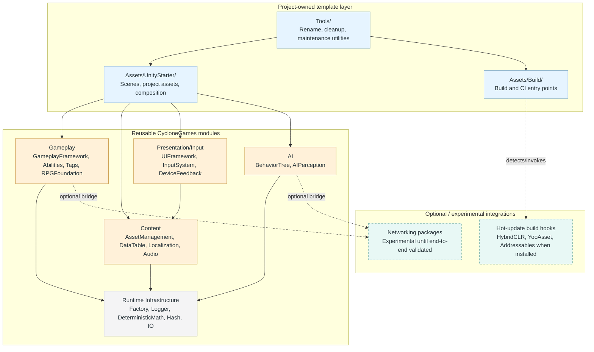

%20│%20UIFramework%20│%20HotUpdate%20Ready%20(HybridCLR)%20│%20CI/CD%20Ready&descAlign=50&descAlignY=58&descSize=16&fontAlignY=30&fontSize=72>)

A production-oriented, modular Unity **foundation project** and reusable framework base, informed by **Unreal Engine** architecture. Its `GameplayFramework` applies Unreal-style gameplay organization around `Actor`, `Pawn`, `Controller`, and `GameMode`, while **Gameplay Abilities** and **GameplayTags** provide GAS-like ability and tagging primitives for explicit gameplay contracts.

UnityStarter is not intended to be a beginner-first, plug-and-play framework for small projects. It is designed as a stable, maintainable engineering foundation for medium-to-large Unity productions that expect long-term iteration: explicit ownership boundaries, performance-conscious runtime systems, engine-agnostic core layers, and project-owned build/tooling infrastructure.

<p align="left"><br> English | <a href="README.SCH.md">简体中文</a></p>

> [!NOTE]
> If you find this project helpful, please consider giving it a star ⭐ Thank you!


[](https://deepwiki.com/MaiKuraki/UnityStarter)

## Table of Contents

- [Table of Contents](#table-of-contents)
- [Why UnityStarter](#why-unitystarter)
- [What Is Inside](#what-is-inside)
- [Architecture Principles](#architecture-principles)
  - [Project Ownership Model](#project-ownership-model)
- [Repository Layout](#repository-layout)
- [Module Map](#module-map)
  - [Gameplay](#gameplay)
  - [AI](#ai)
  - [Data, Assets And Content](#data-assets-and-content)
  - [Runtime Infrastructure](#runtime-infrastructure)
  - [Build, Tools And Quality](#build-tools-and-quality)
- [Networking Status](#networking-status)
- [Build, CI/CD And Project Tooling](#build-cicd-and-project-tooling)
  - [Build is project-owned infrastructure](#build-is-project-owned-infrastructure)
  - [Tools for derived projects](#tools-for-derived-projects)
- [Getting Started](#getting-started)
  - [Requirements](#requirements)
  - [First Run](#first-run)
  - [Using Individual Modules](#using-individual-modules)
- [Technology Stack](#technology-stack)
- [Documentation](#documentation)
- [Validation Status](#validation-status)
- [Related Projects](#related-projects)

## Why UnityStarter

UnityStarter is for developers and teams who want production-grade Unity structure from the start: predictable asset ownership, separated gameplay architecture, data-driven content, explicit module boundaries, build automation, analyzers, and maintenance tools.

Use the repository in two practical ways:

- **As a project template**: open `UnityStarter/` in Unity, rename it with the bundled tools, and let the project-owned `Assets/Build/` layer evolve with your game.
- **As a package (UPM)**: move out folders under `CycloneGames`, add from PackageManager.

Its value is the reusable engineering foundation around ownership, testability, optional integrations, build configuration, editor tooling, and documentation.

## What Is Inside

UnityStarter combines a reusable `CycloneGames` framework layer with a Unity project template, a project-owned Build/CI module, standalone maintenance tools, bilingual documentation, and validation-oriented analyzer support.

For module-level details, use the [Module Map](#module-map). It is the primary index for gameplay, content, UI/input, AI, runtime infrastructure, build tooling, and experimental networking packages.

| Item | Detail |
| --- | --- |
| Unity project root | `UnityStarter/` |
| Unity version source | `UnityStarter/ProjectSettings/ProjectVersion.txt` |
| CycloneGames module folders | `UnityStarter/Assets/ThirdParty/CycloneGames/` |
| Assembly definitions | Package and project assembly boundaries are declared by `.asmdef` files under `UnityStarter/Assets/`. |
| Analyzer rules | 20+ implemented `CycloneGames.Analyzers` rules |
| Standalone tools | Go tools with Windows executables under `Tools/Executable/Windows/` |

## Architecture Principles

- **Pure C# first where it matters**: core contracts avoid leaking `UnityEngine` types when logic should remain testable in CLI, EditMode, headless simulation, or future adapters.
- **Unity as the integration layer**: `MonoBehaviour`, `ScriptableObject`, editor tools, scene bindings, and assets bridge into runtime systems without owning complex domain rules.
- **Optional integrations stay isolated**: DI containers, tween engines, scene navigation, serializers, transports, and hot-update backends live behind dedicated integration assemblies.
- **Performance is a design constraint**: hot paths aim for zero-GC or low-GC behavior, predictable ownership, reusable buffers, and explicit lifecycle cleanup.
- **Build is project-owned**: `Assets/Build/` is expected to travel with derived projects and change with product requirements.
- **Docs are part of the API**: long-lived modules are expected to maintain `README.md` and `README.SCH.md` together.

### Project Ownership Model

This diagram is a repository ownership and module responsibility map, not a runtime dependency graph. It shows which parts are expected to evolve with a derived game, which parts are reusable framework modules, and which parts are optional or experimental integrations.


```mermaid
flowchart TD
  subgraph ProjectOwned["Project-owned template layer"]
    StarterAssets["Assets/UnityStarter/\nScenes, project assets, composition"]
    BuildLayer["Assets/Build/\nBuild and CI entry points"]
    ProjectTools["Tools/\nRename, cleanup, maintenance utilities"]
  end

  subgraph FrameworkModules["Reusable CycloneGames modules"]
    Gameplay["Gameplay\nGameplayFramework, Abilities, Tags, RPGFoundation"]
    Content["Content\nAssetManagement, DataTable, Localization, Audio"]
    Presentation["Presentation/Input\nUIFramework, InputSystem, DeviceFeedback"]
    AI["AI\nBehaviorTree, AIPerception"]
    Infrastructure["Runtime Infrastructure\nFactory, Logger, DeterministicMath, Hash, IO"]
  end

  subgraph OptionalIntegrations["Optional / experimental integrations"]
    Networking["Networking packages\nExperimental until end-to-end validated"]
    HotUpdate["Hot-update build hooks\nHybridCLR, YooAsset, Addressables when installed"]
  end

  ProjectTools --> StarterAssets
  ProjectTools --> BuildLayer
  StarterAssets --> Gameplay
  StarterAssets --> Content
  StarterAssets --> Presentation
  StarterAssets --> AI
  Gameplay --> Infrastructure
  Content --> Infrastructure
  Presentation --> Content
  AI --> Infrastructure
  BuildLayer -. detects/invokes .-> HotUpdate
  Gameplay -. optional bridge .-> Networking
  AI -. optional bridge .-> Networking

  class StarterAssets,BuildLayer,ProjectTools projectNode
  class Gameplay,Content,Presentation,AI frameworkNode
  class Infrastructure infraNode
  class Networking,HotUpdate optionalNode

  classDef projectNode fill:#E6F4FF,stroke:#6B9BC3,color:#263238,stroke-width:1px
  classDef frameworkNode fill:#FFF1D9,stroke:#C99745,color:#263238,stroke-width:1px
  classDef infraNode fill:#F4F4F5,stroke:#9CA3AF,color:#263238,stroke-width:1px
  classDef optionalNode fill:#E8F8F5,stroke:#67A69A,color:#263238,stroke-width:1px,stroke-dasharray: 5 4
```

## Repository Layout

```text
<repo-root>/
  README.md / README.SCH.md              # Root bilingual overview
  Docs/                                  # Cross-module guides
  Tools/                                 # Standalone maintenance utilities
  UnityStarter/                          # Unity project root
    Analyzers/CycloneGames.Analyzers/    # Roslyn analyzer project
    Assets/Build/                        # Project-owned Build/CI module
    Assets/ThirdParty/CycloneGames/      # Reusable CycloneGames framework modules
    Assets/UnityStarter/                 # Template project scenes and game-side assets
    Packages/                            # Unity package manifest and lock file
    ProjectSettings/                     # Unity settings, including version source
```

## Module Map

Use this section as a navigation map. Recommended first pass: `GameplayFramework`, `AssetManagement`, `GameplayAbilities`, `GameplayTags`, `DataTable`, and `Build`.

### Gameplay

| Module | Role | Docs |
| --- | --- | --- |
| **GameplayFramework** | Actor/Pawn/Controller/GameMode structure, gameplay lifecycle, camera flow, and scene-flow foundation. | [README](UnityStarter/Assets/ThirdParty/CycloneGames/CycloneGames.GameplayFramework/README.md) |
| **GameplayAbilities** | GAS-style data-driven ability, attribute, effect, cost, cooldown, and cue system with an explicit authority/replica role and authoritative `AuthorityOnly` execution boundary. The optional Networking integration provides authority-activation protocol building blocks and is not a transport endpoint. | [README](UnityStarter/Assets/ThirdParty/CycloneGames/CycloneGames.GameplayAbilities/README.md) |
| **Choreography** | Engine-free action presentation scheduling for animation, audio, VFX, gameplay-event markers, and preload coordination. | [README](UnityStarter/Assets/ThirdParty/CycloneGames/CycloneGames.Choreography/README.md) |
| **GameplayTags** | Hierarchical tags, generated constants, query helpers, editor tooling, and integration points. | [README](UnityStarter/Assets/ThirdParty/CycloneGames/CycloneGames.GameplayTags/README.md) |
| **RPGFoundation** | RPG movement and interaction foundations that can integrate with other gameplay packages. | [README](UnityStarter/Assets/ThirdParty/CycloneGames/CycloneGames.RPGFoundation/README.md) |
| **UIFramework** | Window management, UI flow, presentation patterns, and asset-backed UI loading that delegates handle ownership and eviction decisions to `AssetManagement`'s W-TinyLFU cache; `UIFramework` does not maintain a separate `CacheRetention` policy layer. | [README](UnityStarter/Assets/ThirdParty/CycloneGames/CycloneGames.UIFramework/README.md) |
| **Foundation2D** | 2D foundation package and samples for derived projects. | [Folder](UnityStarter/Assets/ThirdParty/CycloneGames/CycloneGames.Foundation2D/) |

### AI

| Module | Role | Docs |
| --- | --- | --- |
| **BehaviorTree** | Behavior tree runtime, editor support, tests, and data-oriented runtime pieces. | [README](UnityStarter/Assets/ThirdParty/CycloneGames/CycloneGames.BehaviorTree/README.md) |
| **AIPerception** | Jobs/Burst-oriented perception, sensor queries, spatial structures, and low-GC runtime flow. | [README](UnityStarter/Assets/ThirdParty/CycloneGames/CycloneGames.AIPerception/README.md) |

### Data, Assets And Content

| Module | Role | Docs |
| --- | --- | --- |
| **AssetManagement** | Interface-first asset loading abstraction with W-TinyLFU-inspired caching, `CacheRetention` policies/scheduler, provider abstraction, diagnostics, and async loading flows. | [README](UnityStarter/Assets/ThirdParty/CycloneGames/CycloneGames.AssetManagement/README.md) |
| **DataTable** | Designer-facing data pipeline with optional Luban, MessagePack, and asset-management bridges. | [README](UnityStarter/Assets/ThirdParty/CycloneGames/CycloneGames.DataTable/README.md) |
| **GameplayTags.DataTable** | DataTable integration for GameplayTags authoring and loading. | [README](UnityStarter/Assets/ThirdParty/CycloneGames/CycloneGames.GameplayTags.DataTable/README.md) |
| **Choreography.AssetManagement** | Optional Choreography resource provider bridge for `CycloneGames.AssetManagement`. | [README](UnityStarter/Assets/ThirdParty/CycloneGames/CycloneGames.Choreography.AssetManagement/README.md) |
| **Choreography.CycloneAudio** | Optional Choreography audio provider bridge for `CycloneGames.Audio`. | [README](UnityStarter/Assets/ThirdParty/CycloneGames/CycloneGames.Choreography.CycloneAudio/README.md) |
| **Localization** | Validated locale fallback, partitioned text/assets, transactional catalogs, and editor translation workflows. | [README](UnityStarter/Assets/ThirdParty/CycloneGames/CycloneGames.Localization/README.md) |
| **Audio** | Audio management layer with async loading, runtime ownership, and platform-aware policies. | [README](UnityStarter/Assets/ThirdParty/CycloneGames/CycloneGames.Audio/README.md) |
| **FontAssets** | CJK, Latin, symbol, and number font assets. | [Folder](UnityStarter/Assets/ThirdParty/CycloneGames/CycloneGames.FontAssets/) |

### Runtime Infrastructure

| Module | Role | Docs |
| --- | --- | --- |
| **Factory** | Factory and object pooling module with DI-friendly use and ECS/DOD variants. | [README](UnityStarter/Assets/ThirdParty/CycloneGames/CycloneGames.Factory/README.md) |
| **Logger** | Thread-safe logging with levels, filtering, background processing, and Unity integration. | [README](UnityStarter/Assets/ThirdParty/CycloneGames/CycloneGames.Logger/README.md) |
| **DeterministicMath** | Fixed-point deterministic math for replay, simulation, and lockstep-friendly systems. | [README](UnityStarter/Assets/ThirdParty/CycloneGames/CycloneGames.DeterministicMath/README.md) |
| **Hash** | Deterministic hashing primitives for manifests, protocol checks, IDs, and consistency. | [README](UnityStarter/Assets/ThirdParty/CycloneGames/CycloneGames.Hash/README.md) |
| **IO** | Managed file and path utilities for Unity-aware foundation modules. | [README](UnityStarter/Assets/ThirdParty/CycloneGames/CycloneGames.IO/README.md) |
| **InputSystem** | Validated YAML input authoring with prioritized mapping contexts, per-player device ownership, local multiplayer, binding profiles, Editor tooling, and opt-in integrations. | [README](UnityStarter/Assets/ThirdParty/CycloneGames/CycloneGames.InputSystem/README.md) |
| **InputSystem.AssetManagement** | Optional physical package-loading bridge between InputSystem, AssetManagement, and VContainer. | [README](UnityStarter/Assets/ThirdParty/CycloneGames/CycloneGames.InputSystem.AssetManagement/README.md) |
| **DeviceFeedback** | Haptics, vibration, rumble, and device-light feedback abstractions. | [README](UnityStarter/Assets/ThirdParty/CycloneGames/CycloneGames.DeviceFeedback/README.md) |
| **Services** | Unity-facing service helpers for derived projects. | [Folder](UnityStarter/Assets/ThirdParty/CycloneGames/CycloneGames.Services/) |
| **Utility** | Common Unity utility components and helpers. | [Folder](UnityStarter/Assets/ThirdParty/CycloneGames/CycloneGames.Utility/) |
| **Cheat** | Build-gated internal cheat command system with VitalRouter integration. | [README](UnityStarter/Assets/ThirdParty/CycloneGames/CycloneGames.Cheat/README.md) |

### Build, Tools And Quality

| Area | Role | Docs |
| --- | --- | --- |
| **Build** | Project-owned player build pipeline, version info, optional hot-update hooks, and CI-facing methods. | [README](UnityStarter/Assets/Build/README.md) |
| **Tools** | Go tools for project rename, package trimming, cleanup, file trees, and asset processing. | [README](Tools/README.md) |
| **Analyzers** | Unity-focused Roslyn analyzer rules for performance, safety, async, and conventions. | [README](UnityStarter/Analyzers/CycloneGames.Analyzers/README.md) |

## Networking Status

The networking layer is an experimental foundation. Production adoption requires end-to-end validation with the selected transport, serializer, authority model, reconnect flow, platform target, and gameplay replication policy.

| Module | Role | Status |
| --- | --- | --- |
| **Networking** | Transport-neutral contracts, message catalogs, protocol manifests, sessions, replication, security, serializers, adapters, and diagnostics. | Experimental. [README](UnityStarter/Assets/ThirdParty/CycloneGames/CycloneGames.Networking/README.md) |
| **GameplayFramework.Networking** | Session bridge, actor migration serialization, authority roles, and observer resolution. | Experimental. [README](UnityStarter/Assets/ThirdParty/CycloneGames/CycloneGames.GameplayFramework.Networking/README.md) |
| **AIPerception.Networking** | Perception event, snapshot, memory, authority, and host-migration contracts. | Experimental. [README](UnityStarter/Assets/ThirdParty/CycloneGames/CycloneGames.AIPerception.Networking/README.md) |
| **BehaviorTree.Networking** | Behavior tree replication profiles, authority helpers, snapshots, and blackboard deltas. | Experimental. [README](UnityStarter/Assets/ThirdParty/CycloneGames/CycloneGames.BehaviorTree.Networking/README.md) |
| **RPGFoundation.Movement.Networking** | Movement input, snapshot, correction, teleport, authority transfer, validation, history, and reconciliation contracts. | Experimental. [README](UnityStarter/Assets/ThirdParty/CycloneGames/CycloneGames.RPGFoundation.Movement.Networking/README.md) |
| **RPGFoundation.Interaction.Networking** | Interaction DTOs, vector conversion, authority validation bridge, and message catalog registration. | Experimental. [README](UnityStarter/Assets/ThirdParty/CycloneGames/CycloneGames.RPGFoundation.Interaction.Networking/README.md) |
| **RPGFoundation.Projectile.Networking** | Projectile protocol metadata, DTOs, validation helpers, prediction reconciliation, snapshot history, and authority bridge contracts. | Experimental. [README](UnityStarter/Assets/ThirdParty/CycloneGames/CycloneGames.RPGFoundation.Projectile.Networking/README.md) |

## Build, CI/CD And Project Tooling

### Build is project-owned infrastructure

`UnityStarter/Assets/Build/` is project-owned infrastructure. Product projects can adjust scenes, version prefixes, output layout, hot-update assembly lists, platform signing, and release rules there.

When a developer derives a new game from UnityStarter and runs `rename_project`, the Build layer remains part of the new project and should continue to be maintained there.

The Build module includes:

- `BuildData` ScriptableObject configuration.
- Git-based version information through `Build.VersionControl.Editor`.
- Editor menu items and command-line player build entry points.
- Optional reflection-detected integrations for HybridCLR, Obfuz, YooAsset, Addressables, and Buildalon.
- Cheat define control for internal builds.
- CI-facing methods such as `Build.Pipeline.Editor.BuildScript.PerformBuild_CI`.

Minimal command shape:

```bash
Unity -batchmode -quit -projectPath UnityStarter \
  -executeMethod Build.Pipeline.Editor.BuildScript.PerformBuild_CI \
  -buildTarget StandaloneWindows64 \
  -output Build/Windows/UnityStarter.exe \
  -clean
```

The [Build README](UnityStarter/Assets/Build/README.md) includes deeper configuration notes, hot-update workflows, and CI examples.

### Tools for derived projects

The `Tools/` directory contains standalone Go utilities:

| Tool | Purpose |
| --- | --- |
| `rename_project` | Rename a derived UnityStarter project safely and repeatedly. |
| `remove_unity_packages` | Remove unnecessary packages from `manifest.json`. |
| `unity_project_full_clean` | Clean Unity caches, generated projects, and build artifacts. |
| `audio_volume_normalizer` | Normalize audio loudness with category-aware targets. |
| `texture_channel_packer` | Pack texture channels for mask maps and similar workflows. |
| `unity_video_webm_converter` | Convert videos to Unity-friendly VP8 WebM. |
| `generate_file_tree` | Generate Markdown directory trees for documentation. |

See [Tools README](Tools/README.md) for usage details.

## Getting Started

### Requirements

- The Unity version recorded in `UnityStarter/ProjectSettings/ProjectVersion.txt`.
- Git / Perforce / SVN, used by the Build module for automatic version information.

### First Run

```bash
git clone https://github.com/MaiKuraki/UnityStarter.git
```

1. Open `UnityStarter/` in Unity Hub.
2. Open `UnityStarter/Assets/UnityStarter/Scenes/Scene_Launch.unity`.
3. Read [GameplayFramework](UnityStarter/Assets/ThirdParty/CycloneGames/CycloneGames.GameplayFramework/README.md) to understand the high-level architecture.
4. Read [Build](UnityStarter/Assets/Build/README.md) before changing build settings or CI methods.
5. If you are creating a new project from this template, run `Tools/Executable/Windows/rename_project.exe` and review [Tools README](Tools/README.md).

### Using Individual Modules

Copy a module folder from `UnityStarter/Assets/ThirdParty/CycloneGames/` into your project, then inspect its `package.json`, `.asmdef` files, README, dependencies, and optional `Integrations/` folders. Some modules are self-contained; others depend on shared CycloneGames packages or Unity packages.

## Technology Stack

Versions should be checked in `UnityStarter/Packages/manifest.json`, `UnityStarter/Packages/packages-lock.json`, and `UnityStarter/Packages/nuget-packages/InstalledPackages/`.

| Area | Examples |
| --- | --- |
| Async and reactive | `com.cysharp.unitask`, `com.cysharp.r3`, NuGet `R3` |
| Routing and data | `jp.hadashikick.vitalrouter.unity`, `jp.hadashikick.vyaml`, NuGet `VitalRouter`, NuGet `VYaml` |
| Unity performance stack | Burst, Collections, Mathematics, Profiling Core, Memory Profiler, Profile Analyzer |
| Unity gameplay stack | Input System, Cinemachine, URP, TextMeshPro, UGUI, Splines |
| UI and debug helpers | SoftMask, UIEffect, CompositeCanvasRenderer, UnityDebugSheet, InGameDebugConsole, uPalette |
| Build and analysis | Scriptable Build Pipeline, NuGetForUnity, Roslyn packages for CycloneGames analyzers |
| Optional integrations | VContainer, PrimeTween, Navigathena, Luban, MessagePack, HybridCLR, YooAsset, Addressables, Obfuz, Mirror, Mirage |

## Documentation

| Location | Purpose |
| --- | --- |
| `UnityStarter/Assets/ThirdParty/CycloneGames/*/README.md` | Module-level documentation for long-lived packages. |
| [`UnityStarter/Assets/Build/README.md`](UnityStarter/Assets/Build/README.md) | Build pipeline, hot update, optional packages, and CI. |
| [`UnityStarter/Analyzers/CycloneGames.Analyzers/README.md`](UnityStarter/Analyzers/CycloneGames.Analyzers/README.md) | Analyzer rules, build instructions, and activation guidance. |
| [`Tools/README.md`](Tools/README.md) | Standalone project maintenance tools. |
| [`Docs/AudioBestPractices/AudioBestPractices.md`](Docs/AudioBestPractices/AudioBestPractices.md) | Audio import and runtime audio guidance. |
| [`Docs/Networking/GameJamLanMultiplayerGuide.md`](Docs/Networking/GameJamLanMultiplayerGuide.md) | LAN multiplayer planning guide. |
| [`Docs/Networking/NetworkSecurityGuide.md`](Docs/Networking/NetworkSecurityGuide.md) | Networking security boundaries, production composition, ownership, platform requirements, and verification. |
| [DeepWiki](https://deepwiki.com/MaiKuraki/UnityStarter) | Generated codebase overview. |

## Validation Status

The repository contains tests and analyzer rules, but the safest validation path is still Unity-driven:

- Open the project in Unity and confirm it compiles without Console errors.
- Run relevant EditMode tests for any module you change.
- Build the analyzer project with `dotnet build UnityStarter/Analyzers/CycloneGames.Analyzers/CycloneGames.Analyzers.csproj -c Release`.
- Use `Build > Print Debug Info` before changing BuildData or CI settings.
- Treat Networking as experimental until you complete real multiplayer validation in your target environment.

## Related Projects

- **[Rhythm Pulse](https://github.com/MaiKuraki/RhythmPulse)** - Rhythm game mechanics collection
- **[Unity GAS Sample](https://github.com/MaiKuraki/UnityGameplayAbilitySystemSample)** - GAS demonstration project

---

**License**: [MIT](LICENSE)
