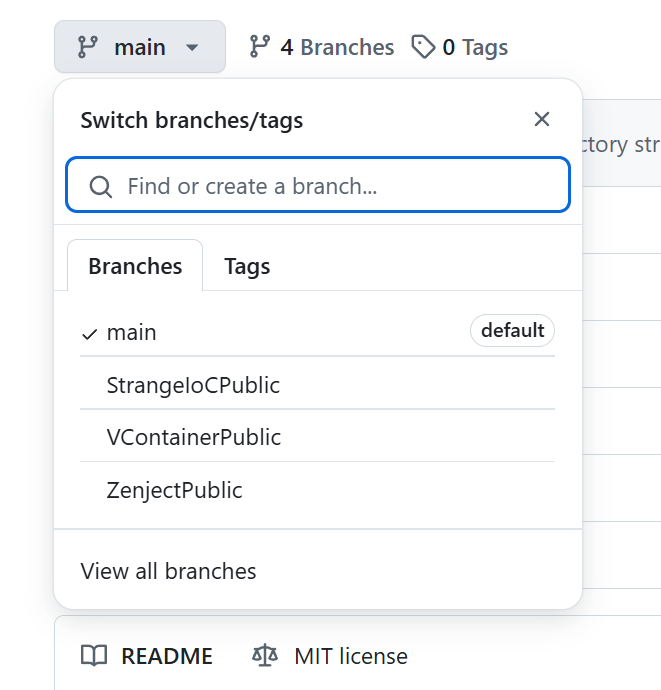

# Unity Project Starter Template

This is a lightweight, modular Unity project template designed to provide a solid foundation for your new projects. It integrates core modules inspired by the **Unreal Engine**, including a **Gameplay Framework**, **Gameplay Tags**, and a **Gameplay Ability System**. Additionally, it features a high-performance, low-GC resource, object pool, and audio management system. The project also includes practical Debug tools and supports various **DI/IoC frameworks**. All modules are developed as decoupled **Unity Packages** and are optimized for platforms such as **Android, iOS, and WebGL**.

<p align="left"><br> English | <a href="README.SCH.md">简体中文</a></p>

> [!NOTE]
> If you find this project helpful, please consider giving it a star ⭐. Thank you!

[](https://deepwiki.com/MaiKuraki/UnityStarter)

## 💉 DI / IoC
This template supports multiple Dependency Injection frameworks. You can switch between branches to see dedicated examples for each. The **GameplayFramework** and **Factory** modules contain specific DI implementation samples.

- **DI/IoC framework support** with pre-configured adapters for: (All **listed frameworks have been** tested in production environments.)
  - [VContainer](https://github.com/hadashiA/VContainer)
  - [StrangeIoC](https://github.com/strangeioc/strangeioc)
  - [Extenject(Zenject)](https://github.com/Mathijs-Bakker/Extenject) (no longer actively maintained.)
> Since the author of [**Zenject**](https://github.com/Mathijs-Bakker/Extenject) announced the [discontinuation of project updates](https://github.com/Mathijs-Bakker/Extenject/issues/73), I recommend trying [**VContainer**](https://github.com/hadashiA/VContainer). If you prefer a higher degree of customization for your project, [**StrangeIoC**](https://github.com/strangeioc/strangeioc) is a better choice. If you decide to use [**Zenject**](https://github.com/Mathijs-Bakker/Extenject), [**MessagePipe**](https://github.com/Cysharp/MessagePipe) is a compatible messaging framework that works well with it.
### DI Framework Selection
Switch between Git branches to explore implementation examples for each DI framework.</br>
Note: The **GameplayFramework** and **Factory** modules **include** DI samples.</br>


---

## ✨ Key Features

-   **Modular Architecture**: All systems are built as decoupled Unity Packages, allowing you to easily include or exclude functionality.
-   **Inspired by Unreal Engine**: Implements proven concepts like the Gameplay Framework, Gameplay Ability System (GAS), and Gameplay Tags.
-   **Performance-Oriented**: Focuses on low/zero GC allocation in critical systems like Logging, Factory, and Audio.
-   **Hot Update Support**: Complete hot update solution with **HybridCLR** for C# code updates and **YooAsset** for efficient asset management. Streamlined build pipeline for rapid iteration and deployment.
-   **DI/IoC Ready**: Comes with pre-configured support for **VContainer**, **StrangeIoC**, and **Zenject**.
-   **CI/CD Friendly**: Includes command-line accessible build scripts and automatic versioning for seamless integration with automated pipelines.
-   **Cross-Platform**: Optimized for Desktop, Mobile (Android/iOS), and WebGL.

---

## Core Framework Modules

### 🎮 Gameplay Systems
- **[GameplayFramework](UnityStarter/Assets/ThirdParty/CycloneGames/CycloneGames.GameplayFramework)** - UnrealEngine-style gameplay framework with Actor, Pawn, Controller, GameMode concepts. DI-friendly architecture for scalable game projects.
- **[GameplayAbilities](UnityStarter/Assets/ThirdParty/CycloneGames/CycloneGames.GameplayAbilities)** - Powerful data-driven ability system inspired by Unreal Engine's GAS. Supports complex skills, attributes, status effects with ScriptableObject-based design.
- **[GameplayTags](UnityStarter/Assets/ThirdParty/CycloneGames/CycloneGames.GameplayTags)** - Tag-based identification system for abilities, effects, and game states, inspired by Unreal Engine's GameplayTags. Supports dynamic runtime tag registration and auto-generation.
- **[RPGFoundation](UnityStarter/Assets/ThirdParty/CycloneGames/CycloneGames.RPGFoundation)** - Contains basic extensions for RPG-type games.
- **[BehaviorTree](UnityStarter/Assets/ThirdParty/CycloneGames/CycloneGames.BehaviorTree)** - Behavior tree system for AI. Supports complex logic with composite/decorator/action nodes, ScriptableObject-based design for easy authoring, and optimized for mobile/low-end devices.

### 🏗️ Core Infrastructure  
- **[Factory](UnityStarter/Assets/ThirdParty/CycloneGames/CycloneGames.Factory)** - High-performance, low-GC factory and object pooling utilities. Thread-safe auto-scaling pools with O(1) operations.
- **[Logger](UnityStarter/Assets/ThirdParty/CycloneGames/CycloneGames.Logger)** - Zero/low-GC logging system with pluggable processing strategies. Supports threaded workers, file rotation, and cross-platform compatibility (including WebGL).
- **[AssetManagement](UnityStarter/Assets/ThirdParty/CycloneGames/CycloneGames.AssetManagement)** - DI-first asset management abstraction with [YooAsset](https://github.com/tuyoogame/YooAsset) integration. Supports downloading, caching, version management with Addressables/[Navigathena](https://github.com/mackysoft/Navigathena) compatibility.
- **[Audio](UnityStarter/Assets/ThirdParty/CycloneGames/CycloneGames.Audio)** - A high-performance, low-GC, advanced feature extension using Unity's native audio functions, with a Wwise-like operating experience.

### 🎯 Input & UI
- **[InputSystem](UnityStarter/Assets/ThirdParty/CycloneGames/CycloneGames.InputSystem)** - Reactive Input Wrapper with Context Stacks, supporting local co-op (keyboard and gamepad), and automatic detection of new devices. Keybinds can be configured at runtime via YAML files. Built using R3 Observables.
- **[UIFramework](UnityStarter/Assets/ThirdParty/CycloneGames/CycloneGames.UIFramework)** - Hierarchical UI management system with layer-based organization, transitions, and asset integration support.

### 🛠️ Utilities & Services
- **[Utility](UnityStarter/Assets/ThirdParty/CycloneGames/CycloneGames.Utility)** - Common utilities including FPS counter, safe area fitting, file operations, performance tools, and Unity splash screen control.
- **[Service](UnityStarter/Assets/ThirdParty/CycloneGames/CycloneGames.Services)** - Game service abstractions for camera management, graphics settings, and device configuration with YAML-based settings.
- **[Cheat](UnityStarter/Assets/ThirdParty/CycloneGames/CycloneGames.Cheat)** - Type-safe command pipeline for debugging with [VitalRouter](https://github.com/hadashiA/VitalRouter) integration. Supports async operations and thread-safe execution.
- **[FontAssets](UnityStarter/Assets/ThirdParty/CycloneGames/CycloneGames.FontAssets)** - Multilingual font collections and character sets for Latin, Chinese (Simplified/Traditional), Japanese, and Korean localization.

### 🔧 Build & Deployment
- **[Build](UnityStarter/Assets/Build)** - Comprehensive build pipeline with HybridCLR and YooAsset integration. Supports automated hot updates for both code (C# DLLs) and assets (AssetBundles). Includes `BuildScript(Full App Build)` and `HotUpdateBuilder(HotUpdate Build)` for streamlined full/fast build workflows and CI/CD-ready command-line interface.

### 🌐 Networking
- **[Networking](UnityStarter/Assets/ThirdParty/CycloneGames/CycloneGames.Networking)** - Networking abstraction layer with [Mirror](https://github.com/MirrorNetworking/Mirror) adapter. Provides interfaces for transport, serialization, and ability system integration.

### 🧰 Tools
- **[Tools](Tools)** - A collection of utility scripts, contains specific initial pipeline for UnityStart and common tasks in Unity development and general project management.

## Project Structure
The main source code for the modules is located in the [`UnityStarter/Assets/ThirdParty/CycloneGames`](./UnityStarter/Assets/ThirdParty/CycloneGames) directory. The project is developed using a Unity Package-based approach with separated Assembly Definitions (asmdef), which allows for easy removal of unwanted modules and ensures a clear separation of concerns.

```
.
├── Docs/                                     # Documentation
├── Tools/                                    # Utility tools (project renaming, cleanup, etc.)
└── UnityStarter/                             # Unity project root
    ├── Assets/
    │   ├── Build/                            # Build pipeline & hot update tools
    │   │   ├── Editor/
    │   │   │   ├── BuildPipeline/            # Build scripts & hot update logic
    │   │   │   │   ├── HybridCLR/            # HybridCLR code hot-update builder
    │   │   │   │   ├── YooAsset/             # YooAsset resource hot-update builder
    │   │   │   │   ├── Addressables/         # Addressables resource hot-update builder
    │   │   │   │   ├── BuildScript.cs        # Full Game build script
    │   │   │   │   └── HotUpdateBuilder.cs   # Unified hot update pipeline
    │   │   │   └── ...
    │   │   ├── Runtime/
    │   │   │   ├── Data/                     # Build data (VersionInfo, etc.)
    │   │   │   └── ...
    │   │   └── ...
    │   ├── ThirdParty/
    │   │   ├── CycloneGames/                 # Core development suite
    │   │   │   ├── AssetManagement/          # Asset loading and version management
    │   │   │   ├── Audio/                    # Enhanced audio management system
    │   │   │   ├── BehaviorTree/             # High performance BehaviorTree with Graph Editor
    │   │   │   ├── Cheat/                    # Debug command pipeline system
    │   │   │   ├── Factory/                  # High-performance object pooling
    │   │   │   ├── FontAssets/               # Multilingual font collections
    │   │   │   ├── GameplayAbilities/        # Data-driven ability system (UnrealEngine GAS-inspired)
    │   │   │   ├── GameplayFramework/        # UE-style gameplay architecture (UnrealEngine GameplayFramework-inspired)
    │   │   │   ├── GameplayTags/             # Tag-based identification system (UnrealEngine GameplayTags-inspired)
    │   │   │   ├── InputSystem/              # Reactive input management with context stacks
    │   │   │   ├── Logger/                   # Zero-GC multi-threaded logging
    │   │   │   ├── Networking/               # Network abstraction layer
    │   │   │   ├── RPGFoundation/            # RPG Foundation components (e.g., Movement)
    │   │   │   ├── Service/                  # Common game service abstractions
    │   │   │   ├── UIFramework/              # Hierarchical UI management
    │   │   │   └── Utility/                  # Performance tools and utilities
    │   │   └── ...     
    │   └── ...     
    ├── Packages/                             # Package manifests and configurations
    └── ProjectSettings/                      # Unity project settings
```

## 🚀 Getting Started

### Prerequisites
- **Unity 2022.3+**

### Using as a Full Project Template
1.  **Clone or download** this repository.
2.  **Locate the Renaming Tool**: Find the `rename_project` executable inside the `Tools/Executable` directory.
3.  **Move the Tool**: Copy the executable to the project root (`UnityStarter/`).
4.  **Run the Tool**: Execute it from the command line. It will guide you through renaming the project folder, company name, and application name across all necessary configuration files.
5.  **Open in Unity**: You can now open the renamed project folder in Unity.

### Using Specific Modules
For existing projects, you can import individual modules:

-   **Simple Method**: Copy the desired package folder from `UnityStarter/Assets/ThirdParty/CycloneGames/` into your project's `Assets` folder.
-   **Recommended Method**: To keep your project clean, move the package folders to a location *outside* your `Assets` directory. Then, in Unity, use the **Package Manager** to **"Add package from disk..."** and select the `package.json` file for each module.

---

## 🚀 Build & CI/CD

This template is designed for automated builds and seamless integration with CI/CD pipelines.

-   **Automated Build Scripts**: The project includes a powerful build script located at `Assets/Build/Editor/BuildPipeline/BuildScript.cs`. It provides menu items in the Unity Editor for one-click builds for multiple platforms (Windows, Mac, Android, WebGL).

-   **Automatic Versioning**: Builds are automatically versioned using the Git commit count. The version number is formatted as `vX.Y.CommitCount` (e.g., `v0.1.123`), ensuring every build has a unique and traceable version.

-   **Runtime Version Information**: Before each build, the script captures the current Git commit hash, commit count, and build date, and saves this information into a `VersionInfoData` ScriptableObject (`Assets/Build/Runtime/Data/VersionInfoData.cs`). This allows you to easily display detailed build information within your application for debugging and support purposes.

-   **Hot Update Support**: Complete solution for updating your game without requiring full reinstallation.
    - **HybridCLR Integration**: Enables C# code hot-updates by compiling your scripts into DLLs and packaging them as `.bytes` files in StreamingAssets or remote servers. Perfect for fixing bugs and adding features without app store resubmission.
    - **Asset Management Integration**: Efficient asset hot-update system with version management, incremental downloading, and built-in caching. Supports hosting assets on CDN/remote servers.
        - **YooAsset**: Lightweight and high-performance asset management system.
        - **Addressables**: Unity's official asset management system.
    - **Unified Build Pipeline** (`HotUpdateBuilder.cs`): Streamlines the hot update workflow with two modes:
        - **Full Build**: Complete code generation and asset bundling (`HybridCLR -> GenerateAllAndCopy + Asset Management -> Build Bundles`). Use when C# code structure changes or for clean builds.
        - **Fast Build**: Quick DLL compilation and asset bundling (`HybridCLR -> CompileDLLAndCopy + Asset Management -> Build Bundles`). Use for rapid iteration when only method implementations change.
        - The asset management system (YooAsset or Addressables) is automatically selected based on `BuildData` configuration.
    
-   **CI/CD Ready**: The build methods can be triggered from the command line, making it straightforward to integrate with CI/CD systems like Jenkins, TeamCity, GitHub Actions.
    ```bash
    # Example CI Command for Full Game Build (with HybridCLR and YooAsset)
    -executeMethod Build.Pipeline.Editor.BuildScript.PerformBuild_CI -buildTarget Android -output Build/Android/MyGame.apk -clean -buildHybridCLR -buildYooAsset
    
    # Example CI Command for Full Game Build (with HybridCLR and Addressables)
    -executeMethod Build.Pipeline.Editor.BuildScript.PerformBuild_CI -buildTarget Android -output Build/Android/MyGame.apk -clean -buildHybridCLR -buildAddressables
    
    # Example CI Command with version override
    -executeMethod Build.Pipeline.Editor.BuildScript.PerformBuild_CI -buildTarget StandaloneWindows64 -output Build/Windows/MyGame.exe -clean -version v1.0.0
    
    # Example CI Command for Hot Update Full Build
    -executeMethod Build.Pipeline.Editor.HotUpdateBuilder.FullBuild
    
    # Example CI Command for Hot Update Fast Build
    -executeMethod Build.Pipeline.Editor.HotUpdateBuilder.FastBuild
    ```

---

## ⚙️ Key Technology Stack (OpenSource Packages)

- **Engine Requirement**: **Unity 2022.3+**
- **Asynchronous Programming**: [UniTask](https://github.com/Cysharp/UniTask)
- **Reactive Programming**: [R3](https://github.com/Cysharp/R3) (formerly UniRx)
- **Animation/Tweening**: [LitMotion](https://github.com/annulusgames/LitMotion)
- **Serialization**: [VYaml](https://github.com/hadashiA/VYaml) for YAML configuration
- **Serialization (Optional)**: [MessagePack](https://github.com/MessagePack-CSharp/MessagePack-CSharp)
- **Message Bus**: [VitalRouter](https://github.com/hadashiA/VitalRouter)
- **Asset Management (Optional)**: [YooAsset](https://github.com/tuyoogame/YooAsset) or Unity Addressables
- **Networking**: [Mirror](https://github.com/MirrorNetworking/Mirror)
- **Scene Management (Optional)**: [Navigathena](https://github.com/mackysoft/Navigathena)
- More plugins can be found in [package.json](./UnityStarter/Packages/manifest.json)

---

## Other Open Source Projects Based on This Project
- [x] [Rhythm Pulse](https://github.com/MaiKuraki/RhythmPulse)
A collection of all common rhythm game mechanics and gameplay types. This project is currently in active development.
- [x] [Unity Gameplay Ability System Sample](https://github.com/MaiKuraki/UnityGameplayAbilitySystemSample)
An example project of a UE-like GAS (Gameplay Ability System) for Unity.