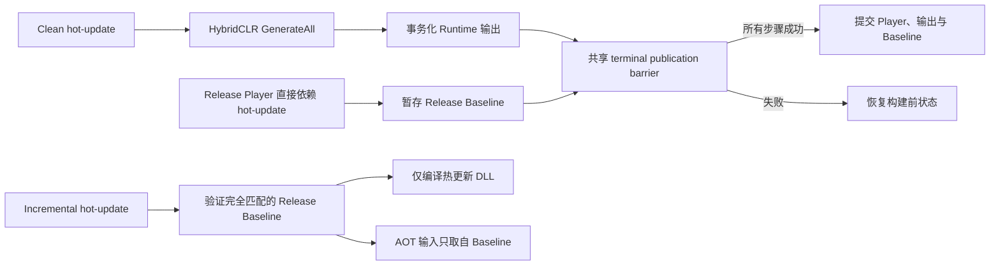

# HybridCLR 构建集成

HybridCLR 集成负责编译热更新程序集、以事务方式发布 Runtime DLL 资产，并通过 Player Release Baseline 保护增量热更新构建。通用 `hot-update` step 只通过 `IHotUpdateBuildAdapter` 访问本集成，adapter 再通过反射访问可选 vendor package。因此，移除这些 package 不会让 core 产生编译期依赖，也不会让 orchestration code 出现 vendor 分支。

## 职责边界

- `HybridCLRBuilder` 隔离受支持的 HybridCLR Editor API，并复制生成的 DLL。
- `HybridCLRGenerationTransaction` 保护第三方生成输入与嵌套 Player 的临时状态。
- `HybridCLROutputTransaction` 发布 `Assets` 下的 Runtime 热更新 DLL 与 AOT metadata 目录。
- `HybridCLRReleaseBaselineTransaction` 发布后续增量热更新使用的持久 AOT 输入。
- `HybridCLRBuildAdapter` 拥有 HybridCLR requirements、验证、执行、output claim 与 Player compatibility check。
- `HybridCLRBuildConfig` 选择标准 HybridCLR 输出；`HybridCLRObfuzBuildConfig` 选择明确的组合 provider。系统不存在序列化 mode toggle 或手写 provider ID。

本集成不负责安装 HybridCLR、初始化原生工具链、自动选择热更新程序集或上传发布产物。

Authoring catalog 仅在所需 HybridCLR Editor API 存在时显示标准 provider；只有 HybridCLR、Obfuz 与 Obfuz4HybridCLR 三组 Editor API 全部存在时才显示组合 provider。缺少前置包时 Core Pipeline 仍可编译，且不可用 provider 会在配置阶段变为不可选，而不是把错误推迟到执行阶段。

## Clean 与 Incremental 语义



`Clean` invocation 始终执行完整 HybridCLR 生成。只有同时满足以下条件时才会发布 Release Baseline：

1. 请求是 Release 构建，即未启用 `Debug Build`；
2. 已选且适用的 `player` invocation 直接将该 hot-update invocation 声明为依赖；
3. 所有 Pipeline 步骤与所有延迟发布都到达共享 terminal commit decision。

Clean 的 hot-update-only Recipe、Development Player，或仅通过传递依赖接触 hot-update 的 Player，都不会创建或替换 Release Baseline。

`Incremental` invocation 只编译热更新 DLL，绝不会读取当前 HybridCLR stripped-AOT 输出目录。编译前以及实际使用前都会要求一个完整 Baseline，并验证 manifest 与所有 DLL hash 是否匹配当前请求。证据缺失、损坏、不匹配或被修改都会使预检失败。

`HybridCLRBuildConfig` 支持 Clean 与 Incremental。`HybridCLRObfuzBuildConfig` 是独立 provider；它会拒绝 Incremental，因为已安装的 Obfuz4HybridCLR API 使用隐式 stripped-AOT 目录，无法接收显式验证后的输入，其 Clean 模式仍受支持。

通用 step 允许多个 hot-update invocation，但当前 HybridCLR Editor API 只拥有一个 process-global generation session。因此，只要同一次 run 包含多个 HybridCLR-family invocation，HybridCLR adapter 就会在 preflight 明确拒绝。这项限制属于 provider，而不是 core step。

## Baseline 标识与存储

Baseline 位于配置的 Build Root 下：

```text
<BuildRoot>/.buildpipeline/baselines/hybridclr/
  <BuildTarget>/
    <ScriptingBackend>/
      <release-key>/
        baseline.json
        AOT/
          *.dll
```

Release key 是由 application identifier、application version 与 hot-update invocation ID 派生的 SHA-256 标识。Target 与 backend 目录层级会阻止跨平台复用。

`baseline.json` 使用当前 `formatVersion` 契约，并记录：

- application、invocation、target、backend、Release configuration 与显式 Player consumer 标识；
- Unity 版本与 HybridCLR assembly 标识；
- `HybridCLRBuildConfig`、HybridCLR project settings 和 AOT 相关 Player settings 的 hash；
- 配置的热更新程序集清单；
- 每个 AOT DLL 的文件名、字节长度与 SHA-256；
- source build/version-control provenance，以及覆盖整个 manifest 的 checksum。

兼容性 fingerprint 包含 API compatibility level、managed stripping level、IL2CPP compiler configuration、engine-code stripping、unsafe-code 设置与规范化后的 scripting defines。任何已知兼容性变化都要求重新成功构建 Clean Release Player。

## CI 产物流程

Release Player Job 必须同时归档 Player/content 产物和对应 Baseline 目录。后续 hot-update-only Job 必须先把 Baseline 恢复到相同 Build Root 路径，再运行 Incremental Recipe。不要手工生成 `baseline.json`、只复制部分 AOT DLL，也不要使用来自其他 application version、target、backend、Unity version、configuration 或 hot-update invocation 的 Baseline。

Build Root 是显式项目配置，也可以由正常的 Build Profile/CI 参数调整。本集成不会通过环境变量、`EditorPrefs` 或 scripting-define symbols 定位 Baseline。

## 持久化与恢复

| 数据 | 位置 | 生命周期 | 是否可安全删除 |
| --- | --- | --- | --- |
| Release Baseline | `<BuildRoot>/.buildpipeline/baselines/hybridclr/...` | 持久 Release 产物；只在 terminal release build 成功后替换 | 可以，但 Incremental 热更新会失败，直到新的 Clean Release Player 成功 |
| Baseline transaction journal | `<UnityProject>/.buildpipeline/transactions/hybridclr-release-baseline/` | 临时持久恢复证据 | 只能通过 Build Workspace recovery 删除 |
| Runtime DLL 输出 | 配置的 `Assets` 下 build-exclusive 目录 | 以事务方式替换的构建输入 | 使用对应 output transaction/recovery 工作流 |

如果 Unity 或 CI 进程在发布期间终止，Workspace Health 检查会阻止下一次正常构建。此时应运行显式 Build Workspace recovery。Recovery 会遵守共享 terminal decision：terminal barrier 已选择提交时完成 Baseline，否则恢复完全一致的旧 Baseline。未知文件、路径逃逸、reparse point、超出预算的清单与竞争写入都会 fail closed。

## 常见失败

- **Baseline 缺失：** 运行 Clean Release Recipe，并让 Player invocation 直接依赖 hot-update invocation。
- **Unity/backend/target/configuration 不匹配：** 重新构建并发布 Player，不要绕过不匹配。
- **AOT hash 不匹配：** 将 Baseline 视为损坏；从 Release artifact store 恢复，或生成新的 Release Player。
- **需要 Recovery：** 重试或切换目标平台之前先运行 Build Workspace recovery。
- **HybridCLR API 不可用：** 安装并 provision 兼容包；缺少该包时核心模块仍可编译。
- **Incremental Obfuz 被拒绝：** 使用 Clean；或在已安装 API 能显式接收验证后的 Baseline AOT 目录时升级 adapter。

## 验证

修改本集成后的最小验证步骤：

1. 编译 `Build.Pipeline.Editor` 与 `Build.Pipeline.Tests.Editor`；
2. 在 EditMode 中运行 `HotUpdateBuildAdapterTests`、`HybridCLRReleaseBaselineTests`、`HybridCLROutputTransactionTests` 与 `HybridCLRGenerationTransactionTests`；
3. 运行完整 Build EditMode test assembly；
4. 为每个支持的 target 生成 Clean Release Player，并归档其 Baseline；
5. 在干净 CI workspace 恢复该 Baseline，再运行 Incremental hot-update-only 构建；
6. 验证修改 manifest、DLL、Unity 版本、backend、target 或 build configuration 时都会被拒绝。
