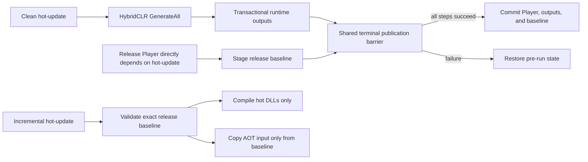

# HybridCLR Build Integration

The HybridCLR integration compiles hot-update assemblies, publishes runtime DLL assets transactionally, and protects incremental hot-update builds with a Player release baseline. The generic `hot-update` step reaches it only through `IHotUpdateBuildAdapter`, and the adapter reaches optional vendor packages only through reflection. Removing those packages therefore creates neither a core compile-time dependency nor a vendor branch in orchestration code.

## Responsibilities

- `HybridCLRBuilder` isolates supported HybridCLR editor APIs and copies generated DLLs.
- `HybridCLRGenerationTransaction` protects third-party generated inputs and nested-Player scratch state.
- `HybridCLROutputTransaction` publishes the runtime hot-update and AOT metadata directories below `Assets`.
- `HybridCLRReleaseBaselineTransaction` publishes the durable AOT input used by later incremental hot-update builds.
- `HybridCLRBuildAdapter` owns HybridCLR requirements, validation, execution, output claims, and Player compatibility checks.
- `HybridCLRBuildConfig` selects standard HybridCLR output. `HybridCLRObfuzBuildConfig` selects the explicit combined provider; no serialized mode toggle or handwritten provider ID exists.

The integration does not install HybridCLR, initialize its native toolchain, choose hot-update assemblies automatically, or upload release artifacts.

The authoring catalog exposes the standard provider only when the required HybridCLR editor API is present. It exposes the combined provider only when the HybridCLR, Obfuz, and Obfuz4HybridCLR editor APIs are all present. Missing prerequisites leave the core pipeline compilable and make the unavailable provider non-selectable instead of deferring the error until execution.

## Clean and Incremental Semantics



A `Clean` invocation always performs full HybridCLR generation. It publishes a release baseline only when all of these conditions are true:

1. the request is a Release build (`Debug Build` is disabled);
2. a selected and applicable `player` invocation directly declares the hot-update invocation as a dependency;
3. every pipeline step and every deferred publication reaches the shared terminal commit decision.

A Clean hot-update-only recipe, a Development Player, or a Player that reaches hot-update only through a transitive dependency never creates or replaces a release baseline.

An `Incremental` invocation compiles hot-update DLLs only. It never reads the current HybridCLR stripped-AOT output directory. Before compilation, and again immediately before use, it requires a complete baseline whose manifest and DLL hashes match the current request. Missing, corrupt, mismatched, or modified evidence fails preflight.

`HybridCLRBuildConfig` supports Clean and Incremental. `HybridCLRObfuzBuildConfig` is a separate provider and rejects Incremental because the installed Obfuz4HybridCLR API consumes an implicit stripped-AOT directory instead of an explicit validated input. Its Clean mode remains supported.

The generic step permits multiple hot-update invocations, but the current HybridCLR editor API owns one process-global generation session. The HybridCLR adapters therefore reject a run containing more than one HybridCLR-family invocation during preflight. This constraint belongs to the provider, not to the core step.

## Baseline Identity and Storage

Baselines are stored below the configured Build Root:

```text
<BuildRoot>/.buildpipeline/baselines/hybridclr/
  <BuildTarget>/
    <ScriptingBackend>/
      <release-key>/
        baseline.json
        AOT/
          *.dll
```

The release key is a SHA-256 identity derived from the application identifier, application version, and hot-update invocation ID. Target and backend directory segments prevent cross-platform reuse.

`baseline.json` uses the current `formatVersion` contract and records:

- application, invocation, target, backend, Release configuration, and explicit Player-consumer identity;
- Unity version and HybridCLR assembly identity;
- hashes for `HybridCLRBuildConfig`, HybridCLR project settings, and AOT-relevant Player settings;
- the configured hot-update assembly inventory;
- every AOT DLL file name, byte length, and SHA-256;
- source build/version-control provenance and a checksum covering the manifest.

The compatibility fingerprint includes the selected API compatibility level, managed stripping level, IL2CPP compiler configuration, engine-code stripping, unsafe-code setting, and normalized scripting defines. Any known compatibility change requires a new successful Clean Release Player build.

## CI Artifact Flow

For a release Player job, archive both the Player/content artifacts and the matching baseline directory. For a later hot-update-only job, restore the baseline at the same Build Root path before invoking the incremental recipe. Do not synthesize `baseline.json`, copy only selected AOT DLLs, or use a baseline from another application version, target, backend, Unity version, configuration, or hot-update invocation.

The Build Root is explicit project configuration and may be relocated by the normal build profile/CI options. The integration does not read environment variables, `EditorPrefs`, or scripting-define symbols to locate a baseline.

## Persistence and Recovery

| Data | Location | Lifecycle | Safe deletion |
| --- | --- | --- | --- |
| Release baseline | `<BuildRoot>/.buildpipeline/baselines/hybridclr/...` | Durable release artifact; replace only after a successful terminal release build | Yes, but incremental hot-update builds then fail until a new Clean Release Player build succeeds |
| Baseline transaction journal | `<UnityProject>/.buildpipeline/transactions/hybridclr-release-baseline/` | Temporary durable recovery evidence | Delete only through Build Workspace recovery |
| Runtime DLL outputs | Configured build-exclusive folders below `Assets` | Transactionally replaced build input | Use the owning output transaction/recovery workflow |

If Unity or the CI process terminates during publication, the workspace health check blocks the next normal build. Run the explicit Build Workspace recovery command. Recovery follows the shared terminal decision: it commits a baseline selected by the terminal barrier or restores the exact previous baseline otherwise. Unknown files, path escapes, reparse points, unbounded inventories, and competing writes fail closed.

## Common Failures

- **Baseline missing:** run a Clean Release recipe with a Player invocation that directly depends on the hot-update invocation.
- **Unity/backend/target/configuration mismatch:** rebuild and release the Player; do not bypass the mismatch.
- **AOT hash mismatch:** treat the baseline as corrupt and restore it from the release artifact store, or produce a new release Player.
- **Recovery required:** use Build Workspace recovery before retrying or switching target platforms.
- **HybridCLR API unavailable:** install and provision a compatible package; the core module remains compilable without it.
- **Incremental Obfuz rejected:** use Clean, or upgrade the adapter when the installed API can accept the validated baseline AOT directory explicitly.

## Validation

Minimum validation after changing this integration:

1. compile `Build.Pipeline.Editor` and `Build.Pipeline.Tests.Editor`;
2. run `HotUpdateBuildAdapterTests`, `HybridCLRReleaseBaselineTests`, `HybridCLROutputTransactionTests`, and `HybridCLRGenerationTransactionTests` in EditMode;
3. run the complete Build EditMode test assembly;
4. produce a Clean Release Player for each supported target and archive its baseline;
5. restore that baseline in a clean CI workspace and run an incremental hot-update-only build;
6. verify that a modified manifest, DLL, Unity version, backend, target, or build configuration is rejected.
