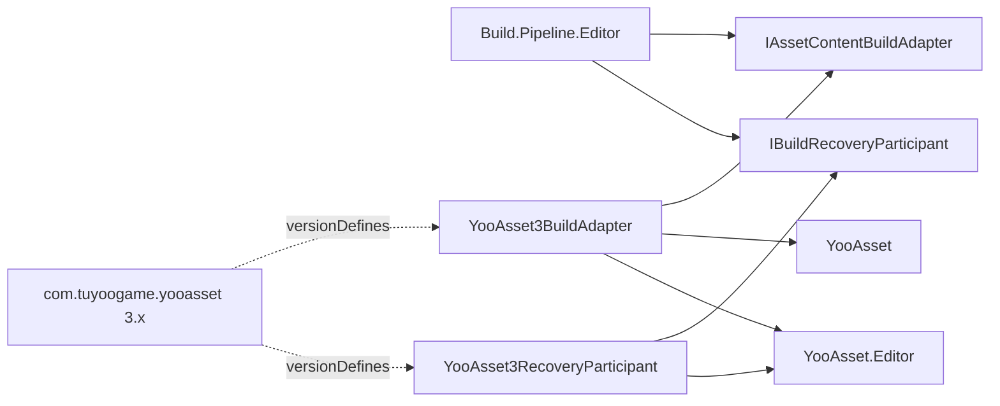
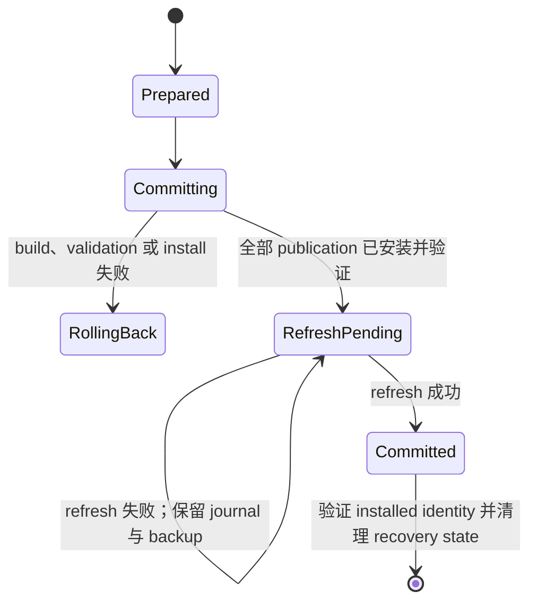

# YooAsset 3 构建集成

该 Editor-only integration 将与 Provider 无关的 Build 管线连接到 YooAsset 3.x。只有 Unity Package Manager 解析到 `com.tuyoogame.yooasset` 的受支持版本 `[3.0.5,4.0.0)` 时，该 assembly 才参与编译。

## 依赖边界

`Build.Pipeline.Editor` 不引用 YooAsset。integration assembly 引用核心契约、`YooAsset` 和 `YooAsset.Editor`，Unity 通过 asmdef 的 `versionDefines` 提供 `BUILD_PIPELINE_HAS_YOOASSET_3`。不要在 PlayerSettings 中手工添加该符号。



YooAsset 缺失或版本超出支持范围时，Unity 会排除完整 integration assembly。核心管线仍可编译；只有显式请求 YooAsset 构建时才会报告 Provider 缺失。只有完成 recovery 后才能移除 package：integration 不可用但 `<projectRoot>/.buildpipeline/transactions/yooasset3` 仍含证据时，不依赖 YooAsset 的核心 guard 会阻止所有构建，并要求重新安装受支持的 YooAsset 3 package、完成恢复后再移除。

## 配置

adapter 要求显式 `YooAssetBuildConfig`。安装兼容 collector settings 时，自定义 authoring drawer 会以下拉框显示其中的 package name，同时序列化 CI 使用的稳定名称；collector settings 不可用时会保留现有值用于诊断。每个启用的 `YooAssetPackageProfile` 必须指定唯一 `BundleCollectorSetting` 资产中的准确 package，并选择一种明确 pipeline：

| Profile 值 | YooAsset 参数 | Bundle 类型 |
| --- | --- | --- |
| `Scriptable` | `ScriptableBuildParameters` | `AssetBundle` |
| `RawFile` | `RawFileBuildParameters` | `RawBundle` |
| `Legacy` | `LegacyBuildParameters` | `AssetBundle` |
| `ArchiveFile` | `ArchiveFileBuildParameters` | `ArchiveBundle` |

Archive 构建使用固定 4-byte alignment。Raw 与 Archive 的 `IncludePathInHash` 保持关闭，当前配置也不隐式发现 encryption hook。需要这些能力时，应先增加显式序列化策略和 integration 自有的窄 factory。

Package name 与 version 必须满足可移植稳定 token 契约。构建根和 bundled 根必须是项目相对路径；bundled 根必须位于 `Assets/StreamingAssets` 内。按 tag 复制时，tag 必须非空且存在于所选 collector package 中。

Adapter 不读取 `BundleBuilderSetting` 或 `EditorPrefs`，开发者本机 Editor 状态不会改变 CI 结果。

## 事务发布与版本冲突

`FailIfVersionExists` 是默认策略。精确版本目录已存在时，会在任何 package 开始构建前失败。

`ReplaceExactVersion` 只允许替换：

```text
<buildOutputRoot>/<BuildTarget>/<PackageName>/<PackageVersion>
```

所有已配置 package 构建和验证结束前，旧精确版本保持不变。提交时，adapter 先把旧目录移动到事务自有的同级 backup，再安装 staged 目录；任一后续 package 或 bundled 发布失败时，会按逆序恢复 backup。每个 target、stage、backup、lock 与 state path 都必须位于批准根目录内且不能穿过或包含 reparse point；其他历史版本不会进入事务。

每个已封存 stage 与已安装 target 都包含 `.yoo-pub.json`。该带 checksum 的 ownership marker 记录 integration owner、publication kind、package identity、transaction identity、有上限的 entry count 和确定性的 SHA-256 content identity。publication 目录内部由 Unity 生成的 `.meta` 文件不计入该目录 identity，因此 `AssetDatabase.Refresh` 不会使未变化内容失效。StreamingAssets package 根目录的同级 `.meta` 会单独管理：journal 记录其长度与 SHA-256 identity；旧目录可能暂时缺席之前，事务会先创建持久保护副本；rollback 在清理前恢复同一份携带 GUID 的文件。首次发布的 package 会在 refresh 后、移除 committed journal 前记录新生成的同级 meta identity。

空目录可以被接管，但已有非空 target 必须已经是有效的 Build-owned publication。StreamingAssets target 与其根目录同级 meta 必须同时存在或同时不存在。未知 authored directory、孤立的根 meta 文件与无 marker 输出会 fail closed；执行干净发布前必须先把它们移出 target path。adapter 永远不会接管或递归删除这类内容。

YooAsset 3.0.5 将 `ClearBuildCacheFiles` 与删除完整 package 根目录绑定，因此 adapter 始终传入 `false`。通用 `CleanBuild` 只产生 warning，不会触发这一破坏性行为。

全部 package 输出先写入 transaction staging。bundled 内容在 `Assets` 外生成，再复制到最终 StreamingAssets package 的同级 ready 目录；只有全部 package 通过产物验证后才统一发布。`OnlyCopyAll` 与 `OnlyCopyByTags` 会先从现有 bundled snapshot 初始化 staging，再叠加新文件；`ClearAndCopyAll` 与 `ClearAndCopyByTags` 从空 snapshot 开始。因此五种 copy mode 都保留 YooAsset 原始语义，同时不会暴露半复制的 StreamingAssets。

publication lock 会按确定顺序同时锁定两个共享根和项目 journal coordinator。因此，即使两个 build 使用不同的 `buildOutputRoot`，只要共享同一个 `bundledFileRoot` 也会彼此互斥；即使两组 root 完全不同，也不能竞争同一个项目恢复 journal。锁定不依赖 package name 或进程内状态。带 checksum、大小上限的持久 journal 会记录中断构建实际使用的准确 roots、原始与已安装的目录/meta identity，以及每项操作的阶段。修改当前 build profile 无法隐藏未完成事务：recovery 会先读取中央 journal，并按其中记录的旧 roots 恢复。第一次移动之前会重新验证全部原始目录与 staged identity；每次移动之后还会再次验证 backup 或 installed directory。rollback 只有在 marker 与 content identity 能证明 target 确实由当前 transaction 安装时才会删除它；外部目录或根 meta 替换会与 backup、journal 一同保留，等待人工恢复。

`AssetDatabase.Refresh` 属于提交语义，不是提交后的附带操作。持久阶段顺序如下：



项目中央 `YooAsset3RecoveryParticipant` 会回滚中断的未提交事务、重试 `RefreshPending` publication，或继续清理已提交事务。它只依赖项目根目录，并在请求验证、功能适用性、adapter 解析和普通版本碰撞验证之前运行；修改或关闭 Provider 不能隐藏 recovery。损坏、越界、被外部修改、状态歧义、reparse-point 或与 journal 脱离的事务数据会 fail closed，并保留供检查。

## 结果与失败行为

adapter 在第一个失败 package 处停止，回滚全部 staging 和已经交换的目录，并返回一项结构化失败。完整多 package 事务提交前，不会把前面的 package 报告为成功。YooAsset 原生失败会保留 `FailedTask`、`ErrorInfo` 与 `ErrorStack`。如果文件已经安装，但 refresh 或 committed-state cleanup 失败，结果会使用 `FailedTask = CommittedPublicationRecoveryRequired`；它不会返回模糊的普通 rollback failure，也不会声称 publication 尚未提交。

只有满足以下条件时才接受原生成功结果：

- 返回的输出目录与已验证 staging 目标一致；
- 输出目录真实存在；
- `.report`、manifest `.bytes`、`.hash` 与 `.version` 文件存在；
- 请求 bundled copy 时，package 目录、manifest metadata、`BuiltinCatalog.json` 和 `BuiltinCatalog.bytes` 均存在；
- 至少存在一个输出产物。

成功结果只记录最终版本目录、最终 bundled package 目录、report 路径、确定性排序的产物列表和 warnings，不泄露 staging 路径。

安全预算会拒绝超过 128 个 package profile、1,024 个 collector package、256 个 bundled-copy tag、512 字符 package note 或 100,000 个结果产物。事务复制还限制为 250,000 个条目、64 层目录、256 GiB；同级 folder meta 限制为 1 MiB 且必须包含唯一有效 GUID；journal 限制为 1 MiB 和 512 项操作。只有真实项目测量证明有必要时才应调整这些预算。

## CI 使用

通过 UPM 安装兼容 YooAsset，并同时提交 `Packages/manifest.json` 与 `Packages/packages-lock.json`。Package profile 必须保存在项目构建资产中，不能依赖开发者在 YooAsset Build window 的选择。使用 Unity batch mode 调用核心 Build 管线，并显式传入 build target 和 package version。

可重复发布应使用唯一且不可变的 version。只有确实要对准确版本执行可复现重建时，才启用 `ReplaceExactVersion`。

## 持久化行为

integration 不持久化偏好或隐式配置。它读取纳入版本控制的 `YooAssetBuildConfig` 与 `BundleCollectorSetting`。构建在 `buildOutputRoot` 下写入 package 输出；bundled-copy mode 还会写入配置的 StreamingAssets 根。每个已安装 publication 会保留 `.yoo-pub.json` 作为 ownership 与 content-identity manifest；后续替换依赖它，不得单独编辑或删除。

事务状态位于 `<projectRoot>/.buildpipeline/transactions/yooasset3`：`active.json` 是项目唯一的恢复 journal，`work/<transaction-id>` 是可删除 staging。journal 是被 Git 忽略的 machine-local 状态，但它是 crash recovery 的持久事实来源；不得把它重新放回可配置 output root。root 与 journal-coordinator lock 是 `<projectRoot>/Temp/BuildPipeline/YooAsset3Locks` 下的可复用文件，以规范化 path 的 SHA-256 identity 为键。lock file 不包含配置或构建结果，可以重建，并应随 `Temp` 保持忽略。成功运行会移除 journal、work、backup 与受保护 meta；`RefreshPending`、rollback 失败或 cleanup 未完成时会故意保留这些内容。在诊断 ownership failure 之前，不要删除保留的 state 或 backup，也不要在存在任何保留状态时卸载 YooAsset。没有 pending transaction 时可以删除构建输出。StreamingAssets 与每个 package 根 `.meta` 都是 Player 输入，提交版本控制前必须评审。

## 最小验证

1. 未安装 YooAsset 时，确认 integration assembly 不参与编译。
2. 安装受支持的 YooAsset 版本，等待 Unity reload assemblies，并确认无编译错误。
3. 对项目所需的每种 pipeline profile 使用一个 package 执行 `Validate`。
4. 构建新版本，确认结构化结果、四个输出 metadata 产物，以及 bundled package 的两个 built-in catalog 文件。
5. 使用 `FailIfVersionExists` 重复相同 version，确认在构建前失败。
6. 创建两个历史 version，用 `ReplaceExactVersion` 重建其中一个，确认另一个保持不变。
7. 配置至少两个 package，强制第二个失败，逐字节确认全部最终精确版本和 bundled 目录与构建前一致。
8. 尝试替换非空且无 marker 的 target；prepare 后修改 owned target；在强制 rollback 前替换 installed target。确认三种情况都会 fail closed，且外部内容永远不会被删除。
9. 持有 publication lock，同时用不同 build root、相同 bundled root 请求另一构建，确认第二个构建以 `TransactionLock` 失败。再使用两组完全不同的 roots，确认项目 journal coordinator 仍会串行化它们。随后对 reparse-point lock/state path 重复验证，确认两者都会被拒绝。
10. prepare 一个事务，修改两项配置 root 后重新执行 recovery；确认中央 journal 恢复中断事务记录的旧 roots，并在成功后删除。
11. 在旧 bundled 目录已经移走、新目录尚未安装时中断替换，并删除此时孤立的根 `.meta`；确认 recovery 逐字节恢复该文件。再用外部文件替换 meta，确认 recovery fail closed，并保留外部文件、保护副本、backup 与 journal。
12. 在安装后强制 `AssetDatabase.Refresh` 失败，确认结果为 `CommittedPublicationRecoveryRequired` 且 journal/backup 保留；随后重新执行 recovery，确认无需重建内容即可完成 refresh、生成的根 meta identity 记录与 cleanup。
13. 在 backup/install 边界中断提交，重新运行构建，确认 journal recovery 会恢复未提交事务，而对已提交事务只执行清理。
14. 使用 `-batchmode -quit` 运行相同 profile，确认 validation、recovery、原生构建、产物验证、rollback、refresh 或 cleanup 失败时进程返回非零退出码。
15. 保留 pending 中央事务后移除 YooAsset，或让版本超出支持范围，确认核心 guard 会在不删除证据的前提下阻止每次构建。重新安装受支持 package 并完成恢复，确认 state root 为空后，才允许再次移除 package。

Player、IL2CPP、目标平台与 CI agent 行为必须在消费项目中实际验证；仅阅读源码不能证明这些结果。
