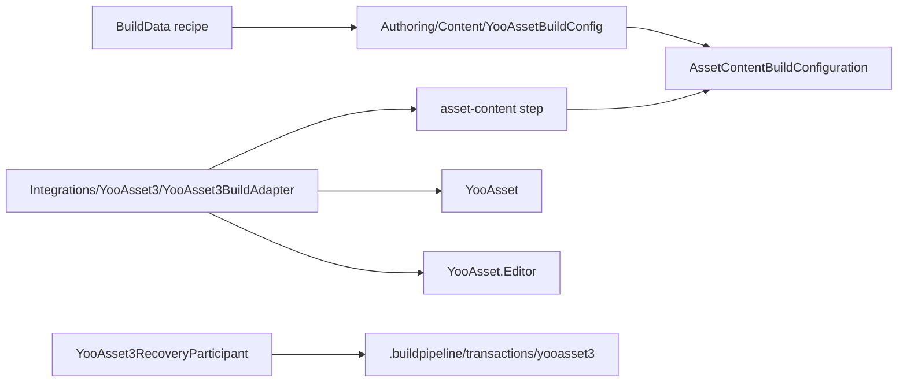
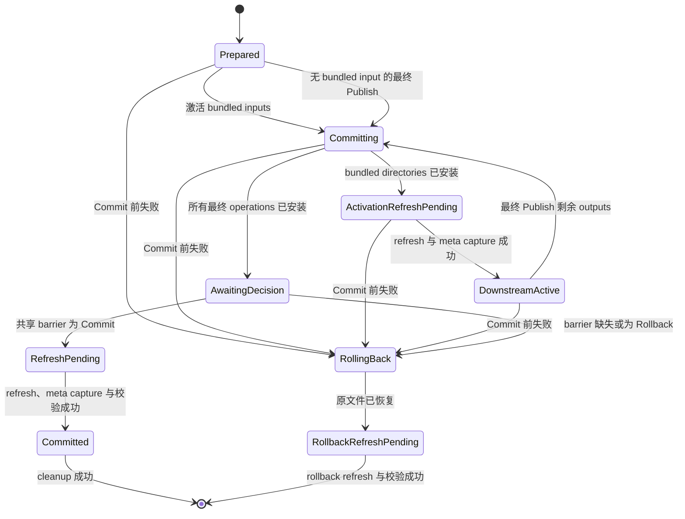

# YooAsset 3 构建集成

该 Editor-only integration 把 Provider-neutral 的 `asset-content` Step 连接到 YooAsset 3.x。它会构建一个或多个显式配置的 packages、验证产物、暂存全部最终目录，只在后续 Step 需要时激活 Player 内置输入，并加入本次运行共享的最终 publication 决策。

## 依赖与目录边界

只有当 Unity Package Manager 解析到 `[3.0.5,4.0.0)` 范围内的 `com.tuyoogame.yooasset` 时，assembly `Build.Pipeline.Integrations.YooAsset3.Editor` 才会启用。其 asmdef 通过 `versionDefines` 生成 `BUILD_PIPELINE_HAS_YOOASSET_3`，并直接引用 `YooAsset` 与 `YooAsset.Editor`。不要在 PlayerSettings 中手工添加该符号。



两个与 YooAsset 有关的目录职责不同：

- `Authoring/Content/` 包含不依赖 package 的序列化类型、校验 helper 与 Inspector drawer。因此即使没有安装 YooAsset，`BuildData` Profile 仍可读取、移动与诊断。
- `Integrations/YooAsset3/` 包含版本门控 adapter、YooAsset 强类型 API 调用、输出事务、ownership 校验、recovery participant 与 package-specific tests。

YooAsset 缺失或超出支持范围时，integration assembly 会被排除，核心 Build assembly 仍可编译。此时，如果启用的 `asset-content` 行引用 `YooAssetBuildConfig`，Preflight 会报告 adapter 不可用。如果已经存在 recovery 证据，不依赖 package 的 workspace facade 会 fail closed，直到重新安装受支持的 YooAsset 并完成恢复。

## Authoring 与 Recipe 用法

可以通过以下任一方式创建 `YooAssetBuildConfig`：

1. 在 `BuildData` Inspector 中选择 `asset-content`，然后在强类型 Config 字段使用 **Create > YooAsset**。
2. 使用 `Assets > Create > CycloneGames > Build > YooAsset Build Config`，再把该资产拖入 `asset-content` Recipe 行。

配置资产是事实来源，而不是 YooAsset Editor window 状态。交互式构建前应与 Profile 一起显式保存，并把两者都提交。CI 可以使用已保存引用，也可以为已选 Step 覆盖它：

```text
-pipelineRecipe yoo-main=asset-content \
-pipelineStepConfig yoo-main=Assets/Settings/Build/YooAssetBuildConfig.asset \
-pipelineStepIncrementality yoo-main=Clean
```

不存在独立的 Provider CLI switch。具体 `AssetContentBuildConfiguration.ProviderId` 决定 adapter，因此 Step ID、配置资产类型与 Provider 不会相互漂移。

## 配置

### Root 字段

| 字段 | 契约 |
| --- | --- |
| `buildOutputRoot` | 可移植的项目相对 package publication root；留空解析到 YooAsset 的 `Bundles` root。 |
| `bundledFileRoot` | `Assets/StreamingAssets` 下可移植的项目相对 built-in content root；留空委托给已安装 YooAsset settings。 |
| `packages` | 显式有序的 `YooAssetPackageProfile` 数组；至少一个 Profile 必须启用。 |

Build output root 与 bundled root 不能重叠。Publication 开始前，两者都会经过规范化，并检查文件冲突、不安全 ancestry、path budget 与 reparse point。

### Package Profile

| 字段 | 行为 |
| --- | --- |
| `enabled` | 决定该 package 是否参与本次 content build。 |
| `packageName` | YooAsset `BundleCollectorSetting` 中的准确名称，同时也是可移植的稳定输出 token。 |
| `buildPipeline` | `Scriptable`、`RawFile` 或 `ArchiveFile`。 |
| `packageNote` | 必填的确定性说明，写入 manifest。 |
| `compression` | 为 Scriptable pipeline 选择 `Uncompressed`、`LZMA` 或 `LZ4`。 |
| `fileNameStyle` | Hash、bundle name，或 bundle name 加 hash。 |
| `cryptography` | 可选的强类型 `YooAssetCryptographyConfiguration` 资产。`None` 是显式默认值，bundle 与 manifest 均不加密。 |
| `bundledCopyOption` | None、clear-and-copy 或 additive copy，可应用于全部文件或指定 tags。 |
| `bundledCopyTags` | Tag-based copy mode 必需的分号分隔 tags。 |
| `useAssetDependencyDatabase` | 把显式 dependency database 策略传给 YooAsset。 |
| `enableSharePackRule` | 把显式 bundle sharing 策略传给 YooAsset。 |
| `verifyBuildingResult` | 请求 YooAsset 验证 build result；adapter 仍会执行自己的产物校验。 |
| `versionCollisionPolicy` | `FailIfVersionExists` 或受保护的 `ReplaceExactVersion`。 |

兼容的 collector settings 可用时，自定义 drawer 会列出 `BundleCollectorSettingData` 中的 package name。序列化名称保持稳定供 CI 使用；settings 缺失或无效时只报告诊断，不替换已保存值。

Profile 映射如下：

| Profile 值 | YooAsset 参数 | Bundle 类型 |
| --- | --- | --- |
| `Scriptable` | `ScriptableBuildParameters` | `AssetBundle` |
| `RawFile` | `RawFileBuildParameters` | `RawBundle` |
| `ArchiveFile` | `ArchiveFileBuildParameters` | `ArchiveBundle` |

Archive 输出使用固定四字节 alignment。Raw 与 Archive path hashing 保持关闭。

### 加密扩展

加密按 package profile 显式选择。Inspector 只显示一个强类型资产引用与可用性诊断；不会要求输入实现类名，也不会读取 YooAsset `EditorPrefs`。具体配置继承 `YooAssetCryptographyConfiguration`，并返回一个稳定的小写 Adapter ID。匹配的版本门控 adapter 使用 `YooAssetCryptographyAdapterRegistration` 注册，绑定且只绑定一个具体配置类型，并实现 `IYooAsset3CryptographyAdapter`。

以下任一情况都会使 Preflight fail closed：注册缺失或重复、配置类型不匹配、身份为空或无效、adapter 运行时身份与注册身份不一致，或任一官方 service 缺失。被选择的 adapter 必须创建 YooAsset 3 的全部三个 service：`IBundleEncryptor`、`IManifestEncryptor` 与 `IManifestDecryptor`。Factory 会为 Scriptable、RawFile 与 ArchiveFile 参数显式赋值。`None` 会显式赋值 null service，这是 YooAsset 的不加密行为。

Adapter 注册还必须声明稳定的 `runtimeDecryptContractId`。Runtime composition root 依据该部署契约选择兼容的 bundle 与 manifest decryptor。Package plan、transaction journal 与 `.yoo-pub.json` 会保存 Adapter ID 和 runtime contract ID；Build-owned evidence 不会保存配置内容、密钥或 secret reference。YooAsset 原生 build report 会按上游行为记录 service 类名。生产项目应从可审计的 secret boundary 解析密钥，并确保 adapter exception 永远不包含 secret 值。

## 构建与 publication 生命周期

Adapter 会在调用任何 package build 之前校验完整的多 package plan。每条 YooAsset pipeline 都写入 transaction-owned staging，Bundled copy work 也在最终 `StreamingAssets` package 目录之外准备。Adapter 校验预期 metadata 并封存 content identity，然后才把 `AssetContentBuildOperation` 返回核心管线。

Deferred publication 会在 downstream activation 之前注册给 runner。该所有权顺序很重要：注册成功后，所有成功与失败路径上的 `Publish`、`Complete` 与 `Dispose` 都由 runner 负责。

如果后续 `player` Step 需要 built-in content，`ActivateForDownstream` 只安装 bundled `StreamingAssets` operations，并执行 `AssetDatabase.Refresh`。精确版本 package output operations 仍保持 staged。这样 Player build 能看到完整 built-in input，又不会提前暴露最终 package publication。如果后续运行或 Unity state restoration 失败，已激活 bundled input 与 staged package output 都会恢复到准确旧状态。

YooAsset adapter 声明空 `ExclusivePlayerSessionKey`，因为每个 invocation 都拥有独立 deferred publication，并且 preflight 已强制其 output claim 互不重叠。因此一个 Player build 可以并存多个 YooAsset session；每个 session 会按 dependency 的反向顺序 dispose。

所有已选 Steps 与临时状态 restoration gate 全部成功后：

1. `Publish` 安装剩余的 sealed exact-version operations，校验全部 installed directories，并记录 `AwaitingDecision`。
2. 共享 `BuildPublicationBarrier` 为本次运行的 Player、content 与 hot-update publications 持久化一个 `Commit`。
3. `Complete` 要求该持久化决策，记录 `RefreshPending`，刷新 AssetDatabase，捕获新生成的 sibling `.meta` identity，验证 committed state，并移除 transaction-owned backup/work data。
4. 只有每个 child publication 都移除自己的 recovery state 后，barrier 才会移除。



`AssetDatabase.Refresh` 属于持久化 publication 与 rollback 语义。Refresh 失败会保留 journal，而不会报告 clean rollback 或成功 commit。

## 冲突与 ownership 策略

默认策略为 `FailIfVersionExists`。精确 package version 目录已存在时，任何 package native build 开始前就会校验失败。

`ReplaceExactVersion` 只能替换 YooAsset 为当前 target、package 与 version 选择的精确 target。其他历史 sibling versions 不属于事务目标，保持不变。Clean mode 永远不会启用 YooAsset 3.0.5 的 `ClearBuildCacheFiles`，因为该 API 可能删除整个 package root 及全部历史版本；adapter 会给出 warning，并使用自己的 exact-version transaction。

每个 sealed stage 与 installed target 都包含 `.yoo-pub.json`。该带 checksum 的 ownership marker 记录 owner、publication kind、package identity、cryptography Adapter ID、runtime decrypt contract ID、transaction identity、有上限的 entry count 与确定性 SHA-256 content identity。Publication 目录内部由 Unity 生成的 `.meta` 不计入 content identity，因此 AssetDatabase refresh 不会让未变化的 package content 失效。

缺失或空 target 可以被接管；非空 target 必须包含有效的 Build-owned marker，并符合记录的 content identity。未知 authored directory、无 marker output、外部修改的 installed target 与有歧义的 sibling `.meta` 都会 fail closed，绝不会被递归删除。

对 bundled package root 而言，sibling Unity `.meta` 属于事务数据：

- 捕获原文件 identity 与 GUID；
- 在目录可能暂时消失之前写入 protected copy；
- 首次 publication 在 refresh 后捕获新 meta；
- rollback 恢复准确原始字节，或验证原本不存在；
- 外部替换时保留 journal、backup、protected copy 与外部文件供检查。

Root locks 与项目 journal coordinator 会串行化 publications，即使两次调用使用不同 package name 或 roots。Lock 是 `Temp/BuildPipeline/YooAsset3Locks` 下可重建的协调文件；持久化 journal 才是 recovery 事实来源。

## Journal 与崩溃恢复

持久化状态根为 `.buildpipeline/transactions/yooasset3`：

```text
.buildpipeline/transactions/yooasset3/
  active.json
  active.json.tmp-<transaction-id>
  work/<transaction-id>/...
```

Journal 带 checksum 与 sequence，具有大小上限，并绑定准确 project root、build root、bundled root、transaction ID、operations、directory identities、sibling meta identities 与 phases。原子替换 journal 期间崩溃，可能同时留下 active 与 temporary candidate。Recovery 会验证两者，要求相同 transaction identity，选择最高有效 sequence 并提升为 active；相同 sequence 但内容不同或存在多个 temporary candidates 时会 fail closed。

Recovery 决策同时来自 child journal 与共享 publication barrier：

- 没有持久化 commit 时，`Prepared`、`Committing`、`ActivationRefreshPending` 与 `DownstreamActive` 执行 rollback。
- `AwaitingDecision` 在 barrier 缺失或为 `Rollback` 时 rollback；barrier 为 `Commit` 时进入 committed refresh。
- `RefreshPending` 与 `Committed` 要求准确匹配的显式 `Commit`，并完成 refresh 或 cleanup。
- `RollbackRefreshPending` 只在不存在矛盾 commit 时完成 rollback refresh。
- 持久化 commit 与“最终输出从未 publish”的 phase 同时出现属于矛盾状态，会 fail closed 等待检查。

普通构建绝不会调用该 recovery 逻辑。使用 `Build > Pipeline > Workspace Health`，检查最新 snapshot 后选择 **Recover**。CI 中应把 `-pipelineRecoverOnly` 作为独立 action。不要手工删除 `active.json`、temporary candidate、backup directory、work data、protected meta 或 publication barrier。

如果 package 已被移除，应重新安装 `[3.0.5,4.0.0)` 范围内的版本，等待 Unity reload integration assembly，恢复到 `Clean`，然后才能再次移除 package。

## 输出与结果校验

只有在 native success 所报告的 output directory 与已校验 staged target 相同，且预期产物存在时，adapter 才接受成功。它会校验 package build report、binary manifest、hash、version file 与至少一个 produced artifact。请求 bundled copy 时，还会校验 package metadata、`BuiltinCatalog.json` 与 `BuiltinCatalog.bytes`。

结构化结果报告最终 exact-version output root、存在时的最终 bundled package root、report path，以及固定且有界的关键产物集合（report、manifest、hash、version），并包含 warnings 与 native failure details。它不会把完整 bundle tree 复制进运行 Manifest；publication owner 仍会完整扫描目录，并用有界 entry/byte count 与确定性 content digest 提供证明。Staging 和 backup path 不会作为成功产物泄露。

持久化 commit 之前失败时，rollback 成功后返回 build failure。如果共享 commit 已持久化，但 refresh 或 cleanup 未完成，则 failure 报告 `CommittedPublicationRecoveryRequired`，并保留 journal 等待显式 recovery。

## 持久化行为

| 数据 | 位置 | 生命周期 |
| --- | --- | --- |
| 配置 | 任意已提交的 `Assets/.../YooAssetBuildConfig.asset` | 人工 authoring 事实来源；不依赖 `EditorPrefs`。 |
| 加密配置 | 任意已提交且属于项目或 package 的 `YooAssetCryptographyConfiguration` 资产 | 可选强类型策略引用。Secret material 应保留在项目 secret boundary 中，绝不会复制到 Build evidence。 |
| Collector settings | YooAsset 已提交的 `BundleCollectorSetting` 资产 | 用于读取 package 定义与校验 tags。 |
| Package publications | `buildOutputRoot` 下 YooAsset target-specific directories | 最终输出；exact-version replacement 由 `.yoo-pub.json` 保护。 |
| Built-in package inputs | 已配置 `Assets/StreamingAssets` root 下的 package directories | 下游 Player 输入；sibling `.meta` 参与事务。 |
| Recovery evidence | `.buildpipeline/transactions/yooasset3` | 本机持久化事实；只由成功 transaction completion 或 recovery 移除。 |
| Locks | `Temp/BuildPipeline/YooAsset3Locks` | 可重建的进程协调，随 `Temp` 忽略。 |
| Result evidence | `.buildpipeline/results/<run-id>.json` | 可供 CI 归档的核心运行 Manifest。 |

## 安全预算

当前 adapter 对不可信或生成的 cardinality 与 I/O 设有边界：最多 128 个配置 profiles、1,024 个 collector packages、256 个 bundled-copy tags、512 个 journal operations、100,000 个 scanned output-tree entries、每个结构化 package result 固定四个关键产物，以及 250,000 个 transaction/identity entries。Note、name、tag、path、journal、marker、sibling meta、tree depth 与 copied bytes 也有显式上限。只有项目测量证据与对应失败路径测试都支持时，才应修改这些上限。

## 最小验证

1. 移除 YooAsset，确认核心 assembly 与不依赖 package 的测试仍可编译，同时 YooAsset integration 被排除。
2. 安装 `[3.0.5,4.0.0)` 范围内的版本，reload assemblies，并运行 `Integrations/YooAsset3/Tests` 中的 integration EditMode tests。
3. 对每一种支持的 pipeline kind 使用一个 package 进行校验，再校验 multi-package build。
4. 对每个被选择的 cryptography adapter，验证注册缺失、重复、类型不匹配会失败；验证 Scriptable、RawFile、ArchiveFile 均设置全部三个 service；并按记录的 contract ID 验证 runtime 解密。还要确认 `None` 生成不加密内容。
5. 分别运行 `Content Only`、`Content + Hot Update`，以及启用 bundled copy 的完整 Player Recipe。
6. 确认重复的 `FailIfVersionExists` 在 native build 前失败，且 `ReplaceExactVersion` 只改变一个准确版本。
7. 强制第二个 package 失败，并逐字节确认此前全部最终输出与 bundled directories 都已恢复。
8. 在 bundled downstream activation 后强制失败并切换 active build target，确认新构建被阻止，直到显式 recovery 返回 `Clean`。
9. 分别在 backup、install、activation refresh、terminal publish、commit refresh、rollback refresh、journal replacement 与 cleanup 边界中断；确认每个 phase 都遵循持久化 barrier 决策。
10. 在 pending transaction 期间从外部替换 owned target 或 sibling `.meta`，确认 recovery fail closed，不删除外部数据或 transaction evidence。
11. 保留 journal 后移除 YooAsset，确认 workspace 状态为 `Blocked`；重新安装受支持 package，完成恢复，然后才能成功移除。
12. 使用 batch mode，确认 validation、native build、rollback、refresh、cleanup 与 recovery failure 都返回非零进程退出码，并留下可用结果 Manifest。

源码检查与 C# 编译不能证明 Player、IL2CPP、stripping、target-platform、filesystem 或 CI-agent 行为。必须在消费项目中验证这些组合。
