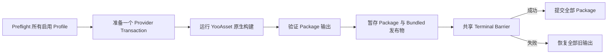

# YooAsset 3 构建集成

本 Integration 把通用 `asset-content` invocation 转换为一次事务化 YooAsset 构建，其中包含一个或多个显式 Package Profile。它是可选 Editor Adapter，缺少 YooAsset 时 Build Core 不受编译依赖影响。

> **当前 checkout：** `Packages/manifest.json` 未安装 YooAsset。Integration 源码存在，但受门控程序集及其测试未激活。下文描述源码契约，Release 前必须使用实际安装包完成资格验证。

## 开始之前

需要三件事：

1. 安装 `[3.0.6,4.0.0)` 范围内的 `com.tuyoogame.yooasset`。
2. 项目中存在且仅存在一个有效的 YooAsset Bundle Collector Settings 资产。
3. BuildData 使用的每个 Package 都存在于 Collector Catalog。

Adapter 不负责安装 YooAsset、创建 Collector Settings、从 `EditorPrefs` 选择 Package 或上传产物。这些属于产品搭建与发布流水线。

## 程序集门控

`Build.Pipeline.Integrations.YooAsset3.Editor.asmdef` 引用 `Build.Pipeline.Editor`、`YooAsset` 和 `YooAsset.Editor`。只有 `com.tuyoogame.yooasset` 满足 `[3.0.6,4.0.0)` 并产生 `BUILD_PIPELINE_HAS_YOOASSET_3` 时，该程序集才启用。

该边界带来三个结果：

- 卸载 YooAsset 不会破坏 Build Core Assembly；
- `YooAssetBuildConfig` 仍是可序列化 authoring type，但选中它的 Recipe 会因没有注册 Adapter 而在 Preflight 失败；
- 发布恢复位于独立程序集 `Build.Pipeline.Integrations.YooAsset3.Publication`（目录 `Integrations/YooAsset3/Publication/`），无版本门控、不依赖 YooAsset 包，因此卸载或升级 YooAsset 不会让任何持久 journal 变得不可读。

不要在 PlayerSettings 中手工添加 `BUILD_PIPELINE_HAS_YOOASSET_3`。Capability 由 Package Presence 和 Version 决定。

## 快速上手

1. 安装并锁定支持范围内的 `com.tuyoogame.yooasset`。
2. 创建并保存恰好一个有效的 Bundle Collector Settings 资产。Collector Catalog 超过 1024 个 Package 会被拒绝。
3. 确认 BuildData 使用的每个 Package 都存在于 Collector Catalog。
4. 在 BuildData 中选择包含 Asset Content 的 Recipe。
5. 通过菜单 `CycloneGames/Build/YooAsset Build Config` 创建配置资产。
6. 配置 Root 与 Package Profile，保存资产，再运行 Preflight。

## Build Config 资产

`YooAssetBuildConfig` 保存一个 Build Root、一个可选 Built-in File Root，以及最多 128 个显式 Package Profile。

| 字段 | 契约 |
| --- | --- |
| `buildOutputRoot` | 项目相对的 YooAsset 构建根目录，默认 `Bundles` |
| `bundledFileRoot` | 项目相对的内置文件根目录；为空时委托 YooAsset 的 StreamingAssets Root |
| `packages` | 至少一个启用的 Package Profile |

## Package Profile 字段

每个 `YooAssetPackageProfile` 配置一个 Package。下表列出字段、可选值以及出厂默认值。

| 字段 | 取值 | 默认值 |
| --- | --- | --- |
| `enabled` | 该 Package 是否参与本次 Content Build | `true` |
| `packageName` | Collector Settings 中的精确 Package 名 | `DefaultPackage` |
| `buildPipeline` | `Scriptable`、`RawFile`、`ArchiveFile` | `Scriptable` |
| `packageNote` | 写入 Manifest 的确定性 Note，最长 512 字符 | `Generated by Build.Pipeline` |
| `compression` | `Uncompressed`、`LZMA`、`LZ4` | `LZ4` |
| `fileNameStyle` | `HashName`、`BundleName`、`BundleNameAndHash` | `HashName` |
| `cryptography` | 可选强类型加密配置资产；为空表示不加密 | 空 |
| `bundledCopyOption` | `None`、`ClearAndCopyAll`、`ClearAndCopyByTags`、`OnlyCopyAll`、`OnlyCopyByTags` | `None` |
| `bundledCopyTags` | 分号分隔的 Tag，供按 Tag 过滤的 Copy 模式使用 | 空 |
| `useAssetDependencyDatabase` | 在 Pipeline 支持时启用 YooAsset 依赖数据库 | `true` |
| `enableSharePackRule` | 在 Pipeline 支持时启用 Bundle 共享规则 | `true` |
| `verifyBuildingResult` | 上报成功前校验产物 Package | `true` |
| `versionCollisionPolicy` | `FailIfVersionExists`、`ReplaceExactVersion` | `FailIfVersionExists` |

Compression 只对 Scriptable Pipeline 生效。`BundleNameAndHash` 映射到 YooAsset 的 `EFileNameStyle.BundleName_HashName`。

## Package 与 Version 命名规则

Package Name 与 Version Token 必须可移植：长度 1–128，只允许 ASCII 字母、数字、点、连字符或下划线；首尾是字母或数字；不允许连续点；Package Name 还不得是 Windows 保留设备名，例如 `CON`、`NUL`、`COM1`、`LPT9`。

Note 要保持确定性。`packageNote` 在写入 Manifest 前会被 Trim，因此纯空白改动不会改变构建身份。

## 构建与发布流程


```mermaid
flowchart LR
    P["Preflight 所有启用 Profile"] --> S["准备一个 Provider Transaction"]
    S --> N["运行 YooAsset 原生构建"]
    N --> V["验证 Package 输出"]
    V --> B["暂存 Package 与 Bundled 发布物"]
    B --> T["共享 Terminal Barrier"]
    T -->|"成功"| C["提交全部 Package"]
    T -->|"失败"| R["恢复全部旧输出"]
```

## 输出布局

预期原生 Package 输出位于：

```text
<BuildOutputRoot>/<BuildTarget>/<PackageName>/<PackageVersion>/
<BundledFileRoot>/<PackageName>/
```

每个受 Build 所有的发布物都携带 `.yoo-pub.json`，记录 Package/Version、Transaction/Content Identity，以及可选 Cryptography Adapter/Runtime Decrypt Contract Identity。所有启用 Profile 共用一个延迟发布事务；任一失败都会阻止本 Invocation 的所有 Package 提交。

## Bundled Copy 模式

| 模式 | 内置发布语义 |
| --- | --- |
| `None` | 不向下游 Player 提供内置 Package 输入 |
| `ClearAndCopyAll` | 构建完整替换快照 |
| `ClearAndCopyByTags` | 构建按 Tag 过滤的替换快照 |
| `OnlyCopyAll` | 以现有 Build-Owned 快照为种子，再覆盖所有选中文件 |
| `OnlyCopyByTags` | 以现有 Build-Owned 快照为种子，再覆盖 Tag 文件 |

只有至少一个启用 Profile 使用 Bundled Copy 时，Content invocation 才开启临时 Player Session。Session 会为依赖它的 Player 激活暂存 Package 数据，并在失败时精确恢复此前内置状态。

如果 Invocation ID、Package Path、Bundled Path 与 Output Claim 不重叠，可以使用多个 YooAsset invocation。契约层允许 Addressables 与 YooAsset 同时供一个 Player 使用，但当前 checkout 没有真实多 Provider Player 构建证据。

## Clean 与 Incremental

两种 Incrementality 都保留 YooAsset 原生 Build Cache。Adapter 始终传入 `ClearBuildCacheFiles = false`，Clean 模式下也一样，因为 YooAsset 把该开关与删除整个 Package Root 及全部历史版本绑定。精确版本替换由 Adapter 受保护的 Collision Policy 负责。

Clean 与 Incremental 当前使用相同的原生 Package Build Parameter 形状。因此 Incremental 表示 Pipeline 允许 Provider Cache Reuse，不承诺只输出变化 Bundle、生成 Patch Manifest 或缩短构建时间。这些必须结合安装的 YooAsset 版本和真实 Collector Rule 测量验证。

`FailIfVersionExists` 是适合 Release 的默认策略。`ReplaceExactVersion` 只能替换带有效 Build 所有权证据的精确输出。正常 CI 应发布新 Package Version，把替换保留给受控 Retry。

## 加密 Package

Integration 不附带加密算法、密钥或 Runtime Decryptor。产品扩展必须提供：

1. 强类型 `YooAssetCryptographyConfiguration` 资产；
2. 带稳定 Adapter ID 与 Runtime Contract ID 的 `YooAssetCryptographyAdapterRegistration`；
3. 位于可引用 YooAsset 程序集内的 `IYooAsset3CryptographyAdapter` 实现；
4. 非空 Bundle Encryptor、Manifest Encryptor 和 Manifest Decryptor；
5. 与记录 Contract 匹配的 Player Runtime Decryptor。

Adapter 先按 Adapter ID 解析注册，再校验配置资产类型与注册声明的类型一致；类型不匹配会显式失败，而不是用错误的密码器静默构建。

Secret 获取与轮换属于产品 Adapter 和 CI Secret Store。不要把 Secret 序列化到 BuildData 或 Cryptography Asset，不要从 `EditorPrefs` 读取，也不要写入日志。`.yoo-pub.json` 只记录身份，不能证明 Runtime Decryptor 已交付。

## CI 工作流

正常 Package 发布步骤：

1. Bootstrap 兼容包与 Collector Settings；
2. 使用稳定 Invocation ID 和唯一 Package Version；
3. 仅当 `OnlyCopy...` 模式确实需要旧状态时恢复此前 Built-in Snapshot；
4. 与恢复的 Snapshot 一起保留 `.yoo-pub.json`；
5. 按 Consumer 需求运行 Content Only、Player + Content 或 Full Player；
6. 归档完整 Package-Version 与 Bundled-Package 目录及 Pipeline Result Manifest。

Upload、Signing、CDN Promotion、Retention 与 Rollback 属于外部 Release Stage。

## 崩溃恢复

YooAsset Transaction Evidence 位于：

```text
<UnityProject>/.buildpipeline/transactions/yooasset3/<invocation-id>/
```

Crash 后应先通过 Workspace Health 执行显式 Recovery，再 Retry 或切换 Target。不要删除 Journal。恢复核心位于不受门控的 Publication 程序集，因此卸载或升级 YooAsset 包后发布恢复仍然可用。

Player 构建期的产物搬移同样具备崩溃可恢复性。每一次把所有权标记、备份目录、受保护 meta、stage 目录临时移出 StreamingAssets 的动作都会记录到 `.buildpipeline/transactions/yooasset3-relocations/<transactionId>.json`：移动前持久化 `Planned`，验证后写 `Moved`，逐条写 `Restored`。`Conflict`（双侧并存或类型不符）与 `MissingBoth`（产物丢失）是终止态、fail closed，会阻止构建直到人工处理。恢复 Coordinator 会在 Editor 启动时恢复未完成的 relocation journal；journal 只有在全部条目恢复后才会删除。

## 故障排查

| 问题 | 操作 |
| --- | --- |
| BuildData 不提供 Provider | 安装支持版本并让 Unity 编译受门控 Integration Assembly |
| 已有 YooAsset 配置可用性失败 | 恢复兼容包，或从选中 Recipe 移除 invocation |
| Package Version 已存在 | 使用新版本，或只对 Build-Owned 精确输出选择受保护的 `ReplaceExactVersion` |
| Built-in `OnlyCopy` 拒绝 Seed | 恢复包含 `.yoo-pub.json` 的完整旧 Owned Snapshot |
| Player 无法加载或解密内容 | 检查独立 Runtime Provider 与 Runtime Decrypt Contract 实现 |
| Workspace 要求恢复 | 更改 Target、Package Version 或 Output Root 前先恢复 |

已知测试问题：`Tests/YooAsset3PublicationTransactionTests.cs` 中有一次请求构造未传入现在必需的 Invocation ID。当前包缺失使该测试程序集未激活。在修复该调用点，并使用受支持 YooAsset 包编译和运行受门控测试前，不得宣称 YooAsset Integration Test 已通过。

## 上限

| 上限 | 数值 |
| --- | --- |
| 每个 Config 的 Package Profile 数 | 128 |
| 每个 Catalog 的 Collector Package 数 | 1024 |
| Package Note 长度 | 512 |
| Package Name 与 Version 长度 | 128 |
| 产物树条目数 | 100000 |

## 验证边界

静态源码检查与不依赖 Package 的 Transaction Test 不证明目标 Player、Runtime 加载、Cryptography、CDN 发布、Package Upgrade Compatibility、IL2CPP 或平台行为。

## 相关源码

- [Build 构建底座](../../../../README.SCH.md)
- `Build.Pipeline.Integrations.YooAsset3.Editor.asmdef`
- `../../Authoring/Content/YooAssetBuildConfig.cs`
- `../../Authoring/Content/YooAssetCryptographyConfiguration.cs`
- `YooAsset3BuildAdapter.cs`
- `YooAsset3BuildPlan.cs`
- `YooAsset3Cryptography.cs`
- `YooAsset3PublicationTransaction.cs`
- `Publication/PublicationRecoveryCoordinator.cs`
- `Publication/PublicationRecovery.cs`
- `Publication/RelocationRecoveryCoordinator.cs`
- `Publication/RelocationJournal.cs`
