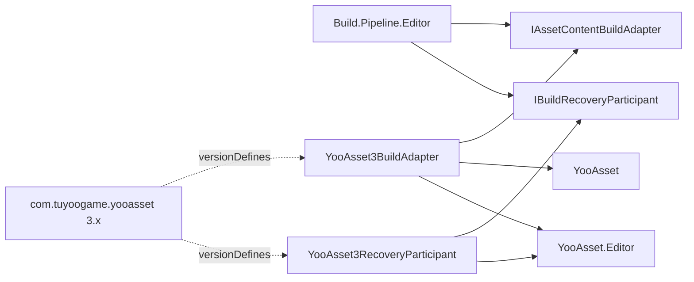

# YooAsset 3 Build Integration

This Editor-only integration connects the provider-independent Build pipeline to YooAsset 3.x. It is compiled only when Unity Package Manager resolves `com.tuyoogame.yooasset` in the supported `[3.0.5,4.0.0)` range.

## Dependency boundary

`Build.Pipeline.Editor` does not reference YooAsset. The integration assembly references the core contracts plus `YooAsset` and `YooAsset.Editor`, and Unity supplies `BUILD_PIPELINE_HAS_YOOASSET_3` through the assembly's `versionDefines`. Do not add this symbol to PlayerSettings manually.



When YooAsset is absent or outside the supported range, Unity excludes the complete integration assembly. The core pipeline remains compilable and reports a missing provider if a YooAsset build is explicitly requested. Package removal is allowed only after recovery is complete: if the integration is unavailable while `<projectRoot>/.buildpipeline/transactions/yooasset3` still contains evidence, the dependency-free core guard blocks every build and instructs the operator to reinstall a supported YooAsset 3 package and recover before removing it again.

## Configuration

The adapter requires a `YooAssetBuildConfig`. When compatible collector settings are installed, the custom authoring drawer presents their package names as a dropdown while serializing the stable name used by CI. An existing value is preserved for diagnosis when collector settings are unavailable. Each enabled `YooAssetPackageProfile` names an exact package from the single `BundleCollectorSetting` asset and selects one explicit pipeline:

| Profile value | YooAsset parameters | Bundle type |
| --- | --- | --- |
| `Scriptable` | `ScriptableBuildParameters` | `AssetBundle` |
| `RawFile` | `RawFileBuildParameters` | `RawBundle` |
| `Legacy` | `LegacyBuildParameters` | `AssetBundle` |
| `ArchiveFile` | `ArchiveFileBuildParameters` | `ArchiveBundle` |

Archive builds use a fixed four-byte file alignment. `IncludePathInHash` remains disabled for Raw and Archive builds, and YooAsset encryption hooks remain unset because the current provider config does not expose those policies. Add explicit serialized fields and narrow integration-owned factories before enabling them; do not discover implementations through implicit reflection in CI.

Package name and version are validated as portable path segments. Build and bundled roots must be project-relative; the bundled root must resolve inside `Assets/StreamingAssets`. Tag-based copy options require non-empty tags that exist in the selected collector package.

The adapter does not read `BundleBuilderSetting` or `EditorPrefs`. This keeps local Editor state from changing CI output.

## Transactional publication and collision rules

`FailIfVersionExists` is the default. A build fails before any package is built when its exact output version directory already exists.

`ReplaceExactVersion` may replace only:

```text
<buildOutputRoot>/<BuildTarget>/<PackageName>/<PackageVersion>
```

The old exact version remains intact while every configured package is built and validated. At commit, the adapter moves the old directory to a transaction-owned sibling backup, installs the staged directory, and restores the backup if any later package or bundled publication fails. It verifies every target, stage, backup, lock, and state path against its approved root and refuses reparse points. Other package versions are never part of the transaction.

Every sealed stage and installed target contains `.yoo-pub.json`. This checksummed ownership marker records the integration owner, publication kind, package identity, transaction identity, bounded entry count, and deterministic SHA-256 content identity. Unity-generated `.meta` files inside a publication directory are excluded from that directory identity so `AssetDatabase.Refresh` cannot invalidate otherwise unchanged content. The root directory's sibling `.meta` file for a StreamingAssets package is handled separately: its length and SHA-256 identity are journaled, a durable protected copy exists before the old directory can become absent, and rollback restores the same GUID-bearing file before cleanup. A newly published package has its generated sibling meta captured after refresh and before the committed journal is removed.

Empty directories may be claimed, but an existing non-empty target must already be a valid Build-owned publication. A StreamingAssets target and its root sibling meta must either both exist or both be absent. Unknown authored directories, orphan root meta files, and unmarked output fail closed; move them out of the target path before performing a clean publication. The adapter never adopts or recursively deletes such content.

YooAsset 3.0.5 couples `ClearBuildCacheFiles` to deletion of the complete package root. The adapter therefore always passes `false`. A generic `CleanBuild` request emits a warning instead of enabling that destructive behavior.

All package outputs are first written to transaction staging. Bundled content is generated outside `Assets`, copied to a ready directory beside the final StreamingAssets package, and published only after all packages pass artifact validation. `OnlyCopyAll` and `OnlyCopyByTags` seed staging from the current bundled snapshot before YooAsset overlays new files; `ClearAndCopyAll` and `ClearAndCopyByTags` start from an empty snapshot. Therefore each copy mode preserves its YooAsset meaning without exposing a partially copied StreamingAssets directory.

Publication locks are acquired for both shared roots and the project journal coordinator in deterministic order. Consequently, builds with different `buildOutputRoot` values still exclude each other when they share one `bundledFileRoot`, and even disjoint root sets cannot race the single project recovery journal. Lock acquisition never relies on package names or process-local state. A checksummed, size-bounded durable journal records the exact roots used by the interrupted build, original and installed directory/meta identities, and each operation phase. Changing the current build profile cannot hide unfinished work: recovery reads the central journal first and operates on its recorded roots. Immediately before the first move, every original and staged identity is revalidated. After each move, the backup or installed directory is validated again. Rollback deletes an installed target only when its marker and content identity prove that the active transaction installed it; an external directory or root-meta replacement is preserved together with the backup and journal for manual recovery.

`AssetDatabase.Refresh` is part of commit semantics, not a post-commit side effect. The durable phase sequence is:

```mermaid
stateDiagram-v2
    [*] --> Prepared
    Prepared --> Committing
    Committing --> RollingBack: build, validation, or install failure
    Committing --> RefreshPending: every publication installed and validated
    RefreshPending --> RefreshPending: refresh failure; retain journal and backups
    RefreshPending --> Committed: refresh succeeds
    Committed --> [*]: validate installed identities and clean recovery state
```



The project-central `YooAsset3RecoveryParticipant` rolls back an interrupted uncommitted transaction, retries a `RefreshPending` publication, or finishes cleanup for a committed transaction. It runs from only the project root before request validation, feature applicability, adapter resolution, or ordinary collision validation; changing or disabling the provider cannot hide recovery. Corrupt, out-of-root, externally modified, ambiguous, reparse-point, or detached state fails closed and is retained for inspection.

## Results and failure behavior

The adapter stops on the first failed package, rolls back every staged or already-swapped directory, and returns one structured failure. It does not report an earlier package as successful until the complete multi-package transaction has committed. Native YooAsset failures preserve `FailedTask`, `ErrorInfo`, and `ErrorStack`. If files are installed but refresh or committed-state cleanup fails, the result uses `FailedTask = CommittedPublicationRecoveryRequired`; it never reports a normal rollback failure or claims that the publication was not committed.

A successful native result is accepted only when:

- the reported output directory equals the validated target;
- the output directory exists;
- the `.report`, manifest `.bytes`, `.hash`, and `.version` files exist;
- a requested bundled-copy operation produced its package directory, manifest metadata, `BuiltinCatalog.json`, and `BuiltinCatalog.bytes`; and
- at least one output artifact exists.

The structured result records the versioned output directory, optional bundled package directory, report path, deterministic artifact list, and warnings.

Safety budgets reject more than 128 configured package profiles, 1,024 collector packages, 256 bundled-copy tags, a package note longer than 512 characters, more than 100,000 reported artifacts, a transaction copy above 250,000 entries, 64 directory levels, or 256 GiB, a sibling folder meta above 1 MiB or without one valid GUID, and a journal above 1 MiB or 512 operations. These limits prevent malformed configuration or output from causing unbounded Editor work; adjust them in code only after measuring a real project requirement.

## CI usage

Install a compatible YooAsset package through UPM and commit `Packages/manifest.json` together with `Packages/packages-lock.json`. Configure package profiles in the project build asset; do not rely on a developer's YooAsset Build window selections. Invoke the core Build pipeline in Unity batch mode with an explicit build target and package version.

For repeatable publishing, use a unique immutable version. Enable `ReplaceExactVersion` only for a deliberately reproducible rebuild of that exact version.

## Persistence

The integration does not persist preferences or implicit configuration. It reads version-controlled `YooAssetBuildConfig` and `BundleCollectorSetting` assets. Builds write YooAsset package output below `buildOutputRoot`; bundled-copy modes also write below the configured StreamingAssets root. Each installed publication retains `.yoo-pub.json` as its ownership and content-identity manifest; it is required for later replacement and must not be edited or deleted independently.

Transaction state is stored below `<projectRoot>/.buildpipeline/transactions/yooasset3`: `active.json` is the single project recovery journal and `work/<transaction-id>` is disposable staging. The journal is machine-local and ignored by Git, but it is the durable authority for crash recovery; do not relocate it under a configurable output root. Root and journal-coordinator locks are reusable files below `<projectRoot>/Temp/BuildPipeline/YooAsset3Locks`, keyed by normalized-path SHA-256 identities. Lock files contain no configuration or build result, can be recreated, and should remain ignored with `Temp`. Successful runs remove journal/work/backup/protected-meta data; `RefreshPending`, failed rollback, or incomplete cleanup deliberately retains it. Do not delete retained state or backups before diagnosing ownership failures, and do not uninstall YooAsset while any retained state exists. Build output can be deleted when no transaction is pending. StreamingAssets output and each package root `.meta` are Player input and must be reviewed before committing.

## Minimum validation

1. Verify the integration assembly is absent from compilation when YooAsset is not installed.
2. Install a supported YooAsset version and allow Unity to reload assemblies without compiler errors.
3. Run `Validate` with one package for each required pipeline profile.
4. Build a new version and confirm the structured result, four output metadata artifacts, and both built-in catalog files for bundled packages.
5. Repeat the same version with `FailIfVersionExists` and confirm a pre-build failure.
6. Create two historical versions, rebuild one with `ReplaceExactVersion`, and confirm the other remains unchanged.
7. Configure at least two packages, force the second package to fail, and verify byte-for-byte that every final exact-version and bundled directory remains unchanged.
8. Attempt replacement of a non-empty unmarked target, modify an owned target after preparation, and replace an installed target before forced rollback; verify all three cases fail closed and the external content is never deleted.
9. Hold a publication lock, request another build with a different build root but the same bundled root, and verify the second build fails with `TransactionLock`. Repeat with two completely different root sets to verify the project journal coordinator also serializes them. Repeat with reparse-point lock and state paths and verify both are rejected.
10. Prepare a transaction, change both configured roots, and rerun recovery. Verify the central journal restores the roots recorded by the interrupted transaction and is then removed.
11. Interrupt a bundled replacement after the old directory moves but before the new one installs, remove the now-orphaned root `.meta`, and verify recovery restores its exact bytes. Replace that meta externally and verify recovery fails closed while retaining the external file, protected copy, backup, and journal.
12. Force `AssetDatabase.Refresh` to fail after installation, verify `CommittedPublicationRecoveryRequired` plus retained journal/backup state, then rerun recovery and verify refresh, generated root-meta capture, and cleanup complete without rebuilding content.
13. Interrupt commit at backup/install boundaries, restart the build, and verify journal recovery restores an uncommitted transaction and only cleans a committed one.
14. Run the same profile in `-batchmode -quit` and verify a non-zero process exit on validation, recovery, native build, artifact validation, rollback, refresh, or cleanup failure.
15. Leave a pending central transaction, remove or version-exclude YooAsset, and verify the core guard blocks every build without deleting evidence. Reinstall a supported package, complete recovery, verify the state root is empty, and only then remove the package successfully.

Player, IL2CPP, target-platform, and CI-agent behavior must be validated in the consuming project; source inspection alone does not establish those results.
