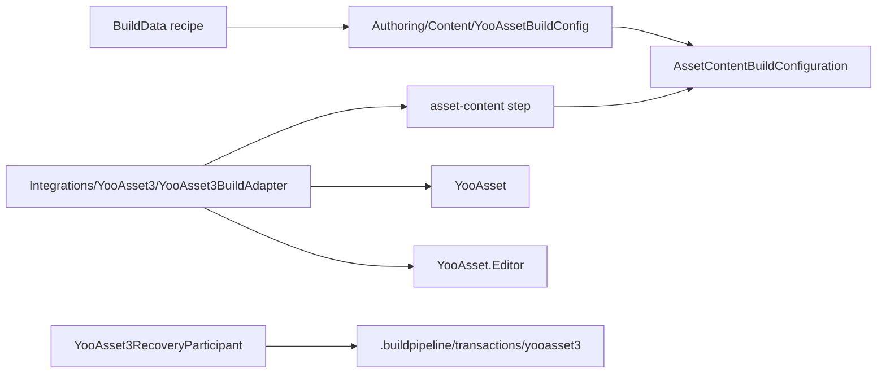
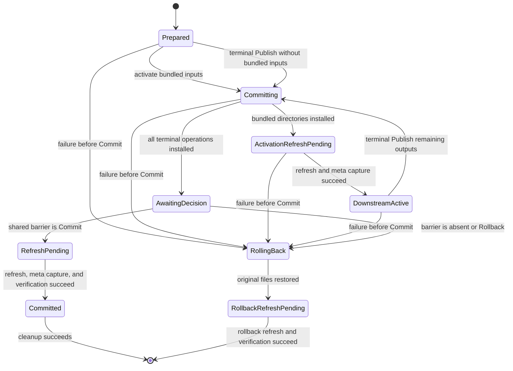

# YooAsset 3 Build Integration

This Editor-only integration connects the provider-neutral `asset-content` step to YooAsset 3.x. It builds one or more explicitly configured packages, validates their artifacts, stages every final directory, activates built-in Player inputs only when downstream steps need them, and joins the run-wide terminal publication decision.

## Dependency and directory boundary

The assembly `Build.Pipeline.Integrations.YooAsset3.Editor` is enabled only when Unity Package Manager resolves `com.tuyoogame.yooasset` in `[3.0.5,4.0.0)`. Its asmdef uses `versionDefines` to produce `BUILD_PIPELINE_HAS_YOOASSET_3` and directly references `YooAsset` and `YooAsset.Editor`. Do not add this symbol manually to PlayerSettings.



The two YooAsset-related directories have distinct responsibilities:

- `Authoring/Content/` contains dependency-free serialized types, validation helpers, and Inspector drawers. A `BuildData` profile can remain readable, movable, and diagnosable without YooAsset installed.
- `Integrations/YooAsset3/` contains the version-gated adapter, strong YooAsset API calls, output transaction, ownership validation, recovery participant, and package-specific tests.

When YooAsset is missing or outside the supported range, the integration assembly is excluded and the core build assembly still compiles. Selecting an enabled `asset-content` row that references `YooAssetBuildConfig` then fails preflight with an unavailable-adapter diagnostic. If recovery evidence already exists, the package-independent workspace facade fails closed until a supported YooAsset version is reinstalled and recovery completes.

## Authoring and recipe usage

Create a `YooAssetBuildConfig` in either of these ways:

1. In a `BuildData` Inspector, select `asset-content` and choose **Create > YooAsset** in its typed Config field.
2. Use `Assets > Create > CycloneGames > Build > YooAsset Build Config`, then drag the asset onto the `asset-content` recipe row.

The configuration asset, not YooAsset Editor window state, is the source of truth. Save it explicitly with the Profile before an interactive build and commit both assets. CI can use the saved reference or override it for the selected step:

```text
-pipelineRecipe yoo-main=asset-content \
-pipelineStepConfig yoo-main=Assets/Settings/Build/YooAssetBuildConfig.asset \
-pipelineStepIncrementality yoo-main=Clean
```

There is no separate provider CLI switch. The concrete `AssetContentBuildConfiguration.ProviderId` selects the adapter, so the step ID, config asset type, and Provider cannot drift independently.

## Configuration

### Root fields

| Field | Contract |
| --- | --- |
| `buildOutputRoot` | Portable project-relative package publication root. Empty resolves to YooAsset's `Bundles` root. |
| `bundledFileRoot` | Portable project-relative built-in content root under `Assets/StreamingAssets`. Empty delegates to the installed YooAsset settings. |
| `packages` | Explicit ordered `YooAssetPackageProfile` array; at least one profile must be enabled. |

The build output and bundled roots must not overlap. Both are normalized and checked for files, unsafe ancestry, path budget violations, and reparse points before publication work begins.

### Package profile

| Field | Behavior |
| --- | --- |
| `enabled` | Includes the package in this content build. |
| `packageName` | Exact name from YooAsset `BundleCollectorSetting`; it is also a portable stable output token. |
| `buildPipeline` | `Scriptable`, `RawFile`, or `ArchiveFile`. |
| `packageNote` | Required deterministic note stored in the manifest. |
| `compression` | `Uncompressed`, `LZMA`, or `LZ4` for the Scriptable pipeline. |
| `fileNameStyle` | Hash, bundle name, or bundle name plus hash. |
| `cryptography` | Optional typed `YooAssetCryptographyConfiguration` asset. `None` is the explicit default and leaves bundles and manifests unencrypted. |
| `bundledCopyOption` | None, clear-and-copy, or additive copy, for all files or selected tags. |
| `bundledCopyTags` | Semicolon-separated tags required by tag-based copy modes. |
| `useAssetDependencyDatabase` | Passes the explicit dependency database policy to YooAsset. |
| `enableSharePackRule` | Passes the explicit bundle sharing policy to YooAsset. |
| `verifyBuildingResult` | Requests YooAsset build-result verification. The adapter still performs its own artifact validation. |
| `versionCollisionPolicy` | `FailIfVersionExists` or guarded `ReplaceExactVersion`. |

When compatible collector settings are available, the custom drawer offers package names from `BundleCollectorSettingData`. The serialized name remains stable for CI. Missing or invalid settings produce a diagnostic without replacing the saved value.

The profile mappings are:

| Profile value | YooAsset parameters | Bundle type |
| --- | --- | --- |
| `Scriptable` | `ScriptableBuildParameters` | `AssetBundle` |
| `RawFile` | `RawFileBuildParameters` | `RawBundle` |
| `ArchiveFile` | `ArchiveFileBuildParameters` | `ArchiveBundle` |

Archive output uses a fixed four-byte alignment. Raw and Archive path hashing remains disabled.

### Cryptography extension

Cryptography is opt-in per package profile. The Inspector exposes only a typed asset reference and an availability diagnostic; it never asks for implementation class names and never reads YooAsset `EditorPrefs`. A concrete configuration derives from `YooAssetCryptographyConfiguration` and returns one stable lowercase Adapter ID. The matching version-gated adapter is registered with `YooAssetCryptographyAdapterRegistration`, binds exactly one concrete configuration type, and implements `IYooAsset3CryptographyAdapter`.

Preflight fails closed when the registration is missing or duplicated, the configuration type differs, an identity is empty or invalid, adapter and registration identities differ, or any official service is missing. A selected adapter must create all three YooAsset 3 services: `IBundleEncryptor`, `IManifestEncryptor`, and `IManifestDecryptor`. The factory explicitly assigns those properties for Scriptable, RawFile, and ArchiveFile parameters. `None` explicitly assigns null services, which is YooAsset's unencrypted behavior.

The adapter registration also declares a stable `runtimeDecryptContractId`. This ID is the deployment contract used by the runtime composition root to select compatible bundle and manifest decryptors. Package plans, transaction journals, and `.yoo-pub.json` preserve the Adapter ID and runtime contract ID; Build-owned evidence never persists configuration payloads, keys, or secret references. YooAsset's native build report records service class names as upstream provenance. Projects should resolve production keys from an auditable secret boundary and ensure adapter exceptions never contain secret values.

## Build and publication lifecycle

The adapter validates the complete multi-package plan before invoking any package build. Every YooAsset pipeline writes to transaction-owned staging. Bundled copy work is also prepared outside the final `StreamingAssets` package directory. The adapter validates expected metadata and seals content identities before returning an `AssetContentBuildOperation` to the core pipeline.

The deferred publication is registered with the runner before downstream activation. This ownership order matters: after registration, the runner is responsible for `Publish`, `Complete`, and `Dispose` on every success and failure path.

If a later `player` step needs built-in content, `ActivateForDownstream` installs only bundled `StreamingAssets` operations and runs `AssetDatabase.Refresh`. Exact-version package output operations remain staged. The Player build therefore sees complete bundled inputs without exposing the terminal package publication early. If the run or Unity-state restoration later fails, both activated bundled inputs and staged package outputs roll back to the exact previous state.

The YooAsset adapter declares an empty `ExclusivePlayerSessionKey` because each invocation owns an independent deferred publication and disjoint output claims are already enforced during preflight. Multiple YooAsset sessions may therefore coexist around one Player build; each one is disposed in reverse dependency order.

After every selected step and all transient state restoration gates succeed:

1. `Publish` installs the remaining sealed exact-version operations, validates all installed directories, and records `AwaitingDecision`.
2. The shared `BuildPublicationBarrier` persists one `Commit` for all Player, content, and hot-update publications in the run.
3. `Complete` requires that durable decision, records `RefreshPending`, refreshes the AssetDatabase, captures newly created sibling `.meta` identities, verifies committed state, and removes transaction-owned backup/work data.
4. The barrier is removed only after every child publication has removed its recovery state.



`AssetDatabase.Refresh` is part of durable publication and rollback semantics. A refresh failure retains the journal rather than reporting a clean rollback or successful commit.

## Collision and ownership policy

`FailIfVersionExists` is the default. If the exact package version directory exists, validation fails before any package build starts.

`ReplaceExactVersion` may replace only the exact target selected by YooAsset for the current target, package, and version. Historical sibling versions are not transaction targets and remain unchanged. Clean mode never enables YooAsset 3.0.5 `ClearBuildCacheFiles`, because that API can delete the entire package root and all historical versions; the adapter emits a warning and uses its own exact-version transaction instead.

Every sealed stage and installed target contains `.yoo-pub.json`. This checksummed ownership marker records the owner, publication kind, package identity, cryptography Adapter ID, runtime decrypt contract ID, transaction identity, bounded entry count, and deterministic SHA-256 content identity. Generated `.meta` files inside a publication directory are excluded from the content identity so an AssetDatabase refresh does not invalidate otherwise identical package content.

An absent or empty target may be claimed. A non-empty target must contain a valid Build-owned marker and match its recorded content identity. Unknown authored directories, markerless outputs, externally changed installed targets, and ambiguous sibling `.meta` files fail closed and are never recursively deleted.

For bundled package roots, the sibling Unity `.meta` is transaction data:

- the original file identity and GUID are captured;
- a protected copy is written before the directory can temporarily disappear;
- a first publication captures the new meta after refresh;
- rollback restores the exact original bytes or verifies exact absence;
- an external replacement keeps the journal, backup, protected copy, and external file for inspection.

Root locks and the project journal coordinator serialize publications even when two invocations use different package names or roots. Locks are reconstructible coordination files under `Temp/BuildPipeline/YooAsset3Locks`; the durable journal remains the recovery source of truth.

## Journal and crash recovery

The durable state root is `.buildpipeline/transactions/yooasset3`:

```text
.buildpipeline/transactions/yooasset3/
  active.json
  active.json.tmp-<transaction-id>
  work/<transaction-id>/...
```

The journal is checksummed, sequence-numbered, size-bounded, and tied to the exact project root, build root, bundled root, transaction ID, operations, directory identities, sibling meta identities, and phases. A crash during atomic journal replacement may leave an active and a temporary candidate. Recovery validates both, requires one transaction identity, chooses the highest valid sequence, promotes it, and fails closed on equal-sequence disagreement or multiple temporary candidates.

Recovery decisions are derived from both the child journal and the shared publication barrier:

- `Prepared`, `Committing`, `ActivationRefreshPending`, and `DownstreamActive` without a durable commit roll back.
- `AwaitingDecision` rolls back when the barrier is absent or `Rollback`; it advances to committed refresh when the barrier is `Commit`.
- `RefreshPending` and `Committed` require an explicit matching `Commit` and finish refresh or cleanup.
- `RollbackRefreshPending` finishes rollback refresh only when no contradictory commit exists.
- A durable commit paired with a phase that never published terminal outputs is contradictory and fails closed for inspection.

Normal builds never call this recovery logic. Use `Build > Pipeline > Workspace Health`, review the fresh snapshot, and select **Recover**. In CI, run `-pipelineRecoverOnly` as a separate action. Do not manually delete `active.json`, temporary candidates, backup directories, work data, protected metas, or the publication barrier.

If the package has been removed, reinstall a version in `[3.0.5,4.0.0)`, let Unity reload the integration assembly, recover to `Clean`, and only then remove the package again.

## Outputs and result validation

The adapter accepts native success only when the reported output directory matches the validated staged target and expected artifacts exist. It validates the package build report, binary manifest, hash, version file, and at least one produced artifact. When bundled copy is requested, it also validates package metadata plus `BuiltinCatalog.json` and `BuiltinCatalog.bytes`.

Structured results report the final exact-version output root, final bundled package root when used, report path, and only the bounded key artifact set (report, manifest, hash, and version), plus warnings and native failure details. They never copy the complete bundle tree into the run manifest; the publication owner still scans the complete tree and proves it with bounded entry/byte counts and a deterministic content digest. Staging and backup paths are not exposed as successful artifacts.

A failure before durable commit returns a build failure after rollback succeeds. If the shared commit is durable but refresh or cleanup remains incomplete, the failure is reported as `CommittedPublicationRecoveryRequired` and preserves the journal for explicit recovery.

## Persistence

| Data | Location | Lifecycle |
| --- | --- | --- |
| Configuration | Any committed `Assets/.../YooAssetBuildConfig.asset` | Human-authored source of truth; no `EditorPrefs` dependency. |
| Cryptography configuration | Any committed project/package-specific `YooAssetCryptographyConfiguration` asset | Optional typed policy reference. Secret material should remain in the project's secret boundary and is never copied into Build evidence. |
| Collector settings | YooAsset's committed `BundleCollectorSetting` asset | Read for package definitions and tag validation. |
| Package publications | YooAsset target-specific directories below `buildOutputRoot` | Final outputs; exact-version replacement is guarded by `.yoo-pub.json`. |
| Built-in package inputs | Package directories below the configured `Assets/StreamingAssets` root | Downstream Player inputs; sibling `.meta` participates in transactions. |
| Recovery evidence | `.buildpipeline/transactions/yooasset3` | Machine-local durable truth; remove only through successful transaction completion or recovery. |
| Locks | `Temp/BuildPipeline/YooAsset3Locks` | Reconstructible process coordination; ignored with `Temp`. |
| Result evidence | `.buildpipeline/results/<run-id>.json` | Core run manifest suitable for CI archival. |

## Safety budgets

The current adapter bounds untrusted or generated cardinality and I/O: at most 128 configured profiles, 1,024 collector packages, 256 bundled-copy tags, 512 journal operations, 100,000 scanned output-tree entries, four key artifacts per structured package result, and 250,000 transaction/identity entries. Notes, names, tags, paths, journals, markers, sibling metas, tree depth, and copied bytes also have explicit limits. Change these limits only with measured project evidence and corresponding failure-path tests.

## Minimum validation

1. Remove YooAsset and verify the core assembly and package-independent tests compile while the YooAsset integration is excluded.
2. Install a version in `[3.0.5,4.0.0)`, reload assemblies, and run the integration EditMode tests in `Integrations/YooAsset3/Tests`.
3. Validate every supported pipeline kind with one package, then validate a multi-package build.
4. For every selected cryptography adapter, verify missing/duplicate/type-mismatched registration failure, all three service assignments on Scriptable/RawFile/ArchiveFile, and runtime decryption against its recorded contract ID. Also verify `None` produces unencrypted content.
5. Run `Content Only`, `Content + Hot Update`, and a full Player recipe with bundled copy enabled.
6. Verify repeated `FailIfVersionExists` fails before native build and `ReplaceExactVersion` changes only one exact version.
7. Force the second package to fail and verify every prior final output and bundled directory is byte-for-byte restored.
8. Fail after bundled downstream activation, switch active build target, and confirm a new build is blocked until explicit recovery returns `Clean`.
9. Interrupt backup, install, activation refresh, terminal publish, commit refresh, rollback refresh, journal replacement, and cleanup boundaries; verify each phase follows the durable barrier decision.
10. Replace an owned target or sibling `.meta` externally during a pending transaction and verify recovery fails closed without deleting the external data or transaction evidence.
11. Leave a journal, remove YooAsset, verify workspace status is `Blocked`, reinstall the supported package, recover, and only then remove it successfully.
12. Run batch mode and verify validation, native build, rollback, refresh, cleanup, and recovery failures return a non-zero process exit code and a usable result manifest.

Source inspection and C# compilation do not establish Player, IL2CPP, stripping, target-platform, filesystem, or CI-agent behavior. Validate those combinations in the consuming project.
