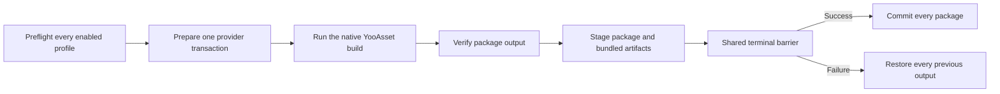

# YooAsset 3 build integration

This integration turns a generic `asset-content` invocation into one transactional YooAsset build containing one or more explicit package profiles. It is an optional Editor adapter, so the Build core compiles without YooAsset.

> **Current checkout:** YooAsset is not installed in `Packages/manifest.json`. The integration source is present, but the gated assembly and its tests are inactive. Everything below describes the source contract and still needs qualification against the installed package before release.

## Before you start

You need three things:

1. `com.tuyoogame.yooasset` installed at a version in `[3.0.6,4.0.0)`.
2. Exactly one valid YooAsset Bundle Collector Settings asset in the project.
3. A BuildData recipe whose package names all exist in the collector catalog.

The adapter does not install YooAsset, create collector settings, pick packages from `EditorPrefs`, or upload build output. Those belong to your product setup and release pipeline.

## How the assembly is gated

`Build.Pipeline.Integrations.YooAsset3.Editor.asmdef` references `Build.Pipeline.Editor`, `YooAsset`, and `YooAsset.Editor`. The assembly only compiles when `com.tuyoogame.yooasset` satisfies `[3.0.6,4.0.0)` and produces `BUILD_PIPELINE_HAS_YOOASSET_3`.

Three consequences follow from that boundary:

- Removing YooAsset does not break the Build core assembly.
- `YooAssetBuildConfig` stays a serializable authoring type, but a recipe that selects it fails at preflight because no adapter is registered.
- Publication recovery lives in a separate assembly, `Build.Pipeline.Integrations.YooAsset3.Publication` (`Integrations/YooAsset3/Publication/`). It has no version gate and no dependency on the YooAsset package, so removing or upgrading YooAsset never makes a persisted journal unreadable.

Never add `BUILD_PIPELINE_HAS_YOOASSET_3` to Player Settings by hand. Package presence and version define the capability.

## Quick start

1. Install and lock a supported `com.tuyoogame.yooasset` version.
2. Create and save exactly one valid Bundle Collector Settings asset. The adapter rejects a collector catalog with more than 1024 packages.
3. Confirm every package used by BuildData exists in the collector catalog.
4. Select a recipe that includes asset content in BuildData.
5. Create a config asset with `CycloneGames/Build/YooAsset Build Config`.
6. Set the roots and package profiles, save both assets, then run preflight.

## The build config asset

`YooAssetBuildConfig` holds one build root, one optional built-in file root, and up to 128 explicit package profiles.

| Field | Contract |
| --- | --- |
| `buildOutputRoot` | Project-relative YooAsset build root. Defaults to `Bundles`. |
| `bundledFileRoot` | Project-relative built-in file root. Empty delegates to YooAsset's StreamingAssets root. |
| `packages` | At least one enabled package profile. |

## Package profile reference

Each `YooAssetPackageProfile` configures one package. Defaults are shown as they ship.

| Field | Values | Default |
| --- | --- | --- |
| `enabled` | Whether this package takes part in the content build | `true` |
| `packageName` | Exact name from the collector settings | `DefaultPackage` |
| `buildPipeline` | `Scriptable`, `RawFile`, `ArchiveFile` | `Scriptable` |
| `packageNote` | Deterministic note stored in the manifest, up to 512 characters | `Generated by Build.Pipeline` |
| `compression` | `Uncompressed`, `LZMA`, `LZ4` | `LZ4` |
| `fileNameStyle` | `HashName`, `BundleName`, `BundleNameAndHash` | `HashName` |
| `cryptography` | Optional typed cryptography asset. Empty leaves bundles and manifests unencrypted | empty |
| `bundledCopyOption` | `None`, `ClearAndCopyAll`, `ClearAndCopyByTags`, `OnlyCopyAll`, `OnlyCopyByTags` | `None` |
| `bundledCopyTags` | Semicolon-separated tags for the tag-based copy modes | empty |
| `useAssetDependencyDatabase` | Use YooAsset's dependency database when the pipeline supports it | `true` |
| `enableSharePackRule` | Enable bundle sharing rules when the pipeline supports it | `true` |
| `verifyBuildingResult` | Verify the produced package before reporting success | `true` |
| `versionCollisionPolicy` | `FailIfVersionExists`, `ReplaceExactVersion` | `FailIfVersionExists` |

Compression applies to the Scriptable pipeline only. `BundleNameAndHash` maps to YooAsset's `EFileNameStyle.BundleName_HashName`.

## Naming rules for packages and versions

Package names and version tokens must be portable across filesystems and CDNs. Both accept 1 to 128 characters, limited to ASCII letters, digits, dots, hyphens, and underscores. Each must start and end with a letter or digit, must not contain consecutive dots, and a package name must not be a Windows reserved device name such as `CON`, `NUL`, `COM1`, or `LPT9`.

Keep notes deterministic. `packageNote` is trimmed before it reaches the manifest, so whitespace-only edits do not change the build identity.

## Build and publication flow


```mermaid
flowchart LR
    P["Preflight every enabled profile"] --> S["Prepare one provider transaction"]
    S --> N["Run the native YooAsset build"]
    N --> V["Verify package output"]
    V --> B["Stage package and bundled artifacts"]
    B --> T["Shared terminal barrier"]
    T -->|"Success"| C["Commit every package"]
    T -->|"Failure"| R["Restore every previous output"]
```

## Output layout

Expected native package output:

```text
<BuildOutputRoot>/<BuildTarget>/<PackageName>/<PackageVersion>/
<BundledFileRoot>/<PackageName>/
```

Every build-owned artifact carries a `.yoo-pub.json` marker recording package and version, transaction and content identity, and the optional cryptography adapter and runtime decrypt contract identity. All enabled profiles share one deferred publication transaction: if any package fails, no package from that invocation is committed.

## Bundled copy modes

| Mode | Built-in publication semantics |
| --- | --- |
| `None` | No built-in package input is offered to a downstream player build |
| `ClearAndCopyAll` | Build a full replacement snapshot |
| `ClearAndCopyByTags` | Build a tag-filtered replacement snapshot |
| `OnlyCopyAll` | Seed from the existing build-owned snapshot, then overwrite all selected files |
| `OnlyCopyByTags` | Seed from the existing build-owned snapshot, then overwrite tag files |

A content invocation opens a temporary player session only when at least one enabled profile uses bundled copy. The session stages package data for players that depend on it and restores the previous built-in state precisely on failure.

Multiple YooAsset invocations are allowed when invocation id, package path, bundled path, and output claim do not overlap. The contract layer permits Addressables and YooAsset to serve one player build together, but this checkout has no real multi-provider player build evidence.

## Clean and incremental

Both incrementality modes keep YooAsset's native build cache. The adapter always passes `ClearBuildCacheFiles = false`, including in Clean mode, because YooAsset couples that flag to deleting the whole package root and every historical version. Exact-version replacement is handled by the guarded collision policy instead.

Clean and Incremental currently use the same native package build parameter shape. Incremental therefore means the pipeline permits provider cache reuse. It does not promise delta-only bundle output, a patch manifest, or a shorter build time. Measure those against your installed YooAsset version and your real collector rules.

`FailIfVersionExists` is the release-safe default. `ReplaceExactVersion` only replaces an exact output that carries valid build ownership evidence. Normal CI should publish a new package version and reserve replacement for controlled retries.

## Encrypting packages

The integration ships no cipher, no key, and no runtime decryptor. A product extension must provide:

1. A typed `YooAssetCryptographyConfiguration` asset.
2. A `YooAssetCryptographyAdapterRegistration` carrying a stable adapter id and runtime contract id.
3. An `IYooAsset3CryptographyAdapter` implementation inside an assembly that can reference YooAsset.
4. Non-null bundle encryptor, manifest encryptor, and manifest decryptor.
5. A player runtime decryptor matching the recorded contract.

The adapter resolves a registration by adapter id and then checks that the configuration asset type matches the type declared by the registration, so a mismatched asset fails loudly instead of silently building with the wrong cipher.

Secret acquisition and rotation belong to your product adapter and CI secret store. Do not serialize secrets into BuildData or the cryptography asset, do not read them from `EditorPrefs`, and do not write them to logs. `.yoo-pub.json` records identity only and does not prove that a runtime decryptor was delivered.

## Running in CI

A normal package publication:

1. Bootstrap the compatible package and collector settings.
2. Use a stable invocation id and a unique package version.
3. Restore the previous built-in snapshot only when an `OnlyCopy...` mode actually needs the old state.
4. Keep `.yoo-pub.json` alongside the restored snapshot.
5. Run content only, player plus content, or full player according to consumer needs.
6. Archive the complete package-version and bundled-package directories together with the pipeline result manifest.

Upload, signing, CDN promotion, retention, and rollback are external release stages.

## Crash recovery

YooAsset transaction evidence lives under:

```text
<UnityProject>/.buildpipeline/transactions/yooasset3/<invocation-id>/
```

After a crash, run explicit recovery through Workspace Health before retrying or switching target. Do not delete the journal. Recovery lives in the ungated Publication assembly, so it stays available after removing or upgrading the YooAsset package.

Artifact relocation during player builds is also crash recoverable. Every move of an ownership marker, backup directory, protected meta, or stage directory out of StreamingAssets is journaled to `.buildpipeline/transactions/yooasset3-relocations/<transactionId>.json`: `Planned` is persisted before the move, `Moved` is written after verification, and `Restored` is written entry by entry. `Conflict` (both sides present or a type mismatch) and `MissingBoth` are terminal and fail closed, blocking the build until a human resolves them. The recovery coordinator restores unfinished relocation journals at Editor startup and deletes a journal only after every entry is restored.

## Troubleshooting

| Problem | Action |
| --- | --- |
| BuildData offers no provider | Install a supported version and let Unity compile the gated integration assembly |
| Existing YooAsset config fails availability | Restore a compatible package, or remove the invocation from the selected recipe |
| Package version already exists | Use a new version, or choose the guarded `ReplaceExactVersion` for build-owned exact output only |
| Built-in `OnlyCopy` refuses to seed | Restore the complete previous owned snapshot including `.yoo-pub.json` |
| Player cannot load or decrypt content | Check the separate runtime provider against the runtime decrypt contract |
| Workspace demands recovery | Recover before changing target, package version, or output root |

Known test gap: one request construction in `Tests/YooAsset3PublicationTransactionTests.cs` does not pass the now-required invocation id. The missing package keeps that test assembly inactive. Do not claim the YooAsset integration tests pass until that call site is fixed and the gated tests compile and run against a supported YooAsset package.

## Limits

| Limit | Value |
| --- | --- |
| Package profiles per config | 128 |
| Collector packages per catalog | 1024 |
| Package note length | 512 |
| Package name and version length | 128 |
| Produced artifact tree entries | 100000 |

## Verification boundaries

Static source inspection and package-independent transaction tests do not prove target player behaviour, runtime loading, cryptography, CDN publication, package upgrade compatibility, IL2CPP, or platform behaviour.

## Related source files

- [Build pipeline base](../../../../README.md)
- `Build.Pipeline.Integrations.YooAsset3.Editor.asmdef`
- `../../Authoring/Content/YooAssetBuildConfig.cs`
- `../../Authoring/Content/YooAssetCryptographyConfiguration.cs`
- `YooAsset3BuildAdapter.cs`
- `YooAsset3BuildPlan.cs`
- `YooAsset3Cryptography.cs`
- `YooAsset3PublicationTransaction.cs`
- `Publication/PublicationRecoveryCoordinator.cs`
- `Publication/PublicationRecovery.cs`
- `Publication/RelocationRecoveryCoordinator.cs`
- `Publication/RelocationJournal.cs`
