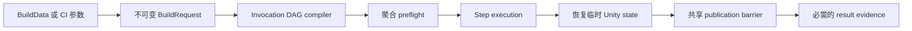

# 可组合构建管线

本模块是项目自有的 Unity Player、热更新与资源内容构建底座。一份已保存的 `BuildData` Profile 会被编译为不可变的 invocation graph；管线在发生任何修改前完成校验，在项目级 lease 下执行，并通过共享的持久化决策统一发布。Inspector、Editor 菜单、TeamCity、Jenkins 和其他 batch-mode runner 使用同一个 composition root。

本模块的目标是可以直接复制到其他项目，只需修改项目标识、场景、输出根目录和 provider 配置。可选 package 被隔离在无依赖 authoring contract、reflection boundary 或 version-gated integration assembly 后，因此缺少某个 provider 不会破坏核心 assembly 编译。

## 架构与目录结构

本文路径均相对于 Unity 项目根目录。

```text
Assets/Build/
  Runtime/Data/                 Player 可安全使用的版本数据（`Build.Data`）
  Editor/VersionControl/       Git 与 Perforce metadata provider
  Editor/BuildPipeline/
    Authoring/                  BuildData、provider-neutral 配置资产、Inspector
      Content/                  Addressables 与 YooAsset 序列化 authoring contract
      Player/                   可选 Player extension 组合与 Inspector
    Core/
      Capabilities/             跨步骤构建能力
      Contracts/               Request、invocation、step、adapter、result
      Discovery/               TypeCache registry 与 plan compiler
      Execution/               CLI、request factory、runner、workspace lease
      Policies/                Identity、path、PlayerSettings、availability
      Recovery/                零写入检查与显式恢复
      Results/                 Provenance、事件日志、结果 manifest
      State/                   ProjectSettings 全树 guard
      Transactions/            Global state、Player output、publication barrier
    EntryPoints/                Interactive 与 batch mode 共用的 composition root
    Integrations/               可选 package adapter 及其 transaction
      Addressables/
      HybridCLR/
      HybridCLRObfuz/
      Obfuz/
      PerformanceTesting/
      YooAsset3/
    Presentation/               Workspace Health 窗口
    Steps/                      内置 hot-update、asset-content、Player command
  Tests/Editor/                 不依赖可选 package 的 EditMode test
  README.md                     英文主文档
  README.SCH.md                 同步的简体中文文档
```

YooAsset 相关的两个位置职责不同，并非重复实现：

- `Authoring/Content/YooAssetBuildConfig.cs` 是不依赖 YooAsset 的序列化 contract。即使 YooAsset 不存在，Profile 仍能读取并给出诊断。
- `Integrations/YooAsset3/` 包含强类型 YooAsset 实现、recovery participant 和 package 专用测试。其 asmdef 仅在 `com.tuyoogame.yooasset` 版本位于 `[3.0.5,4.0.0)` 时启用。

同理，`Steps/` 只保留 provider-neutral orchestration。`Integrations/HybridCLR` 与 `Integrations/HybridCLRObfuz` 自己拥有配置资产、adapter、验证、执行和 Player 兼容策略。`Core/` 不导入 provider 专用 runtime 类型或 provider identifier。



## 核心 Recipe 模型

Recipe 是序列化在稳定 authoring container 中的 invocation DAG；数组本身不是执行顺序。必须明确区分 invocation 与 step type。

| 值 | 含义 |
| --- | --- |
| `InvocationId` | 一份 Recipe 内唯一的执行身份。Dependency、CI override、日志、provider state 与 result record 都引用此值。ID 不区分大小写且必须唯一，最长 64 字符，仅允许小写 ASCII 字母、数字、`.`、`_`、`-`，且首字符必须是字母或数字。 |
| `StepTypeId` | 要实例化的注册实现身份，例如 `asset-content`。只有 registration 声明 `BuildStepMultiplicity.Multiple` 时，同一种 type 才能被多个 invocation 使用。 |
| `Configuration` | 此 invocation 拥有的可选 typed `ScriptableObject`。必需配置必须是 `Assets` 下持久化的 main `.asset` 文件。 |
| `Incrementality` | Invocation 级 `Clean` 或 `Incremental` 策略。同一次运行可以组合不同策略；每个实现负责定义并校验自己的语义。 |
| `Dependencies` | 显式 invocation-to-invocation DAG edge。它们同时决定执行顺序，以及 downstream invocation 可以消费哪些 staged upstream output。 |

内置 Step Type 如下：

| Step Type ID | Multiplicity | Configuration | 职责 |
| --- | --- | --- | --- |
| `hot-update` | Multiple | `HotUpdateBuildConfiguration` | 根据具体 provider adapter 解析 requirements、验证、执行与 Player 兼容策略。 |
| `asset-content` | Multiple | `AssetContentBuildConfiguration` | 根据具体 config asset 解析 adapter，并构建一个 provider session。 |
| `player` | Single | 可选 `PlayerBuildConfiguration` | 在 staging location 中构建 Unity Player，运行显式选中的 Player extension，并且仅在最终决策阶段发布。`None` 表示无扩展 Player。 |

`Required` 与 `IfSelected` dependency mode 有明确语义：

- `Required` 的目标 invocation 未被选择时，plan compilation 失败。
- `IfSelected` 仅在目标被选择时建立 edge，否则忽略。
- 已选择但不适用于当前 request 的 dependency 会报错。
- Self reference、重复 edge、未知 target 与 cycle 都会被拒绝。
- 彼此独立且同时 ready 的 invocation 使用大小写不敏感的 `InvocationId` 顺序作为确定性 tie-breaker；序列化数组顺序不会改变执行。

列表与 Dependencies 不是重复控制。成员关系回答“哪些节点可以运行”；edge 回答“哪个 producer 必须先于 consumer”、producer 是否会被自动纳入，以及 consumer 被允许看见哪些 staged upstream output。Quick Setup 会自动写入标准 edge；通常只有 custom 或 multi-provider graph 才需要手动编辑。

例如，两个内容 invocation 可以用不同 config 复用同一个 `asset-content` 实现：

```text
hot-release   : hot-update
content-base  : asset-content -> IfSelected hot-release
content-dlc   : asset-content -> IfSelected hot-release
player        : player        -> Required hot-release, content-base, content-dlc
```

Player 只消费其传递 dependency closure 中的 content session。所有需要让该 Player 看见 staged built-in data 的 content invocation 都必须显式连接。独立内容 invocation 应使用互不重叠的最终 publication root 或 package scope；独立 invocation journal 可以消除身份冲突，但不会让重叠 destination 变得合法。

Asset-content adapter 可以实现 `IAssetContentBuildOutputClaimProvider`，声明绝对路径形式的 exclusive terminal output root。所有 claim 会在聚合 preflight 中收集；同一 invocation 内或不同 selected invocation 间只要出现 exact match 或 ancestor/descendant overlap，就会在任何 provider build 开始前失败。所有 host 都使用保守的大小写不敏感 claim identity，避免 macOS 默认大小写不敏感 APFS 的 casing alias 绕过 preflight。Addressables 与 YooAsset 已实现此 contract；会发布最终文件的 custom provider 也应实现。

通用 hot-update step 同样支持多个 invocation。每个 invocation 根据 config 派生的 `ProviderId` 解析一个 `IHotUpdateBuildAdapter`，在本次 run 内缓存该有状态 adapter，并将 requirements、验证与执行全部委派给它。使用 process-global vendor tooling 的 provider 必须自行拒绝不受支持的同 run 组合。当前 HybridCLR generation API 只有一个全局 output session，因此 HybridCLR adapter 会明确拒绝多个 HybridCLR invocation。

Compiler 会发现 registration，为每个 invocation 创建新的 `IBuildStep` 实例，校验 multiplicity 与 typed configuration，生成稳定的拓扑顺序，并在打开构建修改窗口前聚合所有适用 invocation 的 `Validate` 结果。

## Build Profile 与设计师工作流

通过 `Assets > Create > CycloneGames > Build > Build Profile` 创建 Profile。Profile 及其引用的每个 config asset 都应提交到版本控制。

### Profile 字段

| 分区 | Contract |
| --- | --- |
| Scenes | 只有在选中 `player` invocation 时才要求 `Launch Scene` 与有序 additional scenes；重复 asset path 会去重。 |
| Version and Output | `Application Version` 使用 `major.minor.patch`；`Output Base Directory` 是可移植的项目相对根目录。 |
| Runtime Version Info | 默认界面只显示事务型、自动清理的 runtime asset。Advanced authoring 只能选择位于精确 `Resources` 目录下的已有 asset 或 folder；CI override 遵守同一校验。 |
| Product Identity | Company、product 与 application identifier 只在 pipeline-owned transactional Unity global-state envelope 中应用，并在运行结束后恢复。 |
| Build Recipe | Quick Setup、标准 output card、typed config、独立 incrementality，以及可选的 Advanced DAG stable ID 与 dependency edge。 |
| Player Options | `CheatBuildMode`。可选 Player integration 通过 Player invocation 的强类型 `PlayerBuildConfiguration` 引用；留空时不要求创建额外资产。 |

通用 Player step 只向其依赖的 hot-update adapter 查询 Player compatibility。当前 HybridCLR adapter 会拒绝 invocation-local `ENABLE_CHEAT`，因为 vendor compilation API 无法保证 define 一致；其他 provider 不会被这条 HybridCLR 专用规则误判。Player extension 与 hot-update provider 是两套独立的强类型扩展边界。

### Inspector UX

BuildData Inspector 使用 Build 自有、可感知 Unity 皮肤的 presentation 模块，不依赖其他 CycloneGames 包。紧凑标题与 **Build Readiness** 卡片只投影既有的 Recipe 分析、配置验证、Workspace、authoring 保存状态和 Unity busy 状态，不建立第二套事实来源。根布局只收回 Inspector host 提供的冗余左侧 gutter；panel 内边距、状态标记、嵌套层级和右侧滚动条安全区都保持不变。语义 badge 始终同时显示 `READY`、`UNSAVED`、`RECOVERY` 或 `BLOCKED` 等文字，颜色只作为辅助信息。普通说明使用紧凑的自动换行文本，只有需要处理的问题才显示明确 diagnostic。

Recipe Preset、Workspace 命令、Saved Recipe 构建与 Focused Build 共用一套等分响应式按钮网格。宽度足够时最多显示三列，窄 Inspector 会自动收缩为两列或一列。窄宽下 Quick Setup 使用较短标签，Tooltip 仍保留完整含义；响应式 label width 会为序列化控件保留可用空间。对象引用行会在字段或 `Create`、`Browse`、`Reset` 操作被挤到不可用之前，把标签移到字段上方；极窄时操作会再独占一行。Primary、Secondary、Selected 与 Accessory action 保持一致的语义角色。可用的 Primary 构建操作使用更明亮、感知 Unity skin 的绿色与白色粗体文字，Unity disabled 状态仍会明显弱化不可用操作。Standard Output 卡片会直接显示 `Included`、`Retained` 或 `Config required`，不再使用 disabled checkbox 冒充状态；完整状态仍保留在 Tooltip 中。Advanced DAG invocation 折叠时只占一行摘要；展开后仍提供完整 identity、configuration、policy 与 dependency 编辑能力。

嵌套 authoring 区域统一使用带框体的 foldout primitive：箭头、标题、可选摘要、状态 badge 与展开内容在所有受支持的 Inspector 宽度下都位于同一 panel 内。`Additional Scenes`、`Advanced Version Info Destination`、`Advanced DAG & CI` 与单条 DAG invocation 因此拥有一致的点击区域和视觉层级。Scene 列表仍由序列化的 reorderable list 编辑，所以添加、删除、重排与 Undo 都会保持开发者编排的 Scene 顺序。

Custom Inspector 对 `BuildData`、`BuildRecipeInvocation` 与 `BuildInvocationDependency` 的每个 Unity 序列化字段拥有显式、fail-closed 的序列化契约。Editor 创建时只执行一次声明 owner 与当前 model 的精确比对，并校验 root `SerializedProperty` binding；测试会强制要求完全覆盖。新增、删除、重复声明或无法绑定的字段都会触发 **Inspector Contract Failure** card，并禁用全部 authoring/build action，直到 presentation contract 同步完成。Inspector 不会退回无结构的 default editor，因此未来字段不会静默消失，也不能绕过既定校验与工作流。

默认 Inspector 提供 Quick Setup，以及 Player、Asset Content、Hot Update 三张 card。可以直接拖入或创建 config；Preset 可在 optional config 尚未创建时先表达构建意图，只有真正 Build 会被明确的 missing-config diagnostic 阻止。`Advanced DAG & CI` 中才显示 registry-backed invocation routing，不需要手写 provider name：

- 新增 row 自动获得唯一 Invocation ID。
- Step Type 从已发现的 registration 中选择。
- Config 只接受 registration 声明的类型。既可以拖入已有 asset，也可以通过 **Create** 选择兼容的 concrete config type，并将新 asset 保存到用户选择的版本控制路径。
- Incrementality 由每个 invocation 独立选择。
- Dependency mode 与 target 从现有 invocation 中选择；已使用 target 和会产生 cycle 的选项不会出现在候选中。
- Advanced row 可以逐项折叠。列表不可拖动，因为 dependency 才是唯一 sequencing contract；只读 compiled execution plan 会显示有效执行顺序。
- 重命名 Invocation ID 时会校验新值，并原子更新所有指向旧 ID 的 dependency reference。
- 删除被引用的 invocation 前必须确认，并在同一次编辑中删除所有 incoming edge。
- 未知 registration、缺少可选 adapter、错误 config type、重复的 single-multiplicity type、缺失 dependency、cycle、不安全路径与未保存 authoring asset 都会禁用构建，并显示具体诊断。

Inspector 不会静默保存整个项目。只有用户显式点击 **Save Build Authoring Assets** 按钮时，才会保存当前 Profile 及其引用的 dirty config asset。Runner 还会记录 config asset GUID/local ID、文件 hash 与传递 dependency hash，从而让 Editor 与 CI 使用可复现的 authoring state。

### Preset 与 Focused Output

Preset 只是 authoring helper，不是另一套 pipeline。

| Preset | 选择的内置 type | 目标输出 |
| --- | --- | --- |
| Player Only | `player` | 不生成内容与热更新的 Player。 |
| Player + Content | `asset-content`、`player` | 生成内容与 Player，但不生成 HybridCLR。 |
| Full Player | `hot-update`、`asset-content`、`player` | 依次生成热更新、内容与 Player。 |
| Content Only | `asset-content` | 不生成 Player 或 HybridCLR 的资源内容。 |
| Content + Hot Update | `hot-update`、`asset-content` | 生成热更新与内容，但不生成 Player。 |
| Hot Update Only | `hot-update` | 仅生成热更新与 AOT metadata。 |

Preset 会尽可能保留可复用的 configuration 与 incrementality，并将无关或 custom entry 保留为 disabled，而不是删除其 authoring data。Preset 识别会比较 canonical invocation identity、type 与完整有效 dependency graph；损坏的 graph 会显示为 Custom，不会仅凭 type sequence 被误标为标准 Preset。

**Run Saved Recipe** 执行 enabled invocation。**Focused Output (Does Not Modify Profile)** 创建仅本次运行有效的不可变选择，不修改 Profile。Hot Update Only、Content Only 与 Content + Hot Update 只在 canonical 或唯一同类型 invocation 明确时可用；存在多个同类型 invocation 时，通过 **Exact Invocation** 选择稳定 ID。Focused execution 会自动纳入传递 `Required` closure，但不会静默加入 `IfSelected` dependency 或全部同类型 invocation。

Content-only 与 hot-update-only 都是一级工作流：它们不要求 launch scene，不创建 Player output transaction，也不创建 `VersionInfoData`。Provider result 与 artifact 仍会写入结果，并遵循同一套 lease、validation、publication、recovery 与 result-evidence 规则。

### Player extensions

Player invocation 接受可选 `PlayerBuildConfiguration`。其有序列表保存 persistent `PlayerBuildExtensionConfiguration` 资产；设计人员可以拖入已有资产，也可以在配置 Inspector 中使用 **Create**。Provider ID 由具体配置资产提供，并且必须精确解析到唯一 `IPlayerBuildExtensionAdapter`。每个 adapter registration 与 runtime instance 还必须提供完全一致的小写稳定 `CompatibilityId`；任何可能影响 output compatibility 的 adapter 行为变化都必须更换该 ID。Adapter 缺失、provider ID 重复、registration 重复、配置类型错误、compatibility ID 非法或不一致、引用资产未保存或 package 前置条件不可用，都会在聚合 preflight 阶段失败。

Extension adapter 验证自己的 durable state，并且可以在 `BuildPlayer` 外围打开可逆 session。Process-global package 行为由 provider 自己的 `IPlayerBuildEnvironmentGuard` 管理，因此 Core 不知道 vendor identifier。添加 `ObfuzPlayerBuildExtensionConfiguration` 即启用 Obfuz Player obfuscation；adapter 要求已保存的 Obfuz Player setting 与选择一致，校验生成的 Encryption VM，并且永远不会改写 `ProjectSettings/Obfuz.asset`。若要构建不使用 Obfuz 的 Player，应同时移除 extension 并禁用 durable Obfuz setting。它与控制热更新 DLL 处理的 `HybridCLRObfuzBuildConfig` 相互独立。

Recipe provenance 会记录 Player configuration 及其 transitive asset dependency hash。独立的 SHA-256 Player-extension fingerprint 会通过唯一 registry entry 解析每个已配置 provider，并把有序 provider ID、实际 adapter `CompatibilityId` 与 config asset identity 绑定到 Player incremental output compatibility。严格 fingerprint 在成功解析后只会在 run context 中捕获一次，之后由 Player execution、result writing 与 terminal confirmation 复用；第二个不同值会 fail closed，不会替换 snapshot。每个 extension asset 的读取/hash 上限为 64 MiB，全部 extension asset 的总上限为 256 MiB，单个 Player 最多选择 64 个 extension。Adapter compatibility、配置、顺序、成员或 asset identity 发生变化后，必须执行 Clean Player build。

### Player Incrementality

Player `Clean` 与 `Incremental` 是单个 Player invocation 的 output/cache reuse policy，不是内容热更新或 patch delivery 模式。`Clean` 从空的 transaction stage 开始，并增加 `BuildOptions.CleanBuildCache`。它可以发布到不存在或为空的 output；也可以替换当前 format-1 Build ownership marker 与完整 tree identity 均有效的 output，即使上一份 compatibility identity 不同。成功 publication 会在 `<OutputDirectory>.buildpipeline-player-owner.json` 写入新的 sibling marker；任何非当前格式的 marker 都会被拒绝。

`Incremental` 要求在创建任何 active journal 或 stage 之前，published output 与 marker 已存在。Marker checksum、完整 output-tree identity、内嵌 format-1 compatibility identity 及其 SHA-256 compatibility digest 必须有效。Compatibility identity 必须与 owner-local Player pipeline compatibility revision、`Application.unityVersion`、`BuildTarget`、`NamedBuildTarget.TargetName`、`ScriptingBackend`、相对 output artifact path（output path 就是目录时使用 output-directory leaf）、`OutputIsFolder`、company、product、application identifier、Android export、Development/debug、debug-file deletion、Cheat 与 Player-extension provenance fingerprint 完全相同。Format version 与 pipeline compatibility revision 相互独立：`formatVersion` 描述该 owner 的 JSON contract，正整数 revision 用于在 Player pipeline 发生行为不兼容变化后禁止复用。系统会把已验证的 published tree 复制到 owned staging，不使用 `CleanBuildCache`，并在 publication 前立即再次校验 compatibility。任何缺失、损坏、变化或不受支持的值都会 fail closed，并要求操作者运行 `Clean`。

Player recovery journal 使用 `formatVersion: 1`，并记录 original/new compatibility identity。Rollback 会恢复 original owner identity；已 commit 的 recovery 会保留 new identity。需要 Player `Incremental` 的 CI 必须一起归档和恢复 Player output directory 与 sibling ownership marker；绝不能伪造或编辑 marker。

所有由 Build 拥有的 JSON 文件均使用 owner-local 的整数 `formatVersion: 1` 契约。Reader 只接受当前格式，并验证该文档 owner 所要求的全部不变量；未知版本会被直接拒绝，不会被重新解释。采用这套全新设计后，应使用空的 publication root，或者先把先前 output 移走再运行 `Clean`；不要把先前的 ownership marker 或 baseline 复制到新 pipeline workspace。

## 可选 Provider 与 Incrementality

### Addressables

`AddressablesBuildConfig` 通过其 concrete `ProviderId` 选择 Addressables，不存在另一份手写 provider field。Adapter 使用窄 reflection boundary，因此即使 Addressables 缺失，核心 assembly 仍能编译；当选中的 package API 缺失或不兼容时，preflight 会失败。

- `Clean` 会清理已配置 active builder 的 cache，临时设置请求的 content version，并调用官方 `AddressableAssetSettings.BuildPlayerContent` 流程。
- `Publication Root` 为空时，会按 invocation 隔离为 `Build/AddressablesContent/<InvocationId>/<BuildTarget>`，因此多个独立 Addressables invocation 默认不会冲突。显式 root 会按配置原样使用；互相重叠的显式 root 会在 output-claim preflight 阶段被拒绝。
- `Incremental` 使用官方 Content Update 流程。它要求启用 **Build Remote Catalog** 与 publication，并要求唯一、显式的上一版 `addressables_content_state.bin` baseline。设计师可拖入已导入到 `Assets` 下的 baseline；CI 可以将其恢复到可移植的项目相对路径。Baseline 必须仍位于前一次 pipeline publication 中，该 publication root 的 `AddressablesArtifacts.json` 会证明 target、active profile、remote-catalog location、player/editor identity、size 与 SHA-256。Adapter 会 snapshot 已校验文件，并调用 `ContentUpdateScript.BuildContentUpdate(AddressableAssetSettings, string)`。
- 缺失、被修改、格式错误、target/profile/load-path 不匹配或没有 ownership evidence 的 baseline 都会 fail closed。每次成功的 Incremental build，以及官方 API 返回 content-state file 的 Clean build，都会在 `BuildMetadata` 中发布该 state，供后续更新使用。没有返回该文件的 Clean result 可以发布内容，但不能作为 Content Update 的起点。
- Incremental Addressables output 不能作为 Player build 输入。它必须作为 content-only 运行；要建立新的 Player/content baseline，应使用启用 remote catalog/state generation 的 Clean。
- Addressables adapter 会声明稳定、process-global 的 `ExclusivePlayerSessionKey`。通用 Player preflight 会按该 key 对 dependency closure 中的所有 content session 分组；两个 invocation 声明同一 key 时会 fail closed，核心管线不包含 Addressables provider-name 特判。
- 已发布 target 包含 `PlayerData`、可选 `RemoteContent`、可选 `BuildMetadata`、已配置的 additional root，以及 publication root 的 `AddressablesArtifacts.json`。Provider publication/recovery journal 按 invocation 隔离在 `.buildpipeline/transactions/addressables/<InvocationId>`；临时共享 settings restoration 在单一 workspace lease 下单独记录于 `.buildpipeline/transactions/addressables-settings`。
- Addressables integration 会注册 `IPlayerBuildEnvironmentGuard`。仅当 Addressables 已安装但不在 Player dependency closure 中时，它才抑制 package 官方 hook；package 缺失时不执行任何操作；选中的 Addressables adapter 已拥有 content session 时，guard 同样保持 no-op。通用 Player step 只负责校验、开启并反向恢复已发现的 guards。

Addressables settings 及其引用的 group/schema asset 在运行前必须已保存。临时 settings 修改会按字节 snapshot、恢复，并受到持久化 recovery evidence 保护。

### YooAsset 3

YooAsset adapter assembly 只在 `Integrations/YooAsset3` 中使用 `versionDefines` 与 direct reference。受支持 package 缺失时，integration assembly 会自然消失，而 `Build.Pipeline.Editor` 与已保存的 `YooAssetBuildConfig` 仍可编译。不要在 PlayerSettings 中手动定义其 capability symbol。

一份 config 显式拥有 output root 与一个或多个 package profile。每个 profile 选择 package name、Scriptable/RawFile/ArchiveFile pipeline、compression、naming、bundled-copy policy、verification 与 exact-version collision policy。构建会在修改最终路径前完成 staging。默认使用 `FailIfVersionExists`；`ReplaceExactVersion` 只允许替换 Build-owned 的准确 target。Clean mode 会刻意避开 YooAsset 会广泛删除历史 cache 的 API。

Downstream Player 需要的 built-in package 会在 Player execution 前可逆激活；精确版本 package publication 在最终决策前仍保持 staged。Ownership marker、有上限的 content identity、sibling `.meta` protection，以及 `.buildpipeline/transactions/yooasset3/<InvocationId>` 下的 invocation 级 state，使 rollback 与 recovery 具有确定性。Provider 细节见 `Editor/BuildPipeline/Integrations/YooAsset3/README.SCH.md`。

### HybridCLR 与 Obfuz

`hot-update` 本身是 provider-neutral。标准 DLL 选择 `HybridCLRBuildConfig`；明确需要 HybridCLR + Obfuz 时选择 `HybridCLRObfuzBuildConfig`。系统不存在序列化 obfuscation 开关，也不存在手写 provider ID。两者都要求 IL2CPP。Clean 执行完整 HybridCLR generation。标准 HybridCLR 的 Incremental 只编译 hot DLL，并从已校验的 release baseline 获取全部 AOT metadata DLL；它绝不会信任当前 stripped-AOT scratch directory。

Inspector 仅在 HybridCLR Editor 前置能力存在时显示标准 provider。组合 provider 必须同时具备 HybridCLR、Obfuz 与 Obfuz4HybridCLR 三组 Editor 能力；不完整安装会保持不可选并在 authoring validation 阶段失败，不会等 Unity 状态已经改变后才在构建中突然报错。

只有同时满足下列条件才发布 HybridCLR release baseline：

1. hot-update invocation 为 `Clean`；
2. request 是 Release，而非 Development；
3. 一个已选择的 Player invocation 直接依赖该 hot-update invocation；
4. 共享 terminal publication decision 成功提交。

Baseline 存储位置为：

```text
<BuildRoot>/.buildpipeline/baselines/hybridclr/
  <BuildTarget>/<ScriptingBackend>/<release-key>/
    baseline.json
    AOT/*.dll
```

Release key 由 application identifier、application version 与 hot-update Invocation ID 派生。Manifest 绑定 target、backend、Unity 与 HybridCLR identity、authoring/configuration hash、Player AOT compatibility settings、assembly inventory、source provenance，以及每个 DLL 的 length 与 SHA-256。Clean hot-update-only 或 Development build 不会创建 baseline。应将 baseline 与已发布 Player 一起归档；后续 incremental hot-update-only CI job 启动前，将匹配 baseline 恢复到相同 Build Root。

明确的 `HybridCLRObfuzBuildConfig` provider 会拒绝 Incremental，因为当前 Obfuz4HybridCLR boundary 读取隐式 stripped-AOT directory，而不能接收显式、已校验的 baseline；其 Clean 模式仍受支持。完整 baseline contract 见 `Editor/BuildPipeline/Integrations/HybridCLR/README.SCH.md`。

## 执行、Publication 与 Recovery

Runner 按以下顺序执行：

1. 获取 `Temp/BuildPipeline/Workspace/lease.lock` 上的项目级 OS file lease。该文件上的 byte-range OS lock 是唯一权威状态，获取操作 fail-fast。持有 lease 期间，`Temp/BuildPipeline/Workspace/lease.json` 提供人类可读的诊断 metadata；该 metadata 可能过期，绝不能用于证明 ownership。
2. 要求 Editor idle，并要求零写入 workspace inspection 返回 `Clean`。
3. Snapshot 整个 `ProjectSettings/` tree，校验 request path 与 identity，捕获 Recipe provenance，解析 version identity，编译 invocation DAG，并运行全部适用 preflight。
4. 只打开声明过的 state envelope。Content-only step 不会获得 PlayerSettings、Player output 或 `VersionInfoData` 权限。
5. 按拓扑顺序执行 invocation。Output 留在 owned staging；只有显式注册的 downstream input 可以提前激活，而且必须保持可逆。
6. 恢复临时 `VersionInfoData`、PlayerSettings、Editor build settings、可选 preloaded asset 与其他 scoped state，并在 publication 前再次校验整个 `ProjectSettings/` tree。
7. Seal execution context，冻结 manifest 的公共 payload，并使用与最终写入完全相同的 `JsonUtility` 与 strict UTF-8 路径序列化最坏情况的失败终态 envelope。64 MiB capacity gate 通过之前，不允许任何 deferred publication 执行 publish。
8. 发布全部 deferred output，持久化一个共享 `Commit` decision，完成 child transaction；仅在所有 child recovery evidence 清除后移除 barrier。
9. 在 workspace lease 仍被持有时，从冻结 snapshot 持久化必需的 result manifest。最终 writer 不会重新读取可变 context，也不会重新计算 Player-extension fingerprint。Runner 释放 lease 并返回后，entry point 会立即严格校验完整 manifest contract、关闭 evidence log，并且仅在 terminal evidence 确认后删除 started marker。

在持久化 commit 之前发生任何 failure，都会按反向顺序 dispose publication 并 rollback。Seal 后，任何可能改变 result evidence 或 publication membership 的 context mutation 都会被拒绝。Commit 之后不再允许 rollback：如果 refresh 或 cleanup 未完成，会保留 journal，由显式 recovery 完成已提交状态。Output replacement 会经过 path containment、ownership marker、checksum、reparse-point rejection、有上限 inventory 与 write-ahead journal 保护；未知数据会被保留并阻止操作。

### 临时 VersionInfo 生命周期

`VersionInfoData` 只在 Player build 需要时存在，并且必须位于精确 `Resources` 目录下，确保进入 Player 且可由 runtime 发现。如果配置的 asset 已存在，其 bytes 与 metadata 会被恢复。如果 parent path 不存在，transaction 会创建所需 `Assets` folder 与 folder `.meta`、写入 asset，然后在 success 或可处理 failure 后只删除自己创建的 folder 与 meta。进程突然终止时会保留 write-ahead journal；下一次构建前由 Workspace Recovery 使用同一 ownership check 恢复。生成目录一旦出现未知文件或 `.meta` 被修改，就会被保留并报告，而不会递归删除。因此，默认 `Assets/Build/Runtime/Resources/VersionInfoData.asset` path 不会在原本不存在该目录的项目中残留额外 `Resources` folder。

### Workspace Health

`BuildWorkspaceService.Inspect` 不会写入或恢复任何内容。

| Status | 含义 | 后续操作 |
| --- | --- | --- |
| `Clean` | 没有需要处理的 transaction evidence。 | 可以开始普通构建。 |
| `RecoveryRequired` | 有效 evidence 存在明确恢复路径。 | 检查后显式运行 recovery。 |
| `Blocked` | Evidence 格式错误、不安全、互相矛盾、无人认领，或其可选 integration 不可用。 | 保留 evidence，并解决报告的原因。 |
| `Busy` | `lease.lock` 上的权威 OS lock 或其他 Unity operation 正在进行；`lease.json` 仅供诊断。 | 等待 owner 完成；不要删除任一 lease file 来绕过 ownership。 |

使用 `Build > Pipeline > Workspace Health`。Recovery 要求使用最新 optimistic snapshot token，因此 journal 发生变化后必须重新检查。系统不提供 force-delete 操作。

构建失败后，只有 Workspace Health 为 `Clean` 才能安全切换平台并继续构建。完整 rollback 会移除 journal，之后可以执行新 target；若仍有 evidence，任何 target 都会在修改发生前被阻止。Recovery 使用中断任务记录的 target、root、identity 与 durable decision，而不会采用新选择的 Profile；当 participant 要求特定 target 时，窗口会显示 required target。如果 pending evidence 属于已移除的可选 package，应先重装该 package，恢复到 `Clean`，再移除 package。

## Result Evidence 与可观测性

所有 interactive 与 batch entry point 都会在 command-line parsing 或 Profile loading 之前创建 evidence：

```text
.buildpipeline/results/<run-id>.started.json
.buildpipeline/results/<run-id>.log
.buildpipeline/results/<run-id>.json
```

Started marker 会在进程异常终止时保留，只有 terminal evidence 被持久化确认后才删除。Parsing、Profile、request 或 recovery 早期失败会得到包含 stage 与 process exit code 的 partial `formatVersion: 1` terminal manifest。它的独立确认会校验 operation、run ID、stage、outcome、exit-code consistency、`partial=true`、log path、UTC timestamp 顺序与 success/failure contract。完整构建会得到 full format-1 manifest，其中包括 detected/effective source identity、identity origin、CI provenance、target/settings、Recipe Invocation ID 与 Step Type ID、dependency mode、每 invocation incrementality、config provenance 与 hash、Player pipeline compatibility revision、绑定 adapter 的 Player-extension fingerprint、step timing/status、provider result、artifact、warning 与 failure details。如果非法 extension authoring 导致无法解析唯一 adapter，evidence 会使用由 failure category 与有界基础配置 identity 派生的确定性 `invalid:<sha256>` marker；Player output ownership 永远不会接受该 marker，同时独立 failure field 会保留原始 preflight diagnostic。Full confirmation 要求 `formatVersion: 1`、`operation=build`、预期 run ID 与内存中的 success outcome、`partial=false`、当前 Unity 与 Player pipeline compatibility identity 完全匹配、有效且有序的 UTC timestamp、每个必需 scalar 与 identity object、所有顶层 array，以及有效的 nested dependency、artifact 与 warning record。

较短的 failure、non-fatal failure、Recipe validation 与 step message 文本会逐字保留。非法 UTF-16 或超过单值 diagnostic budget 的文本会转为包含 SHA-256 digest 的确定性有界 marker；共享 run budget 也可以用相同方式摘要后续 diagnostic value。Provider-owned content evidence 永远不会静默截断：result 构造会拒绝超过 4,096 个 artifact、1,024 个 warning、单字段超过 256 KiB UTF-8 或单 result 超过 1 MiB UTF-8 的结果。单次 content operation 最多返回 1,024 个 package result；整个 run 最多接受 4,096 个 content result、131,072 个 content evidence value 与 8 MiB provider text。Writer 与 strict confirmation 共用同一个 evidence policy。

Publication 前 gate 只证明冻结 payload 加上最大规格的规范化终态 failure 不超过 64 MiB manifest 上限。Gate 不写文件，也无法让后续 storage I/O 与已经 commit 的 artifact 形成原子事务。最终 create-new temporary-file、write-through、move 过程中若发生磁盘满、权限变化、文件占用或设备故障，仍会阻止 confirmation 并返回 exit code `2`；已提交 output 的权威状态仍由 recovery journal 与 publication barrier 决定。

Terminal manifest 与 event log 都是必需产物。非终态 event callback 抛出的 evidence I/O failure 会立即中止后续 build execution，绝不会降级写入 `nonFatalFailures`。Terminal event write 或 log-close failure 无法 rollback 已经 commit 的 publication，但会阻止 confirmation 并返回 evidence exit code `2`。如果 canonical manifest 已存在但违反 contract，系统会保留而不是覆盖它；started marker 也会保留以供诊断。重试前必须检查 log、output、marker 与 transaction evidence。

Batch-mode exit code 稳定如下：

| Code | 含义 |
| --- | --- |
| `0` | 请求的 build 或 recovery 已完成，且 terminal evidence 已确认。 |
| `1` | Validation、build、publication 或 recovery 失败。 |
| `2` | 无法建立、写入、关闭或校验必需的 result evidence。 |
| `3` | Build workspace lease 已被占用。 |

Result file 是诊断历史，不是 recovery truth。CI 应归档它们；recovery 只读取已注册的持久化 transaction evidence 与 publication barrier。

Manifest 契约会记录 provider 声明的 artifact path，但目前并不对每个已发布 Player 或 content tree 提供统一的 byte-level attestation。Player publication 会在 sibling owner marker 中保存 SHA-256 tree identity；Addressables、YooAsset 与 HybridCLR publication 则分别维护 provider manifest 或 release baseline。Release job 必须把这些 ownership record 与 output 一起归档，并在上传前生成或校验最终 archive inventory；仅有 path 存在不能作为 supply-chain signature。

## Command Line 与 CI

统一使用以下 entry point：

```text
-executeMethod Build.Pipeline.Editor.BuildEntryPoints.RunCommandLine
```

构建必须提供 `-buildTarget`，可选值为 `Win64`、`OSXUniversal`、`Linux64`、`Android`、`iOS` 或 `WebGL`。Provider execution 前，Unity 必须已经完成切换到该 active target；pipeline 不会在 transaction 中同步切换 target。

### Recipe 参数

以下五个 invocation 级参数可重复，并通过稳定的 Invocation ID 定位：

| 参数 | 语法 | 作用 |
| --- | --- | --- |
| `-pipelineSelect` | `<invocation>` | 从显式 `-pipelineProfile` 中选择一个 root，不修改资产；可重复指定多个 root。本次运行还会纳入其传递 `Required` closure；`IfSelected` 永远不会自动增加节点。 |
| `-pipelineRecipe` | `<invocation>=<step-type>` | 向显式 CI Recipe 增加一个 invocation。只要提供任意一项，本次运行就会替换 Profile 中已保存的 enabled selection。 |
| `-pipelineStepConfig` | `<invocation>=Assets/.../Config.asset` | 为已选择 invocation 指定 persistent main config asset。 |
| `-pipelineStepIncrementality` | `<invocation>=Clean\|Incremental` | 覆盖该 invocation 的策略。 |
| `-pipelineStepDependency` | `<owner>=Required\|IfSelected:<dependency>` | 增加 edge。只要为某个 owner 指定 dependency 项，就会替换该 owner 已保存的 dependency list。 |

`-pipelineSelect` 要求显式提供 `-pipelineProfile`，会保留所选 Profile invocation 的 typed config、policy 与完整 dependency 声明，并且与 `-pipelineRecipe` 互斥。未知或重复 selection 会 fail closed。Keyed override 可以指向显式选择的 root 或自动纳入的 `Required` dependency；任何落在有效 selection 之外的 override 都会被拒绝。

显式 CI Recipe 中每个 invocation 初始都没有 config、没有 dependency，并使用 `Clean`；必须显式传入所需 override。如果既没有提供 `-pipelineSelect`，也没有提供 `-pipelineRecipe`，则使用 Profile 中 enabled invocation 及其 config、policy 与 dependency，同时允许 keyed override 替换已选择的值。

正常 CI 应传入 `-pipelineProfile Assets/.../BuildData.asset`，把 graph 保存在受版本控制的 Profile 中；Inspector 复制的也是这种短参数。展开式 Recipe 参数属于 advanced replacement interface，不是序列化格式。不要把允许的 256-node/4,096-edge 大图展开为 process argument；操作系统与 CI launcher 的 command-length 上限远小于 pipeline graph budget。

例如，以下 focused run 会构建 `content-dlc` 及且仅其传递 `Required` dependency，同时保留 Profile 中的全部 authoring：

```text
-pipelineProfile Assets/Settings/Build/Release.asset -pipelineSelect content-dlc
```

### 其他参数

| 参数 | Contract |
| --- | --- |
| `-pipelineProfile Assets/.../BuildData.asset` | 选择 Profile。只有项目内恰好存在一个 `BuildData` 时才可以省略。 |
| `-pipelineScriptingBackend Mono2x\|IL2CPP` | 覆盖本次运行的 target backend。 |
| `-pipelineOutput <path>` | 覆盖 Player output path。 |
| `-pipelineOutputRoot <project-relative-dir>` | 覆盖 Profile Build Root。 |
| `-pipelineVersion <major.minor.patch>` | 覆盖 application version。 |
| `-pipelineVersionInfo Assets/.../Resources/.../VersionInfoData.asset` | 覆盖临时 Player version asset path；必须包含精确 `Resources` segment 与固定文件名。 |
| `-pipelineDevelopment` | 创建 Development request。 |
| `-pipelineExportAndroidProject` | 导出 Android Gradle project；仅适用于 Android 且必须包含 Player invocation。 |
| `-pipelineEnableCheat` / `-pipelineDisableCheat` | 互斥的 Player Cheat override。 |
| `-pipelineAllowExternalOutput` | 在完成 path safety check 后，允许显式 Player output 位于常规项目自有 root 外。 |
| `-pipelineBuildNumber <1..Int32.MaxValue>` | 显式 native/content build number。 |
| `-pipelineSourceProvider`、`-pipelineSourceRevision`、`-pipelineSourceBranch` | 完整 source identity group；必须三个一起提供或全部省略。 |
| `-pipelineCiProvider`、`-pipelineCiRunId` | CI provenance group；必须两个一起提供或全部省略。 |
| `-pipelineRecoverOnly` | 作为独立 action 执行显式 workspace recovery；只能与可选的 Unity 原生 `-buildTarget` 组合，其他 pipeline build 参数都会被拒绝。 |

Pipeline 不会从 environment variable 猜测 CI identity。应在 TeamCity/Jenkins job definition 中将变量映射为显式参数。本地 VCS metadata 可用时，显式 provider/revision 必须与其一致。Batch 与 Release build 要求可靠的本地 VCS metadata，或者完整的显式 source identity 加 build number。只有 interactive Development build 可以回退到明确标记的 local-development identity。传给 provider 的有效 package version 为 `<ApplicationVersion>.<BuildNumber>`；未显式覆盖时，可靠 VCS commit count 会提供最小为 `1` 的 build number。仍需遵守 native 限制，其中 Android version code 上限为 `2100000000`。

### Advanced 显式 CI Recipe 示例

此示例假设受支持的 HybridCLR 与 YooAsset integration 已安装、引用的三份 config asset 已存在并保存、target switch 能在执行前完成，而且所有 placeholder 均由 CI job 替换。它会请求一个 hot-update build、两个独立 content build 与一个 Player。

```text
Unity.exe -batchmode -quit -projectPath <UnityProject> \
  -executeMethod Build.Pipeline.Editor.BuildEntryPoints.RunCommandLine \
  -buildTarget Win64 \
  -pipelineProfile Assets/UnityStarter/Editor/Build/BuildData.asset \
  -pipelineScriptingBackend IL2CPP \
  -pipelineRecipe hot-release=hot-update \
  -pipelineRecipe content-base=asset-content \
  -pipelineRecipe content-dlc=asset-content \
  -pipelineRecipe player=player \
  -pipelineStepConfig hot-release=Assets/Settings/Build/HybridCLRBuildConfig.asset \
  -pipelineStepConfig content-base=Assets/Settings/Build/YooAssetBaseBuildConfig.asset \
  -pipelineStepConfig content-dlc=Assets/Settings/Build/YooAssetDlcBuildConfig.asset \
  -pipelineStepIncrementality hot-release=Clean \
  -pipelineStepIncrementality content-base=Clean \
  -pipelineStepIncrementality content-dlc=Clean \
  -pipelineStepDependency content-base=IfSelected:hot-release \
  -pipelineStepDependency content-dlc=IfSelected:hot-release \
  -pipelineStepDependency player=Required:hot-release \
  -pipelineStepDependency player=Required:content-base \
  -pipelineStepDependency player=Required:content-dlc \
  -pipelineBuildNumber 4201 \
  -pipelineSourceProvider git \
  -pipelineSourceRevision <full-revision> \
  -pipelineSourceBranch refs/heads/release \
  -pipelineCiProvider TeamCity \
  -pipelineCiRunId 4201
```

Content-only CI 通常应针对已保存 Profile 使用 `-pipelineSelect <content-invocation>`。Advanced 显式替换方案则省略 `player`。官方 Addressables Content Update 使用一个 incremental `asset-content` invocation，其 config baseline asset/path 应指向 Unity 启动前已恢复的 artifact。

Recovery 示例：

```text
Unity.exe -batchmode -quit -projectPath <UnityProject> \
  -executeMethod Build.Pipeline.Editor.BuildEntryPoints.RunCommandLine \
  -pipelineRecoverOnly
```

仅当 Workspace Health 报告 pending recovery evidence 要求特定 target 时，才增加 `-buildTarget <target>`；否则省略。

## 持久化与 Ownership

| 数据 | 位置 | Owner 与生命周期 | 版本控制 / 清理方式 |
| --- | --- | --- | --- |
| Build Profile 与 config | `Assets/**/*.asset` | 人工 authoring 的 source of truth；显式保存。 | 提交。 |
| 临时 `VersionInfoData` | 配置的 `Assets/.../VersionInfoData.asset` | 仅为 Player build 创建/替换，随后精确恢复；transaction 创建的空 folder/meta 会被移除。 | 不提交临时输出；中断后使用 recovery。 |
| Result evidence | `.buildpipeline/results/<run-id>.*` | 每次运行的 started marker、event log 与 format-1 terminal manifest；不是 recovery truth。 | 本地通常 ignore，CI 中归档。 |
| Recovery journal | `.buildpipeline/transactions/<owner>/...` | Global state、publication barrier、Player、provider 与 integration 的持久化 write-ahead truth。 | Ignore；只允许由成功 completion/recovery 清理。 |
| Workspace 权威锁 | `Temp/BuildPipeline/Workspace/lease.lock` | 持有的 byte-range OS lock 是 workspace ownership 的唯一权威状态。 | Ignore；绝不能删除或替换该文件来绕过 `Busy`。 |
| Workspace lease 诊断 | `Temp/BuildPipeline/Workspace/lease.json` | 获取权威锁后写入的人类可读 `formatVersion`、`runId`、`operation`、`pid` 与 `startedUtc`；它可能在释放后继续存在，也可能过期，绝不是 ownership evidence。 | Ignore；下次成功获取 lease 时会覆盖，绝不能据此推断 workspace 空闲。 |
| Provider lock 与 scratch | 指定 provider cache lock 及其他 `Temp/BuildPipeline/...` path | 可重建的 coordination 与临时 snapshot。 | Ignore；仅在没有 active owner 且 owning integration 允许时清理。 |
| Player/content output | Profile/provider publication root | Build-owned 最终 artifact，受 staging、identity marker 与 collision policy 保护。 | 使用项目 release retention policy。 |
| Player incremental owner | `<OutputDirectory>.buildpipeline-player-owner.json` | Format-1 owner/checksum/tree identity，加上包含 Unity version、owner-local Player pipeline compatibility revision、绑定 adapter 的 Player-extension fingerprint 与 SHA-256 digest 的 format-1 compatibility identity；以 transaction 方式与 Player output 一起发布和恢复。 | Incremental 时与 output 一起归档/恢复；绝不能伪造、编辑或拆离。 |
| Addressables Content Update baseline | 前一次 publication 的 `BuildMetadata/.../addressables_content_state.bin` 与该 publication root 的 `AddressablesArtifacts.json` | 下一次 incremental update 的持久化 release input。 | 整体归档/恢复；不得拆离或伪造。 |
| HybridCLR release baseline | `<BuildRoot>/.buildpipeline/baselines/hybridclr/...` | 兼容 incremental hot-update build 的持久化 AOT input。 | 与已发布 Player 一起归档；删除后必须重新生成才能继续 incremental。 |

关键构建配置不会存入 `EditorPrefs`、`SessionState` 或 PlayerSettings scripting define symbol。Cache file 可以重建；journal 与 release baseline 不是 cache。

Unity Performance Testing 3.5.x 是被隔离的第三方例外：该 package 的构建回调使用其自有 `EditorPrefs` cleanup switch。Integration 会在持久事务保护下快照、临时接管、校验并精确恢复这一外部开关，但绝不会把它当作 Build 配置事实来源。Package 缺失或超出已审计 API 范围时，guard 会保持不活动或在修改前 fail closed。

## 扩展模型

当能力拥有独立 validation/execution boundary 时，才增加 step。Dependency edge 应保留在 Recipe 中，使同一个实现可以被不同产品用不同方式组合。

```csharp
[CreateAssetMenu(menuName = "CycloneGames/Build/Sign Artifact Config")]
public sealed class SignArtifactConfig : ScriptableObject
{
    public string keyAlias;
}

[BuildStepRegistration(
    "sign-artifact",
    DisplayName = "Sign Artifact",
    Category = "Release",
    ConfigurationType = typeof(SignArtifactConfig),
    ConfigurationRequired = true,
    Multiplicity = BuildStepMultiplicity.Multiple)]
public sealed class SignArtifactStep : IBuildStep
{
    public string StepTypeId => "sign-artifact";

    public bool IsApplicable(
        BuildExecutionContext context,
        BuildStepInvocation invocation) => true;

    public IReadOnlyList<string> Validate(
        BuildExecutionContext context,
        BuildStepInvocation invocation)
    {
        SignArtifactConfig config = invocation.GetConfiguration<SignArtifactConfig>();
        return config == null || string.IsNullOrWhiteSpace(config.keyAlias)
            ? new[] { "A signing key alias is required." }
            : Array.Empty<string>();
    }

    public void Execute(
        BuildExecutionContext context,
        BuildStepInvocation invocation)
    {
        SignArtifactConfig config = invocation.GetRequiredConfiguration<SignArtifactConfig>();
        // Stage output. If it becomes terminal state, register an
        // IBuildDeferredPublication with context before returning.
    }
}
```

生产级扩展规则：

- 可发现 step 必须是 public、non-abstract、parameterless type，并且只有一个 registration；runtime `StepTypeId` 必须与 registration 一致，且该 ID 必须全局唯一。重复 ID 会 fail closed 并列出全部冲突实现类型；registration 顺序永远不会选出 winner。
- 只有确实需要某种 state envelope 时才实现 `IBuildStepRequirementsProvider`。Content-only utility 不应请求 Player state。
- `Validate` 应返回全部确定性 preflight error，不得在其中启动外部工具或修改 asset。
- 可选第三方代码必须放入窄 adapter 或 integration asmdef；不要让 optional type 出现在 core public contract 中。
- 最终 filesystem mutation 实现 `IBuildDeferredPublication`；若该可逆 input 必须被 downstream invocation 使用，则还要实现 `IBuildDownstreamInputPublication`。
- 持久化 transaction 必须注册 `IBuildRecoveryParticipant`。Recovery ID 必须全局唯一；`Priority` 只对不同 ID 的 participant 排序，绝不选择覆盖实现。Recovery 在修改数据前必须校验 path、identity、checksum、cardinality 与 publication decision。
- 新 content provider 应用无依赖 config 继承 `AssetContentBuildConfiguration`，由该 concrete config type 拥有稳定 provider ID，声明 `AssetContentProviderAuthoringAttribute`，并在其 integration boundary 注册 `IAssetContentBuildAdapter`。Core 不枚举 vendor ID。Provider ID 必须全局唯一；重复 adapter 会 fail closed，不会互相覆盖。
- 存在最终 filesystem output 的 content provider 还应实现 `IAssetContentBuildOutputClaimProvider`；返回每个 exclusive absolute output root，使跨 invocation collision 在 preflight 阶段失败。
- 需要临时 Player state 的 content provider 应实现 `IAssetContentPlayerBuildSessionFactory`。只有不同 invocation 的 session 确实可以并存时才返回空 `ExclusivePlayerSessionKey`；否则必须返回稳定、由 provider 拥有的 identifier。同一 Player dependency closure 中重复的非空 key 会在 preflight 失败。
- Package-wide Player hook 应由 integration-owned `IPlayerBuildEnvironmentGuard` 管理。Guard ID 必须全局唯一，guard 不通过 priority 相互覆盖；即使 Player build 或其他 cleanup 失败，每个已开启 guard 仍会按反向顺序 dispose。
- Player extension adapter 必须注册稳定的小写 `CompatibilityId`，并在 runtime 返回完全一致的值。任何可能改变所生成 Player compatibility 的 adapter 行为变化都必须递增该 ID；provider 重复、ID 非法或 registration/runtime 不一致都会在 Player output staging 之前 fail closed。
- 新 hot-update provider 应让无依赖 config 继承 `HotUpdateBuildConfiguration`，声明 `HotUpdateProviderAuthoringAttribute`，并注册唯一的 `IHotUpdateBuildAdapter`。Provider ID 与 configuration type 会和 registration metadata 交叉验证；缺失、重复或不匹配都会 fail closed。Provider 专用 Player 约束实现 `IHotUpdatePlayerBuildValidator`，不要给 `PlayerBuildStep` 增加 vendor 分支。
- 可观测性使用 `IBuildEventSink`；event sink 不拥有 orchestration 或 durable output。

## Safety Budget 与大规模项目

Pipeline 面向大型 Recipe 设计，但仍刻意设置边界。当前核心限制包括 256 个 invocation、4,096 条 dependency edge、4,096 个 exclusive output claim、512 个 deferred publication 与 1,024 个 Player scene。Result evidence 还会把单次 content operation 限制为 1,024 个 result，把整个 run 限制为 4,096 个 content result、131,072 个 content value 与 8 MiB provider UTF-8 text，并把最终 manifest 限制为 64 MiB。Config provenance、result log、journal、ProjectSettings snapshot、directory depth、entry count、file size、total bytes、path length、exception traversal 与 provider artifact 也都有显式 budget。Inspector 会在 materialize 或绘制 graph 之前检查 recipe 节点/边预算；超预算或损坏的 asset 只会显示显式、支持 Undo 的重置操作，不会分配无边界 UI 状态。

超过 budget 会触发 validation 或 recovery error，绝不会获得截断 output 或删除未知文件的许可。只有在拥有实际项目测量、path/collision review、fault-injection test 与 CI artifact/storage capacity 证据后才应提高限制。超大型游戏应优先使用多个 ownership root 互不重叠的显式 content invocation，以及可独立归档的 release baseline，而不是一个无边界 transaction。

Runner 会刻意串行执行 Unity DAG。`AssetDatabase`、PlayerSettings、provider settings、Player hook 与 publication decision 具有 process-global 或 main-thread affinity；用 `Task.WhenAll` 包裹独立节点只会用未经测量的 contention 交换确定性与 rollback safety。Unity、SBP、shader compilation、Burst、IL2CPP、compression 与 vendor tool 可以使用自身 worker。平台/Profile matrix 应在独立 CI checkout、Library、Unity process 与 output root 上横向并行；workspace lease 会有意拒绝同一个 checkout 的并发 mutation。每个 provenance checkpoint 内会按 GUID/local file ID 缓存共享 config asset，避免多个 invocation 重复扫描同一 dependency graph；Runner 会在适用 step 之前和 terminal publication 之前刻意执行新的 checkpoint，以检测构建期间发生的配置变化。

## 验证与发布准入

验证应分层执行，并为每个 target 记录 `Passed`、`Failed` 或 `Not run`。仅阅读源码或完成 C# compile，不能证明 Player、IL2CPP、AOT、stripping、filesystem 或 CI-agent 行为正确。

1. 在可选 package 全部缺失时，编译 `Build.Data`、`Build.VersionControl.Editor`、`Build.Pipeline.Editor` 与 `Build.Pipeline.Tests.Editor`，并运行 package-independent EditMode suite。
2. 分别独立安装每个受支持可选 package，执行 reload/reimport，编译其 integration assembly 并运行 focused EditMode test；再次移除后确认 core 仍可编译。
3. 覆盖 duplicate ID、missing/optional dependency、cycle rejection、serialized-order invariance、multi-content ordering、exact/ancestor/case-alias output-claim overlap、graph-aware preset recognition、Editor/CLI 带 Required closure 的 focused selection、CLI full-recipe replacement 与 config path validation。
4. 对每种受支持 target/backend，按适用情况运行 Player Only、Player + Content、Full Player、Content Only、Content + Hot Update 与 Hot Update Only。分别准入 Release、Development、Android export 与 external-output policy。
5. 对 Player incrementality，先发布 Clean output，归档/恢复它的 sibling owner marker，再运行 Incremental。依次破坏 marker checksum、tree identity、compatibility digest、`formatVersion`、pipeline compatibility revision、Unity version、adapter `CompatibilityId` provenance 与其余每个 compatibility field；确认系统在创建 stage 前 fail closed，并验证 rollback/committed recovery 会保留正确的 original/new identity。
6. Addressables 必须准入 Clean Player content，以及从前一次 published state 恢复的官方 content-only Incremental update；逐项破坏 identity field/file hash 并确认 fail-closed，同时验证一个 Player 会拒绝 dependency closure 中的第二个 Addressables invocation。
7. YooAsset 必须准入每种 enabled pipeline kind、multi-package failure rollback、built-in Player activation、exact-version collision policy 与 missing-package recovery。
8. HybridCLR 必须发布 Clean Release Player baseline，在干净 CI workspace 中恢复，再运行 incremental hot-update-only，并确认 target/backend/Unity/config/hash mismatch 被拒绝。
9. 在 result-capacity gate 的精确临界值与超限值分别测试；确认超限时不写 manifest 或 temporary file，且不会调用任何 child `Publish`。在 durable commit 后注入超长 Unicode/control-character failure，确认带 SHA-256 marker 的有界 evidence 仍可写入并通过校验。还应在 refresh、manifest/event-log I/O、strict terminal confirmation 与 cleanup 阶段注入 failure。重启 Unity、切换所选平台，确认普通 build 仍被阻止，再恢复至 `Clean`。
10. 并发发起 build/recovery，确认其中一个收到 exit code `3`；构造 malformed evidence，确认返回安全的 `Blocked` 且不删除数据。
11. 在 TeamCity/Jenkins 中归档 `.buildpipeline/results`、release output 与 Player owner marker、Addressables state 及 HybridCLR baseline，并从干净 agent checkout 验证 exit code 与 artifact path。

常见排查顺序是：保存 authoring asset，等待 Unity 完成 compile/import 与 target switch，打开 Workspace Health，检查本次 run 的 log/manifest，确认可选 package 可用性，并确认多个 invocation 没有意外共享同一个最终 output root。
