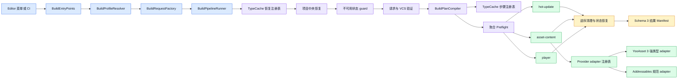

# 可组合构建管线

本模块是项目自有的 Unity 内容与 Player 可复现构建入口。它将 `BuildData` Profile 转换为只读调用请求，恢复每个已注册的项目中央事务，验证请求与版本快照，再把请求的步骤标识编译为依赖安全的计划，执行构建，恢复临时 Unity 状态，并写出机器可读的结果 Manifest。

Unity Editor 和 batch mode 使用同一套编排。`Build.Pipeline.Editor.BuildEntryPoints` 是唯一受支持的编排入口。Provider builder 和 integration adapter 属于实现细节，不是独立的构建工作流。

## 架构



主要契约如下：

- `BuildData`：显式、可评审的项目构建 Profile。
- `BuildRequest`：只读调用描述，包含目标、输出策略、功能开关、所选步骤以及显式 Profile/配置引用。
- `IBuildStep`：包含适用性、依赖、preflight、执行和清理的 Command 契约。
- `BuildPlanCompiler`：负责注册表查找、依赖验证、稳定拓扑排序和聚合 preflight。
- `IBuildRecoveryParticipant`：只依赖项目根目录的恢复契约；其发现独立于当前请求、所选 Provider、功能适用性和配置资产。
- `IAssetContentBuildAdapter`：与 Provider 无关的内容构建边界。
- `IAssetContentPlayerBuildSessionFactory`：用于验证、开启和恢复仅 Player 构建所需状态的可选 Provider hook。
- `IBuildEventSink`：Observer 边界；默认 sink 向 Unity Console 输出结构化消息。
- `BuildPipelineRunner`：生命周期所有者和结果生产者。

核心 Editor assembly 只引用 `Build.Data` 和 `Build.VersionControl.Editor`。可选包 API 被隔离在反射边界或版本门控的 integration assembly 中，因此移除可选包不会使核心构建 assembly 无法编译。但移除操作仍必须尊重持久状态：YooAsset integration 不可用而其项目中央事务目录仍含恢复证据时，核心 guard 会 fail closed，并要求操作人员重新安装受支持的 YooAsset 3 package、完成恢复后再移除。

Adapter 发现结果会在每个 `BuildExecutionContext` 中只快照一次，包括 adapter 不可用或解析失败。内容验证、内容执行与 Player hook 因而共享同一个 adapter 实例，不会在同一次 run 中观察到不同的注册表状态。

### 源码目录

模块根目录先按照 assembly 边界分离 Runtime 数据、Editor 服务、构建编排和测试：

```text
Assets/Build/
  Runtime/Data/          Player 可安全使用的版本数据（`Build.Data`）
  Editor/VersionControl/ 确定性的 VCS metadata adapter（`Build.VersionControl.Editor`）
  Editor/BuildPipeline/  Authoring 与构建编排（`Build.Pipeline.Editor`）
  Tests/Editor/          不依赖可选 package 的 EditMode 回归测试
  README.md              规范英文模块指南
  README.SCH.md          同步的简体中文指南
```

`Editor/BuildPipeline` 再按职责组织，而不是按偶然的构建顺序组织：

```text
Editor/BuildPipeline/
  Authoring/       构建 Profile、Provider 配置和自定义 Inspector
    Content/       不引用可选 package API 的 Addressables/YooAsset 配置资产
    HotUpdate/     HybridCLR 配置资产
  Core/
    Capabilities/  Cheat 等可选能力策略
    Contracts/     Provider-neutral 请求、步骤、注册与结果
    Discovery/     TypeCache 注册表和反射缓存
    Execution/     请求创建、命令行解析、Profile 解析与 runner
    Policies/      身份和路径安全策略
    Transactions/ 项目中央恢复与核心状态事务
  Steps/           内置 hot-update、asset-content 和 Player command
  Integrations/    Addressables、HybridCLR、Obfuz 和 YooAsset3 窄适配器
  EntryPoints/     唯一 Editor/CI composition root
```

`Authoring` 保存与 package 解耦的构建意图，并可通过无依赖 metadata 或只读反射提供设计师工具；`Steps` 编排该意图；`Integrations` 是唯一执行可选 package API 或持有 package 强引用的层。package 专用测试保留在对应的版本门控 integration 内，不依赖可选 package 的回归测试统一位于 `Tests/Editor`。每个目录名只有一种架构含义，不再存在第二套顶层 YooAsset、HybridCLR、Obfuz 或 Pipeline 实现。

## 快速开始

1. 通过 `Assets > Create > CycloneGames > Build > Build Profile` 创建 Profile。
2. 显式设置 company name、product name、application identifier、application version 前缀和项目相对输出根目录。前三个身份字段刻意不提供模板默认值，为空时 preflight 会失败。
3. 当 recipe 构建 Player 时，指定启动场景和其他场景。Content-only 与 Hot-update-only recipe 不要求启动场景。
4. 配置可选能力。需要外部内容构建时，选择 Provider，并指定或创建类型受约束的配置资产；启用 HybridCLR 时，指定 `HybridCLRBuildConfig`，并完成下文所述的包准备工作。
5. 在 **Build Recipe** 中应用 `Player + Dependencies`、`Content + Dependencies` 或 `Hot Update Only`。只有需要 Custom recipe 时才直接编辑 registry 驱动的步骤列表。
6. 检查 **Current Recipe**、**Expected Outputs**、不活动步骤和可复制的 CI override。存在 authoring 错误时，运行操作会在构建开始前被禁用。
7. 直接通过 **Run This Recipe** 运行当前显示的 Profile，或者选中 `BuildData` 资产后使用 `Build > Pipeline > Run Selected Recipe`。

Preset 是 Editor 命令，而不是序列化状态。应用 preset 只替换有序 `pipelineSteps` 数组，并支持 Unity Undo。保存后的稳定 ID 仍是 Inspector、菜单命令、`BuildRequest` 和 CI 的唯一事实源。

| Inspector preset | 保存的步骤 | 结果 |
| --- | --- | --- |
| `Player + Dependencies` | `hot-update`、`asset-content`、`player` | 构建 Player；HybridCLR 和内容步骤只在对应能力已配置时执行。 |
| `Content + Dependencies` | `hot-update`、`asset-content` | 构建内容包而不构建 Player。启用 HybridCLR 时先构建其必需 DLL 输出；否则跳过 `hot-update`。 |
| `Hot Update Only` | `hot-update` | 构建 HybridCLR 热更新与 AOT metadata 输出，不构建内容包或 Player。 |
| Custom | 任意已注册的有序 ID | 保持 package 与项目扩展可组合；权威依赖校验仍由管线 preflight 完成。 |

指定 Provider 与配置引用后，Content preset 才可用；Inspector 会在启用 Run 操作前校验配置类型匹配以及 adapter 可用性。启用 HybridCLR 并指定其配置后，Hot Update preset 才可用。这样可以防止一键 recipe 在没有任何适用产物时仍报告成功。

常用 Editor 命令如下：

| 菜单 | 行为 |
| --- | --- |
| `Build/Pipeline/Print Selected Profile` | 解析活动 Profile，并输出有效身份信息、场景、步骤、功能开关和 Provider adapter 可用性。 |
| `Build/Pipeline/Run Selected Recipe/Release (Clean)` | 针对活动目标，以 clean release 方式执行所选 Profile recipe。 |
| `Build/Pipeline/Run Selected Recipe/Release (Incremental)` | 以增量 release 方式执行所选 Profile recipe。 |
| `Build/Pipeline/Run Selected Recipe/Development (Clean)` | 以启用调试和 Profiler 连接的 clean development 方式执行所选 Profile recipe。 |
| `Build/Pipeline/Run Selected Recipe/Development (Incremental)` | 以增量 development 方式执行所选 Profile recipe。 |
| `Build/Pipeline/Android/Export Player Gradle Project` | 执行 clean Android Gradle Player 导出；所选 recipe 必须包含 `player`。 |

Inspector 按钮始终运行该 Inspector 正在显示的准确 Profile；即使 Inspector 已锁定且当前选中了其他资产也不会改变。执行前只保存该 Profile，并把运行延迟到当前 IMGUI 事件结束后。菜单命令仍解析所选 Profile，两条路径共用同一个 `BuildRequestFactory` 和 `BuildPipelineRunner`。因此 Content-only 是可见 preset 和一键工作流，而不是第二套 Provider 专用编排入口。CI 可以使用相同的已保存 recipe，也可以通过 `-pipelineSteps` 覆盖。

## 构建 Profile

`BuildData` 是项目构建意图的唯一事实源。将 Profile 存放在 `Assets/` 下，并与它引用的配置资产一起提交。

| 字段 | 契约 |
| --- | --- |
| Launch Scene | Player 构建中的第一个场景。recipe 包含 `player` 时必须解析到现有 `.unity` 资产；Content-only 与 Hot-update-only recipe 不要求它。 |
| Additional Scenes | 按数组顺序追加；重复场景路径会被移除。 |
| Application Version | 可移植文件名片段与版本前缀。规范 package version 为 `<prefix>.<commit-count>`。 |
| Output Base Path | 必填的 Unity 项目根目录下可移植项目相对目录，例如 `Build`。 |
| Company Name | 必填且没有模板默认值；仅在构建事务期间应用到 `PlayerSettings`。 |
| Product Name | 必填且没有模板默认值的可移植文件名；以事务方式应用，并用于默认产物名称。 |
| Application Identifier | 必填且没有模板默认值；构建期间应用到请求的 `NamedBuildTarget`。 |
| Version Info Destination | 拖入现有 `VersionInfoData` 资产或 `Assets/` 文件夹，也可以使用 Browse。Inspector 会推导并显示确定性的 `VersionInfoData.asset` 路径；CI 可用 `-pipelineVersionInfo` 覆盖。缺失父文件夹只在构建事务期间创建并由事务持有。 |
| Build Recipe | 由 registry 驱动且可重排的步骤列表，提供安全 preset、有效产物摘要、不活动步骤诊断和可复制 CI override。序列化契约仍只有有序 ID 列表。空计划、重复项、未知项、缺失依赖、无产物计划和循环依赖都会失败。 |
| Use HybridCLR | 使 `hot-update` 适用，并成为内容步骤和 Player 步骤的必需依赖。 |
| Enable Player Obfuscation | 独立于热更新 DLL 混淆，声明所需的基础 Obfuz Player 管线状态。安装 Obfuz 时，该值必须已经与保存的 Obfuz 项目设置一致。 |
| Cheat Build Mode | `Disabled`、仅 development 或启用。`ENABLE_CHEAT` 通过 `BuildPlayerOptions.extraScriptingDefines` 传入；不会修改 PlayerSettings 全局 defines。 |
| Asset Content Provider | 由 registry 驱动的 Provider 选择。`None` 关闭外部内容构建。规范 ID 为小写 `yooasset` 和 `addressables`；自定义 ID 不需要核心 enum。Inspector 会以只读方式显示供 CI 使用的 ID。 |
| Asset Content Configuration | 由所选 Provider authoring descriptor 约束类型的对象引用。它会原样传给所选 adapter，并且必须与 Provider 同时设置。 |
| HybridCLR Config | HybridCLR 已启用且 recipe 包含 `hot-update` 时所需的显式配置引用。 |

Profile 选择是确定性的：

- 在 Editor 中，选中的 `BuildData` 资产优先。没有选择时，项目中必须恰好只有一个 Profile。
- 在 batch mode 中，`-pipelineProfile Assets/<path>/<profile>.asset` 选择 Profile。未传入时，项目中必须恰好只有一个 Profile。
- Profile 路径必须是 `Assets/` 下的项目相对 `.asset` 路径；根路径和遍历片段会被拒绝。

版本控制元数据 Provider 通过 `IVersionControlProviderDetector` 发现。内置优先级先选择 Git workspace，再选择 Perforce 环境变量；最高优先级相同时会失败，而不会不确定地选取。`Capture()` 返回一份已验证快照：Git 读取 hash、count、branch 和 date 期间会确认 `HEAD` 未变化，并在变化时重试一次；Perforce 会验证最新 submitted changelist 以及 Stream/Client identity。Batch mode 和 release 构建必须获得受支持且一致的元数据，否则失败，绝不会发布 fallback version。只有交互式 Development 构建可以使用显式 `LocalDevelopment` fallback。完整内容与 Player 版本为 `<ApplicationVersion>.<CommitCount>`。

## 管线语义

内置步骤如下：

| 步骤 ID | 适用条件 | 动态依赖 | 职责 |
| --- | --- | --- | --- |
| `hot-update` | 启用 `UseHybridCLR` | 无 | 执行完整或 fast HybridCLR 生成、可选热更新混淆、复制生成的 DLL 数据，并验证必需输出。 |
| `asset-content` | Content-provider ID 非空 | HybridCLR 启用时依赖 `hot-update` | 解析唯一 Provider adapter，验证并构建所有已配置 package，记录结构化内容结果。 |
| `player` | 始终 | 已启用的 `hot-update` 和/或 `asset-content` | 清理或准备专用 Player 输出，验证场景和可选功能，调用 Unity `BuildPipeline.BuildPlayer`，并验证报告。 |

步骤通过 Unity `TypeCache` 发现，并在构造前先比较注册 attribute：每个请求 ID 只实例化唯一最高 `Priority` 类型，因此被覆盖的低优先级插件不会通过 constructor 破坏胜出实现。两个类型具有相同最高优先级时会报错。每个步骤的适用性只求值一次并存入已编译计划，因此后续步骤不能通过修改共享 context 改变另一项是否执行。依赖依据同一适用性快照计算，每个必需步骤都必须已选择且适用；稳定拓扑排序会在不受依赖约束时保留配置顺序。

每个入口都会先解析 authoring 输入，并在执行前只创建一次不可变 `BuildRequest`。Cheat 有效状态、Provider binding、路径、target、incrementality 和步骤 ID 因此只解析一次，供 preflight 与全部步骤复用；执行阶段不会重新读取可变 `BuildData` 字段。

恢复 participant 同样通过 `TypeCache` 发现，按 ID 确定性排序，并在构造前按唯一最高 priority 解析。内置 participant 负责恢复 Unity 全局状态、HybridCLR 输出、Player 发布和 Addressables settings/publication；版本门控的 YooAsset assembly 会贡献自身 participant。所有 participant 都在请求验证、版本控制捕获、功能适用性、adapter 解析和计划编译之前运行，因此关闭功能、修改 Profile、移除 Provider 选择或当前请求无效都不能隐藏中断事务。

任何构建步骤运行前，所有适用步骤必须完成 preflight。执行在首次失败时停止。每个已经开始执行的步骤都按逆序收到 `Cleanup`，包括执行失败的情况。清理和状态恢复失败会与原始失败合并，不会被隐藏。

默认 `ConsoleBuildEventSink` 报告 run 开始、步骤开始/结束、耗时、状态、输出和结果路径。通过代码集成时，可向 `BuildPipelineRunner` 注入其他 `IBuildEventSink`，无需修改步骤实现。Observer callback 与编排隔离：`RunStarted`、`StepStarted`、`StepFinished` 或 `RunFinished` 抛出的异常会被捕获为 observer failure，绝不会改变步骤执行或 run 的成功状态。

## 可选集成

**YooAsset 3**

强类型 adapter 位于 `Editor/BuildPipeline/Integrations/YooAsset3`。其 asmdef 使用 UPM package ID `com.tuyoogame.yooasset` 和版本表达式 `[3.0.5,4.0.0)`。只有版本满足范围时才编译该 assembly，并直接引用 `YooAsset` 和 `YooAsset.Editor`。

`YooAssetBuildConfig` 只包含 Provider 构建意图：

- `buildOutputRoot`：项目相对 package 输出根目录；为空时解析为 `Bundles`。
- `bundledFileRoot`：`Assets/StreamingAssets` 下的项目相对内置内容根目录；为空时使用 YooAsset 配置的 StreamingAssets 根目录。
- `packages`：显式 package Profile，包含启用状态、package name、YooAsset pipeline、说明、压缩方式、文件命名方式、内置复制策略/标签、依赖数据库、bundle 共享、结果验证和精确版本冲突策略。

安装兼容的 YooAsset collector settings 后，package 字段会显示从 collector 配置读取的下拉列表。序列化内容仍是稳定 package name，以保证 CI 确定性。Collector settings 不可用时，authoring 仍可编译，并保留当前值用于诊断，不会静默替换。

Package name 必须存在于 YooAsset collector settings 中。可移植路径组件会按不区分大小写检查碰撞，并同时受字符数与 240-byte UTF-8 预算约束；输出根和内置根不能重叠，也不能穿过重定向路径。全部 package 和 bundled snapshot 都先进入 staging 并完成验证，再由带持久 journal 的目录交换事务统一发布。`FailIfVersionExists` 保护已存在的精确版本；`ReplaceExactVersion` 只备份并替换受保护的精确版本目录，失败时按逆序回滚。Clean 管线请求不会设置 YooAsset `ClearBuildCacheFiles`，因为 YooAsset 3.0.5 可能移除 package 根目录下的全部历史版本。只有整组发布提交成功后才会产生成功结果。

YooAsset 不存在或版本不在支持范围内时，integration assembly 会被排除，核心仍可编译。没有遗留 recovery state 时，选择 YooAsset 会在 preflight 因没有可用 adapter 而失败；存在遗留 state 时，不依赖 YooAsset 的 guard 会更早失败并保留证据，直至重新安装 integration 且恢复成功。

**Addressables**

Addressables 通过 `AddressablesBuilder.Build(target, version, config, clean)` 使用唯一的规范内容路径。它的 package API 边界基于反射，因此 Addressables 不存在时核心仍可编译；选择 Addressables 但缺少所需且受支持的 Editor API 时，preflight 会失败。

Adapter 会：

- 要求 Addressables settings 和配置资产都已保存；
- 在临时设置变更前快照每个受影响配置资产及其 `.meta`，包括精确字节、长度、SHA-256 identity、时间戳和 attributes；
- 在设置 `BuildRemoteCatalog` 和 `OverridePlayerVersion` 前建立持久 settings 事务，并在内容发布允许提交前恢复两个反射属性以及精确的持久文件；
- clean 请求通过活动 data builder 重写的 `ClearCachedData` 执行真实清理；
- 使用规范完整版本向 `Addressables.BuildPath` 写入 `AddressablesVersion.json`；
- 默认可将当前 build registry 以事务方式发布到 `Build/AddressablesContent/<BuildTarget>`；
- 发布 `PlayerData`、可用的 `RemoteContent`、build metadata 和显式批准的附加根目录，然后写出 `AddressablesArtifacts.json`；
- 使用 staging 发布、校验每个注册文件及其 SHA-256 identity、切换目标，并在切换失败时恢复先前发布内容。

Addressables settings 和发布共享项目级 `Library/BuildPipeline/Addressables/build.lock`。无条件运行的 `AddressablesRecoveryCoordinator` 会先恢复 `<project>/.buildpipeline/transactions/addressables-settings/active.json`，再恢复 `<project>/.buildpipeline/transactions/addressables/active.json`，且发生在当前请求或 Provider 验证之前。Settings journal 通过 `transaction.owner` 持有 transaction 目录，保存有上限的 asset/`.meta` snapshot，并只在该受管目录内使用固定的 `NNNN.restore.tmp`/`.bak` scratch 执行原子恢复，不会在 authored asset 旁遗留随机 scratch。缺失、外来、损坏、重定向或 identity 冲突的 journal、owner、snapshot 与 scratch 状态都会 fail closed，并保留现场供检查。

带 checksum 且大小受限的发布 journal 会记录精确发布根，并在每次目录移动前后持久化状态，因此即使配置的输出根在崩溃后改变，恢复仍能找到旧事务。它的原子 journal candidate 使用固定名称 `active.json.tmp` 和 `active.json.bak`，且 recovery 会在提升或移除前进行验证。提交前中断的事务会恢复精确的旧发布；已持久提交的事务会保留新发布并完成清理。损坏 journal、游离 stage/backup、重定向路径、identity 变化和歧义状态全部 fail-closed，并保留现场供检查。每个 stage 在复制文件前都会获得 transaction-specific ownership marker；任何未验证的非空 stage 都不会被递归删除。

所有非空目标都必须由本管线通过 `.buildpipeline-owner.json` 和精确的 `AddressablesArtifacts.json` 文件/hash 清单证明 ownership；空目标可以被认领。旧版或人工填充的非空目标不会自动迁移：应先备份并移走或清空一次，再由成功构建立下 ownership。清理失败始终属于构建失败，也不会覆盖或丢弃发布主异常。

在 Player 步骤中，与 Provider 无关的 Player-build hook 会开启作用域 processor：临时选择 `DoNotBuildWithPlayer`，验证 Provider 自有 build data 中的规范版本产物，再让 Addressables 官方 Player processor 将数据映射到 `StreamingAssets/aa`。该 hook 会持有同一个项目锁，并使用同一套持久 settings 事务，因此结束或中断后都会精确恢复原始反射属性以及每个捕获的配置 asset/`.meta`。除非配置显式启用，否则外部 Profile 发布源会被拒绝；URI、受保护路径、顶层路径、重叠路径和重定向路径始终无效。

**HybridCLR 与 Obfuz**

HybridCLR package 类型通过窄反射边界解析。启用 HybridCLR 需要：

- 已指定 `HybridCLRBuildConfig`；
- 已安装并初始化、且提供所需 Editor command 的 HybridCLR package；
- 至少一个热更新 assembly，并且也配置在 `HybridCLR Settings > Hot Update Assembly Definitions`；
- `Assets/` 下彼此不同、互不重叠的项目相对热更新 DLL 和 AOT DLL 输出目录。

完整请求执行 HybridCLR prebuild 生成。`-pipelineIncremental` 只编译 DLL 并复用现有 stripped-AOT 输入；assembly、签名、泛型或 AOT 依赖变化后必须执行完整构建。步骤会验证每个已配置的 `.dll.bytes`、`HotUpdate.bytes` 与 `AOT.bytes`，全部通过后才能成功。HybridCLR 发布只有两种 role：热更新 assembly 与 AOT metadata assembly。

每个 HybridCLR 输出目录都是平坦结构、由 Build 独占的发布单元。ownership manifest schema `2` 会记录 owner、role、发布 transaction ID，并为每个产物及目录内 Unity `.meta` 记录 kind、精确相对路径、字节长度和 SHA-256 hash；journal 还会记录 manifest identity 以及完整受管目录树的确定性 hash。每次移动或删除前都会立即复验这些 identity，因此外部替换会 fail-closed，不会被发布、恢复或删除。已有空目录可被安全认领；已有非空目录必须已包含匹配且有效的 schema-2 manifest。未知文件、子目录、reparse point、损坏或旧版 manifest、缺失条目、孤立 `.meta`、identity 变化、大小写别名目录或互相重叠的目标都会失败，且不会删除任何内容。旧版非空输出目录不会自动迁移：先备份并移走或清空其中内容，再由下一次构建建立所有权。

所有已配置输出会先在稳定的项目状态目录 `<project>/.buildpipeline/transactions/hybridclr/<transaction-id>` 下完整生成并验证；同一目录中的可复用 `build.lock` 会拒绝重叠执行的 HybridCLR 输出事务。stage 和根 `.meta` 恢复副本位于稳定的 transaction 目录中；每个旧输出目录会重命名为目标同级、transaction-specific 的 backup，使发布切换保持在目标所在卷。带大小上限的 schema-2 `active.json` journal 会记录规范化 project/state/scratch 根目录、每个精确 target、根 `.meta`、stage、backup 与 recovery 路径、初始及 staged identity、事务与 operation phase、单调递增 sequence 以及 SHA-256 checksum。首次建立和每次更新都先写入带 write-through 的临时候选，再原子安装；若 `active.json` 缺失，只能由唯一且最新的有效候选重建。每次文件系统移动前后都会分别持久化 pending 和 completed 状态，已提交或已回滚后的清理也有可恢复的 journal phase。恢复会先仅依据中央 journal 找到旧 target 集合，再求值当前 HybridCLR 配置，因此配置路径变化不会遗失旧事务。未达到 durable `Committed` 的事务按逆序恢复整组旧输出；已经提交的事务保留新输出并完成清理。损坏或旧版 journal、来自不同事务的候选、同 sequence 冲突、重定向路径、identity 变化、歧义副本以及游离 transaction 目录全部 fail-closed，并保留现场供检查。

同名产物的现有 `.meta` 会复制进 staging，并纳入 ownership hash 清单，从而保留 GUID 和引用。每个配置输出根目录的同级 `.meta` 也属于事务：已有 sidecar 会在目录可能消失前持久复制，初始不存在的 sidecar 则以确定性内容生成，并通过 journaled pending/completed 状态移动。崩溃恢复因此会精确恢复原 GUID，或删除本事务创建的 sidecar。只有整组输出提交成功或恢复原子完成后才调用 `AssetDatabase.Refresh`。回滚不完整时会保留 journal、scratch 和同级 backup，并报告聚合失败。若 durable commit 后清理失败，步骤会带 journal 路径报告失败，并明确说明新输出已经生效。

Player 混淆和热更新 DLL 混淆是独立开关。Player 混淆需要已准备的基础 Obfuz settings 资产和已编译的 Encryption VM。热更新混淆还需要 HybridCLR + Obfuz + Obfuz4HybridCLR 原子包集合。HybridCLR 生成会直接调用自身 command API，绝不会暂停、启用、禁用或保存 Player Obfuz 设置；后者只控制 Obfuz 的 Unity Player-build 与 linker 回调。构建管线会验证这些前置条件，但不会安装包、初始化 HybridCLR、生成 secret 或准备 Obfuz settings；这些都是显式的项目准备操作。

**Cheat 模块**

Cheat 模块是可选 Player 能力，与 `HybridCLRBuildConfig` 相互独立。`Cheat Build Mode` 和命令行 override 会在创建 `BuildRequest` 时只解析一次有效 `ENABLE_CHEAT` 状态。Player 请求启用 Cheat、但目标 Player 编译不包含 `CycloneGames.Cheat.Runtime` 时，preflight 会失败。未请求 Cheat、但该 runtime assembly 通过 PlayerSettings 或实际 compiler response-file defines 获得 `ENABLE_CHEAT` 时，preflight 同样失败，防止 release 静默继承该能力。

普通 Player 构建通过 `BuildPlayerOptions.extraScriptingDefines` 提供有效能力，不修改 PlayerSettings 全局 defines。HybridCLR 8.12 的 public compile command 没有等价的单次调用 extra-define 输入。因此，同时启用 HybridCLR 与有效 Cheat 的 Player recipe 会按设计在 preflight 失败；不构建 Player 的 hot-update/content-only recipe 不受该限制。该 fail-closed 规则防止 Player assembly 与热更新 assembly 使用不同符号集编译。要支持组合后的 Player 构建，必须另行安装经过验证、按版本门控的 HybridCLR 编译策略；不得通过修改全局 define 近似实现。

## 输出、清理和状态

每个 Player 产物都独占一个专用输出目录。默认路径位于 Profile 输出根目录下：

```text
<OutputBasePath>/<Platform>/<Release|Development>/<artifact>
```

对于文件输出，父目录就是专用目录。对于文件夹输出（iOS、WebGL、macOS app bundle 和 Android 工程导出），输出路径本身就是专用目录。事务 staging 会保留该目录最终的叶节点名称，因此 macOS `Product.app` 的 staging 路径仍以 `Product.app` 结尾，而不是使用通用 payload 目录名。

默认请求为 clean。它会在同卷的空事务 stage 中构建，同时保持 last-known-good 专用目录不变。`-pipelineIncremental` 会先把完整旧目录复制到 staging，再在其中执行增量构建。Unity 构建成功后，事务验证 staged tree，将旧目录移到 transaction-specific backup，提升 stage，写入新 ownership marker，再删除已验证的 backup。中断后，durable journal 会回滚或完成该交换。因此 `_Data`、symbols 和 runtime files 等陈旧同级产物会作为一个发布单元被替换，且不会暴露部分构建。递归删除会拒绝项目根目录、批准的构建根目录及其任意祖先、受保护目录（包括仅大小写不同的别名）、任何穿过 reparse point 的路径、专用目录树内任意 reparse-point 条目，以及超过 1,000,000 个条目的目录树。clean 请求会添加 Unity `CleanBuildCache`；`-pipelineIncremental` 不会。不要把无关文件放入 Player 输出目录。

已发布输出的同级 marker 为 `<dedicated-output>.buildpipeline-player-owner.json`。已有 marker 只有在 schema、checksum、transaction identity 和完整 tree identity 都与当前输出一致时才会被接受。外来、损坏、游离或陈旧 marker 会 fail-closed，且绝不会被覆盖。`Begin`/prepare 失败会恢复事务自有 scratch 并释放 Player lock；若恢复也失败，原始异常和清理异常都会一并报告。

未传入 `-pipelineAllowExternalOutput` 时，产物及其专用目录必须是 `OutputBasePath` 的严格子目录。显式传入的 `-pipelineOutput` 从 Unity 项目根目录解析。外部输出需要显式允许，但仍会拒绝卷根目录、卷下顶层条目、受保护的 Unity 目录、操作系统已知目录、reparse point 和不安全遍历。`OutputBasePath` 始终是项目相对且可移植的路径。

Runner 将 Unity 状态视为 durable 事务：

- 在恢复中断事务和开始新构建前，都要求 `PlayerSettings` 状态干净且可写；
- 在任何修改前要求活动目标与请求一致，并且绝不调用 `SwitchActiveBuildTarget`；scripting backend、company/product/version/identifier 和 Android export mode 会被事务式捕获并恢复；
- 在恢复或修改之前取得项目级 `Library/BuildPipeline/GlobalState/build.lock`，并持续持有到 `VersionInfoData` 与全局 scope 都结束；
- 在修改 `ProjectSettings/ProjectSettings.asset` 或 `VersionInfoData` 之前，写入带 checksum、大小受限的 `Library/BuildPipeline/GlobalState/active.json` write-ahead journal 和 durable 旁路快照；
- 应用请求状态后，先验证磁盘文件仍与原始快照一致，再在 Unity 项目保存外围开启仅限主线程的 `OnWillSaveAssets` allowlist，使保存操作只能写入规范路径 `ProjectSettings/ProjectSettings.asset`；保存后立即捕获 content token，重新验证干净的 Unity API 状态，只有 token 始终匹配时才 durable 记录完整 post-image（其中也包含 Unity 或当前 License 强制写入的字段），并在 journal 发布后再次复验磁盘文件；
- 在 `BuildPlayer` 前后同时验证授权磁盘内容、无未保存修改的内存 `PlayerSettings`、active target、请求的 Unity API 值、Android export mode 与持久化 Obfuz 状态；任何未知字节或 API 变化都会阻止 Player 发布、保留恢复证据，并且不会被事后认领为事务所有；
- 同时恢复 Unity API 状态以及精确的原始字节、时间戳和属性；原子替换会把被置换文件保留为 witness，只有其内容匹配授权 pre-image 时才删除，因此歧义崩溃或竞争写入会 fail-closed，同时不会删除竞争写入的 bytes；
- 在 transaction-derived 路径 staging `VersionInfoData`，安装前记录 asset 与 `.meta` identity，随后恢复原始文件对，或删除已证明属于事务的临时文件对；父目录缺失时，journal 会持有带标记的临时目录树，并在验证后删除该目录树及其生成的 folder `.meta`；
- 对损坏 journal、项目路径变化、reparse point、游离 transaction artifact、snapshot identity 变化和被外部替换的临时文件 fail-closed，不猜测恢复；
- 不再临时保存 Obfuz settings。安装 Obfuz 时，`EnablePlayerObfuscation` 必须在构建开始前与 `ProjectSettings/Obfuz.asset` 已持久化状态一致；
- 在 Addressables 作用域中恢复 Addressables settings 和配置快照；
- 将恢复失败报告为构建失败。

管线绝不会声明已有 authored 父文件夹的所有权。若配置的父路径部分缺失，管线会从 `Assets/` 下第一个缺失目录开始创建后缀，在发布前写入事务标记，并且清理时只接受精确的生成目录、folder-meta、标记、staging 与目标清单。任何外来条目或冲突的文件系统类型都会 fail-closed 并保留 journal。保留的 global-state journal 是恢复证据，不是可随意删除的 cache；手工移除前必须先解决报告的损坏或 identity 冲突。

构建自有的持久化行为是显式的：

`<project>/.buildpipeline/` 必须排除在版本控制之外。它包含工作区本地锁与持久事务证据：它不是配置源，但活动或失败 journal 必须先检查并恢复，不能随意删除。

| 所有者 | 路径 | 生命周期和版本控制策略 |
| --- | --- | --- |
| 项目配置 | `Assets/**/BuildData.asset` 和引用的 config 资产 | 持久事实源；提交到版本控制。 |
| Package 解析 | `Packages/manifest.json` 与 `Packages/packages-lock.json` | 可评审的依赖意图与已解析不可变依赖图；两者都要提交并在 CI 一起恢复，任何意外 lock 漂移都应按供应链变更评审。 |
| Player 产物 | `<OutputBasePath>/<Platform>/<Variant>/...` 或批准的外部目录，以及同级 `<dedicated-output>.buildpipeline-player-owner.json` | 可复现构建输出；通常忽略并由 CI 归档。完整专用目录以事务发布，且只能替换通过验证的管线 ownership marker。 |
| Run 结果 | `<OutputBasePath>/.buildpipeline/results/<run-id>.json` | 持久 CI 证据；作为 build metadata 归档。它不会随同级 Player 输出目录一起删除。 |
| Player 发布事务 | `<project>/.buildpipeline/transactions/player/active.json`、`active.lock`，以及专用输出同级、transaction-specific 的同卷 stage/backup 路径 | 带 checksum 的 journal、项目独占锁、staged tree identity、ownership marker，以及可恢复的回滚/发布。成功完成或恢复会删除 journal 和 scratch；可复用 lock 文件可以保留。损坏、外来、游离、已变化或歧义状态会保持可见并阻止发布。 |
| Unity 全局状态事务 | `Library/BuildPipeline/GlobalState/active.json`、`transaction-<id>/`、`build.lock`、protected file 同级且由事务派生的 `.globalstate-{install|restore}-<id>.{tmp|bak}`，以及临时 `Assets/**/__BuildPipelineParent_<id>` folder scratch | 用于 `ProjectSettings.asset` 和临时 `VersionInfoData` 的带 checksum、大小受限 journal、原文件 snapshot、确定性原子替换 scratch、事务持有的缺失父目录清单与项目级独占锁。成功完成或恢复会删除 journal、transaction 目录、持有的目录树与 scratch；可复用 lock 文件可以保留。损坏、游离、重定向、项目移动、外来条目或 identity 冲突状态会保持可见并阻止下一次构建。该 `Library/` 状态应从版本控制忽略，但不得在未检查时删除 active 或 failed journal。 |
| YooAsset package | 配置的 `buildOutputRoot` | 带版本的 Provider 产物；冲突行为由每个 package 显式确定。按需归档或发布。 |
| YooAsset 内置文件 | `Assets/StreamingAssets` 下配置的 `bundledFileRoot` | 由所选 bundled-copy 策略管理的 Player 输入；内容构建后不会自动移除。 |
| YooAsset 事务状态 | `<project>/.buildpipeline/transactions/yooasset3/active.json` 与 `work/<transaction-id>`；可复用 path-keyed lock 位于 `<project>/Temp/BuildPipeline/YooAsset3Locks` | 独立于当前 Profile root 的项目中央恢复证据、staging、受保护根 `.meta` 副本、同卷 backup 与串行化。成功后移除 journal/work/backup/protected-meta 状态；可复用 lock 可以保留。若 integration 移除时仍有任何状态，核心 guard 会阻止所有构建，直至受支持的 YooAsset 3 integration 完成恢复。 |
| Addressables cache | Provider 自有 `Addressables.BuildPath` 和活动 builder cache | 可重建 Provider 输出。Clean 内容构建会清理活动 builder cache。 |
| Addressables 发布内容 | 配置的发布根目录，默认 `Build/AddressablesContent/<BuildTarget>` | 由管线通过 `.buildpipeline-owner.json` 和精确 `AddressablesArtifacts.json` 清单持有的事务式输出；通常忽略，并由 CI 归档或发布。 |
| Addressables 发布事务 | `<project>/.buildpipeline/transactions/addressables/{active.json,active.json.tmp,active.json.bak}` 与专用输出同卷的 transaction-specific stage/backup | 项目中央带 checksum journal 与原子 candidate。成功恢复会删除 journal scratch 与自有 stage/backup；损坏、游离、变化或歧义状态会保持可见并阻止发布。 |
| Addressables settings 事务 | `<project>/.buildpipeline/transactions/addressables-settings/active.json`、`<transaction-id>/transaction.owner`、有上限的 asset/`.meta` snapshot 与自有 `NNNN.restore.{tmp|bak}` scratch；共享 `Library/BuildPipeline/Addressables/build.lock` | 独立于 Provider 选择和当前配置的精确持久 settings 恢复。恢复或清理前会验证 owner 与 snapshot。成功恢复会删除 transaction 目录和 journal；外来、损坏、重定向或 identity 冲突状态会保持可见并阻止所有构建。项目 `.buildpipeline/` 树属于持久恢复证据，不是可随意清理的 Unity cache。 |
| HybridCLR 生成资产 | `Assets/` 下配置的不同目录，每个目录包含 `.buildpipeline-owner.json` | Build 独占、以事务替换的 Player 输入；保留同名 `.meta`。应提交完整受管目录（含 manifest 和生成的 `.meta`）或在 CI 重建，严禁混放 authored asset。 |
| HybridCLR durable 事务状态 | `<project>/.buildpipeline/transactions/hybridclr/active.json`、`active.json.tmp-*`、`<transaction-id>/` 与 `build.lock`；活动 target 同级的 `.buildpipeline-hybridclr-<transaction-id>-<index>.backup` 目录 | 带 checksum 的 schema-2 恢复 journal、原子 journal 候选、staging、根 `.meta` 恢复副本、同卷发布 backup 与项目级串行化。恢复不依赖当前配置。成功提交或恢复会删除 journal、候选、scratch 与同级 backup，但保留可复用 lock 文件。损坏、旧版、冲突、游离、歧义、外部变化或恢复不完整的状态会保持可见并阻止发布。项目 `.buildpipeline/` 树由 Git 忽略，但它是 durable recovery evidence，不是可随意删除的 Unity cache。 |
| 版本信息 | 配置的 `VersionInfoAssetPath` | 只在事务期间存在。已有 asset 与 `.meta` 会精确恢复，否则删除事务持有的临时文件对。缺失的父目录后缀会被标记、记入 journal、创建，并连同生成的 folder `.meta` 一起删除；已有父文件夹绝不会被声明为事务所有。 |

本模块不使用 `EditorPrefs`、`PlayerPrefs` 或 `SessionState` 保存构建配置。

## 结果 Manifest

成功创建有效 `BuildRequest` 后，每次 Pipeline run 都会尝试写出 UTF-8 without BOM JSON manifest，包括 preflight 和执行失败：

```text
<OutputBasePath>/.buildpipeline/results/<UTC-run-id>-<suffix>.json
```

Schema version `3` 包含：

- run 身份与成功状态：`schemaVersion`、`runId`、`succeeded`、`failure` 和隔离的 `observerFailures`；
- 环境与版本：`unityVersion`、`target`、`applicationVersion`、`packageVersion`、`commitHash`、`versionControlProvider` 和 `branch`；
- 产物位置：`outputPath`、`outputDirectory`；
- 顶层 `steps`：包含 `id`、`status`、`durationSeconds` 和 `message` 的有序条目；
- 顶层 `content`：Provider/package/version 结果；`succeeded`、`failedTask`、`errorInfo`、`errorStack`；输出和内置目录；Provider report 路径；生成产物和警告。

文件通过固定名称且排他创建的同级临时文件进行持久写入，再原子移动到目标位置。Writer 在发布前强制 flush，应用 64 MiB manifest 预算，绝不会删除不属于本次写入的既存临时文件，并同时保留写入失败与自有临时文件清理失败。`RunFinished` 在执行/恢复完成后、manifest 发布前通知，因此所有 observer callback failure 都会写入 manifest，且不会改变 `succeeded`。Manifest 发布失败会直接写入 Unity 日志、让返回结果失败，并使 batch mode 返回非零退出码。只有执行、恢复和 manifest 发布都成功时 batch mode 才返回退出码 `0`；解析、Profile 解析、request 创建、项目中央恢复、版本控制捕获、preflight、构建、清理、恢复或 manifest 写入失败都会返回退出码 `1`。如果失败发生在 request 和 manifest root 可安全解析之前，只会通过 Unity 日志和退出码报告，不会生成结果 manifest。

## 命令行与 CI

使用规范方法：

```text
-executeMethod Build.Pipeline.Editor.BuildEntryPoints.RunCommandLine
```

构建专用参数不区分大小写。所有自定义参数都使用 `-pipeline` 命名空间；该命名空间中的未知参数、重复参数、缺失值和无效互斥组合会立即失败。命名空间之外的 Unity 原生及第三方参数原样放行。管线绝不会同步改变 Unity 的活动目标：在 Editor 中，应先通过 File > Build Settings 选择目标，并等待 import、编译和 domain reload 完成，再调用菜单命令；在 batch mode 中，必须传入 Unity 2022.3 的原生启动别名：三个 standalone 目标分别使用 `Win64`、`OSXUniversal`、`Linux64`，`Android`、`iOS`、`WebGL` 保持不变。管线 parser 在作为脚本输入调用时也接受 `StandaloneWindows64`、`StandaloneOSX`、`StandaloneLinux64`，但这些 enum 名不能替代 Unity 原生 standalone 启动别名。最终活动目标必须与请求完全一致，否则会在任何 `PlayerSettings` 修改前失败。

| 参数 | 值/默认值 | 作用 |
| --- | --- | --- |
| `-buildTarget` | 必填请求目标，同时也是原生 Editor 启动目标 | Unity 2022.3 原生值为 `Win64`、`OSXUniversal`、`Linux64`、`Android`、`iOS`、`WebGL`。Parser 还会为脚本调用映射 standalone enum 名。入口执行时，对应目标必须已经处于活动状态。 |
| `-pipelineProfile` | `Assets/.../*.asset`；仅在恰好一个 Profile 时可省略 | 选择 `BuildData` Profile。 |
| `-pipelineScriptingBackend` | `Mono2x` 或 `IL2CPP`；默认为当前目标设置 | 覆盖事务作用域内的 backend。 |
| `-pipelineOutput` | 自动生成平台/variant 路径 | 显式产物路径。相对值从 Unity 项目根目录解析。 |
| `-pipelineOutputRoot` | Profile 值 | 覆盖项目相对批准构建根目录和 manifest 根目录。 |
| `-pipelineVersion` | Profile 值 | 覆盖版本前缀；仍会追加 commit count。 |
| `-pipelineVersionInfo` | Profile 值 | 覆盖用于临时 `VersionInfoData` 的项目相对 `Assets/**/*.asset` 目标路径。 |
| `-pipelineSteps` | Profile 列表 | 逗号分隔的显式步骤 ID，例如 `hot-update,asset-content,player`。 |
| `-pipelineProvider` | Profile binding | 通过 `yooasset`、`addressables` 等规范 registry ID 覆盖 Provider；`none` 只为本次调用关闭外部内容。 |
| `-pipelineProviderConfig` | 非 `none` Provider override 时必填 | 由该 Provider 声明的配置类型所对应的项目相对 `Assets/**/*.asset` 路径。 |
| `-pipelineClean` | 默认 | 请求 clean Provider 行为和 clean Player 输出。与 `-pipelineIncremental` 互斥。 |
| `-pipelineIncremental` | 关闭 | 增量内容/Player 行为和 HybridCLR 仅 DLL 编译。 |
| `-pipelineDevelopment` | 关闭 | 启用 Unity development、debugging 和 profiler-connect 选项。 |
| `-pipelineExportAndroidProject` | 关闭 | 导出目录，仅可与 `-buildTarget Android` 及包含 `player` 的 recipe 一起使用。 |
| `-pipelineAllowExternalOutput` | 关闭 | 允许显式 `-pipelineOutput` 位于 Profile 构建根目录外，但仍受路径安全规则约束。 |
| `-pipelineUseHybridCLR` / `-pipelineSkipHybridCLR` | Profile 值 | 为本次请求启用或关闭 HybridCLR；互斥。 |
| `-pipelineEnableCheat` / `-pipelineDisableCheat` | Profile mode | 为本次请求覆盖 cheat 能力；互斥。 |

Profile 仍是默认且可评审的 Provider 意图来源。CI 可以同时使用 `-pipelineProvider` 与 `-pipelineProviderConfig` 建立仅本次调用有效的显式 binding，也可以用 `-pipelineProvider none` 在不修改资产的情况下关闭外部内容。无 Player 且包含 `asset-content` 的 recipe 会拒绝 `none`，因为成功的构建不得省略已请求的内容产物。输入时 Provider ID 不区分大小写，并会规范化为 registry 中的小写 ID。未指定 Provider 时使用 `-pipelineProviderConfig`，或将它与 `none` 一起使用，都会被拒绝。Override 不会创建缺失资产或安装依赖，因此相同的类型、adapter 可用性和 package preflight 仍会执行。

Android package 输出必须以 `.apk` 或 `.aab` 结尾；Android 工程导出需要目录路径以及包含 `player` 的 recipe。`-pipelineExportAndroidProject` 会拒绝 package-file 路径和 Content-only recipe，避免在没有 Gradle Player 产物时仍报告成功。iOS、WebGL、macOS 和 Android 工程导出在专用目录清理时都按文件夹输出处理。

PowerShell 中的 clean Windows IL2CPP 构建示例：

```powershell
& $UnityEditor `
  -batchmode `
  -nographics `
  -quit `
  -projectPath "$RepoRoot/UnityStarter" `
  -executeMethod Build.Pipeline.Editor.BuildEntryPoints.RunCommandLine `
  -pipelineProfile Assets/UnityStarter/Editor/Build/BuildData.asset `
  -buildTarget Win64 `
  -pipelineScriptingBackend IL2CPP `
  -pipelineOutput Build/CI/Windows/Release/UnityStarter.exe `
  -logFile "$RepoRoot/Artifacts/unity-build.log"

if ($LASTEXITCODE -ne 0) { exit $LASTEXITCODE }
```

增量 YooAsset 无 Player 内容构建示例：

```powershell
& $UnityEditor `
  -batchmode `
  -nographics `
  -quit `
  -projectPath "$RepoRoot/UnityStarter" `
  -executeMethod Build.Pipeline.Editor.BuildEntryPoints.RunCommandLine `
  -pipelineProfile Assets/UnityStarter/Editor/Build/BuildData.asset `
  -buildTarget Android `
  -pipelineIncremental `
  -pipelineSteps hot-update,asset-content `
  -pipelineProvider yooasset `
  -pipelineProviderConfig Assets/UnityStarter/Editor/Build/YooAssetBuildConfig.asset `
  -logFile "$RepoRoot/Artifacts/unity-content.log"
```

本示例使用规范 Provider ID `yooasset` 和显式 `YooAssetBuildConfig` 资产路径覆盖所选 Profile。HybridCLR 关闭时，应从自定义纯内容计划中省略 `hot-update`。Content-provider ID 为空时，应省略 `asset-content`。依赖是严格的；编译器不会自动插入缺失步骤。

**TeamCity**

使用 PowerShell 构建步骤，并通过 `%env.UNITY_EDITOR%` 等参数提供 Unity Editor 路径：

```powershell
$unity = "%env.UNITY_EDITOR%"
$project = "%teamcity.build.checkoutDir%/UnityStarter"
$log = "%teamcity.build.checkoutDir%/Artifacts/unity-build.log"

& $unity -batchmode -nographics -quit `
  -projectPath $project `
  -executeMethod Build.Pipeline.Editor.BuildEntryPoints.RunCommandLine `
  -pipelineProfile Assets/UnityStarter/Editor/Build/BuildData.asset `
  -buildTarget Win64 `
  -pipelineOutput Build/CI/Windows/Release/UnityStarter.exe `
  -logFile $log

if ($LASTEXITCODE -ne 0) { exit $LASTEXITCODE }
```

建议的 TeamCity artifact rules：

```text
UnityStarter/Build/CI/** => player
UnityStarter/Build/.buildpipeline/results/*.json => build-metadata
Artifacts/unity-build.log => build-metadata
```

**Jenkins**

以下 declarative Windows stage 使用相同入口，并同时归档产物和 metadata：

```groovy
stage('Unity Build') {
    steps {
        bat '''
        "%UNITY_EDITOR%" -batchmode -nographics -quit ^
          -projectPath "%WORKSPACE%\\UnityStarter" ^
          -executeMethod Build.Pipeline.Editor.BuildEntryPoints.RunCommandLine ^
          -pipelineProfile Assets/UnityStarter/Editor/Build/BuildData.asset ^
          -buildTarget Win64 ^
          -pipelineOutput Build/CI/Windows/Release/UnityStarter.exe ^
          -logFile "%WORKSPACE%\\Artifacts\\unity-build.log"
        '''
    }
    post {
        always {
            archiveArtifacts artifacts: 'UnityStarter/Build/.buildpipeline/results/*.json, Artifacts/unity-build.log', allowEmptyArchive: true
        }
        success {
            archiveArtifacts artifacts: 'UnityStarter/Build/CI/**', fingerprint: true
        }
    }
}
```

CI agent 应固定使用 `ProjectSettings/ProjectVersion.txt` 指定的 Unity Editor 版本，把已提交的 `Packages/manifest.json` 与 `Packages/packages-lock.json` 作为一组已评审依赖状态恢复，使用隔离 workspace，不保留未保存的 Editor 状态，即使失败也归档 schema-3 manifest，并且只在 manifest 报告成功后发布内容。Lock 文件属于必需的供应链输入，因为它为 manifest 中未指定 commit 的 Git URL 记录不可变 hash。Batch 和 release job 还必须提供可检测的 Git 或 Perforce workspace；不可用、不一致、超时或格式错误的 VCS metadata 都属于硬失败，不会发布 version `0`。

## 扩展管线

新增步骤时，为具有无参构造函数的 public、concrete `IBuildStep` 添加 attribute 并实现接口。注册元数据必须与运行时 `Id`、`Priority` 契约完全一致：

```csharp
[BuildStepRegistration("sign-artifacts")]
public sealed class SignArtifactsStep : IBuildStep
{
    public string Id => "sign-artifacts";
    public int Priority => 0;
    public bool IsApplicable(BuildExecutionContext context) => true;
    public IReadOnlyList<string> GetRequiredStepIds(BuildExecutionContext context) =>
        new[] { BuildStepIds.Player };
    public IReadOnlyList<string> Validate(BuildExecutionContext context) =>
        Array.Empty<string>();
    public void Execute(BuildExecutionContext context) { /* sign owned output */ }
    public void Cleanup(BuildExecutionContext context) { }
}
```

Step ID 必须是无首尾空白、最长 128 个字符的纯文本，并且不得包含 `,`；逗号专用于分隔 `-pipelineSteps`。这样每个在 Inspector 中配置的 recipe 都有等价 CI 表达。将该步骤放在 Editor assembly 中，把 `sign-artifacts` 加入 Profile 或 `-pipelineSteps`，并为适用性、依赖、失败和清理添加 EditMode tests。Provider 或平台 API 应放在窄 integration assembly 中。步骤若没有自有 snapshot-and-restore 作用域，不得修改全局设置。

新增内容 Provider 时：

1. 定义 Provider 专用 `ScriptableObject` 配置，不通过核心 public API 暴露 Provider package 类型。
2. 为该配置添加 `AssetContentProviderAuthoring`，包含稳定规范 ID、显示名称和说明。即使 package adapter 不可用，这些元数据仍会驱动 Build Profile 下拉框和强类型对象字段。
3. 创建引用核心和 Provider assembly 的独立 Editor integration asmdef。
4. 对 UPM package 使用精确 `versionDefines` 范围和 assembly `defineConstraints` capability 进行门控。
5. 添加 `AssetContentAdapterRegistration`，并实现 `IAssetContentBuildAdapter`；其稳定唯一的 `ProviderId` 与 `Priority` 必须和注册元数据一致。注册表会先比较元数据，并只实例化请求 Provider 的唯一最高优先级 adapter。
6. 如果 publication 可能比当前进程存活更久，添加带 `BuildRecoveryRegistration` 的 public `IBuildRecoveryParticipant`。它必须只依赖项目根目录和持久中央 journal 来定位并恢复状态，不能依赖当前 Profile、Provider 选择、配置资产或功能开关。注册元数据会在构造前按唯一最高 priority 解析；恢复必须证明唯一状态，否则 fail closed。
7. 可行时，即使移除 Provider package 也应让 participant 保持可用。若版本门控必然移除它，应增加不依赖该 package 的残留状态 guard，让 pending evidence 以明确的“重新安装并恢复”消息阻止执行。不要增加依赖配置的 adapter recovery 路径；crash recovery 必须保持 project-central 且独立于活动请求。
8. 如果 Provider 需要在 `BuildPipeline.BuildPlayer` 周围临时修改状态，再实现 `IAssetContentPlayerBuildSessionFactory`；返回的 session 负责恢复，并且持久 settings 可能变化时必须使用同一套 durable transaction。
9. 在 `BuildData` 中选择该 Provider 和匹配的配置资产。
10. 返回结构化验证结果和逐 package 构建结果，其中包含已验证的产物路径。
11. 测试依赖存在、依赖缺失、Provider 关闭、Provider 移除但仍有 pending state、中断 prepare/commit/restore 以及损坏状态。没有可选 package 时核心仍必须可编译。

新增 Provider 不需要核心 enum、内容步骤中的 Provider switch 或新的 CLI 参数。`BuildData.AssetContentConfiguration` 会原样通过 Provider-neutral 请求边界传递，注册表再按 ID 动态解析 adapter。

相同 ID 的 Provider adapter 使用最高优先级。相同最高优先级会失败，以避免不确定选择。

## 验证与故障排查

修改契约、参数解析、依赖编译或路径策略后，运行 Editor tests：

```powershell
& $UnityEditor `
  -batchmode `
  -nographics `
  -quit `
  -projectPath "$RepoRoot/UnityStarter" `
  -runTests `
  -testPlatform EditMode `
  -assemblyNames Build.Pipeline.Tests.Editor `
  -testResults "$RepoRoot/Artifacts/build-pipeline-tests.xml" `
  -logFile "$RepoRoot/Artifacts/build-pipeline-tests.log"
```

最低发布验证要求如下：

1. 导入并编译本次发布需要的每个可选 integration。
2. 运行 `Build.Pipeline.Tests.Editor`。
3. 打印所选 Profile，检查有效步骤和 adapter 可用性。
4. 对所选 Provider 执行 clean 内容构建并验证 Provider 产物。
5. 对每个发布 target/backend 组合至少执行一次 clean Player 构建。
6. 分别在成功和人为失败后，确认 `ProjectSettings/ProjectSettings.asset` 和预先存在的 version-info asset 字节完全一致。
7. 解析 schema-3 manifest，验证每个预期步骤、内容结果、Provider 失败字段和内容产物。
8. 对 IL2CPP/HybridCLR/Obfuz 发布执行真实目标 Player 构建；静态分析或仅 Editor test 不能验证 AOT/stripping。
9. 在 fault checkpoint 中断每个已启用的持久事务，再关闭对应功能或使用无效当前请求重跑，确认项目中央 recovery 仍会最先执行；移除 YooAsset integration 时，确认残留状态 guard 会保留证据并阻止执行。

| 失败 | 含义与处理 |
| --- | --- |
| 找到多个 Profile | 在 Editor 中选择一个 Profile，或在 CI 传入 `-pipelineProfile`。 |
| 依赖缺失或不适用 | 加入必需步骤，或关闭声明该依赖的功能。 |
| 没有可用 Provider adapter | 安装受支持的 Provider 版本，或选择其他 Provider。 |
| YooAsset 有 pending recovery state，但 integration 不可用 | 重新安装受支持的 YooAsset 3 package，运行管线让项目中央 participant 完成恢复，确认 `.buildpipeline/transactions/yooasset3` 已为空，然后才再次移除 package。不得删除保留的恢复证据。 |
| 版本控制 metadata 不可用或不一致 | 配置可检测的 Git 或 Perforce workspace 后重试。Batch/release 构建绝不发布 fallback version；只有交互式 Development 构建可以使用 `LocalDevelopment`。 |
| Player 输出不安全 | 将其移到 `OutputBasePath` 的专用子目录；外部输出只能使用显式自有的嵌套目录。 |
| 活动构建目标不匹配 | 在 Editor 中通过 File > Build Settings 切换，并等待编译/reload 完成；在 CI 中使用匹配的原生别名重启 Unity：`Win64`、`OSXUniversal`、`Linux64`、`Android`、`iOS` 或 `WebGL`。 |
| PlayerSettings 有未保存修改 | 启动事务前保存或还原 settings。 |
| Addressables 配置为 dirty | 保存或还原 Addressables settings、profiles、groups、schemas 和 data builders。 |
| YooAsset 版本已存在 | 使用新的规范版本，或为该 package 明确选择精确版本替换。 |
| HybridCLR ownership 验证失败 | 目录非空但不受管、manifest 无效，或包含未声明内容。把 authored file 安全移到其他位置；只允许空目录或正确受管的独占目录。 |
| HybridCLR 输出验证失败 | 检查 package 初始化、HybridCLR Settings、配置的 asmdef、target、互不重叠的生成目录和 ownership manifest。 |
| Obfuz preflight 失败 | 调用构建前准备 settings 并编译 Encryption VM。 |
| Manifest 报告恢复失败 | 将 run 视为失败；复用该 workspace 前检查聚合异常。 |
| 记录了 Observer failure | 修复注入的 event sink。Callback failure 属于已隔离诊断信息；应依据 run 的 `succeeded`、步骤结果和 primary failure 决定是否发布产物。 |

将本模块复制到其他项目时，应保留 `.meta` 和 asmdef 文件并创建项目专用 `BuildData`。必须显式填写 company name、product name 和 application identifier；模块不提供可能泄露模板包名的身份 fallback。随后设置项目场景和输出路径，只指定项目实际使用的 integration，并让 CI 使用同一个 `RunCommandLine` 方法。不要为 Provider 或平台增加第二条编排路径。
