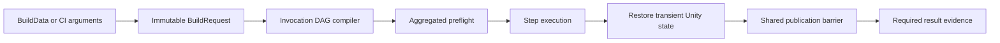

# Composable Build Pipeline

This module is the project-owned build foundation for Unity Player, hot-update, and asset-content output. One saved `BuildData` profile is compiled into an immutable invocation graph, validated before mutation, executed under a project-wide lease, and published through a shared durable decision. The same composition root is used by the Inspector, Editor menu, TeamCity, Jenkins, and other batch-mode runners.

The module is intended to be copied between projects with only project identity, scenes, output roots, and provider configuration changed. Optional packages are isolated behind dependency-free authoring contracts, reflection boundaries, or version-gated integration assemblies so an absent provider does not break the core assembly.

## Architecture and directory layout

Paths in this document are relative to the Unity project root.

```text
Assets/Build/
  Runtime/Data/                 Player-safe version data (`Build.Data`)
  Editor/VersionControl/       Git and Perforce metadata providers
  Editor/BuildPipeline/
    Authoring/                  BuildData, provider-neutral config assets, Inspectors
      Content/                  Addressables and YooAsset serialized authoring contracts
      Player/                   Optional Player extension composition and Inspector
    Core/
      Capabilities/             Cross-cutting build capabilities
      Contracts/               Requests, invocations, steps, adapters, results
      Discovery/               TypeCache registries and plan compiler
      Execution/               CLI, request factory, runner, workspace lease
      Policies/                Identity, path, PlayerSettings, availability
      Recovery/                Zero-write inspection and explicit recovery
      Results/                 Provenance, event log, result manifests
      State/                   ProjectSettings whole-tree guard
      Transactions/            Global state, Player output, publication barrier
    EntryPoints/                Shared interactive and batch-mode composition root
    Integrations/               Optional package adapters and their transactions
      Addressables/
      HybridCLR/
      HybridCLRObfuz/
      Obfuz/
      PerformanceTesting/
      YooAsset3/
    Presentation/               Workspace Health window
    Steps/                      Built-in hot-update, asset-content, Player commands
  Tests/Editor/                 Package-independent EditMode tests
  README.md                     Canonical English guide
  README.SCH.md                 Synchronized Simplified Chinese guide
```

The two YooAsset-related locations are deliberate:

- `Authoring/Content/YooAssetBuildConfig.cs` is a dependency-free serialized contract. Profiles remain readable and diagnosable when YooAsset is absent.
- `Integrations/YooAsset3/` contains the strongly typed YooAsset implementation, recovery participant, and package-specific tests. Its asmdef is enabled only for `com.tuyoogame.yooasset` in `[3.0.5,4.0.0)`.

Likewise, `Steps/` contains provider-neutral orchestration. `Integrations/HybridCLR` and `Integrations/HybridCLRObfuz` own their configuration assets, adapters, validation, execution, and Player compatibility policy. `Core/` never imports a provider-specific runtime type or provider identifier.



## Core recipe model

A recipe is an invocation DAG serialized in a stable authoring container. The array is not execution order. The distinction between an invocation and a step type is fundamental.

| Value | Meaning |
| --- | --- |
| `InvocationId` | Unique execution identity inside one recipe. Dependencies, CI overrides, logs, provider state, and result records address this value. IDs are case-insensitively unique, at most 64 characters, use lowercase ASCII letters, digits, `.`, `_`, or `-`, and begin with a letter or digit. |
| `StepTypeId` | Registry identity of the implementation to instantiate, for example `asset-content`. More than one invocation may use the same type only when that registration declares `BuildStepMultiplicity.Multiple`. |
| `Configuration` | Optional typed `ScriptableObject` owned by this invocation. Required configurations must be persistent main `.asset` files below `Assets`. |
| `Incrementality` | Per-invocation `Clean` or `Incremental` policy. A single run may combine different policies. Each implementation defines and validates its own semantics. |
| `Dependencies` | Explicit invocation-to-invocation DAG edges. They determine ordering and which staged upstream outputs a downstream invocation may consume. |

The built-in step types are:

| Step Type ID | Multiplicity | Configuration | Responsibility |
| --- | --- | --- | --- |
| `hot-update` | Multiple | `HotUpdateBuildConfiguration` | Resolve requirements, validation, execution, and Player compatibility from the concrete provider adapter. |
| `asset-content` | Multiple | `AssetContentBuildConfiguration` | Resolve the adapter from the concrete config asset and build one provider session. |
| `player` | Single | Optional `PlayerBuildConfiguration` | Build a Unity Player into a staging location, run explicitly selected Player extensions, and publish only at the terminal decision. `None` means an unextended Player. |

`Required` and `IfSelected` dependency modes have precise behavior:

- `Required` fails plan compilation when its target invocation is not selected.
- `IfSelected` creates an edge when the target is selected and is otherwise ignored.
- A selected but non-applicable dependency is an error.
- Self references, duplicate edges, unknown targets, and cycles are rejected.
- Otherwise independent ready invocations use case-insensitive `InvocationId` order as a deterministic tie-breaker. Serialized array order never changes execution.

The list and its Dependencies are not duplicate controls. Membership answers *what may run*; an edge answers *which producer must precede a consumer*, whether that producer is automatically required, and which staged upstream output the consumer is authorized to see. Quick Setup writes the standard edges automatically. Only custom or multi-provider graphs normally need manual edge editing.

For example, two content invocations can use the same `asset-content` implementation with different configs:

```text
hot-release   : hot-update
content-base  : asset-content -> IfSelected hot-release
content-dlc   : asset-content -> IfSelected hot-release
player        : player        -> Required hot-release, content-base, content-dlc
```

The Player consumes content sessions only from its transitive dependency closure. Explicitly connect every content invocation whose staged built-in data must be visible to that Player. Give independent content invocations non-overlapping final publication roots or package scopes; separate invocation journals prevent identity collisions but do not make overlapping destinations valid.

An asset-content adapter can implement `IAssetContentBuildOutputClaimProvider` and declare absolute, exclusive terminal output roots. Claims are collected during aggregated preflight. Any exact match or ancestor/descendant overlap within one invocation or across selected invocations fails before a provider build begins. Claim identity is conservatively case-insensitive on every host so macOS case-insensitive APFS aliases cannot bypass preflight. Addressables and YooAsset implement this contract; custom providers that publish terminal files should do the same.

The generic hot-update step also supports multiple invocations. Each invocation resolves one `IHotUpdateBuildAdapter` from its config-derived `ProviderId`, caches that stateful adapter for the run, and delegates requirements, validation, and execution. A provider with process-global vendor tooling must reject unsupported same-run combinations itself. The HybridCLR adapters do so because the current generation API has one global output session.

The compiler discovers registrations, creates a fresh `IBuildStep` instance per invocation, checks multiplicity and typed configuration, builds a stable topological order, and aggregates every applicable invocation's `Validate` result before opening a build mutation window.

## Build profile and designer workflow

Create a profile with `Assets > Create > CycloneGames > Build > Build Profile`. Commit the profile and every referenced config asset.

### Profile fields

| Section | Contract |
| --- | --- |
| Scenes | `Launch Scene` and ordered additional scenes are required only when a selected `player` invocation is present. Duplicate asset paths are removed. |
| Version and Output | `Application Version` uses `major.minor.patch`. `Output Base Directory` is a portable project-relative root. |
| Runtime Version Info | The default view shows a transactional, auto-cleaned runtime asset. Advanced authoring may select an existing asset or folder only below an exact `Resources` directory. CI may override the same validated path. |
| Product Identity | Company, product, and application identifier are applied only inside the pipeline-owned transactional Unity global-state envelope and are restored after the run. |
| Build Recipe | Quick Setup, standard output cards, typed configs, independent incrementality, and an optional Advanced DAG with stable IDs and dependency edges. |
| Player Options | `CheatBuildMode`. Optional Player integrations are referenced through the Player invocation's typed `PlayerBuildConfiguration`; leaving it empty requires no extra asset. |

The generic Player step asks only its dependent hot-update adapters for Player compatibility. The current HybridCLR adapters reject invocation-local `ENABLE_CHEAT` because the vendor compilation API cannot guarantee matching defines; another provider is not rejected by that HybridCLR-specific rule. Player extensions and hot-update providers are separate typed seams.

### Inspector UX

The BuildData Inspector uses a Build-owned, skin-aware presentation module rather than referencing another CycloneGames package. Its compact header and **Build Readiness** card project the existing recipe analysis, validation, workspace, authoring-save, and Unity busy states without creating a second source of truth. The root layout reclaims only the redundant left gutter supplied by the Inspector host; panel padding, status markers, nested hierarchy, and the right scrollbar safety area remain intact. Semantic badges always include text such as `READY`, `UNSAVED`, `RECOVERY`, or `BLOCKED`; color is supporting information only. Normal explanations use compact wrapped text, while actionable failures retain explicit diagnostics.

Recipe presets, workspace commands, saved-recipe builds, and focused builds use one responsive equal-cell grid. The grid shows up to three columns when space permits and collapses to two or one column in a narrow Inspector. At narrow widths, Quick Setup uses shorter labels with the unchanged full meaning in each tooltip, while responsive label widths preserve useful space for serialized controls. Object-reference rows move their label above the field before the field or its `Create`, `Browse`, and `Reset` actions can become unusably small; extremely narrow rows place actions on a separate line. Primary, secondary, selected, and accessory actions retain consistent roles. Enabled primary build actions use a brighter skin-aware green treatment and bold white text, while Unity's disabled state still visibly de-emphasizes unavailable actions. Standard output cards show `Included`, `Retained`, or `Config required` directly instead of using a disabled checkbox as a status indicator; the full state remains available in the tooltip. Collapsed Advanced DAG invocations occupy one summary row; expansion reveals the complete identity, configuration, policy, and dependency editor.

Nested authoring areas use one framed foldout primitive: its arrow, title, optional summary, status badge, and expanded content remain inside the same panel at every supported Inspector width. `Additional Scenes`, `Advanced Version Info Destination`, `Advanced DAG & CI`, and individual DAG invocations therefore share the same click target and visual hierarchy. The scene list remains a serialized reorderable list, so adding, removing, reordering, and Undo preserve the authored scene sequence.

The custom Inspector owns an explicit fail-closed serialization contract for every Unity-serialized field on `BuildData`, `BuildRecipeInvocation`, and `BuildInvocationDependency`. Editor creation compares the declared field owners with the current model and verifies root `SerializedProperty` bindings once; tests enforce exact coverage. A newly added, removed, duplicated, or unbound field produces an **Inspector Contract Failure** card and disables all authoring/build actions until the presentation contract is updated. The Inspector never falls back to an unstructured default editor, so future fields cannot disappear silently or bypass the intended validation and workflow.

The default Inspector exposes Quick Setup plus Player, Asset Content, and Hot Update cards. Config assets can be dragged or created there; a preset may be applied before optional configs exist, and concrete missing-config diagnostics block only the build. `Advanced DAG & CI` contains registry-backed invocation routing rather than free-form provider names:

- New rows receive a unique Invocation ID automatically.
- Step Type is selected from discovered registrations.
- Config accepts only the registered type. Existing assets can be dragged in; **Create** offers compatible concrete config types and stores the new asset at a user-selected version-controlled path.
- Incrementality is selected per invocation.
- Dependency mode and target are selected from existing invocations. Already-used targets and choices that would introduce a cycle are omitted.
- Advanced rows are individually collapsible. The list is not draggable because dependencies are the only sequencing contract; a read-only compiled execution plan shows the effective order.
- Renaming an Invocation ID validates the new value and rewrites every incoming dependency reference atomically.
- Removing a referenced invocation requires confirmation and removes its incoming edges in the same edit.
- Unknown registrations, missing optional adapters, invalid config types, duplicate single-multiplicity types, missing dependencies, cycles, unsafe paths, and unsaved authoring assets disable build actions with a concrete diagnostic.

The Inspector never silently saves the project. **Save Build Authoring Assets** saves only the displayed profile and referenced dirty config assets when the user explicitly presses that button. The runner also captures config asset GUID/local ID, file hash, and transitive dependency hash so Editor and CI consume reproducible authoring state.

### Presets and focused output

Presets are authoring helpers; they are not alternate pipelines.

| Preset | Selected built-in types | Intended output |
| --- | --- | --- |
| Player Only | `player` | Player without content or hot-update generation. |
| Player + Content | `asset-content`, `player` | Content and Player without HybridCLR generation. |
| Full Player | `hot-update`, `asset-content`, `player` | Hot-update output, content, then Player. |
| Content Only | `asset-content` | Asset content without Player or HybridCLR generation. |
| Content + Hot Update | `hot-update`, `asset-content` | Hot-update output and content without Player. |
| Hot Update Only | `hot-update` | Hot-update and AOT metadata output without content or Player. |

A preset preserves reusable configuration and incrementality where possible and keeps unrelated/custom entries disabled instead of deleting their authoring data. Preset recognition compares canonical invocation identity, type, and the complete effective dependency graph; a damaged graph is reported as Custom rather than being mislabeled by its type sequence.

**Run Saved Recipe** executes enabled invocations. **Focused Output (Does Not Modify Profile)** creates an immutable one-run selection without changing the profile. Common Hot Update Only, Content Only, and Content + Hot Update actions require an unambiguous canonical or single matching invocation. When several invocations share a type, **Exact Invocation** selects one stable ID. Focused execution automatically adds its transitive `Required` closure but never silently adds `IfSelected` dependencies or every same-type invocation.

Content-only and hot-update-only builds are first-class: they do not require a launch scene, create a Player output transaction, or create `VersionInfoData`. Provider results and artifacts are still recorded and use the same lease, validation, publication, recovery, and result-evidence rules.

### Player extensions

The Player invocation accepts an optional `PlayerBuildConfiguration`. Its ordered list contains persistent `PlayerBuildExtensionConfiguration` assets; designers can drag existing assets or use **Create** in the configuration Inspector. Provider IDs come from the concrete assets and resolve exactly one `IPlayerBuildExtensionAdapter`. Every adapter registration and runtime instance must also expose the same lowercase stable `CompatibilityId`; changing adapter behavior that can affect output compatibility requires a new ID. Missing adapters, duplicate provider IDs, duplicate registrations, wrong configuration types, invalid or mismatched compatibility IDs, unsaved referenced assets, and unavailable package prerequisites fail during aggregated preflight.

An extension adapter validates its own durable state and may open a reversible session around `BuildPlayer`. Process-global package behavior belongs to a provider-owned `IPlayerBuildEnvironmentGuard`, so Core does not know vendor identifiers. Obfuz Player obfuscation is enabled by adding `ObfuzPlayerBuildExtensionConfiguration`; the adapter requires the saved Obfuz Player setting to agree, validates the generated Encryption VM, and never rewrites `ProjectSettings/Obfuz.asset`. Remove the extension and disable the durable Obfuz setting to build without it. This is independent from `HybridCLRObfuzBuildConfig`, which controls hot-update DLL processing.

The recipe provenance records the Player configuration plus its transitive asset dependency hash. A separate SHA-256 Player-extension fingerprint resolves every configured provider through the unique registry entry and binds the ordered provider ID, actual adapter `CompatibilityId`, and config asset identity to incremental Player output compatibility. The strict fingerprint is captured once in the run context after successful resolution, then reused by Player execution, result writing, and terminal confirmation; a second different value fails closed instead of replacing the snapshot. Each extension asset has a 64 MiB read/hash limit, all extension assets have a 256 MiB aggregate limit, and one Player may select at most 64 extensions. Changing adapter compatibility, configuration, order, membership, or asset identity requires a Clean Player build.

### Player incrementality

Player `Clean` and `Incremental` are output/cache reuse policies for one Player invocation; they are not content hot-update or patch-delivery modes. `Clean` starts with an empty transaction stage and adds `BuildOptions.CleanBuildCache`. It can publish into an absent or empty output, or replace an output whose current format-1 Build ownership marker and complete tree identity are valid, even when the previous compatibility identity differs. Successful publication writes a new sibling marker at `<OutputDirectory>.buildpipeline-player-owner.json`; any non-current marker is rejected.

`Incremental` requires the published output and marker to exist before any active journal or stage is created. The marker checksum, complete output-tree identity, nested format-1 compatibility identity, and SHA-256 compatibility digest must be valid. The compatibility identity must exactly match the owner-local Player pipeline compatibility revision, `Application.unityVersion`, `BuildTarget`, `NamedBuildTarget.TargetName`, `ScriptingBackend`, the relative output artifact path (or output-directory leaf when the output path is the directory), `OutputIsFolder`, company, product, application identifier, Android export, Development/debug, debug-file deletion, Cheat, and the Player-extension provenance fingerprint. The format version and pipeline compatibility revision are independent: `formatVersion` describes this owner's JSON contract, while the positive revision invalidates reuse after a behaviorally incompatible Player pipeline change. The verified published tree is copied into owned staging, `CleanBuildCache` is omitted, and compatibility is checked again immediately before publication. Any missing, corrupt, changed, or unsupported value fails closed and instructs the operator to run `Clean`.

The Player recovery journal uses `formatVersion: 1` and records the original and new compatibility identities. Rollback restores the original owner identity; committed recovery retains the new identity. CI that expects Player `Incremental` must archive and restore the Player output directory and its sibling ownership marker together; never synthesize or edit the marker.

All Build-owned JSON files use an owner-local integer `formatVersion: 1` contract. Readers accept only the current format and validate every invariant required by that document owner; unknown versions are rejected without reinterpretation. After adopting this redesigned module, use empty publication roots or move prior outputs aside and run `Clean`; do not copy prior ownership markers or baselines into a new pipeline workspace.

## Optional providers and incrementality

### Addressables

`AddressablesBuildConfig` selects Addressables by its concrete `ProviderId`; there is no separate handwritten provider field. The adapter uses a narrow reflection boundary so the core assembly compiles without Addressables and fails preflight when the selected package API is missing or incompatible.

- `Clean` clears the configured active builder cache, temporarily sets the requested content version, and calls the official `AddressableAssetSettings.BuildPlayerContent` flow.
- An empty `Publication Root` is invocation-scoped as `Build/AddressablesContent/<InvocationId>/<BuildTarget>`, so independent Addressables invocations do not collide by default. An explicit root is used exactly as authored; overlapping explicit roots are rejected during output-claim preflight.
- `Incremental` is the official Content Update flow. It requires **Build Remote Catalog**, publication enabled, and exactly one explicit previous `addressables_content_state.bin` baseline. Designers can drag a baseline imported below `Assets`; CI can restore it at a portable project-relative path. The baseline must remain in a prior pipeline publication whose root `AddressablesArtifacts.json` proves target, active profile, remote-catalog location, player/editor identity, size, and SHA-256. The adapter snapshots the validated file and calls `ContentUpdateScript.BuildContentUpdate(AddressableAssetSettings, string)`.
- Missing, changed, malformed, wrong-target, wrong-profile, wrong-load-path, or unowned baselines fail closed. Every successful Incremental build, and any Clean build for which the official API returns a content-state file, publishes that state under `BuildMetadata` for a following update. A Clean result without that file may publish content but cannot seed Content Update.
- Incremental Addressables output cannot feed a Player build. Run it as content-only; use Clean with remote-catalog/state generation to establish a new Player/content baseline.
- The Addressables adapter declares a stable, process-global `ExclusivePlayerSessionKey`. Generic Player preflight groups every content session in the dependency closure by this key and fails closed when two invocations claim it; the core pipeline contains no Addressables provider-name rule.
- A published target contains `PlayerData`, optional `RemoteContent`, optional `BuildMetadata`, configured additional roots, and a root `AddressablesArtifacts.json`. Provider publication/recovery journals are isolated at `.buildpipeline/transactions/addressables/<InvocationId>`; temporary shared settings restoration is journaled separately below `.buildpipeline/transactions/addressables-settings` under the single workspace lease.
- The Addressables integration registers an `IPlayerBuildEnvironmentGuard`. It suppresses the official package hook only when Addressables is installed but absent from the Player dependency closure, does nothing when the package is missing, and remains a no-op when the selected Addressables adapter already owns the content session. The generic Player step only validates, begins, and reverses discovered guards.

Addressables settings and referenced group/schema assets must be saved before the run. Temporary settings changes are byte-snapshotted, restored, and covered by durable recovery evidence.

### YooAsset 3

The YooAsset adapter assembly uses `versionDefines` and direct references only inside `Integrations/YooAsset3`. When a supported package is absent, the integration assembly disappears naturally while `Build.Pipeline.Editor` and saved `YooAssetBuildConfig` assets remain compilable. Do not define its capability symbol in PlayerSettings.

A config explicitly owns output roots and one or more package profiles. Each profile selects package name, Scriptable/RawFile/ArchiveFile pipeline, compression, naming, bundled-copy policy, verification, and exact-version collision policy. Builds are staged before final paths are touched. `FailIfVersionExists` is the default; `ReplaceExactVersion` can replace only a Build-owned exact target. Clean mode deliberately does not call YooAsset's broad historical-cache deletion API.

Built-in packages required by a downstream Player are activated reversibly before Player execution. Exact-version package publication remains staged until the terminal decision. Ownership markers, bounded content identities, sibling `.meta` protection, and per-invocation state at `.buildpipeline/transactions/yooasset3/<InvocationId>` make rollback and recovery deterministic. See `Editor/BuildPipeline/Integrations/YooAsset3/README.md` for provider details.

### HybridCLR and Obfuz

`hot-update` is provider-neutral. Select `HybridCLRBuildConfig` for standard DLLs or `HybridCLRObfuzBuildConfig` for the explicit HybridCLR + Obfuz provider. There is no serialized obfuscation toggle and no handwritten provider ID. Both require IL2CPP. Clean runs full HybridCLR generation. Incremental standard HybridCLR compiles hot DLLs only and obtains every AOT metadata DLL from a validated release baseline; it never trusts the current stripped-AOT scratch directory.

The Inspector exposes the standard provider only when its HybridCLR editor prerequisite is present. The combined provider requires HybridCLR, Obfuz, and Obfuz4HybridCLR editor capabilities together; a partial installation remains non-selectable and fails authoring validation instead of surprising the build after Unity state has changed.

A HybridCLR release baseline is published only when all of these are true:

1. the hot-update invocation is `Clean`;
2. the request is Release, not Development;
3. a selected Player invocation directly depends on that hot-update invocation; and
4. the shared terminal publication decision commits successfully.

The baseline is stored at:

```text
<BuildRoot>/.buildpipeline/baselines/hybridclr/
  <BuildTarget>/<ScriptingBackend>/<release-key>/
    baseline.json
    AOT/*.dll
```

The release key derives from application identifier, application version, and hot-update Invocation ID. The manifest binds target, backend, Unity and HybridCLR identities, authoring/configuration hashes, Player AOT compatibility settings, assembly inventory, source provenance, and each DLL's length and SHA-256. A Clean hot-update-only or Development build does not create a baseline. Archive the matching baseline with a released Player and restore it at the same Build Root before a later incremental hot-update-only CI job.

The explicit `HybridCLRObfuzBuildConfig` provider rejects Incremental because the current Obfuz4HybridCLR boundary reads an implicit stripped-AOT directory instead of an explicit validated baseline. Its Clean mode remains supported. See `Editor/BuildPipeline/Integrations/HybridCLR/README.md` for the full baseline contract.

## Execution, publication, and recovery

The runner applies the following order:

1. Acquire the project-wide OS file lease at `Temp/BuildPipeline/Workspace/lease.lock`. Its byte-range OS lock is the sole authority and acquisition is fail-fast. While the lease is held, `Temp/BuildPipeline/Workspace/lease.json` exposes human-readable diagnostic metadata; that metadata may be stale and never proves ownership.
2. Require an idle Editor and a `Clean` zero-write workspace inspection.
3. Snapshot the entire `ProjectSettings/` tree, validate request paths and identity, capture recipe provenance, resolve version identity, compile the invocation DAG, and run all applicable preflights.
4. Open only the declared state envelopes. A content-only step does not receive PlayerSettings, Player output, or `VersionInfoData` privileges.
5. Execute invocations in topological order. Outputs stay in owned staging; only explicitly registered downstream inputs may be activated early and they remain reversible.
6. Restore transient `VersionInfoData`, PlayerSettings, Editor build settings, optional preloaded assets, and other scoped state. Verify the whole `ProjectSettings/` tree before publication.
7. Seal the execution context, freeze the manifest's common payload, and serialize a worst-case failed terminal envelope with the same `JsonUtility` and strict UTF-8 path used by the final write. The 64 MiB capacity gate must pass before any deferred publication is allowed to publish.
8. Publish every deferred output, persist one shared `Commit` decision, complete child transactions, then remove the barrier only after their recovery evidence is gone.
9. Persist the required result manifest from the frozen snapshot while the workspace lease is still held. The final writer does not re-read mutable context or recompute the Player-extension fingerprint. Immediately after the runner releases the lease and returns, the entry point strictly validates the complete manifest contract, closes the evidence log, and removes the started marker only after terminal evidence is confirmed.

Before a durable commit, any failure disposes publications in reverse order and rolls back. Context mutations that can change result evidence or publication membership are rejected after sealing. After the commit, rollback is no longer legal: an incomplete refresh or cleanup retains journals and explicit recovery finishes the committed state. Output replacement is guarded by path containment, ownership markers, checksums, reparse-point rejection, bounded inventories, and write-ahead journals; unknown data is preserved and blocks the operation.

### Transient VersionInfo lifecycle

`VersionInfoData` exists only while a Player build needs it and must be below an exact `Resources` directory so it is included and runtime-discoverable. If the configured asset already exists, its bytes and metadata are restored. If its parent path does not exist, the transaction creates the required `Assets` folders and folder `.meta` files, writes the asset, then removes only the folders and metas it created after success or a handled failure. An abrupt process termination retains the write-ahead journal; Workspace Recovery performs the same ownership checks before the next build. A generated folder that gained an unknown file or a changed `.meta` is preserved and reported instead of being recursively deleted. Consequently, the default `Assets/Build/Runtime/Resources/VersionInfoData.asset` path does not leave an extra `Resources` folder in a project that did not have one.

### Workspace health

`BuildWorkspaceService.Inspect` does not write or recover anything.

| Status | Meaning | Next action |
| --- | --- | --- |
| `Clean` | No actionable transaction evidence. | A normal build may start. |
| `RecoveryRequired` | Valid evidence has an unambiguous recovery path. | Review and run explicit recovery. |
| `Blocked` | Evidence is malformed, unsafe, contradictory, unclaimed, or its optional integration is unavailable. | Preserve evidence and resolve the reported cause. |
| `Busy` | The authoritative OS lock on `lease.lock`, or another Unity operation, is active. `lease.json` is diagnostic only. | Wait for the owner to finish; do not delete either lease file to bypass ownership. |

Use `Build > Pipeline > Workspace Health`. Recovery requires the fresh optimistic snapshot token, so a changed journal forces another inspection. There is no force-delete operation.

After a failed build, switching platform is safe only when Workspace Health is `Clean`. A complete rollback removes its journal and the new target may proceed. If evidence remains, every target is blocked before mutation. Recovery uses the target, roots, identities, and durable decision captured by the interrupted run, not the newly selected profile; the window reports a required target when a participant needs one. Reinstall a removed optional package when its participant owns pending evidence, recover to `Clean`, and only then remove it again.

## Result evidence and observability

Every interactive and batch entry point creates evidence before command-line parsing or profile loading:

```text
.buildpipeline/results/<run-id>.started.json
.buildpipeline/results/<run-id>.log
.buildpipeline/results/<run-id>.json
```

The started marker survives abrupt process termination and is removed only after terminal evidence is durably confirmed. Early parsing, profile, request, or recovery failures receive a partial `formatVersion: 1` terminal manifest with stage and process exit code. Its independent confirmation checks operation, run ID, stage, outcome, exit-code consistency, `partial=true`, log path, UTC timestamp order, and the success/failure contract. A completed build receives the full format-1 manifest with detected/effective source identity, identity origin, CI provenance, target/settings, recipe Invocation IDs and Step Type IDs, dependency modes, per-invocation incrementality, config provenance and hashes, the Player pipeline compatibility revision, the adapter-bound Player-extension fingerprint, step timings/status, provider results, artifacts, warnings, and failure details. If invalid extension authoring prevents a unique adapter from resolving, evidence uses a deterministic `invalid:<sha256>` marker derived from the failure category and bounded basic configuration identity; this marker is never accepted by Player output ownership, while the independent failure field retains the original preflight diagnostic. Full confirmation requires `formatVersion: 1`, `operation=build`, the expected run ID and in-memory success outcome, `partial=false`, the exact current Unity and Player pipeline compatibility identities, valid ordered UTC timestamps, every required scalar and identity object, all top-level arrays, and valid nested dependency, artifact, and warning records.

Short failure, non-fatal failure, recipe-validation, and step-message text is preserved exactly. Invalid UTF-16 or text beyond the per-value diagnostic budget becomes a deterministic bounded marker containing a SHA-256 digest; a shared run budget can summarize later diagnostic values in the same way. Provider-owned content evidence is never silently truncated: result creation rejects more than 4,096 artifacts, 1,024 warnings, a field above 256 KiB UTF-8, or a result above 1 MiB UTF-8. One content operation may return at most 1,024 package results; the run accepts at most 4,096 content results, 131,072 content evidence values, and 8 MiB of provider text. The writer and strict confirmation use the same evidence policy.

The pre-publication gate proves only that the frozen payload plus the largest normalized terminal failure fits the 64 MiB manifest limit. It performs no file write and cannot make later storage I/O atomic with already committed artifacts. Disk-full, permission, locking, or device failures during the final create-new temporary-file/write-through/move sequence still prevent confirmation and produce exit code `2`; the recovery journals and publication barrier remain the authority for committed output state.

The terminal manifest and event log are required. Evidence I/O failures raised by non-terminal event callbacks immediately abort further build execution and are never downgraded into `nonFatalFailures`. A terminal event write or log-close failure cannot roll back an already committed publication, but it prevents confirmation and returns evidence exit code `2`. If the canonical manifest already exists but violates its contract, it is preserved rather than overwritten; the started marker also remains for diagnosis. Inspect the log, outputs, marker, and transaction evidence before retrying.

Batch-mode exit codes are stable:

| Code | Meaning |
| --- | --- |
| `0` | Requested build or recovery completed and terminal evidence was confirmed. |
| `1` | Validation, build, publication, or recovery failed. |
| `2` | Required result evidence could not be established, written, closed, or validated. |
| `3` | The build workspace lease is already held. |

Result files are diagnostic history, not recovery truth. CI should archive them; recovery reads only registered durable transaction evidence and the publication barrier.

The manifest contract records provider-declared artifact paths, but it is not a universal byte-level attestation of every published Player or content tree. Player publication maintains a SHA-256 tree identity in its sibling owner marker, while Addressables, YooAsset, and HybridCLR publications maintain their own provider manifests or release baselines. A release job must archive those ownership records with the outputs and generate or verify a final archive inventory before upload; path presence alone is not a supply-chain signature.

## Command-line and CI

Use the canonical entry point:

```text
-executeMethod Build.Pipeline.Editor.BuildEntryPoints.RunCommandLine
```

`-buildTarget` is required for builds and accepts `Win64`, `OSXUniversal`, `Linux64`, `Android`, `iOS`, or `WebGL`. Unity must finish switching to that active target before provider execution; the pipeline does not synchronously switch targets during a transaction.

### Recipe options

The five invocation-level options are repeatable and address stable Invocation IDs:

| Option | Syntax | Effect |
| --- | --- | --- |
| `-pipelineSelect` | `<invocation>` | Selects one root from the explicit `-pipelineProfile` without changing the asset. Repeat for several roots. The run also selects their transitive `Required` closure; `IfSelected` never adds a node. |
| `-pipelineRecipe` | `<invocation>=<step-type>` | Adds one invocation to an explicit CI recipe. Supplying any entries replaces the saved enabled selection for that run. |
| `-pipelineStepConfig` | `<invocation>=Assets/.../Config.asset` | Assigns a persistent main config asset to a selected invocation. |
| `-pipelineStepIncrementality` | `<invocation>=Clean\|Incremental` | Overrides that invocation's policy. |
| `-pipelineStepDependency` | `<owner>=Required\|IfSelected:<dependency>` | Adds an edge. Specifying dependency entries for an owner replaces that owner's saved dependency list. |

`-pipelineSelect` requires an explicit `-pipelineProfile`, preserves the selected profile invocations' typed configs, policies, and complete dependency declarations, and is mutually exclusive with `-pipelineRecipe`. Unknown or duplicate selections fail closed. Keyed overrides may target a selected root or an automatically selected `Required` dependency; an override targeting anything outside the effective selection is rejected.

An explicit CI recipe starts each invocation with no config, no dependencies, and `Clean`; provide the required overrides explicitly. If neither `-pipelineSelect` nor `-pipelineRecipe` is supplied, the saved enabled invocations and their configs, policies, and dependencies are used, while keyed overrides may replace selected values.

Normal CI should pass `-pipelineProfile Assets/.../BuildData.asset` and keep the graph in the version-controlled profile. The Inspector copies this short form. Expanded recipe arguments are an advanced replacement interface, not a serialization format; do not expand a large 256-node/4,096-edge graph into process arguments because operating-system and CI launcher command-length limits are much smaller than pipeline graph budgets.

For example, this focused run builds `content-dlc` plus only its transitive `Required` dependencies while retaining all authoring from the profile:

```text
-pipelineProfile Assets/Settings/Build/Release.asset -pipelineSelect content-dlc
```

### Other options

| Option | Contract |
| --- | --- |
| `-pipelineProfile Assets/.../BuildData.asset` | Selects the profile. It may be omitted only when exactly one `BuildData` exists. |
| `-pipelineScriptingBackend Mono2x\|IL2CPP` | Overrides the target backend for this run. |
| `-pipelineOutput <path>` | Overrides the Player output path. |
| `-pipelineOutputRoot <project-relative-dir>` | Overrides the profile Build Root. |
| `-pipelineVersion <major.minor.patch>` | Overrides the application version. |
| `-pipelineVersionInfo Assets/.../Resources/.../VersionInfoData.asset` | Overrides the transient Player version asset path; the exact `Resources` segment and fixed file name are required. |
| `-pipelineDevelopment` | Creates a Development request. |
| `-pipelineExportAndroidProject` | Exports an Android Gradle project; valid only with Android and a Player invocation. |
| `-pipelineEnableCheat` / `-pipelineDisableCheat` | Mutually exclusive Player Cheat override. |
| `-pipelineAllowExternalOutput` | Allows an explicitly requested Player output outside the normal project-owned root after path safety checks. |
| `-pipelineBuildNumber <1..Int32.MaxValue>` | Explicit native/content build number. |
| `-pipelineSourceProvider`, `-pipelineSourceRevision`, `-pipelineSourceBranch` | Complete source identity group; all three are supplied together or omitted. |
| `-pipelineCiProvider`, `-pipelineCiRunId` | CI provenance group; both are supplied together or omitted. |
| `-pipelineRecoverOnly` | Runs explicit workspace recovery as a separate action. It may be combined only with the optional native `-buildTarget`; all other pipeline build options are rejected. |

The pipeline never guesses CI identity from environment variables. Map TeamCity/Jenkins variables to explicit arguments in the job definition. When local VCS metadata is available, an explicit provider/revision must match it. Batch and Release builds require reliable local VCS metadata or a complete explicit source identity plus build number. Only an interactive Development build may fall back to clearly marked local-development identity. The effective provider package version is `<ApplicationVersion>.<BuildNumber>`; absent an override, reliable VCS commit count supplies a minimum build number of `1`. Native limits still apply, including Android's `2100000000` maximum version code.

### Advanced explicit CI recipe example

This example assumes the supported HybridCLR and YooAsset integrations are installed, the three referenced config assets exist and are saved, the target switch can complete before execution, and every placeholder is replaced by the CI job. It requests one hot-update build, two independent content builds, and one Player.

```text
Unity.exe -batchmode -quit -projectPath <UnityProject> \
  -executeMethod Build.Pipeline.Editor.BuildEntryPoints.RunCommandLine \
  -buildTarget Win64 \
  -pipelineProfile Assets/UnityStarter/Editor/Build/BuildData.asset \
  -pipelineScriptingBackend IL2CPP \
  -pipelineRecipe hot-release=hot-update \
  -pipelineRecipe content-base=asset-content \
  -pipelineRecipe content-dlc=asset-content \
  -pipelineRecipe player=player \
  -pipelineStepConfig hot-release=Assets/Settings/Build/HybridCLRBuildConfig.asset \
  -pipelineStepConfig content-base=Assets/Settings/Build/YooAssetBaseBuildConfig.asset \
  -pipelineStepConfig content-dlc=Assets/Settings/Build/YooAssetDlcBuildConfig.asset \
  -pipelineStepIncrementality hot-release=Clean \
  -pipelineStepIncrementality content-base=Clean \
  -pipelineStepIncrementality content-dlc=Clean \
  -pipelineStepDependency content-base=IfSelected:hot-release \
  -pipelineStepDependency content-dlc=IfSelected:hot-release \
  -pipelineStepDependency player=Required:hot-release \
  -pipelineStepDependency player=Required:content-base \
  -pipelineStepDependency player=Required:content-dlc \
  -pipelineBuildNumber 4201 \
  -pipelineSourceProvider git \
  -pipelineSourceRevision <full-revision> \
  -pipelineSourceBranch refs/heads/release \
  -pipelineCiProvider TeamCity \
  -pipelineCiRunId 4201
```

Content-only CI normally uses `-pipelineSelect <content-invocation>` against the saved profile. An advanced explicit replacement instead omits `player`. Official Addressables Content Update uses one incremental `asset-content` invocation and a config whose baseline asset/path points to an artifact restored before Unity starts.

Recovery example:

```text
Unity.exe -batchmode -quit -projectPath <UnityProject> \
  -executeMethod Build.Pipeline.Editor.BuildEntryPoints.RunCommandLine \
  -pipelineRecoverOnly
```

Add `-buildTarget <target>` only when Workspace Health reports that pending recovery evidence requires that target; otherwise omit it.

## Persistence and ownership

| Data | Location | Owner and lifecycle | Version control / cleanup |
| --- | --- | --- | --- |
| Build profile and configs | `Assets/**/*.asset` | Human-authored source of truth; saved explicitly. | Commit. |
| Transient `VersionInfoData` | Configured `Assets/.../VersionInfoData.asset` | Created/replaced only for a Player build, then exactly restored; transaction-created empty folders/metas are removed. | Do not commit transient output. Use recovery if interrupted. |
| Result evidence | `.buildpipeline/results/<run-id>.*` | Per-run started marker, event log, and format-1 terminal manifest. Not recovery truth. | Usually ignore locally and archive in CI. |
| Recovery journals | `.buildpipeline/transactions/<owner>/...` | Durable write-ahead truth for global state, publication barrier, Player, providers, and integrations. | Ignore. Remove only through successful completion/recovery. |
| Workspace authority lock | `Temp/BuildPipeline/Workspace/lease.lock` | The held byte-range OS lock is the sole workspace-ownership authority. | Ignore. Never delete or replace it to bypass `Busy`. |
| Workspace lease diagnostics | `Temp/BuildPipeline/Workspace/lease.json` | Human-readable `formatVersion`, `runId`, `operation`, `pid`, and `startedUtc` written after the authority lock is acquired. It can remain after release, can be stale, and is never ownership evidence. | Ignore. The next successful acquisition overwrites it; never use it to infer that the workspace is free. |
| Provider locks and scratch | Selected provider cache locks and other `Temp/BuildPipeline/...` paths | Reconstructible coordination and temporary snapshots. | Ignore. Clean only when no owner is active and the owning integration permits it. |
| Player/content outputs | Profile/provider publication roots | Build-owned final artifacts protected by staging, identity markers, and collision policy. | Apply the project's release retention policy. |
| Player incremental owner | `<OutputDirectory>.buildpipeline-player-owner.json` | Format-1 owner/checksum/tree identity plus a format-1 compatibility identity containing Unity version, owner-local Player pipeline compatibility revision, adapter-bound Player-extension fingerprint, and SHA-256 digest; transactionally published and recovered with the Player output. | Archive/restore beside the output for Incremental. Never synthesize, edit, or detach it. |
| Addressables Content Update baseline | A prior published `BuildMetadata/.../addressables_content_state.bin` plus the `AddressablesArtifacts.json` at that publication root | Durable release input for the next incremental update. | Archive/restore as one publication; never detach or synthesize it. |
| HybridCLR release baseline | `<BuildRoot>/.buildpipeline/baselines/hybridclr/...` | Durable AOT input for compatible incremental hot-update builds. | Archive with the released Player; safe deletion disables incremental builds until regenerated. |

No critical build configuration is stored in `EditorPrefs`, `SessionState`, or PlayerSettings scripting define symbols. Cache files are reconstructible; journals and release baselines are not caches.

Unity Performance Testing 3.5.x is a contained third-party exception: that package owns an `EditorPrefs` cleanup switch used by its build callbacks. The integration snapshots, temporarily owns, verifies, and exactly restores that external switch under its durable transaction; it never treats the preference as Build configuration. When the package is absent or outside the audited API range, the guard is inactive or fails closed before mutation.

## Extension model

Add a step when the capability has its own validation/execution boundary. Keep dependency edges in recipes so the same implementation can be composed differently by different products.

```csharp
[CreateAssetMenu(menuName = "CycloneGames/Build/Sign Artifact Config")]
public sealed class SignArtifactConfig : ScriptableObject
{
    public string keyAlias;
}

[BuildStepRegistration(
    "sign-artifact",
    DisplayName = "Sign Artifact",
    Category = "Release",
    ConfigurationType = typeof(SignArtifactConfig),
    ConfigurationRequired = true,
    Multiplicity = BuildStepMultiplicity.Multiple)]
public sealed class SignArtifactStep : IBuildStep
{
    public string StepTypeId => "sign-artifact";

    public bool IsApplicable(
        BuildExecutionContext context,
        BuildStepInvocation invocation) => true;

    public IReadOnlyList<string> Validate(
        BuildExecutionContext context,
        BuildStepInvocation invocation)
    {
        SignArtifactConfig config = invocation.GetConfiguration<SignArtifactConfig>();
        return config == null || string.IsNullOrWhiteSpace(config.keyAlias)
            ? new[] { "A signing key alias is required." }
            : Array.Empty<string>();
    }

    public void Execute(
        BuildExecutionContext context,
        BuildStepInvocation invocation)
    {
        SignArtifactConfig config = invocation.GetRequiredConfiguration<SignArtifactConfig>();
        // Stage output. If it becomes terminal state, register an
        // IBuildDeferredPublication with context before returning.
    }
}
```

Rules for production extensions:

- A discovered step is a public, non-abstract, parameterless type with one registration. Its runtime `StepTypeId` must match the registration, and that ID must be globally unique. A duplicate fails closed and reports every conflicting implementation type; registration order never selects a winner.
- Implement `IBuildStepRequirementsProvider` only for the state envelopes genuinely needed. Do not request Player state for a content-only utility.
- Return all deterministic preflight errors from `Validate`; do not start external tools or mutate assets there.
- Put optional third-party code in a narrow adapter or integration asmdef. Do not expose optional types through core public contracts.
- A terminal filesystem mutation implements `IBuildDeferredPublication`; a reversible input required by downstream invocations additionally implements `IBuildDownstreamInputPublication`.
- A durable transaction registers an `IBuildRecoveryParticipant`. Recovery IDs are globally unique; `Priority` only orders participants with different IDs and never selects an override. Recovery must validate paths, identity, checksums, cardinality, and the publication decision before changing data.
- A new content provider derives a dependency-free config from `AssetContentBuildConfiguration`, owns its stable provider ID on that concrete config type, declares `AssetContentProviderAuthoringAttribute`, and registers an `IAssetContentBuildAdapter` in its integration boundary. Core does not enumerate vendor IDs. Provider IDs must be globally unique; duplicate adapters fail closed rather than overriding one another.
- A content provider with terminal filesystem output also implements `IAssetContentBuildOutputClaimProvider`; return every exclusive absolute output root so cross-invocation collisions fail during preflight.
- A content provider that owns temporary Player state implements `IAssetContentPlayerBuildSessionFactory`. Return an empty `ExclusivePlayerSessionKey` only when sessions from separate invocations can coexist; otherwise return a stable provider-owned identifier. Duplicate non-empty keys in one Player dependency closure fail preflight.
- Package-wide Player hooks belong to an integration-owned `IPlayerBuildEnvironmentGuard`. Guard IDs are globally unique, guards never override each other by priority, and every begun guard is disposed in reverse order even when the Player build or another cleanup fails.
- A Player extension adapter registers a stable lowercase `CompatibilityId` and returns the exact same value at runtime. Bump it whenever adapter behavior can change generated Player compatibility; duplicate providers, invalid IDs, and registration/runtime mismatches fail closed before Player output staging.
- A new hot-update provider derives a dependency-free config from `HotUpdateBuildConfiguration`, declares `HotUpdateProviderAuthoringAttribute`, and registers one `IHotUpdateBuildAdapter`. Provider IDs and configuration types are checked against registration metadata. Missing, duplicate, or mismatched adapters fail closed. Provider-specific Player constraints implement `IHotUpdatePlayerBuildValidator` instead of adding vendor branches to `PlayerBuildStep`.
- Use `IBuildEventSink` for observability; event sinks do not own orchestration or durable output.

## Safety budgets and scaling

The pipeline is designed for large recipes but remains deliberately bounded. Current core limits include 256 invocations, 4,096 dependency edges, 4,096 exclusive output claims, 512 deferred publications, and 1,024 Player scenes. Result evidence additionally limits one content operation to 1,024 results, one run to 4,096 content results, 131,072 content values and 8 MiB provider UTF-8 text, and the final manifest to 64 MiB. Config provenance, result logs, journals, ProjectSettings snapshots, directory depth, entry counts, file sizes, total bytes, path lengths, exception traversal, and provider artifacts also have explicit budgets. The Inspector checks the recipe node/edge budget before materializing or drawing the graph; an over-budget or corrupt asset shows only an explicit, Undo-capable reset action instead of allocating unbounded UI state.

Exceeding a budget is a validation or recovery error, never permission to truncate output or delete unknown files. Increase a limit only with measured project data, path/collision review, fault-injection tests, and CI artifact/storage capacity. For very large games, prefer several explicit content invocations with non-overlapping ownership roots and independently archived release baselines instead of one unbounded transaction.

The runner deliberately executes the Unity DAG serially. `AssetDatabase`, PlayerSettings, provider settings, Player hooks, and publication decisions are process-global or main-thread-affine; wrapping independent nodes in `Task.WhenAll` would trade determinism and rollback safety for unmeasured contention. Unity, SBP, shader compilation, Burst, IL2CPP, compression, and vendor tools may use their own workers. Parallelize platform/profile matrices across isolated CI checkouts, Libraries, Unity processes, and output roots; the workspace lease intentionally rejects concurrent mutation of one checkout. Within one provenance checkpoint, shared config assets are memoized by GUID/local file ID so multiple invocations do not rescan the same dependency graph. The runner intentionally performs fresh checkpoints before applicable steps and terminal publication to detect configuration changes during the run.

## Validation and release qualification

Run validation in layers and record `Passed`, `Failed`, or `Not run` for each target. Source inspection or C# compilation alone does not prove Player, IL2CPP, AOT, stripping, filesystem, or CI-agent behavior.

1. With optional packages absent, compile `Build.Data`, `Build.VersionControl.Editor`, `Build.Pipeline.Editor`, and `Build.Pipeline.Tests.Editor`; run the package-independent EditMode suite.
2. Install each supported optional package independently, reload/reimport, compile its integration assembly, and run its focused EditMode tests. Remove it again and confirm the core still compiles.
3. Exercise duplicate IDs, missing/optional dependencies, cycle rejection, serialized-order invariance, multi-content ordering, exact/ancestor/case-alias output-claim overlap, graph-aware preset recognition, Editor and CLI focused selection with Required closure, CLI full-recipe replacement, and config path validation.
4. For each supported target/backend, run Player Only, Player + Content, Full Player, Content Only, Content + Hot Update, and Hot Update Only as applicable. Qualify Release, Development, Android export, and external-output policy separately.
5. For Player incrementality, publish a Clean output, archive/restore its sibling owner marker, then run Incremental. Corrupt the marker checksum, tree identity, compatibility digest, `formatVersion`, pipeline compatibility revision, Unity version, adapter `CompatibilityId` provenance, and each remaining compatibility field in turn; confirm pre-stage fail-closed behavior and verify rollback/committed recovery preserve the correct original/new identity.
6. For Addressables, qualify Clean Player content and an official content-only Incremental update restored from the prior published state. Corrupt every identity field/file hash and confirm fail-closed behavior; also verify that one Player rejects a second Addressables invocation in its dependency closure.
7. For YooAsset, qualify every enabled pipeline kind, multi-package failure rollback, built-in Player activation, exact-version collision policies, and missing-package recovery.
8. For HybridCLR, publish a Clean Release Player baseline, restore it in a clean CI workspace, run incremental hot-update-only, and verify target/backend/Unity/config/hash mismatches are rejected.
9. Exercise the result-capacity gate at its exact boundary and above it; verify an overflow writes no manifest or temporary file and invokes no child `Publish`. Inject long Unicode/control-character failures after durable commit and confirm bounded SHA-256-marked evidence writes and validates. Also inject failures during refresh, manifest/event-log I/O, strict terminal confirmation, and cleanup. Restart Unity, switch the selected platform, confirm normal build remains blocked, then recover to `Clean`.
10. Run concurrent build/recovery attempts and verify one receives exit code `3`; verify malformed evidence returns a safe `Blocked` state without data deletion.
11. Archive `.buildpipeline/results`, release outputs and Player owner markers, Addressables state, and HybridCLR baselines in TeamCity/Jenkins; verify exit codes and artifact paths from a clean agent checkout.

Common first checks are: save authoring assets, wait for Unity to finish compiling/importing and switching target, open Workspace Health, inspect the per-run log/manifest, verify optional-package availability, and verify that multiple invocations do not share a final output root unintentionally.
