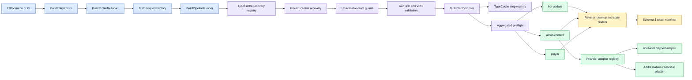

# Composable Build Pipeline

This module is the project-owned entry point for reproducible Unity content and Player builds. It turns a `BuildData` profile into a read-only invocation request, recovers every registered project-central transaction, validates the request and version snapshot, compiles the requested step identifiers into a dependency-safe plan, executes it, restores transient Unity state, and writes a machine-readable result manifest.

The same orchestration is used from the Unity Editor and from batch mode. `Build.Pipeline.Editor.BuildEntryPoints` is the only supported orchestration entry point. Provider builders and integration adapters are implementation details; they are not separate build workflows.

## Architecture



The principal contracts are:

- `BuildData`: explicit, reviewable project build profile.
- `BuildRequest`: read-only invocation descriptor containing target, output policy, feature switches, selected steps, and explicit profile/config references.
- `IBuildStep`: command contract with applicability, dependencies, preflight, execution, and cleanup.
- `BuildPlanCompiler`: registry lookup, dependency validation, stable topological ordering, and aggregated preflight.
- `IBuildRecoveryParticipant`: project-root-only recovery contract discovered independently of the current request, selected provider, feature applicability, and configuration asset.
- `IAssetContentBuildAdapter`: provider-neutral content build boundary.
- `IAssetContentPlayerBuildSessionFactory`: optional provider hook for validating, opening, and restoring Player-build-only state.
- `IBuildEventSink`: observer boundary; the default sink emits structured Unity Console messages.
- `BuildPipelineRunner`: lifecycle owner and result producer.

The core Editor assembly references only `Build.Data` and `Build.VersionControl.Editor`. Optional package APIs are isolated behind reflection or a version-gated integration assembly, so removing an optional package does not make the core build assembly uncompilable. Removal must still respect durable state: if the YooAsset integration is unavailable while its project-central transaction directory contains recovery evidence, the core guard fails closed and instructs the operator to reinstall a supported YooAsset 3 package and finish recovery before removing it.

Adapter discovery is snapshotted once per `BuildExecutionContext`, including an unavailable adapter or a resolution failure. Content validation, content execution, and the Player hook therefore share one adapter instance and cannot observe different registry state during the same run.

### Source layout

The module root first separates runtime data, Editor services, orchestration, and tests by assembly boundary:

```text
Assets/Build/
  Runtime/Data/          Player-safe version data (`Build.Data`)
  Editor/VersionControl/ Deterministic VCS metadata adapters (`Build.VersionControl.Editor`)
  Editor/BuildPipeline/  Authoring and build orchestration (`Build.Pipeline.Editor`)
  Tests/Editor/          Package-independent EditMode regression suite
  README.md              Canonical English module guide
  README.SCH.md          Synchronized Simplified Chinese guide
```

`Editor/BuildPipeline` is then organized by responsibility rather than by incidental build order:

```text
Editor/BuildPipeline/
  Authoring/       Build profiles, provider configurations, and custom Inspectors
    Content/       Addressables/YooAsset configs without optional package API references
    HotUpdate/     HybridCLR authoring assets
  Core/
    Capabilities/  Optional capability policies such as Cheat
    Contracts/     Provider-neutral requests, steps, registrations, and results
    Discovery/     TypeCache registries and reflection caching
    Execution/     Request creation, command-line parsing, profile resolution, and runner
    Policies/      Identity and path safety policies
    Transactions/ Project-central recovery and core state transactions
  Steps/           Built-in hot-update, asset-content, and Player commands
  Integrations/    Narrow package adapters: Addressables, HybridCLR, Obfuz, and YooAsset3
  EntryPoints/     The sole Editor and CI composition root
```

`Authoring` stores package-independent build intent and may use dependency-free metadata or read-only reflection for designer tooling. `Steps` orchestrates that intent. `Integrations` is the only layer that executes optional package APIs or holds strong package references. Package-specific tests stay inside their version-gated integration, while package-independent regression tests stay under `Tests/Editor`. A directory name therefore has one architectural meaning. There is no second top-level YooAsset, HybridCLR, Obfuz, or Pipeline implementation.

## Quick start

1. Create a profile with `Assets > Create > CycloneGames > Build > Build Profile`.
2. Explicitly set company name, product name, application identifier, application version prefix, and a project-relative output root. The three identity fields intentionally have no template defaults and fail preflight when empty.
3. Assign the launch scene and any additional scenes when the recipe will build a Player. Content-only and hot-update-only recipes do not require a launch scene.
4. Configure optional capabilities. For external content, select a Provider and assign or create its type-checked configuration asset. If HybridCLR is enabled, assign a `HybridCLRBuildConfig` and complete the package provisioning described below.
5. In **Build Recipe**, apply `Player + Dependencies`, `Content + Dependencies`, or `Hot Update Only`. Use the registry-backed list only when a Custom recipe is required.
6. Review **Current Recipe**, **Expected Outputs**, inactive steps, and the copyable CI override. Authoring errors disable the run actions before a build can start.
7. Run the displayed profile directly from **Run This Recipe**, or select a `BuildData` asset and use `Build > Pipeline > Run Selected Recipe`.

The preset is an Editor command, not serialized state. Applying one replaces only the ordered `pipelineSteps` array and participates in Unity Undo. The saved stable IDs remain the single source of truth for the Inspector, menu commands, `BuildRequest`, and CI.

| Inspector preset | Saved steps | Result |
| --- | --- | --- |
| `Player + Dependencies` | `hot-update`, `asset-content`, `player` | Builds the Player. HybridCLR and content steps execute only when their capabilities are configured. |
| `Content + Dependencies` | `hot-update`, `asset-content` | Builds content packages without a Player. When HybridCLR is enabled, its required DLL outputs are built first; otherwise `hot-update` is skipped. |
| `Hot Update Only` | `hot-update` | Builds HybridCLR hot-update and AOT metadata outputs without content packages or a Player. |
| Custom | Any registered ordered IDs | Keeps package and project extensions composable; authoritative dependency validation remains in pipeline preflight. |

The Content preset is available after a Provider and configuration reference are assigned; the Inspector validates the matching configuration type and adapter availability before enabling Run actions. The Hot Update preset is available after HybridCLR and its configuration are enabled. This prevents a one-click recipe from reporting success with no applicable output.

Useful Editor commands are:

| Menu | Behavior |
| --- | --- |
| `Build/Pipeline/Print Selected Profile` | Resolves the active profile and prints its effective identity, scenes, steps, feature switches, and provider-adapter availability. |
| `Build/Pipeline/Run Selected Recipe/Release (Clean)` | Runs the selected Profile recipe as a clean release build for the active target. |
| `Build/Pipeline/Run Selected Recipe/Release (Incremental)` | Runs the selected Profile recipe as an incremental release build. |
| `Build/Pipeline/Run Selected Recipe/Development (Clean)` | Runs the selected Profile recipe as a clean development build with debugging and profiler connection enabled. |
| `Build/Pipeline/Run Selected Recipe/Development (Incremental)` | Runs the selected Profile recipe as an incremental development build. |
| `Build/Pipeline/Android/Export Player Gradle Project` | Runs a clean Android Gradle Player export. The selected recipe must contain `player`. |

Inspector buttons always run the exact Profile displayed by that Inspector, including when the Inspector is locked and another asset is selected. The Profile is saved first and execution is deferred until the current IMGUI event completes. Menu commands still resolve the selected Profile, and both paths use the same `BuildRequestFactory` and `BuildPipelineRunner`. Content-only is therefore a visible preset and one-click workflow, not a second provider-specific orchestration path. CI can use the same saved recipe or override it with `-pipelineSteps`.

## Build profile

`BuildData` is the single source of project build intent. Store profiles under `Assets/` and commit them with their referenced configuration assets.

| Field | Contract |
| --- | --- |
| Launch Scene | First scene in the Player build. It must resolve to an existing `.unity` asset when the recipe contains `player`; content-only and hot-update-only recipes do not require it. |
| Additional Scenes | Appended in array order. Duplicate scene paths are removed. |
| Application Version | Portable file-name segment and version prefix. The canonical package version is `<prefix>.<commit-count>`. |
| Output Base Path | Required portable project-relative directory below the Unity project root, for example `Build`. |
| Company Name | Required with no template default; applied to `PlayerSettings` only for the build transaction. |
| Product Name | Required portable file name with no template default; applied transactionally and used for default artifact names. |
| Application Identifier | Required with no template default; applied to the requested `NamedBuildTarget` during the transaction. |
| Version Info Destination | Drag an existing `VersionInfoData` asset or an `Assets/` folder, or use Browse. The Inspector derives and displays the deterministic `VersionInfoData.asset` path; CI may override it with `-pipelineVersionInfo`. Missing parent folders are created and owned only for the build transaction. |
| Build Recipe | Registry-backed, reorderable step list with safe presets, effective-output summary, inactive-step diagnostics, and a copyable CI override. The serialized contract remains only an ordered ID list. Empty, duplicate, unknown, missing-dependency, no-output, and cyclic plans fail. |
| Use HybridCLR | Makes `hot-update` applicable and required by content and Player steps. |
| Enable Player Obfuscation | Declares the required base Obfuz Player-pipeline state independently of hot-update DLL obfuscation. When Obfuz is installed, this must already match the saved Obfuz project setting. |
| Cheat Build Mode | `Disabled`, development-only, or enabled. `ENABLE_CHEAT` is passed through `BuildPlayerOptions.extraScriptingDefines`; global PlayerSettings defines are not mutated. |
| Asset Content Provider | Registry-backed Provider choice. `None` disables external content. Canonical IDs are lowercase `yooasset` and `addressables`; custom IDs require no core enum. The Inspector shows the ID read-only for CI use. |
| Asset Content Configuration | Type-checked object reference constrained by the selected Provider authoring descriptor. It is passed unchanged to the selected adapter and must be set exactly when the Provider is selected. |
| HybridCLR Config | Explicit configuration reference required when HybridCLR is enabled and the recipe includes `hot-update`. |

Profile selection is deterministic:

- In the Editor, the selected `BuildData` asset wins. Without a selection, exactly one profile must exist.
- In batch mode, `-pipelineProfile Assets/<path>/<profile>.asset` selects the profile. Without it, exactly one profile must exist.
- Profile paths must be project-relative `.asset` paths below `Assets/`; rooted paths and traversal segments are rejected.

Version-control metadata providers are discovered through `IVersionControlProviderDetector`. Built-in priorities prefer a Git workspace over Perforce environment variables; equal highest-priority matches fail instead of selecting nondeterministically. `Capture()` returns one validated snapshot: Git verifies that `HEAD` did not change while reading hash, count, branch, and date and retries once, while Perforce validates the latest submitted changelist plus Stream/Client identity. Batch-mode and release builds require a supported provider and coherent metadata and fail rather than publishing a fallback version. Only an interactive Development build may use the explicit `LocalDevelopment` fallback. The full content and Player version is `<ApplicationVersion>.<CommitCount>`.

## Pipeline semantics

The built-in steps are:

| Step ID | Applicable when | Dynamic dependencies | Responsibility |
| --- | --- | --- | --- |
| `hot-update` | `UseHybridCLR` is enabled | None | Runs full or fast HybridCLR generation, optional hot-update obfuscation, copies generated DLL data, and verifies required outputs. |
| `asset-content` | Content-provider ID is non-empty | `hot-update` when HybridCLR is enabled | Resolves exactly one provider adapter, validates it, builds all configured packages, and records structured content results. |
| `player` | Always | Enabled `hot-update` and/or `asset-content` | Cleans or prepares the dedicated Player output, validates scenes and optional features, invokes Unity `BuildPipeline.BuildPlayer`, and verifies the report. |

Steps are discovered with Unity `TypeCache`. Registration attributes are compared before construction: only the unique highest-`Priority` type for each requested ID is instantiated, so an overridden lower-priority plugin cannot break the winning implementation from its constructor. Two types at the same winning priority are an error. The compiler evaluates each step's applicability exactly once and stores that decision in the compiled plan, so later steps cannot change whether another step executes by mutating shared context. Dependencies are evaluated against the same applicability snapshot, every required step must be selected and applicable, and stable topological sorting preserves configured order wherever dependencies do not constrain it.

Each entry point resolves authoring input and creates one immutable `BuildRequest` before execution. Cheat effectiveness, Provider binding, paths, target, incrementality, and step IDs are therefore resolved once and reused by preflight and every step; execution does not re-read mutable `BuildData` fields.

Recovery participants are also discovered with `TypeCache`, ordered deterministically by ID, and resolved by unique highest priority before construction. Built-in participants recover global Unity state, HybridCLR outputs, Player publication, and Addressables settings/publication; the version-gated YooAsset assembly contributes its own participant. Every participant runs before request validation, version-control capture, feature applicability, adapter resolution, or plan compilation. A disabled feature, changed profile, removed provider selection, or invalid current request therefore cannot hide an interrupted transaction.

All applicable steps complete preflight before any build step runs. Execution stops at the first failure. Every step that started execution receives `Cleanup` in reverse order, including when execution fails. Cleanup and state-restoration failures are combined with the original failure instead of being hidden.

The default `ConsoleBuildEventSink` reports run start, step start/finish, duration, status, output, and result path. Code-based integrations can inject another `IBuildEventSink` into `BuildPipelineRunner` without changing step implementations. Observer callbacks are isolated from orchestration: an exception from `RunStarted`, `StepStarted`, `StepFinished`, or `RunFinished` is captured as an observer failure and never changes step execution or the run's success status.

## Optional integrations

**YooAsset 3**

The typed adapter lives in `Editor/BuildPipeline/Integrations/YooAsset3`. Its asmdef uses the UPM package ID `com.tuyoogame.yooasset` and the version expression `[3.0.5,4.0.0)`. The assembly is compiled only when that range is satisfied, and directly references `YooAsset` and `YooAsset.Editor`.

`YooAssetBuildConfig` contains only provider build intent:

- `buildOutputRoot`: project-relative package output root; empty resolves to `Bundles`.
- `bundledFileRoot`: project-relative built-in content root under `Assets/StreamingAssets`; empty uses YooAsset's configured StreamingAssets root.
- `packages`: explicit package profiles with enablement, package name, YooAsset pipeline, note, compression, file-name style, bundled-copy policy/tags, dependency database, bundle sharing, result verification, and exact-version collision policy.

When compatible YooAsset collector settings are installed, the package field is a dropdown populated from the configured collector packages. The stable package name remains serialized for deterministic CI. If collector settings are unavailable, authoring remains compilable and the current value is preserved for diagnosis rather than silently replaced.

Package names must exist in YooAsset collector settings. Portable path components are checked case-insensitively for collisions and are limited by both character and 240-byte UTF-8 budgets; output and bundled roots must not overlap or traverse redirected paths. Every package and bundled snapshot is staged and validated before a durable-journal directory-swap transaction publishes the complete set. `FailIfVersionExists` protects an existing exact version; `ReplaceExactVersion` backs up and replaces only the guarded exact-version directory, with reverse rollback on failure. A clean pipeline request intentionally does not set YooAsset `ClearBuildCacheFiles`, because YooAsset 3.0.5 can remove every historical version under the package root. Results are emitted only after the complete publication commits.

If YooAsset is absent or outside the supported range, the integration assembly is excluded and the core still compiles. With no retained recovery state, selecting YooAsset fails preflight because no supported adapter is available. With retained state, the dependency-free guard fails earlier and preserves the evidence until the integration is reinstalled and recovery succeeds.

**Addressables**

Addressables uses a single canonical content path through `AddressablesBuilder.Build(target, version, config, clean)`. Its package API boundary is reflection-based, so the core compiles when Addressables is absent; selecting it without the required supported Editor API fails preflight.

The adapter:

- requires saved Addressables settings and configuration assets;
- snapshots every affected configuration asset and its `.meta`, including exact bytes, length, SHA-256 identity, timestamp, and attributes, before temporary settings changes;
- creates a durable settings transaction before setting `BuildRemoteCatalog` and `OverridePlayerVersion`, then restores both reflected values and the exact persisted files before content publication can commit;
- performs a real clean through the active data builder's overridden `ClearCachedData` when the request is clean;
- writes `AddressablesVersion.json` into `Addressables.BuildPath` using the canonical full version;
- optionally publishes the current build registry transactionally to `Build/AddressablesContent/<BuildTarget>` by default;
- publishes `PlayerData`, available `RemoteContent`, build metadata, and explicitly approved additional roots, then writes `AddressablesArtifacts.json`;
- stages publication, validates every registered file and its SHA-256 identity, swaps the destination, and restores the previous publication if the swap fails.

Addressables settings and publication share the project-wide `Library/BuildPipeline/Addressables/build.lock`. The unconditional `AddressablesRecoveryCoordinator` first recovers `<project>/.buildpipeline/transactions/addressables-settings/active.json`, then `<project>/.buildpipeline/transactions/addressables/active.json`, before the current request or provider is validated. The settings journal owns a transaction directory through `transaction.owner`, stores bounded asset/`.meta` snapshots, and performs atomic restoration with fixed `NNNN.restore.tmp`/`.bak` scratch inside that owned directory; it never leaves random scratch beside authored assets. Missing, foreign, corrupt, redirected, or identity-conflicting journal, owner, snapshot, and scratch state fails closed and remains available for inspection.

The checksummed, bounded publication journal records the exact publication root and brackets every directory move, so recovery still finds an interrupted transaction after the configured output root changes. Its atomic journal candidates use the fixed `active.json.tmp` and `active.json.bak` names and are validated before recovery promotes or removes them. An interrupted pre-commit transaction restores the exact previous publication; a durable committed transaction keeps the new publication and finishes cleanup. Corrupt journals, detached stage/backup directories, redirected paths, identity changes, and ambiguous states fail closed and remain available for inspection. Every stage receives a transaction-specific ownership marker before files are copied; no unverified non-empty stage is recursively deleted.

Every non-empty destination must be owned by this pipeline through `.buildpipeline-owner.json` and the exact `AddressablesArtifacts.json` file/hash inventory. Empty destinations may be claimed. Legacy or manually populated non-empty destinations are intentionally not adopted: back them up and remove or relocate them once, then let a successful build establish ownership. Cleanup failures remain build failures and never discard the primary publication failure.

During the Player step, the provider-neutral Player-build hook opens a scoped processor that temporarily selects `DoNotBuildWithPlayer`, validates the canonical version artifact in the provider-owned build data, and lets the official Addressables Player processor map that data to `StreamingAssets/aa`. The hook holds the same project lock and uses the same durable settings transaction, so the original reflected setting plus every captured configuration asset and `.meta` are restored exactly afterward, including after interruption. External profile publication sources are rejected unless the config explicitly enables them; URI, protected, top-level, overlapping, and redirected paths remain invalid.

**HybridCLR and Obfuz**

HybridCLR package types are resolved through a narrow reflection boundary. Enabling HybridCLR requires:

- an assigned `HybridCLRBuildConfig`;
- an installed and initialized HybridCLR package exposing the required Editor commands;
- at least one hot-update assembly, also configured in `HybridCLR Settings > Hot Update Assembly Definitions`;
- distinct, non-overlapping project-relative output directories below `Assets/` for hot-update DLLs and AOT DLLs.

A full request runs HybridCLR prebuild generation. `-pipelineIncremental` uses DLL compilation only and reuses existing stripped-AOT inputs; run a full build after assembly, signature, generic, or AOT dependency changes. The step verifies every configured `.dll.bytes`, `HotUpdate.bytes`, and `AOT.bytes` before it can succeed. HybridCLR publication has exactly two roles: hot-update assemblies and AOT metadata assemblies.

Each HybridCLR output directory is a flat, Build-exclusive publication. Ownership manifest schema `2` records the owner, role, publication transaction ID, and every artifact or in-directory Unity `.meta` with its kind, exact relative path, byte length, and SHA-256 hash. The journal additionally records the manifest identity and a deterministic hash of the complete managed tree. Every identity is revalidated immediately before a move or deletion, so an external replacement fails closed instead of being published, restored, or removed. An existing empty directory can be claimed; an existing non-empty directory must already contain a valid matching schema-2 manifest. Unknown files, subdirectories, reparse points, corrupt or legacy manifests, missing entries, orphan `.meta` files, identity changes, and casing-aliased or overlapping destinations fail without deletion. Legacy non-empty output directories are intentionally not auto-adopted: back them up, remove or relocate their contents, and let the next build establish ownership.

All configured outputs are generated and validated in the stable project state root `<project>/.buildpipeline/transactions/hybridclr/<transaction-id>` before publication. The reusable `build.lock` in that root rejects overlapping HybridCLR output transactions. Stages and root-meta recovery copies stay in that stable transaction directory; each old output directory is renamed to a transaction-specific backup beside its target, keeping the publication swap on the target volume. The bounded schema-2 `active.json` journal stores canonical project/state/scratch roots, every exact target, root-meta, stage, backup, and recovery path, initial and staged identities, transaction and operation phases, a monotonically increasing sequence, and a SHA-256 checksum. Initial creation and every update use a write-through temporary candidate followed by atomic installation; if `active.json` is missing, recovery can reconstruct it only from the unique newest valid candidate. Every filesystem move is bracketed by durable pending and completed states, and committed or rolled-back cleanup is itself a resumable journal phase. Recovery reads the old target set exclusively from the central journal before evaluating the current HybridCLR configuration, so a path change cannot orphan a previous transaction. Transactions that never reached durable `Committed` restore the original output set in reverse order; committed transactions retain the new outputs and finish cleanup. Corrupt or legacy journals, candidates from different transactions, same-sequence conflicts, redirected paths, identity changes, ambiguous copies, and detached transaction directories fail closed and remain available for inspection.

Existing artifact `.meta` files are copied into staging and covered by the ownership hash inventory, preserving their GUIDs and references. The sibling `.meta` for every configured output root is also part of the transaction: an existing sidecar is durably copied before the directory can disappear, while an initially missing sidecar is generated deterministically and moved with journaled pending/completed states. Recovery therefore restores the exact prior GUID or removes the transaction-created sidecar after a crash. `AssetDatabase.Refresh` runs only after the complete output set commits or recovery completes atomically. A failed rollback retains the journal, scratch, and sibling backups and reports an aggregate failure. If cleanup fails after durable commit, the step reports failure with the journal path and clearly states that the new outputs are already active.

Player obfuscation and hot-update DLL obfuscation are independent switches. Player obfuscation requires a provisioned base Obfuz settings asset and a compiled Encryption VM. Hot-update obfuscation additionally requires the atomic HybridCLR + Obfuz + Obfuz4HybridCLR package set. HybridCLR generation invokes its command API directly and never suspends, enables, disables, or saves the Player Obfuz setting; the latter only gates Obfuz's Unity Player-build and linker callbacks. The build pipeline validates these prerequisites but does not install packages, initialize HybridCLR, generate secrets, or provision Obfuz settings; those are explicit project provisioning operations.

**Cheat module**

The Cheat module is an optional Player capability and is independent of `HybridCLRBuildConfig`. `Cheat Build Mode` and the command-line override resolve the effective `ENABLE_CHEAT` state once while creating `BuildRequest`. If a Player request asks for Cheat support while `CycloneGames.Cheat.Runtime` is absent from the target Player compilation, preflight fails. If Cheat support is not requested but that runtime assembly receives `ENABLE_CHEAT` through PlayerSettings or effective compiler response-file defines, preflight also fails so a release cannot silently inherit the capability.

For ordinary Player builds, the effective capability is supplied through `BuildPlayerOptions.extraScriptingDefines` without mutating global PlayerSettings defines. HybridCLR 8.12's public compile command does not expose an equivalent per-invocation extra-define input. Consequently, a Player recipe that combines HybridCLR with effective Cheat support fails preflight by design. A hot-update/content-only recipe remains independent because it does not build a Player with the Cheat capability. This fail-closed rule prevents Player and hot-update assemblies from being compiled under different symbol sets. Supporting the combined Player case requires a separately installed, version-gated compilation strategy with verified HybridCLR API support; it must not be approximated through global define mutation.

## Outputs, cleanup, and state

Every Player artifact owns a dedicated output directory. Default paths are below the profile output root:

```text
<OutputBasePath>/<Platform>/<Release|Development>/<artifact>
```

For file outputs, the parent directory is the dedicated directory. For folder outputs (iOS, WebGL, macOS app bundles, and Android project export), the output path itself is the dedicated directory. Transaction staging preserves that directory's final leaf name, so a macOS `Product.app` is also built at a staged path ending in `Product.app` rather than a generic payload directory.

A clean request is the default. It builds into an empty same-volume transaction stage while the last-known-good dedicated directory remains untouched. `-pipelineIncremental` first copies the complete previous directory into staging and then builds incrementally there. After Unity succeeds, the transaction verifies the staged tree, moves the previous directory to a transaction-specific backup, promotes the stage, writes the new ownership marker, and removes the verified backup. Its durable journal either rolls back or finishes that swap after interruption. This replaces stale executable siblings such as `_Data`, symbols, and runtime files as one publication unit without exposing a partial build. Recursive deletion refuses the project root, the approved build root or any of its ancestors, protected directories (including casing aliases), any path through a reparse point, any reparse-point entry anywhere in the owned directory tree, and a tree containing more than 1,000,000 entries. A clean request adds Unity `CleanBuildCache`; `-pipelineIncremental` does not. Never place unrelated files in a Player output directory.

The published sibling marker is `<dedicated-output>.buildpipeline-player-owner.json`. An existing marker is accepted only when its schema, checksum, transaction identity, and complete tree identity match the current output. A foreign, corrupt, detached, or stale marker fails closed and is never overwritten. `Begin`/prepare failures recover any transaction-owned scratch and release the Player lock; if recovery also fails, the original and cleanup failures are both reported.

Without `-pipelineAllowExternalOutput`, the artifact and its dedicated directory must be strict descendants of `OutputBasePath`. `-pipelineOutput` is resolved from the Unity project root when explicitly supplied. External output is an explicit opt-in and still rejects volume roots, top-level volume entries, protected Unity directories, well-known operating-system directories, reparse points, and unsafe traversal. `OutputBasePath` itself is always project-relative and portable.

The runner treats Unity state as a durable transaction:

- it requires clean, writable `PlayerSettings` state before both recovery and a new build;
- requires the active target to equal the request before any mutation and never calls `SwitchActiveBuildTarget`; scripting backend, company/product/version/identifier, and Android export mode are captured and restored transactionally;
- acquires the project-wide `Library/BuildPipeline/GlobalState/build.lock` before recovery or mutation and retains it until both the `VersionInfoData` and global scopes finish;
- writes a checksummed, size-bounded `Library/BuildPipeline/GlobalState/active.json` write-ahead journal and durable sidecar snapshots before changing `ProjectSettings/ProjectSettings.asset` or `VersionInfoData`;
- applies request state, verifies that the persisted file still matches the original snapshot, then opens a main-thread-scoped `OnWillSaveAssets` allowlist around Unity's project save so only the canonical `ProjectSettings/ProjectSettings.asset` path can be written; it immediately captures a content token, revalidates the clean Unity API state, durably records the complete serialized post-image (including Unity- or license-enforced fields) only while that token still matches, and verifies the file again after journal publication;
- verifies the authorized disk content, clean in-memory `PlayerSettings`, active target, requested Unity API values, Android export mode, and durable Obfuz state immediately before and after `BuildPlayer`; an unknown byte or API change blocks Player publication, retains recovery evidence, and is never adopted retroactively;
- restores both Unity APIs and the exact original bytes, timestamp, and attributes; atomic replacement keeps the displaced file as a witness and deletes it only after its content matches an authorized pre-image, so an ambiguous crash or competing write stops fail-closed without deleting the competing bytes;
- stages `VersionInfoData` at a transaction-derived path, records asset and `.meta` identities before installation, then restores the original pair or removes the proven transient pair; when its parent is missing, the journal owns a marked temporary folder tree and removes that tree and its generated folder `.meta` files after validation;
- rejects corrupt journals, changed project paths, reparse points, detached transaction artifacts, changed snapshot identities, and externally replaced transient files instead of guessing;
- never temporarily saves Obfuz settings. When Obfuz is installed, `EnablePlayerObfuscation` must match the state already persisted in `ProjectSettings/Obfuz.asset` before the build starts;
- restores Addressables settings and configuration snapshots in the Addressables scopes;
- reports restoration failure as a failed run.

The pipeline never claims an existing authored parent folder. If part of the configured parent path is absent, it creates the missing suffix from the first absent directory under `Assets/`, writes a transaction marker before publication, and accepts only the exact generated directory, folder-meta, marker, staging, and target inventory during cleanup. Any foreign entry or conflicting filesystem type fails closed and retains the journal. A retained global-state journal is recovery evidence, not a disposable cache: resolve the reported corruption or identity conflict before removing it manually.

Build-owned persistence is explicit:

Keep `<project>/.buildpipeline/` out of source control. It contains workspace-local locks and durable transaction evidence: it is not a configuration source, but an active or failed journal must be inspected and recovered rather than casually deleted.

| Owner | Path | Lifetime and source-control policy |
| --- | --- | --- |
| Project configuration | `Assets/**/BuildData.asset` and referenced config assets | Durable source of truth; commit to version control. |
| Package resolution | `Packages/manifest.json` and `Packages/packages-lock.json` | Reviewable dependency intent and resolved immutable dependency graph; commit both, restore both in CI, and treat unexpected lock drift as a supply-chain change. |
| Player artifacts | `<OutputBasePath>/<Platform>/<Variant>/...` or approved external directory, plus sibling `<dedicated-output>.buildpipeline-player-owner.json` | Reproducible build output; normally ignored and archived by CI. The complete dedicated directory is published transactionally, and only a validated pipeline ownership marker may be replaced. |
| Run results | `<OutputBasePath>/.buildpipeline/results/<run-id>.json` | Durable CI evidence; archive as build metadata. It is not deleted with a sibling Player output directory. |
| Player publication transaction | `<project>/.buildpipeline/transactions/player/active.json`, `active.lock`, and transaction-specific same-volume stage/backup paths beside the dedicated output | Checksummed journal, exclusive project lock, staged tree identities, ownership markers, and resumable rollback/publication. Successful completion or recovery removes the journal and scratch; the reusable lock file may remain. Corrupt, foreign, detached, changed, or ambiguous state remains visible and blocks publication. |
| Global Unity-state transaction | `Library/BuildPipeline/GlobalState/active.json`, `transaction-<id>/`, `build.lock`, transaction-derived `.globalstate-{install|restore}-<id>.{tmp|bak}` file siblings, and temporary `Assets/**/__BuildPipelineParent_<id>` folder scratch | Checksummed bounded journal, original-file snapshots, deterministic atomic-replacement scratch, transaction-owned missing-parent inventory, and a project-wide exclusive lock for `ProjectSettings.asset` plus transient `VersionInfoData`. Successful completion/recovery removes the journal, transaction directory, owned folder tree, and scratch; the reusable lock file may remain. Corrupt, detached, redirected, moved-project, foreign-entry, or identity-conflicting state remains visible and blocks another build. Ignore the `Library/` state in source control, but do not delete an active or failed journal without inspection. |
| YooAsset packages | Configured `buildOutputRoot` | Versioned provider artifacts; collision behavior is explicit per package. Archive or publish as required. |
| YooAsset built-in files | Configured `bundledFileRoot` under `Assets/StreamingAssets` | Player input managed by the selected bundled-copy policy; not automatically removed after a content build. |
| YooAsset transaction state | `<project>/.buildpipeline/transactions/yooasset3/active.json` and `work/<transaction-id>`; reusable path-keyed locks below `<project>/Temp/BuildPipeline/YooAsset3Locks` | Project-central recovery evidence, staging, protected root-`.meta` copies, same-volume backups, and serialization independent of the current profile roots. Successful completion removes journal/work/backup/protected-meta state; reusable locks may remain. If the integration is removed while any state remains, the core guard blocks all builds until a supported YooAsset 3 integration recovers it. |
| Addressables cache | Provider-owned `Addressables.BuildPath` and active builder cache | Rebuildable provider output. A clean content build clears the active builder cache. |
| Addressables publication | Configured publication root, default `Build/AddressablesContent/<BuildTarget>` | Pipeline-owned transactional output with `.buildpipeline-owner.json` and the exact `AddressablesArtifacts.json` inventory; normally ignored and archived/published by CI. |
| Addressables publication transaction | `<project>/.buildpipeline/transactions/addressables/{active.json,active.json.tmp,active.json.bak}` and transaction-specific same-volume stage/backup paths | Project-central checksummed journal and atomic candidates. Successful recovery removes journal scratch and owned stage/backup state; corrupt, detached, changed, or ambiguous state remains visible and blocks publication. |
| Addressables settings transaction | `<project>/.buildpipeline/transactions/addressables-settings/active.json`, `<transaction-id>/transaction.owner`, bounded asset/`.meta` snapshots, and owned `NNNN.restore.{tmp|bak}` scratch; shared `Library/BuildPipeline/Addressables/build.lock` | Exact persisted-settings restoration independent of provider selection and current configuration. Owner and snapshots are validated before restore or cleanup. Successful restoration removes the transaction directory and journal; foreign, corrupt, redirected, or identity-conflicting state remains visible and blocks every build. The project `.buildpipeline/` tree is durable recovery evidence, not a disposable Unity cache. |
| HybridCLR generated assets | Configured distinct directories below `Assets/`, each containing `.buildpipeline-owner.json` | Build-exclusive, transactionally replaced Player input. Same-name `.meta` files are preserved. Commit the complete managed directory (including its manifest and generated `.meta`) or regenerate it in CI; never place authored assets in it. |
| HybridCLR durable transaction state | `<project>/.buildpipeline/transactions/hybridclr/active.json`, `active.json.tmp-*`, `<transaction-id>/`, and `build.lock`; sibling `.buildpipeline-hybridclr-<transaction-id>-<index>.backup` directories beside active targets | Checksummed schema-2 recovery journal, atomic journal candidates, staging, root-meta recovery copies, same-volume publication backups, and project-wide serialization. Recovery does not depend on current configuration. Successful commit/recovery removes the journal, candidates, scratch, and sibling backups but retains the reusable lock file. Corrupt, legacy, conflicting, detached, ambiguous, externally changed, or incomplete recovery state remains visible and blocks publication. The project `.buildpipeline/` tree is ignored by Git but is durable recovery evidence, not a disposable Unity cache. |
| Version info | Configured `VersionInfoAssetPath` | Transactional only. An existing asset and `.meta` are restored exactly; otherwise the transaction-owned temporary pair is removed. A missing parent suffix is marked, journaled, created, and removed with its generated folder `.meta` files; pre-existing parent folders are never claimed. |

The module does not use `EditorPrefs`, `PlayerPrefs`, or `SessionState` as build configuration.

## Result manifest

Once a valid `BuildRequest` exists, every pipeline run attempts to write a UTF-8-without-BOM JSON manifest, including preflight and execution failures:

```text
<OutputBasePath>/.buildpipeline/results/<UTC-run-id>-<suffix>.json
```

Schema version `3` contains:

- run identity and success: `schemaVersion`, `runId`, `succeeded`, `failure`, and isolated `observerFailures`;
- environment and version: `unityVersion`, `target`, `applicationVersion`, `packageVersion`, `commitHash`, `versionControlProvider`, and `branch`;
- artifact location: `outputPath`, `outputDirectory`;
- top-level `steps`: ordered entries containing `id`, `status`, `durationSeconds`, and `message`;
- top-level `content`: provider/package/version results; `succeeded`, `failedTask`, `errorInfo`, and `errorStack`; output and bundled directories; provider report path; produced artifacts; and warnings.

The file is written durably through a fixed, exclusively created temporary sibling and atomically moved into place. The writer flushes bytes before publication, applies a 64 MiB manifest budget, never deletes a pre-existing temporary sibling it does not own, and preserves both write and owned-temporary cleanup failures. `RunFinished` is notified after execution/restoration and before manifest publication, so failures from every observer callback are included in the manifest without changing `succeeded`. A manifest publication failure is logged directly, returned as a failed run, and makes batch mode exit non-zero. Batch mode returns exit code `0` only when execution, restoration, and manifest publication succeed; parsing, profile resolution, request creation, project-central recovery, version-control capture, preflight, build, cleanup, restoration, or manifest-write failures return exit code `1`. Failures before a request and manifest root can be safely resolved are reported through the Unity log and exit code, without a result manifest.

## Command line and CI

Use the canonical method:

```text
-executeMethod Build.Pipeline.Editor.BuildEntryPoints.RunCommandLine
```

Build-specific options are case-insensitive. Every custom option is namespaced with `-pipeline`; unknown tokens in that namespace, duplicate options, missing values, and invalid mutually exclusive combinations fail immediately. Unity-native and third-party arguments outside that namespace pass through untouched. The pipeline never changes Unity's active target synchronously: in the Editor, select the target in File > Build Settings and wait for import, compilation, and domain reload to finish before invoking a menu command. In batch mode, pass Unity 2022.3's native startup alias: `Win64`, `OSXUniversal`, or `Linux64` for the three standalone targets, and `Android`, `iOS`, or `WebGL` unchanged. The pipeline parser also accepts `StandaloneWindows64`, `StandaloneOSX`, and `StandaloneLinux64` when invoked as script input, but those enum names are not valid substitutes for Unity's native standalone startup aliases. The resulting active target must exactly match the request or execution fails before any `PlayerSettings` mutation.

| Option | Value/default | Effect |
| --- | --- | --- |
| `-buildTarget` | Required request target and native Editor startup target | Native Unity 2022.3 values are `Win64`, `OSXUniversal`, `Linux64`, `Android`, `iOS`, and `WebGL`. The parser additionally maps the standalone enum names for script-driven calls. The corresponding target must already be active when the entry point runs. |
| `-pipelineProfile` | `Assets/.../*.asset`; optional only with exactly one profile | Selects the `BuildData` profile. |
| `-pipelineScriptingBackend` | `Mono2x` or `IL2CPP`; current target setting | Overrides the transaction-scoped backend. |
| `-pipelineOutput` | Generated platform/variant path | Explicit artifact path. Relative values are resolved from the Unity project root. |
| `-pipelineOutputRoot` | Profile value | Overrides the project-relative approved build root and manifest root. |
| `-pipelineVersion` | Profile value | Overrides the version prefix; commit count is still appended. |
| `-pipelineVersionInfo` | Profile value | Overrides the project-relative `Assets/**/*.asset` destination used for transient `VersionInfoData`. |
| `-pipelineSteps` | Profile list | Comma-separated explicit step IDs, for example `hot-update,asset-content,player`. |
| `-pipelineProvider` | Profile binding | Overrides the Provider with a canonical registry ID such as `yooasset` or `addressables`; `none` disables external content for this invocation. |
| `-pipelineProviderConfig` | Required with a non-`none` Provider override | Project-relative `Assets/**/*.asset` path to the configuration type declared by that Provider. |
| `-pipelineClean` | Default | Requests clean provider behavior and clean Player output. Mutually exclusive with `-pipelineIncremental`. |
| `-pipelineIncremental` | Off | Incremental content/Player behavior and HybridCLR DLL-only compilation. |
| `-pipelineDevelopment` | Off | Enables Unity development, debugging, and profiler-connect options. |
| `-pipelineExportAndroidProject` | Off | Exports a directory and is valid only with `-buildTarget Android` and a recipe containing `player`. |
| `-pipelineAllowExternalOutput` | Off | Allows an explicit `-pipelineOutput` outside the profile build root, subject to path safety rules. |
| `-pipelineUseHybridCLR` / `-pipelineSkipHybridCLR` | Profile value | Enables or disables HybridCLR for this request. Mutually exclusive. |
| `-pipelineEnableCheat` / `-pipelineDisableCheat` | Profile mode | Overrides cheat capability for this request. Mutually exclusive. |

Profiles remain the default, reviewable source of Provider intent. CI may use `-pipelineProvider` together with `-pipelineProviderConfig` for an explicit invocation-only binding, or `-pipelineProvider none` to disable external content without editing the asset. A no-Player recipe containing `asset-content` rejects `none`, because a successful run must not omit the requested content output. Provider IDs are matched case-insensitively at input and normalized to the registry's canonical lowercase ID. `-pipelineProviderConfig` without a Provider, or together with `none`, is rejected. Overrides do not create missing assets or install dependencies, so the same type, adapter-availability, and package preflight still runs.

Android package outputs must end in `.apk` or `.aab`; Android project export requires a directory path and a recipe containing `player`. `-pipelineExportAndroidProject` rejects package-file paths and content-only recipes instead of reporting success without a Gradle Player output. iOS, WebGL, macOS, and Android project exports are treated as folder outputs for dedicated-directory cleanup.

Example clean Windows IL2CPP build from PowerShell:

```powershell
& $UnityEditor `
  -batchmode `
  -nographics `
  -quit `
  -projectPath "$RepoRoot/UnityStarter" `
  -executeMethod Build.Pipeline.Editor.BuildEntryPoints.RunCommandLine `
  -pipelineProfile Assets/UnityStarter/Editor/Build/BuildData.asset `
  -buildTarget Win64 `
  -pipelineScriptingBackend IL2CPP `
  -pipelineOutput Build/CI/Windows/Release/UnityStarter.exe `
  -logFile "$RepoRoot/Artifacts/unity-build.log"

if ($LASTEXITCODE -ne 0) { exit $LASTEXITCODE }
```

Incremental no-Player YooAsset content example:

```powershell
& $UnityEditor `
  -batchmode `
  -nographics `
  -quit `
  -projectPath "$RepoRoot/UnityStarter" `
  -executeMethod Build.Pipeline.Editor.BuildEntryPoints.RunCommandLine `
  -pipelineProfile Assets/UnityStarter/Editor/Build/BuildData.asset `
  -buildTarget Android `
  -pipelineIncremental `
  -pipelineSteps hot-update,asset-content `
  -pipelineProvider yooasset `
  -pipelineProviderConfig Assets/UnityStarter/Editor/Build/YooAssetBuildConfig.asset `
  -logFile "$RepoRoot/Artifacts/unity-content.log"
```

This example overrides the selected Profile with canonical Provider ID `yooasset` and an explicit `YooAssetBuildConfig` asset path. When HybridCLR is disabled, omit `hot-update` from a custom content-only plan. When the content-provider ID is empty, omit `asset-content`. Dependencies are strict; the compiler does not insert missing steps.

**TeamCity**

Use a PowerShell build step and expose the Unity Editor path as a parameter such as `%env.UNITY_EDITOR%`:

```powershell
$unity = "%env.UNITY_EDITOR%"
$project = "%teamcity.build.checkoutDir%/UnityStarter"
$log = "%teamcity.build.checkoutDir%/Artifacts/unity-build.log"

& $unity -batchmode -nographics -quit `
  -projectPath $project `
  -executeMethod Build.Pipeline.Editor.BuildEntryPoints.RunCommandLine `
  -pipelineProfile Assets/UnityStarter/Editor/Build/BuildData.asset `
  -buildTarget Win64 `
  -pipelineOutput Build/CI/Windows/Release/UnityStarter.exe `
  -logFile $log

if ($LASTEXITCODE -ne 0) { exit $LASTEXITCODE }
```

Recommended TeamCity artifact rules:

```text
UnityStarter/Build/CI/** => player
UnityStarter/Build/.buildpipeline/results/*.json => build-metadata
Artifacts/unity-build.log => build-metadata
```

**Jenkins**

This declarative Windows stage uses the same entry point and archives both artifacts and metadata:

```groovy
stage('Unity Build') {
    steps {
        bat '''
        "%UNITY_EDITOR%" -batchmode -nographics -quit ^
          -projectPath "%WORKSPACE%\\UnityStarter" ^
          -executeMethod Build.Pipeline.Editor.BuildEntryPoints.RunCommandLine ^
          -pipelineProfile Assets/UnityStarter/Editor/Build/BuildData.asset ^
          -buildTarget Win64 ^
          -pipelineOutput Build/CI/Windows/Release/UnityStarter.exe ^
          -logFile "%WORKSPACE%\\Artifacts\\unity-build.log"
        '''
    }
    post {
        always {
            archiveArtifacts artifacts: 'UnityStarter/Build/.buildpipeline/results/*.json, Artifacts/unity-build.log', allowEmptyArchive: true
        }
        success {
            archiveArtifacts artifacts: 'UnityStarter/Build/CI/**', fingerprint: true
        }
    }
}
```

CI agents should pin the Unity Editor version from `ProjectSettings/ProjectVersion.txt`, restore the committed `Packages/manifest.json` and `Packages/packages-lock.json` as one reviewed dependency state, use an isolated workspace, save no dirty Editor state, archive the schema-3 manifest even on failure, and publish content only after the manifest reports success. The lock file is a required supply-chain input because it records immutable hashes for Git dependencies whose manifest URLs do not name a commit. Batch and release jobs must also provide a detectable Git or Perforce workspace; unavailable, incoherent, timed-out, or malformed VCS metadata is a hard failure rather than version `0` publication.

## Extending the pipeline

To add a step, annotate and implement a public, concrete `IBuildStep` with a parameterless constructor. Registration metadata must exactly match the runtime `Id` and `Priority` contract:

```csharp
[BuildStepRegistration("sign-artifacts")]
public sealed class SignArtifactsStep : IBuildStep
{
    public string Id => "sign-artifacts";
    public int Priority => 0;
    public bool IsApplicable(BuildExecutionContext context) => true;
    public IReadOnlyList<string> GetRequiredStepIds(BuildExecutionContext context) =>
        new[] { BuildStepIds.Player };
    public IReadOnlyList<string> Validate(BuildExecutionContext context) =>
        Array.Empty<string>();
    public void Execute(BuildExecutionContext context) { /* sign owned output */ }
    public void Cleanup(BuildExecutionContext context) { }
}
```

Step IDs are plain text of at most 128 characters, have no surrounding whitespace, and may not contain `,`, which is reserved as the `-pipelineSteps` delimiter. This guarantees every Inspector-authored recipe has an equivalent CI representation. Place the step in an Editor assembly, add `sign-artifacts` to the profile or `-pipelineSteps`, and add EditMode tests for applicability, dependencies, failure, and cleanup. Keep provider or platform APIs in a narrow integration assembly. Do not mutate global settings in a step without an owned snapshot-and-restore scope.

To add a content provider:

1. Define a provider-specific `ScriptableObject` configuration without exposing provider package types through core public API.
2. Add `AssetContentProviderAuthoring` to that configuration with a stable canonical ID, display name, and description. This metadata drives the Build Profile dropdown and typed Object field even when the package adapter is unavailable.
3. Create a separate Editor integration asmdef that references the core and provider assemblies.
4. Gate UPM packages with an exact `versionDefines` range plus an assembly `defineConstraints` capability.
5. Add `AssetContentAdapterRegistration` and implement `IAssetContentBuildAdapter` with matching stable, unique `ProviderId` and `Priority` values. The registry compares metadata first and instantiates only the unique highest-priority adapter for the requested provider.
6. If publication can outlive the process, add a public `IBuildRecoveryParticipant` with `BuildRecoveryRegistration`. It must locate and recover state from only the project root and its durable central journal, without the current profile, provider selection, configuration asset, or feature switch. Registration metadata is resolved by unique highest priority before construction, and recovery must either prove one state or fail closed.
7. Keep the participant available when practical even if the provider package is removed. If version gating must remove it, add a dependency-free residual-state guard so pending evidence blocks execution with an actionable reinstall-and-recover message. Do not add a configuration-dependent adapter recovery path; crash recovery must remain project-central and independent of the active request.
8. If the Provider needs temporary state around `BuildPipeline.BuildPlayer`, also implement `IAssetContentPlayerBuildSessionFactory`; the returned session owns restoration and must use the same durable transaction when persisted settings can change.
9. Select that Provider and a matching configuration asset in `BuildData`.
10. Return structured validation and per-package build results with verified artifact paths.
11. Test dependency-present, dependency-absent, provider-disabled, provider-removed-with-pending-state, interrupted preparation/commit/restore, and corrupt-state cases. The core must compile without the optional package.

Adding a provider does not require a core enum, a provider switch in the content step, or a new CLI flag. `BuildData.AssetContentConfiguration` is passed unchanged through the provider-neutral request boundary, and the registry resolves the adapter dynamically by ID.

Provider adapters with the same ID use the highest priority. Equal highest priorities fail to prevent nondeterministic selection.

## Validation and troubleshooting

Run the Editor tests after changing contracts, parsing, dependency compilation, or path policy:

```powershell
& $UnityEditor `
  -batchmode `
  -nographics `
  -quit `
  -projectPath "$RepoRoot/UnityStarter" `
  -runTests `
  -testPlatform EditMode `
  -assemblyNames Build.Pipeline.Tests.Editor `
  -testResults "$RepoRoot/Artifacts/build-pipeline-tests.xml" `
  -logFile "$RepoRoot/Artifacts/build-pipeline-tests.log"
```

Minimum release validation is:

1. Import and compile with each optional integration required by that release.
2. Run `Build.Pipeline.Tests.Editor`.
3. Print the selected profile and inspect effective steps and adapter availability.
4. Run a clean content build for the selected provider and verify provider artifacts.
5. Run at least one clean Player build for every release target/backend combination.
6. Confirm `ProjectSettings/ProjectSettings.asset` and a pre-existing version-info asset are byte-identical after success and an induced failure.
7. Parse the schema-3 manifest and verify every expected step, content result, provider failure field, and content artifact.
8. For IL2CPP/HybridCLR/Obfuz releases, perform the actual target Player build; static analysis or an Editor-only test is not an AOT/stripping validation.
9. Interrupt each enabled durable transaction at a fault checkpoint, then rerun with its feature disabled or the current request invalid. Verify project-central recovery still runs first; for a removed YooAsset integration, verify the residual-state guard preserves evidence and blocks execution.

| Failure | Meaning and action |
| --- | --- |
| Multiple profiles found | Select a profile in the Editor or pass `-pipelineProfile` in CI. |
| Missing/non-applicable dependency | Add the required step or disable the feature that declares it. |
| No supported provider adapter | Install a supported provider version or select another provider. |
| Pending YooAsset recovery state but integration unavailable | Reinstall a supported YooAsset 3 package, run the pipeline so the project-central participant completes recovery, verify `.buildpipeline/transactions/yooasset3` is empty, and only then remove the package again. Do not delete the retained evidence. |
| Version-control metadata unavailable or incoherent | Configure a detectable Git or Perforce workspace and retry. Batch/release builds never publish fallback versions; only an interactive Development build may use `LocalDevelopment`. |
| Player output is unsafe | Move it into a dedicated child of `OutputBasePath`; use external output only for an explicitly owned nested directory. |
| Active build target mismatch | In the Editor, switch in File > Build Settings and wait for compilation/reload. In CI, restart Unity with the matching native alias: `Win64`, `OSXUniversal`, `Linux64`, `Android`, `iOS`, or `WebGL`. |
| PlayerSettings has unsaved changes | Save or revert the settings before starting the transaction. |
| Addressables configuration is dirty | Save or revert Addressables settings, profiles, groups, schemas, and data builders. |
| YooAsset version already exists | Use a new canonical version or deliberately select exact-version replacement for that package. |
| HybridCLR ownership validation failed | The directory is non-empty but unowned, its manifest is invalid, or it contains undeclared content. Preserve authored files elsewhere; only empty or correctly managed exclusive directories are accepted. |
| HybridCLR output verification failed | Check package initialization, HybridCLR Settings, configured asmdefs, target, non-overlapping generated directories, and ownership manifests. |
| Obfuz preflight failed | Provision settings and compile the Encryption VM before invoking the build. |
| Manifest reports restore failure | Treat the run as failed; inspect the aggregated exception before reusing that workspace. |
| Observer failure recorded | Fix the injected event sink. The callback failure is diagnostic and isolated; use the run's `succeeded`, step results, and primary failure to decide artifact publication. |

When copying this module into another project, preserve `.meta` and asmdef files and create a project-specific `BuildData`. Explicitly fill company name, product name, and application identifier; the module provides no identity fallback that could leak a template package name. Then set project scenes/output paths, assign only the integrations the project actually uses, and make the same `RunCommandLine` method the CI entry point. Do not add a second orchestration path for a provider or platform.
