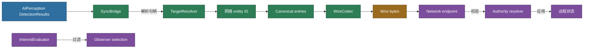

# CycloneGames.AIPerception.Networking

[English](./README.md) | 简体中文

`CycloneGames.AIPerception.Networking` 是 `CycloneGames.AIPerception` 到 `CycloneGames.Networking` 的桥接模块。它把检测结果转换为稳定网络标识，定义固定 v1 wire schema，校验不可信 payload，应用 server-authority 规则，并适配感知相关性到共享 interest evaluator。

## 目录

- [概述](#概述)
- [架构](#架构)
- [快速上手](#快速上手)
- [核心规则](#核心规则)
- [协议参考](#协议参考)
- [故障排查](#故障排查)

## 概述

本模块连接本地感知到网络。游戏的 composition root 显式持有 transport、endpoint、serializer 和 session，并连接到本 bridge。

| Assembly | 职责 | 引用 |
| --- | --- | --- |
| `CycloneGames.AIPerception.Networking.Core` | 协议 manifest、不可变 DTO header、profile fingerprint、校验、canonical hash、固定小端 codec | `CycloneGames.Networking.Core`、`CycloneGames.Hash.Core` |
| `CycloneGames.AIPerception.Networking.Runtime` | `DetectionResult` 映射、有界 canonical selection、authority 校验、共享 interest evaluator adapter | Core、`CycloneGames.AIPerception`、`CycloneGames.Networking.Core`、`Unity.Mathematics` |
| `CycloneGames.AIPerception.Networking.Tests.Editor` | golden bytes、round-trip、畸形输入、authority、interest 和 allocation 契约 | Core 和 Runtime |

Core assembly 不依赖 `UnityEngine`。Runtime assembly 桥接本地感知，不在 wire 上暴露 Unity object identity。

## 架构



## 快速上手

### 1. 选择并交换 profile

Profile 不可变，内置 profile 是可缓存的实例：

```csharp
using CycloneGames.AIPerception.Networking;

AIPerceptionNetworkProfile profile =
    AIPerceptionNetworkProfiles.ServerAuthoritative;

AIPerceptionManifestHandshakeMessage localHandshake =
    AIPerceptionManifestHandshakeMessage.CreateLocal(profile);
```

编码后通过项目 endpoint 发送：

```csharp
Span<byte> handshakeBytes =
    stackalloc byte[AIPerceptionNetworkWireCodec.HandshakePayloadBytes];

if (AIPerceptionNetworkWireCodec.TryWriteHandshake(
        in localHandshake,
        handshakeBytes,
        out int handshakeLength) != AIPerceptionNetworkWireCodecResult.Success)
{
    throw new InvalidOperationException("The local AIPerception handshake is invalid.");
}

NetworkSendResult sendResult = endpoint.SendToServer(
    AIPerceptionNetworkProtocol.MSG_MANIFEST_HANDSHAKE,
    handshakeBytes.Slice(0, handshakeLength),
    NetworkChannel.Reliable);
```

接收端必须先 decode 并协商，再启用感知流量：

```csharp
if (AIPerceptionNetworkWireCodec.TryReadHandshake(
        payload.Bytes,
        out AIPerceptionManifestHandshakeMessage remote) !=
    AIPerceptionNetworkWireCodecResult.Success)
{
    return;
}

AIPerceptionNetworkHandshakeResult negotiation = remote.Negotiate(profile);
if (negotiation != AIPerceptionNetworkHandshakeResult.Compatible)
{
    return;
}
```

### 2. 把 detection 映射到可复用 entry buffer

Resolver 连接本地 perception handle 与稳定网络 entity ID：

```csharp
var bridge = new AIPerceptionNetworkSyncBridge(profile);

// 每个 observer/session owner 分配一次并持续复用。
var entryBuffer = new AIPerceptionDetectionEntry[profile.MaxSnapshotEntries];

AIPerceptionDetectionEntryWriteResult write = bridge.WriteDetectionEntries(
    detections,
    targetResolver,
    entryBuffer,
    tick,
    sourceSensorId);

ReadOnlySpan<AIPerceptionDetectionEntry> entries =
    entryBuffer.AsSpan(0, write.WrittenCount);

if (!write.IsComplete)
{
    telemetry.RecordPerceptionSnapshotLoss(
        write.UnresolvedCount,
        write.InvalidCount,
        write.CapacityLimitedCount,
        write.DuplicateCount);
}
```

容量不足时，bridge 保留 canonical 顺序最小的 entries。容量损失总是显式报告。

### 3. 创建、编码并发送 snapshot

```csharp
AIPerceptionNetworkMessageValidationResult createResult = bridge.TryCreateSnapshot(
    observerNetworkId,
    AIPerceptionNetworkSensorKind.Any,
    entries,
    tick,
    sequence,
    authorityGeneration,
    out AIPerceptionDetectionSnapshotMessage snapshot);

if (createResult != AIPerceptionNetworkMessageValidationResult.Valid)
{
    return;
}

int payloadLength = AIPerceptionNetworkWireCodec.GetSnapshotPayloadBytes(entries.Length);
Span<byte> snapshotBytes = reusablePayloadBuffer.AsSpan(0, payloadLength);

if (AIPerceptionNetworkWireCodec.TryWriteDetectionSnapshot(
        in snapshot,
        entries,
        snapshotBytes,
        out int bytesWritten) != AIPerceptionNetworkWireCodecResult.Success)
{
    return;
}

if (endpoint.GetMaxPayloadSize(
        AIPerceptionNetworkProtocol.MSG_DETECTION_SNAPSHOT,
        profile.SnapshotChannel) < bytesWritten)
{
    return;
}

endpoint.SendToClient(
    connection,
    AIPerceptionNetworkProtocol.MSG_DETECTION_SNAPSHOT,
    snapshotBytes.Slice(0, bytesWritten),
    profile.SnapshotChannel);
```

Memory snapshot 使用 `MSG_MEMORY_SNAPSHOT` 和 `profile.MemorySnapshotChannel`。Empty snapshot（零 entry）表示权威空集合。

### 4. 安全接收 snapshot

在应用状态前先 decode 到可复用 destination：

```csharp
Span<AIPerceptionDetectionEntry> decodedEntries = receiveEntryBuffer;

AIPerceptionNetworkWireCodecResult decodeResult =
    AIPerceptionNetworkWireCodec.TryReadDetectionSnapshot(
        payload.Bytes,
        decodedEntries,
        out AIPerceptionDetectionSnapshotMessage snapshot,
        out int decodedCount);

if (decodeResult != AIPerceptionNetworkWireCodecResult.Success)
{
    return;
}

var inbound = new AIPerceptionRemoteSnapshotContext(
    senderConnectionId: payload.Connection.ConnectionId,
    authoritativeServerConnectionId: session.AuthoritativeServerConnectionId,
    isSenderAuthenticated: payload.Connection.IsAuthenticated,
    isServerToClient: payload.Direction == NetworkMessageDirection.ServerToClient,
    authorityGeneration: session.AuthorityGeneration,
    hasAppliedSnapshot: state.HasSnapshot,
    lastAppliedSequence: state.LastSequence,
    lastAppliedTick: state.LastTick);

AIPerceptionRemoteSnapshotResult authorityResult = authorityResolver.ValidateRemotePerception(
    in localAuthority,
    in inbound,
    in observer,
    in snapshot,
    decodedEntries.Slice(0, decodedCount));

if (authorityResult != AIPerceptionRemoteSnapshotResult.Allowed)
{
    return;
}

// 先提交状态，再发布 observer notification。
state.Apply(snapshot, decodedEntries.Slice(0, decodedCount));
```

## 核心规则

- `PerceptibleHandle` 永远不作为网络标识序列化。`IAIPerceptionNetworkTargetResolver` 提供稳定 `TargetNetworkId`。
- `TargetNetworkId` 必须非零，`PerceptibleTypeId` 必须非负。
- 所有多字节 wire 字段显式采用 little-endian。不使用 raw-struct copy、反射或通用 serializer。
- Snapshot entry 位于调用方持有的 span，snapshot message 只包含 metadata 和 `EntryCount`。
- Entry 必须严格遵循 `AIPerceptionNetworkHash.CompareCanonical` 顺序。乱序或重复 payload 被拒绝。
- `SensorKind.Any` header 可包含混合 sensor kind；具体 kind 要求每个 entry 一致。
- Position、distance 和 visibility 必须为有限值。Distance 非负，visibility 在 `[0, 1]`。
- State hash 是对 canonical entry 精确字段的 FNV-1a64，用于漂移检测。
- Profile hash 覆盖全部强类型同步设置。Peer 协商 supported/required feature flags。
- Remote snapshot 只有通过 payload、认证方向、authoritative sender、generation 和 replay 校验后才能应用。
- Interest filtering 委托给 `INetworkInterestEvaluator`。

## 协议参考

### Wire v1 契约

| Message | ID | Payload 字节数 | 默认 channel |
| --- | ---: | ---: | --- |
| Manifest handshake | 15000 | 26 | Reliable |
| Detection event | 15001 | 62 | UnreliableSequenced |
| Detection snapshot | 15002 | `26 + EntryCount * 38`，最大 4800 | UnreliableSequenced |
| Memory snapshot | 15003 | `26 + EntryCount * 38`，最大 4800 | Reliable |
| Authority transfer | 15004 | 47 | Reliable |
| Full-state request | 15005 | 24 | Reliable |

协议上限最多容纳 125 个 entry。新增、移除、重排或改变字段语义时需要新的 wire contract。

### Canonical ordering 与有界选择

`WriteDetectionEntries` 扫描 detection 时维护有序、有界 destination。对于 N 个 detection 和容量 K（协议限 125），算法最坏需要 `O(N log K + N * K)` 工作，不使用内部 heap storage。输入重排后选择结果确定。

### Interest filtering

`AIPerceptionNetworkObserverResolver` 把 candidate 转换为 `NetworkReplicationObserver`，observer 转换为 `NetworkReplicatedObject`，然后调用 `INetworkInterestEvaluator`。AIPerception 与 Networking 共享相同语义：按 connection/player ID 匹配 owner、认证与 interest layer、team relevance、area relevance 和 `IncludeOwner` 支持。

### Profile 与 scheduling

Profile 定义 supported/required features、channel、interval、snapshot budget 和 authority-transfer 行为。`ProfileHash` 对强类型值进行确定性计算。Interval 是 policy 值 — network session 或 replication loop 负责 tick scheduling、拥塞响应和 send retry。

### 安全与失败处理

| 失败 | 必需响应 |
| --- | --- |
| Length、enum、flags、float、order、count 或 hash 无效 | 丢弃 payload；增加有界 telemetry；执行会话 abuse policy |
| Profile、fingerprint、version 或 feature 不匹配 | 按产品策略禁用本模块流量或拒绝 peer |
| 未认证、方向错误或 sender 非 authority | 丢弃并记录 authority violation |
| Generation 不匹配、stale tick、replay 或 sequence 乱序 | 丢弃且不改变 replay state |
| Destination capacity 太小 | 使用配置好的有界 buffer 或拒绝 |
| 本地 entry selection 为 partial | 记录每类 loss |

FNV state hash 只是同步 checksum，不是认证码。传输认证和密码学完整性仍由 `CycloneGames.Networking` 负责。

### 内存与线程

- Core codec path 使用 `Span<T>`/`ReadOnlySpan<T>`，零内部分配。
- 内置 profile 属性返回缓存的不可变实例。
- 所有 buffer、list 和 session state 都有显式外部 owner。
- 不创建 lock、worker thread、queue 或全局 cache。
- Span 和 `NetworkMessagePayload.Bytes` 不得超出约定调用生命周期保存。

## 故障排查

| 现象 | 检查项 |
| --- | --- |
| Handshake 被拒绝 | Profile hash、feature flags 和 supported/required feature 匹配 |
| Snapshot decode 失败 | Payload length、entry count、canonical order、enum 范围和 float 有限性 |
| Authority violation 日志 | 认证状态、server-to-client 方向、authority generation 和 replay state |
| Entry 被静默截断 | `WriteDetectionEntries` loss count：unresolved、invalid、capacity-limited、duplicates |
| Interest filtering 无 observer | Observer/candidate entity mapping、interest evaluator 配置 |
| 热路径有分配 | 验证 span 和可复用 buffer；在目标 Player backend profile |
| Profile 更改无效 | Profile 不可变 — 通过 handshake 创建并交换新 profile |
