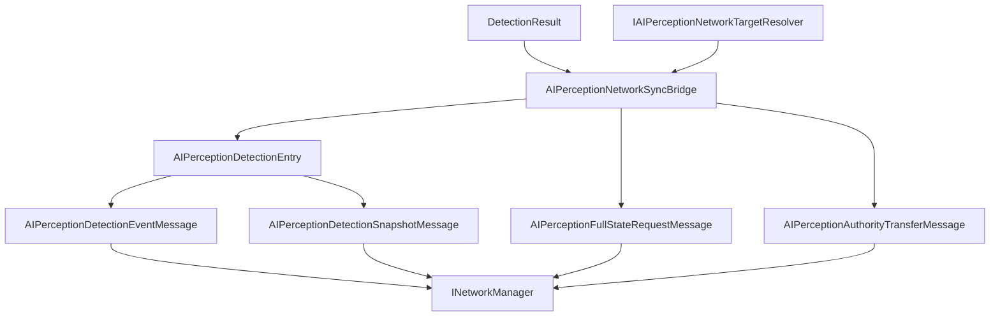

# CycloneGames.AIPerception.Networking

[English](./README.md) | 简体中文

`CycloneGames.AIPerception.Networking` 将 `CycloneGames.AIPerception` 接入 `CycloneGames.Networking`。它提供协议元数据、detection event DTO、detection 和 memory snapshot DTO、full-state request DTO、authority transfer DTO、profile 配置、observer 解析 helper 和 runtime sync bridge。

基础 AIPerception 包不依赖 `CycloneGames.Networking`。只有当 AI perception 数据需要跨 Cyclone 网络边界传递时，才需要引用本桥接包。

## 包结构

```text
CycloneGames.AIPerception.Networking/
  Core/
    AIPerceptionNetworkHash.cs
    AIPerceptionNetworkMessages.cs
    AIPerceptionNetworkProfile.cs
    AIPerceptionNetworkProtocol.cs
    CycloneGames.AIPerception.Networking.Core.asmdef
  Runtime/
    AIPerceptionNetworkAuthority.cs
    AIPerceptionNetworkSyncBridge.cs
    CycloneGames.AIPerception.Networking.Runtime.asmdef
  Tests/Editor/
    AIPerceptionNetworkingIntegrationTests.cs
    CycloneGames.AIPerception.Networking.Tests.Editor.asmdef
```

## 程序集边界

| Assembly | 职责 | Unity 依赖 |
| --- | --- | --- |
| `CycloneGames.AIPerception.Networking.Core` | Protocol manifest、message DTO、profile 配置和 stable hash helper。 | 不引用 UnityEngine |
| `CycloneGames.AIPerception.Networking.Runtime` | Sync bridge、target resolver contract、authority resolver 和 observer resolver。 | 不引用 UnityEngine；通过 AIPerception runtime 使用 `Unity.Mathematics` |
| `CycloneGames.AIPerception.Networking.Tests.Editor` | 覆盖 protocol、profile、sync bridge 和 authority helper 的 EditMode 测试。 | 不引用 UnityEngine |

本包引用 `CycloneGames.AIPerception`、`CycloneGames.Networking.Core` 和 AIPerception runtime 已使用的数学类型。它不引用后端 SDK 类型、PlayerSettings scripting define symbols 或特定 DI 容器。

## 核心概念

| 类型 | 作用 |
| --- | --- |
| `AIPerceptionNetworkProfile` | 不可变 runtime profile，包含 channel、interval、feature flags 和 payload limit。 |
| `AIPerceptionNetworkProfiles` | 内置 server-authoritative、shared team awareness 和 debug spectator profile factory。 |
| `AIPerceptionNetworkProtocol` | 拥有 AIPerception 消息范围和默认 protocol manifest。 |
| `AIPerceptionDetectionEntry` | 单个 perceived target 的网络表示，包含 sensor kind、flags、position、distance、visibility、tick 和 source sensor id。 |
| `AIPerceptionDetectionEventMessage` | 单个 detection event payload。 |
| `AIPerceptionDetectionSnapshotMessage` | 包含多个 detection entry 的 snapshot payload。 |
| `AIPerceptionNetworkSyncBridge` | 将 `DetectionResult` 转换成 event 和 snapshot DTO。 |
| `IAIPerceptionNetworkTargetResolver` | 将 `PerceptibleHandle` 映射为 network id 和 perceptible type id。 |
| `IAIPerceptionNetworkAuthorityResolver` | 解析 networked AI perception observer 的读写 authority。 |

## Detection Sync 流程



## 协议

`AIPerceptionNetworkProtocol` 在 Cyclone module range 中拥有 `15000-15999` 消息 ID。

| Message | ID | Channel | Payload |
| --- | ---: | --- | --- |
| `MSG_MANIFEST_HANDSHAKE` | `15000` | Reliable | `AIPerceptionManifestHandshakeMessage` |
| `MSG_DETECTION_EVENT` | `15001` | UnreliableSequenced | `AIPerceptionDetectionEventMessage` |
| `MSG_DETECTION_SNAPSHOT` | `15002` | UnreliableSequenced | `AIPerceptionDetectionSnapshotMessage` |
| `MSG_MEMORY_SNAPSHOT` | `15003` | Reliable | `AIPerceptionDetectionSnapshotMessage` |
| `MSG_AUTHORITY_TRANSFER` | `15004` | Reliable | `AIPerceptionAuthorityTransferMessage` |
| `MSG_FULL_STATE_REQUEST` | `15005` | Reliable | `AIPerceptionFullStateRequestMessage` |

在 composition root 中注册协议：

```csharp
using CycloneGames.AIPerception.Networking;
using CycloneGames.Networking;

public static class AIPerceptionNetworkInstaller
{
    public static void Configure(INetworkMessageCatalog catalog)
    {
        AIPerceptionNetworkProtocol.RegisterMessageCatalog(catalog);
    }
}
```

## Sync Bridge 流程

Sync bridge 需要 target resolver，因为 perception runtime 使用 `PerceptibleHandle`，而网络消息使用稳定 network id：

```csharp
using CycloneGames.AIPerception.Networking;
using CycloneGames.AIPerception.Runtime;

public sealed class DetectionEventEndpoint
{
    private readonly AIPerceptionNetworkSyncBridge _bridge;
    private readonly IAIPerceptionNetworkTargetResolver _targets;

    public DetectionEventEndpoint(IAIPerceptionNetworkTargetResolver targets)
    {
        _bridge = new AIPerceptionNetworkSyncBridge(AIPerceptionNetworkProfiles.ServerAuthoritative);
        _targets = targets;
    }

    public bool TryCreateEvent(
        uint observerNetworkId,
        DetectionResult detection,
        int tick,
        ushort sequence,
        out AIPerceptionDetectionEventMessage message)
    {
        return _bridge.TryCreateDetectionEvent(
            observerNetworkId,
            detection,
            _targets,
            tick,
            sequence,
            AIPerceptionNetworkEventKind.Detected,
            out message);
    }
}
```

创建 snapshot 时，先写入调用方持有的 buffer，再从已写入的 span 创建 snapshot：

```csharp
using System;
using CycloneGames.AIPerception.Networking;
using CycloneGames.AIPerception.Runtime;

public sealed class DetectionSnapshotEndpoint
{
    private readonly AIPerceptionNetworkSyncBridge _bridge = new AIPerceptionNetworkSyncBridge();

    public AIPerceptionDetectionSnapshotMessage CreateSnapshot(
        uint observerNetworkId,
        ReadOnlySpan<DetectionResult> detections,
        IAIPerceptionNetworkTargetResolver targets,
        Span<AIPerceptionDetectionEntry> buffer,
        int tick,
        ushort sequence)
    {
        int count = _bridge.WriteDetectionEntries(detections, targets, buffer, tick);
        return _bridge.CreateSnapshot(
            observerNetworkId,
            AIPerceptionNetworkSensorKind.Any,
            buffer.Slice(0, count),
            tick,
            sequence);
    }
}
```

## Profile 配置

当内置 profile 的 limit 或 channel 需要调整时，使用 `AIPerceptionNetworkProfileBuilder`：

```csharp
using CycloneGames.AIPerception.Networking;

public static class AIPerceptionProfileFactory
{
    public static AIPerceptionNetworkProfile Create()
    {
        return AIPerceptionNetworkProfiles
            .CreateServerAuthoritativeBuilder()
            .SetInt("project.max_debug_entries", 16)
            .Build();
    }
}
```

## 扩展点

- 为项目的 entity id 系统实现 `IAIPerceptionNetworkTargetResolver`。
- 为自定义 authority ownership 实现 `IAIPerceptionNetworkAuthorityResolver`。
- 当 observer 数据由 gameplay、zone 或 backend 系统持有时，实现 `IAIPerceptionNetworkObserverSource`。
- 项目自有 perception 消息通过项目拥有的 `NetworkMessageKind.User` manifest 注册。

## 持久化

本包不写入文件、资产、偏好设置、缓存或运行时存档。Profile 是 runtime object；创建 profile 的项目资产或配置文件由本包外部持有。

## 验证

修改本包后运行以下检查：

```text
Unity Test Runner > EditMode > CycloneGames.AIPerception.Networking.Tests.Editor
Unity Test Runner > EditMode > CycloneGames.AIPerception.Tests.Editor
Unity Test Runner > EditMode > CycloneGames.Networking.Tests.Editor
```
