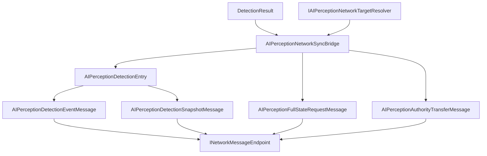

# CycloneGames.AIPerception.Networking

[English](./README.md) | 简体中文

`CycloneGames.AIPerception.Networking` 将 `CycloneGames.AIPerception` 桥接到 `CycloneGames.Networking`。它提供协议元数据、detection event 和 snapshot DTO、memory snapshot DTO、full-state request DTO、authority transfer DTO、profile 配置和 runtime sync bridge。基础 AIPerception 包不依赖 `CycloneGames.Networking`；只有当 AI perception 数据需要跨 Cyclone 网络边界传递时才需要本桥接包。

## 目录

- [概述](#概述)
- [架构](#架构)
- [快速上手](#快速上手)
- [核心概念](#核心概念)
- [使用指南](#使用指南)
- [进阶主题](#进阶主题)
- [常见场景](#常见场景)
- [性能与内存](#性能与内存)
- [故障排查](#故障排查)

## 概述

本桥接 adapter 将 perception runtime 的 `DetectionResult` 值转换为协议定义的网络消息。它通过 `IAIPerceptionNetworkTargetResolver` 将 `PerceptibleHandle` 映射为稳定 network id，支持事件、快照和记忆快照复制，并按 `AIPerceptionNetworkProfile` 校验 payload。

### 主要特性

- **Protocol manifest** 使用 StableHash contract identity 和消息 ID `15000-15999`。
- **Detection event 消息**支持逐目标推送通知。
- **Snapshot 消息**支持批量检测和记忆状态复制。
- **Full-state request 和 authority transfer** 消息支持。
- **Target resolver contract** 用于将感知句柄映射为 network id。
- **纯 C# Core 程序集**，不依赖 UnityEngine。

## 架构

| 程序集 | 职责 | Unity 依赖 |
| --- | --- | --- |
| `CycloneGames.AIPerception.Networking.Core` | Protocol manifest、message DTO、profile 配置、stable hash helper | 不引用 UnityEngine |
| `CycloneGames.AIPerception.Networking.Runtime` | Sync bridge、target resolver contract、authority resolver、observer resolver | 不引用 UnityEngine；通过 AIPerception 使用 `Unity.Mathematics` |
| `CycloneGames.AIPerception.Networking.Tests.Editor` | EditMode 覆盖 | 不引用 UnityEngine |

全部 assembly 使用 `autoReferenced: false`。Consumer asmdef 必须显式引用 Core，使用 bridge 时还需引用 Runtime。



## 快速上手

在 composition root 中注册协议：

```csharp
using CycloneGames.AIPerception.Networking;
using CycloneGames.Networking;

public static class AIPerceptionNetworkInstaller
{
    public static void Configure(INetworkMessageCatalog catalog)
    {
        AIPerceptionNetworkProtocol.RegisterMessageCatalog(catalog);
    }
}
```

创建 detection event 端点：

```csharp
using CycloneGames.AIPerception.Networking;
using CycloneGames.AIPerception.Runtime;

public sealed class DetectionEventEndpoint
{
    private readonly AIPerceptionNetworkSyncBridge _bridge;
    private readonly IAIPerceptionNetworkTargetResolver _targets;

    public DetectionEventEndpoint(IAIPerceptionNetworkTargetResolver targets)
    {
        _bridge = new AIPerceptionNetworkSyncBridge(AIPerceptionNetworkProfiles.ServerAuthoritative);
        _targets = targets;
    }

    public bool TryCreateEvent(
        uint observerNetworkId, DetectionResult detection,
        int tick, ushort sequence,
        out AIPerceptionDetectionEventMessage message)
    {
        return _bridge.TryCreateDetectionEvent(
            observerNetworkId, detection, _targets,
            tick, sequence, AIPerceptionNetworkEventKind.Detected,
            out message);
    }
}
```

## 核心概念

| 类型 | 作用 |
| --- | --- |
| `AIPerceptionNetworkProfile` | 不可变 runtime profile：channel、interval、feature flags、payload limit |
| `AIPerceptionNetworkProfiles` | 内置 profile factory（server-authoritative、shared team awareness、debug spectator） |
| `AIPerceptionNetworkProtocol` | 拥有消息范围 `15000-15999` 和默认 protocol manifest |
| `AIPerceptionDetectionEntry` | 单个 perceived target 的网络表示：sensor kind、flags、position、distance、visibility、tick、source sensor id |
| `AIPerceptionDetectionEventMessage` | 单个 detection event payload |
| `AIPerceptionDetectionSnapshotMessage` | 包含多个 detection entry 的 snapshot payload |
| `AIPerceptionNetworkSyncBridge` | 将 `DetectionResult` 转换为 event 和 snapshot DTO |
| `IAIPerceptionNetworkTargetResolver` | 将 `PerceptibleHandle` 映射为 network id 和 perceptible type id |
| `IAIPerceptionNetworkAuthorityResolver` | 解析 networked perception observer 的读写 authority |

### 协议消息

| Message | ID | Channel | Payload |
| --- | ---: | --- | --- |
| `MSG_MANIFEST_HANDSHAKE` | `15000` | Reliable | `AIPerceptionManifestHandshakeMessage` |
| `MSG_DETECTION_EVENT` | `15001` | UnreliableSequenced | `AIPerceptionDetectionEventMessage` |
| `MSG_DETECTION_SNAPSHOT` | `15002` | UnreliableSequenced | `AIPerceptionDetectionSnapshotMessage` |
| `MSG_MEMORY_SNAPSHOT` | `15003` | Reliable | `AIPerceptionDetectionSnapshotMessage` |
| `MSG_AUTHORITY_TRANSFER` | `15004` | Reliable | `AIPerceptionAuthorityTransferMessage` |
| `MSG_FULL_STATE_REQUEST` | `15005` | Reliable | `AIPerceptionFullStateRequestMessage` |

## 使用指南

### 创建 Detection Snapshot

先写入调用方持有的 buffer，再从已写入的 span 创建 snapshot：

```csharp
using System;
using CycloneGames.AIPerception.Networking;
using CycloneGames.AIPerception.Runtime;

public sealed class DetectionSnapshotEndpoint
{
    private readonly AIPerceptionNetworkSyncBridge _bridge = new();

    public AIPerceptionDetectionSnapshotMessage CreateSnapshot(
        uint observerNetworkId,
        ReadOnlySpan<DetectionResult> detections,
        IAIPerceptionNetworkTargetResolver targets,
        Span<AIPerceptionDetectionEntry> buffer,
        int tick, ushort sequence)
    {
        int count = _bridge.WriteDetectionEntries(detections, targets, buffer, tick);
        return _bridge.CreateSnapshot(
            observerNetworkId,
            AIPerceptionNetworkSensorKind.Any,
            buffer.Slice(0, count),
            tick, sequence);
    }
}
```

### Profile 配置

```csharp
using CycloneGames.AIPerception.Networking;

public static class AIPerceptionProfileFactory
{
    public static AIPerceptionNetworkProfile Create()
    {
        return AIPerceptionNetworkProfiles
            .CreateServerAuthoritativeBuilder()
            .SetInt("project.max_debug_entries", 16)
            .Build();
    }
}
```

## 进阶主题

### 协议 Identity

`AIPerceptionNetworkProtocol.CreateProtocolManifest` 构建完整 manifest。注册会原子提交完整 range 和全部 descriptor。每个 descriptor 具有显式 `ContractId`（如 `AIPerceptionDetectionEventMessage:v1`）和 FNV-1a 64-bit `SchemaHash`。Payload layout 变更需分配新 contract identity。

### 扩展点

- 为项目 entity id 系统实现 `IAIPerceptionNetworkTargetResolver`。
- 为自定义 authority ownership 实现 `IAIPerceptionNetworkAuthorityResolver`。
- 当 observer 数据由 gameplay、zone 或 backend 系统持有时，实现 `IAIPerceptionNetworkObserverSource`。
- 项目专用 perception 消息放入独立项目自有 manifest，使用 `NetworkMessageRanges.User`。

## 常见场景

### 服务端权威 Detection Sync

服务端查询传感器，将结果转换为网络条目并广播：

```csharp
// 服务端 Tick
var detections = perception.GetAllSightDetections();
var buffer = _entryBuffer; // 预分配的 AIPerceptionDetectionEntry[]
int count = _bridge.WriteDetectionEntries(detections, _targets, buffer, tick);

var snapshot = _bridge.CreateSnapshot(
    observerNetId, AIPerceptionNetworkSensorKind.Sight,
    buffer.AsSpan(0, count), tick, sequence++);

SendToRelevantClients(snapshot);
```

### 为新加入客户端同步记忆快照

新客户端需要完整的感知记忆状态：

```csharp
// 响应 full state request
var memoryEntries = _sightSensor.GetMemoryEntries();
int count = _bridge.WriteDetectionEntries(memoryEntries, _targets, buffer, tick);

var memorySnapshot = _bridge.CreateSnapshot(
    observerNetId, AIPerceptionNetworkSensorKind.Any,
    buffer.AsSpan(0, count), tick, sequence);

SendToClient(memorySnapshot); // 按协议使用 Reliable channel
```

## 性能与内存

本包不执行文件 I/O，热路径不分配托管内存，不持有线程或原生容器。Profile 是纯运行时对象。Sync bridge 将条目写入调用方持有的 buffer；buffer 大小和复用由调用方管理。Profile 中的 payload limit 在序列化前限制 snapshot 大小。Transport encoding 和网络 I/O 位于外部。

## 故障排查

| 现象 | 可能原因 | 解决方法 |
| --- | --- | --- |
| 客户端收不到 detection event | Target resolver 返回非法 network id | 验证 `IAIPerceptionNetworkTargetResolver` 映射；检查 network id 注册 |
| Snapshot payload 被截断 | Buffer 小于 detection 数量 | 根据每帧最大检测数量确定调用方 buffer 大小 |
| Protocol manifest 注册失败 | `SchemaHash` 不匹配或 ID 重叠 | 确保所有 peer 使用相同 contract identity；检查 `15000-15999` 范围 |
| 客户端记忆快照过时 | 新客户端在服务端状态变更后加入 | 通过 `MSG_FULL_STATE_REQUEST` 请求全量重同步 |
| Authority transfer 被拒绝 | Resolver 不识别 authority 变更 | 为自定义 ownership 规则实现 `IAIPerceptionNetworkAuthorityResolver` |

## 验证

```text
Unity Test Runner > EditMode > CycloneGames.AIPerception.Networking.Tests.Editor
Unity Test Runner > EditMode > CycloneGames.AIPerception.Tests.Editor
Unity Test Runner > EditMode > CycloneGames.Networking.Tests.Editor
```
