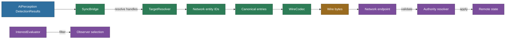

# CycloneGames.AIPerception.Networking

[English | 简体中文](README.SCH.md)

`CycloneGames.AIPerception.Networking` bridges `CycloneGames.AIPerception` results into `CycloneGames.Networking`. It converts detection results into stable network identities, defines the fixed v1 wire schema, validates untrusted payloads, applies server-authority rules, and adapts perception relevance to the shared interest evaluator.

## Table of Contents

- [Overview](#overview)
- [Architecture](#architecture)
- [Quick Start](#quick-start)
- [Core Rules](#core-rules)
- [Protocol Reference](#protocol-reference)
- [Troubleshooting](#troubleshooting)

## Overview

This module connects local perception to the network. A game composition root owns the transport, endpoint, serializer, and session, and connects them to this bridge explicitly.

| Assembly | Responsibility | References |
| --- | --- | --- |
| `CycloneGames.AIPerception.Networking.Core` | Protocol manifest, immutable DTO headers, profile fingerprint, validation, canonical hashing, fixed little-endian codec | `CycloneGames.Networking.Core`, `CycloneGames.Hash.Core` |
| `CycloneGames.AIPerception.Networking.Runtime` | `DetectionResult` mapping, bounded canonical selection, authority checks, shared interest-evaluator adapter | Core, `CycloneGames.AIPerception`, `CycloneGames.Networking.Core`, `Unity.Mathematics` |
| `CycloneGames.AIPerception.Networking.Tests.Editor` | Golden-byte, round-trip, malformed-input, authority, interest, and allocation contracts | Core and Runtime |

The Core assembly has no `UnityEngine` dependency. The Runtime assembly bridges local perception without exposing Unity object identity on the wire.

## Architecture



## Quick Start

### 1. Choose and exchange a profile

Profiles are immutable. Built-in profiles are cached instances:

```csharp
using CycloneGames.AIPerception.Networking;

AIPerceptionNetworkProfile profile =
    AIPerceptionNetworkProfiles.ServerAuthoritative;

AIPerceptionManifestHandshakeMessage localHandshake =
    AIPerceptionManifestHandshakeMessage.CreateLocal(profile);
```

Encode and send through the project endpoint:

```csharp
Span<byte> handshakeBytes =
    stackalloc byte[AIPerceptionNetworkWireCodec.HandshakePayloadBytes];

if (AIPerceptionNetworkWireCodec.TryWriteHandshake(
        in localHandshake,
        handshakeBytes,
        out int handshakeLength) != AIPerceptionNetworkWireCodecResult.Success)
{
    throw new InvalidOperationException("The local AIPerception handshake is invalid.");
}

NetworkSendResult sendResult = endpoint.SendToServer(
    AIPerceptionNetworkProtocol.MSG_MANIFEST_HANDSHAKE,
    handshakeBytes.Slice(0, handshakeLength),
    NetworkChannel.Reliable);
```

On receive, decode first and negotiate before enabling perception traffic:

```csharp
if (AIPerceptionNetworkWireCodec.TryReadHandshake(
        payload.Bytes,
        out AIPerceptionManifestHandshakeMessage remote) !=
    AIPerceptionNetworkWireCodecResult.Success)
{
    return;
}

AIPerceptionNetworkHandshakeResult negotiation = remote.Negotiate(profile);
if (negotiation != AIPerceptionNetworkHandshakeResult.Compatible)
{
    return;
}
```

### 2. Map detections into a reusable entry buffer

The resolver connects local perception handles to stable network entity IDs:

```csharp
var bridge = new AIPerceptionNetworkSyncBridge(profile);

// Allocate once per observer/session owner and reuse.
var entryBuffer = new AIPerceptionDetectionEntry[profile.MaxSnapshotEntries];

AIPerceptionDetectionEntryWriteResult write = bridge.WriteDetectionEntries(
    detections,
    targetResolver,
    entryBuffer,
    tick,
    sourceSensorId);

ReadOnlySpan<AIPerceptionDetectionEntry> entries =
    entryBuffer.AsSpan(0, write.WrittenCount);

if (!write.IsComplete)
{
    telemetry.RecordPerceptionSnapshotLoss(
        write.UnresolvedCount,
        write.InvalidCount,
        write.CapacityLimitedCount,
        write.DuplicateCount);
}
```

The bridge keeps the canonical smallest entries when capacity is limited. Capacity loss is always explicit.

### 3. Create, encode, and send a snapshot

```csharp
AIPerceptionNetworkMessageValidationResult createResult = bridge.TryCreateSnapshot(
    observerNetworkId,
    AIPerceptionNetworkSensorKind.Any,
    entries,
    tick,
    sequence,
    authorityGeneration,
    out AIPerceptionDetectionSnapshotMessage snapshot);

if (createResult != AIPerceptionNetworkMessageValidationResult.Valid)
{
    return;
}

int payloadLength = AIPerceptionNetworkWireCodec.GetSnapshotPayloadBytes(entries.Length);
Span<byte> snapshotBytes = reusablePayloadBuffer.AsSpan(0, payloadLength);

if (AIPerceptionNetworkWireCodec.TryWriteDetectionSnapshot(
        in snapshot,
        entries,
        snapshotBytes,
        out int bytesWritten) != AIPerceptionNetworkWireCodecResult.Success)
{
    return;
}

if (endpoint.GetMaxPayloadSize(
        AIPerceptionNetworkProtocol.MSG_DETECTION_SNAPSHOT,
        profile.SnapshotChannel) < bytesWritten)
{
    return;
}

endpoint.SendToClient(
    connection,
    AIPerceptionNetworkProtocol.MSG_DETECTION_SNAPSHOT,
    snapshotBytes.Slice(0, bytesWritten),
    profile.SnapshotChannel);
```

For memory snapshots, use `MSG_MEMORY_SNAPSHOT` with `profile.MemorySnapshotChannel`. An empty snapshot (zero entries) represents an authoritative empty set.

### 4. Receive snapshots safely

Decode into a reusable destination before applying any state:

```csharp
Span<AIPerceptionDetectionEntry> decodedEntries = receiveEntryBuffer;

AIPerceptionNetworkWireCodecResult decodeResult =
    AIPerceptionNetworkWireCodec.TryReadDetectionSnapshot(
        payload.Bytes,
        decodedEntries,
        out AIPerceptionDetectionSnapshotMessage snapshot,
        out int decodedCount);

if (decodeResult != AIPerceptionNetworkWireCodecResult.Success)
{
    return;
}

var inbound = new AIPerceptionRemoteSnapshotContext(
    senderConnectionId: payload.Connection.ConnectionId,
    authoritativeServerConnectionId: session.AuthoritativeServerConnectionId,
    isSenderAuthenticated: payload.Connection.IsAuthenticated,
    isServerToClient: payload.Direction == NetworkMessageDirection.ServerToClient,
    authorityGeneration: session.AuthorityGeneration,
    hasAppliedSnapshot: state.HasSnapshot,
    lastAppliedSequence: state.LastSequence,
    lastAppliedTick: state.LastTick);

AIPerceptionRemoteSnapshotResult authorityResult = authorityResolver.ValidateRemotePerception(
    in localAuthority,
    in inbound,
    in observer,
    in snapshot,
    decodedEntries.Slice(0, decodedCount));

if (authorityResult != AIPerceptionRemoteSnapshotResult.Allowed)
{
    return;
}

// Commit state first, then publish any observer notification.
state.Apply(snapshot, decodedEntries.Slice(0, decodedCount));
```

## Core Rules

- `PerceptibleHandle` is never serialized as a network identity. A `IAIPerceptionNetworkTargetResolver` supplies stable `TargetNetworkId` values.
- `TargetNetworkId` must be non-zero and `PerceptibleTypeId` must be non-negative.
- All multibyte wire fields use explicit little-endian encoding. No raw-struct copy, reflection, or generic serializer.
- Snapshot entries live in caller-owned spans. A snapshot message is metadata plus `EntryCount`.
- Entries must be strictly ordered by `AIPerceptionNetworkHash.CompareCanonical`. Unordered or duplicate payloads are rejected.
- A header with `SensorKind.Any` may contain mixed sensor kinds; a concrete kind requires every entry to match.
- Positions, distance, and visibility must be finite. Distance is non-negative, visibility in `[0, 1]`.
- State hash is FNV-1a64 over exact canonical entry fields for drift detection.
- Profile hash covers every typed synchronization setting. Peers negotiate supported and required feature flags.
- Remote snapshots are accepted only after payload validation, authenticated server-to-client direction validation, authoritative-sender validation, generation matching, and replay checks.
- Interest filtering delegates to `INetworkInterestEvaluator`.

## Protocol Reference

### Wire v1 contract

| Message | ID | Payload bytes | Default channel |
| --- | ---: | ---: | --- |
| Manifest handshake | 15000 | 26 | Reliable |
| Detection event | 15001 | 62 | UnreliableSequenced |
| Detection snapshot | 15002 | `26 + EntryCount * 38`, max 4800 | UnreliableSequenced |
| Memory snapshot | 15003 | `26 + EntryCount * 38`, max 4800 | Reliable |
| Authority transfer | 15004 | 47 | Reliable |
| Full-state request | 15005 | 24 | Reliable |

The protocol ceiling allows up to 125 entries. Adding, removing, reordering, or changing a field requires a new wire contract.

### Canonical ordering and bounded selection

`WriteDetectionEntries` maintains a sorted, bounded destination while scanning. For N detections and capacity K (protocol-bounded to 125), the algorithm uses `O(N log K + N * K)` worst-case work with no internal heap storage. Selection is deterministic under input reordering.

### Interest filtering

`AIPerceptionNetworkObserverResolver` converts candidates to `NetworkReplicationObserver` and observers to `NetworkReplicatedObject`, then calls `INetworkInterestEvaluator`. This gives AIPerception the same semantics as Networking: ownership by connection/player ID, authentication and interest layers, team relevance, area relevance, and `IncludeOwner` support.

### Profiles and scheduling

A profile defines supported/required features, channels, intervals, snapshot budgets, and authority-transfer behavior. Its `ProfileHash` is deterministic over typed values. Intervals are policy values — the network session or replication loop owns tick scheduling, congestion response, and send retries.

### Security and failure handling

| Failure | Required response |
| --- | --- |
| Invalid length, enum, flags, float, order, count, or hash | Drop the payload; increment bounded telemetry; apply the session abuse policy |
| Profile, fingerprint, version, or feature mismatch | Disable this module's traffic or reject the peer |
| Unauthenticated, wrong-direction, or non-authoritative sender | Drop and report as an authority violation |
| Generation mismatch, stale tick, replay, or out-of-order sequence | Drop without changing replay state |
| Destination capacity too small | Use a configured bounded buffer or reject |
| Local entry selection is partial | Record each loss category |

FNV state hashes are synchronization checksums, not authentication codes. Transport authentication and cryptographic integrity belong to `CycloneGames.Networking`.

### Memory and threading

- Core codec paths operate on `Span<T>`/`ReadOnlySpan<T>` with zero internal allocations.
- Built-in profile properties return cached immutable instances.
- All buffers, lists, and session state have explicit external owners.
- No lock, worker thread, queue, or global cache is created.
- Spans and `NetworkMessagePayload.Bytes` must not be retained beyond their documented call lifetime.

## Troubleshooting

| Symptom | Check |
| --- | --- |
| Handshake rejected | Profile hash, feature flags, and supported/required feature match |
| Snapshot decode fails | Payload length, entry count, canonical order, enum ranges, and float finite-ness |
| Authority violation logged | Authenticated state, server-to-client direction, authority generation, and replay state |
| Entries silently truncated | `WriteDetectionEntries` loss counts: unresolved, invalid, capacity-limited, duplicates |
| Interest filtering produces no observers | Observer/candidate entity mapping, interest evaluator configuration |
| Allocation in hot path | Verify spans and reusable buffers; profile the target Player backend |
| Profile change has no effect | Profiles are immutable — create and exchange a new profile through the handshake |
