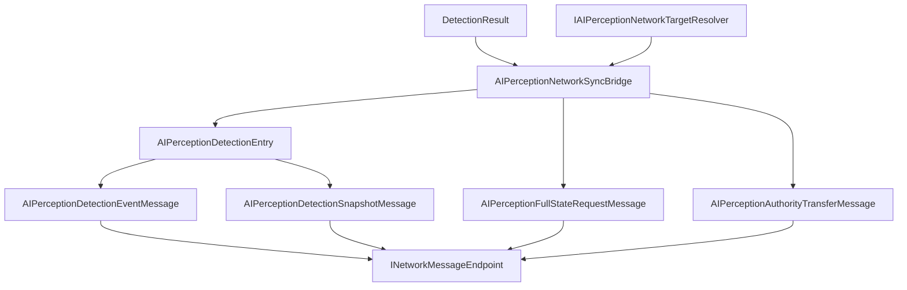

# CycloneGames.AIPerception.Networking

English | [简体中文](./README.SCH.md)

`CycloneGames.AIPerception.Networking` bridges `CycloneGames.AIPerception` to `CycloneGames.Networking`. It provides protocol metadata, detection event and snapshot DTOs, memory snapshot DTOs, full-state request DTOs, authority transfer DTOs, profile configuration, and a runtime sync bridge. The base AIPerception package is usable without `CycloneGames.Networking`; this bridge is only required when AI perception data crosses a Cyclone network boundary.

## Table of Contents

- [Overview](#overview)
- [Architecture](#architecture)
- [Quick Start](#quick-start)
- [Core Concepts](#core-concepts)
- [Usage Guide](#usage-guide)
- [Advanced Topics](#advanced-topics)
- [Common Scenarios](#common-scenarios)
- [Performance and Memory](#performance-and-memory)
- [Troubleshooting](#troubleshooting)

## Overview

This bridge adapter converts `DetectionResult` values from the perception runtime into protocol-defined network messages. It maps `PerceptibleHandle` to stable network ids via `IAIPerceptionNetworkTargetResolver`, supports event-based, snapshot, and memory snapshot replication, and validates payloads against an `AIPerceptionNetworkProfile`.

### Key Features

- **Protocol manifest** with StableHash contract identity and message IDs `15000-15999`.
- **Detection event messages** for per-target push notifications.
- **Snapshot messages** for batched detection and memory state replication.
- **Full-state request and authority transfer** message support.
- **Target resolver contract** for mapping perception handles to network ids.
- **Pure C# Core assembly** with no UnityEngine dependency.

## Architecture

| Assembly | Role | Unity dependency |
| --- | --- | --- |
| `CycloneGames.AIPerception.Networking.Core` | Protocol manifest, message DTOs, profile configuration, stable hash helpers | No UnityEngine |
| `CycloneGames.AIPerception.Networking.Runtime` | Sync bridge, target resolver contract, authority resolver, observer resolver | No UnityEngine; references `Unity.Mathematics` via AIPerception |
| `CycloneGames.AIPerception.Networking.Tests.Editor` | EditMode coverage | No UnityEngine |

All assemblies use `autoReferenced: false`. Consumer asmdefs must reference Core explicitly, and Runtime when using the bridge.



## Quick Start

Register the protocol in a composition root:

```csharp
using CycloneGames.AIPerception.Networking;
using CycloneGames.Networking;

public static class AIPerceptionNetworkInstaller
{
    public static void Configure(INetworkMessageCatalog catalog)
    {
        AIPerceptionNetworkProtocol.RegisterMessageCatalog(catalog);
    }
}
```

Create a detection event endpoint:

```csharp
using CycloneGames.AIPerception.Networking;
using CycloneGames.AIPerception.Runtime;

public sealed class DetectionEventEndpoint
{
    private readonly AIPerceptionNetworkSyncBridge _bridge;
    private readonly IAIPerceptionNetworkTargetResolver _targets;

    public DetectionEventEndpoint(IAIPerceptionNetworkTargetResolver targets)
    {
        _bridge = new AIPerceptionNetworkSyncBridge(AIPerceptionNetworkProfiles.ServerAuthoritative);
        _targets = targets;
    }

    public bool TryCreateEvent(
        uint observerNetworkId, DetectionResult detection,
        int tick, ushort sequence,
        out AIPerceptionDetectionEventMessage message)
    {
        return _bridge.TryCreateDetectionEvent(
            observerNetworkId, detection, _targets,
            tick, sequence, AIPerceptionNetworkEventKind.Detected,
            out message);
    }
}
```

## Core Concepts

| Type | Purpose |
| --- | --- |
| `AIPerceptionNetworkProfile` | Immutable runtime profile: channels, intervals, feature flags, payload limits |
| `AIPerceptionNetworkProfiles` | Built-in profile factories (server-authoritative, shared team awareness, debug spectator) |
| `AIPerceptionNetworkProtocol` | Owns message range `15000-15999` and default protocol manifest |
| `AIPerceptionDetectionEntry` | Network representation of one perceived target: sensor kind, flags, position, distance, visibility, tick, source sensor id |
| `AIPerceptionDetectionEventMessage` | Single detection event payload |
| `AIPerceptionDetectionSnapshotMessage` | Snapshot payload with multiple detection entries |
| `AIPerceptionNetworkSyncBridge` | Converts `DetectionResult` into event and snapshot DTOs |
| `IAIPerceptionNetworkTargetResolver` | Maps `PerceptibleHandle` to network ids and perceptible type ids |
| `IAIPerceptionNetworkAuthorityResolver` | Resolves read/write authority for networked perception observers |

### Protocol Messages

| Message | ID | Channel | Payload |
| --- | ---: | --- | --- |
| `MSG_MANIFEST_HANDSHAKE` | `15000` | Reliable | `AIPerceptionManifestHandshakeMessage` |
| `MSG_DETECTION_EVENT` | `15001` | UnreliableSequenced | `AIPerceptionDetectionEventMessage` |
| `MSG_DETECTION_SNAPSHOT` | `15002` | UnreliableSequenced | `AIPerceptionDetectionSnapshotMessage` |
| `MSG_MEMORY_SNAPSHOT` | `15003` | Reliable | `AIPerceptionDetectionSnapshotMessage` |
| `MSG_AUTHORITY_TRANSFER` | `15004` | Reliable | `AIPerceptionAuthorityTransferMessage` |
| `MSG_FULL_STATE_REQUEST` | `15005` | Reliable | `AIPerceptionFullStateRequestMessage` |

## Usage Guide

### Creating Detection Snapshots

Write entries into caller-owned buffers, then create a snapshot from the written span:

```csharp
using System;
using CycloneGames.AIPerception.Networking;
using CycloneGames.AIPerception.Runtime;

public sealed class DetectionSnapshotEndpoint
{
    private readonly AIPerceptionNetworkSyncBridge _bridge = new();

    public AIPerceptionDetectionSnapshotMessage CreateSnapshot(
        uint observerNetworkId,
        ReadOnlySpan<DetectionResult> detections,
        IAIPerceptionNetworkTargetResolver targets,
        Span<AIPerceptionDetectionEntry> buffer,
        int tick, ushort sequence)
    {
        int count = _bridge.WriteDetectionEntries(detections, targets, buffer, tick);
        return _bridge.CreateSnapshot(
            observerNetworkId,
            AIPerceptionNetworkSensorKind.Any,
            buffer.Slice(0, count),
            tick, sequence);
    }
}
```

### Profile Configuration

```csharp
using CycloneGames.AIPerception.Networking;

public static class AIPerceptionProfileFactory
{
    public static AIPerceptionNetworkProfile Create()
    {
        return AIPerceptionNetworkProfiles
            .CreateServerAuthoritativeBuilder()
            .SetInt("project.max_debug_entries", 16)
            .Build();
    }
}
```

## Advanced Topics

### Protocol Identity

`AIPerceptionNetworkProtocol.CreateProtocolManifest` builds the complete manifest. Registration commits the full range and all descriptors atomically. Every descriptor has an explicit `ContractId` (e.g., `AIPerceptionDetectionEventMessage:v1`) with FNV-1a 64-bit `SchemaHash`. Payload layout changes require a new contract identity.

### Extension Points

- Implement `IAIPerceptionNetworkTargetResolver` for the project's entity id system.
- Implement `IAIPerceptionNetworkAuthorityResolver` for custom authority ownership.
- Implement `IAIPerceptionNetworkObserverSource` when observer data is owned by a gameplay, zone, or backend system.
- Project-specific perception messages belong in a separate project-owned manifest using `NetworkMessageRanges.User`.

## Common Scenarios

### Server-Authoritative Detection Sync

Server queries sensors, converts results to network entries, and broadcasts:

```csharp
// Server tick
var detections = perception.GetAllSightDetections();
var buffer = _entryBuffer; // pre-allocated AIPerceptionDetectionEntry[]
int count = _bridge.WriteDetectionEntries(detections, _targets, buffer, tick);

var snapshot = _bridge.CreateSnapshot(
    observerNetId, AIPerceptionNetworkSensorKind.Sight,
    buffer.AsSpan(0, count), tick, sequence++);

SendToRelevantClients(snapshot);
```

### Memory Snapshot for Late Joiners

New clients need the full perception memory state:

```csharp
// On full state request
var memoryEntries = _sightSensor.GetMemoryEntries();
int count = _bridge.WriteDetectionEntries(memoryEntries, _targets, buffer, tick);

var memorySnapshot = _bridge.CreateSnapshot(
    observerNetId, AIPerceptionNetworkSensorKind.Any,
    buffer.AsSpan(0, count), tick, sequence);

SendToClient(memorySnapshot); // Reliable channel per protocol
```

## Performance and Memory

This package performs no file I/O, allocates no managed memory on hot paths, and does not own threads or native containers. Profiles are runtime objects only. The sync bridge writes entries into caller-owned buffers; buffer sizing and reuse are caller responsibilities.

Payload limits in the profile bound snapshots before serialization. Transport encoding and network I/O are external concerns.

## Troubleshooting

| Symptom | Likely cause | Resolution |
| --- | --- | --- |
| Detection events not received by clients | Target resolver returns invalid network id | Verify `IAIPerceptionNetworkTargetResolver` mapping; check network id registration |
| Snapshot payload truncated | Buffer too small for detection count | Size caller-owned buffer based on measured maximum detections per frame |
| Protocol manifest registration fails | `SchemaHash` mismatch or overlapping IDs | Ensure all peers use the same contract identity; check `15000-15999` range |
| Memory snapshot outdated on client | Late-joining client after server state changed | Request full-state resync via `MSG_FULL_STATE_REQUEST` |
| Authority transfer rejected | Resolver does not recognize authority change | Implement `IAIPerceptionNetworkAuthorityResolver` for custom ownership rules |

## Validation

```text
Unity Test Runner > EditMode > CycloneGames.AIPerception.Networking.Tests.Editor
Unity Test Runner > EditMode > CycloneGames.AIPerception.Tests.Editor
Unity Test Runner > EditMode > CycloneGames.Networking.Tests.Editor
```
