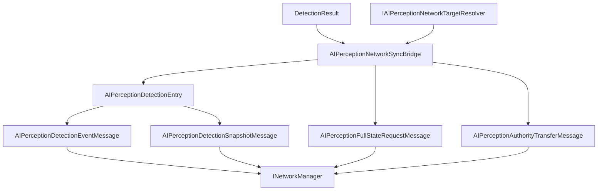

# CycloneGames.AIPerception.Networking

English | [Simplified Chinese](./README.SCH.md)

`CycloneGames.AIPerception.Networking` connects `CycloneGames.AIPerception` to `CycloneGames.Networking`. It provides protocol metadata, detection event DTOs, detection and memory snapshot DTOs, full-state request DTOs, authority transfer DTOs, profile configuration, observer resolution helpers, and a runtime sync bridge.

The base AIPerception package remains usable without `CycloneGames.Networking`. This bridge is only required when AI perception data crosses a Cyclone network boundary.

## Package Layout

```text
CycloneGames.AIPerception.Networking/
  Core/
    AIPerceptionNetworkHash.cs
    AIPerceptionNetworkMessages.cs
    AIPerceptionNetworkProfile.cs
    AIPerceptionNetworkProtocol.cs
    CycloneGames.AIPerception.Networking.Core.asmdef
  Runtime/
    AIPerceptionNetworkAuthority.cs
    AIPerceptionNetworkSyncBridge.cs
    CycloneGames.AIPerception.Networking.Runtime.asmdef
  Tests/Editor/
    AIPerceptionNetworkingIntegrationTests.cs
    CycloneGames.AIPerception.Networking.Tests.Editor.asmdef
```

## Assembly Boundary

| Assembly | Role | Unity dependency |
| --- | --- | --- |
| `CycloneGames.AIPerception.Networking.Core` | Protocol manifest, message DTOs, profile configuration, and stable hash helpers. | No UnityEngine |
| `CycloneGames.AIPerception.Networking.Runtime` | Sync bridge, target resolution contract, authority resolver, and observer resolver. | No UnityEngine; references `Unity.Mathematics` through AIPerception runtime |
| `CycloneGames.AIPerception.Networking.Tests.Editor` | EditMode coverage for protocol, profiles, sync bridge, and authority helpers. | No UnityEngine |

The package references `CycloneGames.AIPerception`, `CycloneGames.Networking.Core`, and runtime math types already used by AIPerception. It does not reference backend SDK types, PlayerSettings scripting define symbols, or a DI container.

## Core Concepts

| Type | Purpose |
| --- | --- |
| `AIPerceptionNetworkProfile` | Immutable runtime profile containing channels, intervals, feature flags, and payload limits. |
| `AIPerceptionNetworkProfiles` | Built-in profile factories for server-authoritative, shared team awareness, and debug spectator flows. |
| `AIPerceptionNetworkProtocol` | Owns the AIPerception message range and default protocol manifest. |
| `AIPerceptionDetectionEntry` | Network representation of one perceived target, sensor kind, flags, position, distance, visibility, tick, and source sensor id. |
| `AIPerceptionDetectionEventMessage` | Single detection event payload. |
| `AIPerceptionDetectionSnapshotMessage` | Snapshot payload containing multiple detection entries. |
| `AIPerceptionNetworkSyncBridge` | Converts `DetectionResult` values into event and snapshot DTOs. |
| `IAIPerceptionNetworkTargetResolver` | Maps `PerceptibleHandle` values to network ids and perceptible type ids. |
| `IAIPerceptionNetworkAuthorityResolver` | Resolves read/write authority for networked AI perception observers. |

## Detection Sync Flow



## Protocol

`AIPerceptionNetworkProtocol` owns message ids `15000-15999` in the Cyclone module range.

| Message | ID | Channel | Payload |
| --- | ---: | --- | --- |
| `MSG_MANIFEST_HANDSHAKE` | `15000` | Reliable | `AIPerceptionManifestHandshakeMessage` |
| `MSG_DETECTION_EVENT` | `15001` | UnreliableSequenced | `AIPerceptionDetectionEventMessage` |
| `MSG_DETECTION_SNAPSHOT` | `15002` | UnreliableSequenced | `AIPerceptionDetectionSnapshotMessage` |
| `MSG_MEMORY_SNAPSHOT` | `15003` | Reliable | `AIPerceptionDetectionSnapshotMessage` |
| `MSG_AUTHORITY_TRANSFER` | `15004` | Reliable | `AIPerceptionAuthorityTransferMessage` |
| `MSG_FULL_STATE_REQUEST` | `15005` | Reliable | `AIPerceptionFullStateRequestMessage` |

Register the protocol in a composition root:

```csharp
using CycloneGames.AIPerception.Networking;
using CycloneGames.Networking;

public static class AIPerceptionNetworkInstaller
{
    public static void Configure(INetworkMessageCatalog catalog)
    {
        AIPerceptionNetworkProtocol.RegisterMessageCatalog(catalog);
    }
}
```

## Sync Bridge Workflow

The sync bridge needs a target resolver because the perception runtime uses `PerceptibleHandle`, while network messages use stable network ids:

```csharp
using CycloneGames.AIPerception.Networking;
using CycloneGames.AIPerception.Runtime;

public sealed class DetectionEventEndpoint
{
    private readonly AIPerceptionNetworkSyncBridge _bridge;
    private readonly IAIPerceptionNetworkTargetResolver _targets;

    public DetectionEventEndpoint(IAIPerceptionNetworkTargetResolver targets)
    {
        _bridge = new AIPerceptionNetworkSyncBridge(AIPerceptionNetworkProfiles.ServerAuthoritative);
        _targets = targets;
    }

    public bool TryCreateEvent(
        uint observerNetworkId,
        DetectionResult detection,
        int tick,
        ushort sequence,
        out AIPerceptionDetectionEventMessage message)
    {
        return _bridge.TryCreateDetectionEvent(
            observerNetworkId,
            detection,
            _targets,
            tick,
            sequence,
            AIPerceptionNetworkEventKind.Detected,
            out message);
    }
}
```

For snapshots, write entries into caller-owned buffers, then create a snapshot from the written span.

```csharp
using System;
using CycloneGames.AIPerception.Networking;
using CycloneGames.AIPerception.Runtime;

public sealed class DetectionSnapshotEndpoint
{
    private readonly AIPerceptionNetworkSyncBridge _bridge = new AIPerceptionNetworkSyncBridge();

    public AIPerceptionDetectionSnapshotMessage CreateSnapshot(
        uint observerNetworkId,
        ReadOnlySpan<DetectionResult> detections,
        IAIPerceptionNetworkTargetResolver targets,
        Span<AIPerceptionDetectionEntry> buffer,
        int tick,
        ushort sequence)
    {
        int count = _bridge.WriteDetectionEntries(detections, targets, buffer, tick);
        return _bridge.CreateSnapshot(
            observerNetworkId,
            AIPerceptionNetworkSensorKind.Any,
            buffer.Slice(0, count),
            tick,
            sequence);
    }
}
```

## Profile Configuration

Use `AIPerceptionNetworkProfileBuilder` when the built-in profiles need adjusted limits or channels:

```csharp
using CycloneGames.AIPerception.Networking;

public static class AIPerceptionProfileFactory
{
    public static AIPerceptionNetworkProfile Create()
    {
        return AIPerceptionNetworkProfiles
            .CreateServerAuthoritativeBuilder()
            .SetInt("project.max_debug_entries", 16)
            .Build();
    }
}
```

## Extension Points

- Implement `IAIPerceptionNetworkTargetResolver` for the project's entity id system.
- Implement `IAIPerceptionNetworkAuthorityResolver` for custom authority ownership.
- Implement `IAIPerceptionNetworkObserverSource` when observer data is owned by a gameplay, zone, or backend system.
- Register project-specific perception messages through a project-owned `NetworkMessageKind.User` manifest.

## Persistence

This package does not write files, assets, preferences, caches, or runtime save data. Profiles are runtime objects; project assets or configuration files that create them are owned outside this package.

## Validation

Run these checks after changing the package:

```text
Unity Test Runner > EditMode > CycloneGames.AIPerception.Networking.Tests.Editor
Unity Test Runner > EditMode > CycloneGames.AIPerception.Tests.Editor
Unity Test Runner > EditMode > CycloneGames.Networking.Tests.Editor
```
