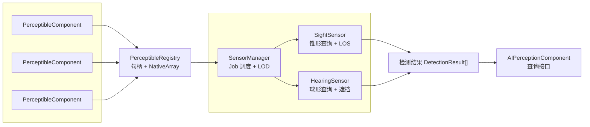

# CycloneGames.AIPerception

高性能 AI 感知系统，集成 Jobs/Burst 优化、零 GC 设计和跨平台支持。

---

## 目录

1. [特性](#特性)
2. [安装](#安装)
3. [快速开始](#快速开始)
4. [核心概念](#核心概念)
5. [组件参考](#组件参考)
6. [传感器配置](#传感器配置)
7. [类型系统](#类型系统)
8. [运行时调试工具](#运行时调试工具)
9. [扩展系统](#扩展系统)
10. [性能](#性能)
11. [平台支持](#平台支持)

---

## 特性

- **零 GC 运行时**：使用 `NativeList`、`NativeArray` 和句柄 - 游戏运行时无垃圾回收
- **Burst 编译**：SIMD 优化的并行传感器查询，性能最大化
- **跨平台**：WebGL、移动端优化、主机支持
- **编辑器调试工具**：可视化视锥体、球形范围和实时检测覆盖层
- **可扩展类型系统**：运行时注册自定义可感知类型

---

## 安装

1. 将 `CycloneGames.AIPerception` 文件夹复制到项目的 `Assets` 目录
2. 确保已安装以下 Unity 包：
   - `com.unity.collections`
   - `com.unity.burst`
   - `com.unity.mathematics`

---

## 快速开始

### 第一步：为可检测对象添加 Perceptible

为任何需要被 AI 检测的对象（玩家、敌人、NPC 等）添加 `PerceptibleComponent`：

```csharp
// 通过菜单：Component > CycloneGames > AI > Perceptible
// 或通过代码：
gameObject.AddComponent<PerceptibleComponent>();
```

配置组件：

- **Type ID**：对象分类（0=默认，1=玩家，2=敌人等）
- **Is Detectable**：开关检测
- **Detection Radius**：碰撞检测大小

### 第二步：为 AI 代理添加感知

为需要检测其他对象的 AI 角色添加 `AIPerceptionComponent`：

```csharp
// 通过菜单：Component > CycloneGames > AI > AI Perception
// 或通过代码：
gameObject.AddComponent<AIPerceptionComponent>();
```

启用并配置传感器：

- **Sight Sensor**：带视线检测的锥形视觉检测
- **Hearing Sensor**：带遮挡的球形声音检测

### 第三步：查询检测结果

```csharp
using CycloneGames.AIPerception;

public class AIBrain : MonoBehaviour
{
    private AIPerceptionComponent _perception;

    void Start()
    {
        _perception = GetComponent<AIPerceptionComponent>();
    }

    void Update()
    {
        // 检查视觉检测
        if (_perception.HasSightDetection)
        {
            var target = _perception.GetClosestSightTarget();
            if (target != null)
            {
                Debug.Log($"我看到了 {target.gameObject.name}！");
            }
        }

        // 检查声音检测
        if (_perception.HasHearingDetection)
        {
            var source = _perception.GetClosestHearingTarget();
            if (source != null)
            {
                Debug.Log($"我听到了声音，位置在 {source.Position}！");
            }
        }
    }
}
```

---

## 核心概念

### 架构概览



### 核心组件

| 组件                    | 用途                                |
| ----------------------- | ----------------------------------- |
| `PerceptibleComponent`  | 使对象可被 AI 传感器检测            |
| `AIPerceptionComponent` | 赋予 AI 检测可感知对象的能力        |
| `PerceptibleRegistry`   | 使用代际句柄的 O(1) 查找中央注册表  |
| `SensorManager`         | 管理传感器更新，支持 LOD 和作业调度 |
| `SightSensor`           | 带视线检查的锥形视觉检测            |
| `HearingSensor`         | 带遮挡的球形音频检测                |

### 代际句柄

系统使用 `PerceptibleHandle` 而非直接引用来避免 GC：

```csharp
public readonly struct PerceptibleHandle
{
    public readonly int Id;          // 注册表中的槽位索引
    public readonly int Generation;  // 有效性计数器
}
```

当对象被销毁时，其槽位的代数会递增，使旧句柄失效。

---

## 组件参考

### PerceptibleComponent

使 GameObject 可被 AI 传感器检测。

| 属性               | 类型      | 说明                                     |
| ------------------ | --------- | ---------------------------------------- |
| `Type ID`          | int       | 类别 ID（见[类型系统](#类型系统)）       |
| `Tag`              | string    | 可选的自定义标签用于过滤                 |
| `Detection Radius` | float     | 邻近检测大小                             |
| `Is Detectable`    | bool      | 启用/禁用检测                            |
| `LOS Point`        | Transform | 可选的视线检测点（为空时使用 transform） |
| `Is Sound Source`  | bool      | 启用音频发射                             |
| `Loudness`         | float     | 声音音量倍数（0-10）                     |

**运行时属性：**

- `Handle`：此可感知对象的代际句柄
- `Position`：当前世界位置
- `GetDetectors()`：当前检测到此对象的 AI 列表

### AIPerceptionComponent

为检测可感知对象提供传感器。

| 属性                 | 类型    | 说明                             |
| -------------------- | ------- | -------------------------------- |
| `Enable Sight`       | bool    | 启用视觉检测                     |
| `Enable Hearing`     | bool    | 启用音频检测                     |
| `Show Debug Overlay` | bool    | 切换运行时调试 UI                |
| `Toggle Key`         | KeyCode | 切换调试覆盖层的按键（默认：F3） |

**运行时属性：**

- `HasSightDetection`：有目标可见时为 true
- `HasHearingDetection`：听到声音时为 true
- `SightDetectedCount`：可见目标数量
- `HearingDetectedCount`：听到的声音数量
- `GetClosestSightTarget()`：最近的可见可感知对象
- `GetClosestHearingTarget()`：最近的声源

---

## 传感器配置

### 视觉传感器

带可选视线检测的锥形检测。

| 属性                | 范围      | 说明                                |
| ------------------- | --------- | ----------------------------------- |
| `Half Angle`        | 0-180°    | 视野半角（60° = 总共 120° FOV）     |
| `Max Distance`      | 0-200m    | 最大检测距离                        |
| `Update Interval`   | 0-5s      | 传感器更新间隔（越低 CPU 消耗越高） |
| `Obstacle Layer`    | LayerMask | 阻挡视线的层                        |
| `Use Line of Sight` | bool      | 启用射线可见性检查                  |
| `Filter by Type`    | bool      | 只检测特定类型                      |
| `Target Type ID`    | int       | 要过滤的类型（启用过滤时）          |

> [!TIP]
>
> 大多数情况下将 `Update Interval` 设为 0.1-0.2 秒。更低的值会增加 CPU 使用但提供更快的检测。

> [!WARNING]
>
> 使用 `Obstacle Layer` 时，排除 Player/Enemy 层以避免目标阻挡自身的检测。

### 听觉传感器

带声音遮挡的球形检测。

| 属性                    | 范围      | 说明                           |
| ----------------------- | --------- | ------------------------------ |
| `Radius`                | 0-100m    | 检测球半径                     |
| `Update Interval`       | 0-5s      | 传感器更新间隔                 |
| `Use Occlusion`         | bool      | 启用墙壁衰减                   |
| `Occlusion Layer`       | LayerMask | 阻挡声音的层                   |
| `Occlusion Attenuation` | 0-1       | 穿墙声音衰减（0.5 = 50% 音量） |
| `Filter by Type`        | bool      | 只检测特定类型                 |
| `Target Type ID`        | int       | 要过滤的类型                   |

---

## 类型系统

感知系统使用可扩展的整数类型系统。

### 内置类型

| ID  | 常量                            | 说明        |
| --- | ------------------------------- | ----------- |
| 0   | `PerceptibleTypes.Default`      | 默认/未指定 |
| 1   | `PerceptibleTypes.Player`       | 玩家角色    |
| 2   | `PerceptibleTypes.Enemy`        | 敌人角色    |
| 3   | `PerceptibleTypes.Ally`         | 友方 NPC    |
| 4   | `PerceptibleTypes.Neutral`      | 中立实体    |
| 5   | `PerceptibleTypes.Interactable` | 可交互对象  |
| 6   | `PerceptibleTypes.SoundSource`  | 音频发射器  |

### 注册自定义类型

```csharp
// 在启动时注册
public static class GamePerceptibleTypes
{
    public static int Treasure;
    public static int Trap;
    public static int Vehicle;

    [RuntimeInitializeOnLoadMethod(RuntimeInitializeLoadType.BeforeSceneLoad)]
    static void Initialize()
    {
        Treasure = PerceptibleTypes.RegisterType("Treasure");
        Trap = PerceptibleTypes.RegisterType("Trap");
        Vehicle = PerceptibleTypes.RegisterType("Vehicle");
    }
}

// 使用
perceptible.TypeId = GamePerceptibleTypes.Treasure;
```

### 按类型过滤

在传感器上启用 `Filter by Type` 以只检测特定类型：

```csharp
// 只检测敌人
sightConfig.FilterByType = true;
sightConfig.TargetTypeId = PerceptibleTypes.Enemy;
```

---

## 运行时调试工具

### Gizmo 可视化

选中带有 `AIPerceptionComponent` 的 AI 可看到：

- **黄色锥体**：视觉传感器视野
- **蓝色球体**：听觉传感器范围
- **绿色线条**：到检测目标的连接

### 调试覆盖层

在 Inspector 中切换运行时调试覆盖层

**覆盖层示例显示：**

> **AI Perception - Enemy**
>
> **SIGHT**
>
> - 已启用: True
> - 检测到: 1
>
>   - ► Player (Player)
>   - 距离: 5.2m 可见度: 87%
>
>   **HEARING**
>
> - 已启用: True
> - 检测到: 0
>   - (无目标)

---

## 扩展系统

### 创建派生的 Perceptible

```csharp
public class WeaponPerceptible : PerceptibleComponent
{
    [SerializeField] private WeaponType _weaponType;
    [SerializeField] private int _dangerLevel;

    public WeaponType Type => _weaponType;
    public int DangerLevel => _dangerLevel;
}
```

### 创建派生的 AI Perception

```csharp
public class AdvancedPerception : AIPerceptionComponent
{
    [SerializeField] private float _alertLevel;
    [SerializeField] private bool _useEnhancedVision;

    protected override void Update()
    {
        base.Update();

        if (HasSightDetection)
        {
            _alertLevel = Mathf.Min(_alertLevel + Time.deltaTime, 1f);
        }
        else
        {
            _alertLevel = Mathf.Max(_alertLevel - Time.deltaTime * 0.5f, 0f);
        }
    }
}
```

---

## Jobs 调度模式 (Job Scheduling Mode)

系统支持两种 Jobs 调度模式，适应不同的使用场景：

### 立即模式 (Immediate Mode) - 默认

Job 在 `Update()` 期间立即完成。最适合开发和调试。

```csharp
// 默认行为 - 无需配置
PerceptionManagerComponent.Instance.UseDeferredJobCompletion = false;
```

**优点：**

- 调试更简单
- 结果立即可用
- 无延迟

### 延迟模式 (Deferred Mode) - 高性能

Job 在 `LateUpdate()` 中批量完成。最适合拥有 100+ 传感器的的大规模场景。

```csharp
// 通过代码启用
PerceptionManagerComponent.Instance.UseDeferredJobCompletion = true;

// 或在 PerceptionManager GameObject 上的 Inspector 中启用
```

**优点：**

- 通过 Job 批处理提高 CPU 利用率
- 减少同步点
- 最适合大量并发传感器

**工作原理：**

```
Update():     传感器调度 Job → 上一帧结果保持可见
LateUpdate(): 所有 Job 完成 → 原子交换到新结果
```

> [!TIP]
> 在拥有许多 AI Agent 的生产版本中启用 **延迟模式**。在开发过程中使用 **立即模式** 以便更轻松地调试。

---

## 性能

### 优化技巧

1. **增加更新间隔**：0.1-0.2 秒通常足够
2. **使用类型过滤**：只检测相关类型
3. **不需要时禁用 LOS**：射线检测开销大
4. **使用 LOD**：减少远距离 AI 的传感器频率
5. **启用延迟模式**：对于 100+ 传感器，批量 Job 完成效率更高

---

## 平台支持

| 平台              | 策略            | 性能 |
| ----------------- | --------------- | ---- |
| Windows/Mac/Linux | 完整 Burst SIMD | 最优 |
| Android/iOS       | ARM NEON        | 优秀 |
| WebGL             | 主线程运行      | 良好 |

---

## API 参考

### PerceptibleRegistry

```csharp
// 获取单例实例
var registry = PerceptibleRegistry.Instance;

// 注册可感知对象（返回句柄）
PerceptibleHandle handle = registry.Register(perceptible);

// 从句柄获取可感知对象
IPerceptible p = registry.Get(handle);

// 检查句柄是否仍然有效
bool valid = registry.IsValid(handle);

// 标记数据为脏（触发重建）
registry.MarkDirty();
```

### SensorManager

```csharp
// 获取单例实例
var manager = SensorManager.Instance;

// 注册传感器
manager.Register(sensor);

// 注销传感器
manager.Unregister(sensor);

// 通过 ID 获取传感器
ISensor sensor = manager.GetSensor(sensorId);
```

---

## 故障排除

### 目标可见但显示 "LOS Blocked"

**原因**：Obstacle Layer 包含了目标所在的层。

**解决方案**：从 Obstacle Layer 中移除 Player/Enemy 层。只包含环境层（墙壁、障碍物）。

### 检测不工作

**检查清单**：

1. ✅ `PerceptibleComponent` 已启用且 `Is Detectable` 已勾选
2. ✅ `AIPerceptionComponent` 传感器已启用
3. ✅ 目标在传感器范围内
4. ✅ 目标在视野内（对于视觉）
5. ✅ 无障碍物阻挡 LOS（或禁用 LOS）

### 调试覆盖层显示 "Invalid (?)"

**原因**：PerceptibleData 和 PerceptibleHandle 之间的句柄不匹配。

**解决方案**：确保使用具有正确注册表 ID 映射的最新版本。

---
