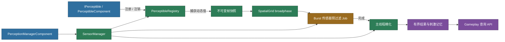

# CycloneGames.AIPerception

[English](./README.md) | 简体中文

CycloneGames.AIPerception 是用于连续世界感知的 Unity Runtime 模块。它注册可感知目标，捕获不可变世界快照，通过 Burst/Jobs 运行视觉/听觉/邻近预过滤，并向 Gameplay 代码提供实时与记忆检测结果。

## 目录

- [概述](#概述)
- [架构](#架构)
- [快速上手](#快速上手)
- [核心概念](#核心概念)
- [使用指南](#使用指南)
- [高级主题](#高级主题)
- [常见场景](#常见场景)
- [性能与内存](#性能与内存)
- [故障排查](#故障排查)

## 概述

当 Unity 智能体需要连续感知能力时使用本模块：

- 3D 锥体内的视觉，可选主线程 Physics 视线检查；
- 来自标记为连续声音源的可感知对象的听觉（`IsSoundSource == true`）；
- 3D 半径内的邻近感知；
- 直接检测结束后的短期刺激记忆；
- 基于距离的传感器更新降频（LOD）。

数据模型不包含特定游戏类型假设。目标由稳定整数类型、位置、检测半径、响度、声音源状态和可选 Tag 描述。队伍、潜行规则、威胁、阵营态度、伤害和行为选择由产品代码负责。

### 程序集与依赖

| 程序集 | 平台 | 职责 |
| --- | --- | --- |
| `CycloneGames.AIPerception` | Runtime | 注册表、快照、空间 broadphase、传感器、Job、记忆和 Unity 组件 |
| `CycloneGames.AIPerception.Editor` | Editor | 自定义 Inspector、校验、Runtime 诊断和 Scene Gizmo |
| `CycloneGames.AIPerception.Tests.Editor` | Editor 测试 | 核心契约与边界测试 |

Runtime 依赖：`Unity.Burst`、`Unity.Collections`、`Unity.Mathematics`。

## 架构


```mermaid
flowchart LR
    P["IPerceptible / PerceptibleComponent"] -->|注册 / 注销| R["PerceptibleRegistry"]
    R -->|捕获动态值| S["不可变帧快照"]
    S --> G["SpatialGrid broadphase"]
    G --> J["Burst 传感器预过滤 Job"]
    J -->|完成| F["主线程精化"]
    F --> B["有界结果与刺激记忆"]
    B --> Q["Gameplay 查询 API"]
    M["PerceptionManagerComponent"] --> SM["SensorManager"]
    SM --> R
    SM --> J
    SM --> F

    classDef authoring fill:#2f6f9f,color:#fff,stroke:#183d58;
    classDef runtime fill:#2d7d57,color:#fff,stroke:#17442f;
    classDef worker fill:#9a6b1f,color:#fff,stroke:#594012;
    classDef output fill:#7b4d9c,color:#fff,stroke:#432957;
    class P,M authoring;
    class R,S,G,SM,F runtime;
    class J worker;
    class B,Q output;
```

一次 Manager 更新顺序：

1. 完成并提交上一次 Deferred 更新中仍未完成的工作。
2. 在 owner thread 采样每个已注册 `IPerceptible`。
3. 仅在捕获数据变化时重建排序后的空间快照与 native copy。
4. 为 effective interval 已到期的传感器选择候选。
5. 对不可变 native 快照运行兼容 Burst 的预过滤。
6. 根据调度配置立即完成，或在 `LateUpdate` 完成。
7. 在主线程执行 Unity Physics 精化，然后提交实时结果与记忆。

Job 借用 Registry 快照和传感器自有 buffer。Manager 发布新快照或移除传感器前会完成 pending job。

## 快速上手

### 1. 添加 Manager

在场景对象上添加 `PerceptionManagerComponent`。`AIPerceptionComponent` 初始化时会自动创建实例，但显式 Manager 能让世界容量、空间网格尺寸、调度与 LOD 可见。

除非 Gameplay 需要在同一个 `Update` 取得结果，否则保持 `Deferred Job Completion` 开启。初始使用有限的 `Maximum Perceptibles`。仅从 profiling 数据调整 `Spatial Cell Size`。

### 2. 标记目标

为每个可检测对象添加 `PerceptibleComponent`：

```csharp
using CycloneGames.AIPerception.Runtime;

PerceptibleComponent target = GetComponent<PerceptibleComponent>();
target.SetTypeId(PerceptibleTypes.Enemy);
target.SetDetectionRadius(1.25f);
target.SetSoundSource(true);
target.SetLoudness(0.8f);
```

- 分配项目所有的稳定 `Type ID`；
- 将 `Detection Radius` 设为世界空间检测范围；
- Transform 原点不适合视线检查时指定 `LOS Point`；
- 仅为连续听觉发射体启用 `Is Sound Source`；
- 将 `Loudness` 设为非负听觉距离倍率。

`PerceptibleComponent` 在 `OnEnable` 自动注册。如果有限世界容量拒绝了这次尝试，应先释放容量，再从 cold-path 恢复流程调用一次 `TryRegister()`，不得逐帧重试。

### 3. 为智能体添加感知

为 AI 对象添加 `AIPerceptionComponent`，在 Inspector 中启用并配置所需感知。同一 GameObject 同时存在 `PerceptibleComponent` 时，其句柄会从所有内置查询中排除。

### 4. 消费结果

```csharp
using CycloneGames.AIPerception.Runtime;
using UnityEngine;

[RequireComponent(typeof(AIPerceptionComponent))]
public sealed class GuardAwareness : MonoBehaviour
{
    private AIPerceptionComponent _perception;

    private void Awake()
    {
        _perception = GetComponent<AIPerceptionComponent>();
    }

    private void Update()
    {
        SightSensor sight = _perception.SightSensor;
        if (sight == null || !sight.TryGetResult(0, out DetectionResult result))
        {
            return;
        }

        if (result.IsFromMemory)
        {
            Investigate(result.LastKnownPosition);
            return;
        }

        IPerceptible target = PerceptibleRegistry.Instance.Get(result.Target);
        if (target is PerceptibleComponent component)
        {
            Engage(component.gameObject);
        }
    }

    private void Investigate(Unity.Mathematics.float3 position)
    {
        // 把最后已知位置交给产品侧导航或行为代码。
    }

    private void Engage(GameObject target)
    {
        // 产品侧决策与权威不属于感知模块。
    }
}
```

结果先按距离、再按 Runtime 句柄字段排序。`TryGetResult` 不需要临时集合。

## 核心概念

### Runtime 句柄

`PerceptibleHandle` 包含 `RegistryId`、`Id` 和 `Generation`：

- 只在发放它的 Registry 中有效；
- slot 复用会改变 generation，使旧句柄失效；
- 它是进程内身份 — 不得持久化、保存或通过网络发送；
- 双参数构造函数创建无作用域比较句柄，Registry 不会解析它。

### 可感知数据

| 成员 | 含义 |
| --- | --- |
| `PerceptibleTypeId` | 内置精确类型过滤使用的稳定分类 |
| `IsDetectable` | 目标是否进入当前快照 |
| `Position` | broadphase 和距离测试使用的中心 |
| `DetectionRadius` | 加入传感器范围的非负目标范围 |
| `Loudness` | 非负听觉距离倍率 |
| `IsSoundSource` | 参与内置 Hearing 的必要条件 |
| `GetLOSPoint()` | Sight raycast 使用的点 |
| `Tag` | 消费者元数据；内置传感器不按 Tag 过滤 |

Registry 每次 manager 更新采样一次这些成员。非有限位置、LOS 点、半径或响度会使目标不会进入本次快照。

### 稳定类型 ID

持久化或网络契约使用显式分配的 ID：

```csharp
public static class GamePerceptibleTypes
{
    public const int AlarmEmitter = 1001;

    [RuntimeInitializeOnLoadMethod(RuntimeInitializeLoadType.BeforeSceneLoad)]
    private static void Register()
    {
        PerceptibleTypes.RegisterType(AlarmEmitter, "AlarmEmitter");
    }
}
```

`RegisterType(string)` 按进程内注册顺序分配 ID，仅适用于不持久化、不联网的扩展。

### 检测结果

`DetectionResult` 包含目标句柄、相对传感器的距离、最后已知位置、检测时间、`Visibility`、传感器类型和 `IsFromMemory`。

`Visibility` 是传感器特定强度：Sight 使用锥体内角度强度，Hearing 使用经可选衰减后的可听度，Proximity 使用距离强度。Memory 从最近一次实时检测的 Visibility 开始线性衰减。

不创建临时集合即可读取：

```csharp
SightSensor sensor = perception.SightSensor;
for (int i = 0; sensor != null && i < sensor.DetectedCount; i++)
{
    if (sensor.TryGetResult(i, out DetectionResult result))
    {
        Consume(result);
    }
}
```

Copy 方法向调用方持有 storage 追加内容：

```csharp
var results = new Unity.Collections.NativeList<DetectionResult>(
    sensor.DetectedCount,
    Unity.Collections.Allocator.Temp);
try
{
    sensor.GetDetectionResults(ref results);
    // 在此处消费结果。
}
finally
{
    results.Dispose();
}
```

## 使用指南

### Sight

Sight 使用 Burst 锥体预过滤和可选主线程 `Physics.Raycast`。

| 设置 | 默认值 | 描述 |
| --- | ---: | --- |
| `HalfAngle` | 60 度 | 3D 总 FOV 的一半；有限范围 0–180 |
| `MaxDistance` | 30 | 基础距离；叠加目标半径 |
| `UpdateInterval` | 0.1 s | LOD 前的基础间隔 |
| `UseLineOfSight` | 开启 | 启用 3D Physics 精化 |
| `ObstacleLayer` | 默认 raycast layers | 作为遮挡物的 Layer |
| `MaximumLineOfSightChecksPerUpdate` | 64 | 正值限制次数；0 表示无限制 |
| `FilterByType` | 关闭 | 开启后精确匹配 `TargetTypeId` |
| `MemoryDuration` | 3 s | 0 关闭记忆 |

除非目标 Collider 应当阻挡视线，否则从 `ObstacleLayer` 排除目标 Layer。达到 LOS 预算时，Sight 提交已完成精化的结果，报告 `LineOfSightBudgetExceeded` 并推进 cursor。

### Hearing

Hearing 只接受 `IsSoundSource == true` 的目标。有效范围：

```text
(sensor Radius × target Loudness) + target DetectionRadius
```

| 设置 | 默认值 | 描述 |
| --- | ---: | --- |
| `Radius` | 15 | 连续发射的基础范围 |
| `UpdateInterval` | 0.2 s | LOD 前的基础间隔 |
| `UseOcclusion` | 开启 | 启用主线程 `Physics.Linecast` |
| `OcclusionLayer` | 默认 raycast layers | 作为声音阻挡物的 Layer |
| `OcclusionAttenuation` | 0.5 | 0–1 内的有限倍率 |
| `MaximumOcclusionChecksPerUpdate` | 64 | 正值限制 Linecast 次数；0 为无限制 |
| `FilterByType` | 关闭 | 可选精确类型过滤 |
| `MemoryDuration` | 5 s | 0 关闭记忆 |

Hearing 不检查 `AudioSource`、Mixer 状态、Clip、音量曲线或一次性事件。`Loudness == 0` 且 `DetectionRadius == 0` 时不会产生结果。

### Proximity

Proximity 执行不含 Physics 遮挡的 Burst 球体测试：

```text
有效范围 = sensor Radius + target DetectionRadius
```

| 设置 | 默认值 | 描述 |
| --- | ---: | --- |
| `Radius` | 5 | 基础邻近范围 |
| `UpdateInterval` | 0.15 s | LOD 前的基础间隔 |
| `FilterByType` | 关闭 | 可选精确类型过滤 |
| `MemoryDuration` | 2 s | 0 关闭记忆 |

有效范围为零时不产生检测结果。

### 刺激记忆

每个内置传感器持有独立的有界记忆：

1. 实时检测为每个句柄创建或刷新一个条目。
2. 刷新的条目只作为实时结果输出，不会重复输出记忆结果。
3. 未再次检测但未过期的条目以 `IsFromMemory == true` 输出。
4. Visibility 随时间线性衰减。
5. 条目在达到配置时长或衰减 Visibility 到达内部 0.01 阈值时移除。
6. 容量满时淘汰最旧条目。

Memory 使用 `Time.timeAsDouble`，遵循 Unity game time。刷新会用最新实时检测替换保存的位置、时间戳、距离与 Visibility。

### 结果迭代模式

**基于索引（无 GC）：**

```csharp
SightSensor sensor = perception.SightSensor;
for (int i = 0; sensor != null && i < sensor.DetectedCount; i++)
{
    if (sensor.TryGetResult(i, out DetectionResult result))
    {
        // 消费结果。
    }
}
```

**批量复制：**

```csharp
var results = new NativeList<DetectionResult>(128, Allocator.Temp);
try
{
    sensor.GetDetectionResults(ref results);
    foreach (DetectionResult result in results) { /* ... */ }
}
finally { results.Dispose(); }
```

**仅句柄（轻量）：**

```csharp
var handles = new NativeList<PerceptibleHandle>(64, Allocator.Temp);
try
{
    sensor.GetDetectedHandles(ref handles);
    foreach (PerceptibleHandle handle in handles)
    {
        IPerceptible target = PerceptibleRegistry.Instance.Get(handle);
        // ...
    }
}
finally { handles.Dispose(); }
```

## 高级主题

### Runtime 重配置

可在运行时修改传感器行为：

```csharp
SightSensor sight = perception.SightSensor;
if (sight != null)
{
    SightSensorConfig config = sight.Config;
    config.MaxDistance = 45f;
    config.MemoryDuration = 1.5f;
    sight.ApplyConfig(in config);
}
```

`AIPerceptionComponent.ApplyAuthoringConfiguration` 是 cold-path rebuild，会排空、注销、Dispose 并重新创建组件持有的传感器。

### 世界容量

`PerceptionManagerComponent.Maximum Perceptibles` 配置 Registry 硬上限：

- 正值在容量耗尽后拒绝新注册；
- `0` 允许在 safe point 扩展数组，不提供模块级硬上限；
- 不能把上限降低到当前 active count 以下。

### 每个传感器的容量

每个传感器配置内嵌 `PerceptionSensorCapacity`：

| 字段 | 默认值 | 行为 |
| --- | ---: | --- |
| `InitialCandidateCapacity` | 64 | 初始持久化 broadphase index 存储 |
| `MaximumCandidates` | 16384 | 单次查询候选硬上限 |
| `InitialResultCapacity` | 32 | 初始持久化结果存储 |
| `MaximumResults` | 1024 | 实时与记忆结果总硬上限 |
| `InitialMemoryCapacity` | 32 | 初始持久化记忆存储 |
| `MaximumMemoryEntries` | 1024 | 记忆目标硬上限 |

容量失败是显式状态：

- `CandidateCapacityExceeded`：拒绝并清空当前实时候选查询；
- `ResultCapacityExceeded`：阻止继续输出实时或记忆结果；
- `LineOfSightBudgetExceeded`：Sight 精化结果不完整；
- `OcclusionBudgetExceeded`：Hearing 精化结果不完整。

在开发 telemetry 中记录这些状态，不得当成正常静默截断。

### LOD 频率

`SensorLODLevel.FrequencyMultiplier` 缩放更新频率：

```text
effective interval = base UpdateInterval / FrequencyMultiplier
```

| 到 Reference 的距离 | 默认倍率 | 间隔倍率 |
| --- | ---: | ---: |
| 30 以内 | 1.00 | 1x |
| 80 以内 | 0.50 | 2x |
| 200 以内及更远 | 0.25 | 4x |

Distance 必须有限、为正并严格递增。Multiplier 必须位于 `(0, 1]`。Reference 为空或 Levels 为空时禁用 LOD。

### 生命周期与所有权

| 对象 | Owner | 关闭规则 |
| --- | --- | --- |
| `PerceptibleComponent` 注册 | 已启用组件 | 在 `OnDisable` 注销 |
| 组件内置传感器 | `AIPerceptionComponent` | 禁用或重建时注销并 Dispose |
| 直接构造的传感器 | 构造它的 Integration | 先注销，再 `Dispose` |
| 传感器 Buffer 与 Job | 传感器 | 释放 Buffer 前完成 pending work |
| Registry 快照/native storage | `PerceptibleRegistry` | 世界关闭或重置时 Dispose |
| 传感器调度 | 构造时传入的 `SensorManager` | 在其 Registry 前 Dispose |

直接所有权示例：

```csharp
public sealed class OwnedSightSense : MonoBehaviour
{
    private SensorManager _manager;
    private SightSensor _sensor;

    private void OnEnable()
    {
        _ = PerceptionManagerComponent.Instance;
        _manager = SensorManager.Instance;
        PerceptibleComponent self = GetComponent<PerceptibleComponent>();
        PerceptibleHandle ignored = self != null
            ? self.Handle
            : PerceptibleHandle.Invalid;

        SightSensorConfig config = SightSensorConfig.Default;
        config.UseLineOfSight = false;
        _sensor = new SightSensor(transform, config, _manager, ignored);
        _manager.Register(_sensor);
    }

    private void OnDisable()
    {
        if (_sensor == null)
        {
            return;
        }

        if (_manager != null && !_manager.IsDisposed)
        {
            _manager.Unregister(_sensor);
        }

        _sensor.Dispose();
        _sensor = null;
        _manager = null;
    }
}
```

三种内置传感器使用一致的显式 owner overload：`(Transform, Config, SensorManager owner, PerceptibleHandle ignoredTarget = default)`。

### 线程亲和性

`PerceptibleRegistry` 和 `SensorManager` 捕获 owner managed-thread ID，并拒绝来自其他线程的修改调用。注册、注销、捕获、配置、结果提交、Physics 检查和 Dispose 属于该 owner thread。

Worker Job 读取不可变 Native 快照并写入传感器自有数组，不访问 `Transform`、`GameObject`、managed perceptible 或 Unity Physics。

### Immediate 与 Deferred 完成

- Immediate 模式在 `UpdateSensor` 内完成传感器，返回时结果可用。
- Deferred 模式在 Manager `Update` 调度符合条件的传感器，在 `LateUpdate` 完成和提交。
- 从 Deferred 切换到 Immediate 前会先完成 pending work。
- 移除或 Dispose 传感器会排空 pending job。

### 扩展模式

`PerceptibleComponent`、`AIPerceptionComponent` 和 `PerceptionManagerComponent` 是 sealed adapter。通过组合扩展：

- 把产品行为放在 `AIPerceptionComponent` 旁边；
- 为其他数据源实现 `IPerceptible`；
- 为产品特定感知实现 `ISensor`；
- 向 `SensorManager` 注册直接构造的传感器；
- 将 Unity Object 和 Physics 访问限制在 adapter/refinement boundary。

`ISensor` 实现必须定义所有权、有界容量、更新状态、调度、结果可见性、Dispose 和线程亲和性。Manager 不会自动提供这些策略。

自定义传感器不得在 `UpdateSensor` 或 `ProcessJobResults` 中重入地注册或注销传感器。排队 collection 变更，并在 Manager 迭代之外的 owner-thread safe point 应用。

### Networking 桥接

Runtime 句柄绝不是网络身份。可选兄弟模块 `CycloneGames.AIPerception.Networking` 通过稳定网络目标身份、协议版本、权威策略和 observer filtering 与 `CycloneGames.Networking` 集成。参阅其[文档](../CycloneGames.AIPerception.Networking/README.SCH.md)。

## 常见场景

### 检测最近目标

```csharp
SightSensor sight = perception.SightSensor;
if (sight != null && sight.HasDetection)
{
    // 结果已按距离预排序。
    if (sight.TryGetResult(0, out DetectionResult closest))
    {
        IPerceptible target = PerceptibleRegistry.Instance.Get(closest.Target);
        if (target is PerceptibleComponent component)
        {
            // 使用 component.gameObject 进行导航、战斗等。
        }
    }
}
```

### 按类型过滤检测所有目标

```csharp
SightSensor sight = perception.SightSensor;
for (int i = 0; sight != null && i < sight.DetectedCount; i++)
{
    if (!sight.TryGetResult(i, out DetectionResult result))
    {
        continue;
    }

    IPerceptible target = PerceptibleRegistry.Instance.Get(result.Target);
    if (target != null && target.PerceptibleTypeId == PerceptibleTypes.Enemy)
    {
        // 处理敌方目标。
    }
}
```

### 处理仅存在于记忆中的目标

```csharp
for (int i = 0; i < sight.DetectedCount; i++)
{
    if (!sight.TryGetResult(i, out DetectionResult result))
    {
        continue;
    }

    if (result.IsFromMemory)
    {
        // 目标不再被直接检测到。
        // 使用 result.LastKnownPosition 和 result.Visibility。
        AIInvestigate(result.LastKnownPosition, result.Visibility);
    }
    else
    {
        // 目标当前仍被检测。完整数据可用。
        IPerceptible target = PerceptibleRegistry.Instance.Get(result.Target);
        AIEngage(target);
    }
}
```

### 动态更改传感器配置

```csharp
void OnEnterAlertMode(AIPerceptionComponent perception)
{
    SightSensor sight = perception.SightSensor;
    if (sight == null) return;

    var config = sight.Config;
    config.MaxDistance = 60f;
    config.UpdateInterval = 0.05f;
    config.HalfAngle = 90f;
    sight.ApplyConfig(in config);
}

void OnExitAlertMode(AIPerceptionComponent perception)
{
    SightSensor sight = perception.SightSensor;
    if (sight == null) return;

    var config = sight.Config;
    config.MaxDistance = 30f;
    config.UpdateInterval = 0.1f;
    config.HalfAngle = 60f;
    sight.ApplyConfig(in config);
}
```

## 性能与内存

### 成本因素

| 变量 | 主要成本 |
| --- | --- |
| N | 每次 Manager 更新采样的全部已注册对象 |
| C | 单个传感器 Job 处理的 broadphase 候选 |
| R | 主线程 Sight LOS 或 Hearing occlusion 检查 |
| M | 单个传感器处理的记忆条目 |
| S | 一帧内 effective interval 到期的传感器 |

Runtime 特征：

- managed/native array、candidate list、result list、memory list 与 lookup storage 在达到所需容量后复用；
- 注册增长、首次使用、容量增长、配置重建与空间 Dictionary 增长是分配点；
- 快照捕获为 O(N)，即使捕获值未变化；
- 每目标最终测试前，查询范围会包含相关目标最大半径或响度；
- 查询跨越的网格单元超过安全阈值时回退到线性快照扫描；
- Sight 与 Hearing 的 Physics 精化仍在主线程；
- 提交后的输出会排序，便于确定性的距离优先消费。

### 数值限制

有限输入首先使用 float 快路径。距离平方溢出但最终距离仍可表示时，受保护路径用 double 重新计算，再返回有限 float 结果。当真实偏移超过 `float.MaxValue` 时，Job 写入内部 `-1` sentinel；内置传感器映射为 `CoordinateRangeExceeded`（9），忽略该目标。

Unity Physics 实际精度在远低于 `float.MaxValue` 时下降。大世界产品应使用 floating origin 或分区。

### 调优顺序

1. 定义每种感知的 Gameplay 延迟要求。
2. 根据峰值分布和显式余量设置有限世界与传感器容量。
3. 禁用未使用的感知。
4. 在允许过期数据的位置增大 Update Interval。
5. 配置并验证具有权威性的 LOD Reference。
6. 使用正的 Sight LOS 与 Hearing Occlusion 预算限制 Physics 检查。
7. 收窄 obstacle 与 occlusion mask。
8. 不需要持久化时把 Memory Duration 设为零。
9. 根据实测密度与范围调整 cell size。
10. 在目标 Player 比较 Immediate 与 Deferred 调度。

### Editor 工作流

为 `PerceptibleComponent`、`AIPerceptionComponent` 和 `PerceptionManagerComponent` 提供的自定义 Inspector 使用 `SerializedObject`/`SerializedProperty`，支持多对象编辑，保留 Undo 和 Prefab Override，Play Mode 锁定 authoring。

Play Mode 中通过 `Tools > CycloneGames > AI Perception > Show All Runtime Gizmos (Session)` 切换。开关仅当前 session 有效，退出时重置。

### 平台注意事项

| 目标平台 | 必须验证 |
| --- | --- |
| Windows、Linux、macOS | Player build、Burst 编译、worker 调度、Physics mask、关闭和长时间内存 |
| iOS、Android | IL2CPP/AOT build、设备热状态、worker 数、native memory、暂停/恢复和 reload |
| WebGL | Backend/Package 兼容、实际 Job 执行模型、内存上限、延迟与 Deferred 行为 |
| Dedicated Server | Headless 生命周期、3D Physics、权威 LOD 和无 Camera 假设 |
| 主机平台 | 授权 SDK build、Burst/Jobs 支持、内存限制、挂起/恢复和认证要求 |

## 故障排查

| 状态 | 含义 | 处理 |
| --- | --- | --- |
| `Uninitialized` | 尚未建立可用传感器状态 | 检查构造与生命周期 |
| `Ready` | 最近查询与提交完成 | 无需处理 |
| `NoTargets` | 没有实时候选 | 检查注册、detectable、范围与过滤 |
| `CandidateCapacityExceeded` | 候选硬上限拒绝实时查询 | 增大实测预算或降低密度/范围 |
| `ResultCapacityExceeded` | 结果硬上限截断实时或记忆输出，包括纯记忆更新 | 增大实测预算或缩小查询/记忆 |
| `LineOfSightBudgetExceeded` | Sight 返回部分精化结果 | 提高正预算或减少 raycast |
| `OcclusionBudgetExceeded` | Hearing 返回部分遮挡精化结果 | 提高经测量的正预算或减少 Linecast |
| `CoordinateRangeExceeded`（9） | 目标距离无法由 float 结果/Physics 契约表示 | 忽略目标，让活动世界靠近 floating origin |
| `InvalidConfiguration` | Transform 或有限值/范围规则无效 | 修正配置与生命周期 |
| `Disposed` | 传感器 Buffer 已不可用 | 停止查询或构造新传感器 |

| 现象 | 检查项 |
| --- | --- |
| 目标从不被检测 | Enabled、`IsDetectable`、有限数据、精确类型过滤与范围 |
| Hearing 忽略目标 | `IsSoundSource`、Loudness、目标半径、类型过滤与 occlusion mask |
| Sight 被目标自身阻挡 | 从 `ObstacleLayer` 移除目标 Layer 或更换 LOS Point |
| 结果晚一个阶段 | Deferred 在 `LateUpdate` 提交；调整顺序或使用 Immediate |
| Memory 存在但最近目标为空 | 句柄不再可解析；消费 `LastKnownPosition` |
| 出现容量状态 | 检查实测峰值分布；不得忽略 |
| LOD 无效果 | 指定 Reference、递增 Distance 和 `(0, 1]` 内倍率 |
| Runtime Inspector 被锁定 | 使用传感器 API 或 cold-path rebuild |
| 全局 Gizmo 消失 | Session state 在退出 Play Mode 时重置 |
