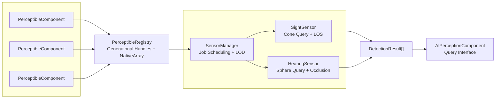

# CycloneGames.AIPerception

High-performance AI perception system with Jobs/Burst optimization, 0GC design, and cross-platform support.

---

## Table of Contents

1. [Features](#features)
2. [Installation](#installation)
3. [Quick Start](#quick-start)
4. [Core Concepts](#core-concepts)
5. [Component Reference](#component-reference)
6. [Sensor Configuration](#sensor-configuration)
7. [Type System](#type-system)
8. [Runtime Debug Tools](#runtime-debug-tools)
9. [Extending the System](#extending-the-system)
10. [Performance](#performance)
11. [Platform Support](#platform-support)

---

## Features

- **0GC Runtime**: Uses `NativeList`, `NativeArray`, and generational handles - no garbage collection during gameplay
- **Burst-Compiled**: Parallel sensor queries with SIMD optimization for maximum performance
- **Cross-Platform**: WebGL fallback, mobile-optimized, console-ready
- **Editor Debug Tools**: Visual frustum cone, sphere visualization, and real-time detection overlay
- **Extensible Type System**: Register custom perceptible types at runtime

---

## Installation

1. Copy the `CycloneGames.AIPerception` folder into your project's `Assets` directory
2. Ensure you have the following Unity packages installed:
   - `com.unity.collections`
   - `com.unity.burst`
   - `com.unity.mathematics`

---

## Quick Start

### Step 1: Add Perceptible to Detectable Objects

Add `PerceptibleComponent` to any object that should be detectable by AI (players, enemies, NPCs, etc.):

```csharp
// Via menu: Component > CycloneGames > AI > Perceptible
// Or via code:
gameObject.AddComponent<PerceptibleComponent>();
```

Configure the component:

- **Type ID**: Categorize the object (0=Default, 1=Player, 2=Enemy, etc.)
- **Is Detectable**: Toggle detection on/off
- **Detection Radius**: Size for collision-based detection

### Step 2: Add AI Perception to AI Agents

Add `AIPerceptionComponent` to AI characters that need to detect other objects:

```csharp
// Via menu: Component > CycloneGames > AI > AI Perception
// Or via code:
gameObject.AddComponent<AIPerceptionComponent>();
```

Enable and configure sensors:

- **Sight Sensor**: Cone-based visual detection with line-of-sight
- **Hearing Sensor**: Sphere-based sound detection with occlusion

### Step 3: Query Detection Results

```csharp
using CycloneGames.AIPerception;

public class AIBrain : MonoBehaviour
{
    private AIPerceptionComponent _perception;

    void Start()
    {
        _perception = GetComponent<AIPerceptionComponent>();
    }

    void Update()
    {
        // Check for visual detection
        if (_perception.HasSightDetection)
        {
            var target = _perception.GetClosestSightTarget();
            if (target != null)
            {
                Debug.Log($"I see {target.gameObject.name}!");
            }
        }

        // Check for sound detection
        if (_perception.HasHearingDetection)
        {
            var source = _perception.GetClosestHearingTarget();
            if (source != null)
            {
                Debug.Log($"I heard something at {source.Position}!");
            }
        }
    }
}
```

---

## Core Concepts

### Architecture Overview



### Key Components

| Component               | Purpose                                                      |
| ----------------------- | ------------------------------------------------------------ |
| `PerceptibleComponent`  | Makes an object detectable by AI sensors                     |
| `AIPerceptionComponent` | Gives an AI the ability to detect perceptibles               |
| `PerceptibleRegistry`   | Central registry with O(1) lookup using generational handles |
| `SensorManager`         | Manages sensor updates with LOD and job scheduling           |
| `SightSensor`           | Cone-based visual detection with line-of-sight checks        |
| `HearingSensor`         | Sphere-based audio detection with occlusion                  |

### Generational Handles

The system uses `PerceptibleHandle` instead of direct references to avoid GC:

```csharp
public readonly struct PerceptibleHandle
{
    public readonly int Id;          // Slot index in registry
    public readonly int Generation;  // Validity counter
}
```

When an object is destroyed, its slot's generation increments, invalidating old handles.

---

## Component Reference

### PerceptibleComponent

Makes a GameObject detectable by AI sensors.

| Property           | Type      | Description                                               |
| ------------------ | --------- | --------------------------------------------------------- |
| `Type ID`          | int       | Category ID (see [Type System](#type-system))             |
| `Tag`              | string    | Optional custom tag for filtering                         |
| `Detection Radius` | float     | Size for proximity detection                              |
| `Is Detectable`    | bool      | Enable/disable detection                                  |
| `LOS Point`        | Transform | Optional point for line-of-sight (uses transform if null) |
| `Is Sound Source`  | bool      | Enable audio emission                                     |
| `Loudness`         | float     | Sound volume multiplier (0-10)                            |

**Runtime Properties:**

- `Handle`: The generational handle for this perceptible
- `Position`: Current world position
- `GetDetectors()`: List of AIs currently detecting this object

### AIPerceptionComponent

Provides sensors for detecting perceptibles.

| Property             | Type    | Description                               |
| -------------------- | ------- | ----------------------------------------- |
| `Enable Sight`       | bool    | Enable visual detection                   |
| `Enable Hearing`     | bool    | Enable audio detection                    |
| `Show Debug Overlay` | bool    | Toggle runtime debug UI                   |
| `Toggle Key`         | KeyCode | Key to toggle debug overlay (default: F3) |

**Runtime Properties:**

- `HasSightDetection`: True if any target is visible
- `HasHearingDetection`: True if any sound is heard
- `SightDetectedCount`: Number of visible targets
- `HearingDetectedCount`: Number of heard sounds
- `GetClosestSightTarget()`: Nearest visible perceptible
- `GetClosestHearingTarget()`: Nearest sound source

---

## Sensor Configuration

### Sight Sensor

Cone-shaped detection with optional line-of-sight checking.

| Property            | Range     | Description                                       |
| ------------------- | --------- | ------------------------------------------------- |
| `Half Angle`        | 0-180°    | Field of view half-angle (60° = 120° total FOV)   |
| `Max Distance`      | 0-200m    | Maximum detection range                           |
| `Update Interval`   | 0-5s      | Seconds between sensor updates (lower = more CPU) |
| `Obstacle Layer`    | LayerMask | Layers that block line-of-sight                   |
| `Use Line of Sight` | bool      | Enable raycasting for visibility checks           |
| `Filter by Type`    | bool      | Only detect specific types                        |
| `Target Type ID`    | int       | Type to filter for (when filtering enabled)       |

> [!TIP]
>
> Set `Update Interval` to 0.1-0.2s for most cases. Lower values increase CPU usage but provide faster detection.

> [!WARNING]
>
> When using `Obstacle Layer`, exclude the Player/Enemy layers to avoid targets blocking their own detection.

### Hearing Sensor

Sphere-based detection with sound occlusion.

| Property                | Range     | Description                                      |
| ----------------------- | --------- | ------------------------------------------------ |
| `Radius`                | 0-100m    | Detection sphere radius                          |
| `Update Interval`       | 0-5s      | Seconds between sensor updates                   |
| `Use Occlusion`         | bool      | Enable wall attenuation                          |
| `Occlusion Layer`       | LayerMask | Layers that block sound                          |
| `Occlusion Attenuation` | 0-1       | Sound reduction through walls (0.5 = 50% volume) |
| `Filter by Type`        | bool      | Only detect specific types                       |
| `Target Type ID`        | int       | Type to filter for                               |

---

## Type System

The perception system uses an extensible integer-based type system.

### Built-in Types

| ID  | Constant                        | Description         |
| --- | ------------------------------- | ------------------- |
| 0   | `PerceptibleTypes.Default`      | Default/unspecified |
| 1   | `PerceptibleTypes.Player`       | Player characters   |
| 2   | `PerceptibleTypes.Enemy`        | Enemy characters    |
| 3   | `PerceptibleTypes.Ally`         | Allied NPCs         |
| 4   | `PerceptibleTypes.Neutral`      | Neutral entities    |
| 5   | `PerceptibleTypes.Interactable` | Interactive objects |
| 6   | `PerceptibleTypes.SoundSource`  | Audio emitters      |

### Registering Custom Types

```csharp
// Register at startup
public static class GamePerceptibleTypes
{
    public static int Treasure;
    public static int Trap;
    public static int Vehicle;

    [RuntimeInitializeOnLoadMethod(RuntimeInitializeLoadType.BeforeSceneLoad)]
    static void Initialize()
    {
        Treasure = PerceptibleTypes.RegisterType("Treasure");
        Trap = PerceptibleTypes.RegisterType("Trap");
        Vehicle = PerceptibleTypes.RegisterType("Vehicle");
    }
}

// Usage
perceptible.TypeId = GamePerceptibleTypes.Treasure;
```

### Filtering by Type

Enable `Filter by Type` on a sensor to only detect specific types:

```csharp
// Only detect enemies
sightConfig.FilterByType = true;
sightConfig.TargetTypeId = PerceptibleTypes.Enemy;
```

---

## Runtime Debug Tools

### Gizmo Visualization

Select an AI with `AIPerceptionComponent` to see:

- **Yellow cone**: Sight sensor field of view
- **Blue sphere**: Hearing sensor radius
- **Green lines**: Connections to detected targets

### Debug Overlay

toggle the runtime debug overlay from inspector

**Example overlay display:**

> **AI Perception - Enemy**
>
> **SIGHT**
>
> - Enabled: True
> - Detected: 1
>
>   - ► Player (Player)
>   - Dist: 5.2m Vis: 87%
>
>   **HEARING**
>
> - Enabled: True
> - Detected: 0
>   - (No targets)

---

## Extending the System

### Creating a Derived Perceptible

```csharp
public class WeaponPerceptible : PerceptibleComponent
{
    [SerializeField] private WeaponType _weaponType;
    [SerializeField] private int _dangerLevel;

    public WeaponType Type => _weaponType;
    public int DangerLevel => _dangerLevel;
}
```

### Creating a Derived AI Perception

```csharp
public class AdvancedPerception : AIPerceptionComponent
{
    [SerializeField] private float _alertLevel;
    [SerializeField] private bool _useEnhancedVision;

    protected override void Update()
    {
        base.Update();

        if (HasSightDetection)
        {
            _alertLevel = Mathf.Min(_alertLevel + Time.deltaTime, 1f);
        }
        else
        {
            _alertLevel = Mathf.Max(_alertLevel - Time.deltaTime * 0.5f, 0f);
        }
    }
}
```

---

## Job Scheduling Mode

The system supports two job scheduling modes for different use cases:

### Immediate Mode (Default)

Jobs complete immediately during `Update()`. Best for development and debugging.

```csharp
// Default behavior - no configuration needed
PerceptionManagerComponent.Instance.UseDeferredJobCompletion = false;
```

**Pros:**

- Simpler debugging
- Results available immediately
- No latency

### Deferred Mode (High Performance)

Jobs are batched and completed in `LateUpdate()`. Best for large-scale scenarios with 100+ sensors.

```csharp
// Enable via code
PerceptionManagerComponent.Instance.UseDeferredJobCompletion = true;

// Or enable via Inspector on PerceptionManager GameObject
```

**Pros:**

- Better CPU utilization through job batching
- Reduced sync points
- Optimal for many concurrent sensors

**How it works:**

```
Update():     Sensors schedule jobs → Previous results remain visible
LateUpdate(): All jobs complete → Atomic swap to new results
```

> [!TIP]
> Enable Deferred Mode for production builds with many AI agents. Use Immediate Mode during development for easier debugging.

---

## Performance

### Optimization Tips

1. **Increase Update Interval**: 0.1-0.2s is usually sufficient
2. **Use Type Filtering**: Only detect relevant types
3. **Disable LOS when unnecessary**: Raycasts are expensive
4. **Use LOD**: Reduce sensor frequency for distant AI
5. **Enable Deferred Mode**: For 100+ sensors, batched job completion is more efficient

---

## Platform Support

| Platform          | Strategy             | Performance |
| ----------------- | -------------------- | ----------- |
| Windows/Mac/Linux | Full Burst SIMD      | Optimal     |
| Android/iOS       | ARM NEON             | Excellent   |
| WebGL             | Main-thread fallback | Good        |

---

## API Reference

### PerceptibleRegistry

```csharp
// Get singleton instance
var registry = PerceptibleRegistry.Instance;

// Register a perceptible (returns handle)
PerceptibleHandle handle = registry.Register(perceptible);

// Get perceptible from handle
IPerceptible p = registry.Get(handle);

// Check if handle is still valid
bool valid = registry.IsValid(handle);

// Mark data as dirty (triggers rebuild)
registry.MarkDirty();
```

### SensorManager

```csharp
// Get singleton instance
var manager = SensorManager.Instance;

// Register a sensor
manager.Register(sensor);

// Unregister a sensor
manager.Unregister(sensor);

// Get sensor by ID
ISensor sensor = manager.GetSensor(sensorId);
```

---

## Troubleshooting

### "LOS Blocked" when target is visible

**Cause**: Obstacle Layer includes the target's layer.

**Solution**: Remove Player/Enemy layers from Obstacle Layer. Only include environment layers (walls, obstacles).

### Detection not working

**Checklist**:

1. ✅ `PerceptibleComponent` is enabled and `Is Detectable` is checked
2. ✅ `AIPerceptionComponent` sensor is enabled
3. ✅ Target is within sensor range
4. ✅ Target is within field of view (for sight)
5. ✅ No obstructions blocking LOS (or disable LOS)

### "Invalid (?)" in debug overlay

**Cause**: Handle mismatch between PerceptibleData and PerceptibleHandle.

**Solution**: Ensure you're using the latest version with the correct registry ID mapping.

---
