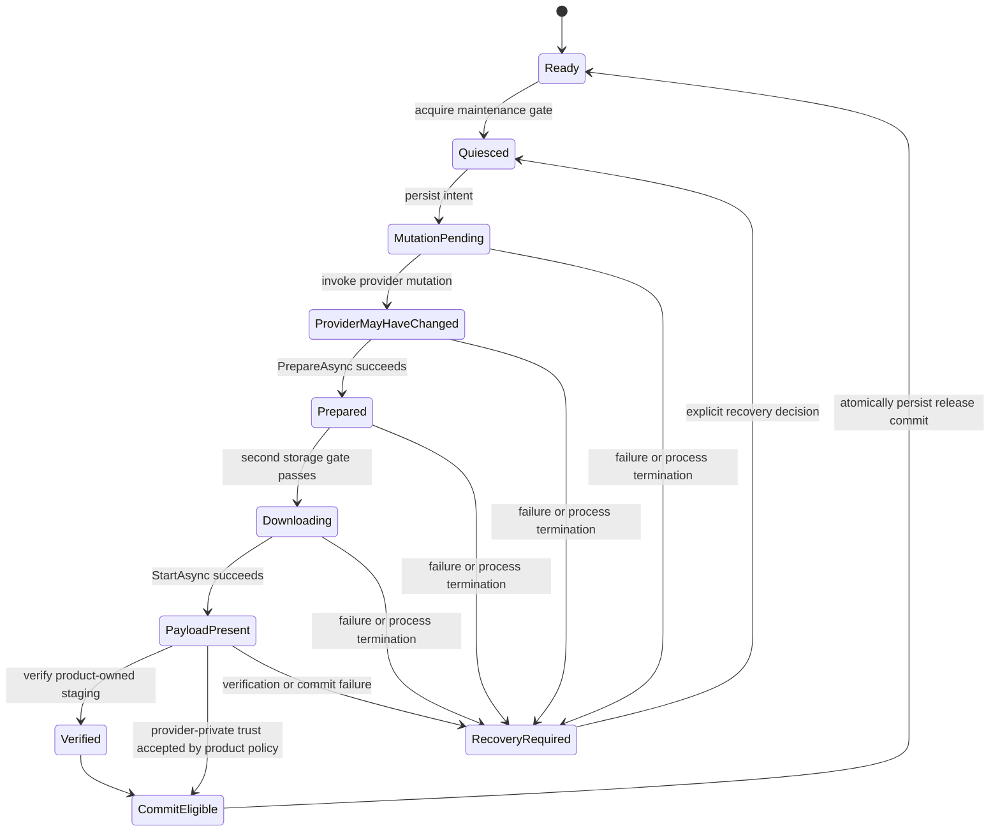

# 内容操作

[English](ContentOperations.md) | 简体中文

本文覆盖下载、provider 维护、磁盘容量、内容校验、恢复与运营证据。AssetManagement 为这些工作提供有界原语；发布工作流由产品持有，因为 catalog 语义、CDN 授权、平台存储、回滚与认证因 provider 和产品而异。

## 目录

- [概述](#概述)
- [核心概念](#核心概念)
- [使用指南](#使用指南)
- [进阶主题](#进阶主题)
- [故障排查](#故障排查)

## 概述

模块把 provider 操作、`IDownloader`、存储预检与内容信任校验作为独立原语暴露。产品代码组合完整发布工作流：维护门、已认证发布 metadata、provider mutation、作用域 downloader、两道存储门、内容校验与原子 commit。

### 主要特性

- **单一发布 owner**：composition-root 对维护、journal、downloader、存储、校验与 commit 的权威。
- **两道存储门**：mutation 前的保守检查与 `PrepareAsync` 后用 `TotalDownloadBytes` 的权威检查。
- **持久状态机**：产品持有的 journal，在每个 mutation 边界都能在进程终止后存活。
- **内容信任**：schema-2 签名 manifest，带 SHA-256 校验与 `RequireSignature`/`IntegrityOnly` policy。
- **有界 telemetry**：固定容量 ring buffer，带 JSON Lines 原子导出。
- **Provider 私有缓存信任边界**：产品持有的 staging 校验与 provider SDK 保证之间的显式分离。

### 端到端维护顺序

1. 获取产品维护门并 quiesce 受影响消费者。
2. 认证产品发布 metadata，授权 product/package/channel/platform，拒绝回滚或重放。
3. 为每个受影响卷计算保守的 mutation 前存储需求。
4. 运行第一道存储门。严格生产 policy 在 `Insufficient`、`Unknown` 或 `Failed` 时停止。
5. 持久化 provider 状态可能变化，然后通过 owning adapter 调用 provider 专属 catalog 或 manifest mutation。
6. 创建确切一个作用域 `IDownloader` 并在发布 owner 中保留其所有权。
7. Await `PrepareAsync`。此时 `TotalDownloadBytes` 与 `TotalDownloadCount` 才权威。
8. 从 prepared 字节、临时/unpack 行为、新旧共存与预留重算峰值存储；运行第二道门。
9. Await `StartAsync`，处理 provider 故障，绝不从 `Error` 文本推断成功。
10. 产品拥有可枚举 staging 树时，校验其签名 manifest 并校验文件。
11. 原子 commit 确切已激活/已校验的发布 identity，然后重新启用消费者。
12. 在每条路径上主线程 Dispose downloader，最后释放维护门。

`PrepareAsync` 不启动 payload 写入。Addressables 在 preparation 期间执行 download-size 查询。YooAsset 构造一个在 native `StartDownload` 前 total 可用的操作，因此其 adapter preparation 立即完成。两个方法都幂等，重复调用加入其 memoized 阶段。

## 核心概念

### 操作边界

Addressables 与 YooAsset package adapter 拒绝同一 package 上重叠的 manifest/catalog/cache mutation。此 fail-fast 防护阻止两个 provider mutation 同时运行；它不串行化完整发布工作流、不停止普通加载、不预留磁盘空间、也不让 provider 操作变原子。Addressables 有一个进程 owner 与一个逻辑 package。YooAsset 有一个进程全局 module owner，可以有多个 package。

Package 销毁不与活动维护 mutation 竞争。调用 `DestroyAsync` 会立即且永久关闭该 package 的业务入口点并取消订阅 scene-unload 观察。如果 mutation 活动，销毁报告冲突并保留清理可重试；发布 owner 必须 await mutation 完成、保留 package owner、再次调用 `DestroyAsync`。

把编排保持在 Unity 主线程。围绕 provider 调用的 mutex 不会让 Unity 或 provider 对象变 worker-safe。

### 持久状态机

Provider catalog 或 manifest 激活不保证隔离或可回滚。在越过该 mutation 边界前持久化产品持有的状态。



确切名称与持久化格式由产品决定。至少记录 product/package/channel/platform 发布域、前一次 committed identity、预期 identity、provider mutation 是否可能已开始、staging identity（如果存在）以及最后 terminal 决策。该记录需要自己的 schema version、校验、原子替换、损坏恢复与迁移。不要把该权威存入 `PlayerPrefs`。

### Downloader 所有权与取消

`IDownloader` 有一个调用方所有权 lease：

- factory 把所有权转移给调用方；
- `PrepareAsync` 与 `StartAsync` 可安全重复或并发 await；
- 等待者的 `CancellationToken` 只取消该等待并抛出 `OperationCanceledException`；
- `Cancel()` 或 `Dispose()` 取消共享调用方可见等待契约；物理 provider 中止是能力相关的；
- `Dispose()` 幂等且必须在 Unity 主线程运行；
- `Succeed`、`Error`、`Progress` 与计数器是状态/诊断属性；await 方法仍是权威控制流。

不要把一个 downloader 交给多个 owner。Addressables 无法中止 `DownloadDependenciesAsync`：adapter 保留 pending handle、排空到 terminal、然后 snapshot 并只释放一次。YooAsset 请求 provider-native `CancelDownload` 并保持 wrapper 注册直到观察 provider terminal 状态。两个路径都不回滚部分缓存数据。

Addressables 与 YooAsset 强制相同的 package 级所有权上限：最多 128 个已注册 downloader wrapper 与 262,144 个保留显式 scope 值。每个 tag/location 数组限制为 65,536 个值、每个 4,096 字符、总计 8 Mi 字符。调用方取消不释放这些 quota。Quota 只在 provider-terminal dispose 回调在最终状态捕获后移除 wrapper 时返回。

## 使用指南

### YooAsset 编排示例

以下示例位于已获取的产品维护门内。`IReleaseJournal` 是为显式化持久边界而展示的应用契约；AssetManagement 不提供它。`packageVersion` 必须已由产品持有的、带硬响应大小上限与防回滚 policy 的已认证 client 取得。

```csharp
public interface IReleaseJournal
{
    UniTask MarkProviderMutationPendingAsync(
        string releaseIdentity, CancellationToken cancellationToken);
    UniTask MarkPayloadPresentAsync(
        string releaseIdentity, CancellationToken cancellationToken);
}

public static class YooReleaseWorkflow
{
    public static async UniTask DownloadLocationsAsync(
        IYooAssetPackageMaintenance maintenance,
        IAssetStoragePreflight storage,
        IReleaseJournal journal,
        string packageVersion,
        string releaseIdentity,
        string[] locations,
        long preMutationRequiredBytes,
        long additionalPeakBytes,
        int concurrency,
        int retryCount,
        CancellationToken cancellationToken)
    {
        if (additionalPeakBytes < 0L)
        {
            throw new ArgumentOutOfRangeException(nameof(additionalPeakBytes));
        }

        await RequireProviderCapacityAsync(storage, preMutationRequiredBytes, cancellationToken);
        await journal.MarkProviderMutationPendingAsync(releaseIdentity, cancellationToken);

        bool manifestUpdated = await maintenance.UpdatePackageManifestAsync(
            packageVersion, cancellationToken: cancellationToken);
        if (!manifestUpdated)
        {
            throw new InvalidOperationException(
                "YooAsset manifest activation failed; recovery is required.");
        }

        IDownloader downloader = maintenance.CreateDownloaderForLocations(
            locations, recursiveDownload: true,
            downloadingMaxNumber: concurrency, failedTryAgain: retryCount);

        try
        {
            await downloader.PrepareAsync(cancellationToken);

            long preparedRequirement = checked(
                downloader.TotalDownloadBytes + additionalPeakBytes);
            await RequireProviderCapacityAsync(storage, preparedRequirement, cancellationToken);

            await downloader.StartAsync(cancellationToken);
            await journal.MarkPayloadPresentAsync(releaseIdentity, CancellationToken.None);
        }
        finally
        {
            downloader.Dispose();
        }
    }

    private static async UniTask RequireProviderCapacityAsync(
        IAssetStoragePreflight storage, long requiredBytes, CancellationToken cancellationToken)
    {
        AssetStoragePreflightResult result = await storage.CheckStorageAsync(
            new AssetStoragePreflightRequest(requiredBytes), cancellationToken);
        if (result.Status != AssetStorageCapacityStatus.Available)
        {
            throw new IOException(
                $"Provider cache capacity check returned {result.Status}: {result.Error}");
        }
    }
}
```

`MarkProviderMutationPendingAsync` 之后任何操作失败，journal 保持恢复状态。产品代码不得在 `finally` 中清除它。只在产品信任与激活 policy 成功后 commit 发布。

YooAsset 暴露 All、Tags、Locations downloader factory。Locations 显式选择依赖递归。Tag 请求也包含下载所需的未打标 bundle，因为 YooAsset 把它们当作共享依赖，所以 tag 名称不是严格字节边界；prepared total 对该操作权威。显式并发限制 1-32，只控制该 downloader。

### Addressables 差异

Addressables 发布代码使用 `IAddressablesCatalogMaintenance`：

- `UpdateLatestCatalogsAsync` 检查并激活最新报告的 catalog；不接受产品选择的 catalog version。
- `CheckForCatalogUpdates` 开始后，调用方取消只在该 provider 操作到达安全 terminal 边界后观察。取消在 activation 前再次检查，已开始的 activation 确定性完成。
- 零 catalog 结果成功且不推进缓存 generation。
- Catalog activation 一旦尝试，无论成功、provider 失败或可恢复异常都推进 wrapper 缓存 generation。Idle 条目被 Dispose；active lease 从 keyed SLRU 查询 generation-detach，直到最终释放或 shutdown。
- Catalog-label query 接受最多 4,096 字符 tag，产生最多 65,536 个唯一 location，总计 8 Mi 字符。
- Tags 与 Locations 是唯一 downloader scope；Locations 总是使用递归依赖闭包。
- 并发与重试是 provider 全局设置，不是 per-downloader 参数。
- `CleanUnusedBundleCacheAsync` 移除已加载 catalog 不再引用的缓存 Bundle；`ClearAllCacheFilesAsync` 清理 Unity 全局缓存，可能影响一个逻辑 package 之外的内容。
- `ReadReleaseMetadataVersionAsync` 读取有界产品 metadata 用于关联；它不是已认证授权或防回滚证据。

不要在 owning adapter 之外调用 `Addressables.UpdateCatalogs` 或修改其缓存。这类调用创建分裂 authority：wrapper 无法观察 mutation、正确失效 generation，或把操作纳入 shutdown。

## 进阶主题

### 存储与磁盘预算

#### 两道容量门

第一道门在 provider mutation 改变活动 catalog 或 manifest 前保护工作流。其输入必须来自已认证产品发布 metadata 和/或版本匹配的已校验 trust manifest。第二道门使用 downloader 的 prepared 字节 total，并捕获发布估算与 provider 当前依赖计划之间的差异。

`TotalDownloadBytes` 是传输计划证据，不一定是峰值磁盘占用。把 prepared 字节当作测量峰值模型的一个输入。

#### 分别为每个卷建模

对每个物理卷或独立强制 quota，计算确切工作流期间可能共存的最大字节：

| 组件 | 在该卷上同时存在时计入 |
| --- | --- |
| Provider payload | Prepared 下载字节与 provider metadata/index 增长 |
| 旧发布 | 为活跃 handle、回滚或非破坏性替换保留的文件 |
| 下载临时 | 分片文件、重试片段、持久化到磁盘的传输/解密缓冲 |
| Delta 工作区 | delta 算法所需的源、patch 与目标文件 |
| 解包目标 | 压缩输入旁边的解压或转换输出 |
| 产品 staging/隔离 | 等待校验或 commit 的可枚举文件 |
| 原子替换副本 | 替换无法复用同一块时的新旧文件 |
| 恢复预留 | journal、清理 metadata、崩溃恢复与产品安全余量 |
| 无关必需写入 | 共享 quota 的 save、log、crash dump、shader cache 或平台 patch 写入 |

只对峰值重叠的组件求和，但计入实际写入的卷。不要对所有 provider 和平台套用一个任意倍数。

#### 预检结果语义

`AssetStoragePreflightResult.Status` 为：

| 状态 | 含义 | 严格生产行为 |
| --- | --- | --- |
| `Available` | 当前可靠探测报告至少请求的字节 | 继续，同时保留磁盘满恢复 |
| `Insufficient` | 当前可靠探测报告少于请求 | 停止；提供 provider 支持的清理或更小发布计划 |
| `Unknown` | adapter/平台无法报告可靠卷或 quota | 除非有显式验证的产品 policy 提供等价决策，否则停止 |
| `Failed` | 请求或探测失败 | 停止，记录诊断，修复探测或产品输入 |

`AvailableBytes` 对 `Available` 与 `Insufficient` 有意义；`StorageLocation` 与 `Error` 是可选诊断。默认结果为 `Unknown`。

#### TOCTOU 与文件系统失败

成功的容量检查是 snapshot，不是预约。在任一门与写入之间，另一个进程、另一个 package、OS、浏览器或用户可能消费或撤销存储。保持内容隔离直到 terminal commit；把磁盘满与 I/O 异常当作正常可恢复发布失败；在 provider 状态可能变化前持久化 mutation 边界；使用 provider API 清理 provider 缓存而非删除私有文件。

原子替换通常要求源与目标在同一文件系统。跨卷 move 可能退化为 copy-plus-delete 并丢失原子性。若 staging 与 activation 跨卷，复制到最终卷、按产品/平台 policy flush、再次校验最终字节，然后才切换产品可见 identity。

### Provider 私有缓存信任边界

内置 Addressables 与 YooAsset downloader 暴露聚合状态与 total。它们不暴露稳定的已下载文件列表、不可变 staging identity、可移植相对路径映射，或打开每个 provider 私有缓存文件的支持 API。后果：

- `ContentTrustVerifier` 无法通用证明这些私有缓存内的字节。
- Provider version、catalog、manifest、status、传输、hash 或 CRC 结果不自动等于产品发布者认证或防回滚证明。
- 缓存清理必须使用 `IAddressablesCatalogMaintenance` 或 `IYooAssetPackageMaintenance`；缓存是可重建、非权威的加速数据。

需要端到端签名的产品有三个可辩护选择：

1. 接受并记录确切的 provider SDK 完整性/传输保证作为独立信任边界，同时产品签名授权发布 metadata。
2. 添加窄 provider/build 集成，发出稳定文件 manifest 并校验 provider 支持的文件 identity，不重新解释私有索引。
3. 下载到产品持有的不可变 staging 树，用通用 trust API 校验，然后通过 provider 支持的导入或内容 build 边界激活。

### 产品持有 staging 的内容信任

#### Manifest 与 wire 契约

`ContentTrustManifest` 构造后不可变。它校验并防御性复制条目、归一化 Unicode 与 `/` 分隔符、拒绝 rooted/traversal/非可移植路径、拒绝大小写不敏感的重复 location，并按规范排序。`ContentTrustManifestCodec` 只写入和接受 schema version 2。

规范签名 payload 包含 schema version、manifest `Version`、可选 `ContentRoot` 与每个规范条目。它排除 `Signature`。

虽然 enum 与 codec 可表示 `None` 与 `XxHash64`，但两个内置 `ContentTrustVerifier` policy 都要求每个已校验条目使用 SHA-256。`ComputeFingerprint()` 是确定性的非加密诊断工具；绝不用作认证。

#### 构建并签名 manifest

Manifest 生成与签名是内容管线冷工作。私钥不得放入客户端。

```csharp
using CycloneGames.AssetManagement.Runtime.Trust;

public static string BuildSignedManifestJson(
    string stagingRoot,
    IContentTrustManifestCanonicalSigner signer)
{
    string payloadRoot = Path.Combine(stagingRoot, "payload");

    ContentTrustManifest unsignedManifest =
        new ContentTrustManifestBuilder()
            .WithVersion("2026.07.11-content-42")
            .WithContentRoot("payload")
            .AddFile(payloadRoot, "bundles/ui.bundle")
            .AddFile(payloadRoot, "config/balance.bytes")
            .Build();

    ContentTrustManifest signedManifest =
        ContentTrustManifestSignatureUtility.SignCanonical(
            in unsignedManifest, signer);

    return ContentTrustManifestCodec.ToJson(in signedManifest);
}
```

`ContentTrustManifestSignatureUtility.Sign` 物化规范 payload，上限 8 MiB。大型管线应实现 `IContentTrustManifestCanonicalSigner` 并用 `ContentTrustManifestCanonicalPayload.WriteTo` 流式处理。JSON 文档本身上限 16 Mi 字符。

#### 解析并校验 staging 文件

客户端通过 `IContentTrustSignatureVerifier` 提供其产品 verifier。签名在读取 payload 文件前校验。

```csharp
public static async UniTask VerifyAsync(
    string stagingRoot,
    string manifestJson,
    IContentTrustSignatureVerifier signatureVerifier,
    CancellationToken cancellationToken)
{
    ContentTrustManifest manifest = ContentTrustManifestCodec.FromJson(manifestJson);
    var failures = new List<ContentTrustVerificationResult>();

    int failureCount = await ContentTrustVerifier.Shared
        .VerifyManifestFilesAsync(
            stagingRoot, manifest, failures, signatureVerifier, cancellationToken);

    if (failureCount != 0)
    {
        ContentTrustVerificationResult first = failures[0];
        throw new InvalidDataException(
            $"Content verification failed at '{first.Location}': " +
            $"{first.Failure} {first.Message}");
    }
}
```

`VerifyManifestFilesAsync` 在操作间检查取消，并使用异步文件哈希。WebGL Player 在每个 manifest 条目后 yield，但单个大文件仍可能消耗不可接受的帧切片。`VerifyBytes` 与 `VerifyFile` 只校验单个条目的 size 与 hash；它们不校验 manifest 签名。

#### 签名 policy 与防回滚

`ContentTrustPolicy.RequireSignature` 是默认值，签名 verifier 或签名缺失或被拒时 fail-closed。`IntegrityOnly` 必须显式选择；它对所提供 manifest 校验 SHA-256，但不认证该 manifest 的发布者。生产 policy 应把私钥保存在受控 build/release 基础设施中、只嵌入或安全配置公共校验材料、版本化并轮换密钥、把 product/package/channel/platform/environment 绑定到校验决策、每个域持久化最高已接受单调发布 identity、拒绝重放/降级/跨通道/跨平台 manifest，并只在确切发布校验并持久 commit 后推进防回滚状态。

#### 校验到激活的 TOCTOU

哈希不锁定文件。写入者可在校验后、使用前替换 staging 内容。通过 quiesce 写入者、校验不可变 staging identity、限制写权限、原子激活该确切 identity 来关闭此窗口。若 provider 无法暴露或保留该 identity，则在最终可见边界重新校验，或记录残留 provider 信任边界。

### 运行时 telemetry

`AssetRuntimeTelemetryRecorder` 把 sample 存入固定容量 ring buffer。记录在构造后复用其数组、用单调时间做间隔门控、满时覆盖最旧 sample。`OverwrittenSampleCount` 使该损失可观察。活动计数器是累计的；从相邻 sample delta 推导间隔速率。容量 1-65,536 sample；默认 256。

```csharp
public sealed class AssetTelemetryOwner
{
    private readonly AssetRuntimeTelemetryRecorder _recorder =
        new AssetRuntimeTelemetryRecorder(
            new AssetRuntimeTelemetryOptions(
                capacity: 1024,
                minimumSampleInterval: TimeSpan.FromSeconds(1),
                includeZeroActivitySamples: false));

    private readonly AssetRuntimeTelemetrySample[] _sampleBuffer =
        new AssetRuntimeTelemetrySample[1024];
    private readonly StringBuilder _textBuffer = new StringBuilder(64 * 1024);
    private readonly AssetRuntimeTelemetryFileSink _sink =
        new AssetRuntimeTelemetryFileSink();

    public void SampleOnMainThread(IAssetPackage package)
    {
        if (package is IAssetRuntimeDiagnostics diagnostics)
        {
            _recorder.TryRecord(diagnostics);
        }
    }

    public UniTask<int> ExportAsync(CancellationToken cancellationToken)
    {
        string path = AssetRuntimeTelemetryPaths
            .GetDefaultPersistentJsonLinesPath();
        return _sink.WriteJsonLinesAsync(
            path, _recorder, _sampleBuffer, _textBuffer, cancellationToken);
    }
}
```

`AssetRuntimeTelemetryFileSink` 把复制窗口序列化为 JSON Lines 并原子替换目标文件。默认路径为 `<persistentDataPath>/CycloneGames/AssetManagement/Diagnostics/asset-runtime-telemetry.jsonl`。轮换、上传、压缩、保留、重试、删除、用户同意与脱敏是产品职责。每条记录包含 `"schemaVersion":1`。不包含资产地址、账号 token 或内容 payload；package/provider 名称仍可能泄露运营信息。应用产品的隐私与日志 policy。

## 故障排查

| 现象 | 可能原因 | 解决方法 |
| --- | --- | --- |
| 失败后 provider 状态可能已变化 | 操作越过 mutation 边界 | 隔离依赖内容，保留恢复证据，重试前要求显式 owner 决策 |
| 成功检查后存储不足 | 预检不是预约 | 用实测峰值放大重算 `RequiredFreeBytes` 并重试 |
| 文件哈希前签名校验失败 | 缺少 verifier、缺少签名或签名被拒 | 校验规范 payload 生成、密钥选择、签名编码；不要为绕过切换到 `IntegrityOnly` |
| 已校验字节在激活前被替换 | 校验到激活 TOCTOU | Quiesce 写入者，校验不可变 staging identity，原子激活该确切 identity |
| Downloader `PrepareAsync` 失败 | provider 可能已变化 | Dispose downloader，保留恢复状态，仅在显式重试决策后重建 |
| 下载期间调用方等待被取消 | 共享 provider 阶段可能继续 | 所有权持有者决定是否继续运行；单 owner 工作流在 `finally` dispose/cancel |
| mutation journal 后进程终止 | commit 缺失；provider 状态不确定 | 下次启动在依赖加载前进入恢复；核对确切 provider/release identity |
| Package 销毁与活动维护 mutation 重叠 | mutation 仍持有 provider 状态 | await mutation，保留 package/module owner，然后重试 `DestroyAsync` |
| Addressables provider-tail admission 满 | 16,384 个 provider 操作 pending | 应用产品 load admission/backpressure，await 现有工作，仅在 package 仍开放时重试 |
| YooAsset raw 读取返回空值 | provider load 未完成或失败 | await `IRawFileHandle.Task`；检查 `Error`；保留 `ReadBytes()` 结果 |
| telemetry 导出失败 | 内容状态不变 | 若允许则通过 fallback 有界通道记录；重试冷路径导出而不阻塞内容 |

恢复操作必须幂等或显式检测其前 terminal 状态。不要把 `Error` 字符串当作机器状态；持久化类型化产品状态，把 provider 文本当作诊断。

## 安全上限

这些值在昂贵工作前拒绝不合理或不可信输入。它们不是推荐运营目标。

| 边界 | 强制上限 |
| --- | ---: |
| Addressables/Yoo scope 值 | 1-65,536 个值；每个 4,096 字符；总计 8 Mi 字符 |
| 每个 Addressables/Yoo package 的已注册 downloader wrapper | 128 |
| 每个 Addressables/Yoo package 的保留 downloader scope 值 | 262,144 |
| Addressables catalog-label query | tag：4,096 字符；唯一 location：65,536；结果文本：8 Mi 字符 |
| 每个 package 的 Addressables pending catalog-label query | 32 |
| Addressables pending asset/all-assets/instantiate/catalog-query tail | 16,384 |
| Yoo downloader 并发 | 1-32 |
| Yoo 重试次数 | 0-16 |
| Yoo 维护超时 | 1-3,600 秒 |
| Yoo package name / manifest version | 1-128 ASCII 字符；path-safe token 规则 |
| Addressables release metadata 输入 | 1 MiB |
| Trust manifest 条目 | 131,072 |
| Trust manifest JSON | 16 Mi 字符 |
| Trust manifest version / content root / location | 256 / 1,024 / 2,048 UTF-8 字节 |
| Trust manifest 签名文本 | 16 KiB UTF-8 |
| Trust manifest 聚合声明内容 | 64 TiB |
| 物化规范签名 payload | 8 MiB；超出时使用流式 |
| Telemetry ring/export sample buffer | 65,536 sample |
| Telemetry JSON Lines export | 16 Mi 字符 |

Provider scope 数组被防御性克隆与校验，但不拒绝重复字符串。创建前去重稳定产品 scope。从内容拓扑、UI 响应性、内存、磁盘、服务端速率限制与滥用 policy 建立更小的产品限制。
