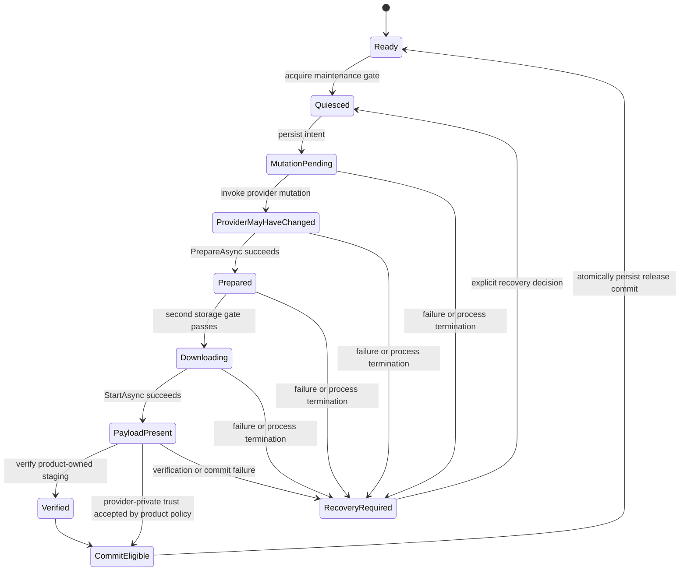

# Content operations

[English | 简体中文](ContentOperations.SCH.md)

This guide covers downloads, provider maintenance, disk capacity, content verification, recovery, and operational evidence for the application or live-content team. AssetManagement supplies bounded primitives for these jobs; the release workflow stays product-owned because catalog semantics, CDN authorization, platform storage, rollback, and certification differ by provider and product.

## Table of Contents

- [Overview](#overview)
- [Core Concepts](#core-concepts)
- [Usage Guide](#usage-guide)
- [Advanced Topics](#advanced-topics)
- [Troubleshooting](#troubleshooting)

## Overview

The module exposes provider operations, `IDownloader`, storage preflight, and content-trust verification as separate primitives. Product code composes the complete release workflow: maintenance gate, authenticated release metadata, provider mutation, scoped downloader, two storage gates, content verification, and atomic commit.

### Key Features

- **One release owner**: composition-root authority over maintenance, journal, downloader, storage, verification, and commit.
- **Two storage gates**: pre-mutation conservative check and post-`PrepareAsync` authoritative check using `TotalDownloadBytes`.
- **Durable state machine**: product-owned journal that survives process termination at every mutation boundary.
- **Content trust**: schema-2 signed manifests with SHA-256 verification and `RequireSignature`/`IntegrityOnly` policies.
- **Bounded telemetry**: fixed-capacity ring buffer with JSON Lines atomic export.
- **Provider-private cache trust boundary**: explicit separation between product-owned staging verification and provider SDK guarantees.

### End-to-end maintenance sequence

1. Acquire the product maintenance gate and quiesce affected consumers.
2. Authenticate product release metadata, authorize product/package/channel/platform, and reject rollback or replay.
3. Compute a conservative pre-mutation storage requirement for every affected volume.
4. Run the first storage gate. A strict production policy stops on `Insufficient`, `Unknown`, or `Failed`.
5. Persist that provider state may change, then call the provider-specific catalog or manifest mutation through its owning adapter.
6. Create exactly one scoped `IDownloader` and retain its ownership in the release owner.
7. Await `PrepareAsync`. Only now are `TotalDownloadBytes` and `TotalDownloadCount` authoritative.
8. Recompute peak storage from prepared bytes, temporary/unpack behavior, old/new coexistence, and reserve; run the second gate.
9. Await `StartAsync`, handle provider faults, and never infer success from `Error` text.
10. If the product owns a stable enumerable staging tree, validate its signed manifest and verify its files.
11. Atomically commit the exact activated/verified release identity, then re-enable consumers.
12. Dispose the downloader on the main thread in every path and release the maintenance gate last.

`PrepareAsync` does not start payload writes. Addressables performs a download-size query during preparation. YooAsset constructs an operation whose totals are available before native `StartDownload`, so its adapter preparation completes immediately. Both methods are idempotent, and repeated calls join their memoized stage.

## Core Concepts

### Operational boundary

Addressables and YooAsset package adapters reject overlapping manifest/catalog/cache mutations on the same package. This fail-fast guard prevents two provider mutations from running together; it does not serialize the complete release workflow, stop ordinary loads, reserve disk space, or make a provider operation atomic. Addressables has one process owner and one logical package. YooAsset has one process-global module owner and can have multiple packages.

Package destruction does not race an active maintenance mutation. Calling `DestroyAsync` immediately and permanently closes business entry points for that package and unsubscribes scene-unload observation. If a mutation is active, destruction reports the conflict and leaves cleanup retryable; the release owner must await mutation completion, preserve the package owner, and call `DestroyAsync` again.

Keep orchestration on the Unity main thread. A mutex around provider calls would not make Unity or provider objects worker-safe.

### Durable state machine

Provider catalog or manifest activation is not promised to be isolated or rollback-safe. Persist a product-owned state before crossing that mutation boundary.



The exact names and persistence format belong to the product. At minimum, record the product/package/channel/platform release domain, previous committed identity, intended identity, whether provider mutation may have started, staging identity if one exists, and the last terminal decision. The record needs its own schema version, validation, atomic replacement, corruption recovery, and migration. Do not store this authority in `PlayerPrefs`.

### Downloader ownership and cancellation

`IDownloader` has one caller ownership lease:

- the factory transfers ownership to the caller;
- `PrepareAsync` and `StartAsync` are safe for repeated or concurrent awaiters;
- a waiter's `CancellationToken` cancels only that wait and throws `OperationCanceledException`;
- `Cancel()` or `Dispose()` cancels the shared caller-visible wait contract; physical provider abort is capability-specific;
- `Dispose()` is idempotent and must run on the Unity main thread;
- `Succeed`, `Error`, `Progress`, and counters are state/diagnostic properties; await methods remain the authoritative control flow.

Do not hand one downloader to multiple owners. Addressables cannot abort `DownloadDependenciesAsync`: the adapter keeps the pending handle registered, drains it to terminal, then snapshots and releases it exactly once. YooAsset requests provider-native `CancelDownload` and keeps the wrapper registered until it observes provider terminal state. Neither path rolls back partial cache data.

Addressables and YooAsset enforce the same package-level ownership ceilings: at most 128 registered downloader wrappers and 262,144 retained explicit scope values across them. Each tag/location array remains limited to 65,536 values, 4,096 characters per value, and 8 Mi characters total. Caller cancellation does not release these quotas. Quota is returned only when the provider-terminal disposal callback removes the wrapper after final state capture.

## Usage Guide

### YooAsset orchestration example

The following example is inside an already acquired product maintenance gate. `IReleaseJournal` is shown to make the durable boundary explicit; it is not supplied by AssetManagement. `packageVersion` must already have been obtained by a product-owned authenticated client with a hard response-size ceiling and anti-rollback policy.

```csharp
public interface IReleaseJournal
{
    UniTask MarkProviderMutationPendingAsync(
        string releaseIdentity, CancellationToken cancellationToken);
    UniTask MarkPayloadPresentAsync(
        string releaseIdentity, CancellationToken cancellationToken);
}

public static class YooReleaseWorkflow
{
    public static async UniTask DownloadLocationsAsync(
        IYooAssetPackageMaintenance maintenance,
        IAssetStoragePreflight storage,
        IReleaseJournal journal,
        string packageVersion,
        string releaseIdentity,
        string[] locations,
        long preMutationRequiredBytes,
        long additionalPeakBytes,
        int concurrency,
        int retryCount,
        CancellationToken cancellationToken)
    {
        if (additionalPeakBytes < 0L)
        {
            throw new ArgumentOutOfRangeException(nameof(additionalPeakBytes));
        }

        await RequireProviderCapacityAsync(storage, preMutationRequiredBytes, cancellationToken);
        await journal.MarkProviderMutationPendingAsync(releaseIdentity, cancellationToken);

        bool manifestUpdated = await maintenance.UpdatePackageManifestAsync(
            packageVersion, cancellationToken: cancellationToken);
        if (!manifestUpdated)
        {
            throw new InvalidOperationException(
                "YooAsset manifest activation failed; recovery is required.");
        }

        IDownloader downloader = maintenance.CreateDownloaderForLocations(
            locations, recursiveDownload: true,
            downloadingMaxNumber: concurrency, failedTryAgain: retryCount);

        try
        {
            await downloader.PrepareAsync(cancellationToken);

            long preparedRequirement = checked(
                downloader.TotalDownloadBytes + additionalPeakBytes);
            await RequireProviderCapacityAsync(storage, preparedRequirement, cancellationToken);

            await downloader.StartAsync(cancellationToken);
            await journal.MarkPayloadPresentAsync(releaseIdentity, CancellationToken.None);
        }
        finally
        {
            downloader.Dispose();
        }
    }

    private static async UniTask RequireProviderCapacityAsync(
        IAssetStoragePreflight storage, long requiredBytes, CancellationToken cancellationToken)
    {
        AssetStoragePreflightResult result = await storage.CheckStorageAsync(
            new AssetStoragePreflightRequest(requiredBytes), cancellationToken);
        if (result.Status != AssetStorageCapacityStatus.Available)
        {
            throw new IOException(
                $"Provider cache capacity check returned {result.Status}: {result.Error}");
        }
    }
}
```

The journal remains in a recovery state if any operation after `MarkProviderMutationPendingAsync` fails. Product code must not clear it in `finally`. Commit the release only after the product's trust and activation policy succeeds.

YooAsset exposes All, Tags, and Locations downloader factories. Locations make dependency recursion explicit. A tag request also includes download-required untagged bundles because YooAsset treats them as shared dependencies, so the tag name is not a strict byte boundary; the prepared totals are authoritative for that operation. Explicit concurrency is limited to 1-32 and controls only that downloader.

### Addressables differences

Addressables release code uses `IAddressablesCatalogMaintenance`:

- `UpdateLatestCatalogsAsync` checks and activates the latest reported catalogs; it does not accept a product-selected catalog version.
- Once `CheckForCatalogUpdates` starts, caller cancellation is observed only after that provider operation reaches a safe terminal boundary. Cancellation is checked again before activation, and an activation that has started completes deterministically.
- A zero-catalog result succeeds without advancing cache generation.
- Once catalog activation is attempted, wrapper cache generation advances after success, provider failure, or recoverable exception. Idle entries are disposed; active leases become generation-detached from keyed SLRU lookup until final release or shutdown.
- Catalog-label queries accept a tag of at most 4,096 characters and produce at most 65,536 unique locations totaling 8 Mi characters.
- Tags and Locations are the only downloader scopes; Locations always use recursive dependency closure.
- Concurrency and retry are provider-global settings, not per-downloader arguments.
- `CleanUnusedBundleCacheAsync` removes cached Bundles no longer referenced by loaded catalogs; `ClearAllCacheFilesAsync` clears Unity's global cache and may affect content beyond one logical package.
- `ReadReleaseMetadataVersionAsync` reads bounded product metadata for correlation; it is not authenticated authorization or anti-rollback evidence.

Do not call `Addressables.UpdateCatalogs` or mutate its cache outside the owning adapter. Such calls create split authority: the wrapper cannot observe the mutation, invalidate its generation correctly, or include the operation in shutdown.

## Advanced Topics

### Storage and disk budgeting

#### Two capacity gates

The first gate protects the workflow before a provider mutation changes the active catalog or manifest. Its input must come from authenticated product release metadata and/or a version-matched validated trust manifest. The second gate uses the downloader's prepared byte total and catches differences between release estimates and the provider's current dependency plan.

`TotalDownloadBytes` is transfer-plan evidence, not necessarily peak disk occupancy. Treat prepared bytes as one input to a measured peak model.

#### Model each volume separately

For each physical volume or independently enforced quota, calculate the maximum bytes that can coexist during the exact workflow:

| Component | Include when it exists simultaneously on that volume |
| --- | --- |
| Provider payload | Prepared download bytes and provider metadata/index growth |
| Old release | Files retained for live handles, rollback, or non-destructive replacement |
| Download temporary | Partial files, retry fragments, transport/decryption buffers persisted to disk |
| Delta workspace | Source, patch, and destination files required by the delta algorithm |
| Unpacked destination | Decompressed or transformed output alongside compressed input |
| Product staging/quarantine | Enumerable files awaiting verification or commit |
| Atomic replacement duplicate | Old and new file when replacement cannot reuse the same blocks |
| Recovery reserve | Space for journal, cleanup metadata, crash recovery, and product safety margin |
| Unrelated required writes | Save, log, crash dump, shader cache, or platform patch writes sharing the quota |

Sum only components that overlap at peak, but include them on the volume where they are actually written. Do not apply one arbitrary multiplier across all providers and platforms.

#### Preflight result semantics

`AssetStoragePreflightResult.Status` is:

| Status | Meaning | Strict production action |
| --- | --- | --- |
| `Available` | The current reliable probe reports at least the requested bytes | Continue, while retaining disk-full recovery |
| `Insufficient` | The current reliable probe reports less than requested | Stop; offer provider-supported cleanup or a smaller release plan |
| `Unknown` | The adapter/platform cannot report a reliable volume or quota | Stop unless an explicitly validated product policy provides an equivalent decision |
| `Failed` | The request or probe failed | Stop, record diagnostics, and repair the probe or product input |

`AvailableBytes` is meaningful for `Available` and `Insufficient`; `StorageLocation` and `Error` are optional diagnostics. The default result is `Unknown`.

#### TOCTOU and filesystem failure

A successful capacity check is a snapshot, not a reservation. Between either gate and the write, another process, another package, the OS, the browser, or the user can consume or revoke storage. Therefore: keep content quarantined until a terminal commit; treat disk-full and I/O exceptions as normal recoverable release failures; persist the mutation boundary before provider state can change; use provider APIs for provider-cache cleanup instead of deleting private files.

Atomic replacement generally requires the source and destination to be on the same filesystem. A cross-volume move can degrade into copy-plus-delete and lose atomicity. If staging and activation cross volumes, copy to the final volume, flush according to product/platform policy, verify the final bytes again, and only then switch the product's visible identity.

### Provider-private cache trust boundary

The built-in Addressables and YooAsset downloaders expose aggregate state and totals. They do not expose a stable downloaded-file list, immutable staging identity, portable relative-path mapping, or a supported API for opening every provider-private cache file. Consequences:

- `ContentTrustVerifier` cannot generically prove the bytes inside those private caches.
- Provider version, catalog, manifest, status, transport, hash, or CRC results are not automatically product publisher authentication or anti-rollback proof.
- Cache cleanup must use `IAddressablesCatalogMaintenance` or `IYooAssetPackageMaintenance`; the cache remains rebuildable, non-authoritative acceleration data.

A product needing end-to-end signatures has three defensible choices:

1. Accept and document the exact provider SDK integrity/transport guarantees as a separate trust boundary, while product signatures authorize release metadata.
2. Add a narrow provider/build integration that emits a stable file manifest and verifies provider-supported file identities without reinterpreting private indexes.
3. Download into a product-owned immutable staging tree, verify it with the generic trust API, then activate it through a provider-supported import or content-build boundary.

### Content trust for product-owned staging

#### Manifest and wire contract

`ContentTrustManifest` is immutable after construction. It validates and defensively copies entries, normalizes Unicode and `/` separators, rejects rooted/traversal/non-portable paths, rejects case-insensitive duplicate locations, and sorts entries canonically. `ContentTrustManifestCodec` writes and accepts exactly schema version 2.

The canonical signed payload includes the schema version, manifest `Version`, optional `ContentRoot`, and every canonical entry. It excludes `Signature`.

Although the enum and codec can represent `None` and `XxHash64`, both built-in `ContentTrustVerifier` policies require SHA-256 for every verified entry. `ComputeFingerprint()` is deterministic non-cryptographic diagnostics; never use it as authentication.

#### Build and sign a manifest

Manifest generation and signing are content-pipeline cold work. Keep private keys outside the client.

```csharp
using CycloneGames.AssetManagement.Runtime.Trust;

public static string BuildSignedManifestJson(
    string stagingRoot,
    IContentTrustManifestCanonicalSigner signer)
{
    string payloadRoot = Path.Combine(stagingRoot, "payload");

    ContentTrustManifest unsignedManifest =
        new ContentTrustManifestBuilder()
            .WithVersion("2026.07.11-content-42")
            .WithContentRoot("payload")
            .AddFile(payloadRoot, "bundles/ui.bundle")
            .AddFile(payloadRoot, "config/balance.bytes")
            .Build();

    ContentTrustManifest signedManifest =
        ContentTrustManifestSignatureUtility.SignCanonical(
            in unsignedManifest, signer);

    return ContentTrustManifestCodec.ToJson(in signedManifest);
}
```

`ContentTrustManifestSignatureUtility.Sign` materializes the canonical payload and is capped at 8 MiB. Large pipelines should implement `IContentTrustManifestCanonicalSigner` and stream with `ContentTrustManifestCanonicalPayload.WriteTo`. The JSON document itself is capped at 16 Mi characters.

#### Parse and verify staged files

The client supplies its product verifier through `IContentTrustSignatureVerifier`. The signature is checked before payload files are read.

```csharp
public static async UniTask VerifyAsync(
    string stagingRoot,
    string manifestJson,
    IContentTrustSignatureVerifier signatureVerifier,
    CancellationToken cancellationToken)
{
    ContentTrustManifest manifest = ContentTrustManifestCodec.FromJson(manifestJson);
    var failures = new List<ContentTrustVerificationResult>();

    int failureCount = await ContentTrustVerifier.Shared
        .VerifyManifestFilesAsync(
            stagingRoot, manifest, failures, signatureVerifier, cancellationToken);

    if (failureCount != 0)
    {
        ContentTrustVerificationResult first = failures[0];
        throw new InvalidDataException(
            $"Content verification failed at '{first.Location}': " +
            $"{first.Failure} {first.Message}");
    }
}
```

`VerifyManifestFilesAsync` checks cancellation between operations and uses asynchronous file hashing. WebGL Player yields after each manifest entry, but one large file can still consume an unacceptable frame slice. `VerifyBytes` and `VerifyFile` validate one entry's size and hash only; they do not validate a manifest signature.

#### Signature policy and anti-rollback

`ContentTrustPolicy.RequireSignature` is the default and fails closed when the signature verifier or signature is missing or rejected. `IntegrityOnly` must be selected explicitly; it verifies SHA-256 against the supplied manifest but does not authenticate that manifest's publisher. A production policy should keep private signing keys in controlled build/release infrastructure, embed or securely provision only public verification material, version and rotate keys, bind product/package/channel/platform/environment to the verification decision, persist the highest accepted monotonic release identity per domain, reject replay/downgrade/cross-channel/cross-platform manifests, and advance anti-rollback state only after the exact release is verified and durably committed.

#### Verification-to-activation TOCTOU

Hashing does not lock a file. A writer can replace staged content after verification and before use. Close this window by quiescing writers, verifying an immutable staging identity, limiting write permissions, and atomically activating that exact identity. If the provider cannot expose or preserve that identity, either reverify at the final visibility boundary or document the residual provider trust boundary.

### Runtime telemetry

`AssetRuntimeTelemetryRecorder` stores samples in a fixed-capacity ring buffer. Recording reuses its array after construction, uses monotonic time for interval gating, and overwrites the oldest sample when full. `OverwrittenSampleCount` makes that loss observable. Activity counters are cumulative; derive interval rates from adjacent sample deltas. Capacity is 1-65,536 samples; the default is 256.

```csharp
public sealed class AssetTelemetryOwner
{
    private readonly AssetRuntimeTelemetryRecorder _recorder =
        new AssetRuntimeTelemetryRecorder(
            new AssetRuntimeTelemetryOptions(
                capacity: 1024,
                minimumSampleInterval: TimeSpan.FromSeconds(1),
                includeZeroActivitySamples: false));

    private readonly AssetRuntimeTelemetrySample[] _sampleBuffer =
        new AssetRuntimeTelemetrySample[1024];
    private readonly StringBuilder _textBuffer = new StringBuilder(64 * 1024);
    private readonly AssetRuntimeTelemetryFileSink _sink =
        new AssetRuntimeTelemetryFileSink();

    public void SampleOnMainThread(IAssetPackage package)
    {
        if (package is IAssetRuntimeDiagnostics diagnostics)
        {
            _recorder.TryRecord(diagnostics);
        }
    }

    public UniTask<int> ExportAsync(CancellationToken cancellationToken)
    {
        string path = AssetRuntimeTelemetryPaths
            .GetDefaultPersistentJsonLinesPath();
        return _sink.WriteJsonLinesAsync(
            path, _recorder, _sampleBuffer, _textBuffer, cancellationToken);
    }
}
```

`AssetRuntimeTelemetryFileSink` serializes the copied window to JSON Lines and atomically replaces the target file. The default path is `<persistentDataPath>/CycloneGames/AssetManagement/Diagnostics/asset-runtime-telemetry.jsonl`. Rotation, upload, compression, retention, retry, deletion, user consent, and redaction are product responsibilities. Every record includes `"schemaVersion":1`. No asset location, account token, or content payload is included; package/provider names can still reveal operational information. Apply the product's privacy and logging policy.

## Troubleshooting

| Symptom | Likely cause | Resolution |
| --- | --- | --- |
| Provider state may have changed after failure | Operation crossed the mutation boundary | Quarantine dependent content, preserve recovery evidence, require an explicit owner decision before retry |
| Storage insufficient after a successful check | Preflight is not a reservation | Recompute `RequiredFreeBytes` from measured peak amplification and retry |
| Signature verification fails before file hashing | Missing verifier, missing signature, or rejected signature | Verify canonical payload generation, key selection, signature encoding; do not switch to `IntegrityOnly` to bypass |
| Verified bytes replaced before activation | Verification-to-activation TOCTOU | Quiesce writers, verify an immutable staging identity, atomically activate that exact identity |
| Downloader `PrepareAsync` fails | Provider may already be changed | Dispose the downloader, retain recovery state, recreate only after an explicit retry decision |
| Caller wait cancelled during download | Shared provider stage may continue | Ownership holder decides whether to keep it running; single-owner workflows dispose/cancel in `finally` |
| Process terminates after mutation journal | Commit absent; provider state uncertain | On next launch enter recovery before dependent loads; reconcile exact provider/release identity |
| Package destroy overlaps active maintenance mutation | Mutation still owns provider state | Await the mutation, retain the package/module owner, then retry `DestroyAsync` |
| Addressables provider-tail admission full | 16,384 provider operations pending | Apply product load admission/backpressure, await existing work, retry only while the package remains open |
| YooAsset raw read returns empty value | Provider load not yet complete or failed | Await `IRawFileHandle.Task`; inspect `Error`; retain `ReadBytes()` result |
| Telemetry export fails | Content state unchanged | Record through a fallback bounded channel if allowed; retry cold-path export without blocking content |

Recovery operations must be idempotent or explicitly detect their prior terminal state. Do not use `Error` strings as machine state; persist typed product states and treat provider text as diagnostics.

## Safety ceilings

These values reject unreasonable or untrusted inputs before expensive work. They are not recommended operating targets.

| Boundary | Enforced ceiling |
| --- | ---: |
| Addressables/Yoo scope values | 1-65,536 values; 4,096 characters each; 8 Mi characters total |
| Registered downloader wrappers per Addressables/Yoo package | 128 |
| Retained downloader scope values per Addressables/Yoo package | 262,144 |
| Addressables catalog-label query | tag: 4,096 characters; unique locations: 65,536; result text: 8 Mi characters |
| Addressables pending catalog-label queries per package | 32 |
| Addressables pending asset/all-assets/instantiate/catalog-query tails | 16,384 |
| Yoo downloader concurrency | 1-32 |
| Yoo retry count | 0-16 |
| Yoo maintenance timeout | 1-3,600 seconds |
| Yoo package name / manifest version | 1-128 ASCII characters; path-safe token rules apply |
| Addressables release metadata input | 1 MiB |
| Trust manifest entries | 131,072 |
| Trust manifest JSON | 16 Mi characters |
| Trust manifest version / content root / location | 256 / 1,024 / 2,048 UTF-8 bytes |
| Trust manifest signature text | 16 KiB UTF-8 |
| Trust manifest aggregate declared content | 64 TiB |
| Materialized canonical signature payload | 8 MiB; use streaming above it |
| Telemetry ring/export sample buffer | 65,536 samples |
| Telemetry JSON Lines export | 16 Mi characters |

Provider scope arrays are defensively cloned and validated, but duplicate strings are not rejected. Deduplicate stable product scopes before creation. Establish much smaller product limits from content topology, UI responsiveness, memory, disk, server rate limits, and abuse policy.
