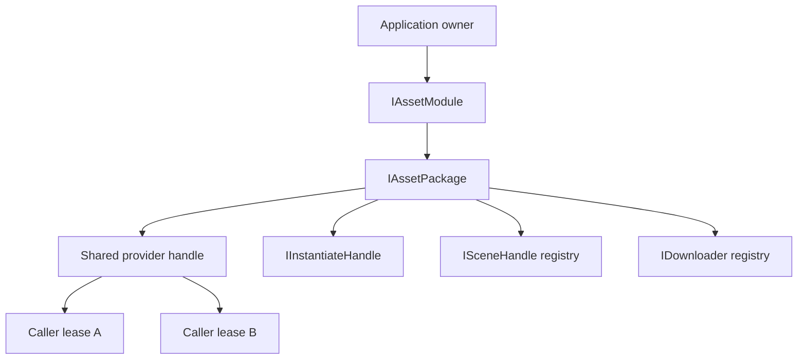

# 内存、所有权与生命周期

[English](MemoryAndLifetime.md) | 简体中文

AssetManagement 把所有权正确性作为第一内存管理策略。模块的内存模型建立在显式所有权之上：应用持有 module，module 持有 package，package 持有共享 provider handle 与有界 idle 缓存，每次 load 返回调用方持有的 lease。

## 目录

- [概述](#概述)
- [核心概念](#核心概念)
- [使用指南](#使用指南)
- [进阶主题](#进阶主题)
- [故障排查](#故障排查)

## 概述

所有改变所有权的调用都受 Unity 主线程约束。取消把请求等待与共享资源所有权分离；lease Dispose 幂等且在每条路径上都需要。

### 主要特性

- **调用方持有的 lease**：每次 load 调用返回非池化、只 Dispose 一次的 handle。
- **有界 SLRU 缓存**：Active、Probation、Protected 与 generation-Detached 状态，带数量与估算字节预算。
- **独立的 instance/scene/downloader 所有权**：与 asset lease 分离，package shutdown 作为泄漏遏制。
- **取消矩阵**：调用方 token 取消等待，不取消共享后端工作。
- **有界诊断 registry**：`HandleTracker` 与 `SceneTracker`，带容量、drop 计数与弱 scene 引用。

### 快速上手模式

在消费者可以访问资产的整个期间保持 lease。Await `Task`；`Error` 只是诊断。

```csharp
public sealed class InventoryIconPresenter : IDisposable
{
    private readonly IAssetPackage _package;
    private IAssetHandle<Sprite> _iconHandle;

    public InventoryIconPresenter(IAssetPackage package)
    {
        _package = package ?? throw new ArgumentNullException(nameof(package));
    }

    public async UniTask ShowAsync(Image target, CancellationToken cancellationToken)
    {
        ReleaseIcon(target);

        IAssetHandle<Sprite> handle = _package.LoadAssetAsync<Sprite>(
            "UI/Icons/Inventory",
            bucket: "UI.Inventory",
            tag: "UI",
            owner: nameof(InventoryIconPresenter),
            cancellationToken);
        try
        {
            await handle.Task;
            target.sprite = handle.Asset;
            _iconHandle = handle;
        }
        catch
        {
            handle.Dispose();
            throw;
        }
    }

    public void Dispose()
    {
        _iconHandle?.Dispose();
        _iconHandle = null;
    }

    private void ReleaseIcon(Image target)
    {
        target.sprite = null;
        Dispose();
    }
}
```

调用方取消只取消该 lease 的等待视图，不取消可能被其他调用方共享的后端加载。lease 在成功、provider 失败或取消后仍必须 Dispose。lease Dispose 后访问抛出 `ObjectDisposedException`。

## 核心概念

### 所有权模型



- 应用 owner 构造并关闭 module。
- Module 持有命名的 package。
- Package 持有共享 provider handle 与其有界 idle 缓存。
- 每次 load 调用返回一个新的、非池化的调用方 lease。
- Instance、scene 与 downloader 拥有独立于 asset lease 的所有权。
- Package shutdown 遏制泄漏，但不等于允许省略调用方清理。

所有改变所有权的调用都受 Unity 主线程约束。

### 取消矩阵

| 操作 | 调用方 token 取消什么 | 共享/provider 工作 |
| --- | --- | --- |
| Asset、bulk、raw load | 该调用方 lease 的等待 | 可能为其他调用方/缓存继续 |
| Scene load | 核心 scene-load 方法无 token | provider 拥有 load completion |
| Scene activation/unload | mutation 开始前接受 | 开始后确定性共享 completion |
| Addressables downloader `PrepareAsync`/`StartAsync` | 该调用方等待 | `Cancel`/`Dispose` 取消每个加入的等待；pending provider 工作排空到 terminal 后才释放 handle |
| YooAsset downloader `PrepareAsync`/`StartAsync` | 该调用方等待 | `Cancel`/`Dispose` 取消每个加入的等待，请求 provider-native `CancelDownload`，并把 wrapper 排空到 terminal |
| Addressables catalog-label query | 该调用方等待 | provider 只写私有结果状态；取消绝不允许后写进入调用方 list |
| `GroupOperation.StartAsync` | 该调用方等待 | 显式 `GroupOperation.Cancel` 拥有 group 取消 |
| Catalog/manifest/cache mutation | mutation 前检查 | provider 检查或不可回滚 mutation 仍在运行时不报告取消 |
| Module/package shutdown | 无外部 token | 必须达到 terminal 或可重试失败状态 |

取消绝不转移 dispose 所有权，也绝不意味着回滚部分缓存数据。Addressables 没有物理中止；adapter 保留 pending handle 并排空到 terminal。YooAsset 请求 provider-native 中止并保持 wrapper 注册直到观察 terminal 状态。

### 线程模型

以下受主线程约束：module/package initialize、lookup、mutation 与 shutdown；provider SDK 调用与 Unity object 访问；load 请求创建、缓存 mutation、handle/instance/scene dispose；以及 scene activation/unload 与维护编排。

Lock 与 atomic 保护窄状态或诊断；它们不会让 provider 操作变成 worker-thread-safe。允许的 worker 工作：已完成的 raw-handle 读取、telemetry ring-buffer 操作，以及支持平台上产品调度的纯文件哈希。WebGL 必须在没有 worker-thread 假设下保持有效。

## 使用指南

### 实例化 Prefab

`InstantiateAsync` 只接受由同一 package 持有、已成功完成的活跃 GameObject lease。非法、已 dispose 或外来 handle 抛出 `ArgumentException`；pending 或失败的 prefab lease 抛出 `InvalidOperationException`。Prefab lease 与 instance handle 是独立 owner。

```csharp
IAssetHandle<GameObject> prefab = package.LoadAssetAsync<GameObject>(
    "Characters/Npc",
    bucket: "Gameplay.Level01",
    owner: "NpcSpawner",
    cancellationToken: cancellationToken);

try
{
    await prefab.Task;

    IInstantiateHandle instance = package.InstantiateAsync(
        prefab, parent: spawnRoot, worldPositionStays: false, setActive: true);
    try
    {
        await instance.Task;
        UseInstance(instance.Instance);
    }
    finally
    {
        instance.Dispose();
    }
}
finally
{
    prefab.Dispose();
}
```

Dispose prefab lease 不会销毁已存在的 instance。Dispose instance handle 执行 provider 适当的 instance 释放并从 package registry 移除。

### Scene 生命周期

协商 `IAssetSceneLoader`；Resources 没有 scene 能力。Scene handle wrapper 不卸载 scene。创建它的 loader 才是卸载权威。

```csharp
IAssetSceneLoader loader = package as IAssetSceneLoader ??
    throw new NotSupportedException("The selected provider has no scene capability.");

var loadParameters = new UnityEngine.SceneManagement.LoadSceneParameters(
    UnityEngine.SceneManagement.LoadSceneMode.Additive)
{
    localPhysicsMode = UnityEngine.SceneManagement.LocalPhysicsMode.Physics3D
};

ISceneHandle scene = loader.LoadSceneAsync(
    "Scenes/Gameplay",
    loadParameters,
    SceneActivationMode.Manual,
    bucket: "Gameplay.Level01");

_pendingScene = scene; // 由产品 transition/recovery 对象持有的字段。

System.Exception primaryFailure = null;
bool unloaded = false;
try
{
    if (scene.ActivationMode == SceneActivationMode.Manual)
    {
        await scene.ActivateAsync(cancellationToken);
    }
    else
    {
        await scene.Task;
    }

    await loader.UnloadSceneAsync(scene, cancellationToken);
    unloaded = true;
}
catch (System.Exception exception)
{
    primaryFailure = exception;
}

if (!unloaded)
{
    try
    {
        await loader.UnloadSceneAsync(scene, CancellationToken.None);
        unloaded = true;
    }
    catch (System.Exception cleanupFailure)
    {
        if (primaryFailure != null)
        {
            throw new System.AggregateException(
                "Scene transition and authoritative cleanup both failed.",
                primaryFailure, cleanupFailure);
        }
        throw;
    }
}

scene.Dispose();
_pendingScene = null;

if (primaryFailure != null)
{
    System.Runtime.ExceptionServices.ExceptionDispatchInfo
        .Capture(primaryFailure).Throw();
}
```

`_pendingScene` 是产品 transition/recovery owner 上的字段，不是 local-only lease。在首次 await 前赋值。清理失败会保持该字段与 package registry 权威，在 `AggregateException` 中保留同时发生的 transition 失败，并阻止 `Dispose`。用 `CancellationToken.None` 重试同一 handle 或通过 package shutdown 收敛；只在成功 unload 后清空字段。

高级重载把 Unity `LoadSceneParameters` 传给 Addressables 或 YooAsset，包括 `LocalPhysicsMode.None`、`Physics2D`、`Physics3D` 与合法组合。Unity 让加载的 scene 持有 local physics world，所以卸载 scene 是唯一释放路径。

对 manual scene，`Task` 是 provider load completion，不是可移植的预激活 readiness barrier。YooAsset 在 Unity 激活屏障保持其 pending，因此直接调用并 await `ActivateAsync`。手动激活不是可回滚暂存；把权威副作用放在产品 transition commit 之后，并让 teardown 幂等。

任何卡在 Unity 手动激活屏障的 scene 都会阻塞后续排队的异步 scene 操作。存在多个 manual load 时，在开始任何新 unload 阶段前按创建顺序激活或 join 每个未解决的 manual scene。Package shutdown 先执行此屏障解析阶段，再按稳定创建顺序卸载 scene。

Scene 绝不进入 SLRU/idle retention，cache trim、bucket clear 或低内存缓存维护绝不卸载它们。`ISceneHandle.Dispose` 幂等，只释放调用方对 wrapper 的所有权；它不释放 provider scene 所有权。

### Bucket、tag 与 owner

- `bucket` 是生命周期域，如 `UI.Inventory` 或 `Gameplay.Level01`。
- `tag` 分类 runtime 用法；它不是 provider catalog label。
- `owner` 标识持有 lease 的 product system。

Active lease 绝不会被 bucket clear 失效。一个 key 每种 metadata 最多累积 8 个值。超出某种 metadata 会让条目在最后一个 active lease 后绕过 idle retention。

## 进阶主题

### SLRU 缓存

每个 package 有三个 keyed SLRU 状态与一个 generation-detached 所有权状态：

- **Active**：带一个或多个调用方引用；被钉住，绝不驱逐。聚合 Active 计数包含 keyed 与 generation-detached handle。
- **Probation**：首次使用 idle 条目；一次性扫描在此被驱逐。
- **Protected**：idle 后被复用的条目；溢出把 LRU 尾部降级到 Probation。
- **Detached**：其 catalog 或 manifest generation 已不再是当前的 active handle。它不在 keyed 查询与 idle SLRU 段中，但现有调用方 lease 仍有效。

查询是平均 O(1) 的 Dictionary 操作。段操作使用链表，promotion/demotion 常数时间。Retention 扫描是 O(idle 条目)。Generation 推进会 Dispose idle 条目并把每个 keyed Active handle 移入 detached 所有权 registry。后续 load 解析当前 generation 而非复用旧 handle。最终释放直接 Dispose detached handle。只有 memoized task 为 `Succeeded` 的 provider 操作才能进入 idle retention。

SLRU 保持精确有界的 resident-key 与 recency 状态，但内存大小是近似的。只有在另一个策略在至少两个不同真实 workload 的 trace replay 中胜出，并同时测量 object hit ratio、reload bytes、避免的 load 时间、策略 CPU p50/p95/p99、metadata 内存、碰撞、驱逐 churn 与目标设备 GC 后，才替换 SLRU。

### 数量与字节预算

```csharp
var tuning = new AssetCacheTuning(
    probationEntryLimit: 32,
    protectedEntryLimit: 256,
    idleByteBudget: 192L * 1024 * 1024,
    clearIdleOnLowMemory: true);

var moduleOptions = new AssetManagementOptions(tuning);
var packageOptions = new AssetPackageInitOptions(
    providerOptions: null,
    cacheTuningOverride: tuning);
```

显式限制允许每个 idle 段 1-131,072 个条目，`IdleByteBudget` 至少 1 MiB。这些是安全边界。Active 内存不在驱逐权威内。

每次 Active 到 idle 转换时，缓存使用 Unity runtime-size 查询与已知 texture、mesh、audio 类型的无分配 fallback 估算当前值。未知估算绕过 idle retention。bulk 结果的每个成员必须可测量；一个未知成员让聚合绕过。大于完整 idle 预算的候选在准入前被拒绝。

估算可能误报传递性 bundle、共享依赖、native allocator overhead、GPU/driver 内存、mip streaming 与 provider metadata。`IdleByteBudget` 不是进程内存限制。使用 Memory Profiler、平台 GPU 工具、resident-set 测量与低内存测试。

### Retention

核心没有隐藏 timer。在拥有的阶段边界运行 retention：

```csharp
var policy = AssetCacheRetentionPolicy.MatchingAny(
    AssetCacheRetentionRules.IdleForAtLeast(TimeSpan.FromMinutes(2)),
    AssetCacheRetentionRules.All(
        AssetCacheRetentionRules.Bucket("UI.Shop", includeChildren: true),
        AssetCacheRetentionRules.IdleForAtLeast(TimeSpan.FromSeconds(30))));

int evicted = package.TrimIdleCache(policy);
```

`AssetCacheRetentionScheduler` 是可选的 UniTask scheduler，最小一秒间隔。`AssetCacheRetentionBehaviour` 只是 scene bridge，需要 `Bind(package)`。预构建周期性 policy。自定义 `IAssetCacheRetentionRule` 在受保护评估阶段内运行：必须确定性、非阻塞、allocation-aware，且不得重入修改缓存。

驱逐、trim、bucket clear 与完整 clear 会完成缓存记账，并尝试每个选定 provider 释放，再抛出可恢复释放失败的聚合。`Application.lowMemory` 在启用时清理 idle 条目，并记录释放失败而不是阻止其他低内存订阅者运行。

### 缓存活动准确性

`AssetRuntimeCacheSnapshot` 在缓存诊断锁下读取一致的、无分配聚合。占用值描述当前缓存。活动、拒绝、驱逐、释放失败与峰值值是单调总计：active hit、idle reuse、miss 与衍生 hit ratio；成功 idle admission；按失败操作、metadata 溢出、未知占用与超尺寸原因拆分的拒绝 admission；按条目容量、字节预算、retention policy 与显式 clear/generation/shutdown 原因拆分的驱逐。

计数器在持有缓存锁时用整数操作更新。Hit ratio 度量 object-key 查询行为；把计数器 delta 与 provider、Memory Profiler、GPU、resident-set、磁盘与网络测量关联。

### 有界诊断 registry

`HandleTracker` 默认 16,384 条，允许配置最大 65,536。`SceneTracker` 默认 4,096 条，允许配置最大 16,384。启用 tracker 前配置容量。满容量时，tracker 丢弃新诊断注册、递增 `DroppedRegistrationCount` 并标记 observation epoch 不完整；它绝不无界增长。Scene 条目持有弱 handle 引用；`CopyTrackedScenesTo` 用显式行上限填充调用方拥有的可复用 list，同时返回确切存活计数。

Handle tracking 默认关闭。启用 stack capture 时，可恢复捕获失败不存储 stack，也不让资产操作失败。缓存、governance、handle 与 scene Editor 窗口只在可见且 Play Mode 时自动 snapshot，频率不超过 2 Hz。缓存 detail 每层上限 4,096 行；Governance 与 Handle Tracker 也最多捕获 4,096 行 handle。内置 provider 通过确切进程全局 handle identity 关联 tracker 与缓存行。没有该内部诊断 identity 的自定义缓存 handle 被报告为 `Review` 而非泄漏嫌疑。

## 故障排查

| 现象 | 可能原因 | 解决方法 |
| --- | --- | --- |
| 所有调用方 Dispose 后资产仍在内存 | Idle 缓存条目被有意保留 | 检查 Cache Debugger，调用定向 bucket clear 或 retention policy，与 Memory Profiler 证据对比 |
| Handle 看起来泄漏 | 某条路径未 Dispose lease | 启用 handle tracking，确认每条成功/异常/取消路径都 Dispose 调用方 lease；取消 `handle.Task` 不会 Dispose 它 |
| Scene unload 被取消 | 取消只在 mutation 开始前接受 | 加入不可取消的 provider completion；失败 unload 仍可重试 |
| 失败后 `_pendingScene` 仍保留 | unload 完成前清理失败 | 用 `UnloadSceneAsync(_pendingScene, CancellationToken.None)` 重试或通过 package shutdown 收敛；只在成功 unload 后清空字段 |
| Bulk handle 绕过 idle retention | 某个成员无正估算 | 确保每个成员类型可测量，或接受绕过 |
| 单个候选超过 idle 预算 | 候选大于完整预算 | 预处理内容尺寸或提高测量预算；候选在准入前被拒 |
| Detached handle 仍计为 Active | lease 仍有效时 generation 推进 | 现有调用方 lease 仍有效；Dispose 它们以释放；后续 load 解析当前 generation |
| Scene 阻塞后续 scene 操作 | 手动激活屏障未解决 | 在开始新 unload 阶段前按创建顺序解决每个 manual scene |
| `DontDestroyOnLoad` 对象丢失 provider 依赖 | Scene unload 释放了 scene 持有的 lease | 为超出原 scene 生命周期的 provider 依赖持有独立 AssetManagement lease |
