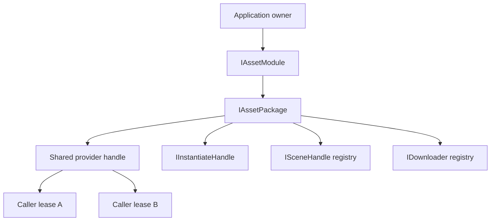

# Memory, ownership, and lifetime

[English | 简体中文](MemoryAndLifetime.SCH.md)

AssetManagement treats ownership correctness as the first memory-management policy. The module's memory model is built on explicit ownership: the application owns the module, the module owns packages, packages own shared provider handles and bounded idle caches, and every load returns a caller-owned lease.

## Table of Contents

- [Overview](#overview)
- [Core Concepts](#core-concepts)
- [Usage Guide](#usage-guide)
- [Advanced Topics](#advanced-topics)
- [Troubleshooting](#troubleshooting)

## Overview

All ownership-changing calls are Unity-main-thread-affine. Cancellation separates request waiting from shared-resource ownership; lease disposal is idempotent and required on every path.

### Key Features

- **Caller-owned leases**: non-pooled, exactly-once disposable handles per load call.
- **Bounded SLRU cache**: Active, Probation, Protected, and generation-Detached states with count and estimated-byte budgets.
- **Independent instance/scene/downloader ownership**: separate from asset leases, with package shutdown as leak containment.
- **Cancellation matrix**: caller tokens cancel waits, not shared backend work.
- **Bounded diagnostic registries**: `HandleTracker` and `SceneTracker` with capacity, drop counters, and weak scene references.

### Quick Start pattern

Keep the lease for exactly the period in which a consumer can access the asset. Await `Task`; `Error` is diagnostics only.

```csharp
public sealed class InventoryIconPresenter : IDisposable
{
    private readonly IAssetPackage _package;
    private IAssetHandle<Sprite> _iconHandle;

    public InventoryIconPresenter(IAssetPackage package)
    {
        _package = package ?? throw new ArgumentNullException(nameof(package));
    }

    public async UniTask ShowAsync(Image target, CancellationToken cancellationToken)
    {
        ReleaseIcon(target);

        IAssetHandle<Sprite> handle = _package.LoadAssetAsync<Sprite>(
            "UI/Icons/Inventory",
            bucket: "UI.Inventory",
            tag: "UI",
            owner: nameof(InventoryIconPresenter),
            cancellationToken);
        try
        {
            await handle.Task;
            target.sprite = handle.Asset;
            _iconHandle = handle;
        }
        catch
        {
            handle.Dispose();
            throw;
        }
    }

    public void Dispose()
    {
        _iconHandle?.Dispose();
        _iconHandle = null;
    }

    private void ReleaseIcon(Image target)
    {
        target.sprite = null;
        Dispose();
    }
}
```

Caller cancellation cancels this lease's wait view, not a backend load shared by other callers. The lease must still be disposed after success, provider failure, or cancellation. Access after lease disposal throws `ObjectDisposedException`.

## Core Concepts

### Ownership model



- The application owner constructs and shuts down the module.
- The module owns named packages.
- A package owns shared provider handles and its bounded idle cache.
- Every load call returns a new, non-pooled caller lease.
- Instances, scenes, and downloaders have ownership independent from an asset lease.
- Package shutdown contains leaks, but it does not grant permission to omit caller cleanup.

All ownership-changing calls are Unity-main-thread-affine.

### Cancellation matrix

| Operation | What a caller token cancels | Shared/provider work |
| --- | --- | --- |
| Asset, bulk, raw load | that caller lease's wait | may continue for other callers/cache |
| Scene load | no token in the core scene-load method | provider owns load completion |
| Scene activation/unload | accepted before mutation starts | deterministic shared completion after start |
| Addressables downloader `PrepareAsync` / `StartAsync` | that caller's wait | `Cancel`/`Dispose` cancels every joined wait; pending provider work drains to terminal before handle release |
| YooAsset downloader `PrepareAsync` / `StartAsync` | that caller's wait | `Cancel`/`Dispose` cancels every joined wait, requests provider-native `CancelDownload`, and drains the wrapper to terminal |
| Addressables catalog-label query | that caller's wait | provider writes only private result state; cancellation never permits a late write into the caller list |
| `GroupOperation.StartAsync` | that caller's wait | explicit `GroupOperation.Cancel` owns group cancellation |
| Catalog/manifest/cache mutation | checked before mutation | not reported cancelled while the provider check or non-rollbackable mutation is still running |
| Module/package shutdown | no external token | must reach a terminal or retryable failure state |

Cancellation never transfers disposal ownership and never implies rollback of partial cache data. Addressables has no physical abort; the adapter retains the pending handle and drains it to terminal. YooAsset requests provider-native abort and keeps its wrapper registered until terminal state is observed.

### Thread model

The following are main-thread-affine: module/package initialize, lookup, mutation, and shutdown; provider SDK calls and Unity object access; load request creation, cache mutation, handle/instance/scene disposal; and scene activation/unload and maintenance orchestration.

Locks and atomics protect narrow state or diagnostics; they do not make provider operations worker-thread-safe. Allowed worker work: completed raw-handle reads, telemetry ring-buffer operations, and product-scheduled pure file hashing on supported platforms. WebGL must remain valid without worker-thread assumptions.

## Usage Guide

### Instantiate a prefab

`InstantiateAsync` accepts only a successfully completed active GameObject lease owned by the same package. Invalid, disposed, or foreign handles throw `ArgumentException`; a pending or failed prefab lease throws `InvalidOperationException`. The prefab lease and instance handle are separate owners.

```csharp
IAssetHandle<GameObject> prefab = package.LoadAssetAsync<GameObject>(
    "Characters/Npc",
    bucket: "Gameplay.Level01",
    owner: "NpcSpawner",
    cancellationToken: cancellationToken);

try
{
    await prefab.Task;

    IInstantiateHandle instance = package.InstantiateAsync(
        prefab, parent: spawnRoot, worldPositionStays: false, setActive: true);
    try
    {
        await instance.Task;
        UseInstance(instance.Instance);
    }
    finally
    {
        instance.Dispose();
    }
}
finally
{
    prefab.Dispose();
}
```

Disposing the prefab lease does not destroy an existing instance. Disposing the instance handle performs the provider-appropriate instance release and removes it from the package registry.

### Scene lifecycle

Negotiate `IAssetSceneLoader`; Resources has no scene capability. A scene handle wrapper does not unload the scene. The same loader that created it is the unload authority.

```csharp
IAssetSceneLoader loader = package as IAssetSceneLoader ??
    throw new NotSupportedException("The selected provider has no scene capability.");

var loadParameters = new UnityEngine.SceneManagement.LoadSceneParameters(
    UnityEngine.SceneManagement.LoadSceneMode.Additive)
{
    localPhysicsMode = UnityEngine.SceneManagement.LocalPhysicsMode.Physics3D
};

ISceneHandle scene = loader.LoadSceneAsync(
    "Scenes/Gameplay",
    loadParameters,
    SceneActivationMode.Manual,
    bucket: "Gameplay.Level01");

_pendingScene = scene; // Field owned by the product transition/recovery object.

System.Exception primaryFailure = null;
bool unloaded = false;
try
{
    if (scene.ActivationMode == SceneActivationMode.Manual)
    {
        await scene.ActivateAsync(cancellationToken);
    }
    else
    {
        await scene.Task;
    }

    await loader.UnloadSceneAsync(scene, cancellationToken);
    unloaded = true;
}
catch (System.Exception exception)
{
    primaryFailure = exception;
}

if (!unloaded)
{
    try
    {
        await loader.UnloadSceneAsync(scene, CancellationToken.None);
        unloaded = true;
    }
    catch (System.Exception cleanupFailure)
    {
        if (primaryFailure != null)
        {
            throw new System.AggregateException(
                "Scene transition and authoritative cleanup both failed.",
                primaryFailure, cleanupFailure);
        }
        throw;
    }
}

scene.Dispose();
_pendingScene = null;

if (primaryFailure != null)
{
    System.Runtime.ExceptionServices.ExceptionDispatchInfo
        .Capture(primaryFailure).Throw();
}
```

`_pendingScene` is a field on the product transition/recovery owner, not a local-only lease. Assign it before the first await. A cleanup failure keeps both that field and the package registry authoritative, preserves a simultaneous transition failure in `AggregateException`, and prevents `Dispose`. Retry the same handle with `CancellationToken.None` or converge through package shutdown; clear the field only after successful unload.

The advanced overload carries Unity `LoadSceneParameters` to Addressables or YooAsset, including `LocalPhysicsMode.None`, `Physics2D`, `Physics3D`, and the valid combination. Unity makes the loaded scene the owner of its local physics worlds, so unloading the scene is the only disposal path.

For a manual scene, `Task` is provider load completion rather than a portable pre-activation readiness barrier. YooAsset keeps it pending at Unity's activation barrier, so call and await `ActivateAsync` directly. Manual activation is not rollback-safe staging; gate authoritative side effects behind the product's transition commit and make teardown idempotent.

Any scene held at Unity's manual activation barrier stalls subsequently queued asynchronous scene operations. When several manual loads exist, activate or join every unresolved manual scene in creation order before starting any new unload operation. Package shutdown performs this barrier-resolution phase first, then unloads scenes in stable creation order.

Scenes never enter SLRU/idle retention, and cache trim, bucket clear, or low-memory cache maintenance never unloads them. `ISceneHandle.Dispose` is idempotent and releases only caller ownership of the wrapper; it does not release provider scene ownership.

### Buckets, tags, and owners

- `bucket` is a lifetime domain, such as `UI.Inventory` or `Gameplay.Level01`.
- `tag` classifies runtime usage; it is not a provider catalog label.
- `owner` identifies the product system holding the lease.

Active leases are never invalidated by a bucket clear. A key can accumulate at most eight values per metadata kind. Overflowing a metadata kind makes the entry bypass idle retention after its final active lease.

## Advanced Topics

### SLRU cache

Every package has three keyed SLRU states and one generation-detached ownership state:

- **Active**: one or more caller references; pinned and never evicted. The aggregate Active count includes keyed and generation-detached handles.
- **Probation**: first-use idle entries; one-time scans are evicted here.
- **Protected**: entries reused after idle; overflow demotes the LRU tail to Probation.
- **Detached**: an active handle whose catalog or manifest generation is no longer current. It is absent from keyed lookup and idle SLRU segments, but its existing caller leases remain valid.

Lookup is a dictionary operation with average O(1) cost. Segment operations use linked lists with constant-time promotion/demotion. Retention scans are O(idle entries). A generation advance disposes idle entries and moves every keyed Active handle into the detached ownership registry. A later load resolves the current generation instead of reusing the old handle. Final release disposes the detached handle directly. Only provider operations whose memoized task is `Succeeded` enter idle retention.

SLRU keeps exact bounded resident-key and recency state, but memory size is approximate. Replace SLRU only after another policy wins trace replay on at least two distinct real workloads while measuring object hit ratio, reload bytes, avoided load time, policy CPU p50/p95/p99, metadata memory, collisions, eviction churn, and GC on target devices.

### Count and byte budgets

```csharp
var tuning = new AssetCacheTuning(
    probationEntryLimit: 32,
    protectedEntryLimit: 256,
    idleByteBudget: 192L * 1024 * 1024,
    clearIdleOnLowMemory: true);

var moduleOptions = new AssetManagementOptions(tuning);
var packageOptions = new AssetPackageInitOptions(
    providerOptions: null,
    cacheTuningOverride: tuning);
```

Explicit limits allow 1-131,072 entries per idle segment and require at least 1 MiB for `IdleByteBudget`. These are safety bounds. Active memory is outside eviction authority.

On every Active-to-idle transition, the cache estimates the current value using Unity's runtime-size query and allocation-free fallbacks for known texture, mesh, and audio types. Unknown estimates bypass idle retention. Every member of a bulk result must be measurable; one unknown member makes the aggregate bypass. A candidate larger than the complete idle budget is rejected before admission.

The estimate can misstate transitive bundles, shared dependencies, native allocator overhead, GPU/driver memory, mip streaming, and provider metadata. `IdleByteBudget` is not a process-memory limit. Use Memory Profiler, platform GPU tools, resident-set measurements, and low-memory testing.

### Retention

The core has no hidden timer. Run retention at an owned phase boundary:

```csharp
var policy = AssetCacheRetentionPolicy.MatchingAny(
    AssetCacheRetentionRules.IdleForAtLeast(TimeSpan.FromMinutes(2)),
    AssetCacheRetentionRules.All(
        AssetCacheRetentionRules.Bucket("UI.Shop", includeChildren: true),
        AssetCacheRetentionRules.IdleForAtLeast(TimeSpan.FromSeconds(30))));

int evicted = package.TrimIdleCache(policy);
```

`AssetCacheRetentionScheduler` is an opt-in UniTask scheduler with a minimum one-second interval. `AssetCacheRetentionBehaviour` is only a scene bridge and requires `Bind(package)`. Prebuild recurring policies. A custom `IAssetCacheRetentionRule` runs inside a protected evaluation phase: it must be deterministic, non-blocking, allocation-aware, and must not mutate the cache reentrantly.

Eviction, trim, bucket clear, and full clear complete cache bookkeeping and attempt every selected provider release before throwing an aggregate of recoverable release failures. `Application.lowMemory` clears idle entries when enabled and logs release failures instead of preventing other low-memory subscribers from running.

### Cache activity accuracy

`AssetRuntimeCacheSnapshot` reads a coherent, allocation-free aggregate under the cache diagnostic lock. Occupancy values describe the current cache. Activity, rejection, eviction, release-failure, and peak values are monotonic totals: active hits, idle reuses, misses, and derived hit ratio; successful idle admissions; rejected admissions split into failed operation, metadata overflow, unknown footprint, and oversize reasons; evictions split into entry capacity, byte budget, retention policy, and explicit clear/generation/shutdown reasons.

The counters are updated with integer operations while the existing cache lock is held. Hit ratio measures object-key lookup behavior; correlate counter deltas with provider, Memory Profiler, GPU, resident-set, disk, and network measurements.

### Bounded diagnostic registries

`HandleTracker` defaults to 16,384 entries and permits a configured maximum of 65,536. `SceneTracker` defaults to 4,096 entries and permits a configured maximum of 16,384. Configure capacity before enabling a tracker. At capacity, a tracker drops the new diagnostic registration, increments `DroppedRegistrationCount`, and marks the observation epoch incomplete; it never grows without an explicit bound. Scene entries hold weak handle references; `CopyTrackedScenesTo` fills a caller-owned reusable list with an explicit row bound while returning the exact live count.

Handle tracking is disabled by default. When stack capture is enabled, a recoverable capture failure stores no stack and does not fail the asset operation. The cache, governance, handle, and scene Editor windows perform automatic snapshots only while visible and in Play Mode, at no more than 2 Hz. Cache detail is limited to 4,096 rows per tier; Governance and Handle Tracker also capture at most 4,096 handle rows. Built-in providers correlate tracker and cache rows through exact process-wide handle identity. A custom cached handle without that internal diagnostic identity is reported as `Review` rather than a leak suspect.

## Troubleshooting

| Symptom | Likely cause | Resolution |
| --- | --- | --- |
| Asset remains in memory after all callers dispose | Idle cache entry retained intentionally | Inspect Cache Debugger, call a targeted bucket clear or retention policy, compare with Memory Profiler evidence |
| Handle appears leaked | Lease not disposed on some path | Enable handle tracking, confirm every success/exception/cancellation path disposes the caller lease; cancelling `handle.Task` does not dispose it |
| Scene unload was cancelled | Cancellation accepted only before mutation starts | Join the non-cancellable provider completion; a failed unload remains retryable |
| `_pendingScene` retained after failure | Cleanup failed before unload completed | Retry `UnloadSceneAsync(_pendingScene, CancellationToken.None)` or converge through package shutdown; clear the field only after successful unload |
| Bulk handle bypasses idle retention | One member has no positive estimate | Ensure every member type is measurable or accept the bypass |
| Idle budget exceeded by single candidate | Candidate larger than complete budget | Pre-size content or raise the measured budget; the candidate is rejected before admission |
| Detached handle still counted as Active | Generation advanced while leases remain valid | Existing caller leases remain valid; dispose them to release; a later load resolves the current generation |
| Scene blocks subsequent scene operations | Manual activation barrier unresolved | Resolve every manual scene in creation order before starting a new unload phase |
| `DontDestroyOnLoad` object loses provider dependencies | Scene unload released scene-owned leases | Hold independent AssetManagement leases for provider-owned dependencies that outlive the original scene |
