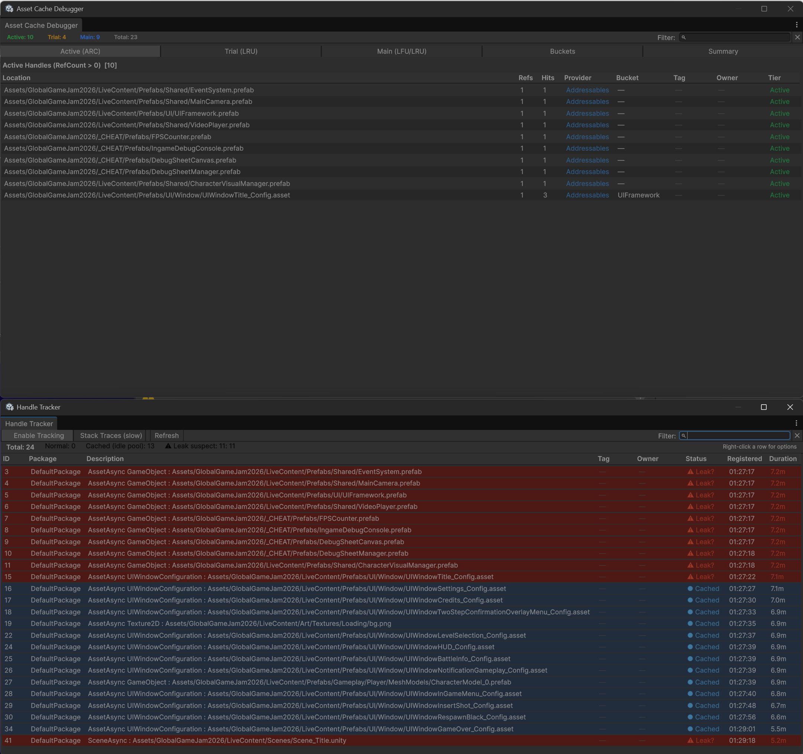
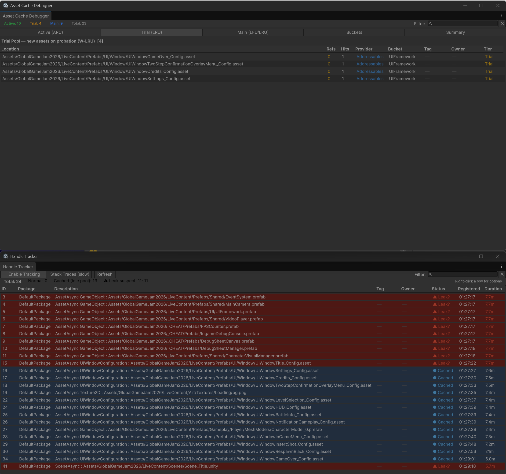
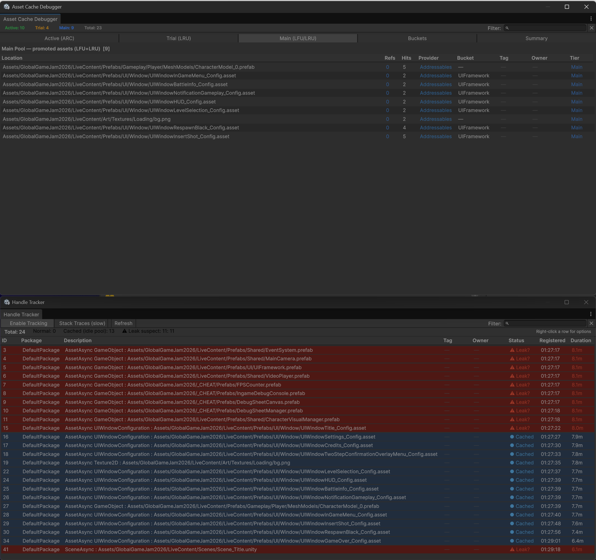
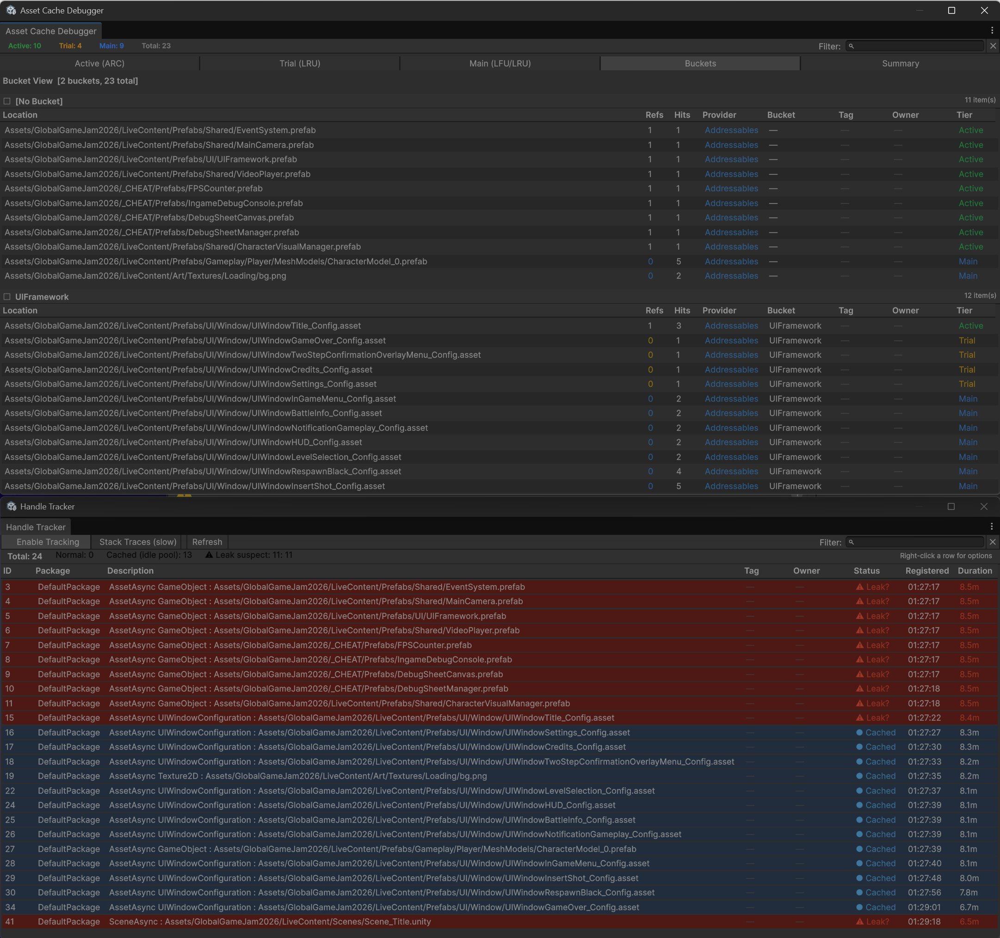
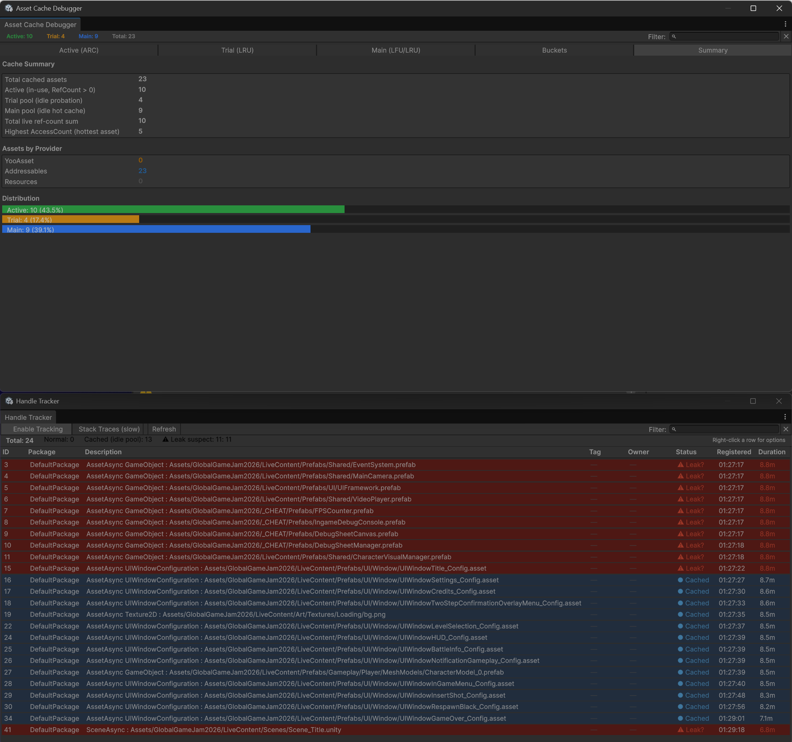

# CycloneGames.AssetManagement

[English](./README.md) | 简体中文

一个为 Unity 设计的 DI 优先、接口驱动的统一资源管理抽象层。它将游戏逻辑与底层资源系统（YooAsset、Addressables 或 Resources）解耦，让您编写更清晰、更易移植的高性能代码。

## 目录

- [环境要求](#环境要求)
- [安装](#安装)
- [快速开始](#快速开始)
- [核心概念](#核心概念)
- [提供器对比](#提供器对比)
- [使用示例](#使用示例)
  - [YooAsset 提供器](#yooasset-提供器)
  - [Addressables 提供器](#addressables-提供器)
  - [Resources 提供器](#resources-提供器)
- [热更新工作流](#热更新工作流)
- [高级功能](#高级功能)
- [API 参考](#api-参考)

---

## 环境要求

| 依赖项       | 必需    | 说明                                         |
| ------------ | ------- | -------------------------------------------- |
| Unity        | 2022.3+ | 最低版本要求                                 |
| UniTask      | 是      | `com.cysharp.unitask` - 异步支持             |
| YooAsset     | 可选    | `com.tuyoogame.yooasset` - 推荐的提供器      |
| Addressables | 可选    | `com.unity.addressables` - 备选提供器        |
| VContainer   | 可选    | `jp.hadashikick.vcontainer` - DI 集成        |
| R3           | 可选    | `com.cysharp.r3` - 用于 `IPatchService` 事件 |

## 安装

1. 将包导入您的 Unity 项目
2. 模块会通过程序集定义引用自动检测可用的提供器
3. 无需手动配置脚本定义符号

---

## 快速开始

本节将指导您快速上手加载第一个资源。

### 第一步：初始化（游戏启动时执行一次）

```csharp
using CycloneGames.AssetManagement.Runtime;
using Cysharp.Threading.Tasks;
using YooAsset;

public class GameBootstrap
{
    // 存储模块引用以便后续访问
    public static IAssetModule AssetModule { get; private set; }

    public async UniTask Initialize()
    {
        // 创建并初始化模块（只执行一次）
        AssetModule = new YooAssetModule();
        await AssetModule.InitializeAsync();

        // 创建并初始化资源包（每个包只执行一次）
        var package = AssetModule.CreatePackage("DefaultPackage");

        var initOptions = new AssetPackageInitOptions(
            AssetPlayMode.Offline,
            new OfflinePlayModeParameters()
        );

        await package.InitializeAsync(initOptions);
    }
}
```

### 第二步：加载资源（在游戏任意位置）

```csharp
using UnityEngine;

public class PlayerSpawner
{
    public async UniTask SpawnPlayer()
    {
        // 获取已存在的资源包（不要重复创建！）
        var package = GameBootstrap.AssetModule.GetPackage("DefaultPackage");

        // 加载并使用资源
        using (var handle = package.LoadAssetAsync<GameObject>("Prefabs/Player"))
        {
            await handle.Task;

            if (handle.Asset != null)
            {
                GameObject player = package.InstantiateSync(handle);
            }
        }
    }
}
```

> [!TIP]
> **CreatePackage 与 GetPackage 的区别**
>
> - `CreatePackage(name)` - 初始化时调用一次，创建新资源包
> - `GetPackage(name)` - 在其他任意位置调用，获取已存在的资源包

---

## 核心概念

### 架构概览

```
游戏逻辑
    |
    v
IAssetModule（接口）
    |
    +-- YooAssetModule（推荐）
    +-- AddressablesModule
    +-- ResourcesModule
    |
    v
IAssetPackage（接口）
    |
    v
资源加载 / 实例化 / 场景管理
```

### 关键接口

| 接口              | 用途                                 |
| ----------------- | ------------------------------------ |
| `IAssetModule`    | 资源系统入口，创建和管理资源包       |
| `IAssetPackage`   | 处理所有资源操作：加载、实例化、场景 |
| `IAssetHandle<T>` | 表示已加载的资源，可释放以管理内存   |
| `IPatchService`   | 高层热更新工作流（仅 YooAsset）      |

### 句柄生命周期

句柄代表已加载的资源，必须正确释放：

```csharp
// 方式一：using 语句（推荐）
using (var handle = package.LoadAssetAsync<Texture2D>("Textures/Icon"))
{
    await handle.Task;
    // 在这里使用 handle.Asset
}
// 自动释放

// 方式二：手动释放
var handle = package.LoadAssetAsync<Texture2D>("Textures/Icon");
await handle.Task;
// ... 使用资源 ...
handle.Dispose(); // 不要忘记这一步！
```

---

## 提供器对比

| 功能         | YooAsset | Addressables | Resources |
| ------------ | -------- | ------------ | --------- |
| 同步加载     | 支持     | 不支持       | 支持      |
| 异步加载     | 支持     | 支持         | 支持      |
| 热更新       | 支持     | 有限         | 不支持    |
| 场景加载     | 支持     | 支持         | 不支持    |
| 原生文件加载 | 支持     | 不支持       | 不支持    |
| 推荐用途     | 正式项目 | 已有项目     | 原型开发  |

---

## 使用示例

### YooAsset 提供器

YooAsset 是推荐的提供器，具有完整的功能支持。

#### 离线模式（单机游戏）

```csharp
public async UniTask InitializeOffline()
{
    // 1. 创建并初始化模块
    var assetModule = new YooAssetModule();
    await assetModule.InitializeAsync();

    // 2. 创建资源包
    var package = assetModule.CreatePackage("DefaultPackage");

    // 3. 初始化为离线模式
    var initOptions = new AssetPackageInitOptions(
        AssetPlayMode.Offline,
        new OfflinePlayModeParameters()
    );

    await package.InitializeAsync(initOptions);

    // 4. 加载资源
    using (var handle = package.LoadAssetAsync<GameObject>("Prefabs/Enemy"))
    {
        await handle.Task;
        var enemy = package.InstantiateSync(handle);
    }
}
```

#### 主机模式（在线游戏带热更新）

```csharp
public async UniTask InitializeOnline()
{
    var assetModule = new YooAssetModule();
    await assetModule.InitializeAsync();

    var package = assetModule.CreatePackage("DefaultPackage");

    // 配置主机模式，指向您的 CDN
    var hostParams = new HostPlayModeParameters
    {
        BuildinQueryServices = new DefaultBuildinQueryServices(),
        RemoteServices = new DefaultRemoteServices("https://cdn.example.com/bundles")
    };

    var initOptions = new AssetPackageInitOptions(AssetPlayMode.Host, hostParams);
    await package.InitializeAsync(initOptions);
}
```

### Addressables 提供器

适用于已经使用 Unity Addressables 的项目。

```csharp
public async UniTask UseAddressables()
{
    // 1. 创建并初始化
    var assetModule = new AddressablesModule();
    await assetModule.InitializeAsync();

    // 2. 创建资源包
    var package = assetModule.CreatePackage("DefaultPackage");

    // 3. 加载资源（仅异步）
    using (var handle = package.LoadAssetAsync<GameObject>("MyAddressableKey"))
    {
        await handle.Task;
        if (handle.Asset != null)
        {
            var instance = await package.InstantiateAsync(handle).Task;
        }
    }
}
```

> [!NOTE]
> Addressables 的限制：
>
> - 不支持同步操作
> - 不支持 `IPatchService`
> - 不支持原生文件加载

### Resources 提供器

最适合快速原型开发或小型项目。

```csharp
public async UniTask UseResources()
{
    // 1. 创建并初始化（同步）
    var assetModule = new ResourcesModule();
    await assetModule.InitializeAsync();

    // 2. 创建资源包
    var package = assetModule.CreatePackage("DefaultPackage");

    // 3. 从 Resources 文件夹加载
    using (var handle = package.LoadAssetAsync<Sprite>("Icons/Coin"))
    {
        await handle.Task;
        myImage.sprite = handle.Asset;
    }
}
```

> [!WARNING]
> Resources 的限制：
>
> - 无法加载场景
> - 不支持热更新
> - 资源无法单独卸载
> - 不推荐用于正式项目

---

## 热更新工作流

### 高层 API（推荐）

`IPatchService` 提供完整的更新工作流，采用事件驱动架构：

```csharp
public async UniTask RunPatchFlow()
{
    // 获取补丁服务
    var patchService = assetModule.CreatePatchService("DefaultPackage");

    // 订阅事件
    patchService.PatchEvents.Subscribe(evt =>
    {
        var (eventType, args) = evt;

        switch (eventType)
        {
            case PatchEvent.FoundNewVersion:
                var versionArgs = (FoundNewVersionEventArgs)args;
                Debug.Log($"发现新版本！大小：{versionArgs.TotalDownloadSizeBytes} 字节");
                // 显示确认对话框，然后调用：
                // patchService.Download();
                break;

            case PatchEvent.DownloadProgress:
                var progressArgs = (DownloadProgressEventArgs)args;
                Debug.Log($"进度：{progressArgs.Progress:P0}");
                break;

            case PatchEvent.PatchDone:
                Debug.Log("更新完成！");
                break;

            case PatchEvent.PatchFailed:
                Debug.LogError("更新失败！");
                break;
        }
    });

    // 启动补丁流程
    await patchService.RunAsync(autoDownloadOnFoundNewVersion: false);
}
```

### 底层 API（精细控制）

用于自定义更新流程：

```csharp
// 检查更新
string latestVersion = await package.RequestPackageVersionAsync();

// 更新清单
bool updated = await package.UpdatePackageManifestAsync(latestVersion);

// 创建下载器
var downloader = package.CreateDownloaderForAll(downloadingMaxNumber: 10, failedTryAgain: 3);

// 监控进度
while (!downloader.IsDone)
{
    Debug.Log($"已下载：{downloader.CurrentDownloadBytes}/{downloader.TotalDownloadBytes}");
    await UniTask.Yield();
}

// 清理未使用的缓存
await package.ClearCacheFilesAsync(ClearCacheMode.Unused);
```

---

## 高级功能

### 原生文件加载

加载非 Unity 文件，如 JSON、XML 或二进制数据：

```csharp
// 异步加载
using (var handle = package.LoadRawFileAsync("Config/settings.json"))
{
    await handle.Task;
    string jsonText = handle.ReadText();
    var settings = JsonUtility.FromJson<GameSettings>(jsonText);
}

// 同步加载
var handle = package.LoadRawFileSync("Data/level.bin");
byte[] data = handle.ReadBytes();
handle.Dispose();
```

### 场景管理

```csharp
// 加载场景
var sceneHandle = package.LoadSceneAsync("Assets/Scenes/Gameplay.unity");
await sceneHandle.Task;

// 场景现在已激活

// 卸载场景
await package.UnloadSceneAsync(sceneHandle);
```

### 批量加载

加载多个资源并追踪进度：

```csharp
using CycloneGames.AssetManagement.Runtime.Batch;

var group = new GroupOperation();

// 添加操作，可选权重
group.Add(package.LoadAssetAsync<Texture2D>("Tex1"), weight: 1f);
group.Add(package.LoadAssetAsync<Texture2D>("Tex2"), weight: 1f);
group.Add(package.LoadAssetAsync<AudioClip>("Music"), weight: 2f);

// 追踪进度
_ = TrackProgress(group);

await group.StartAsync();

async UniTask TrackProgress(GroupOperation op)
{
    while (!op.IsDone)
    {
        loadingBar.value = op.Progress;
        await UniTask.Yield();
    }
}
```

### 高性能资源缓存 (W-TinyLFU 架构)

资源管理系统内置了零 GC、三级分层（Active、Trial、Main）的缓存架构，最大化缓存命中率，同时提供确定性的内存管理策略，且没有任何运行时开销：

- **Active (活跃池)**: 当前被游戏逻辑显式引用的资源（Refs > 0）。
- **Trial (试用池 - LRU)**: 被释放资产的观察期缓存池。
- **Main (主池 - LFU/LRU)**: 经过试用期且被频繁访问的"热"资源缓存。

你可以通过 **Bucket (内存桶)** 来控制特定的缓存容量及实现确定性的内存释放：

```csharp
// 加载资源并将其分配到 "UI" 桶中
using (var handle = package.LoadAssetAsync<GameObject>("Prefabs/MainMenu", bucket: "UI"))
{
    // ...
}

// 稍后，仅清理 "UI" 桶中的资源来强制释放内存
package.UnloadUnusedAssets(bucket: "UI");
```

### 资源追踪与元数据 (Metadata Tracking)

为了让运行时资源的追踪变得极其简单，所有加载 API 均支持零 GC 的 `tag` 和 `owner` 参数。这让你能够细粒度地追踪**是谁**加载了该资源，以及该资源的**用途**。

```csharp
// 加载资源并加上追踪标记
var handle = package.LoadAssetAsync<GameObject>("Prefabs/Hero",
    tag: "Character",
    owner: "PlayerSpawner"
);
```

**应用案例：UIFramework 集成**
`CycloneGames.UIFramework` 完美地应用了此设计。当打开 UI 窗口时，底层会自动为加载的资源打上标签：

- `owner`: 具体的 UI 窗口名称（如 `HomeUI`）
- `tag`: 资源分类（如 `UIConfig` 或 `UIPrefab`）

这样在调试器中，你可以一眼看出是哪个 UI 占用了内存。

### 高级编辑器调试工具

我们提供了业界一流的编辑器窗口，帮助你可视化缓存健康度并精准定位内存泄漏。

#### 1. 资源缓存调试器 (Asset Cache Debugger)

提供对整个 W-TinyLFU 缓存系统全局的透视。(`Tools/CycloneGames/AssetManagement/Asset Cache Debugger`)

- **层级 (Tier) 可视化**: 直观显示资源当前是处于 Active 状态、Trial 试用池，还是 Main 热缓存区。
- **元数据显示**: 直接显示和过滤 `Tag`、`Owner` 以及 `Bucket`。
- **引用计数异常警告**: 自动高亮显示引用计数异常偏高（> 8）的资源，警告你可能遗漏了 `Dispose()` 调用。
- **智能汇总**: 按资源提供者、Tag 和 Owner 统计内存分布。

#### 2. 句柄泄漏追踪追踪器 (Handle Tracker)

微观级别监控每一个活动句柄的分配，并自动与缓存系统交叉比对。(`Tools/CycloneGames/AssetManagement/Asset Handle Tracker`)

- **智能状态识别**: 自动判断引用计数为 0 的句柄是安全驻留在空闲缓存中 (`Cached`)，还是真正的内存泄漏 (`Leaked`)。
- **内存泄漏堆栈**: 点击展开任何泄露的句柄，直接跳转到分配该句柄的精准 C# 代码行。







---

## API 参考

### IAssetModule

| 方法                       | 说明                        |
| -------------------------- | --------------------------- |
| `InitializeAsync(options)` | 初始化资源系统              |
| `Destroy()`                | 清理并释放资源              |
| `CreatePackage(name)`      | 创建新的资源包              |
| `GetPackage(name)`         | 获取已存在的资源包          |
| `RemovePackageAsync(name)` | 移除并销毁资源包            |
| `CreatePatchService(name)` | 创建补丁服务（仅 YooAsset） |

### IAssetPackage

| 方法                         | 说明                                        |
| ---------------------------- | ------------------------------------------- |
| `InitializeAsync(options)`   | 初始化资源包                                |
| `DestroyAsync()`             | 销毁资源包                                  |
| `LoadAssetAsync<T>(...)`     | 异步加载资源 (支持 `tag`/`owner`)           |
| `LoadAssetSync<T>(...)`      | 同步加载资源 (支持 `tag`/`owner`)           |
| `LoadAllAssetsAsync<T>(...)` | 加载指定位置的所有资源 (支持 `tag`/`owner`) |
| `InstantiateAsync(handle)`   | 异步实例化预制体                            |
| `InstantiateSync(handle)`    | 同步实例化（零 GC）                         |
| `LoadSceneAsync(location)`   | 加载场景                                    |
| `UnloadSceneAsync(handle)`   | 卸载场景                                    |
| `LoadRawFileAsync(location)` | 加载原生文件                                |
| `UnloadUnusedAssets()`       | 卸载未使用的资源                            |

### 脚本定义符号

这些符号会根据已安装的包自动定义：

| 符号                   | 定义时机               |
| ---------------------- | ---------------------- |
| `YOOASSET_PRESENT`     | 已安装 YooAsset 包     |
| `ADDRESSABLES_PRESENT` | 已安装 Addressables 包 |
| `VCONTAINER_PRESENT`   | 已安装 VContainer 包   |

---

## 最佳实践

1. **始终释放句柄** - 使用 `using` 语句或手动调用 `Dispose()`
2. **优先使用异步加载** - 同步加载会阻塞主线程
3. **选择合适的提供器** - 正式项目用 YooAsset，原型开发用 Resources
4. **开发时启用句柄追踪** - 帮助尽早发现内存泄漏
5. **使用 DI 容器** - 将 `IAssetModule` 注册为单例以保持架构清晰
