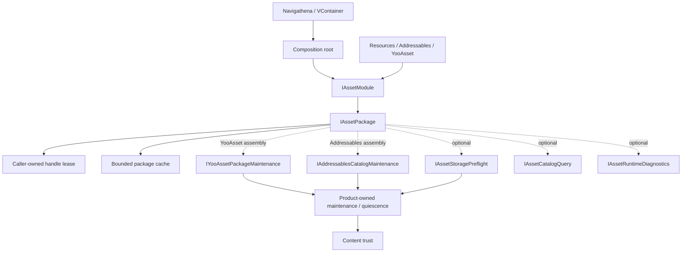

# CycloneGames.AssetManagement

[English | 简体中文](README.md)

CycloneGames.AssetManagement 是一个 provider-neutral 的 Unity 资产运行时，提供显式 package 组合、调用方持有的 handle、有界内存缓存、产品持有的维护原语、内容校验、诊断，以及可选的 provider 集成。它适用于在长期会话和持续负载下需要可预测所有权与失败行为、且不希望把应用代码绑定到某个资产 SDK 或某个 DI 容器的项目。

## 目录

- [概述](#概述)
- [架构](#架构)
- [快速上手](#快速上手)
- [核心概念](#核心概念)
- [使用指南](#使用指南)
- [进阶主题](#进阶主题)
- [常见场景](#常见场景)
- [性能与内存](#性能与内存)
- [故障排查](#故障排查)

## 概述

模块持有 module 和 package 生命周期、asset/sub-asset/raw-file/instance/scene handle、调用方 lease 所有权与确定性释放、package 本地的 active 和 idle 内存缓存、用于 retention 与诊断的逻辑 bucket/tag/owner metadata、窄而专一的 provider 维护与 downloader 原语、存储容量预检、有界且带版本的内容信任 manifest 与校验、有界运行时 telemetry，以及可选的 Addressables、YooAsset、Navigathena 与 VContainer 桥接。

Provider adapter 在通用契约上归一化，只在能力可用时暴露可选能力。资产导入规则、bundle 布局、Addressables group、YooAsset collection 规则、CDN 拓扑、认证、授权、DRM、存档、平台认证与发布运营仍由产品负责。Provider SDK 仍是其下载文件与磁盘缓存格式的权威。

### 主要特性

- **Provider-neutral 核心**：`IAssetModule` 与 `IAssetPackage`，提供调用方持有、只 Dispose 一次的 handle。
- **有界 SLRU 缓存**：package 本地的 active、probation、protected 与 generation-detached 状态，带有数量与估算字节预算。
- **可选 provider**：Resources、Addressables（`[2.11.1,2.11.2)`）、YooAsset（`[3.0.4,3.0.5)`），通过接口转换进行能力协商。
- **维护原语**：`IYooAssetPackageMaintenance` 与 `IAddressablesCatalogMaintenance`，用于 manifest/catalog 激活、缓存清理与 All/Tags/Locations downloader。
- **内容信任**：schema-2 `ContentTrustManifest`，使用 SHA-256 校验与 `RequireSignature` 或 `IntegrityOnly` policy。
- **存储预检**：`IAssetStoragePreflight`，对可靠桌面卷返回 `Available`/`Insufficient`/`Unknown`/`Failed`。
- **有界诊断**：`HandleTracker`、`SceneTracker`、`AssetRuntimeTelemetryRecorder` 与 Editor 窗口，具有容量上限与 drop 计数。

聚焦指南从本 README 继续：

- [Provider 与集成](Documents~/Providers.SCH.md)：provider 选择、runtime-location 规则、Resources、Addressables、YooAsset、VContainer、Navigathena 与自定义 provider 边界。
- [内存、所有权与生命周期](Documents~/MemoryAndLifetime.SCH.md)：handle/instance/scene 所有权、取消与线程规则、SLRU、预算、retention、低内存行为。
- [内容操作](Documents~/ContentOperations.SCH.md)：downloader 所有权、存储与磁盘门、release mutation、内容信任、telemetry、持久化、恢复。

## 架构



依赖方向是显式的：应用组合选择一个 provider module，并把 `IAssetPackage` 传给消费者。核心消费者不从进程全局状态发现 package。可选集成依赖 runtime 契约；runtime 不依赖这些集成。

### 程序集布局

| 程序集 | `autoReferenced` | 启用条件 |
| --- | ---: | --- |
| `CycloneGames.AssetManagement.Runtime` | yes | 始终 |
| `CycloneGames.AssetManagement.Runtime.CacheRetention` | yes | 始终 |
| `CycloneGames.AssetManagement.Editor` | yes | 仅 Unity Editor |
| `CycloneGames.AssetManagement.Tests.Editor` | no | Unity Test Runner |
| `CycloneGames.AssetManagement.Runtime.Providers.Addressables` | no | `com.unity.addressables` `[2.11.1,2.11.2)` 加显式 consumer reference |
| `CycloneGames.AssetManagement.Providers.Addressables.Tests.Editor` | no | Addressables 2.11.1 加 Unity Test Runner |
| `CycloneGames.AssetManagement.Runtime.Providers.YooAsset` | no | `com.tuyoogame.yooasset` `[3.0.4,3.0.5)` 加显式 consumer reference |
| `CycloneGames.AssetManagement.Providers.YooAsset.Tests.Editor` | no | YooAsset 3.0.4 加 Unity Test Runner |
| `CycloneGames.AssetManagement.Runtime.Integrations.Navigathena` | no | `com.mackysoft.navigathena` `[1.1.0,1.1.1)` 加显式 consumer reference |
| `CycloneGames.AssetManagement.Runtime.Integrations.VContainer` | no | `jp.hadashikick.vcontainer` 加显式 consumer reference |

核心 Runtime 直接依赖 UniTask、CycloneGames.Logger、CycloneGames.IO Core/SystemIO 与 CycloneGames.Hash Core。仅安装可选包不够：其 `versionDefines` 范围必须匹配，且 consumer asmdef 必须引用条件 Assembly。不要在 PlayerSettings 中手工添加 `CYCLONEGAMES_HAS_*` 符号。

## 快速上手

使用内置 Resources provider 在选择远程 provider 前学习所有权模型。下面的地址相对于 Unity `Resources` 文件夹。

```csharp
var module = new ResourcesModule();
IAssetPackage package = await AssetManager.InitializeDefaultPackageAsync(
    module,
    "BaseContent",
    moduleOptions: default,
    packageOptions: default,
    cancellationToken);

using (IAssetHandle<Texture2D> icon =
       package.LoadAssetAsync<Texture2D>("UI/Icons/Inventory", cancellationToken: cancellationToken))
{
    await icon.Task;
    UseTextureWhileHandleIsAlive(icon.Asset);
}

await module.DestroyAsync();
```

需要牢记的四条规则：

1. Composition root 持有 module 和 package。
2. 调用方持有每个返回的 handle。
3. 读取值之前 await `handle.Task`。
4. 关闭 module 之前 Dispose handle。

远程 provider 使用同样的面向消费者的所有权模型。

## 核心概念

### 所有权层级

```text
Application lifetime
  -> IAssetModule
       -> one or more IAssetPackage instances
            -> shared provider handles held by the package cache
                 -> one caller-owned lease per load call
```

应用 owner 构造并关闭 module。Module 持有命名的 package。Package 持有共享 provider handle 与其有界 idle 缓存。每次 load 调用返回一个新的、非池化的调用方 lease。Instance、scene 与 downloader 拥有独立于 asset lease 的所有权。Package shutdown 会遏制泄漏，但不等于允许省略调用方清理。所有改变所有权的调用都受 Unity 主线程约束。

### Handle、取消与线程模型

Asset、all-assets 与 raw-file load 调用返回非池化的调用方 lease。Lease 会钉住一个共享 provider handle，直到 Lease 被 Dispose。Lease Dispose 幂等。Dispose 后访问会抛出 `ObjectDisposedException`。`IOperation.Task` 是 memoized 的，可安全重复或并发 await；`Error` 是诊断文本，不能替代 await `Task`。

`WaitForAsyncComplete` 不是 async flow 的可移植替代品。Addressables 对每个 pending 操作都拒绝它。应 await `Task`。同步单资产加载仍是可选的 `IAssetSyncOperations` 能力；scene 刻意只暴露异步生命周期。

调用方取消只取消该调用方的等待，不取消可能被其他调用方使用的共享后端加载。调用方仍必须 Dispose 其 lease。这把请求取消与共享资源所有权分离。

Unity object、provider API、缓存 mutation、handle dispose、scene 操作、module/package 生命周期与维护编排都受主线程约束。允许的 worker-thread 工作很窄：已完成的 `IRawFileHandle.ReadText` 与 `ReadBytes` 读取、telemetry ring-buffer 操作，以及支持平台上产品调度的纯文件哈希。不要从后台任务调用 Unity object 属性、provider handle、`Dispose` 或缓存 mutation。

### 能力协商

显式测试能力；不要无失败路径地转换。

```csharp
if (package is not IYooAssetPackageMaintenance maintenance)
{
    return; // 该 composition assembly 没有 YooAsset maintenance 能力。
}

bool activated = await maintenance.UpdatePackageManifestAsync(
    authenticatedPackageVersion,
    cancellationToken: cancellationToken);
```

| 能力 | Resources | Addressables | YooAsset |
| --- | ---: | ---: | ---: |
| 异步单资产加载与 instance handle | yes | yes | yes |
| `IAssetSyncOperations` | yes | no | yes |
| `IAssetBulkLoader` | no | yes | yes |
| `IAssetRawFileLoader` | no | no | yes |
| `IAssetSceneLoader` | no | yes | yes |
| `IAssetCatalogQuery` | no | yes | yes |
| `IAssetStoragePreflight` | no | 仅桌面卷 | 仅桌面 Host mode |
| Provider maintenance/downloader | no | `IAddressablesCatalogMaintenance` | `IYooAssetPackageMaintenance` |
| `IAssetRuntimeDiagnostics` | yes | yes | yes |

Addressables 与 YooAsset 不能同时通过这些 adapter 激活。Module 级 AssetBundle runtime guard 建立唯一的框架控制 provider authority，直到共存、shutdown 顺序与内存行为作为完整产品配置得到验证。

## 使用指南

### 应用持有的组合

```csharp
public sealed class GameAssetLifetime
{
    private IAssetModule _module;
    private IAssetPackage _package;

    public async UniTask InitializeAsync(CancellationToken cancellationToken)
    {
        _module = new ResourcesModule();
        _package = await AssetManager.InitializeDefaultPackageAsync(
            _module,
            "BaseContent",
            new AssetManagementOptions(defaultCacheTuning: default),
            new AssetPackageInitOptions(providerOptions: null, cacheTuningOverride: null),
            cancellationToken);
    }

    public async UniTask<IAssetHandle<Texture2D>> LoadIconAsync(CancellationToken cancellationToken)
    {
        IAssetHandle<Texture2D> handle = _package.LoadAssetAsync<Texture2D>(
            "UI/Icons/Inventory",
            bucket: "UI.Inventory",
            tag: "UI",
            owner: "InventoryScreen",
            cancellationToken);
        try
        {
            await handle.Task;
            return handle;
        }
        catch
        {
            handle.Dispose();
            throw;
        }
    }

    public async UniTask ShutdownAsync()
    {
        if (_module != null) await _module.DestroyAsync();
    }
}
```

接收 `LoadIconAsync` 的调用方持有返回的 handle，并在纹理使用期间保持其存活。在调用方的 `finally`、`OnDisable` 或 `OnDestroy` 路径中在主线程 Dispose 它。

### 实例化 Prefab

`InstantiateAsync` 只接受由同一 package 持有、已成功完成的活跃 `IAssetHandle<GameObject>` lease。Prefab lease 与返回的 instance handle 具有独立生命周期：请求 instance 时保留 prefab lease，然后在每条路径上 Dispose 两个 owner。

```csharp
IAssetHandle<GameObject> prefab = package.LoadAssetAsync<GameObject>(
    "Characters/Npc",
    bucket: "Gameplay.Level01",
    owner: "NpcSpawner",
    cancellationToken: cancellationToken);

try
{
    await prefab.Task;
    IInstantiateHandle instance = package.InstantiateAsync(
        prefab, parent: spawnRoot, worldPositionStays: false, setActive: true);
    try
    {
        await instance.Task;
        UseInstance(instance.Instance);
    }
    finally
    {
        instance.Dispose();
    }
}
finally
{
    prefab.Dispose();
}
```

### Scene 生命周期

协商 `IAssetSceneLoader`；Resources 没有 scene 能力。Scene handle wrapper 不卸载 scene。创建它的 loader 才是卸载权威。调用 `UnloadSceneAsync(sceneHandle, cancellationToken)`；只 Dispose `ISceneHandle` 不会卸载 scene。

高级重载接受 Unity `LoadSceneParameters`，使 Addressables 与 YooAsset 可以请求 `None`、`Physics2D`、`Physics3D` 或合法的 `Physics2D | Physics3D` 组合。加载的 scene 持有这些 local physics world，并在卸载时销毁。对 manual scene，直接调用并 await `ActivateAsync`；不要先 await `Task` 作为 readiness barrier，因为 YooAsset 在允许激活前会保持其 provider 操作 pending。

手动激活是过渡门，不是可回滚的暂存。Unity 必须释放激活屏障，held scene 才能完成卸载，因此即使过渡被取消，startup callback 也可能短暂运行。把权威副作用放在产品的 transition-commit 决策之后。任何卡在 Unity 手动激活屏障的 scene 都会阻塞后续排队的异步 scene 操作；在开始新的 unload 阶段前，按创建顺序解决每个 manual scene。

### Bucket、tag 与 owner

- `bucket` 定义逻辑生命周期域，支持层级 eviction，如 `UI`、`UI.Inventory`、`UI.Inventory.Tooltip`。
- `tag` 为 policy 与诊断分类 runtime 缓存用法；它不是 provider catalog label。
- `owner` 标识持有资产的 product system 或 screen。

```csharp
AssetBucketScope ui = package.CreateBucketScope(
    "UI", tag: "UI", owner: "UIScreenHost");
AssetBucketScope inventory = ui.CreateChild("Inventory");

using IAssetHandle<Sprite> icon = inventory.LoadAssetAsync<Sprite>(
    "UI/Icons/Inventory", cancellationToken: cancellationToken);
await icon.Task;

inventory.Clear();       // 精确 bucket，仅 idle 条目
ui.ClearHierarchy();     // UI 及子 bucket，仅 idle 条目
```

Active lease 绝不会被 bucket clear 失效。一个 key 每种 metadata 最多累积 8 个不同值；超出某种 metadata 会让条目在最后一个 active lease 后绕过 idle retention。

### Asset 与 Scene 引用

`AssetRef<T>`、`AssetRef` 与 `SceneRef` 是序列化数据键，包含显式 provider runtime location 与 Editor GUID。它们不持有已加载资产，也不触发加载。Property drawer 只用 GUID 保留并显示 Unity authoring 引用；第二行显式编辑 `Runtime Location`。Validator 报告缺失的 GUID 目标与空的 runtime location，但绝不重写 provider 地址。

`IAssetPathBuilder` 与 `IAssetPathBuilderFactory` 是窄而消费者持有的 string-location hook，供 UIFramework 等 integration 使用。在 composition 或其他冷路径构建稳定的规范地址；避免逐帧构造字符串。

## 进阶主题

### 内存缓存与 SLRU

每个 package 使用有界的分段 LRU 缓存，以 `(location, asset type, operation kind)` 为键：

- **Active** 持有带一个或多个调用方引用的 handle；被钉住，绝不驱逐。
- **Probation** 持有首次使用的 idle handle；容量与字节压力优先驱逐其 LRU 尾部。
- **Protected** 持有被复用过的 idle handle；溢出时把 LRU 尾部降级到 Probation。
- **Detached** 是其 catalog 或 manifest generation 已不再是当前的 active handle。现有调用方 lease 仍然有效；后续 load 解析当前 generation。

查询是平均 O(1) 的 Dictionary 操作。Catalog 或 manifest generation 变更会从 keyed SLRU 查询中移除每个 active handle，但不失效其当前调用方 lease。这样的 handle 仍计为 Active，在 Asset Cache Debugger 中显示为 `Detached`，并在最终释放或 package shutdown 时 Dispose。只有成功完成的后端操作才能进入 idle retention。

### 数量与字节预算

`AssetCacheTuning` 控制 `ProbationEntryLimit`、`ProtectedEntryLimit`、`IdleByteBudget` 与 `ClearIdleOnLowMemory`。显式限制允许每个 idle 段 1-131,072 个条目，`IdleByteBudget` 至少 1 MiB。这些是输入安全边界，不是推荐容量。

内存估算在每次 Active 到 idle 转换时运行。它使用 `Profiler.GetRuntimeMemorySizeLong` 与 `Texture2D`、`Cubemap`、其他 `Texture`、`Mesh`、`AudioClip` 的无分配 fallback。如果无法建立正占用，handle 绕过 idle retention。大于完整 idle 字节预算的候选会在准入前被拒绝。估算仍排除传递性 AssetBundle 内存、重复 native 内存、GPU 常驻、streaming mip 状态、provider metadata、allocator overhead 与 driver 分配。使用 Memory Profiler 与平台工具设置产品预算。

Module 级默认通过 `AssetManagementOptions.DefaultCacheTuning` 配置。Package 可通过 `AssetPackageInitOptions.CacheTuningOverride` 覆盖。`SetCacheIdleMemoryBudget` 支持临时 runtime 覆盖并立即 trim idle 条目。

### Retention

`TrimIdleCache` 按 age、byte 估算、tier、kind、asset type、bucket、tag、owner 或自定义谓词，把可组合的保留与驱逐规则应用到 idle 条目。`ClearBucket` 与 `ClearBucketsByPrefix` 提供确定的生命周期域清理。

核心缓存没有 timer。`AssetCacheRetentionScheduler` 是可选的 UniTask scheduler；`AssetCacheRetentionBehaviour` 是 scene bridge，必须显式调用 `Bind(package)`。预构建周期性 policy 与谓词，保持周期性线性扫描低频且远离帧关键工作。

### 内容信任

`ContentTrustManifest` 构造后不可变。它校验并防御性复制条目、归一化 Unicode 与 `/` 分隔符、拒绝 rooted/traversal/非可移植路径、拒绝大小写不敏感的重复 location，并按规范排序。JSON wire 契约是 schema version 2；`ContentTrustManifestCodec` 只接受 schema 2，不提供迁移。

`ContentTrustVerifier` 在两种内置 policy 下只接受 SHA-256 条目。默认 `ContentTrustPolicy.RequireSignature` 在文件校验前先校验签名，缺失或被拒绝时 fail-closed。`IntegrityOnly` 必须显式选择；它检测相对于所提供 manifest 的字节变化，但不认证其发布者。签名算法与密钥托管是 `IContentTrustSignatureVerifier` 背后的应用/基础设施职责。私钥不得放入客户端。

规范签名 payload 绑定 schema version、manifest version、content root 与条目。它不绑定 product、package、channel 或 platform。签名只认证这些规范字节；不提供跨发布域授权、防重放或防回滚。产品必须持久化并执行自己的可信版本 policy。

### 产品持有的维护工作流

模块把 provider 操作、`IDownloader`、存储预检与内容信任校验作为独立原语暴露。产品代码组合完整的发布工作流。Addressables 与 YooAsset 不保证隔离的预激活下载或原子 manifest/catalog 激活。

必需顺序：

1. 进入维护模式，停止依赖加载，隔离受影响内容。
2. 解析已认证的产品发布 metadata，并计算保守的 `RequiredFreeBytes`。
3. 在 provider manifest/catalog mutation 前运行第一道存储门。
4. 通过 owning adapter 边界修改 provider 状态，并持久化记录 provider 可能已变化。
5. 创建作用域 downloader，await `PrepareAsync`，用权威 `TotalDownloadBytes` 运行第二道存储门。
6. 调用 `StartAsync`；产品拥有可枚举 staging 树时，用可信 `ContentTrustManifest` 校验。
7. 校验与产品 commit policy 成功后才重新启用依赖内容。每条路径都 Dispose downloader。

`PrepareAsync` 绝不启动 payload 写入。provider mutation 后的失败必须保持内容隔离，直到产品恢复 policy 达到已知状态。所有 Addressables catalog mutation 必须通过其 owning package adapter；直接 `Addressables.UpdateCatalogs` 调用会创建不支持的分裂 authority。

### 运行时 telemetry

`IAssetRuntimeDiagnostics.GetRuntimeCacheSnapshot` 返回 active/idle 占用、字节预算，以及生命周期 hit/miss、admission/rejection、eviction-reason、estimated-byte、release-failure 与 peak 计数，不暴露 provider handle 或资产地址。`AssetRuntimeTelemetryRecorder` 存储固定容量 ring buffer；`AssetRuntimeTelemetryFileSink` 用原子文件替换把调用方提供的窗口导出为 JSON Lines。每条记录携带 `"schemaVersion":1`。不包含资产地址、账号 token 或内容 payload；package/provider 名称仍可能敏感。

## 常见场景

### 引导 Resources package

```csharp
_module = new ResourcesModule();
_package = await AssetManager.InitializeDefaultPackageAsync(
    _module, "BaseContent", new AssetManagementOptions(), new AssetPackageInitOptions(),
    cancellationToken);
```

Resources 地址相对于 `Resources/` 文件夹，省略前缀与文件扩展名。`Assets/Game/Resources/UI/Icons/Inventory.png` 加载为 `UI/Icons/Inventory`。释放 wrapper 不保证立即回收 native 内存；`UnloadUnusedAssetsAsync` 清理 idle wrapper 并调用 Unity 可能卡顿的全局未使用资源扫描。

### 加载图标的有界所有权

```csharp
IAssetHandle<Sprite> handle = _package.LoadAssetAsync<Sprite>(
    "UI/Icons/Inventory",
    bucket: "UI.Inventory",
    tag: "UI",
    owner: nameof(InventoryIconPresenter),
    cancellationToken);
try
{
    await handle.Task;
    target.sprite = handle.Asset;
    _iconHandle = handle;
}
catch
{
    handle.Dispose();
    throw;
}
```

调用方取消只取消该 lease 的等待视图，不取消可能被其他调用方共享的后端加载。lease 在成功、provider 失败或取消后仍必须 Dispose。

### YooAsset manifest 激活

```csharp
if (package is not IYooAssetPackageMaintenance maintenance)
{
    throw new NotSupportedException("YooAsset maintenance is unavailable.");
}

bool manifestUpdated = await maintenance.UpdatePackageManifestAsync(
    authenticatedPackageVersion, cancellationToken: cancellationToken);
if (!manifestUpdated)
{
    throw new InvalidOperationException("YooAsset manifest activation failed.");
}
```

package version 必须来自产品持有的、带硬响应大小上限与防回滚 policy 的已认证 client。成功的 manifest 激活会推进 wrapper 缓存 generation：idle 条目被 Dispose，active 映射被 detach（现有 lease 仍有效），后续 load 解析已激活 manifest。

### Addressables catalog 更新与清理

```csharp
if (package is not IAddressablesCatalogMaintenance maintenance)
{
    throw new NotSupportedException("Addressables maintenance is unavailable.");
}

bool updated = await maintenance.UpdateLatestCatalogsAsync(cancellationToken);
bool cleaned = await maintenance.CleanUnusedBundleCacheAsync(cancellationToken);
```

`CleanUnusedBundleCacheAsync` 移除已加载 catalog 不再引用的缓存 Bundle。`ClearAllCacheFilesAsync` 清理 Unity 进程全局 AssetBundle 缓存，可能影响一个逻辑 package 之外的内容。不要在 owning adapter 之外调用 `Addressables.UpdateCatalogs`。

### 校验 staged release

```csharp
ContentTrustManifest manifest = ContentTrustManifestCodec.FromJson(manifestJson);
var failures = new List<ContentTrustVerificationResult>();

int failureCount = await ContentTrustVerifier.Shared
    .VerifyManifestFilesAsync(
        stagingRoot, manifest, failures, signatureVerifier, cancellationToken);

if (failureCount != 0)
{
    throw new InvalidDataException($"Content verification failed: {failures[0].Failure}");
}
```

`VerifyManifestFilesAsync` 在读取 payload 文件前校验 manifest policy 与签名。`VerifyBytes` 与 `VerifyFile` 只校验单个条目的 size/hash，没有 manifest 时不能认证发布者。

## 性能与内存

### 保守的 Player 默认值

以下缓存值是按编译期平台与报告的系统内存选择的启发式值。这些是起点，不是通用最优值。

| Player 分组 | Probation | Protected | Idle 估算字节 |
| --- | ---: | ---: | ---: |
| WebGL | 16 | 96 | 64 MiB |
| Android/iOS 低于 3 GiB | 16 | 128 | 64 MiB |
| Android/iOS 3-6 GiB | 32 | 256 | 128 MiB |
| Android/iOS 6 GiB 或以上 | 48 | 384 | 256 MiB |
| Dedicated Server 低于 8 GiB | 16 | 128 | 96 MiB |
| Dedicated Server 8 GiB 或以上 | 32 | 256 | 256 MiB |
| Desktop/其他 低于 8 GiB | 32 | 256 | 192 MiB |
| Desktop/其他 8-16 GiB | 64 | 512 | 512 MiB |
| Desktop/其他 16 GiB 或以上 | 96 | 768 | 768 MiB |

Headless server 应减少或禁用表现层内容。主机平台应使用通过 approved SDK 测得的平台持有者预算替换通用 fallback。

### 性能工程

Runtime 保持热路径内部缓存查询紧凑：value cache key 避免组合字符串缓存、Dictionary 查询平均 O(1)、链表 recency 更新常数时间、scratch collection 在缓存 trim 时复用。公共调用方 lease 刻意为每次 load 调用分配一个小型非池化对象，以防止 ABA 与陈旧引用复用。

`AssetCachePerformanceTests` 包含两个测量 harness：active cache hit/retain/release（5 次 warmup、20 次测量、每次 50,000 迭代，带 GC 测量）与 10,000 条目的完整 idle trim。它们建立不变量，不是通用通过阈值。为代表性硬件与内容 trace 建立产品预算，在 CI 中保存基线，并在统计上有意义的回归时失败。至少测量主线程 median/p95/p99 时间、每条公共 load 路径的分配字节、provider load/download 并发、cache hit rate、总 native/GPU 内存，以及 Mono 与 IL2CPP Player 上 8-24 小时 soak 行为。

### 诊断与 Editor 工具

| 菜单或工具 | 用途 |
| --- | --- |
| `Tools/CycloneGames/AssetManagement/Validate All AssetRefs` | 流式扫描序列化引用，报告缺失 GUID 目标或空 runtime location，不写入资产 |
| `Tools/CycloneGames/AssetManagement/Asset Cache Debugger` | 检查 keyed Active、`Detached`、Probation、Protected、bucket 与 provider 汇总 |
| `Tools/CycloneGames/AssetManagement/Asset Handle Tracker` | 检查 caller/provider handle 生命周期、ownership metadata、registry 容量与 dropped registration |
| `Tools/CycloneGames/AssetManagement/Scene Tracker` | 检查 scene load、activation、unload 状态、registry 容量与 dropped registration |
| `Tools/CycloneGames/AssetManagement/Runtime Governance` | 聚合 cache、handle、scene 与长期持有所有权信号 |

Handle tracking 默认关闭，且有 runtime 成本。Handle registry 默认 16,384 条（最大 65,536）；scene registry 默认 4,096 条（最大 16,384）。满容量时，tracker 会丢弃新诊断注册、递增 `DroppedRegistrationCount` 并标记 observation epoch 不完整。Editor 窗口只在可见且 Play Mode 时刷新，频率不超过 2 Hz；cache detail 每层上限 4,096 行。

`HandleTracker.Enabled`、`HandleTracker.EnableStackTrace` 与 `HandleTracker.ConfigureCapacity` 是进程级诊断设置。从一个 composition root 或 Editor 诊断工具配置；它们不是 `AssetManagementOptions` 字段。

### 平台与硬件指引

- **桌面（Windows/Linux/macOS）**：只有 provider 缓存解析到普通文件系统卷时，free-space 预检才可靠。校验 `StorageLocation` 与报告容量属于确切目标挂载点。在 Linux 上测试大小写敏感，在 Windows/macOS 上测试大小写保留行为。
- **Android 与 iOS**：把报告的系统内存当作粗略信号，用真实峰值 native/GPU 内存按设备档位调优。App sandbox free space、OS purge 行为、quota、温控与 suspend/resume 可能使预检假设失效。
- **WebGL**：浏览器存储 quota 与 eviction 由浏览器/用户控制；存储预检通常为 `Unknown`。不能假定通用 worker thread。单个大文件哈希在无法放入单帧预算时需要产品专属分块。
- **Dedicated Server**：只使用服务端模拟所需的 loading-only 内容，避免客户端表现资产。即使周边 server 有 worker pool，Unity object API 也保持在 Unity 主线程。
- **主机平台**：使用通过 approved SDK 测得的平台持有者预算提供平台专属 profile。通用 fallback 不代表任何主机 SDK、Player build、IL2CPP 或认证结果。

## 故障排查

| 现象 | 可能原因 | 解决方法 |
| --- | --- | --- |
| Package 没有 maintenance 能力 | 未引用 provider assembly | 检查 `package is IYooAssetPackageMaintenance` / `IAddressablesCatalogMaintenance`；Resources 只支持加载 |
| 存储容量为 `Unknown` | 平台无法报告可靠容量 | 除非有显式验证的产品 policy 提供等价决策，否则停止 |
| Download scope 不支持 | Downloader factory 选错 | YooAsset：All/Tags/Locations 带显式 recursion；Addressables：仅 Tags 或递归 Locations |
| 失败后 provider 状态可能已变化 | 操作越过 mutation 边界 | 隔离依赖内容，保留恢复证据，重试前要求显式 owner 决策 |
| 成功检查后存储不足 | 预检不是预约 | 用实测峰值放大重算 `RequiredFreeBytes` 并重试 |
| 文件哈希前签名校验失败 | 缺少 verifier、缺少签名或签名被拒 | 校验规范 payload 生成、密钥选择、签名编码；不要为绕过而切换到 `IntegrityOnly` |
| 所有调用方 Dispose 后资产仍在内存 | Idle 缓存条目被有意保留 | 检查 Cache Debugger，调用定向 bucket clear 或 retention policy，与 Memory Profiler 证据对比 |
| Handle 看起来泄漏 | 某条路径未 Dispose lease | 启用 handle tracking，确认每条成功/异常/取消路径都 Dispose 调用方 lease；取消 `handle.Task` 不会 Dispose 它 |
| YooAsset raw 读取返回空值 | Provider load 未完成或失败 | await `IRawFileHandle.Task`；检查 `Error`；保留 `ReadBytes()` 结果而非反复调用 |
| Scene 卸载被取消 | 取消只在 mutation 开始前接受 | 加入不可取消的 provider completion；失败的 unload 仍可重试 |
| 可选集成类型不可用 | 依赖未安装或版本不匹配 | 确认依赖在 `manifest.json`/`packages-lock.json` 中、满足 `versionDefines`、被 composition asmdef 引用 |

## 验证

运行时变更的最低验证：

1. 从 Unity 生成的工程构建 `CycloneGames.AssetManagement.Runtime` 与 `CycloneGames.AssetManagement.Runtime.CacheRetention`。
2. 运行全部 `CycloneGames.AssetManagement.Tests.Editor` EditMode test 与两个 `AssetCachePerformanceTests` harness。
3. Play Mode 下演练 package initialize/load/cancel/dispose、重复 await memoized task、provider-fault 传播、跨 package 拒绝、手动 activation/unload、低内存 idle 清理、downloader prepare/start 失败与取消、泄漏操作的 shutdown 清理与 shutdown 重试。
4. 对每个可选 provider，安装确切锁定的依赖，编译 provider assembly，运行 provider 专属测试，演练干净 Player 缓存。验证 `PrepareAsync` 不执行 payload 写入、total 只在 prepare 后才权威、Dispose 幂等。
5. 对每个声明的 Windows、Linux、macOS、iOS、Android、WebGL、Dedicated Server 与批准的主机配置运行 clean-clone CI 与目标 Player build。在 Mono 与 IL2CPP、低存储、磁盘满、权限拒绝、网络丢失、suspend/resume 与禁用 domain reload 下重复关键场景。

Editor 或 CLI assembly 结果不能证明 Player、IL2CPP、长期会话、存储设备或跨平台正确性。在发布验证记录中显式记录每个未执行的验证维度。

```text
<UnityEditor> -batchmode -nographics -projectPath <repo-root>/UnityStarter \
  -runTests -testPlatform EditMode \
  -testFilter CycloneGames.AssetManagement \
  -testResults <result-path> -quit
```
