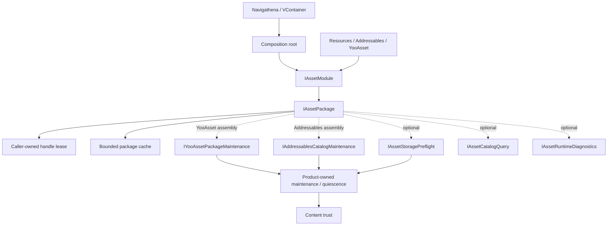

# CycloneGames.AssetManagement

[English | 简体中文](README.SCH.md)

CycloneGames.AssetManagement is a provider-neutral Unity asset runtime for explicit package composition, caller-owned handles, bounded in-memory caching, product-owned maintenance primitives, content verification, diagnostics, and optional provider integrations. Predictable ownership and failure behavior under long sessions and sustained load — without binding application code to one asset SDK or one DI container.

## Table of Contents

- [Overview](#overview)
- [Architecture](#architecture)
- [Quick Start](#quick-start)
- [Core Concepts](#core-concepts)
- [Usage Guide](#usage-guide)
- [Advanced Topics](#advanced-topics)
- [Common Scenarios](#common-scenarios)
- [Performance and Memory](#performance-and-memory)
- [Troubleshooting](#troubleshooting)

## Overview

The module owns module and package lifecycle, asset/sub-asset/raw-file/instance/scene handles, caller lease ownership and deterministic release, package-local active and idle memory caching, logical bucket/tag/owner metadata for retention and diagnostics, narrow provider maintenance and downloader primitives, storage-capacity preflight, bounded versioned content-trust manifests and verification, bounded runtime telemetry, and optional Addressables, YooAsset, Navigathena, and VContainer bridges.

Provider adapters normalize the common contract while exposing optional capabilities only when they are available. Asset import rules, bundle layout, Addressables groups, YooAsset collection rules, CDN topology, authentication, entitlement, DRM, save games, platform certification, and release operations remain product responsibilities. Provider SDKs remain the authority for their download files and disk-cache formats.

### Key Features

- **Provider-neutral core**: `IAssetModule` and `IAssetPackage` with caller-owned, exactly-once disposable handles.
- **Bounded SLRU cache**: package-local active, probation, protected, and generation-detached states with count and estimated-byte budgets.
- **Optional providers**: Resources, Addressables (`[2.11.1,2.11.2)`), YooAsset (`[3.0.4,3.0.5)`), with capability negotiation through interface casts.
- **Maintenance primitives**: `IYooAssetPackageMaintenance` and `IAddressablesCatalogMaintenance` for manifest/catalog activation, cache cleanup, and All/Tags/Locations downloaders.
- **Content trust**: schema-2 `ContentTrustManifest` with SHA-256 verification and `RequireSignature` or `IntegrityOnly` policies.
- **Storage preflight**: `IAssetStoragePreflight` with `Available`/`Insufficient`/`Unknown`/`Failed` results for reliable desktop volumes.
- **Bounded diagnostics**: `HandleTracker`, `SceneTracker`, `AssetRuntimeTelemetryRecorder`, and Editor windows with capacity bounds and drop counters.

Focused guides continue from this README:

- [Providers and integrations](Documents~/Providers.md): provider selection, runtime-location rules, Resources, Addressables, YooAsset, VContainer, Navigathena, and custom provider boundaries.
- [Memory, ownership, and lifetime](Documents~/MemoryAndLifetime.md): handle/instance/scene ownership, cancellation and thread rules, SLRU, budgets, retention, low-memory behavior.
- [Content operations](Documents~/ContentOperations.md): downloader ownership, storage and disk gates, release mutation, content trust, telemetry, persistence, recovery.

## Architecture



The dependency direction is explicit: application composition selects a provider module and passes `IAssetPackage` to consumers. Core consumers do not discover a package from process-global state. Optional integrations depend on the runtime contract; the runtime does not depend on those integrations.

### Assembly layout

| Assembly | `autoReferenced` | Activation |
| --- | ---: | --- |
| `CycloneGames.AssetManagement.Runtime` | yes | Always |
| `CycloneGames.AssetManagement.Runtime.CacheRetention` | yes | Always |
| `CycloneGames.AssetManagement.Editor` | yes | Unity Editor only |
| `CycloneGames.AssetManagement.Tests.Editor` | no | Unity Test Runner |
| `CycloneGames.AssetManagement.Runtime.Providers.Addressables` | no | `com.unity.addressables` `[2.11.1,2.11.2)` plus an explicit consumer reference |
| `CycloneGames.AssetManagement.Providers.Addressables.Tests.Editor` | no | Addressables 2.11.1 plus Unity Test Runner |
| `CycloneGames.AssetManagement.Runtime.Providers.YooAsset` | no | `com.tuyoogame.yooasset` `[3.0.4,3.0.5)` plus an explicit consumer reference |
| `CycloneGames.AssetManagement.Providers.YooAsset.Tests.Editor` | no | YooAsset 3.0.4 plus Unity Test Runner |
| `CycloneGames.AssetManagement.Runtime.Integrations.Navigathena` | no | `com.mackysoft.navigathena` `[1.1.0,1.1.1)` plus an explicit consumer reference |
| `CycloneGames.AssetManagement.Runtime.Integrations.VContainer` | no | `jp.hadashikick.vcontainer` plus an explicit consumer reference |

The core runtime directly depends on UniTask, CycloneGames.Logger, CycloneGames.IO Core/SystemIO, and CycloneGames.Hash Core. Installing an optional package is not sufficient: its `versionDefines` range must match and the consumer asmdef must reference the conditional assembly. Never add the generated `CYCLONEGAMES_HAS_*` symbols manually in Player Settings.

## Quick Start

Use the built-in Resources provider to learn the ownership model before selecting a remote provider. The location below is relative to a Unity `Resources` folder.

```csharp
var module = new ResourcesModule();
IAssetPackage package = await AssetManager.InitializeDefaultPackageAsync(
    module,
    "BaseContent",
    moduleOptions: default,
    packageOptions: default,
    cancellationToken);

using (IAssetHandle<Texture2D> icon =
       package.LoadAssetAsync<Texture2D>("UI/Icons/Inventory", cancellationToken: cancellationToken))
{
    await icon.Task;
    UseTextureWhileHandleIsAlive(icon.Asset);
}

await module.DestroyAsync();
```

The four rules to retain:

1. The composition root owns the module and package.
2. The caller owns every returned handle.
3. Await `handle.Task` before reading the value.
4. Dispose handles before shutting down the module.

Remote providers use the same consumer-facing ownership model.

## Core Concepts

### Ownership hierarchy

```text
Application lifetime
  -> IAssetModule
       -> one or more IAssetPackage instances
            -> shared provider handles held by the package cache
                 -> one caller-owned lease per load call
```

The application owner constructs and shuts down the module. The module owns named packages. A package owns shared provider handles and its bounded idle cache. Every load call returns a new, non-pooled caller lease. Instances, scenes, and downloaders have ownership independent from an asset lease. Package shutdown contains leaks, but it is not permission to omit caller cleanup. All ownership-changing calls are Unity-main-thread-affine.

### Handle, cancellation, and thread model

Asset, all-assets, and raw-file load calls return non-pooled caller leases. A lease pins a shared provider handle until the lease is disposed. Lease disposal is idempotent. Access after disposal throws `ObjectDisposedException`. `IOperation.Task` is memoized and safe for repeated or concurrent awaiters; `Error` is diagnostic text that never replaces awaiting `Task`.

`WaitForAsyncComplete` is not a portable replacement for async flow. Addressables rejects it for every pending operation. Await `Task`. Synchronous single-asset access remains an optional `IAssetSyncOperations` capability; scenes deliberately expose only the asynchronous lifecycle.

Caller cancellation cancels that caller's wait, not a shared backend load that may be used by other callers. The caller must still dispose its lease. This separates request cancellation from shared-resource ownership.

Unity objects, provider APIs, cache mutation, handle disposal, scene operations, module/package lifecycle, and maintenance orchestration are main-thread-affine. Permitted worker-thread work is narrow: completed `IRawFileHandle.ReadText` and `ReadBytes` reads, telemetry ring-buffer operations, and product-scheduled pure file hashing on supported platforms. Never call Unity object properties, provider handles, `Dispose`, or cache mutation from a background task.

### Capability negotiation

Test a capability explicitly; do not cast without a failure path.

```csharp
if (package is not IYooAssetPackageMaintenance maintenance)
{
    return; // This composition assembly has no YooAsset maintenance capability.
}

bool activated = await maintenance.UpdatePackageManifestAsync(
    authenticatedPackageVersion,
    cancellationToken: cancellationToken);
```

| Capability | Resources | Addressables | YooAsset |
| --- | ---: | ---: | ---: |
| Async single-asset load and instance handle | yes | yes | yes |
| `IAssetSyncOperations` | yes | no | yes |
| `IAssetBulkLoader` | no | yes | yes |
| `IAssetRawFileLoader` | no | no | yes |
| `IAssetSceneLoader` | no | yes | yes |
| `IAssetCatalogQuery` | no | yes | yes |
| `IAssetStoragePreflight` | no | desktop volume only | desktop Host mode only |
| Provider maintenance/downloader | no | `IAddressablesCatalogMaintenance` | `IYooAssetPackageMaintenance` |
| `IAssetRuntimeDiagnostics` | yes | yes | yes |

Addressables and YooAsset cannot be active through these adapters at the same time. The module-level AssetBundle runtime guard establishes one framework-controlled provider authority until coexistence, shutdown ordering, and memory behavior are qualified as a complete product configuration.

## Usage Guide

### Application-owned composition

```csharp
public sealed class GameAssetLifetime
{
    private IAssetModule _module;
    private IAssetPackage _package;

    public async UniTask InitializeAsync(CancellationToken cancellationToken)
    {
        _module = new ResourcesModule();
        _package = await AssetManager.InitializeDefaultPackageAsync(
            _module,
            "BaseContent",
            new AssetManagementOptions(defaultCacheTuning: default),
            new AssetPackageInitOptions(providerOptions: null, cacheTuningOverride: null),
            cancellationToken);
    }

    public async UniTask<IAssetHandle<Texture2D>> LoadIconAsync(CancellationToken cancellationToken)
    {
        IAssetHandle<Texture2D> handle = _package.LoadAssetAsync<Texture2D>(
            "UI/Icons/Inventory",
            bucket: "UI.Inventory",
            tag: "UI",
            owner: "InventoryScreen",
            cancellationToken);
        try
        {
            await handle.Task;
            return handle;
        }
        catch
        {
            handle.Dispose();
            throw;
        }
    }

    public async UniTask ShutdownAsync()
    {
        if (_module != null) await _module.DestroyAsync();
    }
}
```

The caller receiving `LoadIconAsync` owns the returned handle and keeps it alive for as long as the texture is used. Dispose it on the main thread in the caller's `finally`, `OnDisable`, or `OnDestroy` path.

### Instantiate a prefab

`InstantiateAsync` accepts only a successfully completed, active `IAssetHandle<GameObject>` lease owned by the same package. The prefab lease and returned instance handle have independent lifetimes: retain the prefab lease while requesting the instance, then dispose both owners on every path.

```csharp
IAssetHandle<GameObject> prefab = package.LoadAssetAsync<GameObject>(
    "Characters/Npc",
    bucket: "Gameplay.Level01",
    owner: "NpcSpawner",
    cancellationToken: cancellationToken);

try
{
    await prefab.Task;
    IInstantiateHandle instance = package.InstantiateAsync(
        prefab, parent: spawnRoot, worldPositionStays: false, setActive: true);
    try
    {
        await instance.Task;
        UseInstance(instance.Instance);
    }
    finally
    {
        instance.Dispose();
    }
}
finally
{
    prefab.Dispose();
}
```

### Scene lifecycle

Negotiate `IAssetSceneLoader`; Resources has no scene capability. A scene handle wrapper does not unload the scene. The same loader that created it is the unload authority. Call `UnloadSceneAsync(sceneHandle, cancellationToken)`; disposing an `ISceneHandle` alone does not unload the scene.

The advanced overload accepts Unity `LoadSceneParameters`, so Addressables and YooAsset can request `None`, `Physics2D`, `Physics3D`, or the valid `Physics2D | Physics3D` combination. The loaded scene owns those local physics worlds and destroys them during unload. For a manual scene, call and await `ActivateAsync` directly; do not await `Task` first as a readiness barrier because YooAsset keeps its provider operation pending until activation is allowed.

Manual activation is a transition gate, not rollback-safe staging. Unity must release the activation barrier before a held scene can finish unloading, so startup callbacks may run briefly even when a transition is cancelled. Gate authoritative side effects behind the product's transition-commit decision. Any scene held at Unity's manual activation barrier stalls subsequently queued asynchronous scene operations; resolve every manual scene in creation order before starting a new unload operation.

### Buckets, tags, and owners

- `bucket` defines a logical lifetime domain and supports hierarchical eviction such as `UI`, `UI.Inventory`, `UI.Inventory.Tooltip`.
- `tag` classifies runtime cache usage for policy and diagnostics; it is not a provider catalog label.
- `owner` identifies the product system or screen holding the asset.

```csharp
AssetBucketScope ui = package.CreateBucketScope(
    "UI", tag: "UI", owner: "UIScreenHost");
AssetBucketScope inventory = ui.CreateChild("Inventory");

using IAssetHandle<Sprite> icon = inventory.LoadAssetAsync<Sprite>(
    "UI/Icons/Inventory", cancellationToken: cancellationToken);
await icon.Task;

inventory.Clear();       // exact bucket, idle entries only
ui.ClearHierarchy();     // UI and child buckets, idle entries only
```

Active leases are never invalidated by a bucket clear. A key can accumulate up to eight distinct values per metadata kind; overflowing a metadata kind makes the entry bypass idle retention after its final active lease.

### Asset and scene references

`AssetRef<T>`, `AssetRef`, and `SceneRef` are serializable data keys containing an explicit provider runtime location and an Editor GUID. They do not own a loaded asset and do not trigger loading. The property drawers use the GUID only to preserve and display the Unity authoring reference; the second row edits `Runtime Location` explicitly. The validator reports missing GUID targets and empty runtime locations but never rewrites provider addresses.

`IAssetPathBuilder` and `IAssetPathBuilderFactory` are narrow consumer-owned string-location hooks used by integrations such as UIFramework. Build stable canonical locations during composition or other cold paths; avoid per-frame string construction.

## Advanced Topics

### Memory cache and SLRU

Each package uses a bounded segmented LRU cache keyed by `(location, asset type, operation kind)`:

- **Active** contains handles with one or more caller references; pinned and never evicted.
- **Probation** contains first-use idle handles; capacity and byte pressure evict its LRU tail first.
- **Protected** contains handles reused after idle; overflow demotes its LRU tail to Probation.
- **Detached** is an active handle whose catalog or manifest generation is no longer current. Existing caller leases remain valid; a later load resolves the current generation.

Lookup is a dictionary operation with average O(1) cost. A catalog or manifest generation change removes every active handle from keyed SLRU lookup without invalidating its current caller leases. Such a handle remains counted as Active, appears as `Detached` in the Asset Cache Debugger, and is disposed on final release or package shutdown. Only successfully completed backend operations can enter idle retention.

### Count and byte budgets

`AssetCacheTuning` controls `ProbationEntryLimit`, `ProtectedEntryLimit`, `IdleByteBudget`, and `ClearIdleOnLowMemory`. Explicit limits allow 1-131,072 entries per idle segment and require at least 1 MiB for `IdleByteBudget`. These are input safety bounds, not recommended capacities.

Memory estimation runs on every Active-to-idle transition. It uses `Profiler.GetRuntimeMemorySizeLong` and allocation-free fallbacks for `Texture2D`, `Cubemap`, other `Texture`, `Mesh`, and `AudioClip`. If no positive footprint can be established, the handle bypasses idle retention. A candidate larger than the complete idle byte budget is rejected before admission. The estimate still omits transitive AssetBundle memory, duplicated native memory, GPU residency, streaming mip state, provider metadata, allocator overhead, and driver allocation. Use Memory Profiler and platform tooling to set product budgets.

The module-level default is configured through `AssetManagementOptions.DefaultCacheTuning`. A package can override it through `AssetPackageInitOptions.CacheTuningOverride`. `SetCacheIdleMemoryBudget` supports a temporary runtime override and immediately trims idle entries.

### Retention

`TrimIdleCache` applies composable preserve and eviction rules to idle entries by age, byte estimate, tier, kind, asset type, bucket, tag, owner, or custom predicate. `ClearBucket` and `ClearBucketsByPrefix` provide deterministic lifetime-domain cleanup.

The core cache has no timer. `AssetCacheRetentionScheduler` is an opt-in UniTask scheduler; `AssetCacheRetentionBehaviour` is a scene bridge that must receive an explicit `Bind(package)` call. Prebuild recurring policies and predicates, and keep periodic linear scans infrequent and outside frame-critical work.

### Content trust

`ContentTrustManifest` is immutable after construction. It validates, defensively copies, rejects duplicate locations, normalizes portable relative paths, rejects traversal/rooted paths, and sorts entries canonically. The JSON wire contract is schema version 2; `ContentTrustManifestCodec` accepts exactly schema 2 and provides no migration.

`ContentTrustVerifier` accepts only SHA-256 entries under both built-in policies. The default `ContentTrustPolicy.RequireSignature` verifies the signature before file verification and fails closed when missing or rejected. `IntegrityOnly` must be selected explicitly; it detects byte changes relative to the supplied manifest but does not authenticate its publisher. Signature algorithms and key custody are application/infrastructure responsibilities behind `IContentTrustSignatureVerifier`. Keep private keys outside the client.

The canonical signed payload binds schema version, manifest version, content root, and entries. It does not bind product, package, channel, or platform. A signature authenticates only those canonical bytes; it does not provide cross-release-domain authorization, replay prevention, or anti-rollback. Products must persist and enforce their own trusted-version policy.

### Product-owned maintenance workflow

The module exposes provider operations, `IDownloader`, storage preflight, and content-trust verification as separate primitives. Product code composes the complete release workflow. Addressables and YooAsset do not guarantee isolated pre-activation download or atomic manifest/catalog activation.

Required sequence:

1. Enter maintenance mode, stop dependent loads, and quarantine affected content.
2. Resolve authenticated product release metadata and compute a conservative `RequiredFreeBytes`.
3. Run the first storage gate before provider manifest/catalog mutation.
4. Mutate provider state through the owning adapter boundary and durably record that the provider may have changed.
5. Create the scoped downloader, await `PrepareAsync`, and run the second storage gate using authoritative `TotalDownloadBytes`.
6. Call `StartAsync`; verify a product-owned staging tree against a trusted `ContentTrustManifest` when available.
7. Re-enable dependent content only after verification and product commit policy succeed. Dispose the downloader on every path.

`PrepareAsync` never starts payload writes. A failure after provider mutation must keep content quarantined until the product's recovery policy reaches a known state. All Addressables catalog mutation must pass through its owning package adapter; direct `Addressables.UpdateCatalogs` calls create unsupported split authority.

### Runtime telemetry

`IAssetRuntimeDiagnostics.GetRuntimeCacheSnapshot` returns active/idle occupancy, byte budget, and lifetime hit/miss, admission/rejection, eviction-reason, estimated-byte, release-failure, and peak counters without exposing provider handles or asset locations. `AssetRuntimeTelemetryRecorder` stores a fixed-capacity ring buffer; `AssetRuntimeTelemetryFileSink` exports a caller-supplied window as JSON Lines using atomic file replacement. Every record carries `"schemaVersion":1`. No asset location, account token, or content payload is included; package/provider names may still be operationally sensitive.

## Common Scenarios

### Bootstrap a Resources package

```csharp
_module = new ResourcesModule();
_package = await AssetManager.InitializeDefaultPackageAsync(
    _module, "BaseContent", new AssetManagementOptions(), new AssetPackageInitOptions(),
    cancellationToken);
```

Resources locations are relative to a `Resources/` folder and omit both the prefix and the file extension. `Assets/Game/Resources/UI/Icons/Inventory.png` loads as `UI/Icons/Inventory`. Releasing a wrapper does not guarantee immediate native reclamation; `UnloadUnusedAssetsAsync` clears idle wrappers and invokes Unity's hitch-prone global unused-resource pass.

### Load an icon with bounded ownership

```csharp
IAssetHandle<Sprite> handle = _package.LoadAssetAsync<Sprite>(
    "UI/Icons/Inventory",
    bucket: "UI.Inventory",
    tag: "UI",
    owner: nameof(InventoryIconPresenter),
    cancellationToken);
try
{
    await handle.Task;
    target.sprite = handle.Asset;
    _iconHandle = handle;
}
catch
{
    handle.Dispose();
    throw;
}
```

Caller cancellation cancels this lease's wait view, not a backend load shared by other callers. The lease must still be disposed after success, provider failure, or cancellation.

### YooAsset manifest activation

```csharp
if (package is not IYooAssetPackageMaintenance maintenance)
{
    throw new NotSupportedException("YooAsset maintenance is unavailable.");
}

bool manifestUpdated = await maintenance.UpdatePackageManifestAsync(
    authenticatedPackageVersion, cancellationToken: cancellationToken);
if (!manifestUpdated)
{
    throw new InvalidOperationException("YooAsset manifest activation failed.");
}
```

The package version must come from a product-owned authenticated client with a hard response-size limit and anti-rollback policy. A successful manifest activation advances the wrapper cache generation: idle entries are disposed, active mappings are detached while existing leases stay valid, and later loads resolve against the activated manifest.

### Addressables catalog update and cleanup

```csharp
if (package is not IAddressablesCatalogMaintenance maintenance)
{
    throw new NotSupportedException("Addressables maintenance is unavailable.");
}

bool updated = await maintenance.UpdateLatestCatalogsAsync(cancellationToken);
bool cleaned = await maintenance.CleanUnusedBundleCacheAsync(cancellationToken);
```

`CleanUnusedBundleCacheAsync` removes cached Bundles no longer referenced by loaded catalogs. `ClearAllCacheFilesAsync` clears Unity's process-wide AssetBundle cache and can affect content outside one logical package. Do not call `Addressables.UpdateCatalogs` outside the owning adapter.

### Verify a staged release

```csharp
ContentTrustManifest manifest = ContentTrustManifestCodec.FromJson(manifestJson);
var failures = new List<ContentTrustVerificationResult>();

int failureCount = await ContentTrustVerifier.Shared
    .VerifyManifestFilesAsync(
        stagingRoot, manifest, failures, signatureVerifier, cancellationToken);

if (failureCount != 0)
{
    throw new InvalidDataException($"Content verification failed: {failures[0].Failure}");
}
```

`VerifyManifestFilesAsync` checks the manifest policy and signature before reading payload files. `VerifyBytes` and `VerifyFile` validate one entry's size/hash only and cannot authenticate a publisher without a manifest.

## Performance and Memory

### Conservative Player defaults

The following cache values are heuristics selected by compile-time platform and reported system memory. These are starting points, not universal optimums.

| Player group | Probation | Protected | Idle estimated bytes |
| --- | ---: | ---: | ---: |
| WebGL | 16 | 96 | 64 MiB |
| Android/iOS below 3 GiB | 16 | 128 | 64 MiB |
| Android/iOS 3-6 GiB | 32 | 256 | 128 MiB |
| Android/iOS 6 GiB or more | 48 | 384 | 256 MiB |
| Dedicated Server below 8 GiB | 16 | 128 | 96 MiB |
| Dedicated Server 8 GiB or more | 32 | 256 | 256 MiB |
| Desktop/other below 8 GiB | 32 | 256 | 192 MiB |
| Desktop/other 8-16 GiB | 64 | 512 | 512 MiB |
| Desktop/other 16 GiB or more | 96 | 768 | 768 MiB |

For a headless server, reduce or disable presentation content. For consoles, replace generic fallback values with platform-holder budgets measured through the approved SDK.

### Performance engineering

The runtime keeps hot internal cache lookup compact: value cache keys avoid composite-string caches, dictionary lookup is average O(1), linked-list recency updates are constant time, and scratch collections are reused for cache trimming. Public caller leases intentionally allocate one small, non-pooled object per load call to prevent ABA and stale-reference reuse.

`AssetCachePerformanceTests` contains two measurement harnesses: active cache hit/retain/release (5 warmups, 20 measurements, 50,000 iterations, with GC measurement) and full idle trim of 10,000 entries. They establish invariants, not a universal pass threshold. Establish product budgets for representative hardware and content traces, store baselines in CI, and fail on statistically meaningful regressions. At minimum measure main-thread median/p95/p99 time, allocation bytes per public load path, provider load/download concurrency, cache hit rate, total native/GPU memory, and 8-24 hour soak behavior on Mono and IL2CPP Players.

### Diagnostics and Editor tooling

| Menu or tool | Purpose |
| --- | --- |
| `Tools/CycloneGames/AssetManagement/Validate All AssetRefs` | Stream-scan serialized references and report missing GUID targets or empty runtime locations without writing assets |
| `Tools/CycloneGames/AssetManagement/Asset Cache Debugger` | Inspect keyed Active, `Detached`, Probation, Protected, bucket, and provider summaries |
| `Tools/CycloneGames/AssetManagement/Asset Handle Tracker` | Inspect caller/provider handle lifetime, ownership metadata, registry capacity, and dropped registrations |
| `Tools/CycloneGames/AssetManagement/Scene Tracker` | Inspect scene load, activation, unload state, registry capacity, and dropped registrations |
| `Tools/CycloneGames/AssetManagement/Runtime Governance` | Aggregate cache, handle, scene, and long-lived ownership signals |

Handle tracking is disabled by default and has runtime cost. The handle registry defaults to 16,384 entries (max 65,536); the scene registry defaults to 4,096 (max 16,384). At capacity, a tracker drops the new diagnostic registration, increments `DroppedRegistrationCount`, and marks the observation epoch incomplete. The Editor windows refresh only while visible and in Play Mode, at no more than 2 Hz; cache detail is capped at 4,096 rows per tier.

`HandleTracker.Enabled`, `HandleTracker.EnableStackTrace`, and `HandleTracker.ConfigureCapacity` are process-wide diagnostic settings. Configure them from one composition root or an Editor diagnostics tool; they are not `AssetManagementOptions` fields.

### Platform and hardware guidance

- **Desktop (Windows/Linux/macOS)**: free-space preflight is reliable only when the provider cache resolves to a normal filesystem volume. Verify `StorageLocation` and reported capacity belong to the exact target mount. Test case sensitivity on Linux and case-preserving behavior on Windows/macOS.
- **Android and iOS**: treat reported system memory as a coarse signal and tune by device tier using real peak native/GPU memory. App sandbox free space, OS purge behavior, quota, thermal throttling, and suspend/resume can invalidate preflight assumptions.
- **WebGL**: browser storage quota and eviction are browser/user controlled; storage preflight is normally `Unknown`. There is no general worker-thread assumption. Large single-file hashes need product-specific chunking when one entry cannot fit the frame budget.
- **Dedicated Server**: use loading-only content required by server simulation and avoid client presentation assets. Keep Unity object APIs on the Unity main thread even when the surrounding server has worker pools.
- **Consoles**: supply platform-specific profiles from measured platform-holder budgets. No console SDK, Player build, IL2CPP, or certification result is represented by the generic fallback.

## Troubleshooting

| Symptom | Likely cause | Resolution |
| --- | --- | --- |
| Package has no maintenance capability | Provider assembly not referenced | Check `package is IYooAssetPackageMaintenance` / `IAddressablesCatalogMaintenance`; Resources is loading-only |
| Storage capacity is `Unknown` | Platform cannot report reliable capacity | Stop unless an explicitly validated product policy supplies an equivalent decision |
| Download scope unsupported | Wrong downloader factory | YooAsset: All/Tags/Locations with explicit recursion; Addressables: Tags or recursive Locations only |
| Provider state may have changed after failure | Operation crossed the mutation boundary | Quarantine dependent content, preserve recovery evidence, require an explicit owner decision before retry |
| Storage insufficient after a successful check | Preflight is not a reservation | Recompute `RequiredFreeBytes` from measured peak amplification and retry |
| Signature verification fails before file hashing | Missing verifier, missing signature, or rejected signature | Verify canonical payload generation, key selection, signature encoding; do not switch to `IntegrityOnly` to bypass |
| Asset remains in memory after all callers dispose | Idle cache entry retained intentionally | Inspect Cache Debugger, call a targeted bucket clear or retention policy, compare with Memory Profiler evidence |
| Handle appears leaked | Lease not disposed on some path | Enable handle tracking, confirm every success/exception/cancellation path disposes the caller lease; cancelling `handle.Task` does not dispose it |
| YooAsset raw read returns empty value | Provider load not yet complete or failed | Await `IRawFileHandle.Task`; inspect `Error`; retain `ReadBytes()` result instead of calling repeatedly |
| Scene unload was cancelled | Cancellation accepted only before mutation starts | Join the non-cancellable provider completion; a failed unload remains retryable |
| Optional integration types unavailable | Dependency not installed or version mismatch | Confirm dependency in `manifest.json`/`packages-lock.json`, satisfies `versionDefines`, and is referenced by the composition asmdef |

## Validation

Minimum validation for a runtime change:

1. Build `CycloneGames.AssetManagement.Runtime` and `CycloneGames.AssetManagement.Runtime.CacheRetention` from Unity-generated projects.
2. Run all `CycloneGames.AssetManagement.Tests.Editor` EditMode tests and both `AssetCachePerformanceTests` harnesses.
3. In Play Mode, exercise package initialize/load/cancel/dispose, repeated awaits of memoized tasks, provider-fault propagation, cross-package rejection, manual activation/unload, low-memory idle clearing, downloader prepare/start faults and cancellation, shutdown cleanup of leaked operations, and shutdown retry.
4. For each optional provider, install the exact locked dependency, compile the provider assembly, run provider-specific tests, and exercise a clean Player cache. Verify `PrepareAsync` performs no payload writes, totals become authoritative only after preparation, and disposal is idempotent.
5. Run clean-clone CI and target Player builds for every claimed Windows, Linux, macOS, iOS, Android, WebGL, Dedicated Server, and approved console configuration. Repeat critical scenarios under Mono and IL2CPP, low storage, disk full, denied permissions, network loss, suspend/resume, and domain reload disabled.

An Editor or CLI assembly result does not establish Player, IL2CPP, long-session, storage-device, or cross-platform correctness. Record every unexecuted validation dimension explicitly in the release validation record.

```text
<UnityEditor> -batchmode -nographics -projectPath <repo-root>/UnityStarter \
  -runTests -testPlatform EditMode \
  -testFilter CycloneGames.AssetManagement \
  -testResults <result-path> -quit
```
