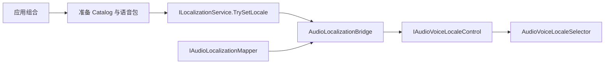

# CycloneGames.Audio.Localization

[English](README.md) | 简体中文

CycloneGames.Audio.Localization 是 [CycloneGames.Localization](../CycloneGames.Localization/README.SCH.md) 与 [CycloneGames.Audio](../CycloneGames.Audio/README.SCH.md) 稳定语音 Locale 能力之间的可选组合桥。它将已提交的 Localization Locale 镜像到 `IAudioVoiceLocaleControl`，不会让 Audio 依赖 Localization。

## 目录

- [概述](#概述)
- [程序集与安装](#程序集与安装)
- [所有权边界](#所有权边界)
- [快速上手](#快速上手)
- [Locale 映射](#locale-映射)
- [Bind 与 Dispose 生命周期](#bind-与-dispose-生命周期)
- [先 Prepare，再 Commit](#先-prepare再-commit)
- [持久化](#持久化)
- [责任边界](#责任边界)
- [验证](#验证)
- [故障排查](#故障排查)
- [移除](#移除)

## 概述

当产品明确要求语音 Locale 跟随 `ILocalizationService.CurrentLocale` 时使用此桥。`AudioLocalizationBridge.Bind()` 执行初始同步，随后观察已提交的 Locale 变更。Mapper 把 Localization `LocaleId` 转换成 Audio `AudioVoiceLocaleSnapshot`，其中包含显式语音回退顺序。

不要让 Bridge 成为独立语音语言设置的 Owner。允许文本和语音使用不同语言的产品，应把此策略保留在应用层；目标语音内容准备完成后，由应用直接设置 `IAudioVoiceLocaleControl`。

### 核心类型

| 类型 | 角色 |
| --- | --- |
| `AudioLocalizationBridge` | 绑定一个 Localization 服务和一个 Audio 语音 Locale Control，并拥有事件订阅 |
| `IAudioLocalizationMapper` | 把已提交 Localization Locale 转换成完整的 Audio Locale Snapshot |
| `IdentityAudioLocalizationMapper` | 不需要产品专属映射时，对文本与语音使用同一个稳定 code |
| `AudioLocalizationMap` | ScriptableObject 创作映射，显式配置文本 Locale 到语音 Locale 及回退 |



Prepare 箭头有意位于 Bridge 之外。Bridge 收到 Localization 变更时，该 Locale 已经提交。

## 程序集与安装

| 项目 | 值 |
| --- | --- |
| 包目录 | `UnityStarter/Assets/ThirdParty/CycloneGames/CycloneGames.Audio.Localization/` |
| Package ID | `com.cyclone-games.audio.localization` |
| Runtime assembly | `CycloneGames.Audio.Runtime.Integrations.Localization` |
| Editor assembly | `CycloneGames.Audio.Editor.Integrations.Localization` |
| Test assembly | `CycloneGames.Audio.Localization.Tests.Editor` |
| 必需项目模块 | `CycloneGames.AssetManagement`、`CycloneGames.Audio`、`CycloneGames.Localization`、`CycloneGames.Logging` 与 UniTask |
| Runtime 直接程序集引用 | `CycloneGames.AssetManagement.Runtime`、`CycloneGames.Audio.Runtime`、`CycloneGames.Localization.Core`、`CycloneGames.Localization.Runtime`、`CycloneGames.Logging`、`UniTask` |
| Editor 直接程序集引用 | `CycloneGames.Audio.Runtime.Integrations.Localization`、`CycloneGames.Logging` |

这是物理独立的本地 integration 包。Audio Runtime 不引用 integration 或 Localization，Localization 也不引用 Audio。依赖方向是 integration 同时指向两个核心模块，因此不会形成循环。

Runtime 与 Editor 诊断分别集中通过各程序集 `Diagnostics/` 目录中的 internal `AudioLocalizationRuntimeLog` 和 `AudioLocalizationEditorLog` facade 接入。两个 facade 都采用统一的 `Category`、ambient `Channel` 与 `Create(ILogWriter)` 结构，并保留 category `CycloneGames.Audio.Localization` 和 `CycloneGames.Audio.Localization.Editor`。静态入口与 Unity-owned 入口使用 facade 的 `Channel`；需要显式隔离的 service 使用 `Create(logWriter)`。两个 facade 都不会初始化或拥有 backend。

安装 integration 目录且其直接程序集引用均存在时，Unity 会编译 integration assembly。运行时同步**不会**自动启用：默认状态是未绑定，直到应用构造 `AudioLocalizationBridge` 并调用 `Bind()`。

这些模块位于 `Assets/` 下，其 `package.json` 不会让 Unity 自动按本地依赖做条件包含。必须一起安装全部必需模块。如果不需要 integration，或任一必需模块不存在，应移除此 integration 包，而不是在任一核心 Runtime assembly 中加入 PlayerSettings scripting symbol 或条件代码。

## 所有权边界

| 关注点 | Owner |
| --- | --- |
| 稳定语音 Locale 状态、有序语音回退、Selector 执行、播放 | CycloneGames.Audio |
| 可用 Locale、回退配置、文本/资产表、已提交 Locale | CycloneGames.Localization |
| 映射并转发已提交 Locale | 本 integration |
| 独立文本/语音偏好与已保存设置 | 应用组合层 |
| Catalog、Bank、Clip 和语音包加载或 Lease | 应用内容层 |
| 活动对话播放完、淡出或停止策略 | 应用 Dialogue/Audio Policy |
| 文本渲染、字幕、字体、字形回落、塑形、RTL/BiDi、自适应 UI 布局 | Localization Consumer 与 UI/Dialogue 系统 |
| CDN、鉴权、补丁、下载、重试、存储预算、资源事务 | 内容交付基础设施 |

Bridge 拥有自身订阅和同步状态。注入的服务、Mapper 资产、AudioBank Handle、Clip Handle 和驻留 Lease 属于各自 Provider。

## 快速上手

两个服务就绪后，在应用 Composition Root 中创建 Bridge；在这些服务销毁前释放 Bridge：

```csharp
using System;
using CycloneGames.Audio.Runtime;
using CycloneGames.Audio.Runtime.Integrations.Localization;
using CycloneGames.Localization.Runtime;

public sealed class GameLocalizationScope : IDisposable
{
    private readonly AudioLocalizationBridge audioBridge;

    public GameLocalizationScope(ILocalizationService localization)
    {
        audioBridge = new AudioLocalizationBridge(
            localization,
            AudioManager.VoiceLocaleControl);
        audioBridge.Bind();
    }

    public void Dispose()
    {
        audioBridge.Dispose();
    }
}
```

Bridge 的所有访问（包括状态读取、绑定、Locale 变更和释放）都必须在 Unity 主线程执行。只有在 Localization 服务拥有有效的已提交当前 Locale，且 Audio Runtime 已准备好接收语音 Locale 状态后才调用 `Bind()`。

## Locale 映射

### Identity 映射

默认 Identity Mapper 将已提交 Localization Locale code 原样作为 Audio 主语音 Locale。只有当文本和语音共用同一 Locale 清单，且产品不需要不同语音回退链时才使用它。

例如，Localization `ja-JP` 映射成 Audio 主 Locale `ja-JP`。Audio 执行精确 Voice Locale 选择，因此 Identity 映射不会自行添加 `ja` 或 `en` 回退。

### 显式 AudioLocalizationMap

文本与语音可用性不同时，通过 **Create > CycloneGames > Audio > Localization Map** 创建 `AudioLocalizationMap`。每个 Entry 把一个 Localization Locale 显式映射到一个主语音 Locale 及其有序回退。典型场景包括：

- 文本 `fr-CA` 使用主语音 `fr-FR`，然后回退到 `fr`、`en`；
- 多个文本 Locale 共用一个已录制语音 Locale；
- 某区域拥有文本内容但没有专属语音包；
- 产品批准的最终语音回退与 Localization 文本回退不同。

把 Map 作为 Bridge 的 `IAudioLocalizationMapper` 传入。一个 Map 最多支持 256 个精确 Source Entry。每个 Source Locale 必须唯一，Locale code 必须有效且规范化，Voice Fallback 必须互不重复且不能重复 Primary，完整 Audio Snapshot 必须处于 Audio 的八项上限内（一个 Primary，最多七个 Fallback）。`TryValidate(out string error)` 把整个资产作为一个单元校验；任一无效 Entry 都会拒绝完整编译 Map，避免运行时行为依赖序列化顺序。

在自定义 Inspector 中使用 **Validate Localization Map**，或通过 **Tools > CycloneGames > Audio > Validate All Localization Maps** 执行项目级检查。Build Preprocessor 会运行同一扫描，并在存在无效 Map 时阻止构建。缺失或无效映射会被拒绝。Bridge 保持最后一个已知良好的 Audio Locale 不变，并通过已提供的 Sink 报告 `AudioLocalizationDiagnostic`；未提供 Sink 时写入 `CycloneGames.Audio.Localization` `LogChannel`。未安装进程 backend 时，`NullLogWriter` 会安全丢弃该诊断。诊断可区分无效 Localization 状态、映射不可用、Mapper 异常、Audio 拒绝/异常以及最后已知良好状态恢复失败。

映射是显式的。Bridge 不会从 `CultureInfo` 推导语音回退，不会推断父 Locale，不会检查 AudioBank 内容，也不会复制 Localization 内部 fallback chain。

### Voice Locale Selector

Bridge 面向 Audio 的稳定 Locale 能力。`AudioVoiceLocaleSelector` 按“精确 Primary、按顺序精确 Fallback、显式创作 Fallback 分支、no-play”执行。Integration 永远不会映射到 culture 数组索引，也不提供 Selector 迁移或兼容行为。

## Bind 与 Dispose 生命周期

生命周期是显式且有界的：

1. 构造函数校验并保存注入的 Localization 服务、Audio Control、Mapper 和可选 Diagnostic Sink，但不会隐式订阅。
2. `Bind()` 只订阅一次，并立即映射服务当前已提交 Locale。
3. 只有 `LocalizationChangeReason.LocaleChanged` 会触发新的 Locale 映射。内容刷新和伪本地化变更不会改变语音选择。
4. `LocalizationChangeReason.Shutdown` 会解除 Bridge 绑定，使其不再观察服务。
5. 映射缺失、Snapshot 无效或 Audio 拒绝时，保留最后一个已知良好的 Audio Locale。
6. `Unbind()` 移除订阅但不释放 Bridge，因此同一 Bridge 可以再次绑定。`Dispose()` 会解除绑定且可重复安全调用；已释放 Bridge 不能再次绑定。两者都不会释放注入的服务或 Mapper，也不会清除最后已提交的 Audio Locale。

`IsBound`、`LastProcessedLocalizationRevision` 和 `LastKnownGoodVoiceLocale` 可用于作用域诊断。它们是观察数据，不是持久化或事务状态。

避免为同一个 Audio Control 创建多个活动 Bridge。即使重复设置相同值不会增加 Audio Locale Revision，相互竞争的 Mapper 仍会造成所有权含混。

## 先 Prepare，再 Commit

Bridge 是同步状态传播，不是加载 Coordinator。它只会在 Localization 已提交 Locale 后看到 `LocaleChanged`。应用应按以下顺序执行：

1. 校验请求 Locale 存在映射。
2. 加载或安装目标 Localization Catalog。
3. 加载目标 Locale 的 AudioBank 资产，并获取所需 Clip 驻留 Lease。
4. 保持旧 Locale 的 Handle 和 Lease 有效。
5. 调用 `ILocalizationService.TrySetLocale`。
6. 让已绑定 Bridge 从已提交 Locale 更新 Audio。
7. 只有提交和同步成功后，才替换旧内容 Scope 并释放旧 Handle。

如果 Prepare、Locale Commit 或映射失败，只释放新准备的内容，并保持旧 Locale 和 Lease 有效。本 integration 不提供跨 Localization Catalog、AudioBank 注册、资产 Handle 和 Clip 驻留的原子回滚。

Audio Bank Lease 会收集该 Bank 引用的所有外部 Clip。大型语音目录应按 Locale 拆分 Bank 或 Pack；否则预加载多语言 Bank 可能同时驻留全部语言。旧、新内容的临时重叠必须计入平台内存预算。

Locale 变更影响后续 stable Selector 求值。应用决定已经播放或正在 Preparing 的对话是播放完、淡出、停止还是显式重启。

## 持久化

| 数据 | 存储与 Owner | 纳入版本控制 | 清理/迁移 |
| --- | --- | --- | --- |
| `AudioLocalizationMap` | 应用选择路径的 ScriptableObject 资产 | 是 | 显式编辑；移除包前删除、迁移，或为以后重装而归档 |
| Bridge 绑定与 last-known-good 运行时状态 | 仅内存，由组合 Scope 拥有 | 否 | `Dispose()` 或 Localization shutdown 解除绑定 |
| 玩家文本/语音偏好 | 显式应用设置/存档服务 | 由产品决定 | 带版本，根据已安装内容校验，通过 Save Service 迁移 |
| Catalog、AudioBank、Clip 和 Lease | 应用内容/资产层 | 由产品决定 | 遵循 Provider 的释放、缓存和迁移策略 |

Integration 不会写入 `PlayerPrefs`、`EditorPrefs`、`SessionState`、registry、plist 或隐藏文件。移除 integration 不会删除应用设置或内容资产。包缺失时，任何保留的 `AudioLocalizationMap` 资产都会显示 Missing Script；只有明确将其作为纳入版本控制的重装资料时才应保留。

## 责任边界

Bridge 将已提交的 Localization Locale 转发到 Audio 语音 Locale 状态。以下关注点由各自所属模块实现，由应用组合层协调：

- 文本表、格式化、复数规则或字符串查找；
- 字幕/Caption 文本、时序、说话人数据或 Lip-sync 元数据；
- 字体或字形回落、文本塑形、RTL/BiDi、镜像或自适应 UI 布局；
- Locale 发现、语言选择界面或独立语音偏好 UX；
- CDN、远程 Catalog 下载、鉴权、补丁、重试或存储配额；
- AudioBank/AudioClip 加载、按 Locale 资源包拆分、驻留 Lease 或驱逐；
- 跨 Localization 与 Audio 资源的原子 prepare/commit/rollback 事务；
- Locale 切换期间活动或进行中对话的处理策略。

## 验证

运行 integration 专用 EditMode 测试程序集：

```text
<UnityEditor> -batchmode -nographics -projectPath <repo-root>/UnityStarter \
  -runTests -testPlatform EditMode \
  -assemblyNames CycloneGames.Audio.Localization.Tests.Editor \
  -testResults <integration-result-path> -quit
```

它覆盖 Identity 与显式映射、有序 fallback、规范化校验、无效/重复 Map、初始绑定、已提交 Locale 变更、被忽略的 Content/Pseudo 变更、缺失映射、Shutdown、Dispose 和重入 Locale 变更。修改核心契约时，还应分别运行两个核心测试程序集：

```text
<UnityEditor> -batchmode -nographics -projectPath <repo-root>/UnityStarter \
  -runTests -testPlatform EditMode \
  -assemblyNames CycloneGames.Audio.Tests.Editor \
  -testResults <audio-result-path> -quit
```

```text
<UnityEditor> -batchmode -nographics -projectPath <repo-root>/UnityStarter \
  -runTests -testPlatform EditMode \
  -assemblyNames CycloneGames.Localization.Tests.Editor \
  -testResults <localization-result-path> -quit
```

自动化 EditMode 测试不能替代资源驻留、Reload、Player 或平台验证。以下剩余检查仍应分别记录为 `Passed`、`Failed` 或 `Not run` 证据。

补充验证矩阵：

1. 使用有效当前 Locale 绑定，确认立即完成初始同步。
2. 提交 Locale 变更，确认映射后的 Primary/Fallback 精确顺序。
3. 确认 Content 和 Pseudo Mode 变更不会修改 Audio Locale 状态。
4. 验证缺失/无效映射和 Audio 拒绝会保留 last-known-good Snapshot。
5. 重复调用 `Bind()` 与 `Dispose()`；确认只存在一个订阅，Dispose 或 Localization shutdown 后没有回调。
6. 测试 Identity 和显式 Map，包括重复项、规范化与八项 Locale 上限。
7. 重复 Prepare、Commit、切换和释放按 Locale 语音包；确认失败保留旧内容驻留，成功切换后内存不会持续增长。
8. 执行 clean Unity reload 和代表性目标 Player build。Mono/IL2CPP、stripping、codec 和平台资产加载检查必须作为独立证据。

## 故障排查

| 现象 | 可能原因 | 处理 |
| --- | --- | --- |
| 启动后 Audio Locale 未设置 | Bridge 未绑定，或 Localization 没有有效的已提交 Locale | 初始化两个服务，然后在主线程调用 `Bind()` |
| Audio 保持先前 Locale | 映射缺失/无效，或 Audio 拒绝 Snapshot | 检查 Map 与 Diagnostic Sink；保持旧内容有效 |
| Locale 已变化但没有语音 | Stable Selector 没有精确分支或显式 fallback | 添加已映射 Locale/fallback 分支，或有意接受 no-play |
| 区域文本 Locale 没有使用父语言语音 | Mapping 未包含父 Locale 回退 | 显式加入有序语音回退 |
| Catalog 刷新时语音也变化 | 应用中有其他 Owner 在修改语音状态 | Bridge 忽略仅内容变更；检查其他 Locale Owner |
| 独立语音选择被覆盖 | 产品拥有独立语音偏好时仍绑定了一对一 Bridge | 释放 Bridge，从语音设置驱动 `IAudioVoiceLocaleControl` |
| 切换后目标语音内容缺失 | 内容准备完成前已提交 Locale | 先准备 Catalog、Bank 和 Lease；提交成功前保留旧 Scope |
| Integration assembly 无法编译 | Audio 或 Localization assembly 不存在 | 安装两个必需模块，或移除此 integration 包 |
| Scope 关闭后仍收到回调 | 组合 Scope 未释放 Bridge | 在销毁注入服务前调用 `Dispose()` |

## 移除

移除过程有意保持可逆：

1. 释放所有活动 Bridge，并从应用 Composition Root 中移除其注册。
2. 确认应用会直接设置 Audio 语音 Locale，或明确接受 Audio Locale 未设置。
3. 查找全部 `AudioLocalizationMap` 资产。删除或迁移它们，或明确归档到版本控制以供以后重装；包缺失时这些资产无法加载。
4. 通过版本控制或项目包安装流程移除完整 `CycloneGames.Audio.Localization` 包。
5. 分别重新编译并运行 Audio 与 Localization 的聚焦测试。

移除后不再自动同步 Locale。CycloneGames.Audio 保留独立稳定语音 Locale API；CycloneGames.Localization 保留自己的 Locale 与内容状态。两个核心模块都不需要 scripting define 或源码修改即可继续运行。
