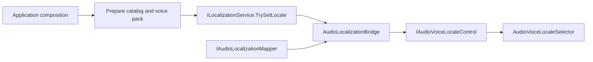

# CycloneGames.Audio.Localization

[English | 简体中文](README.SCH.md)

CycloneGames.Audio.Localization is an optional composition bridge between [CycloneGames.Localization](../CycloneGames.Localization/README.md) and the stable voice-locale capability in [CycloneGames.Audio](../CycloneGames.Audio/README.md). It mirrors a committed Localization locale into `IAudioVoiceLocaleControl` without making Audio depend on Localization.

## Table of Contents

- [Overview](#overview)
- [Assembly and Installation](#assembly-and-installation)
- [Ownership Boundaries](#ownership-boundaries)
- [Quick Start](#quick-start)
- [Locale Mapping](#locale-mapping)
- [Bind and Dispose Lifecycle](#bind-and-dispose-lifecycle)
- [Prepare Before Commit](#prepare-before-commit)
- [Persistence](#persistence)
- [Responsibility Boundaries](#responsibility-boundaries)
- [Validation](#validation)
- [Troubleshooting](#troubleshooting)
- [Removal](#removal)

## Overview

Use this bridge when the product deliberately wants its voice locale to follow `ILocalizationService.CurrentLocale`. `AudioLocalizationBridge.Bind()` performs an initial synchronization and then observes committed locale changes. The mapper converts a Localization `LocaleId` into an Audio `AudioVoiceLocaleSnapshot`, including any explicit voice fallback order.

Do not use the bridge as the owner of an independent voice-language setting. Products that allow different text and voice languages should store that policy in the application layer and set `IAudioVoiceLocaleControl` directly after the selected voice content is ready.

### Core types

| Type | Role |
| --- | --- |
| `AudioLocalizationBridge` | Binds one Localization service to one Audio voice-locale control and owns the event subscription |
| `IAudioLocalizationMapper` | Converts a committed Localization locale into a complete Audio locale snapshot |
| `IdentityAudioLocalizationMapper` | Uses the same stable code for text and voice when no product-specific mapping is needed |
| `AudioLocalizationMap` | ScriptableObject authoring map for explicit text-locale-to-voice-locale and fallback mappings |



The prepare arrow is intentionally outside the bridge. A Localization change is already committed by the time the bridge receives it.

## Assembly and Installation

| Item | Value |
| --- | --- |
| Package directory | `UnityStarter/Assets/ThirdParty/CycloneGames/CycloneGames.Audio.Localization/` |
| Package ID | `com.cyclone-games.audio.localization` |
| Runtime assembly | `CycloneGames.Audio.Runtime.Integrations.Localization` |
| Editor assembly | `CycloneGames.Audio.Editor.Integrations.Localization` |
| Test assembly | `CycloneGames.Audio.Localization.Tests.Editor` |
| Required project modules | `CycloneGames.AssetManagement`, `CycloneGames.Audio`, `CycloneGames.Localization`, and UniTask |
| Direct Runtime assembly references | `CycloneGames.AssetManagement.Runtime`, `CycloneGames.Audio.Runtime`, `CycloneGames.Localization.Core`, `CycloneGames.Localization.Runtime`, `UniTask` |
| Direct Editor assembly reference | `CycloneGames.Audio.Runtime.Integrations.Localization` |

This is a physically separate local integration package. Audio Runtime does not reference the integration or Localization, and Localization does not reference Audio. The dependency direction is integration to both core modules, so no cycle is introduced.

When the integration directory is installed and its direct assembly references are present, Unity compiles the integration assembly. Runtime synchronization is **not** automatically enabled: the default state is unbound until the application constructs an `AudioLocalizationBridge` and calls `Bind()`.

Because these modules live under `Assets/`, their `package.json` files do not make Unity conditionally include local dependencies. Install all required modules together. If the integration is not wanted or either required module is absent, remove this integration package rather than adding PlayerSettings scripting symbols or conditional code to either core Runtime assembly.

## Ownership Boundaries

| Concern | Owner |
| --- | --- |
| Stable voice-locale state, ordered voice fallbacks, selector execution, playback | CycloneGames.Audio |
| Available locales, fallback configuration, text/asset tables, committed locale | CycloneGames.Localization |
| Mapping and forwarding a committed locale | This integration |
| Independent text/voice preference and saved settings | Application composition |
| Catalog, bank, clip, and voice-pack loading or leases | Application content layer |
| Active dialogue finish/fade/stop policy | Application dialogue/audio policy |
| Text rendering, subtitles, fonts, glyph fallback, shaping, RTL/BiDi, adaptive UI layout | Localization consumers and UI/dialogue systems |
| CDN, authentication, patching, download, retry, storage budget, resource transaction | Content-delivery infrastructure |

The bridge owns its subscription and synchronization state. Injected services, mapper asset, AudioBank handles, clip handles, and residency leases belong to their providers.

## Quick Start

Create the bridge in the application's composition root after both services are ready, and dispose it before those services are torn down:

```csharp
using System;
using CycloneGames.Audio.Runtime;
using CycloneGames.Audio.Runtime.Integrations.Localization;
using CycloneGames.Localization.Runtime;

public sealed class GameLocalizationScope : IDisposable
{
    private readonly AudioLocalizationBridge audioBridge;

    public GameLocalizationScope(ILocalizationService localization)
    {
        audioBridge = new AudioLocalizationBridge(
            localization,
            AudioManager.VoiceLocaleControl);
        audioBridge.Bind();
    }

    public void Dispose()
    {
        audioBridge.Dispose();
    }
}
```

All bridge access, including state reads, binding, locale changes, and disposal, must occur on the Unity main thread. Bind only after the Localization service has a valid committed current locale and the Audio runtime is ready to accept voice-locale state.

## Locale Mapping

### Identity mapping

The default identity mapper preserves the committed Localization locale code as the primary Audio voice locale. Use it only when text and voice share the same locale inventory and the product does not need a different voice fallback chain.

For example, Localization `ja-JP` maps to Audio primary `ja-JP`. Audio performs exact voice-locale selection, so identity mapping does not invent `ja` or `en` fallbacks.

### Explicit AudioLocalizationMap

Create an `AudioLocalizationMap` through **Create > CycloneGames > Audio > Localization Map** when text and voice availability differ. Each entry explicitly maps one Localization locale to one primary voice locale and its ordered fallbacks. Typical cases include:

- text `fr-CA` using voice primary `fr-FR`, then `fr`, then `en`;
- several text locales sharing one recorded voice locale;
- a region with text content but no dedicated voice pack;
- a product-approved final fallback that differs from Localization's text fallback.

Pass the map as the bridge's `IAudioLocalizationMapper`. A map supports at most 256 exact source entries. Keep every source locale unique, use valid canonical locale codes, keep voice fallbacks unique and distinct from the primary, and keep the complete Audio snapshot within Audio's eight-entry bound (one primary and at most seven fallbacks). `TryValidate(out string error)` validates the complete asset as one unit; one invalid entry rejects the complete compiled map so behavior cannot depend on serialized order.

Use **Validate Localization Map** in the custom Inspector or **Tools > CycloneGames > Audio > Validate All Localization Maps** for a project-wide check. The build preprocessor runs the same scan and fails a build that contains an invalid map. Missing or invalid mappings are rejected. The bridge leaves the last known good Audio locale unchanged and reports an `AudioLocalizationDiagnostic` through the supplied sink, or through Unity logging when no sink is supplied. Diagnostics distinguish invalid Localization state, unavailable mapping, mapper exceptions, Audio rejection/exception, and a failed last-known-good restore.

Mapping is explicit. The bridge never derives voice fallback from `CultureInfo`, infers parent locales, inspects AudioBank contents, or copies Localization's fallback chain.

### Voice locale selector

The bridge targets Audio's stable locale capability. `AudioVoiceLocaleSelector` evaluates exact primary, ordered exact fallbacks, an explicitly authored fallback branch, then no-play. The integration never maps to culture-array indexes and does not provide selector migration or compatibility behavior.

## Bind and Dispose Lifecycle

The lifecycle is explicit and bounded:

1. Construction validates and stores the injected Localization service, Audio control, mapper, and optional diagnostic sink. It does not subscribe implicitly.
2. `Bind()` subscribes once and immediately maps the service's current committed locale.
3. Only `LocalizationChangeReason.LocaleChanged` triggers another locale mapping. Content refresh and pseudo-localization changes do not change voice selection.
4. `LocalizationChangeReason.Shutdown` unbinds the bridge so it no longer observes the service.
5. A missing mapping, invalid snapshot, or Audio rejection preserves the last known good Audio locale.
6. `Unbind()` removes the subscription without disposing the bridge, so the same bridge can be bound again. `Dispose()` unbinds and is safe to call repeatedly; a disposed bridge cannot be rebound. Neither operation disposes the injected services or mapper or clears the last committed Audio locale.

Use `IsBound`, `LastProcessedLocalizationRevision`, and `LastKnownGoodVoiceLocale` for scoped diagnostics. They are observations, not persistence or transaction state.

Avoid creating multiple live bridges for the same Audio control. Although repeated identical values do not advance Audio's locale revision, competing mappers make ownership ambiguous.

## Prepare Before Commit

The bridge is synchronous state propagation, not a loading coordinator. It sees `LocaleChanged` only after Localization commits the locale. Use this order in the application:

1. Validate that a mapping exists for the requested locale.
2. Load or install the target Localization catalog.
3. Load the target locale's AudioBank asset and acquire any required clip-residency lease.
4. Keep the previous locale's handles and leases alive.
5. Call `ILocalizationService.TrySetLocale`.
6. Let the bound bridge update Audio from the committed locale.
7. Only after successful commit and synchronization, replace the old content scope and release the previous handles.

If preparation, locale commit, or mapping fails, dispose only the newly prepared content and keep the previous locale and leases active. This integration provides no atomic rollback across Localization catalogs, AudioBank registration, asset handles, and clip residency.

An Audio bank lease collects all external clips referenced by that bank. For large voice catalogs, partition banks or packs by locale; otherwise preloading a multilingual bank can retain every language at once. Any temporary old-plus-new overlap must be included in the platform memory budget.

Locale changes affect subsequent stable selector evaluation. The application decides whether already-playing or preparing dialogue finishes, fades, stops, or is explicitly restarted.

## Persistence

| Data | Storage and owner | Version control | Cleanup/migration |
| --- | --- | --- | --- |
| `AudioLocalizationMap` | Application-chosen ScriptableObject asset path | Yes | Edit explicitly; before package removal, delete, migrate, or archive it for a later reinstall |
| Bridge binding and last-known-good runtime state | Memory only, owned by the composition scope | No | `Dispose()` or Localization shutdown unbinds it |
| Player's text/voice preferences | Explicit application settings/save service | Product decision | Version, validate against installed content, migrate through the save service |
| Catalogs, AudioBanks, clips, and leases | Application content/asset layer | Product decision | Follow provider-specific release, cache, and migration policy |

The integration never writes to `PlayerPrefs`, `EditorPrefs`, `SessionState`, registry, plist, or hidden files. Removing the integration does not delete application settings or content assets. Any retained `AudioLocalizationMap` asset has a missing script while its defining package is absent; keep it only as an intentional, version-controlled reinstall artifact.

## Responsibility Boundaries

The bridge forwards a committed Localization locale into Audio voice-locale state. Everything below is owned by the modules listed and coordinated in the application composition layer:

- text tables, formatting, plural rules, or string lookup;
- subtitle/caption text, timing, speaker data, or lip-sync metadata;
- font or glyph fallback, text shaping, RTL/BiDi, mirroring, or adaptive UI layout;
- locale discovery, a language-selection screen, or independent voice preference UX;
- CDN, remote catalog download, authentication, patching, retry, or storage quotas;
- AudioBank/AudioClip loading, per-locale package partitioning, residency leases, or eviction;
- an atomic prepare/commit/rollback transaction across Localization and Audio resources;
- policy for active or in-flight dialogue during a locale switch.

## Validation

Run the integration-specific EditMode test assembly:

```text
<UnityEditor> -batchmode -nographics -projectPath <repo-root>/UnityStarter \
  -runTests -testPlatform EditMode \
  -assemblyNames CycloneGames.Audio.Localization.Tests.Editor \
  -testResults <integration-result-path> -quit
```

It covers identity and explicit mapping, ordered fallbacks, canonical validation, invalid/duplicate maps, initial binding, committed locale changes, ignored content/pseudo changes, missing mappings, shutdown, disposal, and reentrant locale changes. Run the two core test assemblies independently when changing their contracts:

```text
<UnityEditor> -batchmode -nographics -projectPath <repo-root>/UnityStarter \
  -runTests -testPlatform EditMode \
  -assemblyNames CycloneGames.Audio.Tests.Editor \
  -testResults <audio-result-path> -quit
```

```text
<UnityEditor> -batchmode -nographics -projectPath <repo-root>/UnityStarter \
  -runTests -testPlatform EditMode \
  -assemblyNames CycloneGames.Localization.Tests.Editor \
  -testResults <localization-result-path> -quit
```

Automated EditMode tests do not replace resource-residency, reload, Player, or platform validation. Record each remaining check below as `Passed`, `Failed`, or `Not run` evidence.

Additional verification matrix:

1. Bind with a valid current locale and confirm immediate initial synchronization.
2. Commit a locale change and confirm exact mapped primary/fallback order.
3. Confirm content and pseudo-mode changes do not alter Audio locale state.
4. Verify missing/invalid mappings and Audio rejection preserve the last-known-good snapshot.
5. Call `Bind()` and `Dispose()` repeatedly; confirm one subscription and no callbacks after disposal or Localization shutdown.
6. Test identity and explicit mappings, including duplicates, canonicalization, and the eight-locale bound.
7. Prepare, commit, switch, and release per-locale voice packs repeatedly; confirm failure leaves old content resident and memory does not grow across successful switches.
8. Perform a clean Unity reload and a representative target-Player build. Treat Mono/IL2CPP, stripping, codec, and platform asset-loading checks as separate evidence.

## Troubleshooting

| Symptom | Likely cause | Action |
| --- | --- | --- |
| Audio locale is unset after startup | Bridge was not bound, or Localization had no valid committed locale | Initialize both services, then call `Bind()` on the main thread |
| Audio keeps the previous locale | Mapping is missing/invalid or Audio rejected the snapshot | Inspect the map and diagnostic sink; keep the previous content active |
| Locale changes but no voice plays | Stable selector has no exact branch or explicit fallback | Add the mapped locale/fallback branch or intentionally accept no-play |
| Regional text locale does not use a parent voice | Mapping omitted the parent fallback | Add the ordered voice fallback explicitly |
| Voice changes during a catalog refresh | Application is changing voice state outside this bridge | The bridge ignores content-only changes; inspect other locale owners |
| Independent voice selection is overwritten | A one-to-one bridge is bound while the product owns a separate voice preference | Dispose the bridge and drive `IAudioVoiceLocaleControl` from the voice setting |
| Target voice content is missing after a switch | Locale was committed before content preparation | Prepare catalog, bank, and lease first; keep the old scope until commit succeeds |
| Integration assembly does not compile | Audio or Localization assembly is absent | Install both required modules or remove this integration package |
| Callbacks continue after scope shutdown | The composition scope did not dispose its bridge | Call `Dispose()` before tearing down injected services |

## Removal

Removal is intentionally reversible:

1. Dispose any live bridge and remove its registration from the application composition root.
2. Verify the application either sets Audio voice locale directly or accepts an unset Audio locale.
3. Find all `AudioLocalizationMap` assets. Delete or migrate them, or intentionally archive them in version control for a later package reinstall; they cannot load while this package is absent.
4. Remove the complete `CycloneGames.Audio.Localization` package through version control or the project's package installation workflow.
5. Recompile and run the focused Audio and Localization tests independently.

After removal, there is no automatic locale synchronization. CycloneGames.Audio keeps its standalone stable voice-locale API; CycloneGames.Localization keeps its own locale and content state. Neither core module requires a scripting define or source edit to continue operating.
