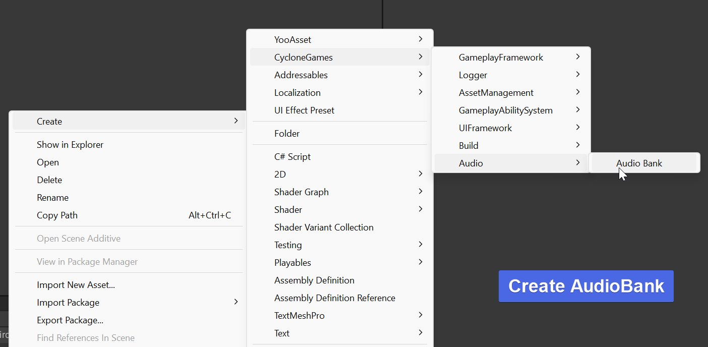
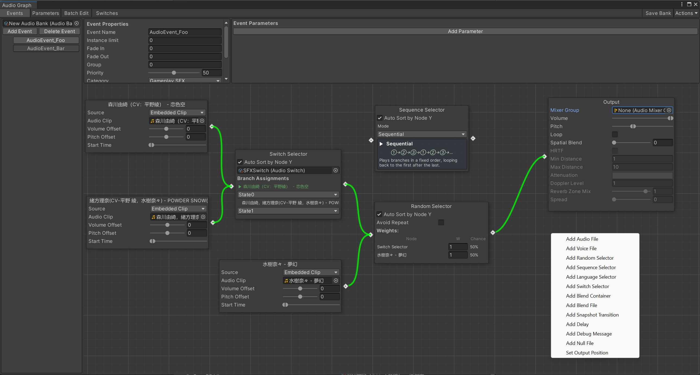
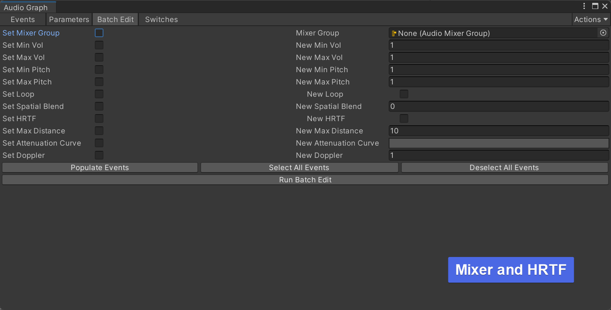
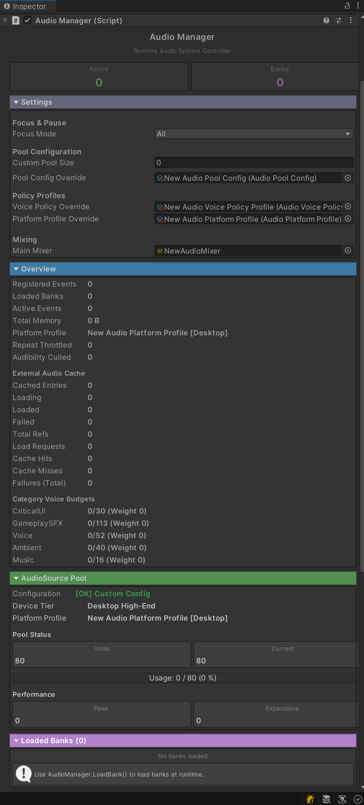

# CycloneGames.Audio

<div align="left"><a href="./README.md">English</a> | 简体中文</div>

一个为 Unity 打造的增强型音频管理系统。其核心逻辑源自微软的 `Audio-Manager-for-Unity`，由 CycloneGames 在其基础上进行了扩展，专注于性能、内存效率与生产环境的健壮性。

如果您的游戏**不**打算使用 **Wwise，CriWare，FMOD** 等成熟的中间件，此插件是作者比较推荐的，插件的逻辑与 **Wwise** 对音频的管理和编辑相似，包括了 **Bank, RTPC, Parameter, Multi-Bus** 等常用类 **Wwise** 的功能，更适合熟悉 **Wwise** 的开发者以及设计师使用。

**上游源码**: https://github.com/microsoft/Audio-Manager-for-Unity

此版本为生产环境引入了关键优化，包括性能监控、异步资源加载、GC 开销降低、DI 兼容架构、安全的资源生命周期管理，以及包含主机平台在内的全平台支持。

## 特性

- **AudioGraph 重绘**: 更合理好看的 AudioGraph 编辑界面，类虚幻引擎的快捷键 (Alt+鼠标点击操作连接线)。
- **集中式音频控制**: 通过统一的 API 管理音效和音乐。
- **DI 与非 DI 兼容**: 提供完整的 `IAudioService` 接口用于 DI 容器（VContainer、Zenject 等），同时保留 `AudioManager` 静态方法用于直接访问。
- **智能音频池**: 智能 AudioSource 对象池，支持设备自适应、自动扩容、声音窃取和智能收缩。
- **安全的资源生命周期**: `UnloadBank` 保证零悬空 `AudioSource.clip` 引用，并通过 `OnBankUnloaded` 事件钩子与外部资源管理系统集成。
- **全平台支持**: Windows、macOS、Linux、Android、iOS、WebGL 和主机平台（Switch、PS4/PS5、Xbox），均支持平台自适应池大小。
- **性能监控**: 内置的钩子和工具，用于实时监控音频系统的性能。
- **异步加载**: 集成 `UniTask` 实现音频资源的非阻塞异步加载，确保流畅的游戏体验，避免卡顿。
- **GC 优化**: 基于固定大小数组、结构体和对象池的零分配热路径，更新循环中无 `List<>` 或 LINQ。
- **线程安全**: 基于无锁 `ConcurrentQueue` 的命令派发；来自工作线程的调用自动延迟至主线程执行。
- **移动端优化**: 应用失去焦点时自动暂停/恢复音频，移动平台上的省电更新节流。

## 安装与依赖

- Unity: `2022.3`+
- 依赖:
  - `com.cysharp.unitask` ≥ `2.0.0`

通过 UPM 安装或将包放置在 `Packages`/`Assets` 目录下。详情请参阅此文件夹中的 `package.json`。

## 编辑器预览

- 
- 
- 

## 快速上手

### 0) 创建 AudioEvent 资源

在播放音频之前，您需要在 Unity 中创建 AudioEvent 资源：

1. 在项目窗口中右键点击
2. 选择 **Create > CycloneGames > Audio > Audio Bank**
3. 使用 AudioFile 节点和其他音频组件配置您的 AudioEvent 内部逻辑

### 1) 播放音效 (SFX)

```csharp
using CycloneGames.Audio.Runtime;
using UnityEngine;

public class AudioExample : MonoBehaviour
{
    [SerializeField] private AudioEvent jumpEvent;
    [SerializeField] private AudioEvent machineGunEvent;

    void Start()
    {
        // 播放一次性音效
        AudioManager.PlayEvent(jumpEvent, gameObject);

        // 播放音效并获取句柄以便后续控制
        var audioHandle = AudioManager.PlayEvent(machineGunEvent, gameObject);

        // 5秒后停止循环音效
        StartCoroutine(StopAfterDelay(audioHandle, 5f));
    }

    private System.Collections.IEnumerator StopAfterDelay(ActiveEvent audioHandle, float delay)
    {
        yield return new WaitForSeconds(delay);
        audioHandle?.Stop();
    }
}
```

### 2) 播放音乐

```csharp
using CycloneGames.Audio.Runtime;
using UnityEngine;

public class MusicController : MonoBehaviour
{
    [SerializeField] private AudioEvent backgroundMusic;

    void Start()
    {
        AudioManager.PlayEvent(backgroundMusic, gameObject);
    }

    public void StopMusic()
    {
        AudioManager.StopAll(backgroundMusic);
    }
}
```

### 3) 通过依赖注入 (DI) 使用

```csharp
using CycloneGames.Audio.Runtime;
using UnityEngine;

public class AudioConsumer
{
    private readonly IAudioService _audio;

    // 通过构造函数注入（VContainer、Zenject 等）
    public AudioConsumer(IAudioService audio)
    {
        _audio = audio;
    }

    public void PlayJump(GameObject emitter, AudioEvent jumpEvent)
    {
        _audio.PlayEvent(jumpEvent, emitter);
    }

    public void SetMusicVolume(float volumeDb)
    {
        _audio.SetMixerVolume("MusicVolume", volumeDb);
    }
}
```

在 DI 容器中注册 `AudioManager` 为 `IAudioService`：

```csharp
// VContainer 示例
builder.RegisterComponentInHierarchy<AudioManager>().As<IAudioService>();

// 或注册外部创建的实例
AudioManager.SetInstance(myAudioManagerInstance);
```

### 4) Bank 加载与卸载

```csharp
using CycloneGames.Audio.Runtime;
using UnityEngine;

public class BankExample : MonoBehaviour
{
    [SerializeField] private AudioBank sfxBank;

    void Start()
    {
        // 加载 Bank — 注册事件用于字符串查找
        AudioManager.LoadBank(sfxBank);

        // 通过名称播放
        AudioManager.PlayEvent("Jump_SFX", gameObject);
    }

    void OnDestroy()
    {
        // 卸载 Bank — 停止所有播放事件，清除所有 clip 引用，
        // 然后触发 OnBankUnloaded 通知外部资源管理器
        AudioManager.UnloadBank(sfxBank);
    }
}
```

## API 参考

### IAudioService 接口

`IAudioService` 接口为 DI 环境提供完整的音频系统访问：

| 方法                                                       | 描述                                                       |
| ---------------------------------------------------------- | ---------------------------------------------------------- |
| `PlayEvent(AudioEvent, GameObject)`                        | 在 GameObject 上播放事件，用于 3D 空间追踪                 |
| `PlayEvent(AudioEvent, Vector3)`                           | 在固定世界坐标播放事件                                     |
| `PlayEvent(string, GameObject)`                            | 播放已注册的命名事件（通过 `LoadBank` 注册）               |
| `PlayEvent(string, Vector3)`                               | 在固定世界坐标播放命名事件                                 |
| `PlayEventScheduled(AudioEvent, GameObject, double)`       | 在精确 DSP 时间调度播放（采样精确同步）                    |
| `StopAll(AudioEvent)`                                      | 停止事件的所有实例，使用配置的淡出                         |
| `StopAll(string)`                                          | 停止匹配名称的所有实例                                     |
| `StopAll(int)`                                             | 停止指定组中的所有事件（互斥播放）                         |
| `PauseAll()` / `ResumeAll()`                               | 暂停 / 恢复所有播放中的事件                                |
| `PauseEvent(ActiveEvent)` / `ResumeEvent(ActiveEvent)`     | 暂停 / 恢复单个事件                                        |
| `IsEventPlaying(string)`                                   | 查询命名事件是否有实例正在播放                             |
| `SetGlobalVolume(float)` / `GetGlobalVolume()`             | 主音量，通过 `AudioListener.volume`（0–1，后置于混音器）   |
| `SetMixerVolume(string, float)` / `GetMixerVolume(string)` | 通过 AudioMixer 暴露参数控制各总线音量（dB）               |
| `LoadBank(AudioBank, bool)`                                | 加载 Bank 并注册其事件用于名称查找                         |
| `UnloadBank(AudioBank)`                                    | 卸载 Bank，停止事件，清除 clip 引用，触发 `OnBankUnloaded` |

#### 事件

| 事件             | 描述                                                                                                       |
| ---------------- | ---------------------------------------------------------------------------------------------------------- |
| `OnBankUnloaded` | 在 Bank 完全卸载且所有 `AudioSource.clip` 引用清除后触发。外部资源管理系统应订阅此事件以安全释放资源句柄。 |

### AudioManager 静态方法

所有 `IAudioService` 方法均可通过 `AudioManager` 的静态方法访问：

- `PlayEvent(AudioEvent, GameObject)` / `PlayEvent(AudioEvent, Vector3)` — 播放事件
- `PlayEvent(string, GameObject)` / `PlayEvent(string, Vector3)` — 通过名称播放
- `StopAll(AudioEvent)` / `StopAll(string)` / `StopAll(int)` — 停止事件
- `PauseAll()` / `ResumeAll()` — 全局暂停/恢复
- `SetGlobalVolume(float)` / `GetGlobalVolume()` — 主音量
- `LoadBank(AudioBank, bool)` / `UnloadBank(AudioBank)` — Bank 管理
- `IsEventPlaying(string)` — 查询播放状态
- `SetInstance(AudioManager)` — 为 DI 注册外部创建的实例
- `ValidateManager()` — 确保 AudioManager 单例存在

### ActiveEvent 方法

- `Stop()` — 带淡出效果停止事件
- `StopImmediate()` — 立即停止事件
- `Pause()` / `Resume()` — 暂停/恢复单个事件
- `SetMute(bool)` — 静音/取消静音事件
- `SetSolo(bool)` — 独奏/取消独奏事件
- `IsPaused` — 查询事件是否处于暂停状态
- `EstimatedRemainingTime` — 估算距播放完成的剩余时间

### AudioHandle（结构体）

轻量级安全句柄，用于引用 `ActiveEvent` 而不持有强引用：

- `IsValid` — 检查引用的事件是否仍然存活且正在播放
- `Stop()` / `StopImmediate()` — 通过句柄控制播放
- `EstimatedRemainingTime` / `IsPlaying` — 查询状态

## 外部资源管理集成

`UnloadBank` 设计用于与外部资源管理系统的安全集成，如 **CycloneGames.AssetManagement**、**Addressables** 或 **Resources**。

当调用 `UnloadBank` 时：

1. 该 Bank 的所有活跃事件被**立即停止**
2. 所有 `AudioSource.clip` 引用被**设置为 null**（释放 clip 引用）
3. Bank 事件从**名称注册表中移除**
4. 触发 `OnBankUnloaded` 事件 — 外部系统可订阅此事件以释放资源句柄

这保证了 `UnloadBank` 返回后，音频系统对该 Bank 的 `AudioClip` 资源持有**零引用**。

### 与 CycloneGames.AssetManagement 集成

```csharp
using CycloneGames.Audio.Runtime;
using CycloneGames.AssetManagement.Runtime;

public class AudioAssetBridge
{
    private readonly IAssetModule _assets;
    private readonly IAudioService _audio;
    private readonly Dictionary<AudioBank, IAssetHandle<AudioBank>> _bankHandles = new();

    public AudioAssetBridge(IAssetModule assets, IAudioService audio)
    {
        _assets = assets;
        _audio = audio;

        // 订阅一次 — 当音频系统完成 Bank 卸载后，释放底层资源句柄
        _audio.OnBankUnloaded += OnBankUnloaded;
    }

    public async UniTask LoadBankAsync(string bankAddress)
    {
        var handle = await _assets.LoadAssetAsync<AudioBank>(bankAddress);
        var bank = handle.Asset;
        _bankHandles[bank] = handle;
        _audio.LoadBank(bank);
    }

    public void UnloadBank(AudioBank bank)
    {
        // 停止所有事件，清除所有 clip 引用，然后触发 OnBankUnloaded
        _audio.UnloadBank(bank);
    }

    private void OnBankUnloaded(AudioBank bank)
    {
        // 安全释放 — 音频系统已持有零 clip 引用
        if (_bankHandles.TryGetValue(bank, out var handle))
        {
            handle.Release();
            _bankHandles.Remove(bank);
        }
    }
}
```

### 与 Addressables 直接集成

```csharp
using CycloneGames.Audio.Runtime;
using UnityEngine.AddressableAssets;

public class AddressablesAudioBridge
{
    private readonly Dictionary<AudioBank, AsyncOperationHandle<AudioBank>> _handles = new();

    public void Initialize()
    {
        AudioManager.OnBankUnloaded += bank =>
        {
            if (_handles.TryGetValue(bank, out var handle))
            {
                Addressables.Release(handle);
                _handles.Remove(bank);
            }
        };
    }

    public async UniTask LoadBankAsync(string address)
    {
        var handle = Addressables.LoadAssetAsync<AudioBank>(address);
        var bank = await handle.Task;
        _handles[bank] = handle;
        AudioManager.LoadBank(bank);
    }

    public void UnloadBank(AudioBank bank)
    {
        AudioManager.UnloadBank(bank); // OnBankUnloaded 会自动触发
    }
}
```

## CycloneGames 独有拓展

此实现对原始的微软音频管理器进行了显著的扩展。关键增强功能如下：

### 重绘 AudioGraph，类 UnrealEngine 的快捷键添加

重绘了 AudioGraph, 增强了 Node 连接曲线的绘制，增加了类似虚幻引擎的快捷键 Alt + 鼠标左键，删除单一曲线或删除当前选中节点上的所有曲线。

### DI 兼容架构

系统暴露了简洁的 `IAudioService` 接口，可无缝集成任何 DI 容器。对于非 DI 项目，所有功能仍可通过 `AudioManager` 的静态方法访问。`SetInstance()` 方法允许外部代码将已有的 `AudioManager` 注册为单例。

### AudioClipReference 与外部加载器

`AudioClipReference` 支持多种来源类型：

- `FilePath`
- `StreamingAssetsPath`
- `PersistentDataPath`
- `Url`
- `AssetAddress`

这里最重要的设计原则是：

- 路径和 URL 类型可以由音频系统直接加载
- `AssetAddress` 被视为逻辑地址，不等同于本地文件路径
- 对于 `AssetAddress`，建议注册运行时加载器

#### 为单个引用注册加载器

```csharp
AudioClipResolver.RegisterManagedReferenceLoader(audioClipReference, async (clipRef, ct) =>
{
    var handle = await myAssetSystem.LoadAudioClipAsync(clipRef.Location, ct);
    if (handle == null || handle.Asset == null)
        return default;

    return new ManagedAudioClipLoadResult(
        handle.Asset,
        () => handle.Release());
});
```

#### 为整个来源类型注册加载器

这更适合 `AssetAddress`、YooAsset、Addressables 或你自己的运行时资源系统：

```csharp
AudioClipResolver.RegisterManagedLocationKindLoader(AudioLocationKind.AssetAddress, async (clipRef, ct) =>
{
    var handle = await myAssetSystem.LoadAudioClipAsync(clipRef.Location, ct);
    if (handle == null || handle.Asset == null)
        return default;

    return new ManagedAudioClipLoadResult(
        handle.Asset,
        () => handle.Release());
});
```

#### 生命周期保证

当外部加载器返回 `IAudioClipHandle` 后，音频系统会在不再使用该资源时自动调用 `Release()`，包括：

- 事件停止
- 事件回收
- Bank 卸载
- 异步加载取消后的清理

这意味着：

- 音频系统负责决定“什么时候已经不再引用这个 clip”
- 外部资源系统负责决定“如何真正释放底层资源句柄”

这样既能保证资源生命周期安全，也不会强迫 `CycloneGames.Audio` 直接耦合所有加载后端。

#### 外部 Clip 生命周期验证清单

对于将 `AudioClipReference` 接入 Addressables、YooAsset 或自定义资源系统的项目，建议至少验证以下场景：

- 开始播放后卸载所属 Bank，确认外部释放回调只执行一次
- 异步加载尚未完成前停止事件，确认清理结束后没有悬空句柄残留
- 多个实例同时播放同一个 `AudioClipReference`，确认只有最后一个实例结束后底层资源才会被真正释放
- 强制外部加载器失败，确认缓存统计记录失败，同时不会泄漏半初始化状态的句柄
- 在 Play Mode 下清理或重载音频系统，确认已注册的 loader 和外部缓存 clip 都会被安全释放

### Category 默认模板与语音策略覆盖

`AudioEvent` 现在支持一个轻量的两层语音策略模型：

- `Category` 用来表达高层运行时意图
- `Use Category Defaults` 会自动套用该分类的内建语音策略模板
- 只有极少数特殊事件，才需要做单事件覆盖

这样常规工作流会简单很多。对大多数项目来说，设计师通常只需要给事件选一个分类：

- `CriticalUI`
- `GameplaySFX`
- `Voice`
- `Ambient`
- `Music`

当 `Use Category Defaults` 开启时，事件会自动解析出对应的语音策略。当前内建默认模板如下：

| 分类 | Steal Resistance | Budget Weight | Allow Voice Steal | Allow Distance Steal | Protect Scheduled |
| --- | ---: | ---: | :---: | :---: | :---: |
| `CriticalUI` | `2.2` | `1.5` | `false` | `false` | `true` |
| `GameplaySFX` | `1.0` | `1.0` | `true` | `true` | `true` |
| `Voice` | `1.5` | `1.35` | `true` | `false` | `true` |
| `Ambient` | `0.7` | `0.7` | `true` | `true` | `false` |
| `Music` | `2.6` | `1.8` | `false` | `false` | `true` |

推荐用法：

- 将 BGM 和长期存在的音乐层设置为 `Music`
- 将对白、旁白、字幕驱动的语音设置为 `Voice`
- 将远景循环声和环境底噪设置为 `Ambient`
- 大多数一次性玩法音效保留在 `GameplaySFX`
- `CriticalUI` 留给菜单确认、警告、节奏提示或其他“必须被听见”的反馈

只有当某个事件需要超出分类模板的特殊行为时，才建议关闭 `Use Category Defaults` 并改成自定义策略。

### 线程安全的命令派发

所有公共 API 方法均为线程安全。来自工作线程的调用会先写入结构化命令队列，再由主线程通过固定容量的环形缓冲区统一消费，从而降低热路径 GC 压力，并在高负载下保持更可预测的命令移交行为。

### 安全的资源生命周期管理

`UnloadBank` 执行即时清理：停止所有活跃事件、清除每个 `AudioSource.clip` 引用、触发 `OnBankUnloaded` 事件。这保证了外部资源管理系统可以安全释放底层资源，不会出现悬空引用或 use-after-free。

### 异步操作

所有资源密集型操作（例如加载 `AudioClip`）都使用 `UniTask` 异步执行。这避免了主线程阻塞，对消除游戏过程中引入新声音时的帧率下降至关重要。

### GC 优化

音频系统使用固定大小数组（`EventSource[8]`、`ActiveParameter[8]`）替代 `List<>`，使用基于结构体的 `EventSource` 和 `AudioHandle` 以实现栈分配，`ActiveEvent` 实例使用对象池，活跃事件列表使用 O(1) 交换移除。热路径 `Debug.Log` 调用使用 `#if UNITY_EDITOR || DEVELOPMENT_BUILD` 包裹。

### 全平台支持

支持 WebGL、Android/iOS、桌面端和主机平台（Nintendo Switch、PS4/PS5、Xbox One/Series）的平台自适应池大小配置。移动平台具有应用失去焦点时的自动音频暂停/恢复和省电更新节流。

### 性能监控

系统内置了性能检测工具，可为 **AudioManager** 提供内存监控数据，使开发人员能够快速诊断与音频相关的性能问题。

### Domain Reload 安全

静态状态通过 `[RuntimeInitializeOnLoadMethod(SubsystemRegistration)]` 正确重置，确保在启用 Unity「Enter Play Mode Options」（跳过域重载）时的正确行为。

### 智能音频池管理

音频系统配备了智能 AudioSource 对象池，能够自动适配不同设备并高效管理资源。

#### 核心特性

| 特性           | 描述                                                         |
| -------------- | ------------------------------------------------------------ |
| **设备自适应** | 池大小根据平台（WebGL/移动端/桌面端/主机）和设备内存自动调整 |
| **自动扩容**   | 当需要更多音源时，池会动态增长                               |
| **声音窃取**   | 当池已满时，停止最老的非循环音效以释放资源                   |
| **智能收缩**   | 空闲期间逐步释放未使用的音源                                 |
| **零 GC 分配** | AudioSource 永远不会在池外创建，防止内存泄漏                 |

#### 默认池大小

| 平台           | 条件        | 初始 | 最大 |
| -------------- | ----------- | ---- | ---- |
| WebGL          | 始终        | 16   | 32   |
| 移动端         | 内存 < 3GB  | 32   | 48   |
| 移动端         | 内存 3-6GB  | 32   | 64   |
| 移动端         | 内存 > 6GB  | 32   | 96   |
| 桌面端         | 内存 < 8GB  | 80   | 128  |
| 桌面端         | 内存 8-16GB | 80   | 192  |
| 桌面端         | 内存 > 16GB | 80   | 256  |
| Switch         | 始终        | 32   | 64   |
| 主机 (PS/Xbox) | 始终        | 64   | 192  |

#### 自定义配置（可选）

默认情况下，系统会为您的设备使用最优值。如需自定义：

1. 创建配置资产：**Create → CycloneGames → Audio → Audio Pool Config**
2. 放置在 `Assets` 目录下的任意位置
3. 在 Inspector 中调整参数



> [!NOTE]
>
> - 在 **编辑器** 中，配置会从项目任意位置自动发现。
> - 对于 **构建版本**，需将配置放在 `Resources` 文件夹中才能自动发现，否则将使用默认值。
> - 项目中应只存在一个 `AudioPoolConfig`。

#### 热更新支持

对于使用 YooAsset 或 Addressables 等资产管理系统的项目：

**方式一：在 AudioManager 初始化之前**（推荐）

```csharp
// 在启动场景中，AudioManager 初始化之前
var handle = YooAssets.LoadAssetAsync<AudioPoolConfig>("AudioPoolConfig");
await handle.Task;
AudioPoolConfig.SetConfig(handle.AssetObject as AudioPoolConfig);
// AudioManager 初始化时会自动使用此配置
```

**方式二：在 AudioManager 初始化之后**

```csharp
// 运行时加载并应用配置
var handle = YooAssets.LoadAssetAsync<AudioPoolConfig>("AudioPoolConfig");
await handle.Task;
AudioPoolConfig.SetConfig(handle.AssetObject as AudioPoolConfig);

// 将新配置应用到正在运行的 AudioManager
AudioManager.ReloadPoolConfig();
```

> [!NOTE]
> `ReloadPoolConfig()` 会更新池大小限制，但保留现有的 AudioSource。

#### 运行时监控

在运行时访问池统计数据：

```csharp
// 检查池状态
Debug.Log($"池: {AudioManager.PoolStats.InUse}/{AudioManager.PoolStats.CurrentSize}");
Debug.Log($"最大: {AudioManager.PoolStats.MaxSize}");
Debug.Log($"设备等级: {AudioManager.PoolStats.DeviceTier}");

// 性能指标
Debug.Log($"峰值使用: {AudioManager.PoolStats.PeakUsage}");
Debug.Log($"扩容次数: {AudioManager.PoolStats.TotalExpansions}");
Debug.Log($"声音窃取: {AudioManager.PoolStats.TotalSteals}");
```

AudioManager 的 Inspector 在播放模式下也会显示实时池统计数据。
