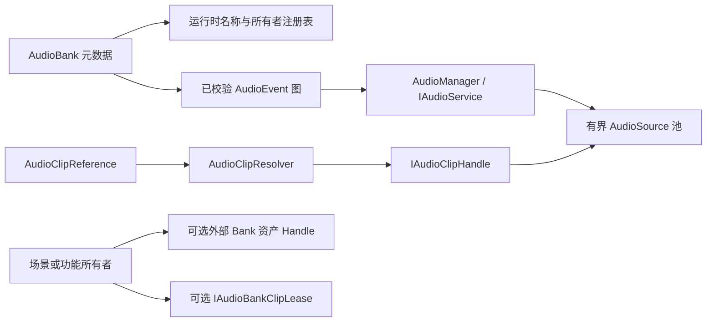

# CycloneGames.Audio

[English](README.md) | 简体中文

CycloneGames.Audio 是基于 `AudioBank` 资产和经过校验的 `AudioEvent` 图的 Unity 音频模块。它管理有界 `AudioSource` 池、Voice Policy、按分类的 Voice Stealing、Mixer Snapshot 和参数驱动播放——通过主线程专用的 `IAudioService` 契约和静态 `AudioManager` Facade 提供服务。

模块衍生自微软 [Audio-Manager-for-Unity](https://github.com/microsoft/Audio-Manager-for-Unity)，保持所有权显式可见：Bank 拥有 Event 图，调用方拥有 Bank 资产 Handle 和 Clip 驻留 Lease，Audio Manager 拥有运行时播放状态。

## 目录

- [概述](#概述)
- [架构](#架构)
- [快速上手](#快速上手)
- [核心概念](#核心概念)
- [使用指南](#使用指南)
- [进阶主题](#进阶主题)
- [常见场景](#常见场景)
- [性能与内存](#性能与内存)
- [故障排查](#故障排查)

## 概述

创建 `AudioBank` 资产，在 Audio Graph 编辑器中编写 Event 图，分配 `AudioClip` 引用（内嵌或外部），通过资产引用或注册名称播放 Event。运行时池化 `AudioSource` 对象，按分类限制 Voice 数量，按发射器应用参数和 Switch，调度 State-Mix 过渡。

Runtime 程序集只有一个直接依赖：UniTask。与 AssetManagement、Addressables 或 YooAsset 的集成通过 `IAudioClipProvider` Resolver 契约在组合边界完成。

### 主要特性

- **基于图的创作**：专用 Audio Graph 编辑器，拖拽连线，支持 Undo/Redo 和 Bank 校验。
- **有界 Source 池**：按分类限制 Voice 数量，支持 Stealing 和平台专属池配置。
- **AudioSwitch、AudioParameter、State Group、State-Mix Profile**：无需触碰单个 Event 即可运行时控制。
- **外部 Clip 加载**：通过内置文件/URL 处理或调用方提供的 `IAudioClipProvider`，每个 Clip 用引用计数 Handle 追踪。
- **发射器范围参数**：设置按 GameObject 覆盖，跟随发射器直到显式清除。
- **确定性 Bank Clip 驻留**：通过 `IAudioBankClipLease` 预加载 Bank 引用的所有外部 Clip。
- **DSP 调度播放**：`PlayEventScheduled` 按 `AudioSettings.dspTime` 调度。

## 架构

| 程序集 | 路径 | 用途 |
| --- | --- | --- |
| `CycloneGames.Audio.Runtime` | `Runtime/` | `AudioManager`、`IAudioService`、Bank/Event 模型、图执行、Source 池、Voice Policy、Clip Resolver、驻留 Lease。依赖 `UniTask`。 |
| `CycloneGames.Audio.Editor` | `Editor/` | Audio Graph、自定义 Inspector、校验、诊断、预览、Profiler。仅 Editor。 |
| `CycloneGames.Audio.Tests.Editor` | `Tests/Editor/` | EditMode 测试：路径校验、Resolver 所有权、Bank 所有权、随机选择。 |



右侧三条所有权线相互独立：注册表成员、资产系统的 Bank Handle 和外部 Clip 驻留拥有不同的生命周期。

### 核心类型

| 类型 | 角色 |
| --- | --- |
| `AudioManager` / `IAudioService` | Unity 生命周期所有者与公共播放/控制服务 |
| `IAudioLifecyclePauseControl` | 可选服务能力，用于解除 `LifecycleHold` 暂停 |
| `AudioBank` | Event、Parameter、Switch、State Group、State-Mix Profile 的序列化聚合 |
| `AudioEvent` / `AudioNode` / `AudioOutput` | 创作图、可执行节点、最终播放/输出设置 |
| `ActiveEvent` / `AudioHandle` | 池化播放状态与生成号安全的长寿命控制令牌 |
| `AudioClipReference` | 创作或运行时创建的外部 Clip 位置 |
| `AudioClipResolver` / `IAudioClipHandle` | Provider 选择与引用计数 Clip 所有权 |
| `IAudioBankClipLeaseProvider` / `IAudioBankClipLease` | 调用方自有的 Bank Clip 驻留可选能力 |
| `AudioPoolConfig`、`AudioPlatformProfile`、`AudioVoicePolicyProfile` | 池、平台和 Voice Policy 的配置资产 |

## 快速上手

### 1. 设置 Manager

在运行时场景中添加 `AudioManager` 组件。确保场景中有 `AudioListener`，按需分配 Mixer 或 Profile 资产。

```csharp
using CycloneGames.Audio.Runtime;

IAudioService audio = audioManagerComponent;
AudioManager.SetInstance(audioManagerComponent);
```

所有音频服务和 Resolver 调用必须在 Unity 主线程。

### 2. 创作 Bank

1. **Create > CycloneGames > Audio > Audio Bank**。
2. 选中资产，点击 **Open in Graph**（或 **Window > Audio Graph** 后指定 Bank）。
3. 添加 Event，添加 `AudioFile` 节点，分配 `AudioClip`，将节点连接到 Event 输出。
4. 点击 **Validate Bank** 修复错误。
5. 点击 **Save Bank** 持久化。

### 3. 播放 Event

`PlayEvent` 返回池化的 `ActiveEvent`。转为 `AudioHandle` 用于长寿命控制：

```csharp
using CycloneGames.Audio.Runtime;
using UnityEngine;

public sealed class AudioExample : MonoBehaviour
{
    [SerializeField] private AudioEvent jumpEvent;
    private AudioHandle playback;

    public void PlayJump()
    {
        ActiveEvent active = AudioManager.PlayEvent(jumpEvent, gameObject);
        playback = active != null ? active.Handle : default;
    }

    public void StopJump()
    {
        playback.Stop();
        playback = default;
    }
}
```

`AudioHandle` 存储 Manager 槽位和生成号，池化 Event 结束或槽位复用时自动失效——不会意外控制后续播放。

### 4. 注册 Bank 名称查找

```csharp
AudioManager.LoadBank(sfxBank);
AudioManager.PlayEvent("Jump_SFX", gameObject);

AudioManager.UnloadBank(sfxBank);
```

直接资产播放无需名称注册。字符串查找需要。加载 Bank 注册元数据并准备图数据，但不会加载外部 Clip——使用 `IAudioBankClipLease` 实现。

## 核心概念

### AudioBank 与 AudioEvent

`AudioBank` 拥有 Event、Parameter、Switch、State Group 和 State-Mix Profile。`AudioEvent` 拥有有向图——File、Blend、Voice、Random、Sequence 和 Switch 节点汇聚到一个输出节点决定播放参数。

Editor 校验拒绝缺失输出、环路、重复所有权、外部连接和超大图。运行时限制：

| 预算 | 上限 |
| --- | ---: |
| 每 Event 节点数 | 1,024 |
| 每 Event 连接数 | 4,096 |
| 图深度 | 128 |
| 每 `ActiveEvent` Source 数 | 8 |
| 每 `ActiveEvent` Parameter 数 | 8 |

这些限制用于防止损坏和失控执行。实际内容建议使用更小的图。

### ActiveEvent 生命周期

内嵌 Clip 的 Event 同步准备。有外部引用的 Event 进入 `Preparing`，异步加载 Clip，全部 Source 就绪后转为 `Played`。加载失败则停止 Event。在 Preparing 期间调用 `Stop` 取消 Event 并释放延迟结果。

每次异步操作携带启动时的 `ActiveEvent` 生成号——过期完成无法将 Clip 附加到已回收的池化 Event。`AudioHandle.IsPlaying` 表示槽位/生成号仍然有效，在 `Preparing` 期间也可是 `true`。需要区分时检查 `ActiveEvent.status`。

不要在播放停止后保留原始 `ActiveEvent`——同一对象可能被回收用于另一播放。任何超出现播放寿命的引用使用 `AudioHandle`。

### 暂停模型

暂停状态基于原因。手动逐 Event 暂停、`PauseAll`（`Global`）、应用暂停、焦点丢失和生命周期保持可以共存。`ResumeAll` 只清除 `Global` 原因。

使用 `AudioFocusMode.AutoPauseOnly` 时，恢复焦点将自动暂停移入 `LifecycleHold`——游戏准备好恢复时调用 `AudioManager.ResumeLifecyclePausedEvents()`（或使用 `IAudioLifecyclePauseControl`）。

### 发射器范围参数

设置按 GameObject 覆盖的参数，跟随发射器：

```csharp
AudioManager.SetParameterValue("EngineRPM", vehicle, rpm);

// 在回收或销毁池化发射器之前：
int removed = AudioManager.ClearScopedParameterValues(vehicle);
```

显式清理是常规路径。约每 120 帧的定期扫描捕获已销毁的发射器作为防泄漏兜底。

### 三种独立生命周期

| 生命周期 | 所有者 | 释放方式 |
| --- | --- | --- |
| Bank 注册表元数据 | `AudioManager.LoadBank` | `AudioManager.UnloadBank` |
| Bank 资产 Handle | 应用组合范围 | `IAssetHandle<AudioBank>.Dispose` 或等价 |
| 外部 Clip 驻留 | 场景/功能或 Manager 拥有的 Lease | Lease 释放、`ReleasePreloadedBankClips`、Bank 卸载或播放完成 |

安全关闭顺序：`UnloadBank` → 释放 Clip Lease → 释放 Bank 资产 Handle。`OnBankUnloaded` 在注册表过渡后触发。

## 使用指南

### AudioClipReference 位置

`AudioFile`、`AudioVoiceFile` 和 `AudioBlendFile` 支持两种 Source 模式：

- **EmbeddedClip**：`AudioClip` 是图的序列化依赖。
- **ExternalReference**：`AudioClipReference` 在播放时解析。

| `AudioLocationKind` | 含义 |
| --- | --- |
| `FilePath` | 内置加载器理解的显式路径 |
| `StreamingAssetsPath` | `Application.streamingAssetsPath` 下的相对路径 |
| `PersistentDataPath` | `Application.persistentDataPath` 下的相对路径 |
| `Url` | 绝对 HTTP/HTTPS URI |
| `AssetAddress` | 供应用 Provider 使用的逻辑 Key |

所有位置拒绝空值/null 字符和超过 4,096 字符的字符串。`FilePath` 和 `AssetAddress` 是信任边界——模块不做沙箱或认证。

创作的 `AudioClipReference` 资产在运行时不可变。运行时分配位置则创建调用方自有的引用：

```csharp
AudioClipReference runtimeRef = AudioClipReference.CreateRuntime(
    AudioLocationKind.AssetAddress,
    "Audio/SFX/Jump");

runtimeRef.TrySetLocation(
    AudioLocationKind.AssetAddress,
    "Audio/SFX/Jump_Variant");

Object.Destroy(runtimeRef); // 仅主线程
```

### 外部 Clip Resolver

内置 Resolver 链给每引用 Loader 优先级 300，每位置种类 Loader 优先级 200，内置文件/URL Provider 优先级 100。按自己的优先级注册自定义 `IAudioClipProvider`。

使用作用域 Lease 支持可清理的注册：

```csharp
IDisposable registration = AudioClipResolver.RegisterManagedLocationKindLoaderScoped(
    AudioLocationKind.AssetAddress,
    LoadManagedClipAsync);

// 作用域结束时在主线程释放。
registration.Dispose();
```

Lease 只移除自己的 Loader——释放旧 Lease 不影响新替换。

### 桥接 AssetManagement

```csharp
public sealed class AudioClipAssetBridge : IDisposable
{
    private readonly IAssetPackage package;
    private readonly IDisposable registration;

    public AudioClipAssetBridge(IAssetPackage package)
    {
        this.package = package;
        registration = AudioClipResolver.RegisterManagedLocationKindLoaderScoped(
            AudioLocationKind.AssetAddress,
            LoadAsync);
    }

    private async UniTask<ManagedAudioClipLoadResult> LoadAsync(
        AudioClipReference reference, CancellationToken token)
    {
        IAssetHandle<AudioClip> handle = package.LoadAssetAsync<AudioClip>(
            reference.Location, owner: "CycloneGames.Audio", cancellationToken: token);
        if (handle == null) return default;

        try
        {
            await handle.Task;
            AudioClip clip = handle.Asset;
            if (clip == null) { handle.Dispose(); return default; }
            return new ManagedAudioClipLoadResult(clip, handle.Dispose);
        }
        catch { handle.Dispose(); throw; }
    }

    public void Dispose() => registration.Dispose();
}
```

相同的所有权模式适用于 Addressables、YooAsset 或任何 Provider。

## 进阶主题

### 确定性 Bank Clip 驻留

播放前预加载 Bank 引用的所有外部 Clip：

```csharp
IAudioBankClipLeaseProvider residency = audioService as IAudioBankClipLeaseProvider;
IAudioBankClipLease lease = residency != null
    ? await residency.AcquireBankClipLeaseAsync(bank, token)
    : null;

Debug.Log($"已加载 {lease?.LoadedCount ?? 0}，失败 {lease?.FailedCount ?? 0}");
lease?.Dispose(); // 主线程
```

`PreloadBankClipsAsync` 是便捷包装，在显式释放、Bank 卸载或 Manager 清理前保留 Lease。

### 内置外部缓存

内置文件/URL Provider 按 `(LocationKind, Location, Version)` 合并请求，引用计数活跃 Handle。根据实测平台预算调整：

| 设置 | 默认 | 用途 |
| --- | ---: | --- |
| `ExternalClipMemoryBudgetBytes` | `0` | 未用驻留预算；`0` = 不保留未用 Clip |
| `ExternalClipMaxDownloadBytes` | 64 MiB | 每请求编码字节上限 |
| `ExternalClipMaxDecodedBytes` | 256 MiB | 每 Clip 估计解码 PCM 上限 |
| `ExternalClipRequestTimeoutSeconds` | 30 s | `UnityWebRequest` 超时 |
| `ExternalClipIdleTTL` | 30 s | 启用保留时未用条目 TTL |

通过 `AudioManager.ExternalClipMemoryBudgetBytes` 等设置。解码大小估算为 `采样数 × 声道数 × sizeof(float)`——不包含原生解码器或平台音频内存开销。

### Bank 名称冲突规则

- 先注册的 Bank 为回退。
- 后注册的 Bank 仅在 `overwriteExisting: true` 时替换。
- 卸载生效所有者恢复前一个贡献者。

共享的 `AudioEvent`、`AudioParameter` 和 `AudioSwitch` 对象跨 Bank 引用计数。卸载一个 Bank 仅在它是最后一个所有者时才移除对象。

### DSP 调度播放

```csharp
AudioManager.PlayEventScheduled(musicEvent, gameObject, targetDspTime);
```

Source 遵循 Unity DSP 调度器。Snapshot 过渡从第一个 `dspTime` 达到请求时间的 `Update` 开始——Source 是 DSP 调度的，Snapshot 是帧对齐的。

## 常见场景

### 随机变化的脚步声

创建一个带 `RandomSelector` 节点和多个 `AudioFile` 子节点的 `AudioEvent`。从脚步系统调用 `PlayEvent`——Selector 每次选不同 Clip。

### 引擎 RPM 通过发射器范围参数

```csharp
AudioManager.SetParameterValue("EngineRPM", vehicle, currentRpm);
```

从 `Update()` / `FixedUpdate()` 更新。销毁车辆前用 `ClearScopedParameterValues(vehicle)` 清除。

### 资产管理驱动的 Bank 生命周期

```csharp
IAssetHandle<AudioBank> bankHandle = package.LoadAssetAsync<AudioBank>("Banks/Combat");
await bankHandle.Task;
AudioManager.LoadBank(bankHandle.Asset);

// ... gameplay ...

AudioManager.UnloadBank(bankHandle.Asset);
bankHandle.Dispose();
```

### 战斗前预加载

```csharp
IAudioBankClipLease lease = await residencyProvider
    .AcquireBankClipLeaseAsync(combatBank, token);
// 所有外部 Clip 已加载——可以开始战斗。
// 战斗后：lease.Dispose();
```

## 性能与内存

运行时池化 `ActiveEvent` 和 `AudioSource`，使用固定每 Event Source/Parameter 数组，缓存准备的 Event 数据，限制图执行和 Bank/引用扫描。初始化、池增长、异步状态机、外部 Provider、集合扩容、Unity 对象创建和音频解码仍可能分配。在目标 Player 中 Profile 代表性图、Voice 数量和 Provider 行为后再设预算。

Runtime asmdef 无平台排除，不要求 unsafe 代码、动态代码生成或运行时反射。每个发布平台需要做目标后端验证——编解码器支持、StreamingAssets 行为、焦点/暂停过渡、池限制、延迟和内存。

## 故障排查

| 现象 | 原因 | 处理 |
| --- | --- | --- |
| `InvalidOperationException`：需要主线程 | Worker 调用了音频 API | 将完整操作 Marshal 到 Unity 主线程 |
| 外部 Event 卡在 `Preparing` | Provider 未完成或未在主线程恢复 | 检查 Provider 任务/错误；修复完成和线程所有权 |
| `AssetAddress` 不播放 | 没有 Loader 接受该 Key | 为 `AssetAddress` 注册 Resolver Lease |
| `SetLocation` 抛异常 | 引用不可变 | 使用 `TrySetLocation` 或 `CreateRuntime` |
| 路径被拒绝 | 根路径、含 `..`、空、过长或有 null 字符 | 使用安全相对路径 |
| 预加载 Clip 持续驻留 | Manager 拥有预加载 Lease | `ReleasePreloadedBankClips(bank)` 或卸载 Bank |
| Bank 卸载后共享 Event 仍在播放 | 另一 Bank 仍拥有同一对象 | 卸载剩余所有者或显式停止 |
| 卸载后名称解析为旧资产 | 回退恢复了前一个贡献者 | 修复重复名称或检查加载顺序/覆写策略 |
| 音频释放后托管 Clip 仍缓存 | 外部 Provider 在自己的缓存策略下保留 | 检查 Provider 缓存；音频释放不控制外部驱逐 |
| 构建失败 | Bank 有校验错误 | 运行 **Validate All Audio Banks**，修复错误 |
| 图修改未写盘 | 常规编辑不自动保存 | 使用 **Save Bank** 或项目保存工作流 |

## 验证

Editor 测试：
```text
<UnityEditor> -batchmode -nographics -projectPath <repo-root>/UnityStarter \
  -runTests -testPlatform EditMode \
  -assemblyNames CycloneGames.Audio.Tests.Editor -testResults <result-path> -quit
```

手动检查：
1. 创建 Bank，添加/移动/连接/删除/Undo/Redo 节点。确认环路被拒绝。
2. 预览一个 Event，切换 Bank——确认前一个预览停止。
3. 播放/停止内嵌和外部 Event，包括加载中停止场景。
4. 两种覆写策略加载重叠 Bank，校验回退行为。
5. 构建每个目标 Player，Profile 分配、Voice 压力和延迟。

## 参考

- 衍生自微软 [Audio-Manager-for-Unity](https://github.com/microsoft/Audio-Manager-for-Unity) 0.3.0（MIT）。署名：[THIRD_PARTY_NOTICES.md](THIRD_PARTY_NOTICES.md)。
- [Unity AudioMixer](https://docs.unity3d.com/Manual/class-AudioMixer.html)
- [Unity AudioSettings.dspTime](https://docs.unity3d.com/ScriptReference/AudioSettings-dspTime.html)
- [UnityWebRequest audio](https://docs.unity3d.com/ScriptReference/Networking.UnityWebRequestMultimedia.GetAudioClip.html)
