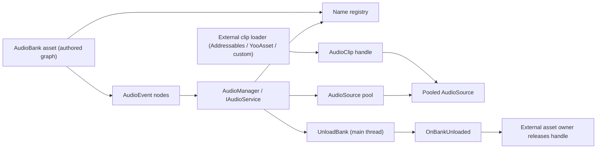

# CycloneGames.Audio

[English | 简体中文](README.md)

CycloneGames.Audio 是一个 Unity 音频创作与运行时包，围绕 `AudioBank` / `AudioEvent` 图、有界 `AudioSource` 池、分类感知的语音抢占以及有界工作线程命令队列构建。它同时提供静态 `AudioManager` facade 与用于依赖注入组合的 `IAudioService` 接口，并通过显式的 `OnBankUnloaded` 生命周期与外部资源系统集成。部分代码基于 Microsoft 的 [Audio-Manager-for-Unity](https://github.com/microsoft/Audio-Manager-for-Unity)，按 MIT License 使用。

## 目录

- [概述](#概述)
- [架构](#架构)
- [快速上手](#快速上手)
- [核心概念](#核心概念)
- [使用指南](#使用指南)
- [进阶主题](#进阶主题)
- [常见场景](#常见场景)
- [性能与内存](#性能与内存)
- [故障排查](#故障排查)

## 概述

游戏音频系统回答两个问题：应该播放哪个声音，以及应该由哪个 `AudioSource` 播放。CycloneGames.Audio 把创作（在 Editor 中编辑的 `AudioBank` / `AudioEvent` 图）、运行时分发（`AudioManager` / `IAudioService`）与物理播放（一组池化的 `AudioSource` 组件）解耦。所有者负责创作事件图并调用播放/停止 API；manager 解析 clip 引用、从池中选取语音、应用分类感知的抢占，并跟踪活跃事件直到其停止。

本模块面向需要集中管理 SFX 与音乐、但又不希望引入完整中间件栈的 Unity 项目。它支持直接 clip 引用、外部 clip 加载器（Addressables、YooAsset、自定义 loader）、基于 `UniTask` 的预加载、平台感知的池大小以及少量命令式入口的工作线程提交。Unity 音频对象与 manager 状态仍由主线程持有；只有 [命令提交](#命令提交与主线程所有权) 列出的排队命令接受工作线程提交。

当项目需要一个集成了 bank 创作、对象池、语音策略和外部资源管理的统一音频服务时使用本模块。不要将其作为加密或时间精度敏感的音频合成层 —— Unity 的 DSP 时钟与 `AudioSettings.dspTime` 驱动调度，manager 不提供超出 `PlayEventScheduled` 能力的采样级时间精度保证。

### 主要特性

- **AudioGraph 创作**：节点连线编辑，使用 `Alt + 鼠标左键` 移除单条或选中节点上的全部连线。
- **Selector 创作**：`SequenceSelector`、`SwitchSelector`、`RandomSelector` 提供显式分支映射、按节点 Y 值排序、权重与重复控制。
- **双重访问模型**：`IAudioService` 用于显式依赖注入组合，`AudioManager` 静态入口用于直接访问。
- **有界 `AudioSource` 池**：可配置初始值与上限，支持运行时扩容、分类感知的语音抢占、空闲收缩。
- **外部 clip 加载**：外部 clip 解析与 bank 预加载提供 `UniTask` API；播放和控制 API 仍为同步。
- **平台配置**：源码为 WebGL、Android/iOS、桌面和部分主机编译符号定义池与更新配置。
- **Bank 卸载顺序**：主线程卸载路径停止匹配事件、清除其池化音源的 clip、移除注册项后触发 `OnBankUnloaded`。
- **有界工作线程提交**：部分命令通过 `lock` 保护的固定容量环形缓冲区提交，并在主线程执行。
- **运行时统计**：提供对象池、注册表、命令队列和外部 clip 缓存计数，用于诊断。

## 架构

本模块分为 Runtime、Editor 与 Tests 程序集：

| 程序集 | 路径 | 用途 |
| --- | --- | --- |
| `CycloneGames.Audio.Runtime` | `Runtime/` | `AudioManager`、`IAudioService`、`AudioBank`、`AudioEvent`、对象池、语音策略、外部 clip 解析。依赖 `UniTask`。 |
| `CycloneGames.Audio.Editor` | `Editor/` | `AudioGraph` 窗口、`AudioBank`、`AudioPlatformProfile`、`AudioPoolConfig`、`AudioVoicePolicyProfile` 检视器、运行时总览、profiler。 |
| `CycloneGames.Audio.Tests.Editor` | `Tests/Editor/` | `AudioClipReferencePathTests`、`AudioRandomSelectionTests`。 |



所有者在 `AudioBank` 资源中创作事件图并调用播放/停止 API。`AudioManager` 解析 clip 引用（直接或通过已注册的外部 loader），从池中获取语音，在池耗尽时应用分类感知的抢占，并跟踪 `ActiveEvent` 直到其停止或被抢占。`UnloadBank` 在主线程执行，清除所有 clip 引用后触发 `OnBankUnloaded`，为外部资源 owner 提供安全的释放边界。

## 快速上手

在 asmdef 中添加对 `CycloneGames.Audio.Runtime` 的引用，然后导入命名空间：

```csharp
using CycloneGames.Audio.Runtime;
```

### 创建 AudioEvent 资源

1. 在项目窗口中右键，选择 **Create > CycloneGames > Audio > Audio Bank**。
2. 打开 bank，添加 `AudioFile` 节点并指定 `AudioClip`。
3. bank 的根 `AudioEvent` 即可播放。

### 播放音效

```csharp
using CycloneGames.Audio.Runtime;
using UnityEngine;

public class AudioExample : MonoBehaviour
{
    [SerializeField] private AudioEvent jumpEvent;
    [SerializeField] private AudioEvent machineGunEvent;

    void Start()
    {
        // 一次性播放
        AudioManager.PlayEvent(jumpEvent, gameObject);

        // 播放并保留 handle 以便后续控制
        ActiveEvent handle = AudioManager.PlayEvent(machineGunEvent, gameObject);
        StartCoroutine(StopAfterDelay(handle, 5f));
    }

    private System.Collections.IEnumerator StopAfterDelay(ActiveEvent handle, float delay)
    {
        yield return new WaitForSeconds(delay);
        handle?.Stop();
    }
}
```

### 播放音乐

```csharp
using CycloneGames.Audio.Runtime;
using UnityEngine;

public class MusicController : MonoBehaviour
{
    [SerializeField] private AudioEvent backgroundMusic;

    void Start() => AudioManager.PlayEvent(backgroundMusic, gameObject);
    public void StopMusic() => AudioManager.StopAll(backgroundMusic);
}
```

### 通过依赖注入使用

```csharp
using CycloneGames.Audio.Runtime;
using UnityEngine;

public class AudioConsumer
{
    private readonly IAudioService _audio;

    public AudioConsumer(IAudioService audio) => _audio = audio;

    public void PlayJump(GameObject emitter, AudioEvent jumpEvent)
        => _audio.PlayEvent(jumpEvent, emitter);

    public void SetMusicVolume(float volumeDb)
        => _audio.SetMixerVolume("MusicVolume", volumeDb);
}
```

在 DI 容器中注册 `AudioManager` 为 `IAudioService`（VContainer 示例）：

```csharp
builder.RegisterComponentInHierarchy<AudioManager>().As<IAudioService>();

// 或注册外部创建的实例
AudioManager.SetInstance(myAudioManagerInstance);
```

### 加载 bank 并按名称播放

```csharp
using CycloneGames.Audio.Runtime;
using UnityEngine;

public class BankExample : MonoBehaviour
{
    [SerializeField] private AudioBank sfxBank;

    void Start()
    {
        AudioManager.LoadBank(sfxBank);                 // 注册事件用于名称查找
        AudioManager.PlayEvent("Jump_SFX", gameObject); // 按注册名称播放
    }

    void OnDestroy() => AudioManager.UnloadBank(sfxBank);
}
```

## 核心概念

### AudioBank 与 AudioEvent

`AudioBank` 是一个 ScriptableObject，拥有一张音频节点图。根节点是 `AudioEvent`；子节点（`AudioFile`、`AudioSequenceSelector`、`AudioSwitchSelector`、`AudioRandomSelector`、`AudioBlendContainer` 等）定义事件的播放逻辑。同一个 `AudioEvent` 资源可以直接引用，也可以通过 `LoadBank` 按名称注册。

### AudioManager 与 IAudioService

`AudioManager` 是一个 `MonoBehaviour` 单例，持有 `AudioSource` 池、名称注册表、参数与状态存储以及工作线程命令队列。它实现 `IAudioService`，因此 DI consumer 依赖接口，由 composition root 决定实例。`AudioManager` 上的静态方法（如 `PlayEvent`、`StopAll`、`LoadBank`）转发到单例，覆盖直接访问工作流。

### ActiveEvent 与 AudioHandle

`PlayEvent` 返回 `ActiveEvent` —— 一个池化运行时对象，持有分配给本次播放的 `AudioSource`，并暴露 `Stop()`、`StopImmediate()`、`Pause()`、`Resume()`、`SetMute(bool)`、`SetSolo(bool)`、`IsPaused` 与 `EstimatedRemainingTime`。返回 `null` 表示播放失败（池耗尽且无语音可抢占、clip 缺失或 emitter 非法）。

`AudioHandle` 是一个轻量 struct，引用 `ActiveEvent` 而不持有强引用。当持有者可能比播放活得更久时使用：`IsValid`、`Stop()`、`StopImmediate()`、`IsPlaying`、`EstimatedRemainingTime`。

### AudioSource 池

`AudioManager` 创建初始 `AudioSource` 集合，复用归还的 source，按需扩容到配置上限，耗尽时应用分类感知的语音抢占评分，并可把空闲 source 销毁至接近初始大小。大小由平台编译符号和内存阈值选择。

| 平台 | 条件 | 初始 | 最大 |
| --- | --- | ---: | ---: |
| WebGL | 始终 | 16 | 32 |
| 移动端 | 内存 < 3GB | 32 | 48 |
| 移动端 | 内存 3-6GB | 32 | 64 |
| 移动端 | 内存 > 6GB | 32 | 96 |
| 桌面端 | 内存 < 8GB | 80 | 128 |
| 桌面端 | 内存 8-16GB | 80 | 192 |
| 桌面端 | 内存 > 16GB | 80 | 256 |
| Switch | 始终 | 32 | 64 |
| 主机 (PS/Xbox) | 始终 | 64 | 192 |

这些数值是源码默认值和调优起点，不是经过测量的平台预算。应根据代表性内容做 profiling，并在目标硬件、Unity 音频 backend 或混音语音需求不同时通过 `AudioPoolConfig` 覆盖。

### 分类与语音策略

`AudioEvent` 使用两层语音策略模型：

- `Category` 表达高层运行时意图（`CriticalUI`、`GameplaySFX`、`Voice`、`Ambient`、`Music`）。
- `Use Category Defaults` 自动套用该分类的内建语音策略模板。
- 只有特殊事件才需要单事件覆盖。

内建分类默认模板：

| 分类 | Steal Resistance | Budget Weight | Allow Voice Steal | Allow Distance Steal | Protect Scheduled |
| --- | ---: | ---: | :---: | :---: | :---: |
| `CriticalUI` | 2.2 | 1.5 | false | false | true |
| `GameplaySFX` | 1.0 | 1.0 | true | true | true |
| `Voice` | 1.5 | 1.35 | true | false | true |
| `Ambient` | 0.7 | 0.7 | true | true | false |
| `Music` | 2.6 | 1.8 | false | false | true |

池耗尽时，可抢占语音按分类、策略、优先级、年龄、距离和预算数据比较；得分最低的语音被抢占。只有当某个事件需要超出分类模板的特殊行为时，才关闭 `Use Category Defaults`。

### 命令提交与主线程所有权

`AudioManager`、`ActiveEvent`、Unity 对象、配置重载、参数状态、mixer 访问、运行时统计和事件订阅均由主线程持有。只有以下命令式静态入口实现了工作线程提交：

- `PlayEvent` 与 `PlayEventScheduled`
- `StopAll`
- `SetState`
- `ExecuteActionEvent`
- `LoadBank`、`UnloadBank` 与 `ClearEventNameMap`

提交队列是预分配的 `AudioCommand[4096]` 环形缓冲区，由 `lock` 保护。`AudioManager.Update` 根据队列深度每帧最多消费 16、64 或 128 条命令。队列已满时丢弃新命令；只有 Editor 或 Development build 会记录前五次丢弃警告。

工作线程提交不提供完成通知、背压或结果。工作线程调用 `PlayEvent` / `PlayEventScheduled` 返回 `null`；`SetState(string, string)` 的 Boolean 返回值只表示其初始字符串检查通过 —— 命令仍可能被丢弃。队列持有的 Unity 对象引用必须在执行前保持有效。需要结果、handle、取消或保证送达时，调用方必须显式把整个工作流切到主线程。

### AudioClipReference 与外部加载器

`AudioClipReference` 支持多种来源类型：

- `FilePath`
- `StreamingAssetsPath`
- `PersistentDataPath`
- `Url`
- `AssetAddress`

路径和 URL 类型由音频系统直接加载。`AssetAddress` 是逻辑键，不是本地文件路径；使用 `AssetAddress` 时需注册运行时 loader（见 [外部 clip 加载器](#外部-clip-加载器)）。

## 使用指南

### 播放事件

```csharp
// 按 AudioEvent 资源，挂到 GameObject 上做 3D 追踪
ActiveEvent handle = AudioManager.PlayEvent(jumpEvent, gameObject);

// 按 AudioEvent 资源，在固定世界坐标播放
ActiveEvent handle2 = AudioManager.PlayEvent(jumpEvent, new Vector3(0, 5, 0));

// 按注册名称播放
AudioManager.PlayEvent("Jump_SFX", gameObject);

// 基于 Unity DSP 时钟调度（采样级同步）
AudioManager.PlayEventScheduled(musicEvent, gameObject, AudioSettings.dspTime + 0.5);
```

### 停止、暂停与恢复

```csharp
// 停止单个事件（按配置淡出）
handle.Stop();
handle.StopImmediate();

// 停止某事件 / 名称 / 组的全部实例
AudioManager.StopAll(jumpEvent);
AudioManager.StopAll("Jump_SFX");
AudioManager.StopAll(groupNum: 1); // 互斥播放组

// 全局暂停/恢复
AudioManager.PauseAll();
AudioManager.ResumeAll();

// 单事件暂停/恢复
AudioManager.PauseEvent(handle);
AudioManager.ResumeEvent(handle);

bool playing = AudioManager.IsEventPlaying("Jump_SFX");
```

### 参数、状态与 mixer 音量

```csharp
// 全局游戏参数（RTPC 等价物）
AudioManager.SetParameterValue("Distance", 12.5f);
AudioManager.SetParameterValue("Distance", emitterObject, 8f); // emitter 范围覆盖
bool found = AudioManager.TryGetParameterValue("Distance", out float current);

// 全局音频状态（switch 等价物）
AudioManager.SetState("Surface", "Wood");

// AudioMixer 暴露参数，单位为分贝
AudioManager.SetMixerParameter("MusicVolume", -6f);   // 静态辅助方法
_audio.SetMixerVolume("MusicVolume", -6f);            // 通过 IAudioService

// 通过 AudioListener.volume 的主音量（0–1，后置于 mixer）
AudioManager.SetGlobalVolume(0.8f);
```

### Bank 加载与卸载

```csharp
AudioManager.LoadBank(sfxBank);                       // 按名称注册事件
AudioManager.LoadBank(sfxBank, overwriteExisting: true);
AudioManager.UnloadBank(sfxBank);                     // 停止事件、清除 clip、触发 OnBankUnloaded
```

主线程 `UnloadBank` 路径：停止 root 属于该 bank 的活跃事件、重置其池化 `AudioSource` 并清除 `clip` 引用、从名称注册表移除该 bank 的事件，然后触发 `OnBankUnloaded`。工作线程调用只提交卸载命令，并在清理完成前返回；外部资源释放应以事件而不是方法返回为边界。

### 对象池配置

通过配置资源覆盖内建池大小：

1. 通过 **Create → CycloneGames → Audio → Audio Pool Config** 创建。
2. 放在 `Assets` 下（Editor 自动发现）或放在 `Resources` 文件夹中用于构建。
3. 项目中应只存在一个 `AudioPoolConfig`。

对于使用 YooAsset 或 Addressables 的项目，可在运行时提供配置：

```csharp
// 在 AudioManager 初始化之前
var handle = YooAssets.LoadAssetAsync<AudioPoolConfig>("AudioPoolConfig");
await handle.Task;
AudioPoolConfig.SetConfig(handle.AssetObject as AudioPoolConfig);

// 在 AudioManager 初始化之后，应用新的上限
AudioManager.ReloadPoolConfig();
```

`ReloadPoolConfig()` 更新池大小限制，但保留已有的 `AudioSource` 实例。

### 运行时监控

```csharp
Debug.Log($"Pool: {AudioManager.PoolStats.InUse}/{AudioManager.PoolStats.CurrentSize}");
Debug.Log($"Max: {AudioManager.PoolStats.MaxSize}, Tier: {AudioManager.PoolStats.DeviceTier}");
Debug.Log($"Peak: {AudioManager.PoolStats.PeakUsage}, Steals: {AudioManager.PoolStats.TotalSteals}");

var stats = AudioManager.GetRuntimeStats(); // 池、注册表、队列、外部缓存计数
```

AudioManager Inspector 在 Play Mode 下也会显示实时池统计。

## 进阶主题

### 外部 clip 加载器

当 `AudioClipReference` 使用 `AssetAddress`（或其他逻辑键）时，注册一个 loader 把键解析为 `AudioClip` 并返回释放回调。音频系统在 clip 不再使用时（事件停止、事件回收、bank 卸载、异步取消清理）调用 `Release()`。

**单引用 loader：**

```csharp
AudioClipResolver.RegisterManagedReferenceLoader(audioClipReference, async (clipRef, ct) =>
{
    var handle = await myAssetSystem.LoadAudioClipAsync(clipRef.Location, ct);
    if (handle == null || handle.Asset == null) return default;

    return new ManagedAudioClipLoadResult(handle.Asset, () => handle.Release());
});
```

**按来源类型注册 loader**（一个 loader 覆盖 `AssetAddress`、YooAsset、Addressables 等）：

```csharp
AudioClipResolver.RegisterManagedLocationKindLoader(AudioLocationKind.AssetAddress, async (clipRef, ct) =>
{
    var handle = await myAssetSystem.LoadAudioClipAsync(clipRef.Location, ct);
    if (handle == null || handle.Asset == null) return default;

    return new ManagedAudioClipLoadResult(handle.Asset, () => handle.Release());
});
```

音频系统决定其获取的 clip handle 何时不再使用；外部资源系统决定如何释放底层资源 handle。接入时验证以下场景：

- 开始播放后卸载所属 bank，确认外部释放回调只执行一次。
- 异步加载尚未完成前停止事件，确认清理结束后没有悬空 handle。
- 多个实例同时播放同一个 `AudioClipReference`，确认只有最后一个实例结束后才释放底层资源。
- 强制外部 loader 失败，确认缓存统计记录失败且不泄漏半初始化 handle。

### 外部资源管理集成

`UnloadBank` 为 CycloneGames.AssetManagement、Addressables 或自定义 loader 等外部资源 owner 提供顺序边界。外部 owner 应在 `OnBankUnloaded` 中释放 bank handle。

**CycloneGames.AssetManagement：**

```csharp
using CycloneGames.Audio.Runtime;
using CycloneGames.AssetManagement.Runtime;

public class AudioAssetBridge
{
    private readonly IAssetModule _assets;
    private readonly IAudioService _audio;
    private readonly Dictionary<AudioBank, IAssetHandle<AudioBank>> _bankHandles = new();

    public AudioAssetBridge(IAssetModule assets, IAudioService audio)
    {
        _assets = assets;
        _audio = audio;
        _audio.OnBankUnloaded += OnBankUnloaded;
    }

    public async UniTask LoadBankAsync(string bankAddress)
    {
        var handle = await _assets.LoadAssetAsync<AudioBank>(bankAddress);
        _bankHandles[handle.Asset] = handle;
        _audio.LoadBank(handle.Asset);
    }

    public void UnloadBank(AudioBank bank) => _audio.UnloadBank(bank);

    private void OnBankUnloaded(AudioBank bank)
    {
        if (_bankHandles.TryGetValue(bank, out var handle))
        {
            handle.Release();
            _bankHandles.Remove(bank);
        }
    }
}
```

**Addressables（直接接入）：**

```csharp
using CycloneGames.Audio.Runtime;
using UnityEngine.AddressableAssets;

public class AddressablesAudioBridge
{
    private readonly Dictionary<AudioBank, AsyncOperationHandle<AudioBank>> _handles = new();

    public void Initialize()
    {
        AudioManager.OnBankUnloaded += bank =>
        {
            if (_handles.TryGetValue(bank, out var handle))
            {
                Addressables.Release(handle);
                _handles.Remove(bank);
            }
        };
    }

    public async UniTask LoadBankAsync(string address)
    {
        var handle = Addressables.LoadAssetAsync<AudioBank>(address);
        var bank = await handle.Task;
        _handles[bank] = handle;
        AudioManager.LoadBank(bank);
    }

    public void UnloadBank(AudioBank bank) => AudioManager.UnloadBank(bank);
}
```

### Selector 创作

Selector 节点用于在较大的图中明确表达分支语义。

| 节点 | 最适用场景 | 创作建议 |
| --- | --- | --- |
| `SequenceSelector` | 有顺序要求的播放（连击步骤、分段 VO、固定轮转） | 打开 `Auto Sort by Node Y`，按从上到下摆放来源节点，视觉顺序即播放顺序。 |
| `SwitchSelector` | 状态驱动路由（`Surface`、`WeaponMode`、`Language`） | 在 `AudioSwitch` 中使用命名状态，并为每个分支做显式状态绑定，不要依赖连线先后。 |
| `RandomSelector` | 变化池（脚步、打击、重复音效去同质化） | 用 `weights` 控制概率，搭配 `Avoid Repeat` 降低连续重复感。 |

创作清单：连线前先给来源节点命名；保持 `Auto Sort by Node Y` 打开，让图布局与真实分支顺序一致；把 `unassigned` 和 `duplicate` 警告当作发版阻塞项；Random 权重先从等权开始，再根据实机听感或埋点数据迭代。

### 平台配置

`AudioPlatformProfile` 暴露按平台调优的焦点/暂停处理、移动端更新节流、剔除、LOD 与遮挡。Runtime asmdef 没有平台排除；源码为 WebGL、Android/iOS、桌面 fallback，以及 `UNITY_SWITCH`、`UNITY_PS4`、`UNITY_PS5`、`UNITY_XBOXONE`、`UNITY_GAMECORE` 提供策略分支。源码存在不等于平台验证 —— 每个发布目标都必须验证编译、音频输出、焦点/暂停行为、语音上限、内存和延迟。

### Domain Reload

静态 reset hook 使用 `[RuntimeInitializeOnLoadMethod(SubsystemRegistration)]`。禁用 domain reload 的项目仍应在所用 Unity 版本中验证重复进入 Play Mode、shutdown、loader 注册和缓存清理。

## 常见场景

### 脚步声变化池

角色需要按地面材质播放不同的脚步声。创作一个 `AudioEvent`，用 `RandomSelector` 分支到各材质对应的 `AudioFile` 节点，并用全局状态驱动材质选择：

```csharp
// 切换地面材质
AudioManager.SetState("Surface", "Wood");
AudioManager.PlayEvent("Footstep", emitter);
```

在 `RandomSelector` 上打开 `Avoid Repeat`，避免同一 clip 连续播放两次。

### 带分支的音乐层

Boss 战有 intro、loop 和 sting 层。在 `AudioEvent` 中用绑定到 `MusicPhase` switch 的 `SwitchSelector`，通过设置状态切换层：

```csharp
AudioManager.SetState("MusicPhase", "Intro");
AudioManager.PlayEvent("BossTheme", emitter);

// 切到 loop
AudioManager.SetState("MusicPhase", "Loop");
```

### 由资源管理驱动的 bank 生命周期

场景通过 Addressables 加载音频 bank，并在场景卸载时释放。bridge 持有 bank handle，先让 `AudioManager.UnloadBank` 清除音频系统的引用，再在 `OnBankUnloaded` 中释放底层资源 handle（见 [外部资源管理集成](#外部资源管理集成)）。

### DSP 调度的音乐切换

两段音乐需要在精确的小节边界交叉淡化。把进入的事件按 DSP 时钟调度，使其在目标采样点开始：

```csharp
double nextBar = AudioSettings.dspTime + ComputeSecondsToNextBar();
AudioManager.PlayEventScheduled(incomingMusic, emitter, nextBar);
AudioManager.StopAll(outgoingMusic); // 配置的淡出与进入开始重叠
```

### 按 emitter 的参数覆盖

车辆引擎音高应反映每辆车各自的速度。使用 emitter 范围的参数覆盖，让同一 `AudioEvent` 的多个实例读到不同的值：

```csharp
AudioManager.SetParameterValue("EngineRPM", vehicleObject, rpm);
AudioManager.PlayEvent("Engine", vehicleObject);
```

## 性能与内存

| 路径 | 模块级分配 | 说明 |
| --- | --- | --- |
| 单事件播放 | 稳定状态 0 字节 | 复用固定 `EventSource[8]`、`ActiveParameter[8]`、池化 `ActiveEvent`、池化 `AudioSource`。 |
| 池扩容/收缩 | 原生 `AudioSource` 创建/销毁 | 仅在增长或空闲收缩边界发生。 |
| 工作线程命令提交 | 稳定状态 0 字节 | 预分配 `AudioCommand[4096]` 环形缓冲区；溢出丢弃。 |
| 外部 clip 加载 | 调用方所有 | 异步状态机和外部 loader 的分配归调用方。 |
| mixer / 参数 / 状态访问 | 稳定状态 0 字节 | 可复用集合，O(1) swap-remove bookkeeping。 |

Runtime 复用固定的单事件数组、池化 `ActiveEvent`、池化 `AudioSource`、预处理事件数据和可复用集合。这些实现减少稳定状态下的托管内存 churn，但不构成整个包零分配的保证。初始化、对象池扩容/收缩、集合容量增长、异步状态机、delegate 回调、诊断以及 Unity 对象创建/销毁都可能分配或产生 native 开销。在设定 GC 或帧时间预算前，应针对代表性的语音数量、图结构、clip 来源和队列竞争，在各目标 backend 的 Player build 中测量。

### 线程

- `AudioManager`、`ActiveEvent`、Unity 对象、配置重载、参数状态、mixer 访问、运行时统计和事件订阅均由主线程持有。
- [命令提交](#命令提交与主线程所有权) 列出的命令式入口通过 `lock` 保护的环形缓冲区接受工作线程提交。
- 独立的工作线程提交之间不会互相阻塞，但队列是单消费者（主线程 `Update`）。
- 本模块不创建线程、不选择调度器。

### 平台行为

Runtime 程序集没有平台排除，也没有脱离 `UnityEngine` 的核心；它依赖 `AudioSource`、`AudioMixer` 和 `AudioListener`。源码为 WebGL、Android/iOS、桌面 fallback，以及 `UNITY_SWITCH`、`UNITY_PS4`、`UNITY_PS5`、`UNITY_XBOXONE`、`UNITY_GAMECORE` 提供策略分支。每个发布目标都必须验证编译、音频输出、焦点/暂停行为、语音上限、内存和延迟。未列出的未来主机平台需要显式 profile 与构建验证。

### 运行时诊断

`AudioManager.GetRuntimeStats()` 与 `AudioManager.PoolStats` 提供对象池、语音、注册表、命令队列和外部缓存计数。部分内存与播放计数只在 Editor 或 Development build 中编译。分配、DSP 与 native memory 分析仍需使用 Unity Profiler 和平台工具。

## 故障排查

| 现象 | 可能原因 | 解决方法 |
| --- | --- | --- |
| `PlayEvent` 返回 `null` | 池耗尽且无语音可抢占、clip 缺失或 emitter 非法 | 检查 `PoolStats`，提高池上限，调整分类抢占阻力，或预加载 clip |
| 工作线程播放无效 | 队列溢出丢弃命令，或 Unity 对象引用在执行前失效 | 查看 Editor/Development 丢弃日志，降低提交速率，或切到主线程 |
| 卸载后 bank clip 泄漏 | 外部资源 owner 在 `OnBankUnloaded` 之前就释放了 handle | 只在 `OnBankUnloaded` 中释放外部 handle，不要在 `UnloadBank` 返回时释放 |
| 同一 `AudioClipReference` 被过早释放 | 多个实例共享一个 handle，owner 在第一个停止时就释放 | 确认外部 loader 的引用计数覆盖所有实例；音频系统在最后一个实例结束后才释放 |
| `SetParameterValue` 无效 | 参数名未注册，或范围错误 | 加载注册该参数的 bank；确认是否需要 emitter 范围覆盖 |
| `SetMixerVolume` 返回 0 | 未指定 mixer，或参数未在 AudioMixer 中暴露 | 在 AudioMixer 资源中暴露参数，并把 mixer 指定给 `AudioManager` |
| 音乐切换不是采样级精确 | 用了 `PlayEvent` 而非 `PlayEventScheduled` | 用 `PlayEventScheduled` 基于 `AudioSettings.dspTime` 调度 |
| 语音抢占切掉了重要声音 | 分类太低，或 `Protect Scheduled` 关闭 | 把事件移到更高抢占阻力的分类（`CriticalUI`、`Music`），或打开保护 |
| 负载下池持续增长 | 上限过高，或空闲收缩阈值过松 | 针对目标平台调优 `AudioPoolConfig`，并对代表性内容做 profiling |

## 验证

通过 Unity Test Runner 运行聚焦测试：

```text
<UnityEditor> -batchmode -nographics -projectPath <repo-root>/UnityStarter -runTests -testPlatform EditMode -assemblyNames CycloneGames.Audio.Tests.Editor -testResults <result-path> -quit
```

运行 `AudioRandomSelectionTests` 验证 selector 分布，运行 `AudioClipReferencePathTests` 验证路径解析。在每个发布 Player 与脚本后端中，用代表性内容验证外部 clip loader、池大小和语音抢占。

## 参考

- [Microsoft Audio-Manager-for-Unity](https://github.com/microsoft/Audio-Manager-for-Unity) —— 原始派生来源，MIT License
- [Unity AudioMixer](https://docs.unity3d.com/Manual/class-AudioMixer.html) —— 暴露参数与快照切换
- [Unity AudioSettings.dspTime](https://docs.unity3d.com/ScriptReference/AudioSettings-dspTime.html) —— DSP 时钟调度
