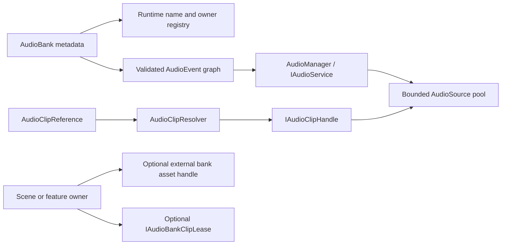

# CycloneGames.Audio

[English | 简体中文](README.SCH.md)

CycloneGames.Audio is a Unity audio package built around `AudioBank` assets and validated `AudioEvent` graphs. It manages a bounded `AudioSource` pool, voice policies, category-aware stealing, mixer snapshots, and parameter-driven playback — all through a main-thread-only `IAudioService` contract and a static `AudioManager` facade.

Derived from Microsoft's [Audio-Manager-for-Unity](https://github.com/microsoft/Audio-Manager-for-Unity), the package keeps ownership explicit: banks own event graphs, callers own bank asset handles and clip residency leases, and the audio manager owns runtime playback state.

## Table of Contents

- [Overview](#overview)
- [Architecture](#architecture)
- [Quick Start](#quick-start)
- [Core Concepts](#core-concepts)
- [Usage Guide](#usage-guide)
- [Advanced Topics](#advanced-topics)
- [Common Scenarios](#common-scenarios)
- [Performance and Memory](#performance-and-memory)
- [Troubleshooting](#troubleshooting)

## Overview

Create an `AudioBank` asset, author event graphs in the Audio Graph editor, assign `AudioClip` references (embedded or external), and play events by asset reference or registered name. The runtime pools `AudioSource` objects, bounds voice counts per category, applies parameters and switches per emitter, and schedules state-mix transitions.

The runtime assembly has one direct dependency: UniTask. Integration with AssetManagement, Addressables, or YooAsset happens at the composition boundary through the `IAudioClipProvider` resolver contract.

### Key Features

- **Graph-based authoring** in a dedicated Audio Graph editor with drag-and-drop node connections, Undo/Redo, and bank validation.
- **Bounded source pool** with category-aware voice limits, stealing, and platform-specific pool profiles.
- **AudioSwitch, AudioParameter, state groups, and state-mix profiles** for runtime control without touching individual events.
- **External clip loading** via built-in file/URL handling or a caller-supplied `IAudioClipProvider` — each clip tracked with reference-counted handles.
- **Emitter-scoped parameters**: set per-GameObject overrides that follow the emitter until explicitly cleared.
- **Deterministic bank clip residency** through `IAudioBankClipLease` — load every external clip a bank references before anyone plays it.
- **DSP-scheduled playback** via `PlayEventScheduled` against `AudioSettings.dspTime`.

## Architecture

| Assembly | Path | Purpose |
| --- | --- | --- |
| `CycloneGames.Audio.Runtime` | `Runtime/` | `AudioManager`, `IAudioService`, bank/event models, graph execution, source pool, voice policy, clip resolver, residency leases. Depends on `UniTask`. |
| `CycloneGames.Audio.Editor` | `Editor/` | Audio Graph, custom inspectors, validation, diagnostics, preview, profiler. Editor-only. |
| `CycloneGames.Audio.Tests.Editor` | `Tests/Editor/` | EditMode tests for path validation, resolver ownership, bank ownership, random selection. |


```mermaid
flowchart LR
    Bank["AudioBank metadata"] --> Registry["Runtime name and owner registry"]
    Bank --> Event["Validated AudioEvent graph"]
    Event --> Manager["AudioManager / IAudioService"]
    Manager --> Pool["Bounded AudioSource pool"]
    Ref["AudioClipReference"] --> Resolver["AudioClipResolver"]
    Resolver --> Lease["IAudioClipHandle"]
    Lease --> Pool
    Owner["Scene or feature owner"] --> BankHandle["Optional external bank asset handle"]
    Owner --> Residency["Optional IAudioBankClipLease"]
```

The three ownership lines on the right are independent: registry membership, the asset system's bank handle, and external clip residency have different lifetimes.

### Core types

| Type | Role |
| --- | --- |
| `AudioManager` / `IAudioService` | Unity lifecycle owner and public playback/control service |
| `IAudioLifecyclePauseControl` | Optional capability for releasing `LifecycleHold` pauses |
| `AudioBank` | Serialized aggregate for events, parameters, switches, state groups, state-mix profiles |
| `AudioEvent` / `AudioNode` / `AudioOutput` | Authored graph, executable nodes, and final output settings |
| `ActiveEvent` / `AudioHandle` | Pooled playback state and generation-safe long-lived control token |
| `AudioClipReference` | Authored or runtime-created external clip location |
| `AudioClipResolver` / `IAudioClipHandle` | Provider selection and reference-counted clip ownership |
| `IAudioBankClipLeaseProvider` / `IAudioBankClipLease` | Optional capability for caller-owned bank clip residency |
| `AudioPoolConfig`, `AudioPlatformProfile`, `AudioVoicePolicyProfile` | Assets for pool, platform, and voice-policy configuration |

## Quick Start

### 1. Set up the manager

Add an `AudioManager` component to your runtime scene. Keep an `AudioListener` in the scene and assign mixer or profile assets as needed.

```csharp
using CycloneGames.Audio.Runtime;

IAudioService audio = audioManagerComponent;
AudioManager.SetInstance(audioManagerComponent);
```

All audio service and resolver calls require the Unity main thread.

### 2. Author a bank

1. **Create > CycloneGames > Audio > Audio Bank**.
2. Select the asset and click **Open in Graph** (or **Window > Audio Graph** and assign the bank).
3. Add an event, add an `AudioFile` node, assign an `AudioClip`, and connect the node to the event output.
4. Click **Validate Bank** and fix errors.
5. Click **Save Bank** to persist.

### 3. Play an event

`PlayEvent` returns a pooled `ActiveEvent`. Convert to `AudioHandle` for long-lived control:

```csharp
using CycloneGames.Audio.Runtime;
using UnityEngine;

public sealed class AudioExample : MonoBehaviour
{
    [SerializeField] private AudioEvent jumpEvent;
    private AudioHandle playback;

    public void PlayJump()
    {
        ActiveEvent active = AudioManager.PlayEvent(jumpEvent, gameObject);
        playback = active != null ? active.Handle : default;
    }

    public void StopJump()
    {
        playback.Stop();
        playback = default;
    }
}
```

`AudioHandle` stores a manager slot and generation. It becomes invalid when the pooled event finishes or the slot is reused — it won't accidentally control a later playback.

### 4. Register a bank for name lookup

```csharp
AudioManager.LoadBank(sfxBank);
AudioManager.PlayEvent("Jump_SFX", gameObject);

AudioManager.UnloadBank(sfxBank);
```

Direct asset playback doesn't need name registration. String lookup does. Loading a bank registers metadata and prepares graph data but does not load external clips — use `IAudioBankClipLease` for that.

## Core Concepts

### AudioBank and AudioEvent

An `AudioBank` owns events, parameters, switches, state groups, and state-mix profiles. An `AudioEvent` owns a directed graph — file, blend, voice, random, sequence, and switch nodes feed into an output node that determines playback settings.

Editor validation rejects missing outputs, cycles, duplicate ownership, foreign connections, and oversized graphs. Runtime limits:

| Budget | Limit |
| --- | ---: |
| Nodes per event graph | 1,024 |
| Connections per event graph | 4,096 |
| Graph depth | 128 |
| Sources per `ActiveEvent` | 8 |
| Parameters per `ActiveEvent` | 8 |

These guard against corruption and runaway execution. Author smaller graphs for actual content.

### ActiveEvent lifecycle

An event with embedded clips prepares synchronously. An event with external references enters `Preparing`, loads clips asynchronously, and transitions to `Played` when all sources are ready. A load failure stops the event. Calling `Stop` while preparing cancels it and releases late results.

Each async operation carries the `ActiveEvent` generation that started it — a stale completion cannot attach a clip to a recycled pooled event. `AudioHandle.IsPlaying` means the slot/generation is still valid and can be `true` during `Preparing`. Check `ActiveEvent.status` when the distinction matters.

Never retain a raw `ActiveEvent` after playback stops — the same object may be recycled for a different playback. Use `AudioHandle` for anything that outlives the current playback.

### Pause model

Pause state is reason-based. Manual per-event pause, `PauseAll` (`Global`), application pause, focus loss, and lifecycle hold can coexist. `ResumeAll` clears only the `Global` reason.

With `AudioFocusMode.AutoPauseOnly`, regaining focus moves the automatic pause into `LifecycleHold` — call `AudioManager.ResumeLifecyclePausedEvents()` (or use `IAudioLifecyclePauseControl`) when the game is ready to resume.

### Emitter-scoped parameters

Set per-GameObject parameter overrides that follow the emitter:

```csharp
AudioManager.SetParameterValue("EngineRPM", vehicle, rpm);

// Before returning or destroying a pooled emitter:
int removed = AudioManager.ClearScopedParameterValues(vehicle);
```

Explicit cleanup is the normal path. A periodic scan (~every 120 frames) catches destroyed emitters as a leak-safety fallback.

### Three separate lifetimes

| Lifetime | Owner | Released by |
| --- | --- | --- |
| Bank registry metadata | `AudioManager.LoadBank` | `AudioManager.UnloadBank` |
| Bank asset handle | Application composition scope | `IAssetHandle<AudioBank>.Dispose` or equivalent |
| External clip residency | Scene/feature or manager-owned lease | Lease disposal, `ReleasePreloadedBankClips`, bank unload, or playback completion |

Safe shutdown: `UnloadBank` → dispose clip lease → dispose bank asset handle. `OnBankUnloaded` fires after registry transition.

## Usage Guide

### AudioClipReference locations

`AudioFile`, `AudioVoiceFile`, and `AudioBlendFile` support two source modes:

- **EmbeddedClip**: the `AudioClip` is a serialized dependency of the graph.
- **ExternalReference**: an `AudioClipReference` is resolved at playback time.

| `AudioLocationKind` | Meaning |
| --- | --- |
| `FilePath` | Explicit path understood by the built-in loader |
| `StreamingAssetsPath` | Relative path under `Application.streamingAssetsPath` |
| `PersistentDataPath` | Relative path under `Application.persistentDataPath` |
| `Url` | Absolute HTTP/HTTPS URI |
| `AssetAddress` | Logical key for an application-supplied provider |

All locations reject empty/null values and strings over 4,096 characters. `FilePath` and `AssetAddress` are trust boundaries — the package does not sandbox or authenticate them.

Authored `AudioClipReference` assets are immutable at runtime. Create a caller-owned reference for runtime-assigned locations:

```csharp
AudioClipReference runtimeRef = AudioClipReference.CreateRuntime(
    AudioLocationKind.AssetAddress,
    "Audio/SFX/Jump");

runtimeRef.TrySetLocation(
    AudioLocationKind.AssetAddress,
    "Audio/SFX/Jump_Variant");

Object.Destroy(runtimeRef); // Main thread only
```

### External clip resolvers

The built-in resolver chain gives priority 300 to a per-reference loader, 200 to a per-location-kind loader, and 100 to the built-in file/URL provider. Register a custom `IAudioClipProvider` at your own priority.

Use scoped leases for cleanup-safe registration:

```csharp
IDisposable registration = AudioClipResolver.RegisterManagedLocationKindLoaderScoped(
    AudioLocationKind.AssetAddress,
    LoadManagedClipAsync);

// Dispose on the main thread when the scope ends.
registration.Dispose();
```

Leases remove only their own loader — disposing an older lease doesn't affect a newer replacement.

### Bridging AssetManagement

```csharp
public sealed class AudioClipAssetBridge : IDisposable
{
    private readonly IAssetPackage package;
    private readonly IDisposable registration;

    public AudioClipAssetBridge(IAssetPackage package)
    {
        this.package = package;
        registration = AudioClipResolver.RegisterManagedLocationKindLoaderScoped(
            AudioLocationKind.AssetAddress,
            LoadAsync);
    }

    private async UniTask<ManagedAudioClipLoadResult> LoadAsync(
        AudioClipReference reference, CancellationToken token)
    {
        IAssetHandle<AudioClip> handle = package.LoadAssetAsync<AudioClip>(
            reference.Location, owner: "CycloneGames.Audio", cancellationToken: token);
        if (handle == null) return default;

        try
        {
            await handle.Task;
            AudioClip clip = handle.Asset;
            if (clip == null) { handle.Dispose(); return default; }
            return new ManagedAudioClipLoadResult(clip, handle.Dispose);
        }
        catch { handle.Dispose(); throw; }
    }

    public void Dispose() => registration.Dispose();
}
```

The same ownership pattern adapts to Addressables, YooAsset, or any provider.

## Advanced Topics

### Deterministic bank clip residency

Load every external clip a bank references before playback:

```csharp
IAudioBankClipLeaseProvider residency = audioService as IAudioBankClipLeaseProvider;
IAudioBankClipLease lease = residency != null
    ? await residency.AcquireBankClipLeaseAsync(bank, token)
    : null;

Debug.Log($"Loaded {lease?.LoadedCount ?? 0}, failed {lease?.FailedCount ?? 0}");
lease?.Dispose(); // Main thread
```

`PreloadBankClipsAsync` is a convenience wrapper that retains the lease until explicit release, bank unload, or manager cleanup.

### Built-in external cache

The built-in file/URL provider coalesces requests by `(LocationKind, Location, Version)` and reference-counts active handles. Tune these from measured platform budgets:

| Setting | Default | Purpose |
| --- | ---: | --- |
| `ExternalClipMemoryBudgetBytes` | `0` | Unused residency budget; `0` = don't retain unused clips |
| `ExternalClipMaxDownloadBytes` | 64 MiB | Per-request encoded byte limit |
| `ExternalClipMaxDecodedBytes` | 256 MiB | Per-clip estimated decoded PCM limit |
| `ExternalClipRequestTimeoutSeconds` | 30 s | `UnityWebRequest` timeout |
| `ExternalClipIdleTTL` | 30 s | Unused entry TTL when retention is enabled |

Set via `AudioManager.ExternalClipMemoryBudgetBytes` etc. The decoded-size estimate is `samples * channels * sizeof(float)` — it does not account for native decoder or platform audio memory overhead.

### Bank name collision rules

- First registered bank wins as fallback.
- A later bank replaces it only with `overwriteExisting: true`.
- Unloading the effective owner restores the previous contributor.

Shared `AudioEvent`, `AudioParameter`, and `AudioSwitch` objects are reference-counted across banks. Unloading one bank only removes an object when it was the final owner.

### DSP-scheduled playback

```csharp
AudioManager.PlayEventScheduled(musicEvent, gameObject, targetDspTime);
```

Sources follow Unity's DSP scheduler. Snapshot transitions are applied from the first `Update` whose `dspTime` reaches the requested start — DSP-scheduled for sources, frame-aligned for snapshots.

## Common Scenarios

### Footstep sounds with random variation

Create one `AudioEvent` with a `RandomSelector` node and multiple `AudioFile` children. Call `PlayEvent` from the footstep system — the selector picks a different clip each time.

### Engine RPM via emitter-scoped parameters

```csharp
AudioManager.SetParameterValue("EngineRPM", vehicle, currentRpm);
```

Update from `Update()` / `FixedUpdate()`. Clear before despawning the vehicle with `ClearScopedParameterValues(vehicle)`.

### Asset-management-driven bank lifecycle

```csharp
IAssetHandle<AudioBank> bankHandle = package.LoadAssetAsync<AudioBank>("Banks/Combat");
await bankHandle.Task;
AudioManager.LoadBank(bankHandle.Asset);

// ... gameplay ...

AudioManager.UnloadBank(bankHandle.Asset);
bankHandle.Dispose();
```

### Preload before combat

```csharp
IAudioBankClipLease lease = await residencyProvider
    .AcquireBankClipLeaseAsync(combatBank, token);
// All external clips are loaded — combat can start.
// After combat: lease.Dispose();
```

## Performance and Memory

The runtime pools `ActiveEvent` and `AudioSource` objects, uses fixed per-event source/parameter arrays, caches prepared event data, and bounds graph execution and bank scans. Initialization, pool growth, async state machines, external providers, collection growth, Unity object creation, and audio decoding can still allocate. Profile representative graphs, voice counts, codecs, and asset-provider behavior in target Players before setting budgets.

The Runtime asmdef has no platform exclusions and requires no unsafe code, dynamic code generation, or runtime reflection. Target backend verification — codec support, StreamingAssets behavior, focus/pause transitions, pool limits, latency, memory — is required for each shipping platform.

## Troubleshooting

| Symptom | Cause | Fix |
| --- | --- | --- |
| `InvalidOperationException`: main thread required | Worker called audio APIs | Marshal to Unity main thread before calling |
| External event stuck in `Preparing` | Provider hasn't completed or resumed on main thread | Inspect provider task/error; fix completion and thread ownership |
| `AssetAddress` doesn't play | No loader accepted the key | Register a resolver lease for `AssetAddress` |
| `SetLocation` throws | Reference is immutable | Use `TrySetLocation` or `CreateRuntime` |
| Path rejected | Rooted, contains `..`, empty, too long, or has null chars | Store a safe relative path |
| Preloaded clips persist | Manager owns the preload lease | `ReleasePreloadedBankClips(bank)` or unload the bank |
| Shared event persists after bank unload | Another bank still owns the same object | Unload remaining owner or stop explicitly |
| Name resolves to old asset after unload | Fallback restored a previous contributor | Fix duplicate names or review load order/overwrite policy |
| Managed clip cached after audio release | External provider retained it | Inspect provider cache; audio release doesn't dictate external eviction |
| Build fails | Bank has validation errors | Run **Validate All Audio Banks**, fix errors |
| Graph changes not on disk | Routine edits don't auto-save | Use **Save Bank** or project save workflow |

## Validation

Editor tests:
```text
<UnityEditor> -batchmode -nographics -projectPath <repo-root>/UnityStarter \
  -runTests -testPlatform EditMode \
  -assemblyNames CycloneGames.Audio.Tests.Editor -testResults <result-path> -quit
```

Manual checks:
1. Create a bank, add/move/connect/delete/Undo/Redo nodes. Confirm cycles are rejected.
2. Preview an event, switch banks — confirm the prior preview stops.
3. Play/stop embedded and external events, including stop-during-load scenarios.
4. Load overlapping banks with both overwrite policies, verify fallback behavior.
5. Build each target Player and profile allocation, voice pressure, and latency.

## References

- Derived from Microsoft [Audio-Manager-for-Unity](https://github.com/microsoft/Audio-Manager-for-Unity) 0.3.0 (MIT). Attribution: [THIRD_PARTY_NOTICES.md](THIRD_PARTY_NOTICES.md).
- [Unity AudioMixer](https://docs.unity3d.com/Manual/class-AudioMixer.html)
- [Unity AudioSettings.dspTime](https://docs.unity3d.com/ScriptReference/AudioSettings-dspTime.html)
- [UnityWebRequest audio](https://docs.unity3d.com/ScriptReference/Networking.UnityWebRequestMultimedia.GetAudioClip.html)
