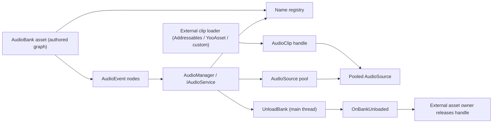

# CycloneGames.Audio

[English | 简体中文](README.SCH.md)

CycloneGames.Audio is a Unity audio authoring and runtime package built around `AudioBank` / `AudioEvent` graphs, a bounded `AudioSource` pool, category-aware voice stealing, and a bounded worker-thread command queue. It exposes both a static `AudioManager` facade and an `IAudioService` interface for DI composition, with an explicit `OnBankUnloaded` lifecycle that integrates with external asset systems. Portions are derived from Microsoft's [Audio-Manager-for-Unity](https://github.com/microsoft/Audio-Manager-for-Unity) under the MIT License.

## Table of Contents

- [Overview](#overview)
- [Architecture](#architecture)
- [Quick Start](#quick-start)
- [Core Concepts](#core-concepts)
- [Usage Guide](#usage-guide)
- [Advanced Topics](#advanced-topics)
- [Common Scenarios](#common-scenarios)
- [Performance and Memory](#performance-and-memory)
- [Troubleshooting](#troubleshooting)

## Overview

A game audio system answers two questions: which sound should play, and which `AudioSource` should play it. CycloneGames.Audio separates authoring (the `AudioBank` / `AudioEvent` graph edited in the Editor) from runtime dispatch (`AudioManager` / `IAudioService`), and from physical playback (a pooled set of `AudioSource` components). The owner authors event graphs and calls play/stop APIs; the manager resolves clip references, picks a voice from the pool, applies category-aware stealing, and tracks the active event until it stops.

The module targets Unity projects that need centralised SFX and music control without adopting a full middleware stack. It supports direct clip references, external clip loaders (Addressables, YooAsset, custom loaders), `UniTask`-based preload, platform-aware pool sizing, and worker-thread submission for a small set of command-style entry points. Unity audio objects and manager state remain main-thread-owned; only the queued commands listed in [Command Submission](#command-submission-and-main-thread-ownership) accept worker-thread submission.

Use this module when the project needs a single audio service that combines bank authoring, pooling, voice policy, and external asset integration. Do not use it as a cryptographic or timing-precise audio synthesis layer — Unity's DSP clock and `AudioSettings.dspTime` drive scheduling, and the manager does not guarantee sample-accurate timing beyond what `PlayEventScheduled` provides.

### Key Features

- **AudioGraph authoring**: Node-connection editing with `Alt + Left Mouse Button` to remove one or all connections on a node.
- **Selector authoring**: `SequenceSelector`, `SwitchSelector`, `RandomSelector` with explicit branch mapping, node-Y sorting, weights, and repeat control.
- **Dual access model**: `IAudioService` for explicit DI composition, plus static `AudioManager` entry points for direct access.
- **Bounded `AudioSource` pool**: Configurable initial/maximum sizes, runtime expansion, category-aware voice stealing, idle shrinking.
- **External clip loading**: `UniTask` APIs for external clip resolution and bank preloading; playback and control APIs remain synchronous.
- **Platform profiles**: Source-defined pool and update profiles for WebGL, Android/iOS, desktop, and selected console compiler symbols.
- **Bank unload ordering**: `OnBankUnloaded` is raised after the main-thread unload path stops matching events, clears their pooled source clips, and removes registry entries.
- **Bounded worker submission**: Selected commands use a `lock`-protected, fixed-capacity ring buffer and execute on the main thread.
- **Runtime statistics**: Pool, registry, queue, and external clip-cache counters for diagnostics.

## Architecture

The module is split into Runtime, Editor, and Tests assemblies:

| Assembly | Path | Purpose |
| --- | --- | --- |
| `CycloneGames.Audio.Runtime` | `Runtime/` | `AudioManager`, `IAudioService`, `AudioBank`, `AudioEvent`, pool, voice policy, external clip resolution. Depends on `UniTask`. |
| `CycloneGames.Audio.Editor` | `Editor/` | `AudioGraph` window, inspectors for `AudioBank`, `AudioPlatformProfile`, `AudioPoolConfig`, `AudioVoicePolicyProfile`, runtime dashboard, profiler. |
| `CycloneGames.Audio.Tests.Editor` | `Tests/Editor/` | `AudioClipReferencePathTests`, `AudioRandomSelectionTests`. |


```mermaid
flowchart LR
    Bank["AudioBank asset (authored graph)"] --> Event["AudioEvent nodes"]
    Event --> Manager["AudioManager / IAudioService"]
    Manager --> Registry["Name registry"]
    Bank --> Registry
    Manager --> Pool["AudioSource pool"]
    Pool --> Source["Pooled AudioSource"]
    External["External clip loader (Addressables / YooAsset / custom)"] --> Clip["AudioClip handle"]
    Clip --> Source
    Manager --> Unload["UnloadBank (main thread)"]
    Unload --> Callback["OnBankUnloaded"]
    Callback --> Owner["External asset owner releases handle"]
```

The owner authors event graphs in `AudioBank` assets and calls play/stop APIs. `AudioManager` resolves clip references (direct or via registered external loaders), acquires a voice from the pool, applies category-aware stealing when the pool is exhausted, and tracks the `ActiveEvent` until it stops or is stolen. `UnloadBank` runs on the main thread and raises `OnBankUnloaded` after all clip references are cleared, giving external asset owners a safe release boundary.

## Quick Start

Add an asmdef reference to `CycloneGames.Audio.Runtime`, then import the namespace:

```csharp
using CycloneGames.Audio.Runtime;
```

### Create an AudioEvent asset

1. In the Project window, right-click and select **Create > CycloneGames > Audio > Audio Bank**.
2. Open the bank, add an `AudioFile` node, and assign an `AudioClip`.
3. The bank's root `AudioEvent` is now ready to play.

### Play a sound effect

```csharp
using CycloneGames.Audio.Runtime;
using UnityEngine;

public class AudioExample : MonoBehaviour
{
    [SerializeField] private AudioEvent jumpEvent;
    [SerializeField] private AudioEvent machineGunEvent;

    void Start()
    {
        // One-shot
        AudioManager.PlayEvent(jumpEvent, gameObject);

        // Play and keep a handle for later control
        ActiveEvent handle = AudioManager.PlayEvent(machineGunEvent, gameObject);
        StartCoroutine(StopAfterDelay(handle, 5f));
    }

    private System.Collections.IEnumerator StopAfterDelay(ActiveEvent handle, float delay)
    {
        yield return new WaitForSeconds(delay);
        handle?.Stop();
    }
}
```

### Play music

```csharp
using CycloneGames.Audio.Runtime;
using UnityEngine;

public class MusicController : MonoBehaviour
{
    [SerializeField] private AudioEvent backgroundMusic;

    void Start() => AudioManager.PlayEvent(backgroundMusic, gameObject);
    public void StopMusic() => AudioManager.StopAll(backgroundMusic);
}
```

### Use with dependency injection

```csharp
using CycloneGames.Audio.Runtime;
using UnityEngine;

public class AudioConsumer
{
    private readonly IAudioService _audio;

    public AudioConsumer(IAudioService audio) => _audio = audio;

    public void PlayJump(GameObject emitter, AudioEvent jumpEvent)
        => _audio.PlayEvent(jumpEvent, emitter);

    public void SetMusicVolume(float volumeDb)
        => _audio.SetMixerVolume("MusicVolume", volumeDb);
}
```

Register `AudioManager` as `IAudioService` (VContainer example):

```csharp
builder.RegisterComponentInHierarchy<AudioManager>().As<IAudioService>();

// Or register an externally-created instance
AudioManager.SetInstance(myAudioManagerInstance);
```

### Load and play by name

```csharp
using CycloneGames.Audio.Runtime;
using UnityEngine;

public class BankExample : MonoBehaviour
{
    [SerializeField] private AudioBank sfxBank;

    void Start()
    {
        AudioManager.LoadBank(sfxBank);                 // registers events for name lookup
        AudioManager.PlayEvent("Jump_SFX", gameObject); // play by registered name
    }

    void OnDestroy() => AudioManager.UnloadBank(sfxBank);
}
```

## Core Concepts

### AudioBank and AudioEvent

An `AudioBank` is a ScriptableObject that owns a graph of audio nodes. The root node is an `AudioEvent`; child nodes (`AudioFile`, `AudioSequenceSelector`, `AudioSwitchSelector`, `AudioRandomSelector`, `AudioBlendContainer`, etc.) define the event's playback logic. The same `AudioEvent` asset can be referenced directly or registered by name via `LoadBank`.

### AudioManager and IAudioService

`AudioManager` is a `MonoBehaviour` singleton that owns the `AudioSource` pool, the name registry, the parameter and state stores, and the worker-thread command queue. It implements `IAudioService`, so DI consumers depend on the interface and the composition root decides the instance. Static methods on `AudioManager` (for example `PlayEvent`, `StopAll`, `LoadBank`) forward to the singleton and cover direct-access workflows.

### ActiveEvent and AudioHandle

`PlayEvent` returns an `ActiveEvent` — a pooled runtime object that owns the `AudioSource` assigned to the playback and exposes `Stop()`, `StopImmediate()`, `Pause()`, `Resume()`, `SetMute(bool)`, `SetSolo(bool)`, `IsPaused`, and `EstimatedRemainingTime`. A `null` return means playback failed (pool exhausted with no stealeable voice, missing clip, or invalid emitter).

`AudioHandle` is a lightweight struct that references an `ActiveEvent` without a strong reference. Use it when the holder may outlive the playback: `IsValid`, `Stop()`, `StopImmediate()`, `IsPlaying`, `EstimatedRemainingTime`.

### AudioSource Pool

`AudioManager` creates an initial set of `AudioSource` components, reuses returned sources, expands up to the configured maximum, applies category-aware voice-steal scoring when exhausted, and can destroy idle sources back toward the initial size. Sizing is selected from platform compiler symbols and RAM thresholds.

| Platform | Condition | Initial | Max |
| --- | --- | ---: | ---: |
| WebGL | Always | 16 | 32 |
| Mobile | RAM < 3GB | 32 | 48 |
| Mobile | RAM 3-6GB | 32 | 64 |
| Mobile | RAM > 6GB | 32 | 96 |
| Desktop | RAM < 8GB | 80 | 128 |
| Desktop | RAM 8-16GB | 80 | 192 |
| Desktop | RAM > 16GB | 80 | 256 |
| Switch | Always | 32 | 64 |
| Console (PS/Xbox) | Always | 64 | 192 |

These are source defaults and tuning seeds, not measured platform budgets. Profile representative content and override via `AudioPoolConfig` when the target hardware, Unity audio backend, or voice mix requires different limits.

### Category and Voice Policy

`AudioEvent` uses a two-layer voice policy model:

- `Category` selects a high-level runtime intent (`CriticalUI`, `GameplaySFX`, `Voice`, `Ambient`, `Music`).
- `Use Category Defaults` applies a built-in voice policy template for that category.
- Per-event overrides are only needed for special cases.

Built-in category defaults:

| Category | Steal Resistance | Budget Weight | Allow Voice Steal | Allow Distance Steal | Protect Scheduled |
| --- | ---: | ---: | :---: | :---: | :---: |
| `CriticalUI` | 2.2 | 1.5 | false | false | true |
| `GameplaySFX` | 1.0 | 1.0 | true | true | true |
| `Voice` | 1.5 | 1.35 | true | false | true |
| `Ambient` | 0.7 | 0.7 | true | true | false |
| `Music` | 2.6 | 1.8 | false | false | true |

When the pool is exhausted, eligible voices are compared using category, policy, priority, age, distance, and budget data; the lowest-scoring voice is stolen. Disable `Use Category Defaults` only when an event needs custom behavior beyond its category template.

### Command Submission and Main-Thread Ownership

`AudioManager`, `ActiveEvent`, Unity objects, configuration reloads, parameter state, mixer access, runtime statistics, and event subscription are main-thread-owned. Worker-thread submission is implemented only for these command-style static entry points:

- `PlayEvent` and `PlayEventScheduled`
- `StopAll`
- `SetState`
- `ExecuteActionEvent`
- `LoadBank`, `UnloadBank`, and `ClearEventNameMap`

The submission queue is a preallocated `AudioCommand[4096]` ring protected by `lock`. `AudioManager.Update` consumes at most 16, 64, or 128 commands per frame according to queue depth. When the queue is full, the new command is dropped; the first five drops are logged only in Editor or Development builds.

Worker-thread submission does not provide completion, backpressure, or a result. Worker-thread `PlayEvent` / `PlayEventScheduled` returns `null`; the Boolean return from `SetState(string, string)` only reports that its initial string checks passed — the command can still be dropped. Queued Unity object references must remain valid until execution. Callers that require a result, handle, cancellation, or guaranteed delivery must marshal that workflow to the main thread explicitly.

### AudioClipReference and External Loaders

`AudioClipReference` supports multiple source styles:

- `FilePath`
- `StreamingAssetsPath`
- `PersistentDataPath`
- `Url`
- `AssetAddress`

Path/URL modes are loaded directly by the audio system. `AssetAddress` is a logical key, not a local file path; for `AssetAddress`, register a runtime loader (see [External Clip Loaders](#external-clip-loaders)).

## Usage Guide

### Playing events

```csharp
// By AudioEvent asset, attached to a GameObject for 3D tracking
ActiveEvent handle = AudioManager.PlayEvent(jumpEvent, gameObject);

// By AudioEvent asset, at a fixed world position
ActiveEvent handle2 = AudioManager.PlayEvent(jumpEvent, new Vector3(0, 5, 0));

// By registered name
AudioManager.PlayEvent("Jump_SFX", gameObject);

// Scheduled against Unity's DSP clock (sample-accurate sync)
AudioManager.PlayEventScheduled(musicEvent, gameObject, AudioSettings.dspTime + 0.5);
```

### Stopping, pausing, and resuming

```csharp
// Stop one event (with configured fade-out)
handle.Stop();
handle.StopImmediate();

// Stop all instances of an event / name / group
AudioManager.StopAll(jumpEvent);
AudioManager.StopAll("Jump_SFX");
AudioManager.StopAll(groupNum: 1); // mutually exclusive playback groups

// Global pause/resume
AudioManager.PauseAll();
AudioManager.ResumeAll();

// Per-event pause/resume
AudioManager.PauseEvent(handle);
AudioManager.ResumeEvent(handle);

bool playing = AudioManager.IsEventPlaying("Jump_SFX");
```

### Parameters, states, and mixer volumes

```csharp
// Global game parameter (RTPC equivalent)
AudioManager.SetParameterValue("Distance", 12.5f);
AudioManager.SetParameterValue("Distance", emitterObject, 8f); // emitter-scoped override
bool found = AudioManager.TryGetParameterValue("Distance", out float current);

// Global audio state (switch equivalent)
AudioManager.SetState("Surface", "Wood");

// AudioMixer exposed parameters, in decibels
AudioManager.SetMixerParameter("MusicVolume", -6f);   // static helper
_audio.SetMixerVolume("MusicVolume", -6f);            // via IAudioService

// Master volume via AudioListener.volume (0–1, post-mixer)
AudioManager.SetGlobalVolume(0.8f);
```

### Bank load and unload

```csharp
AudioManager.LoadBank(sfxBank);                       // register events by name
AudioManager.LoadBank(sfxBank, overwriteExisting: true);
AudioManager.UnloadBank(sfxBank);                     // stops events, clears clips, raises OnBankUnloaded
```

`UnloadBank` on the main thread: stops active events whose root belongs to the bank, resets their pooled `AudioSource` instances and clears `clip` references, removes the bank's events from the name registry, then raises `OnBankUnloaded`. A worker-thread call only submits an unload command and returns before cleanup; use the event, not the method return, as the external release boundary.

### Pool configuration

Override built-in pool sizing with a config asset:

1. Create via **Create → CycloneGames → Audio → Audio Pool Config**.
2. Place it in `Assets` (Editor auto-discovers) or in a `Resources` folder for builds.
3. Only one `AudioPoolConfig` should exist in the project.

For projects using YooAsset or Addressables, supply the config at runtime:

```csharp
// Before AudioManager initializes
var handle = YooAssets.LoadAssetAsync<AudioPoolConfig>("AudioPoolConfig");
await handle.Task;
AudioPoolConfig.SetConfig(handle.AssetObject as AudioPoolConfig);

// After AudioManager initializes, apply the new limits
AudioManager.ReloadPoolConfig();
```

`ReloadPoolConfig()` updates pool size limits but preserves existing `AudioSource` instances.

### Runtime monitoring

```csharp
Debug.Log($"Pool: {AudioManager.PoolStats.InUse}/{AudioManager.PoolStats.CurrentSize}");
Debug.Log($"Max: {AudioManager.PoolStats.MaxSize}, Tier: {AudioManager.PoolStats.DeviceTier}");
Debug.Log($"Peak: {AudioManager.PoolStats.PeakUsage}, Steals: {AudioManager.PoolStats.TotalSteals}");

var stats = AudioManager.GetRuntimeStats(); // pool, registry, queue, external cache counters
```

The AudioManager Inspector also displays real-time pool statistics during Play Mode.

## Advanced Topics

### External Clip Loaders

When `AudioClipReference` uses `AssetAddress` (or another logical key), register a loader that resolves the key to an `AudioClip` and returns a release callback. The audio system calls `Release()` when the clip is no longer used (event stop, event recycle, bank unload, async cancellation cleanup).

**Per-reference loader:**

```csharp
AudioClipResolver.RegisterManagedReferenceLoader(audioClipReference, async (clipRef, ct) =>
{
    var handle = await myAssetSystem.LoadAudioClipAsync(clipRef.Location, ct);
    if (handle == null || handle.Asset == null) return default;

    return new ManagedAudioClipLoadResult(handle.Asset, () => handle.Release());
});
```

**Per-location-kind loader** (one loader covers `AssetAddress`, YooAsset, Addressables, etc.):

```csharp
AudioClipResolver.RegisterManagedLocationKindLoader(AudioLocationKind.AssetAddress, async (clipRef, ct) =>
{
    var handle = await myAssetSystem.LoadAudioClipAsync(clipRef.Location, ct);
    if (handle == null || handle.Asset == null) return default;

    return new ManagedAudioClipLoadResult(handle.Asset, () => handle.Release());
});
```

The audio system decides **when** its acquired clip handle is no longer in use; the external asset system decides **how** the underlying resource handle is released. Validate these scenarios when integrating:

- Start playback, then unload the owning bank and confirm the external release callback runs exactly once.
- Start async loading, stop the event before completion, and confirm no dangling handle remains.
- Play the same `AudioClipReference` from multiple instances and confirm the underlying resource is released only after the last instance finishes.
- Force the external loader to fail and confirm cache stats record the failure without leaking a partially initialised handle.

### External Asset Management Integration

`UnloadBank` provides the ordering point for external asset owners such as CycloneGames.AssetManagement, Addressables, or a custom loader. External owners should release the bank handle from `OnBankUnloaded`.

**CycloneGames.AssetManagement:**

```csharp
using CycloneGames.Audio.Runtime;
using CycloneGames.AssetManagement.Runtime;

public class AudioAssetBridge
{
    private readonly IAssetModule _assets;
    private readonly IAudioService _audio;
    private readonly Dictionary<AudioBank, IAssetHandle<AudioBank>> _bankHandles = new();

    public AudioAssetBridge(IAssetModule assets, IAudioService audio)
    {
        _assets = assets;
        _audio = audio;
        _audio.OnBankUnloaded += OnBankUnloaded;
    }

    public async UniTask LoadBankAsync(string bankAddress)
    {
        var handle = await _assets.LoadAssetAsync<AudioBank>(bankAddress);
        _bankHandles[handle.Asset] = handle;
        _audio.LoadBank(handle.Asset);
    }

    public void UnloadBank(AudioBank bank) => _audio.UnloadBank(bank);

    private void OnBankUnloaded(AudioBank bank)
    {
        if (_bankHandles.TryGetValue(bank, out var handle))
        {
            handle.Release();
            _bankHandles.Remove(bank);
        }
    }
}
```

**Addressables (direct):**

```csharp
using CycloneGames.Audio.Runtime;
using UnityEngine.AddressableAssets;

public class AddressablesAudioBridge
{
    private readonly Dictionary<AudioBank, AsyncOperationHandle<AudioBank>> _handles = new();

    public void Initialize()
    {
        AudioManager.OnBankUnloaded += bank =>
        {
            if (_handles.TryGetValue(bank, out var handle))
            {
                Addressables.Release(handle);
                _handles.Remove(bank);
            }
        };
    }

    public async UniTask LoadBankAsync(string address)
    {
        var handle = Addressables.LoadAssetAsync<AudioBank>(address);
        var bank = await handle.Task;
        _handles[bank] = handle;
        AudioManager.LoadBank(bank);
    }

    public void UnloadBank(AudioBank bank) => AudioManager.UnloadBank(bank);
}
```

### Selector Authoring

Selector nodes keep branch semantics visible in larger graphs.

| Node | Best Use Case | Authoring Guidance |
| --- | --- | --- |
| `SequenceSelector` | Ordered playback (combo steps, staged VO, deterministic rotations) | Enable `Auto Sort by Node Y` and arrange source nodes top-to-bottom to define playback order visually. |
| `SwitchSelector` | State-driven routing (`Surface`, `WeaponMode`, `Language`) | Prefer named states in `AudioSwitch`; assign each branch explicitly to a state. Do not rely on connection order. |
| `RandomSelector` | Variation pools (footsteps, impacts, repetitive SFX) | Use per-branch `weights` for probability; combine with `Avoid Repeat` for less perceived repetition. |

Authoring checklist: name source nodes explicitly before connecting; keep `Auto Sort by Node Y` enabled so graph layout reflects actual branch order; treat `unassigned` and `duplicate` warnings as shipping blockers; start random pools with equal weights and tune from playtest telemetry.

### Platform Profiles

`AudioPlatformProfile` exposes focus/pause handling, mobile update throttling, culling, LOD, and occlusion tuning per platform. The runtime asmdef has no platform exclusions; source branches provide policies for WebGL, Android/iOS, desktop fallback, and `UNITY_SWITCH`, `UNITY_PS4`, `UNITY_PS5`, `UNITY_XBOXONE`, `UNITY_GAMECORE`. Source presence is not platform validation — validate compilation, audio output, focus/pause behavior, voice limits, memory, and latency on each shipping target.

### Domain Reload

Static reset hooks use `[RuntimeInitializeOnLoadMethod(SubsystemRegistration)]`. Projects that disable domain reload should still verify repeated Play Mode entry, shutdown, loader registration, and cache clearing in their Unity version.

## Common Scenarios

### Footstep variation pool

A character needs varied footstep sounds per surface. Author a single `AudioEvent` with a `RandomSelector` that branches to surface-specific `AudioFile` nodes, and drive surface selection with a global state:

```csharp
// On surface change
AudioManager.SetState("Surface", "Wood");
AudioManager.PlayEvent("Footstep", emitter);
```

Use `Avoid Repeat` on the `RandomSelector` to prevent the same clip playing twice in a row.

### Music layers with switch

A boss fight has intro, loop, and sting layers. Author the `AudioEvent` with a `SwitchSelector` bound to a `MusicPhase` switch, and transition layers by setting the state:

```csharp
AudioManager.SetState("MusicPhase", "Intro");
AudioManager.PlayEvent("BossTheme", emitter);

// Transition to loop
AudioManager.SetState("MusicPhase", "Loop");
```

### Asset-management-driven bank lifecycle

A scene loads its audio banks via Addressables and must release them on scene unload. The bridge holds the bank handle, lets `AudioManager.UnloadBank` clear the audio system's references first, then releases the underlying asset handle from `OnBankUnloaded` (see [External Asset Management Integration](#external-asset-management-integration)).

### DSP-scheduled music transition

Two music events must crossfade at a precise bar boundary. Schedule the incoming event against the DSP clock so it begins exactly on the target sample:

```csharp
double nextBar = AudioSettings.dspTime + ComputeSecondsToNextBar();
AudioManager.PlayEventScheduled(incomingMusic, emitter, nextBar);
AudioManager.StopAll(outgoingMusic); // configured fade-out overlaps with incoming start
```

### Per-emitter parameter override

A vehicle engine's pitch should reflect each vehicle's speed independently. Use an emitter-scoped parameter override so multiple instances of the same `AudioEvent` read different values:

```csharp
AudioManager.SetParameterValue("EngineRPM", vehicleObject, rpm);
AudioManager.PlayEvent("Engine", vehicleObject);
```

## Performance and Memory

| Path | Module-owned allocation | Notes |
| --- | --- | --- |
| Per-event playback | 0 bytes steady-state | Reuses fixed `EventSource[8]`, `ActiveParameter[8]`, pooled `ActiveEvent`, pooled `AudioSource`. |
| Pool expansion / shrinking | Native `AudioSource` creation/destruction | Only at growth or idle-shrink boundaries. |
| Worker-thread command submission | 0 bytes steady-state | Preallocated `AudioCommand[4096]` ring; overflow drops. |
| External clip loading | Caller-owned | Async state machines and external loader allocations belong to the caller. |
| Mixer / parameter / state access | 0 bytes steady-state | Reusable collections, O(1) swap-remove bookkeeping. |

The runtime reuses fixed per-event arrays, pooled `ActiveEvent` objects, pooled `AudioSource` instances, prepared event data, and reusable collections. These choices reduce steady-state managed churn; they do not establish a package-wide zero-allocation guarantee. Initialization, pool expansion and shrinking, collection capacity growth, async state machines, delegate callbacks, diagnostics, and Unity object creation/destruction can allocate or incur native work. Measure representative voice counts, graph shapes, clip sources, and queue contention in Player builds on each target backend before setting a GC or frame-time budget.

### Threading

- `AudioManager`, `ActiveEvent`, Unity objects, configuration reloads, parameter state, mixer access, runtime statistics, and event subscription are main-thread-owned.
- The command-style entry points listed in [Command Submission](#command-submission-and-main-thread-ownership) accept worker-thread submission via a `lock`-protected ring buffer.
- Independent worker submissions do not block each other, but the queue is single-consumer (main-thread `Update`).
- The module does not create threads or choose schedulers.

### Platform Behavior

The Runtime assembly has no platform exclusions and no `UnityEngine`-independent core; it relies on `AudioSource`, `AudioMixer`, and `AudioListener`. Source branches provide policies for WebGL, Android/iOS, desktop fallback, and `UNITY_SWITCH`, `UNITY_PS4`, `UNITY_PS5`, `UNITY_XBOXONE`, `UNITY_GAMECORE`. Validate compilation, audio output, focus/pause behavior, voice limits, memory, and latency on each shipping target. Unlisted future console platforms require an explicit profile and build verification.

### Runtime Diagnostics

`AudioManager.GetRuntimeStats()` and `AudioManager.PoolStats` expose pool, voice, registry, queue, and external cache counters. Some memory and playback counters are compiled only for Editor or Development builds. Use Unity Profiler and platform tooling for allocation, DSP, and native-memory analysis.

## Troubleshooting

| Symptom | Likely cause | Resolution |
| --- | --- | --- |
| `PlayEvent` returns `null` | Pool exhausted and no stealeable voice, missing clip, or invalid emitter | Check `PoolStats`, raise pool max, adjust category steal resistance, or preload clips |
| Worker-thread play has no effect | Queue overflow dropped the command, or the Unity object reference became invalid before execution | Check Editor/Development drop logs, reduce submission rate, or marshal to main thread |
| Bank clips leak after unload | External asset owner released the handle before `OnBankUnloaded` | Release external handles only from `OnBankUnloaded`, not from `UnloadBank` return |
| Same `AudioClipReference` released too early | Multiple instances shared one handle; owner released on first stop | Confirm the external loader's ref-counting covers all instances; the audio system releases only after the last instance finishes |
| `SetParameterValue` has no effect | Parameter name not registered, or wrong scope | Load the bank that registers the parameter; check whether an emitter-scoped override is needed |
| `SetMixerVolume` returns 0 | Mixer not assigned, or parameter not exposed in the AudioMixer | Expose the parameter in the AudioMixer asset and assign the mixer to `AudioManager` |
| Music transition is not sample-accurate | Used `PlayEvent` instead of `PlayEventScheduled` | Use `PlayEventScheduled` against `AudioSettings.dspTime` |
| Voice stealing cuts important sounds | Category too low, or `Protect Scheduled` disabled | Move the event to a higher-resistance category (`CriticalUI`, `Music`) or enable protection |
| Pool keeps growing under load | Max too high, or idle-shrink thresholds too loose | Tune `AudioPoolConfig` for the target platform and profile representative content |

## Validation

Run focused tests from Unity Test Runner:

```text
<UnityEditor> -batchmode -nographics -projectPath <repo-root>/UnityStarter -runTests -testPlatform EditMode -assemblyNames CycloneGames.Audio.Tests.Editor -testResults <result-path> -quit
```

Run `AudioRandomSelectionTests` to verify selector distribution and `AudioClipReferencePathTests` to verify path resolution. Validate external clip loaders, pool sizing, and voice stealing on each shipping Player and scripting backend with representative content.

## References

- [Microsoft Audio-Manager-for-Unity](https://github.com/microsoft/Audio-Manager-for-Unity) — original derivation source, MIT License
- [Unity AudioMixer](https://docs.unity3d.com/Manual/class-AudioMixer.html) — exposed parameters and snapshot transitions
- [Unity AudioSettings.dspTime](https://docs.unity3d.com/ScriptReference/AudioSettings-dspTime.html) — DSP-clock scheduling
