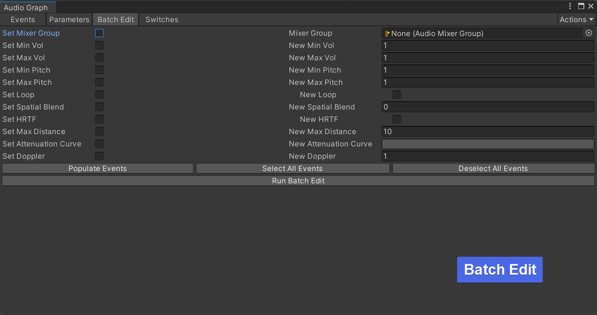

# CycloneGames.Audio

<div align="left">English | <a href="./README.SCH.md">简体中文</a></div>

An enhanced audio management system for Unity. The core logic is sourced from Microsoft's `Audio-Manager-for-Unity`, extended by CycloneGames with a strong focus on performance and memory efficiency.

If you do not plan to use mature middleware such as **Wwise**, **CriWare**, or **FMOD**, this plugin is highly recommended. Its logic for managing and editing audio is similar to **Wwise**, including common Wwise-like features such as **Bank, RTPC, Parameter, and Multi-Bus**, making it more suitable for developers and designers familiar with **Wwise**.

**Upstream Source**: https://github.com/microsoft/Audio-Manager-for-Unity

This version introduces critical optimizations for production environments, including performance monitoring, asynchronous resource loading, and reduced GC (Garbage Collection) overhead.

## Features

- **AudioGraph Redrawing**: A more intuitive and visually appealing AudioGraph editing interface, featuring Unreal Engine-like shortcuts (e.g., Alt + mouse click on connections).
- **Centralized Audio Control**: Manage sound effects and music from a unified API.
- **Smart Audio Pool**: Intelligent AudioSource pool with device-adaptive sizing, auto-expansion, voice stealing, and intelligent shrinking.
- **Performance Monitoring**: In-built hooks and utilities to monitor audio system performance in real-time.
- **Asynchronous Loading**: Integrates `UniTask` for non-blocking, asynchronous loading of audio assets, ensuring smooth gameplay without hitches.
- **GC Optimization**: Reduces runtime memory allocations to minimize garbage collection spikes, crucial for performance-sensitive applications.

## Installation & Dependencies

- Unity: `2022.3`+
- Dependencies:
  - `com.cysharp.unitask` ≥ `2.0.0`

Install via UPM or place the package under `Packages`/`Assets`. See `package.json` in this folder for details.

## Editor Preview

- 
- 
- 

## Quick Start

### 0) Creating AudioEvent Assets

Before you can play audio, you need to create AudioEvent assets in Unity:

1. Right-click in your Project window
2. Select **Create > CycloneGames > Audio > Audio Bank**
3. Configure the internal logic of your AudioEvent using AudioFile nodes and other audio components

### 1) Playing a Sound Effect (SFX)

```csharp
using CycloneGames.Audio.Runtime;
using Cysharp.Threading.Tasks;
using UnityEngine;

public class AudioExample : MonoBehaviour
{
    [SerializeField] private AudioEvent jumpEvent; // Assign in Inspector
    [SerializeField] private AudioEvent machineGunEvent; // Assign in Inspector

    void Start()
    {
        // Play a one-shot sound effect
        AudioManager.PlayEvent(jumpEvent, gameObject);

        // Play a sound and get a handle to control it later
        var audioHandle = AudioManager.PlayEvent(machineGunEvent, gameObject);

        // Stop the looping sound after 5 seconds
        StartCoroutine(StopAfterDelay(audioHandle, 5f));
    }

    private System.Collections.IEnumerator StopAfterDelay(ActiveEvent audioHandle, float delay)
    {
        yield return new WaitForSeconds(delay);
        if (audioHandle != null)
        {
            audioHandle.Stop();
        }
    }
}
```

### 2) Playing Music

```csharp
using CycloneGames.Audio.Runtime;
using UnityEngine;

public class MusicController : MonoBehaviour
{
    [SerializeField] private AudioEvent backgroundMusic; // Assign in Inspector

    void Start()
    {
        // Play background music
        var musicHandle = AudioManager.PlayEvent(backgroundMusic, gameObject);
    }

    public void StopMusic()
    {
        // Stop all instances of the background music
        AudioManager.StopAll(backgroundMusic);
    }
}
```

## API Reference

### AudioManager Static Methods

- `PlayEvent(AudioEvent eventToPlay, GameObject emitterObject)` - Play an AudioEvent on a GameObject
- `PlayEvent(AudioEvent eventToPlay, Vector3 position)` - Play an AudioEvent at a specific position
- `StopAll(AudioEvent eventsToStop)` - Stop all instances of a specific AudioEvent
- `StopAll(int groupNum)` - Stop all events in a specific group
- `ValidateManager()` - Ensure the AudioManager instance exists

### ActiveEvent Methods

- `Stop()` - Stop the event with fade out
- `StopImmediate()` - Stop the event immediately
- `SetMute(bool toggle)` - Mute/unmute the event
- `SetSolo(bool toggle)` - Solo/unsolo the event

## CycloneGames Extensions

This implementation significantly builds upon the original Microsoft audio manager. The key enhancements are:

### AudioGraph Redrawing with Unreal Engine-like Shortcuts

The AudioGraph has been redrawn to enhance the rendering of node connection curves. It now includes shortcuts similar to those in Unreal Engine, such as using `Alt + Left Mouse Button` to delete a single curve or all curves connected to the selected node.

### Asynchronous Operations

All resource-intensive operations, such as loading `AudioClip`s, are performed asynchronously using `UniTask`. This prevents the main thread from blocking, which is essential for eliminating frame rate drops when new sounds are introduced during gameplay.

### GC Optimizations

I have meticulously profiled and optimized the audio system to reduce memory allocations in performance-critical paths, and modified the default memory pool size to better suit different runtime platforms. These changes result in a much lower and more predictable memory footprint, reducing the frequency and impact of garbage collection.

### Performance Monitoring

The system is instrumented to provide memory monitoring data for the **AudioManager**, allowing developers to quickly diagnose audio-related performance issues.

### Smart Audio Pool Management

The audio system features an intelligent AudioSource pool that automatically adapts to different devices and manages resources efficiently.

#### Key Features

| Feature                    | Description                                                                             |
| -------------------------- | --------------------------------------------------------------------------------------- |
| **Device-Adaptive Sizing** | Pool size automatically adjusts based on platform (WebGL/Mobile/Desktop) and device RAM |
| **Auto-Expansion**         | Pool grows dynamically when more sources are needed                                     |
| **Voice Stealing**         | When pool is full, oldest non-looping sound is stopped to free resources                |
| **Intelligent Shrinking**  | Unused sources are gradually released during idle periods                               |
| **Zero GC Allocations**    | AudioSources are never created outside the pool, preventing memory leaks                |

#### Default Pool Sizes

| Platform | Condition  | Initial | Max |
| -------- | ---------- | ------- | --- |
| WebGL    | Always     | 16      | 32  |
| Mobile   | RAM < 3GB  | 32      | 48  |
| Mobile   | RAM 3-6GB  | 32      | 64  |
| Mobile   | RAM > 6GB  | 32      | 96  |
| Desktop  | RAM < 8GB  | 80      | 128 |
| Desktop  | RAM 8-16GB | 80      | 192 |
| Desktop  | RAM > 16GB | 80      | 256 |

#### Custom Configuration (Optional)

By default, the system uses optimal values for your device. To customize:

1. Create a config asset: **Create → CycloneGames → Audio → Audio Pool Config**
2. Place it anywhere in your `Assets` folder
3. Adjust values in the Inspector


> [!NOTE]
>
> - In the **Editor**, the config is auto-discovered from anywhere in the project.
> - For **builds**, place the config in a `Resources` folder for auto-discovery, or it will use default values.
> - Only one `AudioPoolConfig` should exist in the project.

#### Hot-Update Support

For projects using asset management systems like YooAsset or Addressables:

**Option 1: Before AudioManager Initializes** (Recommended)

```csharp
// In bootstrap scene, before AudioManager initializes
var handle = YooAssets.LoadAssetAsync<AudioPoolConfig>("AudioPoolConfig");
await handle.Task;
AudioPoolConfig.SetConfig(handle.AssetObject as AudioPoolConfig);
// AudioManager will automatically use this config when it initializes
```

**Option 2: After AudioManager Initializes**

```csharp
// Load and apply config at runtime
var handle = YooAssets.LoadAssetAsync<AudioPoolConfig>("AudioPoolConfig");
await handle.Task;
AudioPoolConfig.SetConfig(handle.AssetObject as AudioPoolConfig);

// Apply the new config to the running AudioManager
AudioManager.ReloadPoolConfig();
```

> [!NOTE]
> `ReloadPoolConfig()` updates pool size limits but preserves existing AudioSources.

#### Runtime Monitoring

Access pool statistics at runtime:

```csharp
// Check pool status
Debug.Log($"Pool: {AudioManager.PoolStats.InUse}/{AudioManager.PoolStats.CurrentSize}");
Debug.Log($"Max: {AudioManager.PoolStats.MaxSize}");
Debug.Log($"Device Tier: {AudioManager.PoolStats.DeviceTier}");

// Performance metrics
Debug.Log($"Peak Usage: {AudioManager.PoolStats.PeakUsage}");
Debug.Log($"Expansions: {AudioManager.PoolStats.TotalExpansions}");
Debug.Log($"Voice Steals: {AudioManager.PoolStats.TotalSteals}");
```

The AudioManager Inspector also displays real-time pool statistics during Play Mode.
