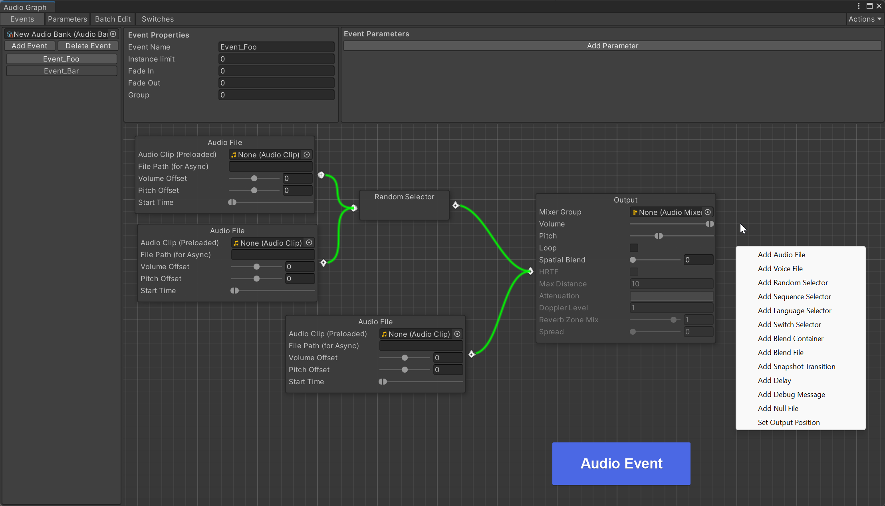

# CycloneGames.Audio

<div align="left">English | <a href="./README.SCH.md">简体中文</a></div>

An enhanced audio management system for Unity. The core logic is sourced from Microsoft's `Audio-Manager-for-Unity`, extended by CycloneGames with a strong focus on performance and memory efficiency. If you do not plan to use mature middleware such as **Wwise**, **CriWare**, or **FMOD**, this plugin is highly recommended. Its logic for managing and editing audio is similar to **Wwise**, including common Wwise-like features such as **Bank, RTPC, Parameter, and Multi-Bus**, making it more suitable for developers and designers familiar with **Wwise**.

**Upstream Source**: https://github.com/microsoft/Audio-Manager-for-Unity

This version introduces critical optimizations for production environments, including performance monitoring, asynchronous resource loading, and reduced GC (Garbage Collection) overhead.

## Features

- **Centralized Audio Control**: Manage sound effects and music from a unified API.
- **Performance Monitoring**: In-built hooks and utilities to monitor audio system performance in real-time.
- **Asynchronous Loading**: Integrates `UniTask` for non-blocking, asynchronous loading of audio assets, ensuring smooth gameplay without hitches.
- **GC Optimization**: Reduces runtime memory allocations to minimize garbage collection spikes, crucial for performance-sensitive applications.

## Installation & Dependencies

- Unity: `2022.3`+
- Dependencies:
  - `com.cysharp.unitask` ≥ `2.0.0`

Install via UPM or place the package under `Packages`/`Assets`. See `package.json` in this folder for details.

## Editor Preview
-   
-   
-   

## Quick Start

### 1) Playing a Sound Effect (SFX)

```csharp
using CycloneGames.Audio;
using Cysharp.Threading.Tasks;

// Play a one-shot sound effect
AudioSystem.PlayOneShot("SFX_Player_Jump");

// Play a sound and get a handle to control it later
var audioHandle = AudioSystem.Play("SFX_Machine_Gun_Loop");

// Stop the looping sound
if (audioHandle.IsValid())
{
    audioHandle.Stop();
}
```

### 2) Playing Music

```csharp
using CycloneGames.Audio;

// Play background music, which will automatically loop
AudioSystem.PlayMusic("Music_Level_1");

// Fade out the music over 2 seconds
AudioSystem.StopMusic(2.0f);
```

## CycloneGames Extensions

This implementation significantly builds upon the original Microsoft audio manager. The key enhancements are:

### Asynchronous Operations

All resource-intensive operations, such as loading `AudioClip`s, are performed asynchronously using `UniTask`. This prevents the main thread from blocking, which is essential for eliminating frame rate drops when new sounds are introduced during gameplay.

### GC Optimizations

I have meticulously profiled and optimized the audio system to reduce memory allocations in performance-critical paths. These changes result in a much lower and more predictable memory footprint, reducing the frequency and impact of garbage collection.

### Performance Monitoring

The system is instrumented to provide memory monitoring data for the **AudioManager**, allowing developers to quickly diagnose audio-related performance issues.
