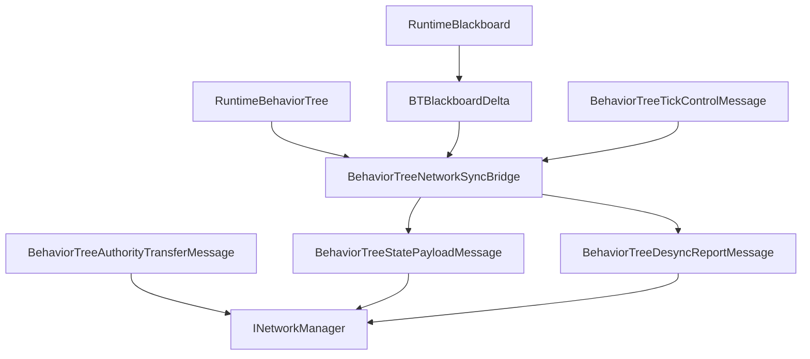

# CycloneGames.BehaviorTree.Networking

[English](./README.md) | 简体中文

`CycloneGames.BehaviorTree.Networking` 将 `CycloneGames.BehaviorTree` 接入 `CycloneGames.Networking`。它提供协议元数据、blackboard snapshot 和 delta 消息、desync report、tick control 消息、authority transfer 消息、profile 配置、authority helper、observer 解析 helper 和 runtime sync bridge。

基础 BehaviorTree 包不依赖 `CycloneGames.Networking`。只有当 behavior tree state 需要跨 Cyclone 网络边界传递时，才需要引用本桥接包。

## 包结构

```text
CycloneGames.BehaviorTree.Networking/
  Core/
    BehaviorTreeNetworkMessages.cs
    BehaviorTreeNetworkProfile.cs
    BehaviorTreeNetworkProtocol.cs
    CycloneGames.BehaviorTree.Networking.Core.asmdef
  Runtime/
    BehaviorTreeNetworkAuthority.cs
    BehaviorTreeNetworkReplication.cs
    BehaviorTreeNetworkSyncBridge.cs
    CycloneGames.BehaviorTree.Networking.Runtime.asmdef
  Tests/Editor/
    BehaviorTreeNetworkingIntegrationTests.cs
    CycloneGames.BehaviorTree.Networking.Tests.Editor.asmdef
```

## 程序集边界

| Assembly | 职责 | Unity 依赖 |
| --- | --- | --- |
| `CycloneGames.BehaviorTree.Networking.Core` | Protocol manifest、message DTO 和 profile 配置。 | 无 |
| `CycloneGames.BehaviorTree.Networking.Runtime` | Runtime sync bridge、authority resolver 和 observer resolver。 | 无 |
| `CycloneGames.BehaviorTree.Networking.Tests.Editor` | 覆盖 protocol、profile、bridge 和 authority helper 的 EditMode 测试。 | 无 |

本包引用 BehaviorTree runtime assemblies 和 `CycloneGames.Networking.Core`。它不引用后端 SDK 类型、PlayerSettings scripting define symbols 或特定 DI 容器。

## 核心概念

| 类型 | 作用 |
| --- | --- |
| `BehaviorTreeNetworkProfile` | 不可变 runtime profile，包含 channel、interval、feature flags 和 payload limit。 |
| `BehaviorTreeNetworkProfiles` | 内置 server-authoritative、blackboard-replicated 和 deterministic-hash profile factory。 |
| `BehaviorTreeNetworkProtocol` | 拥有 BehaviorTree 消息范围和默认 protocol manifest。 |
| `BehaviorTreeStatePayloadMessage` | 携带 full snapshot、blackboard delta 或 hash-only state payload。 |
| `BehaviorTreeDesyncReportMessage` | 上报本地和远端 blackboard/tree hash，用于 drift diagnostics。 |
| `BehaviorTreeTickControlMessage` | 携带 play、stop、wake-up 和 tick interval control 数据。 |
| `BehaviorTreeAuthorityTransferMessage` | 携带 authority handoff 数据和 snapshot reference 数据。 |
| `BehaviorTreeNetworkSyncBridge` | Capture snapshot、创建 blackboard delta、应用 payload、检查 drift，并应用 tick control。 |

## State Sync 流程



## 协议

`BehaviorTreeNetworkProtocol` 在 Cyclone module range 中拥有 `14000-14999` 消息 ID。

| Message | ID | Channel | Payload |
| --- | ---: | --- | --- |
| `MSG_MANIFEST_HANDSHAKE` | `14000` | Reliable | `BehaviorTreeManifestHandshakeMessage` |
| `MSG_FULL_SNAPSHOT` | `14001` | Reliable | `BehaviorTreeStatePayloadMessage` |
| `MSG_BLACKBOARD_DELTA` | `14002` | UnreliableSequenced | `BehaviorTreeStatePayloadMessage` |
| `MSG_DESYNC_REPORT` | `14003` | Reliable | `BehaviorTreeDesyncReportMessage` |
| `MSG_TICK_CONTROL` | `14004` | Reliable | `BehaviorTreeTickControlMessage` |
| `MSG_AUTHORITY_TRANSFER` | `14005` | Reliable | `BehaviorTreeAuthorityTransferMessage` |

在 composition root 中注册协议：

```csharp
using CycloneGames.BehaviorTree.Networking;
using CycloneGames.Networking;

public static class BehaviorTreeNetworkInstaller
{
    public static void Configure(INetworkMessageCatalog catalog)
    {
        BehaviorTreeNetworkProtocol.RegisterMessageCatalog(catalog);
    }
}
```

## Sync Bridge 流程

使用 profile 创建 sync bridge，然后在 adapter 边界 capture 和 apply state payload：

```csharp
using CycloneGames.BehaviorTree.Networking;
using CycloneGames.BehaviorTree.Runtime.Core;

public sealed class BehaviorTreeSnapshotEndpoint
{
    private readonly BehaviorTreeNetworkSyncBridge _bridge;

    public BehaviorTreeSnapshotEndpoint()
    {
        _bridge = new BehaviorTreeNetworkSyncBridge(BehaviorTreeNetworkProfiles.ServerAuthoritative);
    }

    public BehaviorTreeStatePayloadMessage Capture(
        uint targetNetworkId,
        RuntimeBehaviorTree tree,
        int tick,
        ushort sequence)
    {
        return _bridge.CaptureSnapshot(targetNetworkId, tree, tick, sequence);
    }

    public bool Apply(RuntimeBehaviorTree tree, BehaviorTreeStatePayloadMessage message)
    {
        return _bridge.ApplyPayload(tree, message);
    }
}
```

对于 blackboard delta replication，在 runtime blackboard 旁维护 `BTBlackboardDelta` tracker，并调用 `TryCreateBlackboardDelta`。

## Profile 配置

当内置 profile 的 interval、limit 或 channel 需要调整时，使用 `BehaviorTreeNetworkProfileBuilder`：

```csharp
using CycloneGames.BehaviorTree.Networking;

public static class BehaviorTreeProfileFactory
{
    public static BehaviorTreeNetworkProfile Create()
    {
        return BehaviorTreeNetworkProfiles
            .CreateBlackboardReplicatedBuilder()
            .SetInt("project.max_remote_blackboard_keys", 24)
            .Build();
    }
}
```

## 扩展点

- 为自定义 authority ownership 实现 `IBehaviorTreeNetworkAuthorityResolver`。
- 当 observer 数据由其他系统持有时，实现 `IBehaviorTreeNetworkObserverSource`。
- 项目自有 behavior tree 消息通过项目拥有的 `NetworkMessageKind.User` manifest 注册。
- 具体后端传输代码放在 adapter 中，由 adapter 发送和接收本包声明的 DTO。

## 持久化

本包不写入文件、资产、偏好设置、缓存或运行时存档。Profile 是 runtime object；创建 profile 的项目资产或配置文件由本包外部持有。

## 验证

修改本包后运行以下检查：

```text
Unity Test Runner > EditMode > CycloneGames.BehaviorTree.Networking.Tests.Editor
Unity Test Runner > EditMode > CycloneGames.BehaviorTree.Tests.Editor
Unity Test Runner > EditMode > CycloneGames.Networking.Tests.Editor
```
