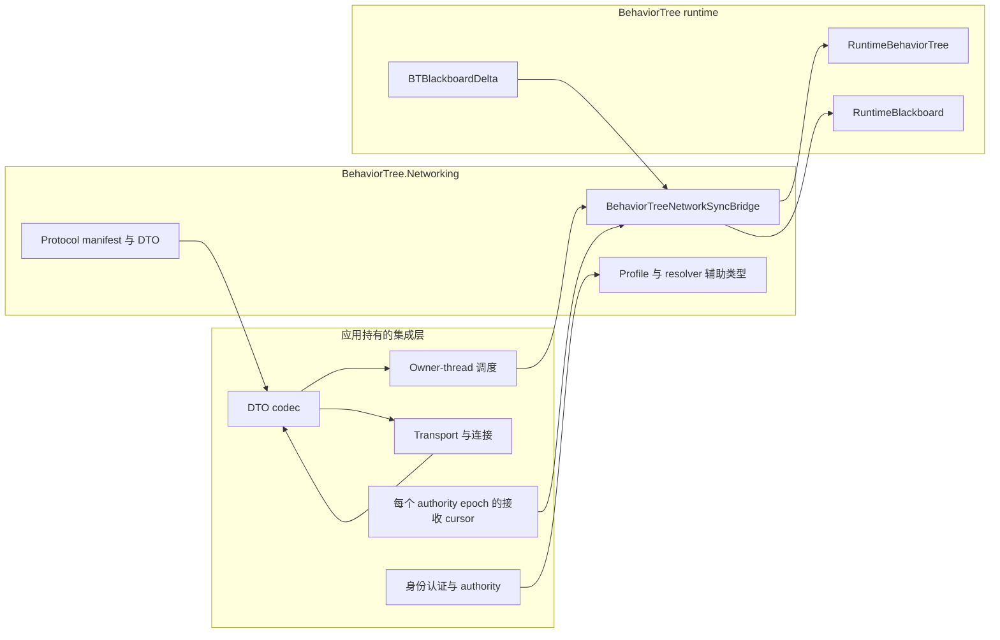

# CycloneGames.BehaviorTree.Networking

[English](./README.md) | 简体中文

`CycloneGames.BehaviorTree.Networking` 是 [CycloneGames.BehaviorTree](../CycloneGames.BehaviorTree/README.SCH.md) 与 [CycloneGames.Networking](../CycloneGames.Networking/README.SCH.md) 之间的适配桥接。它定义版本化协议、网络复制 profile、状态 payload DTO、authority generation 辅助类型，以及处理 snapshot、delta、hash 和 tick control 的 runtime bridge。基础 BehaviorTree 包不依赖本包。

## 目录

- [概览](#概览)
- [快速上手](#快速上手)
- [协议契约](#协议契约)
- [状态同步](#状态同步)
- [线程与失败行为](#线程与失败行为)
- [性能与内存](#性能与内存)
- [故障排查](#故障排查)

## 概览

### 同步哪些内容

Bridge 通过网络同步 `RuntimeBlackboard` 状态。Full snapshot 携带 managed node state 的信息性投影和 `Snapshot` scope 的 blackboard 值。Blackboard delta 携带对 `Delta` scope 或 `Networked` scope key 的增量变更。Hash-only message 不携带 payload——仅包含 blackboard 和 tree-state hash，用于轻量校验。Object key 始终为 `LocalOnly`。

### Assembly

| Assembly | `autoReferenced` | `noEngineReferences` | 使用场景 |
| --- | --- | --- | --- |
| `CycloneGames.BehaviorTree.Networking.Core` | `false` | `true` | 注册协议元数据，使用 profile 和消息 DTO |
| `CycloneGames.BehaviorTree.Networking.Runtime` | `false` | `false` | Capture 或应用 managed behavior tree 状态，authority/observer 辅助类型 |
| `CycloneGames.BehaviorTree.Networking.Tests.Editor` | N/A | N/A | 运行 EditMode tests |

Runtime assembly 引用 `CycloneGames.BehaviorTree.Runtime`、`CycloneGames.BehaviorTree.Networking.Core` 和 `CycloneGames.Networking.Core`。



## 快速上手

### 1. 添加 assembly 引用

三个 assembly 均使用 `autoReferenced: false`。协议注册和 DTO 使用需引用 `CycloneGames.BehaviorTree.Networking.Core`；bridge 和 runtime 辅助类型需引用 `CycloneGames.BehaviorTree.Networking.Runtime`。

### 2. 注册协议

```csharp
using CycloneGames.BehaviorTree.Networking;
using CycloneGames.Networking;

public static class BehaviorTreeNetworkInstaller
{
    public static void Configure(INetworkMessageCatalog catalog)
    {
        BehaviorTreeNetworkProtocol.RegisterMessageCatalog(catalog);
    }
}
```

`RegisterMessageCatalog` 会注册完整保留范围和全部内置 descriptor。如果当前持有 `INetworkMessageEndpoint`，可以调用 `TryRegisterMessageCatalog` 并根据返回值判断注册是否成功。

### 3. 创建 bridge 和接收 cursor

必须在 managed tree 的 owner thread 创建、使用并释放 bridge。每个 `(TargetNetworkId, TreeTemplateHash, AuthorityGeneration)` stream 保留一个接收 cursor：

```csharp
using System;
using CycloneGames.BehaviorTree.Networking;
using CycloneGames.BehaviorTree.Runtime.Core;

public sealed class BehaviorTreeReplicationSession : IDisposable
{
    private readonly BehaviorTreeNetworkSyncBridge _bridge;
    private readonly uint _networkId;
    private readonly ulong _treeTemplateHash;
    private BehaviorTreePayloadReceiveState _receiveState;
    private uint _authorityGeneration;

    public BehaviorTreeReplicationSession(
        uint networkId,
        ulong treeTemplateHash,
        uint authorityGeneration)
    {
        _bridge = new BehaviorTreeNetworkSyncBridge(
            BehaviorTreeNetworkProfiles.ServerAuthoritative);
        _networkId = networkId;
        _treeTemplateHash = treeTemplateHash;
        _authorityGeneration = authorityGeneration;
        _receiveState = new BehaviorTreePayloadReceiveState(
            networkId,
            treeTemplateHash,
            authorityGeneration);
    }

    public BehaviorTreeStatePayloadMessage Capture(
        RuntimeBehaviorTree tree,
        int tick,
        ushort sequence)
    {
        return _bridge.CaptureSnapshot(
            _networkId, tree, tick, sequence,
            _treeTemplateHash, _authorityGeneration);
    }

    public bool Receive(
        RuntimeBehaviorTree tree,
        in BehaviorTreeStatePayloadMessage message)
    {
        return _bridge.TryApplyPayload(tree, message, ref _receiveState);
    }

    public void BeginAuthorityEpoch(uint authorityGeneration)
    {
        _authorityGeneration = authorityGeneration;
        _receiveState.ResetProgress(authorityGeneration);
    }

    public void Dispose()
    {
        _bridge.Dispose();
    }
}
```

Transport adapter 负责序列化 DTO、选择 profile channel、发送数据、在接收端解码，并把接收操作调度到 tree owner thread。

### 4. 连接 transport 边界

1. 检查 authority、身份认证、速率、target identity 和已启用的 profile feature。
2. 在 tree owner thread capture snapshot、delta 或 hash-only message。
3. 通过 networking backend 编码并发送 DTO。
4. 使用相同的版本化契约解码传入数据。
5. 把已解码消息排队到 tree owner thread。
6. 调用 `TryApplyPayload`；只有在 live commit 前拒绝 packet 时才把返回值视为 `false`。异常必须单独处理——它们可能发生在 live state 已改变之后。

## 协议契约

本包保留消息范围 `14000-14999`。Protocol version 和 minimum supported version 均为 2：

| Constant | ID | Contract identity | 固定 schema hash | 默认 channel |
| --- | ---: | --- | --- | --- |
| `MSG_MANIFEST_HANDSHAKE` | `14000` | `BehaviorTreeManifestHandshakeMessage:v1` | `0x059263302E9505CD` | Reliable |
| `MSG_FULL_SNAPSHOT` | `14001` | `BehaviorTreeStatePayloadMessage.FullSnapshot:v2` | `0x750F7F22C73B0946` | Reliable |
| `MSG_BLACKBOARD_DELTA` | `14002` | `BehaviorTreeStatePayloadMessage.BlackboardDelta:v2` | `0x5528AAF0A310630D` | UnreliableSequenced |
| `MSG_DESYNC_REPORT` | `14003` | `BehaviorTreeDesyncReportMessage:v2` | `0x566A9F2B1C5C9202` | Reliable |
| `MSG_TICK_CONTROL` | `14004` | `BehaviorTreeTickControlMessage:v1` | `0x6299F932DCE53765` | Reliable |
| `MSG_AUTHORITY_TRANSFER` | `14005` | `BehaviorTreeAuthorityTransferMessage:v1` | `0x94B78D8EED490D89` | Reliable |

Schema hash 是固定 wire identity。当前 v2 protocol fingerprint 为 `0x633B1F15F69258AB`。`BehaviorTreeManifestHandshakeMessage.IsCompatibleWithLocalProtocol` 只比较 protocol fingerprint；应用还必须检查 tree template hash 和 required feature 的兼容性。

项目专用消息应放入项目自有 protocol manifest 和 message range，不得占用本包的保留范围。

### 接收顺序

`BehaviorTreePayloadReceiveState` 是可变值类型 cursor：

| Member | 含义 |
| --- | --- |
| `TargetNetworkId` | 网络实体或 replicated-agent identity |
| `TreeTemplateHash` | 预期 behavior-tree template identity |
| `AuthorityGeneration` | 传入 state payload 必须匹配的 authority epoch |
| `HasAcceptedPayload` | Cursor 是否已有已接收 baseline |
| `LastSequence` | 最后接收的 16-bit sequence |
| `LastTick` | 最后接收的非负 simulation tick |
| `ResetProgress()` | 清除接收进度，保留当前 authority generation |
| `ResetProgress(uint)` | 更改 authority generation 并清除接收进度 |

当传入 state payload 的 target、template 或 authority generation 不一致、tick 为负数、tick 早于已接收 tick，或 sequence 重复/过旧时，消息会被拒绝。Sequence 比较使用标准 unsigned half-range 规则：`(ushort)(candidate - baseline)` 的结果在 `1` 至 `0x7FFF` 时视为更新，`0` 视为重复，`0x8000` 至 `0xFFFF` 视为过旧或有歧义。

## 状态同步

### 可见性 scope

| `RuntimeBlackboardNetworkScope` | 包含的 entry | 使用位置 |
| --- | --- | --- |
| `Snapshot` | 带 `Snapshot` bit 的 primitive key（`Snapshot` 或 `Networked`） | Full snapshot capture、校验与 desync 比对 |
| `Networked` | 所有非 `LocalOnly` primitive key（`Snapshot`、`Delta` 或 `Networked`） | Delta 后状态、hash-only message 及其 desync 比对 |

未绑定 schema 时，两个 scope 都包含全部 primitive entry。Object entry 永远不会跨越网络边界。

### Full snapshot

`CaptureSnapshot` 记录 managed node state 的信息性投影和 `Snapshot` scope 的 blackboard 值。序列化 snapshot 使用 `BTS2` format marker。

接收时，bridge 会校验 envelope identity、顺序、payload kind、大小预算、entry limit、framing、tree-state hash 以及 candidate blackboard 的 blackboard hash。在 live Blackboard 修改前，它使用有界可复用的 scratch 遍历本地 tree，并要求 node count、每个 node state 和每个 composite auxiliary cursor 完全一致；只有匹配后才同步 Blackboard 部分。不匹配会在无修改且不推进 receive cursor 的情况下失败。

Snapshot 应用会在取得 live write lock 前解析并校验全部远端 value 与 stamp。单次锁内提交会重建单调本地 stamp，并且只替换 `Snapshot` scope。Commit 后，bridge 重新计算 hash；如果应用 callback 改写同步状态，`TryApplyPayload` 会抛出 `InvalidOperationException`。

### Blackboard delta

所有 peer 必须定义相同 schema 和 string-hash provider：

```csharp
RuntimeBlackboardSchema schema = new RuntimeBlackboardSchemaBuilder()
    .AddInt("Health", 100, RuntimeBlackboardSyncFlags.Networked)
    .AddBool("HasTarget", false, RuntimeBlackboardSyncFlags.Delta)
    .AddObject("TargetObject") // Always LocalOnly.
    .Build();

tree.Blackboard.BindSchema(schema, applyDefaults: true);

using BTBlackboardDelta tracker = BTBlackboardDelta.CreateForSchema(schema);
tracker.Attach(tree.Blackboard);

if (bridge.TryCreateBlackboardDelta(
        targetNetworkId, tree, tracker, tick, sequence,
        treeTemplateHash, out var deltaMessage, authorityGeneration))
{
    SendThroughProjectTransport(deltaMessage);
}
```

Delta byte 使用版本化 `BTDP1` frame。接收时，bridge 会 clone `Networked` scope、对 candidate 应用 delta、校验 hash，然后在一次 write lock 内提交。Revision 不匹配会在 live mutation 前抛出异常。Observer callback 在提交后、锁外执行。

### Hash-only message 与 desync report

`CreateHashOnlyMessage` 不携带 payload byte。它的 blackboard hash 覆盖 `Networked` scope；tree-state hash 覆盖全部 live node state 和 composite index。只有两个 hash 都与本地状态匹配时，`TryApplyPayload` 才会接收该消息。`IsDesynced` 与 `CreateDesyncReport` 在对应 scope 下比较本地和远端 hash。

### Profile

`BehaviorTreeNetworkProfiles` 提供的内置 profile：
- `ServerAuthoritative`
- `BlackboardReplicated`
- `DeterministicHashValidated`

调用 `Create...Builder` 或 `ToBuilder()` 在 `Build()` 前自定义。构建后的 profile 不可变。

Bridge 会直接执行 snapshot/delta byte limit、通过 `MaxTrackedBlackboardKeys` 执行传入 entry limit，以及 `WakeTreeOnRemoteDelta`。默认 transport payload 预算为 `1200` byte；state DTO 为固定字段保留 `43` byte，因此默认内层 payload 预算为 `1157` byte。

## 线程与失败行为

`RuntimeBehaviorTree` 和 `BehaviorTreeNetworkSyncBridge` 都是 owner-thread object。Bridge 在构造函数中 capture `Environment.CurrentManagedThreadId`，并拒绝来自其他线程的运行操作。Network callback 必须先把工作排队到对应 owner，再访问 bridge、tree、blackboard、receive cursor 或 delta tracker。

`RuntimeBehaviorTree.WakeUp` 是 managed tree 唯一的跨线程 producer 入口。只有接收 snapshot 或 delta 成功且 profile 启用时，bridge 才会调用 `WakeUp`。

`BTBlackboardDelta` 会在构造时 capture owner thread。已 attach blackboard 的 observer 可以在其他写入线程执行，但它只设置一个 atomic dirty signal。

失败行为：
- Malformed、oversized、stale、duplicate、target 错误、template 错误、authority 错误、hash 不匹配或 execution state 不匹配的 payload 会在 live commit 和 receive progress 推进前返回 `false`。
- 无效 capture 参数、传出 payload 超限、跨线程访问和释放后使用会抛出异常。
- Delta revision 不匹配会在 live mutation 前抛出异常；重新 capture 当前状态而非重试。
- Receive state 只在校验、live commit、提交后 hash 复查与可选 wake-up 全部成功后推进。
- Observer callback 在 live commit 后、storage lock 外执行；失败会向外传播，不滚动已提交 value，此时 cursor 尚未推进。
- 应用侧修改使已校验的提交后 hash 失效时，会在原始 commit 之后、cursor 推进之前抛出 `InvalidOperationException`。
- Authorization、abuse prevention、日志、重试、resync 和断开连接 policy 仍由应用负责。

## 性能与内存

应复用长生命周期 bridge 和 delta tracker，不要按 packet 重建。同一 owner thread、相同 profile 下的多个 tree 可以通过顺序且非重入的调用共享一个 bridge。

端到端 bridge 不是 zero-allocation：
- Snapshot 和 delta message 会分配 `byte[]` 副本。
- 传入 snapshot 校验会分配 decoded array 和 candidate blackboard collection。
- 传入 delta 校验会 clone `Networked` blackboard scope。
- Profile 构造会分配 setting dictionary 副本。

应限制 snapshot 和 delta 大小、预先确定 tracked-key capacity、限制更新频率。按最大生产 blackboard 测量 candidate-state 内存。

### 数据所有权

| 数据 | Owner | 生命周期 |
| --- | --- | --- |
| `BehaviorTreePayloadReceiveState` | Network session 或 replicated agent | 一个有效的有序 authority epoch；despawn/disconnect 时丢弃 |
| `BehaviorTreeNetworkSyncBridge` | Network composition 或 replicated-agent owner | 有效 runtime session；停止 ingress 后在 owner thread 释放 |
| `BTBlackboardDelta` | Blackboard replication owner | 已 attach blackboard 的生命周期；在 blackboard 前释放 |
| `BehaviorTreeNetworkProfile` 源数据 | 项目 composition owner | 由项目定义 |

不要使用 `PlayerPrefs`、`EditorPrefs` 或 `SessionState` 作为 protocol、profile 或接收顺序状态的权威存储。

## 故障排查

| 现象 | 原因 | 处理方式 |
| --- | --- | --- |
| `TryApplyPayload` 始终返回 `false` | Cursor target/template/authority 与 envelope 不一致 | 使用三项 stream identity 构造 cursor；仅在已接受 handoff 后调用 `ResetProgress(newAuthorityGeneration)` |
| 第一个 payload 成功，后续 packet 失败 | Sequence 重复/过旧、tick 倒退，或 cursor 被错误重建 | 每条 stream 保存一个可变 cursor 并通过 `ref` 传入；检查 half-range sequence 生成 |
| Full snapshot 有效但被拒绝 | 本地 managed node state 或 composite cursor 不一致 | 通过项目自有流程协调执行 reset/restart，然后重试 |
| 看似有效的 delta 被拒绝 | Schema key/type/sync flag 或 hash provider 不一致 | 所有 peer 使用相同版本化 schema 和 `StringHashFunc` |
| 远端没有 object reference | Object key 为 `LocalOnly` | 同步稳定 primitive ID，并在本地解析 object |
| 抛出跨线程异常 | Transport callback 直接调用 bridge | 把操作排队到 bridge/tree owner thread |
| Delta capture 因 payload size 抛出异常 | 精确 patch 大小超过 `MaxDeltaPayloadBytes` | 增加预算或减少 tracked state |
| Delta commit 抛出 revision mismatch | Candidate capture 后 blackboard 又发生变化 | 丢弃过期 candidate，在 owner thread 重新 capture |
| Receive 从 observer 抛出 `AggregateException` | Post-commit callback 失败 | 将状态视为已提交，修复 callback，显式决定 cursor/resync policy |
| Receive 抛出提交后 hash `InvalidOperationException` | Application callback 在 commit 后改写了同步状态 | 将 batch 视为已提交且 cursor 不变；停止 stream 推进，修复 callback，执行显式 reset/resync |
| Bridge 接受 payload，但 transport 拒绝 | Backend limit 或 codec overhead 低于 `1200` byte 默认值 | 测量完整编码 DTO，配置更小的 profile 内层预算 |
| 协议注册或 handshake 失败 | Range 冲突或 identity 不一致 | 比较 manifest/fingerprint，部署匹配的 v2 codec |
| 接收时内存峰值过高 | Candidate validation 和 payload copy 随状态大小增长 | 缩小有界 payload/schema 范围、降低频率，在目标硬件 profile |

## 验证

在 Unity Test Runner 中运行 EditMode tests：

```text
Window > General > Test Runner
EditMode > CycloneGames.BehaviorTree.Networking.Tests.Editor
```

Batchmode 示例：

```text
<UnityEditor> -batchmode -nographics -quit \
  -projectPath <repo-root>/UnityStarter \
  -runTests -testPlatform EditMode \
  -assemblyNames CycloneGames.BehaviorTree.Networking.Tests.Editor \
  -testResults <output>/behavior-tree-networking-editmode.xml
```

发布前还应运行基础 BehaviorTree 和 Networking test assembly、使用实际 codec 和 transport 的 Player integration test、reconnect/authority transfer/sequence wrap/丢包/full-resync 场景、malformed/oversized/unauthorized/rate-limit 安全场景、生产 schema 下的长时间 profile，以及每个发布平台的 Mono/IL2CPP build。
