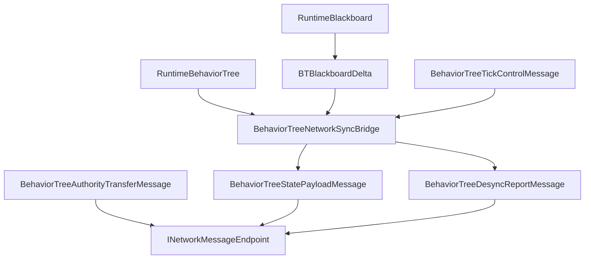

# CycloneGames.BehaviorTree.Networking

[English](./README.md) | 简体中文

`CycloneGames.BehaviorTree.Networking` 将 `CycloneGames.BehaviorTree` 桥接到 `CycloneGames.Networking`。它提供协议元数据、blackboard snapshot 和 delta 消息、desync report、tick control 消息、authority transfer 消息、profile 配置和 runtime sync bridge。基础 BehaviorTree 包不依赖 `CycloneGames.Networking`；只有当 behavior tree state 需要跨 Cyclone 网络边界传递时才需要本桥接包。

## 目录

- [概述](#概述)
- [架构](#架构)
- [快速上手](#快速上手)
- [核心概念](#核心概念)
- [使用指南](#使用指南)
- [进阶主题](#进阶主题)
- [常见场景](#常见场景)
- [性能与内存](#性能与内存)
- [故障排查](#故障排查)

## 概述

本桥接 adapter 通过协议定义的 message 和 profile 驱动的 sync bridge 将 BT 运行时状态接入网络层。它不拥有 transport、encoding、连接管理或后端 SDK 类型。传入 payload 会先按当前 `BehaviorTreeNetworkProfile` 校验后再反序列化；格式错误或过大的 payload 会被拒绝，不会修改运行时状态。

### 主要特性

- **Protocol manifest** 使用 StableHash contract identity 和消息 ID `14000-14999`。
- **State sync bridge** 支持 snapshot capture、delta creation、payload application 和 drift checking。
- **内置 profile** 对应 server-authoritative、blackboard-replicated 和 deterministic-hash 流程。
- **Tick control 和 authority transfer** 消息支持。
- **纯 C# Core 程序集**，不依赖 Unity。

## 架构

| 程序集 | 职责 | Unity 依赖 |
| --- | --- | --- |
| `CycloneGames.BehaviorTree.Networking.Core` | Protocol manifest、message DTO、profile 配置 | 无 |
| `CycloneGames.BehaviorTree.Networking.Runtime` | Runtime sync bridge、authority resolver、observer resolver | 无 |
| `CycloneGames.BehaviorTree.Networking.Tests.Editor` | EditMode 测试覆盖 | 无 |

全部 assembly 使用 `autoReferenced: false`。Consumer asmdef 必须显式引用 Core，使用 bridge 时还需引用 Runtime。



## 快速上手

在 composition root 中注册协议：

```csharp
using CycloneGames.BehaviorTree.Networking;
using CycloneGames.Networking;

public static class BehaviorTreeNetworkInstaller
{
    public static void Configure(INetworkMessageCatalog catalog)
    {
        BehaviorTreeNetworkProtocol.RegisterMessageCatalog(catalog);
    }
}
```

创建 sync bridge 并 capture snapshot：

```csharp
using CycloneGames.BehaviorTree.Networking;
using CycloneGames.BehaviorTree.Runtime.Core;

public sealed class BehaviorTreeSnapshotEndpoint
{
    private readonly BehaviorTreeNetworkSyncBridge _bridge;

    public BehaviorTreeSnapshotEndpoint()
    {
        _bridge = new BehaviorTreeNetworkSyncBridge(BehaviorTreeNetworkProfiles.ServerAuthoritative);
    }

    public BehaviorTreeStatePayloadMessage Capture(
        uint targetNetworkId, RuntimeBehaviorTree tree,
        int tick, ushort sequence)
    {
        return _bridge.CaptureSnapshot(targetNetworkId, tree, tick, sequence);
    }

    public bool Apply(RuntimeBehaviorTree tree, BehaviorTreeStatePayloadMessage message)
    {
        return _bridge.ApplyPayload(tree, message);
    }
}
```

## 核心概念

| 类型 | 作用 |
| --- | --- |
| `BehaviorTreeNetworkProfile` | 不可变 runtime profile：channel、interval、feature flags、payload limit |
| `BehaviorTreeNetworkProfiles` | 内置 profile factory |
| `BehaviorTreeNetworkProtocol` | 拥有消息范围 `14000-14999` 和默认 protocol manifest |
| `BehaviorTreeStatePayloadMessage` | 携带 full snapshot、blackboard delta 或 hash-only state payload |
| `BehaviorTreeDesyncReportMessage` | 上报本地和远端 blackboard/tree hash 用于 drift diagnostics |
| `BehaviorTreeTickControlMessage` | 携带 play、stop、wake-up 和 tick interval control 数据 |
| `BehaviorTreeAuthorityTransferMessage` | 携带 authority handoff 数据和 snapshot reference 数据 |
| `BehaviorTreeNetworkSyncBridge` | Capture snapshot、创建 delta、应用 payload、检查 drift |

### 协议消息

| Message | ID | Channel | Payload |
| --- | ---: | --- | --- |
| `MSG_MANIFEST_HANDSHAKE` | `14000` | Reliable | `BehaviorTreeManifestHandshakeMessage` |
| `MSG_FULL_SNAPSHOT` | `14001` | Reliable | `BehaviorTreeStatePayloadMessage` |
| `MSG_BLACKBOARD_DELTA` | `14002` | UnreliableSequenced | `BehaviorTreeStatePayloadMessage` |
| `MSG_DESYNC_REPORT` | `14003` | Reliable | `BehaviorTreeDesyncReportMessage` |
| `MSG_TICK_CONTROL` | `14004` | Reliable | `BehaviorTreeTickControlMessage` |
| `MSG_AUTHORITY_TRANSFER` | `14005` | Reliable | `BehaviorTreeAuthorityTransferMessage` |

每个 descriptor 声明显式可打印 ASCII `ContractId`（如 `BehaviorTreeStatePayloadMessage:v1`）和 FNV-1a 64-bit `SchemaHash`。CLR type name 不是协议 identity。Payload layout 或语义变更需分配新 contract identity。

## 使用指南

### Blackboard Delta 复制

```csharp
// 在 runtime blackboard 旁维护 BTBlackboardDelta tracker
var delta = new BTBlackboardDelta();
delta.TrackKey("Health");
delta.TrackKey("Position");
delta.Attach(serverBlackboard);

if (delta.TryFlush(serverBlackboard, out ArraySegment<byte> patch))
    SendToClients(patch);
```

### Profile 配置

```csharp
using CycloneGames.BehaviorTree.Networking;

public static class BehaviorTreeProfileFactory
{
    public static BehaviorTreeNetworkProfile Create()
    {
        return BehaviorTreeNetworkProfiles
            .CreateBlackboardReplicatedBuilder()
            .SetInt("project.max_remote_blackboard_keys", 24)
            .Build();
    }
}
```

## 进阶主题

### 协议 Identity

`BehaviorTreeNetworkProtocol.CreateProtocolManifest` 构建完整 manifest。`RegisterMessageCatalog` 原子提交完整 range 和全部 descriptor；部分注册会被拒绝。Protocol fingerprint 包含 range、message ID、contract identity、schema hash、channel 和 payload limit。

项目专用消息应放入独立的项目自有 manifest，使用 `NetworkMessageRanges.User`。

### 扩展点

- 为自定义 authority ownership 实现 `IBehaviorTreeNetworkAuthorityResolver`。
- 为外部 observer 数据实现 `IBehaviorTreeNetworkObserverSource`。
- 具体后端传输代码放在 adapter 中，发送和接收本包声明的 DTO。

## 常见场景

### 服务端权威 Snapshot 同步

```csharp
// 服务端：capture 并发送
var snapshot = BTNetworkSync.CaptureSnapshot(serverTree);
byte[] data = BTNetworkSync.SerializeSnapshot(snapshot);
SendToClient(data);

// 客户端：反序列化并应用
var snap = BTNetworkSync.DeserializeSnapshot(data);
BTNetworkSync.ApplyBlackboardSnapshot(clientTree, snap);
```

### 哈希 Desync 检测

```csharp
ulong serverHash = serverBlackboard.ComputeHash();
SendToClient(serverHash);

if (BTNetworkSync.CheckDesync(clientTree, serverHash))
{
    // 请求全量重同步
    var snapshot = BTNetworkSync.CaptureSnapshot(serverTree);
    BTNetworkSync.ApplyBlackboardSnapshot(clientTree, snapshot);
}
```

## 性能与内存

本包不执行文件 I/O，热路径不分配托管内存，不持有线程或原生容器。Profile 是纯运行时对象；transport encoding 和网络 I/O 位于外部。Profile 中的 payload limit 在序列化前限制 snapshot 和 delta 大小。

## 故障排查

| 现象 | 可能原因 | 解决方法 |
| --- | --- | --- |
| `ApplyPayload` 返回 `false` | 传入 payload 过大或格式错误 | 确认 client/server profile payload limit 一致；检查序列化 schema version |
| Protocol manifest 注册失败 | `SchemaHash` 不兼容或 message ID 重叠 | 确保所有 peer 使用相同 contract identity；检查 message range 冲突 |
| Delta 同步丢失变更 | 重复写入相同值未推进 stamp | 写入相同值不会产生 delta patch |
| Desync report 泛滥 | Client/server blackboard schema 不一致 | 验证 schema 一致性；确认双方 `Snapshot`/`Delta` key flag 匹配 |

## 验证

```text
Unity Test Runner > EditMode > CycloneGames.BehaviorTree.Networking.Tests.Editor
Unity Test Runner > EditMode > CycloneGames.BehaviorTree.Tests.Editor
Unity Test Runner > EditMode > CycloneGames.Networking.Tests.Editor
```
